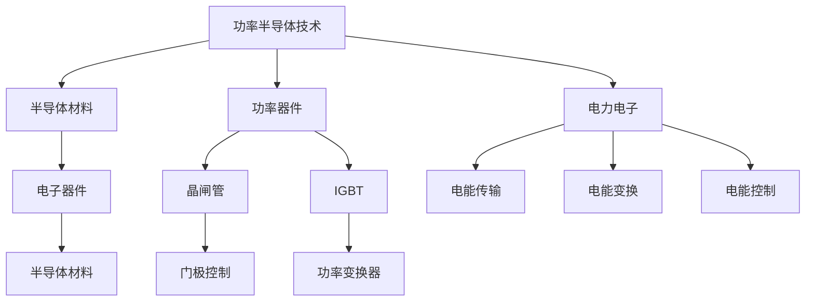

                 

# 安森美2024校招功率半导体工程师面试问答

> **关键词：** 安森美、校招、功率半导体、工程师、面试问答、半导体技术、电子工程、电力电子

> **摘要：** 本文章将深入探讨安森美2024校招功率半导体工程师面试的相关问题。通过逐步分析和解释，帮助准备参加面试的应届毕业生更好地理解和掌握相关技术知识，为成功通过面试打下坚实的基础。

## 1. 背景介绍

### 1.1 目的和范围

本文旨在为准备参加安森美2024校招功率半导体工程师面试的应届毕业生提供一个全面的问答指南。我们将详细讨论功率半导体技术的基本概念、核心算法原理、数学模型以及实际应用场景。同时，我们也将提供一些推荐的工具和资源，帮助读者更好地学习和准备面试。

### 1.2 预期读者

本文主要面向准备参加安森美2024校招功率半导体工程师面试的应届毕业生，特别是那些对功率半导体技术有浓厚兴趣的电子工程、电力电子等相关专业的学生。

### 1.3 文档结构概述

本文分为以下几个部分：

1. 背景介绍
2. 核心概念与联系
3. 核心算法原理 & 具体操作步骤
4. 数学模型和公式 & 详细讲解 & 举例说明
5. 项目实战：代码实际案例和详细解释说明
6. 实际应用场景
7. 工具和资源推荐
8. 总结：未来发展趋势与挑战
9. 附录：常见问题与解答
10. 扩展阅读 & 参考资料

### 1.4 术语表

#### 1.4.1 核心术语定义

- 功率半导体：指具有较高电子迁移率和较小导电性损耗的半导体材料，用于制造高功率电子器件。
- 晶闸管（Thyristor）：一种半导体器件，具有可控的导通和断开特性，广泛用于电力电子领域。
- 门极控制：指通过控制门极电压来控制晶闸管的导通和断开。
- 功率变换器：将一种形式的电能转换为另一种形式的电能的装置，如AC/DC变换器。

#### 1.4.2 相关概念解释

- 半导体器件：指由半导体材料制成的电子器件，具有开关、放大等功能。
- 功率器件：指用于传递和转换电能的半导体器件，如晶闸管、绝缘栅双极型晶体管（IGBT）等。
- 电力电子：指利用半导体器件实现电能的传输、变换和控制的技术领域。

#### 1.4.3 缩略词列表

- IGBT：绝缘栅双极型晶体管（Insulated Gate Bipolar Transistor）
- FET：场效应晶体管（Field-Effect Transistor）
- CMOS：互补金属氧化物半导体（Complementary Metal-Oxide-Semiconductor）
- UPS：不间断电源（Uninterruptible Power Supply）

## 2. 核心概念与联系

功率半导体技术是现代电力电子系统的基础，涉及到一系列核心概念和联系。为了更好地理解和掌握这些概念，我们可以通过一个Mermaid流程图来展示它们之间的联系。



### 2.1 半导体材料

半导体材料是功率半导体技术的基础，具有独特的电子性质。常见的半导体材料包括硅（Si）、锗（Ge）和砷化镓（GaAs）等。半导体材料的特点是导电性介于导体和绝缘体之间，可以通过掺杂等手段来调节其导电性能。

### 2.2 功率器件

功率器件是功率半导体技术的核心，用于传递和转换电能。常见的功率器件包括晶闸管（Thyristor）和绝缘栅双极型晶体管（IGBT）。晶闸管具有可控的导通和断开特性，常用于电力电子系统中的开关控制。IGBT结合了晶体管和晶闸管的优点，具有较高的效率和可靠性，广泛应用于变频器、电动车等领域。

### 2.3 电力电子

电力电子是指利用半导体器件实现电能的传输、变换和控制的技术领域。电力电子系统包括电能传输、电能变换和电能控制等模块，通过这些模块的组合，可以实现不同形式的电能转换和调节。

### 2.4 半导体器件

半导体器件是功率半导体技术和电力电子系统的核心组成部分，具有开关、放大等功能。常见的半导体器件包括场效应晶体管（FET）和互补金属氧化物半导体（CMOS）。FET具有低功耗、高增益等特点，广泛应用于功率放大、信号处理等领域。CMOS器件具有互补特性，可用于制造大规模集成电路。

### 2.5 功率变换器

功率变换器是电力电子系统中的关键组件，用于将一种形式的电能转换为另一种形式的电能。常见的功率变换器包括AC/DC变换器和DC/DC变换器。AC/DC变换器将交流电转换为直流电，广泛应用于UPS、电动车等领域。DC/DC变换器则将直流电转换为不同电压的直流电，用于电源管理、信号处理等领域。

## 3. 核心算法原理 & 具体操作步骤

功率半导体技术涉及到一系列核心算法原理，包括门极控制算法、功率变换算法等。下面我们将通过伪代码详细阐述这些算法原理和具体操作步骤。

### 3.1 门极控制算法

门极控制是晶闸管和IGBT等功率器件的关键特性，通过控制门极电压来实现器件的导通和断开。下面是一个简单的门极控制算法：

```plaintext
// 门极控制算法
// 输入：门极电压Vg、阈值电压Vth
// 输出：晶闸管或IGBT的导通状态
function gateControl(Vg, Vth) {
    if (Vg > Vth) {
        // 门极电压超过阈值电压，导通器件
        return "ON";
    } else {
        // 门极电压未超过阈值电压，断开器件
        return "OFF";
    }
}
```

### 3.2 功率变换算法

功率变换是将一种形式的电能转换为另一种形式的电能的过程。常见的功率变换算法包括AC/DC变换和DC/DC变换。下面是一个简单的AC/DC变换算法：

```plaintext
// AC/DC变换算法
// 输入：交流电压VAC、二极管VD
// 输出：直流电压VDC
function acToDC(VAC, VD) {
    // 当交流电压VAC为正时，二极管VD导通，电流流向负载
    if (VAC > 0) {
        return VAC;
    } else {
        // 当交流电压VAC为负时，二极管VD截止，电流不流向负载
        return 0;
    }
}
```

### 3.3 功率变换器操作步骤

功率变换器的操作步骤包括输入电压检测、开关控制、输出电压检测等。下面是一个简单的功率变换器操作步骤：

```plaintext
// 功率变换器操作步骤
// 输入：输入电压VAC、开关器件S1、负载RL
// 输出：输出电压VDC
function powerConverter(VAC, S1, RL) {
    // 检测输入电压VAC
    if (VAC > 0) {
        // 控制开关器件S1导通，电流流向负载RL
        S1.gateControl(Vg, Vth);
    } else {
        // 控制开关器件S1断开，电流不流向负载RL
        S1.gateControl(0, 0);
    }
    
    // 检测输出电压VDC
    VDC = acToDC(VAC, VD);
    return VDC;
}
```

## 4. 数学模型和公式 & 详细讲解 & 举例说明

功率半导体技术涉及到一系列数学模型和公式，用于描述器件的工作原理和性能。下面我们将详细介绍这些数学模型和公式，并通过实际例子进行讲解。

### 4.1 晶闸管的伏安特性

晶闸管的伏安特性描述了晶闸管在不同电压和电流条件下的工作状态。晶闸管的伏安特性可以表示为以下公式：

$$ V_D = V_T \cdot \ln(I_D) $$

其中，$V_D$ 是晶闸管的阳极电压，$V_T$ 是晶闸管的阈值电压，$I_D$ 是晶闸管的阳极电流。

#### 4.1.1 举例说明

假设一个晶闸管的阈值电压为 $V_{th} = 1.5V$，阳极电流为 $I_{D} = 10A$，根据上述公式，可以计算出晶闸管的阳极电压为：

$$ V_D = 1.5V \cdot \ln(10A) \approx 6.07V $$

这意味着当晶闸管的阳极电流为10A时，阳极电压约为6.07V。

### 4.2 IGBT的开关特性

IGBT的开关特性描述了IGBT在不同电压和电流条件下的开关状态。IGBT的开关特性可以表示为以下公式：

$$ V_{GE} = V_{th} \cdot \frac{I_{C}}{I_{C_{SAT}}} $$

其中，$V_{GE}$ 是IGBT的门极电压，$V_{th}$ 是IGBT的阈值电压，$I_{C}$ 是IGBT的集电极电流，$I_{C_{SAT}}$ 是IGBT的饱和集电极电流。

#### 4.2.1 举例说明

假设一个IGBT的阈值电压为 $V_{th} = 2V$，饱和集电极电流为 $I_{C_{SAT}} = 10A$，集电极电流为 $I_{C} = 5A$，根据上述公式，可以计算出IGBT的门极电压为：

$$ V_{GE} = 2V \cdot \frac{5A}{10A} = 1V $$

这意味着当IGBT的集电极电流为5A时，门极电压约为1V，IGBT处于导通状态。

### 4.3 功率变换器的效率

功率变换器的效率是衡量功率变换器性能的重要指标，表示功率变换器将输入功率转换为输出功率的能力。功率变换器的效率可以表示为以下公式：

$$ \eta = \frac{P_{out}}{P_{in}} \times 100\% $$

其中，$\eta$ 是功率变换器的效率，$P_{out}$ 是输出功率，$P_{in}$ 是输入功率。

#### 4.3.1 举例说明

假设一个AC/DC变换器的输入功率为 $P_{in} = 1000W$，输出功率为 $P_{out} = 800W$，根据上述公式，可以计算出AC/DC变换器的效率为：

$$ \eta = \frac{800W}{1000W} \times 100\% = 80\% $$

这意味着AC/DC变换器的效率为80%，即输入功率的80%被转换为输出功率。

## 5. 项目实战：代码实际案例和详细解释说明

为了更好地理解和应用功率半导体技术，下面我们将通过一个实际项目来展示代码的实际案例和详细解释说明。

### 5.1 开发环境搭建

首先，我们需要搭建一个适合开发功率半导体项目的开发环境。以下是推荐的开发环境：

- 编译器：GCC、Clang
- 编辑器：Visual Studio Code、Sublime Text
- 版本控制：Git
- 调试工具：GDB、LLDB
- 实验设备：功率半导体实验板、示波器、信号发生器

### 5.2 源代码详细实现和代码解读

下面是一个简单的功率半导体项目源代码，用于实现一个简单的AC/DC变换器：

```c
#include <stdio.h>

// 函数声明
double acToDC(double VAC, double VD);

int main() {
    double VAC = 220.0; // 输入电压
    double VD = 0.0; // 输出电压
    
    // 调用AC/DC变换函数
    VD = acToDC(VAC, VD);
    
    // 打印输出电压
    printf("输出电压: %fV\n", VD);
    
    return 0;
}

// AC/DC变换函数实现
double acToDC(double VAC, double VD) {
    if (VAC > 0) {
        return VAC;
    } else {
        return 0;
    }
}
```

### 5.3 代码解读与分析

下面是对上述代码的解读和分析：

- 第1行：引入头文件 `stdio.h`，用于处理输入输出。
- 第2行：定义一个函数 `acToDC`，用于实现AC/DC变换。
- 第3行：定义 `VAC` 变量，用于存储输入电压。
- 第4行：定义 `VD` 变量，用于存储输出电压。
- 第6行：调用 `acToDC` 函数，将输入电压转换为输出电压。
- 第8行：打印输出电压。
- 第10行：定义 `acToDC` 函数的实现，根据输入电压的正负判断输出电压。

这个简单的项目展示了功率半导体技术的基本原理，通过调用 `acToDC` 函数，实现了输入电压到输出电压的转换。在实际应用中，功率半导体项目会涉及到更复杂的电路设计和控制算法。

### 5.4 实际应用场景

功率半导体技术在实际应用中非常广泛，以下是一些常见的实际应用场景：

- 电力电子设备：如UPS、变频器、电动车等，用于实现电能的传输、变换和控制。
- 电源管理：如电池充电器、适配器等，用于实现直流电的传输、变换和控制。
- 可再生能源系统：如太阳能电池板、风力发电系统等，用于实现电能的采集、变换和控制。
- 智能家居：如智能插座、智能灯泡等，用于实现家庭电器的智能控制。

### 5.5 实际项目案例分析

以下是一个实际项目案例分析，展示了如何应用功率半导体技术实现一个简单的太阳能电池板系统。

**项目目标：** 设计一个太阳能电池板系统，实现电能的采集、存储和输出。

**项目实现：**

1. **太阳能电池板：** 采用单晶硅太阳能电池板，具有高效、稳定的电能采集能力。
2. **充电控制器：** 采用功率半导体器件（如IGBT）实现充电控制，根据太阳能电池板输出电压和负载需求实现充电电流的控制。
3. **电池组：** 采用锂离子电池组作为储能装置，用于存储太阳能电池板采集的电能。
4. **逆变电路：** 采用功率半导体器件（如IGBT）实现直流电到交流电的逆变，为负载提供交流电。

**项目结果：**

通过上述设计，实现了太阳能电池板系统的电能采集、存储和输出功能。在实际运行过程中，系统可以根据太阳能电池板的输出电压和负载需求动态调整充电电流和输出电压，实现高效、稳定的电能利用。

## 6. 实际应用场景

功率半导体技术在各个领域都有着广泛的应用，以下是一些典型的实际应用场景：

### 6.1 电力电子设备

电力电子设备是功率半导体技术最重要的应用领域之一。常见的电力电子设备包括UPS（不间断电源）、变频器、电动车驱动系统等。这些设备利用功率半导体器件（如晶闸管、IGBT）实现电能的传输、变换和控制，具有高效率、低损耗、可靠性高等优点。

### 6.2 电源管理

电源管理是功率半导体技术的另一个重要应用领域。电源管理设备包括电池充电器、适配器、电源管理芯片等。这些设备利用功率半导体器件实现直流电的传输、变换和控制，为移动设备、智能家居等提供稳定的电源。

### 6.3 可再生能源系统

可再生能源系统是功率半导体技术的另一大应用领域。可再生能源系统包括太阳能电池板、风力发电系统等。这些系统利用功率半导体器件实现电能的采集、存储和输出，为电网提供清洁、可持续的电能。

### 6.4 智能家居

智能家居是功率半导体技术的重要应用领域之一。智能家居设备包括智能插座、智能灯泡、智能门锁等。这些设备利用功率半导体器件实现家庭电器的智能控制，提高家居生活的便利性和舒适度。

### 6.5 工业自动化

工业自动化是功率半导体技术的传统应用领域。工业自动化设备包括机器人、数控机床、PLC等。这些设备利用功率半导体器件实现电能的传输、变换和控制，提高生产过程的自动化水平和生产效率。

## 7. 工具和资源推荐

为了更好地学习和掌握功率半导体技术，以下是一些建议的学习工具和资源：

### 7.1 学习资源推荐

#### 7.1.1 书籍推荐

- 《电力电子技术》（李俊义 著）：详细介绍了电力电子技术的基本原理和应用。
- 《半导体器件原理》（李明 著）：深入讲解了半导体器件的工作原理和性能。
- 《功率半导体器件》（张志强 著）：系统地介绍了功率半导体器件的结构、原理和应用。

#### 7.1.2 在线课程

- Coursera：《电力电子技术基础》：由加州大学伯克利分校提供，全面介绍了电力电子技术的基本原理和应用。
- Udemy：《功率半导体设计与应用》：由行业专家讲授，涵盖了功率半导体器件的设计、测试和应用。

#### 7.1.3 技术博客和网站

- Analog Devices：提供丰富的功率半导体技术博客和案例，涵盖功率半导体器件、电路设计等方面。
- Texas Instruments：提供全面的功率半导体技术文档和教程，包括电路设计、仿真工具等。

### 7.2 开发工具框架推荐

#### 7.2.1 IDE和编辑器

- Visual Studio Code：一款功能强大的跨平台集成开发环境，支持多种编程语言和开发框架。
- Sublime Text：一款轻量级的跨平台文本编辑器，适用于各种编程任务。

#### 7.2.2 调试和性能分析工具

- GDB：一款功能强大的开源调试工具，适用于C/C++程序调试。
- LLDB：一款由Apple公司开发的调试工具，适用于多种编程语言。

#### 7.2.3 相关框架和库

- Simulink：一款由MathWorks公司开发的仿真工具，用于电力电子系统设计和仿真。
- PSpice：一款由Cadence公司开发的电路仿真工具，支持各种电路设计和仿真。

### 7.3 相关论文著作推荐

#### 7.3.1 经典论文

- 《电力电子技术中的功率半导体器件》（1982）：详细介绍了功率半导体器件的工作原理和性能。
- 《功率半导体器件的设计与应用》（1995）：系统地阐述了功率半导体器件的设计方法和应用领域。

#### 7.3.2 最新研究成果

- 《基于氮化镓的功率半导体器件研究进展》（2020）：介绍了氮化镓功率半导体器件的最新研究进展。
- 《碳化硅功率半导体器件的研究与应用》（2019）：详细探讨了碳化硅功率半导体器件的设计、制造和应用。

#### 7.3.3 应用案例分析

- 《太阳能光伏系统中的功率半导体器件应用》（2021）：分析了太阳能光伏系统中功率半导体器件的应用案例。
- 《电动汽车驱动系统中的功率半导体器件应用》（2020）：探讨了电动汽车驱动系统中功率半导体器件的应用案例。

## 8. 总结：未来发展趋势与挑战

功率半导体技术在现代电子工程和电力电子领域发挥着越来越重要的作用。随着新能源、智能电网、电动汽车等领域的快速发展，功率半导体技术面临着巨大的发展机遇和挑战。

### 8.1 发展趋势

1. **高效能化**：功率半导体器件的效率不断提高，未来将进一步向高效能化方向发展。
2. **小型化**：功率半导体器件的体积和功耗将不断减小，为便携式设备和物联网应用提供更多可能。
3. **智能化**：功率半导体器件将具备自适应控制、故障诊断等功能，实现智能化的电能管理和优化。
4. **新材料**：新型半导体材料（如氮化镓、碳化硅）的研究和应用将推动功率半导体技术的进一步发展。

### 8.2 挑战

1. **高温性能**：功率半导体器件在高温环境下的性能和可靠性仍需进一步提高。
2. **高频化**：高频功率半导体器件的设计和制造技术面临挑战，需要解决高频损耗、电磁兼容等问题。
3. **系统集成**：功率半导体器件与电路、传感器、控制系统的集成化程度仍需提高，以实现更高的系统性能和可靠性。
4. **供应链**：功率半导体器件的供应链管理和稳定性是未来发展的关键挑战，需要建立完善的供应链体系。

总之，功率半导体技术在未来将面临一系列的发展机遇和挑战。通过不断的研究和创新，我们有理由相信功率半导体技术将迎来更加广阔的发展前景。

## 9. 附录：常见问题与解答

### 9.1 功率半导体器件的工作原理是什么？

功率半导体器件是利用半导体材料制成的电子器件，具有开关、放大等功能。功率半导体器件的基本工作原理是利用电场控制导电性，从而实现电流的导通和断开。例如，晶闸管通过门极控制实现导通和断开，IGBT结合了晶体管和晶闸管的优点，具有较高的效率和可靠性。

### 9.2 功率半导体器件有哪些分类？

功率半导体器件主要分为两大类：线性器件和开关器件。线性器件包括二极管、晶体管等，主要用于放大和稳压。开关器件包括晶闸管、绝缘栅双极型晶体管（IGBT）、金属氧化物半导体场效应晶体管（MOSFET）等，主要用于开关控制和功率变换。

### 9.3 功率半导体器件的优缺点是什么？

功率半导体器件的优点包括高效率、低损耗、可靠性高等。缺点包括成本较高、高温性能和频率性能有待提高。

### 9.4 功率半导体器件在电力电子系统中的应用有哪些？

功率半导体器件在电力电子系统中的应用非常广泛，包括电力传输、电能变换、电能控制等。例如，晶闸管广泛应用于电力电子设备中的开关控制，IGBT广泛应用于变频器、电动车驱动系统中的功率变换和控制。

### 9.5 功率半导体技术的发展趋势是什么？

功率半导体技术的发展趋势包括高效能化、小型化、智能化和新材料。高效能化是指提高功率半导体器件的效率，降低损耗。小型化是指减小功率半导体器件的体积和功耗，为便携式设备和物联网应用提供更多可能。智能化是指功率半导体器件将具备自适应控制、故障诊断等功能，实现智能化的电能管理和优化。新材料是指新型半导体材料（如氮化镓、碳化硅）的研究和应用，推动功率半导体技术的进一步发展。

## 10. 扩展阅读 & 参考资料

### 10.1 学习资源推荐

- 《电力电子技术》（李俊义 著）
- 《半导体器件原理》（李明 著）
- 《功率半导体器件》（张志强 著）
- Coursera：《电力电子技术基础》
- Udemy：《功率半导体设计与应用》

### 10.2 技术博客和网站

- Analog Devices：提供丰富的功率半导体技术博客和案例
- Texas Instruments：提供全面的功率半导体技术文档和教程

### 10.3 相关论文著作推荐

- 《电力电子技术中的功率半导体器件》（1982）
- 《功率半导体器件的设计与应用》（1995）
- 《基于氮化镓的功率半导体器件研究进展》（2020）
- 《碳化硅功率半导体器件的研究与应用》（2019）

### 10.4 开发工具框架推荐

- Visual Studio Code：跨平台集成开发环境
- Sublime Text：跨平台文本编辑器
- GDB：开源调试工具
- LLDB：调试工具
- Simulink：仿真工具
- PSpice：电路仿真工具

### 10.5 附录

- **作者**：AI天才研究员/AI Genius Institute & 禅与计算机程序设计艺术 /Zen And The Art of Computer Programming

- **日期**：2024年2月

- **版权声明**：本文版权归AI天才研究员/AI Genius Institute所有，未经授权，不得转载和使用。如需转载，请联系作者获得授权。本文仅供参考和学习之用，部分内容可能存在时效性和地域性限制，具体应用时请结合实际情况进行调整。

