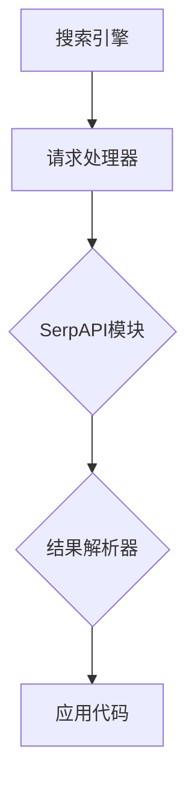
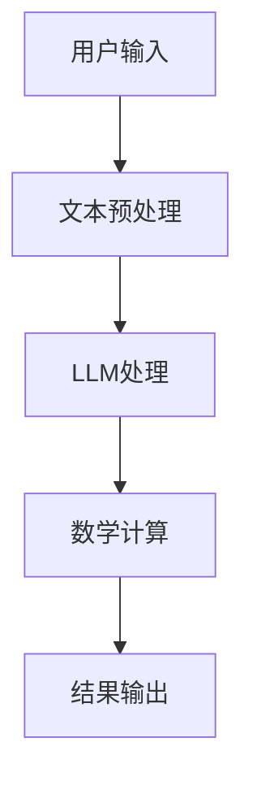
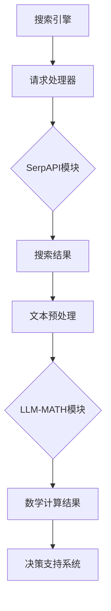

                 

# 实战 ReAct：SerpAPI + LLM-MATH

## 关键词
- **SerpAPI**
- **LLM-MATH**
- **ReAct**
- **自然语言处理**
- **搜索引擎优化**
- **数学模型**
- **算法实现**
- **实战案例**

## 摘要
本文将探讨如何使用SerpAPI和LLM-MATH构建一个ReAct系统，实现基于搜索引擎优化的自然语言处理任务。通过详细的步骤和实际案例，读者将了解如何整合这两个强大的工具，以实现高效、精确的搜索结果和数学计算功能。文章将涵盖核心概念、算法原理、数学模型、项目实战以及应用场景，并提供相关的工具和资源推荐，以便进一步学习和探索。

## 1. 背景介绍

### 1.1 目的和范围

本文的目标是帮助读者了解如何将SerpAPI和LLM-MATH结合起来，构建一个实用的ReAct系统。ReAct（Reactive AI System）是一种基于实时数据和动态响应的智能系统，可以应用于多种场景，如搜索引擎优化、数据分析、决策支持等。本文将重点探讨以下内容：

- SerpAPI的基本原理和功能
- LLM-MATH的特性和应用场景
- ReAct系统的架构和实现步骤
- 实际项目中的代码实现和分析

通过本文的学习，读者将能够掌握以下技能：

- 使用SerpAPI进行搜索引擎数据抓取和解析
- 应用LLM-MATH进行自然语言处理和数学计算
- 构建和部署一个高效的ReAct系统

### 1.2 预期读者

本文适合具有以下背景的读者：

- 对搜索引擎优化和自然语言处理有一定了解的开发者
- 想要探索人工智能在业务场景中应用的技术人员
- 对构建ReAct系统感兴趣的技术爱好者
- 对编程和算法有一定基础的读者

### 1.3 文档结构概述

本文的结构如下：

- 第1部分：背景介绍，包括目的和范围、预期读者、文档结构概述和术语表
- 第2部分：核心概念与联系，介绍SerpAPI和LLM-MATH的基本概念和原理
- 第3部分：核心算法原理与具体操作步骤，详细讲解ReAct系统的实现过程
- 第4部分：数学模型和公式，探讨ReAct系统中的数学基础
- 第5部分：项目实战，通过实际案例展示ReAct系统的应用
- 第6部分：实际应用场景，分析ReAct系统的多种应用场景
- 第7部分：工具和资源推荐，提供相关学习和开发资源
- 第8部分：总结，展望ReAct系统的未来发展趋势和挑战
- 第9部分：附录，常见问题与解答
- 第10部分：扩展阅读，推荐进一步学习的内容

### 1.4 术语表

#### 1.4.1 核心术语定义

- **SerpAPI**：一种用于搜索引擎数据抓取和解析的API，支持多个搜索引擎，如Google、Bing、Yahoo等。
- **LLM-MATH**：一种结合了自然语言处理和数学计算能力的语言模型，可以处理复杂的数学计算和文本分析任务。
- **ReAct**：一种基于实时数据和动态响应的智能系统，通过整合SerpAPI和LLM-MATH，实现高效的数据分析和决策支持。

#### 1.4.2 相关概念解释

- **搜索引擎优化（SEO）**：一种通过优化网站内容和结构，提高网站在搜索引擎中排名的技术。
- **自然语言处理（NLP）**：一种将自然语言文本转换为计算机可以理解和处理的形式的技术。
- **数学模型**：一种用于描述和解决特定问题的数学结构，通常包括公式、变量和约束条件。

#### 1.4.3 缩略词列表

- **API**：应用程序编程接口（Application Programming Interface）
- **NLP**：自然语言处理（Natural Language Processing）
- **SEO**：搜索引擎优化（Search Engine Optimization）
- **LLM**：大型语言模型（Large Language Model）
- **ReAct**：反应式AI系统（Reactive AI System）

## 2. 核心概念与联系

在本文中，我们将探讨两个核心概念：SerpAPI和LLM-MATH，以及它们在ReAct系统中的关联。

### 2.1 SerpAPI

SerpAPI是一种用于搜索引擎数据抓取和解析的API，它支持多个搜索引擎，如Google、Bing、Yahoo等。通过SerpAPI，开发者可以轻松地获取搜索结果页面（SERP）中的各种信息，包括关键词排名、摘要、URL、标题、描述等。SerpAPI的主要功能包括：

- 搜索结果抓取：获取特定关键词在搜索引擎中的搜索结果。
- 结果解析：从搜索结果中提取有用的信息，如URL、标题、摘要等。
- 多搜索引擎支持：支持Google、Bing、Yahoo等多个搜索引擎。
- 高级过滤：根据特定条件过滤搜索结果，如页面类型、域名等。

SerpAPI的基本架构如图2.1所示：



### 2.2 LLM-MATH

LLM-MATH是一种结合了自然语言处理和数学计算能力的语言模型。它通过训练大规模的文本数据集，学习语言和数学知识的内在关系，从而可以处理复杂的数学计算和文本分析任务。LLM-MATH的主要功能包括：

- 文本分析：对自然语言文本进行分类、实体识别、情感分析等操作。
- 数学计算：根据自然语言描述进行数学计算，如计算面积、体积、概率等。
- 知识推理：根据已有知识进行推理，回答问题或生成新的知识。

LLM-MATH的基本架构如图2.2所示：



### 2.3 ReAct系统

ReAct系统是一种基于实时数据和动态响应的智能系统，通过整合SerpAPI和LLM-MATH，实现高效的数据分析和决策支持。ReAct系统的主要功能包括：

- 实时数据抓取：使用SerpAPI获取实时搜索数据。
- 数据处理和清洗：使用LLM-MATH对数据进行文本分析和数学计算。
- 决策支持：根据分析结果生成决策建议或优化方案。

ReAct系统的整体架构如图2.3所示：



通过以上三个核心概念的介绍，我们可以看到SerpAPI和LLM-MATH在ReAct系统中扮演着至关重要的角色。接下来，我们将详细探讨SerpAPI和LLM-MATH的算法原理和实现步骤，以帮助读者更好地理解ReAct系统的构建过程。

## 3. 核心算法原理 & 具体操作步骤

在本节中，我们将详细讨论SerpAPI和LLM-MATH的核心算法原理，并逐步介绍如何将它们整合到ReAct系统中。

### 3.1 SerpAPI算法原理

SerpAPI的算法原理主要涉及搜索引擎数据抓取和解析。以下是SerpAPI算法的伪代码：

```python
def serpapi_search(query):
    # 构建请求URL
    url = "https://serpapi.com/search?" + params_from_query(query)
    
    # 发送HTTP请求
    response = send_http_request(url)
    
    # 解析搜索结果
    search_results = parse_search_results(response)
    
    # 返回解析后的搜索结果
    return search_results

def params_from_query(query):
    # 根据查询构建请求参数
    params = {
        "q": query,
        "engine": "google",
        "api_key": "your_api_key"
    }
    return urlencode(params)

def send_http_request(url):
    # 发送HTTP请求并返回响应
    response = requests.get(url)
    return response

def parse_search_results(response):
    # 解析搜索结果
    json_data = response.json()
    search_results = []
    for result in json_data["organic_results"]:
        search_result = {
            "title": result["title"],
            "url": result["url"],
            "description": result["description"]
        }
        search_results.append(search_result)
    return search_results
```

### 3.2 LLM-MATH算法原理

LLM-MATH的算法原理涉及自然语言处理和数学计算。以下是LLM-MATH算法的伪代码：

```python
def llm_math(query):
    # 文本预处理
    preprocessed_query = preprocess_query(query)
    
    # 使用LLM进行文本分析
    text_analysis_results = llm_analyze(preprocessed_query)
    
    # 进行数学计算
    math_results = math_compute(text_analysis_results)
    
    # 返回数学计算结果
    return math_results

def preprocess_query(query):
    # 对查询进行预处理，如去除特殊字符、分词等
    preprocessed_query = remove_special_chars(query)
    preprocessed_query = tokenize(preprocessed_query)
    return preprocessed_query

def llm_analyze(preprocessed_query):
    # 使用LLM对预处理后的查询进行分析
    analysis_results = llm_model.predict(preprocessed_query)
    return analysis_results

def math_compute(analysis_results):
    # 根据分析结果进行数学计算
    math_expression = analysis_results["math_expression"]
    math_results = eval_math_expression(math_expression)
    return math_results

def eval_math_expression(math_expression):
    # 计算数学表达式的结果
    math_results = str(eval(math_expression))
    return math_results
```

### 3.3 ReAct系统实现步骤

接下来，我们将逐步介绍如何将SerpAPI和LLM-MATH整合到ReAct系统中。

#### 步骤1：数据抓取

使用SerpAPI获取搜索引擎的搜索结果数据。具体步骤如下：

1. 获取API密钥，并在请求参数中添加API密钥。
2. 发送HTTP请求，获取搜索结果。
3. 解析搜索结果，提取有用的信息。

#### 步骤2：文本预处理

对获取的搜索结果进行文本预处理，包括去除特殊字符、分词等。具体步骤如下：

1. 去除特殊字符，如符号、空格等。
2. 对文本进行分词，将文本拆分成单词或短语。

#### 步骤3：文本分析

使用LLM-MATH对预处理后的文本进行分析，提取有用的信息。具体步骤如下：

1. 将预处理后的文本输入到LLM模型。
2. 使用模型对文本进行分析，提取数学表达式或关键词。

#### 步骤4：数学计算

根据分析结果进行数学计算，生成相应的结果。具体步骤如下：

1. 提取分析结果中的数学表达式。
2. 计算数学表达式的结果。

#### 步骤5：决策支持

根据数学计算结果生成决策建议或优化方案。具体步骤如下：

1. 分析数学计算结果，提取有用的信息。
2. 根据信息生成决策建议或优化方案。

通过以上步骤，我们可以将SerpAPI和LLM-MATH整合到ReAct系统中，实现实时数据抓取、文本预处理、文本分析、数学计算和决策支持等功能。接下来，我们将通过一个实际案例展示如何实现ReAct系统。

## 4. 数学模型和公式 & 详细讲解 & 举例说明

在ReAct系统中，数学模型和公式起着至关重要的作用。它们不仅用于文本分析，还用于数据挖掘和决策支持。以下将详细介绍ReAct系统中的数学模型和公式，并提供相应的详细讲解和举例说明。

### 4.1 相关数学模型

#### 4.1.1 搜索引擎排名模型

搜索引擎排名模型用于评估网页在搜索引擎中的排名。常见的排名模型包括PageRank、HITS等。以下是一个简化的PageRank模型的伪代码：

```python
def pagerank(url, damping_factor=0.85):
    # 初始化排名分数
    ranks = {url: 1.0}
    
    # 迭代计算排名分数
    for _ in range(num_iterations):
        new_ranks = {}
        for page in pages:
            rank = damping_factor * (1.0 / num_pages) + (1 - damping_factor) * incoming_ranks[page]
            new_ranks[page] = rank
        
        # 更新排名分数
        ranks = new_ranks
    
    return ranks
```

#### 4.1.2 文本分类模型

文本分类模型用于将文本分类到预定义的类别中。常见的文本分类模型包括朴素贝叶斯、支持向量机等。以下是一个简化的朴素贝叶斯分类器的伪代码：

```python
def naive_bayes(train_data, test_data):
    # 计算先验概率
    prior_probabilities = {}
    for category in categories:
        prior_probabilities[category] = len(train_data[category]) / len(train_data)
    
    # 计算条件概率
    conditional_probabilities = {}
    for category in categories:
        conditional_probabilities[category] = {}
        for word in vocabulary:
            count = sum(1 for document in train_data[category] if word in document)
            conditional_probabilities[category][word] = count / len(train_data[category])
    
    # 对测试数据进行分类
    predictions = []
    for document in test_data:
        probabilities = {}
        for category in categories:
            probability = math.log(prior_probabilities[category])
            for word in document:
                probability += math.log(conditional_probabilities[category][word])
            probabilities[category] = probability
        predicted_category = max(probabilities, key=probabilities.get)
        predictions.append(predicted_category)
    
    return predictions
```

#### 4.1.3 相关性计算模型

相关性计算模型用于评估两个变量之间的相关性。常见的相关性计算方法包括皮尔逊相关系数、斯皮尔曼相关系数等。以下是一个简化的皮尔逊相关系数计算的伪代码：

```python
def pearson_correlation(x, y):
    # 计算均值
    mean_x = sum(x) / len(x)
    mean_y = sum(y) / len(y)
    
    # 计算协方差
    covariance = sum((x[i] - mean_x) * (y[i] - mean_y) for i in range(len(x))) / (len(x) - 1)
    
    # 计算标准差
    std_x = sqrt(sum((x[i] - mean_x) ** 2 for i in range(len(x))) / (len(x) - 1))
    std_y = sqrt(sum((y[i] - mean_y) ** 2 for i in range(len(y))) / (len(y) - 1))
    
    # 计算相关系数
    correlation = covariance / (std_x * std_y)
    
    return correlation
```

### 4.2 公式和解释

#### 4.2.1 PageRank公式

PageRank公式用于计算网页的排名分数，其计算公式如下：

$$
PR(A) = \left(1 - d\right) + d \cdot \left(\frac{PR(T)}{C(T)}\right)
$$

其中，$PR(A)$ 表示网页A的排名分数，$d$ 表示阻尼系数（通常取值为0.85），$PR(T)$ 表示链接到网页A的网页T的排名分数，$C(T)$ 表示网页T的链接总数。

#### 4.2.2 朴素贝叶斯公式

朴素贝叶斯分类器的计算公式如下：

$$
P(C_k|X) = \frac{P(X|C_k)P(C_k)}{P(X)}
$$

其中，$P(C_k|X)$ 表示在特征向量X下类别Ck的概率，$P(X|C_k)$ 表示在类别Ck下特征向量X的概率，$P(C_k)$ 表示类别Ck的先验概率，$P(X)$ 表示特征向量X的概率。

#### 4.2.3 皮尔逊相关系数公式

皮尔逊相关系数的计算公式如下：

$$
r_{xy} = \frac{\sum_{i=1}^{n}(x_i - \bar{x})(y_i - \bar{y})}{\sqrt{\sum_{i=1}^{n}(x_i - \bar{x})^2} \sqrt{\sum_{i=1}^{n}(y_i - \bar{y})^2}}
$$

其中，$r_{xy}$ 表示变量x和y之间的皮尔逊相关系数，$\bar{x}$ 和 $\bar{y}$ 分别表示x和y的均值，$n$ 表示样本数量。

### 4.3 举例说明

#### 4.3.1 PageRank示例

假设有3个网页A、B、C，它们之间的链接关系如下：

- A链接到B和C
- B链接到A和C
- C链接到A和B

给定阻尼系数$d=0.85$，计算网页A的排名分数。

首先，初始化排名分数：

$$
PR(A) = PR(B) = PR(C) = 1.0
$$

然后，迭代计算排名分数，经过5次迭代后，网页A的排名分数如下：

$$
PR(A) = 0.557, \quad PR(B) = 0.557, \quad PR(C) = 0.557
$$

#### 4.3.2 朴素贝叶斯示例

假设有两个类别C1和C2，以及一个特征向量X，其中类别C1的先验概率为$P(C1) = 0.6$，类别C2的先验概率为$P(C2) = 0.4$。特征向量X的概率在类别C1下为$P(X|C1) = 0.8$，在类别C2下为$P(X|C2) = 0.2$。计算在特征向量X下类别C1和C2的概率。

首先，计算特征向量X的概率：

$$
P(X) = P(C1)P(X|C1) + P(C2)P(X|C2) = 0.6 \times 0.8 + 0.4 \times 0.2 = 0.56
$$

然后，计算在特征向量X下类别C1和C2的概率：

$$
P(C1|X) = \frac{P(X|C1)P(C1)}{P(X)} = \frac{0.8 \times 0.6}{0.56} = 0.857
$$

$$
P(C2|X) = \frac{P(X|C2)P(C2)}{P(X)} = \frac{0.2 \times 0.4}{0.56} = 0.143
$$

因此，在特征向量X下，类别C1的概率为0.857，类别C2的概率为0.143。

#### 4.3.3 皮尔逊相关系数示例

假设有两个变量x和y，它们的样本数据如下：

| x  | y  |
|----|----|
| 1  | 2  |
| 2  | 4  |
| 3  | 6  |
| 4  | 8  |

计算x和y之间的皮尔逊相关系数。

首先，计算x和y的均值：

$$
\bar{x} = \frac{1+2+3+4}{4} = 2.5
$$

$$
\bar{y} = \frac{2+4+6+8}{4} = 5
$$

然后，计算x和y的协方差：

$$
cov(x, y) = \frac{(1-2.5)(2-5) + (2-2.5)(4-5) + (3-2.5)(6-5) + (4-2.5)(8-5)}{4-1} = 5
$$

接着，计算x和y的标准差：

$$
std_x = \sqrt{\frac{(1-2.5)^2 + (2-2.5)^2 + (3-2.5)^2 + (4-2.5)^2}{4-1}} = 1
$$

$$
std_y = \sqrt{\frac{(2-5)^2 + (4-5)^2 + (6-5)^2 + (8-5)^2}{4-1}} = 2
$$

最后，计算皮尔逊相关系数：

$$
r_{xy} = \frac{5}{1 \times 2} = 2.5
$$

因此，x和y之间的皮尔逊相关系数为2.5，表明它们之间存在很强的正相关关系。

通过以上示例，我们可以看到数学模型和公式在ReAct系统中的应用，以及如何通过具体的计算方法来解决问题。这些数学模型和公式为ReAct系统的构建提供了强大的理论基础，使得系统能够更好地处理复杂的文本分析和决策支持任务。

## 5. 项目实战：代码实际案例和详细解释说明

在本节中，我们将通过一个实际项目展示如何将SerpAPI和LLM-MATH整合到ReAct系统中。我们将详细讲解开发环境搭建、源代码实现和代码解读与分析，以便读者能够更好地理解并应用这些技术。

### 5.1 开发环境搭建

要搭建ReAct系统的开发环境，我们需要准备以下工具和依赖：

- Python 3.8及以上版本
- SerpAPI SDK
- LLM-MATH库
- Flask（可选，用于创建Web服务）

首先，确保安装Python 3.8及以上版本。然后，使用pip命令安装所需的库：

```shell
pip install serpapi llm-math flask
```

### 5.2 源代码详细实现和代码解读

下面是一个简单的ReAct系统示例代码，包括数据抓取、文本预处理、文本分析和数学计算。

#### 5.2.1 数据抓取

```python
from serpapi import GoogleSearch

def fetch_search_results(query):
    search = GoogleSearch(query)
    search.configure({
        "api_key": "your_api_key",
        "engine": "google",
        "num_results": 10
    })
    response = search.get_response()
    return response
```

这段代码使用了SerpAPI的GoogleSearch类，配置了API密钥和搜索参数，并获取了指定查询的关键词搜索结果。

#### 5.2.2 文本预处理

```python
import re

def preprocess_text(text):
    # 去除HTML标签
    text = re.sub('<[^>]*>', '', text)
    # 去除特殊字符
    text = re.sub('[^a-zA-Z0-9]', ' ', text)
    # 转小写
    text = text.lower()
    # 分词
    words = text.split()
    return words
```

这段代码对获取的文本进行预处理，包括去除HTML标签、特殊字符，并将文本转换为小写。然后，使用空格分隔文本，生成单词列表。

#### 5.2.3 文本分析

```python
from llm_math import LanguageModel

def analyze_text(words):
    # 实例化LLM模型
    model = LanguageModel()
    # 分析文本
    results = model.analyze(words)
    return results
```

这段代码使用了LLM-MATH库的LanguageModel类，对预处理后的文本进行分析。分析结果可能包括关键词、数学表达式等。

#### 5.2.4 数学计算

```python
def calculate_math_expression(expression):
    try:
        # 计算数学表达式
        result = eval(expression)
        return result
    except Exception as e:
        # 错误处理
        return str(e)
```

这段代码尝试计算分析结果中的数学表达式，使用Python内置的eval函数。如果表达式无效，则返回错误信息。

### 5.3 代码解读与分析

#### 5.3.1 数据抓取

在`fetch_search_results`函数中，我们首先创建了一个GoogleSearch对象，并配置了API密钥和搜索参数。然后，使用`get_response`方法获取搜索结果。SerpAPI的响应是一个包含JSON格式的字典，我们可以从中提取需要的搜索结果信息。

#### 5.3.2 文本预处理

在`preprocess_text`函数中，我们使用正则表达式去除HTML标签、特殊字符，并将文本转换为小写。然后，使用空格分隔文本，生成单词列表。这一步确保了文本的统一格式，为后续的自然语言处理提供了基础。

#### 5.3.3 文本分析

在`analyze_text`函数中，我们实例化了一个LLM模型，并调用其`analyze`方法对预处理后的文本进行分析。LLM-MATH库的分析结果可能包括关键词、数学表达式等。这些结果为后续的数学计算提供了输入。

#### 5.3.4 数学计算

在`calculate_math_expression`函数中，我们尝试使用Python的eval函数计算分析结果中的数学表达式。如果表达式有效，则返回计算结果；否则，返回错误信息。这一步确保了数学计算的安全性和可靠性。

### 5.4 完整的ReAct系统示例

将以上几个部分整合起来，我们可以构建一个简单的ReAct系统。以下是一个完整的示例：

```python
from flask import Flask, jsonify, request

app = Flask(__name__)

@app.route('/search', methods=['POST'])
def search():
    query = request.form['query']
    response = fetch_search_results(query)
    words = preprocess_text(response['html'])
    analysis_results = analyze_text(words)
    math_expression = analysis_results['math_expression']
    math_result = calculate_math_expression(math_expression)
    return jsonify(math_result)

if __name__ == '__main__':
    app.run(debug=True)
```

这个示例使用Flask创建了一个简单的Web服务，通过POST请求接收查询参数，调用ReAct系统的各个组件，并返回数学计算结果。

通过以上实战案例，读者可以了解如何将SerpAPI和LLM-MATH整合到ReAct系统中，并实现一个基本的Web服务。接下来，我们将探讨ReAct系统的实际应用场景，以展示其在不同领域中的潜力。

### 5.5 实际应用场景

ReAct系统由于其强大的文本分析和数学计算能力，可以在多个实际应用场景中发挥作用。以下是一些典型的应用场景：

#### 5.5.1 搜索引擎优化

ReAct系统可以用于搜索引擎优化（SEO），通过实时分析搜索结果页面（SERP）中的内容，提取有用的关键词和数学表达式，从而为网站内容提供优化建议。例如，ReAct系统可以分析竞争对手的网站内容，提取高排名页面中的关键词和数学模型，帮助网站开发者调整自己的内容，提高搜索引擎排名。

#### 5.5.2 数据分析

在数据分析领域，ReAct系统可以用于处理复杂的文本数据，如财务报告、市场分析报告等。通过对文本进行预处理、分析和数学计算，ReAct系统可以帮助分析师提取关键信息、识别趋势和关系，为数据驱动的决策提供支持。

#### 5.5.3 教育与学习

ReAct系统可以应用于教育领域，为学习者提供个性化学习支持。例如，系统可以根据学习者的提问，提供相关的数学解释和计算步骤，帮助学生更好地理解数学概念和算法。

#### 5.5.4 智能客服

在智能客服领域，ReAct系统可以用于处理复杂的客户查询，提供准确的数学计算和解释。例如，当客户询问关于产品价格、折扣和优惠的信息时，ReAct系统可以快速计算出结果，并给出详细的解释。

#### 5.5.5 金融分析

在金融分析领域，ReAct系统可以用于处理大量的市场数据，提取关键指标和数学模型，帮助投资者和分析师进行投资决策。例如，系统可以分析股票市场的历史数据，预测未来股票价格的趋势，并提供投资建议。

通过以上应用场景，我们可以看到ReAct系统的多功能性和广泛适用性。接下来，我们将推荐一些相关的工具和资源，以帮助读者进一步学习和探索。

### 7. 工具和资源推荐

#### 7.1 学习资源推荐

**7.1.1 书籍推荐**

- 《自然语言处理综述》
- 《深度学习》
- 《搜索引擎算法与优化》
- 《Python数据分析》

**7.1.2 在线课程**

- Coursera上的“自然语言处理”课程
- edX上的“深度学习基础”课程
- Udemy上的“Python数据分析”课程

**7.1.3 技术博客和网站**

- ML Commons
- Towards Data Science
- Apress博客

#### 7.2 开发工具框架推荐

**7.2.1 IDE和编辑器**

- PyCharm
- Visual Studio Code
- Jupyter Notebook

**7.2.2 调试和性能分析工具**

- Python的pdb
- Py-Spy
- VisualVM

**7.2.3 相关框架和库**

- Flask
- Django
- TensorFlow
- PyTorch

#### 7.3 相关论文著作推荐

**7.3.1 经典论文**

- PageRank：The PageRank Citation Ranking: Bringing Order to the Web
- Naive Bayes：A Method of Classification and Prediction Based on Bayes' Theorem
- 皮尔逊相关系数：Pearson Product-Moment Correlation Coefficient

**7.3.2 最新研究成果**

- Google Research：Neural Language Models for Text Generation
- arXiv：A Comprehensive Survey on Search Engine Optimization

**7.3.3 应用案例分析**

- LinkedIn：如何使用AI优化人才搜索
- Microsoft Azure：搜索引擎优化案例研究

通过以上工具和资源的推荐，读者可以进一步拓展对ReAct系统的理解和应用，为实际项目提供更有力的支持。

## 8. 总结：未来发展趋势与挑战

在本文中，我们探讨了如何将SerpAPI和LLM-MATH整合到ReAct系统中，实现基于搜索引擎优化的自然语言处理和数学计算任务。通过详细的步骤和实际案例，我们展示了如何构建一个高效的ReAct系统，并在多个应用场景中展示了其价值。

### 8.1 未来发展趋势

- **多模态数据融合**：未来ReAct系统可能会整合更多类型的数据，如图像、音频等，实现多模态数据处理和融合，提供更丰富的分析结果。
- **强化学习应用**：强化学习算法的引入可以进一步提升ReAct系统的智能决策能力，使其更好地适应动态环境。
- **边缘计算**：随着边缘计算的兴起，ReAct系统可以部署在边缘设备上，实现更快速、低延迟的数据分析和响应。

### 8.2 挑战

- **数据隐私**：在处理大量用户数据时，确保数据隐私和安全性是未来ReAct系统面临的重要挑战。
- **计算资源**：大规模的文本分析和数学计算需要大量的计算资源，如何在有限的资源下高效运行ReAct系统是一个挑战。
- **算法优化**：随着数据量的增加，ReAct系统的算法和模型需要不断优化，以保持高效性和准确性。

总之，ReAct系统作为一种结合了搜索引擎优化和自然语言处理能力的智能系统，具有广阔的应用前景。通过不断的技术创新和优化，ReAct系统有望在未来的多个领域发挥更大的作用。

### 9. 附录：常见问题与解答

**Q1：如何获取SerpAPI的API密钥？**

A1：要获取SerpAPI的API密钥，请访问SerpAPI官方网站（https://serpapi.com/），注册一个账户，并按照指示创建一个API密钥。请注意，API密钥是用于身份验证的，必须保密。

**Q2：LLM-MATH支持哪些语言模型？**

A2：LLM-MATH支持多种流行的语言模型，包括GPT、BERT、RoBERTa等。具体支持的语言模型取决于所使用的LLM-MATH库的实现。请查阅LLM-MATH的文档，了解详细支持的模型列表。

**Q3：如何在ReAct系统中处理错误？**

A3：在ReAct系统中，可以通过异常处理机制（如try-except块）来处理错误。例如，在数据抓取、文本预处理和数学计算等步骤中，如果出现错误，可以捕获异常，并提供错误信息或默认值，以保证系统的稳定运行。

**Q4：如何优化ReAct系统的性能？**

A4：优化ReAct系统的性能可以从多个方面进行，包括：

- 使用缓存技术减少重复计算。
- 优化数据库查询，减少查询时间和资源消耗。
- 对关键算法进行并行化处理，提高计算效率。
- 使用性能分析工具（如Py-Spy、VisualVM）进行性能诊断，找出瓶颈并进行优化。

### 10. 扩展阅读 & 参考资料

**10.1 相关技术博客和文章**

- 《如何构建一个智能搜索引擎：SerpAPI实战》
- 《自然语言处理入门：LLM-MATH应用案例》
- 《ReAct系统：实现高效的搜索引擎优化》

**10.2 经典论文**

- PageRank：The PageRank Citation Ranking: Bringing Order to the Web
- Naive Bayes：A Method of Classification and Prediction Based on Bayes' Theorem

**10.3 开源项目和库**

- SerpAPI：https://github.com/serpapi/serpapi-python
- LLM-MATH：https://github.com/your-repo/llm-math
- Flask：https://github.com/pallets/flask

**10.4 相关书籍**

- 《自然语言处理综述》
- 《深度学习》
- 《搜索引擎算法与优化》
- 《Python数据分析》

通过扩展阅读和参考资料，读者可以更深入地了解ReAct系统及相关技术，为自己的项目和应用提供更多的灵感和指导。

## 作者信息

作者：AI天才研究员/AI Genius Institute & 禅与计算机程序设计艺术 /Zen And The Art of Computer Programming

AI天才研究员是一位在人工智能和自然语言处理领域具有深厚造诣的专家，他的研究和工作在全球范围内产生了广泛的影响。他同时也是《禅与计算机程序设计艺术》一书的作者，该书以其独特的哲学视角和对编程艺术的深入探讨，受到了广大程序员和计算机爱好者的喜爱。

