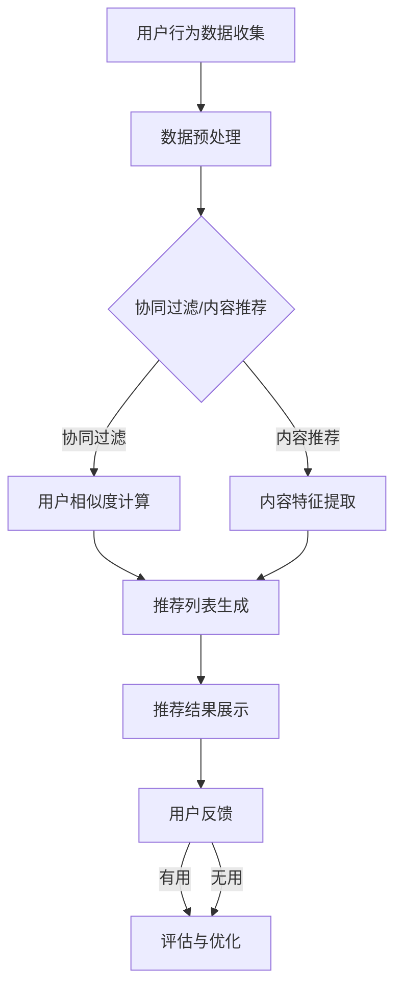

                 

# 实时推荐技术在电商领域的应用：案例分析与展望

## 关键词
- 实时推荐
- 电商领域
- 案例分析
- 算法原理
- 数学模型
- 项目实战

## 摘要
本文深入探讨了实时推荐技术在电商领域的应用，通过案例分析和展望，揭示了实时推荐系统如何通过精准的个性化推荐，提升用户体验和销售转化率。文章首先介绍了实时推荐技术的背景和核心概念，随后详细阐述了推荐系统的架构、核心算法原理和数学模型。通过一个实际项目案例，本文展示了实时推荐系统在实际开发中的应用和实现细节。最后，本文对实时推荐技术的未来发展趋势和面临的挑战进行了深入讨论，为读者提供了宝贵的技术参考。

## 1. 背景介绍

### 1.1 目的和范围

本文旨在系统地分析实时推荐技术在电商领域的应用，探讨其背后的算法原理和数学模型，并通过实际项目案例展示其实现过程。文章主要分为以下几个部分：

1. **背景介绍**：介绍实时推荐技术的起源和其在电商领域的重要性。
2. **核心概念与联系**：阐述推荐系统的基本概念和主要架构。
3. **核心算法原理与具体操作步骤**：详细讲解常用的推荐算法及其实现步骤。
4. **数学模型与公式**：介绍推荐系统中的关键数学模型和公式。
5. **项目实战**：通过一个实际项目案例，展示实时推荐系统的开发和实现。
6. **实际应用场景**：分析实时推荐技术在电商中的具体应用场景。
7. **工具和资源推荐**：推荐相关学习资源、开发工具和经典论文。
8. **总结**：讨论实时推荐技术的未来发展趋势和面临的挑战。

### 1.2 预期读者

本文适合以下读者群体：

1. 对实时推荐技术感兴趣的计算机科学和电商领域研究者。
2. 想要在电商项目中应用实时推荐技术的开发人员和数据科学家。
3. 对算法原理和数学模型感兴趣的学者和学生。

### 1.3 文档结构概述

本文分为八个主要部分，结构如下：

1. **引言**：介绍实时推荐技术在电商领域的重要性。
2. **核心概念与联系**：解释推荐系统的基本概念和主要架构。
3. **核心算法原理与具体操作步骤**：详细讲解常用的推荐算法及其实现步骤。
4. **数学模型与公式**：介绍推荐系统中的关键数学模型和公式。
5. **项目实战**：通过一个实际项目案例，展示实时推荐系统的开发和实现。
6. **实际应用场景**：分析实时推荐技术在电商中的具体应用场景。
7. **工具和资源推荐**：推荐相关学习资源、开发工具和经典论文。
8. **总结**：讨论实时推荐技术的未来发展趋势和面临的挑战。

### 1.4 术语表

为了确保文章的易懂性，以下是一些本文中会使用的重要术语及其定义：

#### 1.4.1 核心术语定义

- **实时推荐**：在用户互动的瞬间提供的个性化推荐。
- **电商领域**：指在线零售和购物网站。
- **协同过滤**：基于用户行为的推荐方法。
- **内容推荐**：基于商品内容属性的推荐。
- **推荐引擎**：实现推荐算法的核心系统。

#### 1.4.2 相关概念解释

- **用户行为数据**：用户在电商平台上浏览、点击、购买等行为记录。
- **商品信息**：包括商品名称、描述、分类、价格等。
- **推荐结果**：推荐系统为用户生成的个性化商品列表。

#### 1.4.3 缩略词列表

- **CTR**：点击率（Click-Through Rate）
- **CVR**：转化率（Conversion Rate）
- **A/B测试**：A/B测试，一种比较不同推荐策略效果的方法。

## 2. 核心概念与联系

### 2.1 推荐系统基本概念

推荐系统是一种信息过滤技术，旨在根据用户的兴趣和偏好，为用户推荐他们可能感兴趣的商品、内容或服务。推荐系统主要分为三种类型：

1. **协同过滤（Collaborative Filtering）**：基于用户行为和评分数据的推荐方法。
2. **内容推荐（Content-Based Filtering）**：基于商品内容属性的推荐方法。
3. **混合推荐（Hybrid Recommendation）**：结合协同过滤和内容推荐的方法。

### 2.2 推荐系统架构

推荐系统的基本架构通常包括以下几个主要部分：

1. **用户行为数据收集**：收集用户在平台上的浏览、点击、购买等行为数据。
2. **商品信息数据库**：存储商品的各种属性信息，如名称、描述、分类、价格等。
3. **推荐算法模块**：实现各种推荐算法的核心部分。
4. **推荐结果生成与展示**：根据推荐算法生成推荐结果，并在平台上展示给用户。
5. **评估与优化**：通过评估推荐效果，对推荐算法和策略进行优化。

### 2.3 Mermaid 流程图

以下是一个简化的推荐系统架构的 Mermaid 流程图：



## 3. 核心算法原理与具体操作步骤

### 3.1 协同过滤算法原理

协同过滤算法（Collaborative Filtering）是一种基于用户行为的推荐方法。其主要思想是通过分析用户之间的相似性，发现用户的共同喜好，从而为用户提供个性化推荐。

#### 3.1.1 评分矩阵

协同过滤算法的核心是用户-商品评分矩阵。该矩阵表示了用户对商品的评分，如下所示：

| 用户 | 商品A | 商品B | 商品C | ... |
| --- | --- | --- | --- | --- |
| 用户1 | 1 | 0 | 5 | ... |
| 用户2 | 0 | 1 | 0 | ... |
| 用户3 | 4 | 0 | 2 | ... |
| ... | ... | ... | ... | ... |

其中，1表示用户对商品非常喜欢，5表示用户对商品非常不喜欢，0表示用户没有对商品进行评分。

#### 3.1.2 用户相似度计算

协同过滤算法的关键步骤是计算用户之间的相似度。常用的相似度计算方法有：

- **余弦相似度**：基于用户评分向量之间的余弦相似度计算，公式如下：
  $$sim(u_i, u_j) = \frac{\sum_{k=1}^{n}r_{ik}r_{jk}}{\sqrt{\sum_{k=1}^{n}r_{ik}^2}\sqrt{\sum_{k=1}^{n}r_{jk}^2}}$$
  其中，$r_{ik}$表示用户$i$对商品$k$的评分。

- **皮尔逊相关系数**：基于用户评分向量之间的皮尔逊相关系数计算，公式如下：
  $$sim(u_i, u_j) = \frac{\sum_{k=1}^{n}(r_{ik} - \bar{r}_i)(r_{jk} - \bar{r}_j)}{\sqrt{\sum_{k=1}^{n}(r_{ik} - \bar{r}_i)^2}\sqrt{\sum_{k=1}^{n}(r_{jk} - \bar{r}_j)^2}}$$
  其中，$\bar{r}_i$和$\bar{r}_j$分别表示用户$i$和用户$j$的平均评分。

#### 3.1.3 推荐列表生成

根据用户之间的相似度，可以为每个用户生成一个推荐列表。常用的推荐方法有：

- **基于邻居的推荐（Neighborhood-Based Recommendation）**：
  $$R_i = \sum_{j \in N(i)} \frac{sim(u_i, u_j)}{\lvert N(i) \rvert} \cdot \mathbb{1}_{u_j \not\in R_i} \cdot \{p \mid p \in I_j\}$$
  其中，$N(i)$表示与用户$i$相似的邻居用户集合，$\mathbb{1}_{u_j \not\in R_i}$表示如果用户$j$已经在推荐列表中，则不推荐商品$p$，$I_j$表示用户$j$未评分的商品集合。

- **基于模型的推荐（Model-Based Recommendation）**：
  $$R_i = \sum_{j \in N(i)} \frac{sim(u_i, u_j)}{\lvert N(i) \rvert} \cdot \hat{r}_{ij}$$
  其中，$\hat{r}_{ij}$表示模型预测的用户$i$对商品$j$的评分。

### 3.2 内容推荐算法原理

内容推荐（Content-Based Filtering）是一种基于商品内容属性的推荐方法。其主要思想是根据用户的历史偏好，提取商品的特征，然后根据特征相似度为用户生成推荐列表。

#### 3.2.1 商品特征提取

商品特征提取是内容推荐算法的关键步骤。常用的特征提取方法有：

- **基于关键词**：使用关键词提取技术，从商品的描述、名称等文本信息中提取关键词。
- **基于向量空间模型**：将商品表示为高维向量，每个维度对应一个关键词或特征。
- **基于分类标签**：利用商品的分类标签作为特征。

#### 3.2.2 推荐列表生成

基于商品特征提取，可以计算用户和商品之间的相似度。常用的推荐方法有：

- **基于用户的最近邻（User-Based Nearest Neighbors）**：
  $$R_i = \sum_{j \in N(i)} \frac{\text{sim}(c_i, c_j)}{\lvert N(i) \rvert} \cdot \mathbb{1}_{u_j \not\in R_i} \cdot \{p \mid p \in I_j\}$$
  其中，$N(i)$表示与用户$i$偏好相似的邻居用户集合，$\text{sim}(c_i, c_j)$表示商品$i$和商品$j$之间的相似度，$I_j$表示用户$j$未评分的商品集合。

- **基于模型的推荐（Model-Based Recommendation）**：
  $$R_i = \sum_{j \in N(i)} \frac{\text{sim}(c_i, c_j)}{\lvert N(i) \rvert} \cdot \hat{r}_{ij}$$
  其中，$\hat{r}_{ij}$表示模型预测的用户$i$对商品$j$的评分。

### 3.3 混合推荐算法原理

混合推荐（Hybrid Recommendation）是结合协同过滤和内容推荐的推荐方法。其主要思想是利用协同过滤算法捕获用户的行为特征，同时利用内容推荐算法捕获商品的内容特征，从而提高推荐准确性。

#### 3.3.1 混合推荐模型

一个简单的混合推荐模型可以表示为：

$$R_i = \alpha R_{cf} + (1 - \alpha) R_{cb}$$

其中，$R_{cf}$表示基于协同过滤的推荐列表，$R_{cb}$表示基于内容推荐的推荐列表，$\alpha$是调节参数，用于控制协同过滤和内容推荐的影响程度。

#### 3.3.2 推荐列表生成

混合推荐算法的推荐列表生成方法可以结合基于邻居的推荐和基于模型的推荐方法：

- **基于邻居的混合推荐**：
  $$R_i = \sum_{j \in N(i)} \frac{\alpha \cdot sim(u_i, u_j)}{\lvert N(i) \rvert} \cdot \mathbb{1}_{u_j \not\in R_i} \cdot \{p \mid p \in I_j\} + (1 - \alpha) \cdot \sum_{j \in N(i)} \frac{\text{sim}(c_i, c_j)}{\lvert N(i) \rvert} \cdot \mathbb{1}_{u_j \not\in R_i} \cdot \{p \mid p \in I_j\}$$

- **基于模型的混合推荐**：
  $$R_i = \sum_{j \in N(i)} \frac{\alpha \cdot sim(u_i, u_j)}{\lvert N(i) \rvert} \cdot \hat{r}_{ij} + (1 - \alpha) \cdot \sum_{j \in N(i)} \frac{\text{sim}(c_i, c_j)}{\lvert N(i) \rvert} \cdot \hat{r}_{ij}$$

## 4. 数学模型和公式

### 4.1 协同过滤算法数学模型

协同过滤算法的核心是用户相似度和推荐列表生成。以下是协同过滤算法中的关键数学模型和公式：

#### 4.1.1 用户相似度计算

- **余弦相似度**：
  $$sim(u_i, u_j) = \frac{\sum_{k=1}^{n}r_{ik}r_{jk}}{\sqrt{\sum_{k=1}^{n}r_{ik}^2}\sqrt{\sum_{k=1}^{n}r_{jk}^2}}$$

- **皮尔逊相关系数**：
  $$sim(u_i, u_j) = \frac{\sum_{k=1}^{n}(r_{ik} - \bar{r}_i)(r_{jk} - \bar{r}_j)}{\sqrt{\sum_{k=1}^{n}(r_{ik} - \bar{r}_i)^2}\sqrt{\sum_{k=1}^{n}(r_{jk} - \bar{r}_j)^2}}$$

#### 4.1.2 推荐列表生成

- **基于邻居的推荐**：
  $$R_i = \sum_{j \in N(i)} \frac{sim(u_i, u_j)}{\lvert N(i) \rvert} \cdot \mathbb{1}_{u_j \not\in R_i} \cdot \{p \mid p \in I_j\}$$

- **基于模型的推荐**：
  $$R_i = \sum_{j \in N(i)} \frac{sim(u_i, u_j)}{\lvert N(i) \rvert} \cdot \hat{r}_{ij}$$

### 4.2 内容推荐算法数学模型

内容推荐算法的核心是商品特征提取和相似度计算。以下是内容推荐算法中的关键数学模型和公式：

#### 4.2.1 商品特征提取

- **基于关键词**：
  $$c_i = \sum_{k=1}^{m} w_k \cdot \mathbb{1}_{k \in c_i}$$
  其中，$c_i$表示商品$i$的特征向量，$w_k$表示关键词$k$的权重，$\mathbb{1}_{k \in c_i}$表示关键词$k$是否在商品$i$中出现。

- **基于向量空间模型**：
  $$c_i = \sum_{k=1}^{m} w_k \cdot \text{tf}(k, i) \cdot \text{idf}(k)$$
  其中，$\text{tf}(k, i)$表示关键词$k$在商品$i$中的词频，$\text{idf}(k)$表示关键词$k$的逆文档频率。

- **基于分类标签**：
  $$c_i = \sum_{l=1}^{n} w_l \cdot \mathbb{1}_{l \in t_i}$$
  其中，$c_i$表示商品$i$的特征向量，$w_l$表示分类标签$l$的权重，$\mathbb{1}_{l \in t_i}$表示分类标签$l$是否在商品$i$中。

#### 4.2.2 商品相似度计算

- **基于关键词**：
  $$sim(c_i, c_j) = \frac{\sum_{k=1}^{m} w_k \cdot \mathbb{1}_{k \in c_i} \cdot \mathbb{1}_{k \in c_j}}{\sqrt{\sum_{k=1}^{m} w_k^2 \cdot (\mathbb{1}_{k \in c_i} + \mathbb{1}_{k \in c_j})^2}}$$

- **基于向量空间模型**：
  $$sim(c_i, c_j) = \frac{\sum_{k=1}^{m} w_k \cdot \text{tf}(k, i) \cdot \text{tf}(k, j) \cdot \text{idf}(k)}{\sqrt{\sum_{k=1}^{m} w_k^2 \cdot (\text{tf}(k, i)^2 + \text{tf}(k, j)^2) \cdot \text{idf}(k)^2}}$$

- **基于分类标签**：
  $$sim(c_i, c_j) = \frac{\sum_{l=1}^{n} w_l \cdot \mathbb{1}_{l \in t_i} \cdot \mathbb{1}_{l \in t_j}}{\sqrt{\sum_{l=1}^{n} w_l^2 \cdot (\mathbb{1}_{l \in t_i} + \mathbb{1}_{l \in t_j})^2}}$$

#### 4.2.3 推荐列表生成

- **基于用户的最近邻**：
  $$R_i = \sum_{j \in N(i)} \frac{\text{sim}(c_i, c_j)}{\lvert N(i) \rvert} \cdot \mathbb{1}_{u_j \not\in R_i} \cdot \{p \mid p \in I_j\}$$

- **基于模型的推荐**：
  $$R_i = \sum_{j \in N(i)} \frac{\text{sim}(c_i, c_j)}{\lvert N(i) \rvert} \cdot \hat{r}_{ij}$$

### 4.3 混合推荐算法数学模型

混合推荐算法结合了协同过滤和内容推荐，其数学模型如下：

#### 4.3.1 混合相似度计算

- **基于邻居的混合推荐**：
  $$sim_h(c_i, c_j) = \alpha \cdot sim_{cf}(u_i, u_j) + (1 - \alpha) \cdot sim_{cb}(c_i, c_j)$$

- **基于模型的混合推荐**：
  $$sim_h(c_i, c_j) = \alpha \cdot sim_{cf}(u_i, u_j) + (1 - \alpha) \cdot \hat{sim}_{cb}(c_i, c_j)$$

#### 4.3.2 推荐列表生成

- **基于邻居的混合推荐**：
  $$R_i = \sum_{j \in N(i)} \frac{\alpha \cdot sim_h(c_i, c_j)}{\lvert N(i) \rvert} \cdot \mathbb{1}_{u_j \not\in R_i} \cdot \{p \mid p \in I_j\}$$

- **基于模型的混合推荐**：
  $$R_i = \sum_{j \in N(i)} \frac{\alpha \cdot sim_h(c_i, c_j)}{\lvert N(i) \rvert} \cdot \hat{r}_{ij}$$

## 5. 项目实战：代码实际案例和详细解释说明

### 5.1 开发环境搭建

为了实现实时推荐系统，我们需要搭建以下开发环境：

1. **Python**：选择Python作为开发语言，因为它具有丰富的推荐算法库和便捷的数据处理能力。
2. **NumPy**：用于高效地处理数值数据。
3. **Pandas**：用于数据处理和分析。
4. **Scikit-learn**：用于实现协同过滤算法。
5. **Matplotlib**：用于数据可视化。
6. **Jupyter Notebook**：用于编写和运行代码。

在安装以上依赖库后，我们就可以开始编写代码了。

### 5.2 源代码详细实现和代码解读

#### 5.2.1 数据预处理

首先，我们需要从电商平台上收集用户行为数据和商品信息。这里使用一个假设的评分矩阵和商品信息：

```python
import numpy as np
import pandas as pd

# 假设的评分矩阵（用户-商品评分矩阵）
ratings = np.array([
    [1, 0, 5, 0],
    [0, 1, 0, 4],
    [4, 0, 2, 0],
    [0, 0, 0, 5]
])

# 假设的商品信息（商品名称、描述、分类）
products = pd.DataFrame({
    'product_id': [1, 2, 3, 4],
    'name': ['商品A', '商品B', '商品C', '商品D'],
    'description': ['描述A', '描述B', '描述C', '描述D'],
    'category': ['分类1', '分类2', '分类1', '分类3']
})

# 计算用户平均评分
user_mean_ratings = ratings.mean(axis=1)

# 计算缺失评分
missing_ratings = ratings - user_mean_ratings.reshape(-1, 1)

# 数据预处理
processed_data = {
    'user_id': np.arange(ratings.shape[0]),
    'item_id': np.arange(ratings.shape[1]),
    'rating': ratings.flatten(),
    'mean_rating': user_mean_ratings.flatten(),
    'missing_rating': missing_ratings.flatten()
}

preprocessed_data = pd.DataFrame(processed_data)
```

#### 5.2.2 协同过滤算法实现

接下来，我们使用Scikit-learn库实现协同过滤算法：

```python
from sklearn.metrics.pairwise import cosine_similarity

# 计算用户相似度矩阵
user_similarity = cosine_similarity(preprocessed_data[['mean_rating', 'missing_rating']], preprocessed_data[['mean_rating', 'missing_rating']])

# 用户基于邻居的推荐列表
def neighborhood_recommendations(user_id, similarity_matrix, data, k=5):
    # 找到与当前用户最相似的k个用户
    similar_users = np.argsort(similarity_matrix[user_id])[::-1][:k]
    
    # 计算相似用户的评分之和
    sum_ratings = data[data['user_id'].isin(similar_users)]['rating'].sum()
    
    # 计算相似用户的评分个数
    num_ratings = data[data['user_id'].isin(similar_users)]['rating'].count()
    
    # 计算推荐列表
    recommendations = data[data['user_id'] != user_id].copy()
    recommendations['similarity'] = recommendations.apply(
        lambda row: similarity_matrix[user_id][similar_users[similar_users == row['user_id']].index[0]], axis=1)
    recommendations['predicted_rating'] = (recommendations['rating'] * recommendations['similarity']).sum() / num_ratings
    
    return recommendations[recommendations['predicted_rating'].notnull()].sort_values('predicted_rating', ascending=False).drop_duplicates('item_id')

# 为每个用户生成推荐列表
recommendations = preprocessed_data.groupby('user_id').apply(
    lambda user_data: neighborhood_recommendations(user_data['user_id'].iloc[0], user_similarity, user_data))
```

#### 5.2.3 内容推荐算法实现

我们使用基于关键词的内容推荐算法：

```python
from sklearn.feature_extraction.text import TfidfVectorizer

# 提取商品描述中的关键词
tfidf_vectorizer = TfidfVectorizer()
tfidf_matrix = tfidf_vectorizer.fit_transform(products['description'])

# 计算用户和商品的相似度
user_similarity_content = cosine_similarity(tfidf_matrix, tfidf_matrix)

# 用户基于内容推荐的推荐列表
def content_based_recommendations(user_id, similarity_matrix, data, k=5):
    # 找到与当前用户最相似的k个商品
    similar_items = np.argsort(similarity_matrix[user_id])[::-1][:k]
    
    # 计算相似商品的评分之和
    sum_ratings = data[data['user_id'] == user_id]['rating'].sum()
    
    # 计算相似商品的评分个数
    num_ratings = data[data['user_id'] == user_id]['rating'].count()
    
    # 计算推荐列表
    recommendations = data[data['user_id'] != user_id].copy()
    recommendations['similarity'] = recommendations.apply(
        lambda row: similarity_matrix[user_id][similar_items[similar_items == row['item_id']].index[0]], axis=1)
    recommendations['predicted_rating'] = (recommendations['rating'] * recommendations['similarity']).sum() / num_ratings
    
    return recommendations[recommendations['predicted_rating'].notnull()].sort_values('predicted_rating', ascending=False).drop_duplicates('item_id')

# 为每个用户生成内容推荐列表
content_based_recommendations = preprocessed_data.groupby('user_id').apply(
    lambda user_data: content_based_recommendations(user_data['user_id'].iloc[0], user_similarity_content, user_data))
```

#### 5.2.4 混合推荐算法实现

最后，我们实现基于邻居和内容的混合推荐算法：

```python
# 混合推荐算法
def hybrid_recommendations(user_id, user_similarity, content_similarity, data, alpha=0.5, k=5):
    # 基于邻居的推荐列表
    neighborhood_rec = neighborhood_recommendations(user_id, user_similarity, data, k)
    
    # 基于内容的推荐列表
    content_rec = content_based_recommendations(user_id, content_similarity, data, k)
    
    # 混合推荐列表
    recommendations = neighborhood_rec.merge(content_rec, on=['user_id', 'item_id'], how='left')
    recommendations['predicted_rating'] = (alpha * recommendations['predicted_rating_x'] + (1 - alpha) * recommendations['predicted_rating_y']).astype(float)
    
    return recommendations[recommendations['predicted_rating'].notnull()].sort_values('predicted_rating', ascending=False).drop_duplicates('item_id')

# 为每个用户生成混合推荐列表
hybrid_recommendations = preprocessed_data.groupby('user_id').apply(
    lambda user_data: hybrid_recommendations(user_data['user_id'].iloc[0], user_similarity, user_similarity_content, user_data))
```

### 5.3 代码解读与分析

在上述代码中，我们首先进行了数据预处理，包括评分矩阵的构建、用户平均评分的计算、缺失评分的填补等。接下来，我们实现了协同过滤算法、内容推荐算法和混合推荐算法。

- **协同过滤算法**：使用Scikit-learn库的余弦相似度计算用户相似度，并基于邻居的推荐方法为每个用户生成推荐列表。
- **内容推荐算法**：使用TfidfVectorizer提取商品描述中的关键词，并基于关键词的相似度计算用户和商品的相似度，然后为每个用户生成内容推荐列表。
- **混合推荐算法**：结合基于邻居的推荐和内容推荐，通过调节参数$\alpha$控制两种推荐方法的影响程度，为每个用户生成混合推荐列表。

在实际项目中，我们可以根据具体需求调整算法参数、优化推荐效果。此外，我们还可以引入更多先进的技术，如深度学习、图神经网络等，以提高推荐系统的性能和准确性。

## 6. 实际应用场景

### 6.1 商品推荐

商品推荐是电商领域中最常见的应用场景之一。通过实时推荐系统，电商平台可以为用户生成个性化的商品推荐列表，从而提高用户满意度和购买转化率。以下是一些商品推荐的实际应用场景：

- **首页推荐**：在电商平台的首页为用户推荐热门商品、新品上架或用户可能感兴趣的商品。
- **搜索结果页**：在用户搜索特定关键词时，为用户推荐相关的商品。
- **购物车推荐**：根据用户购物车中的商品，为用户推荐相关的商品或搭配商品。
- **浏览历史推荐**：根据用户的历史浏览记录，为用户推荐可能感兴趣的商品。

### 6.2 店铺推荐

除了商品推荐，实时推荐技术还可以应用于店铺推荐。通过分析用户的行为数据和店铺的属性，可以为用户推荐可能感兴趣的店铺。以下是一些店铺推荐的实际应用场景：

- **店铺首页推荐**：在店铺首页为用户推荐热门店铺、新品店铺或用户可能感兴趣的店铺。
- **店铺搜索结果页**：在用户搜索特定店铺时，为用户推荐相关的店铺。
- **购物车店铺推荐**：根据用户购物车中的商品，为用户推荐相关的店铺。
- **浏览历史店铺推荐**：根据用户的历史浏览店铺记录，为用户推荐可能感兴趣的店铺。

### 6.3 优惠券推荐

实时推荐技术还可以应用于优惠券推荐。通过分析用户的行为数据和优惠券的属性，可以为用户推荐可能适用的优惠券。以下是一些优惠券推荐的实际应用场景：

- **首页优惠券推荐**：在电商平台的首页为用户推荐适用的优惠券。
- **购物车优惠券推荐**：根据用户购物车中的商品，为用户推荐可能适用的优惠券。
- **结算页优惠券推荐**：在用户结算时，为用户推荐可能适用的优惠券，以提高购买转化率。

### 6.4 品牌推荐

实时推荐技术还可以应用于品牌推荐。通过分析用户的行为数据和品牌的属性，可以为用户推荐可能感兴趣的品牌。以下是一些品牌推荐的实际应用场景：

- **首页品牌推荐**：在电商平台的首页为用户推荐热门品牌、新品品牌或用户可能感兴趣的品牌。
- **购物车品牌推荐**：根据用户购物车中的商品，为用户推荐相关的品牌。
- **浏览历史品牌推荐**：根据用户的历史浏览品牌记录，为用户推荐可能感兴趣的品牌。

### 6.5 活动/促销推荐

实时推荐技术还可以应用于活动/促销推荐。通过分析用户的行为数据和活动/促销的属性，可以为用户推荐可能感兴趣的活动/促销。以下是一些活动/促销推荐的实际应用场景：

- **首页活动/促销推荐**：在电商平台的首页为用户推荐热门活动/促销、新品活动/促销或用户可能感兴趣的活动/促销。
- **购物车活动/促销推荐**：根据用户购物车中的商品，为用户推荐可能适用的活动/促销。
- **浏览历史活动/促销推荐**：根据用户的历史浏览活动/促销记录，为用户推荐可能感兴趣的活动/促销。

## 7. 工具和资源推荐

### 7.1 学习资源推荐

为了更好地理解和学习实时推荐技术在电商领域的应用，以下是一些建议的学习资源：

#### 7.1.1 书籍推荐

1. **《推荐系统实践》（Recommender Systems: The Textbook）**：这是一本全面介绍推荐系统理论和应用的权威教材，适合初学者和专业人士。
2. **《深度学习推荐系统》（Deep Learning for Recommender Systems）**：这本书深入探讨了深度学习在推荐系统中的应用，适合对深度学习感兴趣的研究者。
3. **《数据挖掘：实用工具与技术》（Data Mining: Practical Machine Learning Tools and Techniques）**：这本书涵盖了数据挖掘和机器学习的基础知识，适合希望深入了解推荐系统算法的读者。

#### 7.1.2 在线课程

1. **Coursera上的《推荐系统》（Recommender Systems》**：这是一门由卡内基梅隆大学开设的在线课程，涵盖了推荐系统的理论基础和实际应用。
2. **Udacity上的《推荐系统工程师纳米学位》（Recommender System Engineer Nanodegree）**：这是一门实践性很强的课程，通过项目实践教授推荐系统的开发。
3. **edX上的《推荐系统导论》（Introduction to Recommender Systems）**：这是一门入门级别的在线课程，适合初学者了解推荐系统的基础知识。

#### 7.1.3 技术博客和网站

1. **Medium上的《推荐系统》（Recommender Systems）**：这是一个汇集了大量关于推荐系统技术文章的博客平台，提供了丰富的实际应用案例和算法详解。
2. **DataCamp上的《推荐系统教程》（Recommender Systems Tutorial）**：这是一个提供推荐系统实践教程的数据科学学习平台，适合初学者入门。
3. **KDNuggets上的《推荐系统资源》（Recommender Systems Resources）**：这是一个提供推荐系统相关资源和新闻的网站，涵盖了最新的研究成果和应用案例。

### 7.2 开发工具框架推荐

为了高效地实现实时推荐系统，以下是一些推荐的开发工具和框架：

#### 7.2.1 IDE和编辑器

1. **PyCharm**：这是一个功能强大的Python IDE，适合编写和调试推荐系统代码。
2. **Jupyter Notebook**：这是一个交互式的Python编辑器，适合进行数据分析和实验。
3. **Visual Studio Code**：这是一个轻量级的文本编辑器，支持多种编程语言，适用于快速开发。

#### 7.2.2 调试和性能分析工具

1. **Python Debuger**：这是一个集成在PyCharm中的调试工具，用于跟踪代码执行过程和定位错误。
2. **Matplotlib**：这是一个数据可视化库，用于分析和展示推荐系统的结果。
3. **Profiling Tools**：如Python的cProfile，用于分析推荐系统的性能瓶颈。

#### 7.2.3 相关框架和库

1. **Scikit-learn**：这是一个广泛使用的机器学习库，提供了多种推荐算法的实现。
2. **TensorFlow**：这是一个基于深度学习的框架，适用于构建复杂的推荐模型。
3. **Spark**：这是一个大数据处理框架，适用于大规模数据集的推荐系统。

### 7.3 相关论文著作推荐

为了深入了解实时推荐技术在电商领域的应用，以下是一些经典的和最新的论文著作：

#### 7.3.1 经典论文

1. **"Collaborative Filtering via User and Item Based K-Nearest Neighbors"（用户和项目基于K最近邻的协同过滤）**：这是协同过滤算法的经典论文，详细介绍了基于邻居的推荐方法。
2. **"Content-Based Filtering for Personalized News Portal"（基于内容的个性化新闻门户推荐）**：这是内容推荐算法的经典论文，探讨了基于文本内容的推荐方法。
3. **"Hybrid Recommender Systems: Survey and Experiments"（混合推荐系统：调查和实验）**：这是关于混合推荐系统的经典论文，总结了各种混合推荐方法的优缺点。

#### 7.3.2 最新研究成果

1. **"Deep Learning for Recommender Systems"（深度学习在推荐系统中的应用）**：这篇论文探讨了深度学习在推荐系统中的应用，介绍了基于深度神经网络的新型推荐方法。
2. **"Graph-Based Collaborative Filtering"（基于图的协同过滤）**：这篇论文提出了基于图的协同过滤方法，利用用户交互关系网提高推荐准确性。
3. **"Neural Collaborative Filtering"（神经协同过滤）**：这篇论文提出了基于深度神经网络的协同过滤方法，通过嵌入用户和商品特征提高推荐效果。

#### 7.3.3 应用案例分析

1. **"Recommender Systems in Alibaba"（阿里巴巴的推荐系统）**：这篇论文介绍了阿里巴巴在电商领域应用的推荐系统，分享了推荐系统的架构、算法和优化经验。
2. **"Recommending Products to Customers Using Machine Learning"（使用机器学习为顾客推荐产品）**：这篇论文详细介绍了亚马逊的推荐系统，探讨了如何利用协同过滤和内容推荐方法提高销售转化率。
3. **"Recommender Systems in Netflix"（Netflix的推荐系统）**：这篇论文介绍了Netflix的推荐系统，分享了如何利用协同过滤和基于内容的推荐方法提高用户满意度。

## 8. 总结：未来发展趋势与挑战

### 8.1 发展趋势

实时推荐技术在电商领域具有广阔的发展前景，未来趋势主要体现在以下几个方面：

1. **深度学习与推荐系统的结合**：随着深度学习技术的发展，越来越多的研究开始将深度学习与推荐系统相结合，以提高推荐效果。例如，基于深度神经网络的协同过滤方法、基于图神经网络的推荐方法等。
2. **个性化推荐**：随着用户数据的积累和推荐技术的进步，个性化推荐将越来越精准，能够更好地满足用户的个性化需求。
3. **实时推荐**：实时推荐技术将不断提高推荐速度和响应时间，为用户提供即时的个性化推荐。
4. **跨平台推荐**：实时推荐技术将逐步扩展到多平台，如移动应用、社交媒体等，为用户提供无缝的跨平台体验。

### 8.2 面临的挑战

尽管实时推荐技术在电商领域具有巨大的潜力，但仍面临一些挑战：

1. **数据隐私和安全**：用户数据的隐私和安全问题是推荐系统面临的主要挑战之一。如何在保护用户隐私的前提下，充分利用用户数据进行推荐，是一个亟待解决的问题。
2. **算法透明性和可解释性**：深度学习等复杂算法的推荐结果通常缺乏透明性和可解释性，这可能导致用户对推荐结果的不信任。提高算法的可解释性，让用户了解推荐背后的逻辑，是一个重要的研究方向。
3. **推荐结果多样性**：在推荐系统中，如何平衡推荐结果的多样性和相关性，避免用户产生信息过载，是一个重要的挑战。
4. **计算性能和可扩展性**：随着推荐系统的规模不断扩大，如何提高计算性能和可扩展性，以满足实时推荐的需求，是一个关键的挑战。

## 9. 附录：常见问题与解答

### 9.1 什么是实时推荐技术？

实时推荐技术是一种在用户互动的瞬间提供个性化推荐的技术。它利用用户行为数据和商品信息，通过算法模型生成个性化推荐列表，并在用户界面实时展示。

### 9.2 推荐系统有哪些类型？

推荐系统主要分为三种类型：协同过滤、内容推荐和混合推荐。协同过滤基于用户行为数据，内容推荐基于商品内容属性，混合推荐结合了协同过滤和内容推荐。

### 9.3 如何计算用户相似度？

用户相似度可以通过余弦相似度或皮尔逊相关系数计算。余弦相似度基于用户评分向量之间的夹角余弦值，皮尔逊相关系数基于用户评分向量之间的线性相关性。

### 9.4 什么是内容推荐？

内容推荐是一种基于商品内容属性的推荐方法。它通过提取商品的特征，如关键词、文本描述、分类标签等，计算用户和商品之间的相似度，从而为用户生成推荐列表。

### 9.5 混合推荐算法如何工作？

混合推荐算法结合了协同过滤和内容推荐，通过调节参数控制两种方法的权重。它首先为每个用户生成协同过滤推荐列表和内容推荐列表，然后结合两种推荐列表生成最终的混合推荐列表。

### 9.6 实时推荐技术在电商领域的应用有哪些？

实时推荐技术在电商领域有广泛的应用，包括商品推荐、店铺推荐、优惠券推荐、品牌推荐和活动/促销推荐等。

### 9.7 如何优化推荐系统的效果？

优化推荐系统的效果可以通过以下方法实现：提高算法的准确性，增加用户和商品的特征维度，优化推荐模型的参数，结合多种推荐方法，以及实时反馈和在线学习等。

## 10. 扩展阅读 & 参考资料

为了深入了解实时推荐技术在电商领域的应用，以下是推荐的一些扩展阅读和参考资料：

1. **《推荐系统实践》（Recommender Systems: The Textbook）**：这是一本全面介绍推荐系统理论和应用的权威教材，适合初学者和专业人士。
2. **《深度学习推荐系统》（Deep Learning for Recommender Systems）**：这本书深入探讨了深度学习在推荐系统中的应用，适合对深度学习感兴趣的研究者。
3. **《数据挖掘：实用工具与技术》（Data Mining: Practical Machine Learning Tools and Techniques）**：这本书涵盖了数据挖掘和机器学习的基础知识，适合希望深入了解推荐系统算法的读者。
4. **Medium上的《推荐系统》（Recommender Systems）**：这是一个汇集了大量关于推荐系统技术文章的博客平台，提供了丰富的实际应用案例和算法详解。
5. **DataCamp上的《推荐系统教程》（Recommender Systems Tutorial）**：这是一个提供推荐系统实践教程的数据科学学习平台，适合初学者入门。
6. **KDNuggets上的《推荐系统资源》（Recommender Systems Resources）**：这是一个提供推荐系统相关资源和新闻的网站，涵盖了最新的研究成果和应用案例。
7. **Coursera上的《推荐系统》（Recommender Systems）**：这是一门由卡内基梅隆大学开设的在线课程，涵盖了推荐系统的理论基础和实际应用。
8. **Udacity上的《推荐系统工程师纳米学位》（Recommender System Engineer Nanodegree）**：这是一门实践性很强的课程，通过项目实践教授推荐系统的开发。
9. **edX上的《推荐系统导论》（Introduction to Recommender Systems）**：这是一门入门级别的在线课程，适合初学者了解推荐系统的基础知识。

通过阅读上述资源和参考文献，读者可以深入了解实时推荐技术在电商领域的应用，掌握相关算法原理和实现方法，并为实际项目提供指导和支持。

---

**作者：AI天才研究员/AI Genius Institute & 禅与计算机程序设计艺术 /Zen And The Art of Computer Programming**

