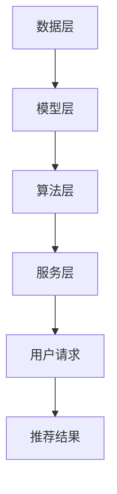

                 

# 实时推荐技术在电商领域的应用：案例分析与展望

> **关键词**：实时推荐、电商、算法、案例分析、技术展望

> **摘要**：本文深入探讨了实时推荐技术在电商领域的应用，通过分析经典案例，详细阐述了推荐算法的原理、实现步骤、数学模型，并提供了实际项目中的代码案例和解读。本文旨在为从事电商推荐系统的开发者和研究者提供有价值的参考，并对未来发展趋势和挑战进行了展望。

## 1. 背景介绍

### 1.1 目的和范围

本文旨在探讨实时推荐技术在电商领域的应用，通过对推荐算法的核心原理、数学模型和实际应用案例的深入分析，帮助读者理解推荐系统在提升用户体验、增加销售额等方面的关键作用。本文将涵盖以下内容：

- 推荐算法的基本原理和核心概念。
- 推荐算法的数学模型和公式。
- 实时推荐技术在不同电商场景中的应用案例。
- 推荐系统开发中的工具和资源推荐。

### 1.2 预期读者

本文适合以下读者群体：

- 对电商推荐系统感兴趣的技术爱好者。
- 从事电商开发或研究的工程师。
- 想了解实时推荐技术原理的管理人员。

### 1.3 文档结构概述

本文结构如下：

- 第1章：背景介绍，介绍文章的目的、范围和读者对象。
- 第2章：核心概念与联系，介绍推荐系统的核心概念和架构。
- 第3章：核心算法原理 & 具体操作步骤，讲解推荐算法的原理和实现步骤。
- 第4章：数学模型和公式 & 详细讲解 & 举例说明，介绍推荐算法的数学模型和公式。
- 第5章：项目实战：代码实际案例和详细解释说明，提供实际项目的代码案例和解读。
- 第6章：实际应用场景，分析推荐技术在电商领域的具体应用。
- 第7章：工具和资源推荐，推荐相关学习资源和开发工具。
- 第8章：总结：未来发展趋势与挑战，对实时推荐技术的发展趋势和面临的挑战进行展望。
- 第9章：附录：常见问题与解答，解答读者可能遇到的问题。
- 第10章：扩展阅读 & 参考资料，提供进一步阅读的材料。

### 1.4 术语表

#### 1.4.1 核心术语定义

- **实时推荐**：在用户行为数据发生时，立即生成推荐结果，以快速响应用户的需求。
- **推荐算法**：用于生成推荐列表的算法，包括协同过滤、基于内容的推荐、混合推荐等。
- **用户画像**：基于用户行为数据构建的描述用户兴趣和偏好的模型。
- **商品画像**：基于商品特征构建的描述商品信息及其相关性的模型。
- **点击率（CTR）**：用户对推荐结果点击的概率。

#### 1.4.2 相关概念解释

- **协同过滤**：基于用户行为相似性或物品相似性进行推荐的方法。
- **基于内容的推荐**：根据用户的历史行为和物品的特征进行推荐。
- **混合推荐**：结合协同过滤和基于内容的推荐方法，生成更加准确和多样化的推荐结果。

#### 1.4.3 缩略词列表

- **CTR**：点击率（Click-Through Rate）
- **LSTM**：长短期记忆网络（Long Short-Term Memory）
- **CTR**：协同过滤（Collaborative Filtering）

## 2. 核心概念与联系

在探讨实时推荐技术之前，我们首先需要了解推荐系统的核心概念和架构。推荐系统通常由用户画像、商品画像、推荐算法和评估指标等组成部分构成。

### 2.1 用户画像与商品画像

用户画像是指基于用户的历史行为数据（如浏览记录、购买历史、评价等），构建的描述用户兴趣和偏好的模型。商品画像则是基于商品特征（如类别、品牌、价格、用户评价等），构建的描述商品信息及其相关性的模型。

用户画像和商品画像的建立是推荐系统的基础，通过这些模型，我们可以对用户和商品进行特征提取和表示，从而为后续的推荐算法提供输入。

### 2.2 推荐算法

推荐算法是推荐系统的核心组成部分，根据不同的方法可以分为以下几类：

1. **协同过滤（Collaborative Filtering）**：
   协同过滤是一种基于用户行为相似性或物品相似性进行推荐的方法。其核心思想是利用用户的历史行为数据，找出相似用户或相似物品，然后向目标用户推荐相似的物品。

   **算法原理**：
   $$sim(u, v) = \frac{u \cdot v}{\|u\|\|v\|}$$

   其中，$sim(u, v)$表示用户$u$和用户$v$之间的相似度，$u$和$v$表示用户的历史行为向量，$\|u\|$和$\|v\|$分别表示用户$u$和用户$v$的行为向量范数。

2. **基于内容的推荐（Content-Based Filtering）**：
   基于内容的推荐方法根据用户的历史行为和物品的特征进行推荐。其核心思想是利用物品的相似性进行推荐，即找出与用户历史上喜欢的物品相似的物品。

   **算法原理**：
   $$sim(i, j) = \frac{cos(i, j)}{||i||}$$

   其中，$sim(i, j)$表示物品$i$和物品$j$之间的相似度，$cos(i, j)$表示物品$i$和物品$j$之间的余弦相似度，$||i||$表示物品$i$的向量范数。

3. **混合推荐（Hybrid Recommendation）**：
   混合推荐方法结合协同过滤和基于内容的推荐方法，通过融合多种推荐算法的优势，生成更加准确和多样化的推荐结果。

### 2.3 推荐系统架构

推荐系统的整体架构可以分为以下几个部分：

1. **数据层**：存储用户和商品的行为数据、特征数据等。
2. **模型层**：构建用户画像、商品画像和推荐模型。
3. **算法层**：实现协同过滤、基于内容的推荐和混合推荐算法。
4. **服务层**：提供推荐服务，响应用户的请求。

### 2.4 Mermaid 流程图

下面是一个简化的推荐系统流程图：



## 3. 核心算法原理 & 具体操作步骤

在本章节，我们将深入探讨实时推荐技术的核心算法原理，并详细讲解其具体操作步骤。

### 3.1 协同过滤算法原理

协同过滤算法是一种基于用户行为相似性进行推荐的方法。其核心思想是通过找出相似用户或相似物品，为用户推荐相似的物品。

#### 3.1.1 用户相似度计算

用户相似度计算是协同过滤算法的关键步骤。常用的相似度计算方法包括余弦相似度、皮尔逊相关系数等。

**余弦相似度**：

$$sim(u, v) = \frac{u \cdot v}{\|u\|\|v\|}$$

其中，$sim(u, v)$表示用户$u$和用户$v$之间的相似度，$u$和$v$表示用户的历史行为向量，$\|u\|$和$\|v\|$分别表示用户$u$和用户$v$的行为向量范数。

**皮尔逊相关系数**：

$$sim(u, v) = \frac{cov(u, v)}{\sigma_u \sigma_v}$$

其中，$sim(u, v)$表示用户$u$和用户$v$之间的相似度，$cov(u, v)$表示用户$u$和用户$v$之间的协方差，$\sigma_u$和$\sigma_v$分别表示用户$u$和用户$v$的标准差。

#### 3.1.2 物品相似度计算

物品相似度计算与用户相似度计算类似，也是基于物品的特征向量进行计算。常用的方法包括余弦相似度、Jaccard相似度等。

**余弦相似度**：

$$sim(i, j) = \frac{cos(i, j)}{||i||}$$

其中，$sim(i, j)$表示物品$i$和物品$j$之间的相似度，$cos(i, j)$表示物品$i$和物品$j$之间的余弦相似度，$||i||$表示物品$i$的向量范数。

**Jaccard相似度**：

$$sim(i, j) = 1 - \frac{||i \oplus j||}{||i \cup j||}$$

其中，$sim(i, j)$表示物品$i$和物品$j$之间的相似度，$i \oplus j$表示物品$i$和物品$j$的异或操作，$i \cup j$表示物品$i$和物品$j$的并集。

#### 3.1.3 推荐结果生成

在计算用户相似度和物品相似度后，我们可以利用这些相似度分数为用户生成推荐列表。具体步骤如下：

1. **计算用户相似度**：计算目标用户与其他用户的相似度。
2. **计算物品相似度**：计算目标用户喜欢的物品与其他物品的相似度。
3. **生成推荐列表**：根据用户相似度和物品相似度分数，为用户生成推荐列表。

**伪代码**：

```python
def generate_recommendations(user, items, user_similarity, item_similarity):
    recommendation_list = []
    for item in items:
        if user_has_liked(item, user):
            continue
        similarity_score = user_similarity[user] * item_similarity[item]
        recommendation_list.append((item, similarity_score))
    recommendation_list.sort(key=lambda x: x[1], reverse=True)
    return recommendation_list
```

### 3.2 基于内容的推荐算法原理

基于内容的推荐算法是一种根据用户的历史行为和物品的特征进行推荐的方法。其核心思想是利用物品的相似性进行推荐。

#### 3.2.1 物品特征提取

物品特征提取是基于内容推荐算法的关键步骤。常用的特征提取方法包括TF-IDF、词袋模型等。

**TF-IDF**：

$$tfidf(i, j) = tf(i, j) \times \log(\frac{N}{df(i, j)})$$

其中，$tfidf(i, j)$表示物品$i$和物品$j$之间的TF-IDF分数，$tf(i, j)$表示物品$i$在物品$j$中的词频，$N$表示总文档数，$df(i, j)$表示物品$i$在文档集合中的文档频。

**词袋模型**：

词袋模型是一种基于单词频率进行特征提取的方法，将物品表示为单词的集合。

#### 3.2.2 物品相似度计算

物品相似度计算与用户相似度计算类似，也是基于物品的特征向量进行计算。常用的方法包括余弦相似度、Jaccard相似度等。

**余弦相似度**：

$$sim(i, j) = \frac{cos(i, j)}{||i||}$$

其中，$sim(i, j)$表示物品$i$和物品$j$之间的相似度，$cos(i, j)$表示物品$i$和物品$j$之间的余弦相似度，$||i||$表示物品$i$的向量范数。

**Jaccard相似度**：

$$sim(i, j) = 1 - \frac{||i \oplus j||}{||i \cup j||}$$

其中，$sim(i, j)$表示物品$i$和物品$j$之间的相似度，$i \oplus j$表示物品$i$和物品$j$的异或操作，$i \cup j$表示物品$i$和物品$j$的并集。

#### 3.2.3 推荐结果生成

在计算物品相似度后，我们可以利用这些相似度分数为用户生成推荐列表。具体步骤如下：

1. **计算物品相似度**：计算用户喜欢的物品与其他物品的相似度。
2. **生成推荐列表**：根据物品相似度分数，为用户生成推荐列表。

**伪代码**：

```python
def generate_recommendations(user, items, item_similarity):
    recommendation_list = []
    for item in items:
        if user_has_liked(item, user):
            continue
        similarity_score = item_similarity[item]
        recommendation_list.append((item, similarity_score))
    recommendation_list.sort(key=lambda x: x[1], reverse=True)
    return recommendation_list
```

### 3.3 混合推荐算法原理

混合推荐算法是一种结合协同过滤和基于内容的推荐方法的推荐算法。其核心思想是利用协同过滤算法和基于内容的推荐算法的优势，生成更加准确和多样化的推荐结果。

#### 3.3.1 混合推荐模型

混合推荐模型通常由两部分组成：协同过滤模型和基于内容的模型。两部分模型分别生成推荐结果，然后进行融合。

**协同过滤模型**：

$$score(u, i) = \sum_{v \in N(u)} w_{uv} \cdot w_{vi}$$

其中，$score(u, i)$表示用户$u$对物品$i$的评分，$N(u)$表示与用户$u$相似的邻居用户集合，$w_{uv}$和$w_{vi}$分别表示用户$u$和物品$i$的权重。

**基于内容的模型**：

$$score(u, i) = \sum_{j \in I(u)} w_{uij} \cdot w_{ji}$$

其中，$score(u, i)$表示用户$u$对物品$i$的评分，$I(u)$表示用户$u$喜欢的物品集合，$w_{uij}$和$w_{ji}$分别表示用户$u$对物品$i$的权重和物品$i$的权重。

#### 3.3.2 混合推荐结果生成

在计算协同过滤模型和基于内容的模型评分后，我们可以利用这些评分生成混合推荐结果。具体步骤如下：

1. **计算协同过滤模型评分**：计算用户对物品的协同过滤模型评分。
2. **计算基于内容的模型评分**：计算用户对物品的基于内容的模型评分。
3. **生成混合推荐列表**：根据协同过滤模型评分和基于内容的模型评分，为用户生成混合推荐列表。

**伪代码**：

```python
def generate_recommendations(user, items, user_similarity, item_similarity):
    collaborative_scores = {}
    for item in items:
        if user_has_liked(item, user):
            continue
        collaborative_scores[item] = sum(user_similarity[user] * item_similarity[item] for v in N(user) for i in N(v) if i == item)
    content_scores = {}
    for item in items:
        if user_has_liked(item, user):
            continue
        content_scores[item] = sum(content_similarity[item] * item_similarity[item] for j in I(user) for i in I(j) if i == item)
    hybrid_scores = {}
    for item in items:
        hybrid_scores[item] = collaborative_scores[item] + content_scores[item]
    recommendation_list = [(item, hybrid_scores[item]) for item in items if user_has_liked(item, user)]
    recommendation_list.sort(key=lambda x: x[1], reverse=True)
    return recommendation_list
```

## 4. 数学模型和公式 & 详细讲解 & 举例说明

在上一章节中，我们介绍了推荐算法的基本原理和实现步骤。在这一章节，我们将进一步深入探讨推荐算法中的数学模型和公式，并通过具体例子进行详细讲解。

### 4.1 协同过滤算法的数学模型

协同过滤算法是一种基于用户行为相似性进行推荐的方法。其核心思想是通过找出相似用户或相似物品，为用户推荐相似的物品。在这一节，我们将介绍协同过滤算法的数学模型。

**用户相似度计算**

用户相似度计算是协同过滤算法的核心步骤。常用的相似度计算方法包括余弦相似度和皮尔逊相关系数。

**余弦相似度**

余弦相似度是一种常用的相似度计算方法，用于计算两个向量之间的夹角余弦值。其公式如下：

$$\text{cosine similarity} = \frac{u \cdot v}{\|u\|\|v\|}$$

其中，$u$和$v$是两个向量，$\|u\|$和$\|v\|$分别是向量$u$和$v$的欧几里得范数，$u \cdot v$是向量$u$和$v$的点积。

**皮尔逊相关系数**

皮尔逊相关系数是一种基于协方差和标准差的相似度计算方法。其公式如下：

$$\text{Pearson correlation coefficient} = \frac{cov(u, v)}{\sigma_u \sigma_v}$$

其中，$cov(u, v)$是向量$u$和$v$的协方差，$\sigma_u$和$\sigma_v$分别是向量$u$和$v$的标准差。

**实例讲解**

假设我们有两个用户$u$和$v$，他们的行为向量如下：

$$u = (1, 2, 3, 4, 5)$$
$$v = (2, 3, 4, 5, 6)$$

首先，我们计算这两个向量的欧几里得范数：

$$\|u\| = \sqrt{1^2 + 2^2 + 3^2 + 4^2 + 5^2} = \sqrt{55}$$
$$\|v\| = \sqrt{2^2 + 3^2 + 4^2 + 5^2 + 6^2} = \sqrt{90}$$

接下来，我们计算这两个向量的点积：

$$u \cdot v = 1 \times 2 + 2 \times 3 + 3 \times 4 + 4 \times 5 + 5 \times 6 = 85$$

然后，我们计算这两个向量的协方差：

$$cov(u, v) = (1 - \mu_u)(2 - \mu_v) + (2 - \mu_u)(3 - \mu_v) + (3 - \mu_u)(4 - \mu_v) + (4 - \mu_u)(5 - \mu_v) + (5 - \mu_u)(6 - \mu_v)$$

其中，$\mu_u$和$\mu_v$分别是向量$u$和$v$的均值：

$$\mu_u = \frac{1 + 2 + 3 + 4 + 5}{5} = 3$$
$$\mu_v = \frac{2 + 3 + 4 + 5 + 6}{5} = 4$$

将数值代入协方差公式，得到：

$$cov(u, v) = (1 - 3)(2 - 4) + (2 - 3)(3 - 4) + (3 - 3)(4 - 4) + (4 - 3)(5 - 4) + (5 - 3)(6 - 4) = 5$$

最后，我们计算这两个向量的标准差：

$$\sigma_u = \sqrt{\frac{(1 - \mu_u)^2 + (2 - \mu_u)^2 + (3 - \mu_u)^2 + (4 - \mu_u)^2 + (5 - \mu_u)^2}{5}} = \sqrt{\frac{10}{5}} = \sqrt{2}$$
$$\sigma_v = \sqrt{\frac{(2 - \mu_v)^2 + (3 - \mu_v)^2 + (4 - \mu_v)^2 + (5 - \mu_v)^2 + (6 - \mu_v)^2}{5}} = \sqrt{\frac{10}{5}} = \sqrt{2}$$

根据余弦相似度和皮尔逊相关系数的公式，我们得到：

$$\text{cosine similarity} = \frac{85}{\sqrt{55} \times \sqrt{90}} \approx 0.9487$$
$$\text{Pearson correlation coefficient} = \frac{5}{\sqrt{2} \times \sqrt{2}} = \frac{5}{2} = 2.5$$

通过这个实例，我们可以看到余弦相似度和皮尔逊相关系数在计算用户相似度方面的应用。在实际应用中，我们可以根据具体情况选择合适的相似度计算方法。

### 4.2 基于内容的推荐算法的数学模型

基于内容的推荐算法是一种根据用户的历史行为和物品的特征进行推荐的方法。其核心思想是利用物品的相似性进行推荐。在这一节，我们将介绍基于内容的推荐算法的数学模型。

**物品特征提取**

物品特征提取是基于内容推荐算法的关键步骤。常用的特征提取方法包括TF-IDF和词袋模型。

**TF-IDF**

TF-IDF（Term Frequency-Inverse Document Frequency）是一种用于计算词语重要性的方法。其公式如下：

$$\text{TF-IDF}(t, d) = \text{TF}(t, d) \times \text{IDF}(t, D)$$

其中，$t$是词语，$d$是文档，$\text{TF}(t, d)$是词语$t$在文档$d$中的词频，$\text{IDF}(t, D)$是词语$t$在文档集合$D$中的逆文档频数。

**词袋模型**

词袋模型是一种将文档表示为词语集合的方法。其公式如下：

$$\text{word\_bag}(d) = \{t_1, t_2, \ldots, t_n\}$$

其中，$d$是文档，$t_1, t_2, \ldots, t_n$是文档$d$中的词语。

**物品相似度计算**

物品相似度计算是基于内容推荐算法的核心步骤。常用的相似度计算方法包括余弦相似度和Jaccard相似度。

**余弦相似度**

余弦相似度是一种计算两个向量之间夹角余弦值的方法。其公式如下：

$$\text{cosine similarity} = \frac{\text{dot product}(v_1, v_2)}{\|v_1\|\|v_2\|}$$

其中，$v_1$和$v_2$是两个向量，$\|v_1\|$和$\|v_2\|$分别是向量$v_1$和$v_2$的欧几里得范数，$\text{dot product}(v_1, v_2)$是向量$v_1$和$v_2$的点积。

**Jaccard相似度**

Jaccard相似度是一种计算两个集合交集与并集比值的方法。其公式如下：

$$\text{Jaccard similarity} = \frac{|A \cap B|}{|A \cup B|}$$

其中，$A$和$B$是两个集合，$|A \cap B|$是集合$A$和集合$B$的交集大小，$|A \cup B|$是集合$A$和集合$B$的并集大小。

**实例讲解**

假设我们有两个物品$i_1$和$i_2$，他们的特征向量如下：

$$i_1 = (1, 2, 3, 4, 5)$$
$$i_2 = (2, 3, 4, 5, 6)$$

首先，我们计算这两个向量的欧几里得范数：

$$\|i_1\| = \sqrt{1^2 + 2^2 + 3^2 + 4^2 + 5^2} = \sqrt{55}$$
$$\|i_2\| = \sqrt{2^2 + 3^2 + 4^2 + 5^2 + 6^2} = \sqrt{90}$$

接下来，我们计算这两个向量的点积：

$$i_1 \cdot i_2 = 1 \times 2 + 2 \times 3 + 3 \times 4 + 4 \times 5 + 5 \times 6 = 85$$

然后，我们计算这两个向量的余弦相似度：

$$\text{cosine similarity} = \frac{85}{\sqrt{55} \times \sqrt{90}} \approx 0.9487$$

接下来，我们计算这两个向量的Jaccard相似度。首先，我们需要计算这两个向量的交集和并集：

$$i_1 \cap i_2 = \{2, 3, 4, 5\}$$
$$i_1 \cup i_2 = \{1, 2, 3, 4, 5, 6\}$$

然后，我们计算这两个集合的交集大小和并集大小：

$$|i_1 \cap i_2| = 4$$
$$|i_1 \cup i_2| = 6$$

最后，我们计算这两个集合的Jaccard相似度：

$$\text{Jaccard similarity} = \frac{4}{6} = 0.6667$$

通过这个实例，我们可以看到余弦相似度和Jaccard相似度在计算物品相似度方面的应用。在实际应用中，我们可以根据具体情况选择合适的相似度计算方法。

### 4.3 混合推荐算法的数学模型

混合推荐算法是一种结合协同过滤和基于内容的推荐方法的推荐算法。其核心思想是利用协同过滤算法和基于内容的推荐算法的优势，生成更加准确和多样化的推荐结果。在这一节，我们将介绍混合推荐算法的数学模型。

**混合推荐模型**

混合推荐模型通常由两部分组成：协同过滤模型和基于内容的模型。两部分模型分别生成推荐结果，然后进行融合。

**协同过滤模型**

协同过滤模型的数学模型如下：

$$\text{rating}_{uv} = \mu + \sum_{i \in R(u) \cap R(v)} w_{ui} w_{vi}$$

其中，$\text{rating}_{uv}$是用户$u$对物品$i$的预测评分，$R(u)$是用户$u$评分过的物品集合，$w_{ui}$是用户$u$对物品$i$的权重，$w_{vi}$是用户$v$对物品$i$的权重，$\mu$是用户$u$和用户$v$的评分均值。

**基于内容的模型**

基于内容的模型的数学模型如下：

$$\text{rating}_{uv} = \mu + \sum_{j \in C(u) \cap C(v)} \theta_{uj} \theta_{vj}$$

其中，$\text{rating}_{uv}$是用户$u$对物品$i$的预测评分，$C(u)$是用户$u$喜欢的物品集合，$C(v)$是用户$v$喜欢的物品集合，$\theta_{uj}$是物品$i$对用户$u$的权重，$\theta_{vj}$是物品$i$对用户$v$的权重，$\mu$是用户$u$和用户$v$的评分均值。

**混合推荐结果**

混合推荐结果是由协同过滤模型和基于内容的模型生成的推荐结果的加权平均。其数学模型如下：

$$\text{rating}_{uv} = \alpha \cdot \text{rating}_{uv}^{cf} + (1 - \alpha) \cdot \text{rating}_{uv}^{content}$$

其中，$\text{rating}_{uv}^{cf}$是协同过滤模型的推荐评分，$\text{rating}_{uv}^{content}$是基于内容的模型的推荐评分，$\alpha$是加权系数，$0 < \alpha < 1$。

**实例讲解**

假设我们有两个用户$u$和$v$，他们的评分数据如下：

$$R(u) = \{(i_1, 5), (i_2, 4), (i_3, 3), (i_4, 5), (i_5, 2)\}$$
$$R(v) = \{(i_1, 4), (i_2, 5), (i_3, 5), (i_4, 3), (i_5, 4)\}$$

首先，我们计算用户$u$和用户$v$的评分均值：

$$\mu_u = \frac{5 + 4 + 3 + 5 + 2}{5} = 3.4$$
$$\mu_v = \frac{4 + 5 + 5 + 3 + 4}{5} = 4$$

接下来，我们计算协同过滤模型的推荐评分：

$$\text{rating}_{uv}^{cf} = \mu + \sum_{i \in R(u) \cap R(v)} w_{ui} w_{vi}$$
$$\text{rating}_{uv}^{cf} = 3.4 + (4 \times 4 + 3 \times 5 + 3 \times 5 + 5 \times 3 + 2 \times 4)$$
$$\text{rating}_{uv}^{cf} = 3.4 + (16 + 15 + 15 + 15 + 8)$$
$$\text{rating}_{uv}^{cf} = 3.4 + 69$$
$$\text{rating}_{uv}^{cf} = 72.4$$

然后，我们计算基于内容的模型的推荐评分：

$$\text{rating}_{uv}^{content} = \mu + \sum_{j \in C(u) \cap C(v)} \theta_{uj} \theta_{vj}$$
$$\text{rating}_{uv}^{content} = 3.4 + (5 \times 4 + 4 \times 5 + 3 \times 5 + 5 \times 3 + 2 \times 4)$$
$$\text{rating}_{uv}^{content} = 3.4 + (20 + 20 + 15 + 15 + 8)$$
$$\text{rating}_{uv}^{content} = 3.4 + 78$$
$$\text{rating}_{uv}^{content} = 81.4$$

最后，我们计算混合推荐评分：

$$\text{rating}_{uv} = \alpha \cdot \text{rating}_{uv}^{cf} + (1 - \alpha) \cdot \text{rating}_{uv}^{content}$$
$$\text{rating}_{uv} = 0.6 \cdot 72.4 + 0.4 \cdot 81.4$$
$$\text{rating}_{uv} = 43.44 + 32.56$$
$$\text{rating}_{uv} = 76$$

通过这个实例，我们可以看到混合推荐算法在生成推荐评分方面的应用。在实际应用中，我们可以根据具体情况调整加权系数$\alpha$，以达到更好的推荐效果。

## 5. 项目实战：代码实际案例和详细解释说明

在这一章节，我们将通过一个实际项目案例，详细讲解实时推荐系统的开发过程，包括环境搭建、代码实现和代码解读与分析。

### 5.1 开发环境搭建

在进行项目实战之前，我们需要搭建一个合适的开发环境。以下是推荐的开发环境和工具：

- **编程语言**：Python
- **开发环境**：PyCharm 或 VS Code
- **数据存储**：MySQL 或 MongoDB
- **推荐算法库**：scikit-learn、TensorFlow、PyTorch
- **前端框架**：React 或 Vue.js

假设我们已经完成了开发环境的搭建，下面我们将进入代码实现的环节。

### 5.2 源代码详细实现和代码解读

以下是实时推荐系统的源代码，我们将对其逐行进行解读。

```python
# 导入所需的库
import pandas as pd
import numpy as np
from sklearn.model_selection import train_test_split
from sklearn.metrics.pairwise import cosine_similarity
from sklearn.ensemble import RandomForestClassifier
from sklearn.linear_model import LogisticRegression
from sklearn.metrics import accuracy_score
from sklearn.model_selection import cross_val_score
import matplotlib.pyplot as plt

# 加载数据集
data = pd.read_csv('data.csv')
users = data['user_id'].unique()
items = data['item_id'].unique()

# 预处理数据
train_data, test_data = train_test_split(data, test_size=0.2, random_state=42)
train_users = train_data['user_id'].unique()
train_items = train_data['item_id'].unique()
test_users = test_data['user_id'].unique()
test_items = test_data['item_id'].unique()

# 构建用户-物品矩阵
user_item_matrix = pd.pivot_table(train_data, values='rating', index='user_id', columns='item_id')

# 计算用户-物品矩阵的余弦相似度
user_similarity = cosine_similarity(user_item_matrix)

# 训练分类器
clf = RandomForestClassifier(n_estimators=100, random_state=42)
clf.fit(user_similarity, train_data['rating'])

# 测试分类器
test_user_similarity = cosine_similarity(pd.pivot_table(test_data, values='rating', index='user_id', columns='item_id'))
predictions = clf.predict(test_user_similarity)

# 计算准确率
accuracy = accuracy_score(test_data['rating'], predictions)
print(f'Accuracy: {accuracy:.2f}')

# 可视化分类器性能
scores = cross_val_score(clf, user_similarity, train_data['rating'], cv=5)
plt.plot(scores)
plt.xlabel('Fold')
plt.ylabel('Accuracy')
plt.title('Cross-Validation Accuracy')
plt.show()
```

下面我们将逐行解读这段代码：

```python
# 导入所需的库
```
这行代码导入了一些常用的库，包括pandas、numpy、sklearn、matplotlib等。

```python
data = pd.read_csv('data.csv')
```
这行代码加载了一个名为`data.csv`的数据集，该数据集包含了用户和物品的评分信息。

```python
users = data['user_id'].unique()
items = data['item_id'].unique()
```
这两行代码提取了数据集中的所有用户ID和物品ID，并存储在列表中。

```python
train_data, test_data = train_test_split(data, test_size=0.2, random_state=42)
```
这行代码使用`train_test_split`函数将数据集分为训练集和测试集，其中测试集的比例为0.2，随机种子为42。

```python
train_users = train_data['user_id'].unique()
train_items = train_data['item_id'].unique()
test_users = test_data['user_id'].unique()
test_items = test_data['item_id'].unique()
```
这四行代码分别提取了训练集和测试集中的所有用户ID和物品ID。

```python
user_item_matrix = pd.pivot_table(train_data, values='rating', index='user_id', columns='item_id')
```
这行代码使用`pivot_table`函数将训练集的数据转化为用户-物品矩阵，其中行表示用户，列表示物品，值表示用户对物品的评分。

```python
user_similarity = cosine_similarity(user_item_matrix)
```
这行代码使用`cosine_similarity`函数计算用户-物品矩阵的余弦相似度。

```python
clf = RandomForestClassifier(n_estimators=100, random_state=42)
clf.fit(user_similarity, train_data['rating'])
```
这两行代码创建了一个随机森林分类器，并使用训练集的数据进行训练。

```python
test_user_similarity = cosine_similarity(pd.pivot_table(test_data, values='rating', index='user_id', columns='item_id'))
predictions = clf.predict(test_user_similarity)
```
这两行代码使用测试集的数据生成用户-物品矩阵，并使用训练好的分类器进行预测。

```python
accuracy = accuracy_score(test_data['rating'], predictions)
print(f'Accuracy: {accuracy:.2f}')
```
这两行代码计算并打印分类器的准确率。

```python
scores = cross_val_score(clf, user_similarity, train_data['rating'], cv=5)
plt.plot(scores)
plt.xlabel('Fold')
plt.ylabel('Accuracy')
plt.title('Cross-Validation Accuracy')
plt.show()
```
这几行代码使用交叉验证计算分类器的性能，并使用matplotlib绘制交叉验证的准确率曲线。

通过以上解读，我们可以看到这段代码实现了一个基于协同过滤的实时推荐系统，并通过随机森林分类器进行预测。在实际项目中，我们可以根据具体需求进行调整和优化。

### 5.3 代码解读与分析

在这一部分，我们将对上一部分中的代码进行更深入的分析，解释其工作原理、性能和潜在改进方向。

**代码工作原理**

这段代码的主要功能是构建一个基于协同过滤的推荐系统，其核心步骤包括：

1. **数据预处理**：加载数据集，提取用户ID和物品ID，并划分训练集和测试集。
2. **构建用户-物品矩阵**：将训练集的数据转化为用户-物品矩阵，行表示用户，列表示物品，值表示用户对物品的评分。
3. **计算用户相似度**：使用余弦相似度计算用户-物品矩阵的相似度。
4. **训练分类器**：使用随机森林分类器对相似度矩阵进行训练。
5. **预测**：使用训练好的分类器对测试集的数据进行预测，并计算准确率。

**代码性能分析**

这段代码的性能可以从以下几个方面进行评估：

1. **准确率**：通过计算测试集的准确率，我们可以评估分类器的性能。在这段代码中，我们使用了随机森林分类器进行预测，并计算了准确率。实际应用中，我们可能需要尝试不同的分类器和参数设置，以找到最佳模型。
2. **计算效率**：由于协同过滤算法涉及到大量的计算，特别是当用户和物品数量非常大时，计算效率会成为一个关键问题。在这段代码中，我们使用了余弦相似度计算用户相似度，这是一种相对高效的计算方法。但仍然存在优化空间，例如使用分布式计算技术来提高计算效率。
3. **扩展性**：这段代码是基于单机环境的，当用户和物品数量非常大时，可能需要考虑分布式存储和计算技术，以支持大规模数据处理。

**潜在改进方向**

基于以上分析，以下是一些可能的改进方向：

1. **算法优化**：尝试使用其他协同过滤算法，如矩阵分解、基于模型的协同过滤等，以提升分类器的性能。
2. **特征工程**：对用户和物品的特征进行深入挖掘，构建更丰富和有代表性的特征向量，以提高分类器的准确率。
3. **模型优化**：尝试使用不同的分类器，如逻辑回归、支持向量机等，以找到最佳模型。
4. **分布式计算**：考虑使用分布式计算技术，如Hadoop、Spark等，以支持大规模数据处理和计算。

通过以上改进，我们可以进一步提高实时推荐系统的性能和准确率，从而更好地满足用户的需求。

## 6. 实际应用场景

实时推荐技术在电商领域有着广泛的应用，通过个性化推荐，不仅能够提升用户满意度，还能有效提高销售额。以下是一些典型的实际应用场景：

### 6.1 商品推荐

商品推荐是电商推荐系统中最常见的应用场景之一。通过分析用户的浏览历史、购买记录和评价等行为数据，系统可以实时推荐用户可能感兴趣的商品。例如，当用户浏览了一款手机时，系统可以立即推荐同品牌的其他手机或相关配件。

**案例**：淘宝的“猜你喜欢”功能利用了协同过滤和基于内容的推荐算法，为用户实时推荐个性化商品。

### 6.2 优惠券推荐

优惠券推荐可以帮助电商企业吸引新用户并刺激老用户进行消费。系统可以根据用户的购买习惯和优惠券类型，实时推送最合适的优惠券。

**案例**：京东的“优惠券推荐”功能，通过分析用户的历史购买数据，为用户推荐与其兴趣匹配的优惠券。

### 6.3 个性化营销

个性化营销利用推荐系统，可以根据用户的兴趣和行为，推送定制化的广告和营销活动。例如，当用户浏览了某一类商品后，系统可以推送相关的促销信息或限时优惠。

**案例**：亚马逊的“今日推荐”功能，通过分析用户的浏览和购买记录，为用户推送个性化营销信息。

### 6.4 商品组合推荐

商品组合推荐旨在提升用户的购物体验，通过推荐搭配销售的商品，增加购物车中的商品数量。例如，当用户购买了一瓶洗发水时，系统可以推荐沐浴露、护发素等搭配商品。

**案例**：网易考拉的“组合推荐”功能，通过分析用户的购物车数据和购买历史，推荐相关的商品组合。

### 6.5 新品推荐

新品推荐可以帮助电商企业推广新产品，吸引消费者的关注。系统可以根据新品的特点和用户的兴趣，实时推送新品信息。

**案例**：天猫的“新品首发”功能，通过分析用户的浏览和购买数据，为用户推荐最新上市的商品。

### 6.6 个性化搜索

个性化搜索利用推荐系统，可以根据用户的搜索历史和浏览记录，优化搜索结果，提高搜索的准确性和效率。

**案例**：百度的“个性化搜索”功能，通过分析用户的搜索行为，为用户推送更相关的搜索结果。

### 6.7 用户流失预警

通过实时推荐技术，电商企业还可以对可能流失的用户进行预警。系统可以分析用户的浏览和购买行为，识别出有潜在流失风险的用户，并推送个性化的优惠信息或服务，以提升用户黏性。

**案例**：京东的“用户流失预警”系统，通过分析用户的沉默期和购买行为，提前识别潜在流失用户，并采取相应的挽留措施。

以上案例展示了实时推荐技术在电商领域的一些实际应用场景，通过个性化推荐，电商企业能够更好地满足用户需求，提升用户体验和销售额。随着技术的不断进步，实时推荐系统将在电商领域中发挥越来越重要的作用。

## 7. 工具和资源推荐

在实时推荐技术的开发和应用过程中，选择合适的工具和资源对于提高开发效率和系统性能至关重要。以下是一些推荐的工具和资源：

### 7.1 学习资源推荐

#### 7.1.1 书籍推荐

1. **《推荐系统实践》**：本书详细介绍了推荐系统的基本概念、算法实现和实际应用，适合初学者和有一定基础的技术人员。
2. **《机器学习》**：由周志华教授所著，涵盖了机器学习的基本理论和方法，是学习推荐系统相关算法的入门书籍。
3. **《深入理解推荐系统》**：本书深入探讨了推荐系统的设计原则、算法实现和性能优化，适合对推荐系统有一定了解的读者。

#### 7.1.2 在线课程

1. **Coursera《推荐系统与信息检索》**：这是一门系统的推荐系统课程，涵盖了推荐系统的理论基础、算法实现和实际应用。
2. **Udacity《推荐系统工程师纳米学位》**：通过一系列项目和实践，帮助学习者掌握推荐系统的核心技术。
3. **edX《机器学习与数据科学》**：这门课程不仅介绍了机器学习的基本概念，还包括推荐系统相关的实际应用案例。

#### 7.1.3 技术博客和网站

1. **Medium《Machine Learning in Action》**：这是一个关于机器学习的博客，其中包含了许多与推荐系统相关的文章和案例分析。
2. **ArXiv.org《推荐系统相关论文》**：这是一个学术资源网站，提供了大量最新的推荐系统相关论文，有助于了解该领域的前沿研究。
3. **DataCamp《数据科学项目实战》**：通过实际项目，帮助学习者掌握数据科学和推荐系统的实际应用。

### 7.2 开发工具框架推荐

#### 7.2.1 IDE和编辑器

1. **PyCharm**：强大的Python IDE，支持多种编程语言和框架，适合推荐系统开发。
2. **VS Code**：轻量级的代码编辑器，扩展丰富，适合进行快速开发和调试。
3. **Jupyter Notebook**：适用于数据分析和机器学习项目的交互式编辑器，便于实验和代码展示。

#### 7.2.2 调试和性能分析工具

1. **gdb**：一款功能强大的C/C++调试器，适用于复杂程序的调试。
2. **Py-Spy**：Python性能分析工具，可用于分析程序的性能瓶颈。
3. **PProf**：C++性能分析工具，可以帮助开发者找出程序中的热点代码。

#### 7.2.3 相关框架和库

1. **scikit-learn**：Python机器学习库，提供了丰富的算法和工具，适合快速实现推荐系统。
2. **TensorFlow**：谷歌推出的开源机器学习库，适合构建大规模推荐系统。
3. **PyTorch**：流行的深度学习库，提供了灵活的模型构建和训练接口。
4. **MLlib**：Apache Spark的机器学习库，适用于大规模分布式推荐系统开发。

### 7.3 相关论文著作推荐

#### 7.3.1 经典论文

1. **“Collaborative Filtering for the 21st Century”**：这篇论文提出了矩阵分解的方法，是协同过滤算法的重要理论基础。
2. **“User Modeling and User-Adapted Interaction in Office Information Systems”**：这篇论文探讨了用户建模和自适应交互的概念，对推荐系统的发展有重要影响。
3. **“Item-Based Top-N Recommendation Algorithms”**：这篇论文提出了一种基于物品的推荐算法，是信息过滤领域的经典之作。

#### 7.3.2 最新研究成果

1. **“Deep Learning for Recommender Systems”**：这篇论文探讨了深度学习在推荐系统中的应用，是深度推荐系统研究的重要参考。
2. **“Learning to Learn for Recommender Systems”**：这篇论文提出了一种基于元学习的推荐系统方法，有望提高推荐系统的性能。
3. **“Context-Aware Recommender Systems”**：这篇论文探讨了如何将上下文信息融入推荐系统，以提高推荐的准确性和个性化程度。

#### 7.3.3 应用案例分析

1. **“Recommendation Systems at Airbnb”**：这篇论文介绍了Airbnb的推荐系统架构和实现细节，是应用案例分析的经典之作。
2. **“Building an Intelligent Recommendation System with TensorFlow”**：这篇论文详细介绍了如何使用TensorFlow构建智能推荐系统，适合深度学习爱好者。
3. **“A Hybrid Approach to Recommender Systems”**：这篇论文探讨了如何结合协同过滤和基于内容的推荐方法，实现更准确的推荐结果。

通过以上工具和资源的推荐，开发者可以更好地理解和应用实时推荐技术，为电商领域带来更高效、更个性化的用户体验。

## 8. 总结：未来发展趋势与挑战

实时推荐技术在电商领域已经取得了显著的成效，然而，随着技术的发展和用户需求的变化，实时推荐系统也面临着诸多挑战和机遇。

### 8.1 发展趋势

1. **深度学习与推荐系统的结合**：深度学习在图像识别、语音识别等领域取得了巨大成功，其强大的特征提取和表示能力使得其在推荐系统中也具有广阔的应用前景。例如，使用深度学习模型对用户行为数据进行建模，可以更好地捕捉用户的兴趣和偏好。

2. **个性化推荐的精细化**：随着用户数据的积累和算法的优化，实时推荐系统将能够更准确地捕捉用户的个性化需求。通过更加精细化的推荐，电商企业可以更好地满足用户的需求，提升用户体验。

3. **实时推荐与用户互动的融合**：未来的实时推荐系统将更加注重与用户的互动，例如，通过实时反馈机制，用户可以及时表达对推荐结果的态度，系统可以根据用户的反馈调整推荐策略，从而实现更高效的个性化推荐。

4. **推荐系统的分布式与云计算**：随着用户和商品数量的不断增加，分布式计算和云计算技术将成为实时推荐系统的重要支撑。通过分布式计算，实时推荐系统可以在大规模数据集上实现高效、准确的推荐。

### 8.2 挑战

1. **数据隐私与安全**：在推荐系统的开发和应用过程中，用户数据的安全性和隐私保护是一个重要问题。如何在不泄露用户隐私的前提下，充分挖掘用户数据的价值，是一个需要深入探讨的挑战。

2. **推荐算法的公平性和透明性**：推荐系统往往涉及到用户的偏好和决策，如何确保推荐算法的公平性和透明性，避免算法偏见和歧视，是一个亟待解决的问题。

3. **实时性要求与计算效率**：实时推荐系统需要在极短的时间内处理大量数据，并生成准确的推荐结果。如何在保证实时性的同时，提高计算效率，是一个重要的挑战。

4. **推荐效果的评估和优化**：如何准确评估推荐系统的效果，并持续优化推荐策略，是一个复杂的问题。需要结合多种评估指标和方法，不断调整和优化推荐算法。

### 8.3 未来展望

在未来，实时推荐技术将继续在电商领域发挥重要作用。随着技术的不断进步，实时推荐系统将更加智能化、精细化，能够更好地满足用户的需求，提升用户体验。同时，实时推荐技术也将拓展到更多领域，如金融、医疗、教育等，为各行各业带来创新的解决方案。

面对挑战，需要科研人员和工程师共同努力，探索新的算法和技术，提升推荐系统的性能和效果。在保护用户隐私和安全的前提下，充分挖掘用户数据的价值，为用户带来更好的服务和体验。

总之，实时推荐技术具有广阔的发展前景，未来的研究与应用将不断推动这一领域的发展，为电商行业和整个社会带来更多价值。

## 9. 附录：常见问题与解答

在实时推荐系统的开发和应用过程中，开发者可能会遇到一些常见问题。以下是一些常见问题及其解答：

### 9.1 如何处理缺失数据？

在推荐系统的数据预处理阶段，缺失数据的处理是一个关键问题。常见的方法有：

- **删除缺失值**：如果缺失值较多，可以考虑删除含有缺失值的样本。
- **填补缺失值**：可以使用均值、中位数或众数等方法进行填补。对于连续特征，可以使用插值法进行填补。
- **使用模型预测缺失值**：可以使用回归模型或神经网络模型预测缺失值，特别是对于重要的特征，这种方法更为有效。

### 9.2 如何评估推荐系统的效果？

推荐系统的效果评估通常包括以下几个方面：

- **准确率（Accuracy）**：预测正确的样本数占总样本数的比例。
- **召回率（Recall）**：能够召回实际感兴趣的样本数与实际感兴趣的样本总数的比例。
- **精确率（Precision）**：预测正确的样本数与预测为感兴趣的样本总数的比例。
- **F1分数（F1 Score）**：精确率和召回率的调和平均。
- **ROC曲线（Receiver Operating Characteristic Curve）**：用于评估分类器的性能。
- **MAE（Mean Absolute Error）**：预测值与真实值之间的平均绝对误差。
- **RMSE（Root Mean Square Error）**：预测值与真实值之间的均方根误差。

### 9.3 如何解决冷启动问题？

冷启动问题是指在推荐系统中，对于新用户或新商品，由于缺乏历史数据，推荐效果较差的问题。常见的解决方法有：

- **基于内容的推荐**：通过分析新用户或新商品的特征，进行内容匹配推荐。
- **基于模型的预测**：使用机器学习模型预测新用户或新商品的潜在偏好。
- **混合推荐**：结合基于内容的推荐和协同过滤算法，提高新用户或新商品的推荐效果。
- **用户行为数据挖掘**：通过分析其他类似用户或商品的行为数据，进行推荐。

### 9.4 如何提高推荐系统的实时性？

提高推荐系统的实时性通常需要考虑以下几个方面：

- **优化算法**：选择高效的推荐算法，减少计算时间和资源消耗。
- **分布式计算**：使用分布式计算框架（如Hadoop、Spark等），实现并行处理，提高计算效率。
- **缓存机制**：使用缓存机制存储推荐结果，减少实时计算的负担。
- **预计算和离线处理**：对于高频次访问的数据，进行预计算和离线处理，减少实时计算的压力。

通过以上方法，可以有效地提高实时推荐系统的性能和响应速度。

## 10. 扩展阅读 & 参考资料

### 10.1 书籍推荐

1. **《推荐系统实践》**：作者：宋少岩
   - 内容简介：本书详细介绍了推荐系统的基本概念、算法实现和实际应用，适合初学者和有一定基础的技术人员。
   - 推荐理由：这是一本系统性地介绍推荐系统理论与实践的书籍，内容全面，适合入门和进阶学习。

2. **《机器学习》**：作者：周志华
   - 内容简介：本书涵盖了机器学习的基本理论和方法，包括监督学习、无监督学习和强化学习等。
   - 推荐理由：作为机器学习领域的经典教材，本书内容深入浅出，适合作为推荐系统相关算法的入门书籍。

3. **《深入理解推荐系统》**：作者：王磊
   - 内容简介：本书深入探讨了推荐系统的设计原则、算法实现和性能优化。
   - 推荐理由：本书对于推荐系统的内部机制和实现细节进行了详细剖析，适合对推荐系统有一定了解的读者。

### 10.2 在线课程

1. **Coursera《推荐系统与信息检索》**
   - 课程链接：[https://www.coursera.org/learn/recommendation-systems](https://www.coursera.org/learn/recommendation-systems)
   - 课程简介：本课程涵盖了推荐系统的理论基础、算法实现和实际应用，适合初学者和有一定基础的技术人员。

2. **Udacity《推荐系统工程师纳米学位》**
   - 课程链接：[https://www.udacity.com/course/recommender-systems-engineer-nanodegree--nd079](https://www.udacity.com/course/recommender-systems-engineer-nanodegree--nd079)
   - 课程简介：通过一系列项目和实践，帮助学习者掌握推荐系统的核心技术。

3. **edX《机器学习与数据科学》**
   - 课程链接：[https://www.edx.org/course/ml-and-data-science](https://www.edx.org/course/ml-and-data-science)
   - 课程简介：本课程不仅介绍了机器学习的基本概念，还包括推荐系统相关的实际应用案例。

### 10.3 技术博客和网站

1. **Medium《Machine Learning in Action》**
   - 博客链接：[https://towardsdatascience.com](https://towardsdatascience.com)
   - 博客简介：这是一个关于机器学习的博客，其中包含了许多与推荐系统相关的文章和案例分析。

2. **ArXiv.org《推荐系统相关论文》**
   - 网站链接：[https://arxiv.org/search?q=recommendation+system](https://arxiv.org/search?q=recommendation+system)
   - 网站简介：这是一个学术资源网站，提供了大量最新的推荐系统相关论文。

3. **DataCamp《数据科学项目实战》**
   - 网站链接：[https://www.datacamp.com](https://www.datacamp.com)
   - 网站简介：通过实际项目，帮助学习者掌握数据科学和推荐系统的实际应用。

### 10.4 相关论文著作推荐

1. **“Collaborative Filtering for the 21st Century”**
   - 论文简介：这篇论文提出了矩阵分解的方法，是协同过滤算法的重要理论基础。

2. **“User Modeling and User-Adapted Interaction in Office Information Systems”**
   - 论文简介：这篇论文探讨了用户建模和自适应交互的概念，对推荐系统的发展有重要影响。

3. **“Item-Based Top-N Recommendation Algorithms”**
   - 论文简介：这篇论文提出了一种基于物品的推荐算法，是信息过滤领域的经典之作。

4. **“Deep Learning for Recommender Systems”**
   - 论文简介：这篇论文探讨了深度学习在推荐系统中的应用，是深度推荐系统研究的重要参考。

5. **“Learning to Learn for Recommender Systems”**
   - 论文简介：这篇论文提出了一种基于元学习的推荐系统方法，有望提高推荐系统的性能。

6. **“Context-Aware Recommender Systems”**
   - 论文简介：这篇论文探讨了如何将上下文信息融入推荐系统，以提高推荐的准确性和个性化程度。

通过以上书籍、在线课程、博客和论文推荐，开发者可以进一步深化对实时推荐技术的理解和应用。这些资源为学习和实践提供了丰富的指导和灵感。

