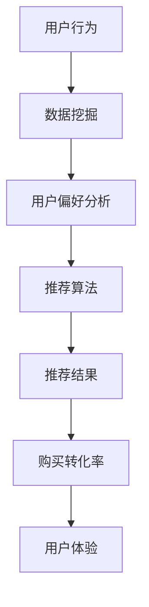

                 

# 实时推荐：AI提升购买转化率

## 关键词：
- 实时推荐
- AI
- 购买转化率
- 数据挖掘
- 机器学习
- 用户行为分析
- 推荐系统架构

> 本文将深入探讨如何利用人工智能技术，特别是在实时推荐系统中，提升在线购物的购买转化率。我们将一步步分析核心概念、算法原理、数学模型，并通过实际项目案例展示其应用，最后总结未来发展趋势和挑战。

## 摘要

随着电子商务的快速发展，在线购物成为消费者日常生活的一部分。实时推荐系统作为一种人工智能应用，通过分析用户行为和偏好，为消费者提供个性化的商品推荐，从而显著提升购买转化率。本文将详细介绍实时推荐系统的构建和优化，从核心概念到实际案例，全面解析如何利用AI技术提高在线购物的用户体验和商业效益。

## 1. 背景介绍

### 1.1 目的和范围

本文旨在为从事在线购物平台开发的技术人员提供系统化的实时推荐系统构建指南，帮助读者理解实时推荐技术的原理和应用，并通过具体案例展示其实际操作过程。本文将涵盖以下内容：

- 实时推荐系统的定义和作用
- 核心概念与架构
- 机器学习算法在实时推荐中的应用
- 数学模型和公式
- 项目实战与代码实现
- 实际应用场景
- 未来发展趋势与挑战

### 1.2 预期读者

- 具有基本编程知识，对机器学习和数据挖掘有一定了解的技术人员
- 在线购物平台开发人员，对提升购买转化率有实际需求
- 想要深入了解实时推荐系统原理和应用的AI领域研究者

### 1.3 文档结构概述

本文分为十个部分，结构如下：

- 引言：介绍实时推荐系统及其重要性
- 背景介绍：明确文章目的、预期读者和内容概述
- 核心概念与联系：定义关键术语，给出架构流程图
- 核心算法原理与具体操作步骤：详细解释算法原理和操作步骤
- 数学模型和公式：介绍相关数学模型和公式
- 项目实战：提供实际代码案例和详细解释
- 实际应用场景：展示系统在不同场景下的应用
- 工具和资源推荐：推荐学习资源和开发工具
- 总结：讨论未来发展趋势与挑战
- 附录：常见问题与解答
- 扩展阅读与参考资料：提供进一步学习资源

### 1.4 术语表

#### 1.4.1 核心术语定义

- 实时推荐：在用户访问时，系统即时生成的个性化推荐。
- 购买转化率：访问网站的用户中实际完成购买的比例。
- 机器学习：通过数据训练模型，使其能够从数据中学习并做出预测。
- 数据挖掘：从大量数据中提取有价值的信息和模式。
- 用户行为分析：分析用户在网站上的行为，如点击、浏览、购买等。

#### 1.4.2 相关概念解释

- 推荐系统：基于用户数据生成个性化推荐的系统。
- 协同过滤：利用用户间的相似性进行推荐。
- 内容过滤：基于商品内容进行推荐。
- 个性化：根据用户历史行为和偏好提供定制化推荐。

#### 1.4.3 缩略词列表

- AI：人工智能
- ML：机器学习
- DM：数据挖掘
- CF：协同过滤
- CF：内容过滤

## 2. 核心概念与联系

在探讨实时推荐系统之前，我们需要明确几个核心概念及其相互关系。以下是相关的 Mermaid 流程图：



### 2.1 用户行为

用户行为是实时推荐系统的基础。用户在网站上的活动，如浏览商品、添加购物车、进行搜索等，都是我们分析的对象。这些行为数据包括用户的点击次数、停留时间、购买历史等。

### 2.2 数据挖掘

数据挖掘（Data Mining）是从大量数据中提取有价值信息的过程。在实时推荐系统中，数据挖掘用于从用户行为数据中提取用户偏好和特征，为后续推荐提供依据。

### 2.3 用户偏好分析

用户偏好分析（User Preference Analysis）是基于数据挖掘的结果，进一步分析和理解用户的行为模式与偏好。这些偏好信息将用于生成个性化的推荐。

### 2.4 推荐算法

推荐算法（Recommender Algorithm）是生成推荐结果的核心。常见的推荐算法包括协同过滤（Collaborative Filtering）和内容过滤（Content Filtering）。实时推荐系统需要高效地处理用户行为数据，并快速生成推荐结果。

### 2.5 推荐结果

推荐结果（Recommendation Results）是推荐算法的输出。这些结果可以是推荐的商品列表、文章、音乐等，目的是提高用户的购买转化率。

### 2.6 购买转化率

购买转化率（Conversion Rate）是评估推荐系统效果的重要指标。通过实时推荐系统提高购买转化率，是商家和平台追求的目标。

### 2.7 用户体验

用户体验（User Experience）是用户在使用网站或应用时的感受和体验。良好的用户体验可以提高用户粘性和购买意愿，从而提升购买转化率。

## 3. 核心算法原理 & 具体操作步骤

### 3.1 协同过滤算法原理

协同过滤（Collaborative Filtering）是一种常见的推荐算法，其基本思想是利用用户之间的相似性来进行推荐。协同过滤可以分为两种类型：基于用户的协同过滤（User-Based CF）和基于物品的协同过滤（Item-Based CF）。

#### 基于用户的协同过滤

1. **相似性计算**：首先计算用户之间的相似性，常用的相似性度量方法有皮尔逊相关系数和余弦相似性。

    ```python
    def calculate_similarity(user1, user2, ratings):
        # 计算用户1和用户2之间的相似性
        common_items = set(user1.keys()) & set(user2.keys())
        if len(common_items) == 0:
            return 0
        sim = sum(rating1 * rating2 for rating1, rating2 in zip(user1[common_items], user2[common_items])) / \
              math.sqrt(sum(rating1 ** 2 for rating1 in user1[common_items]) * sum(rating2 ** 2 for rating2 in user2[common_items]))
        return sim
    ```

2. **推荐生成**：找到与目标用户最相似的K个用户，计算这些用户对未评价商品的平均评分，生成推荐列表。

    ```python
    def generate_recommendations(target_user, similar_users, user_ratings, item_ratings, K):
        recommendations = {}
        for user in similar_users:
            for item, rating in user_ratings[user].items():
                if item not in target_user:
                    if item not in recommendations:
                        recommendations[item] = 0
                    recommendations[item] += rating
        sorted_recommendations = sorted(recommendations.items(), key=lambda item: item[1], reverse=True)
        return sorted_recommendations[:K]
    ```

#### 基于物品的协同过滤

1. **相似性计算**：计算物品之间的相似性，常用的相似性度量方法有余弦相似性和Jaccard相似性。

    ```python
    def calculate_item_similarity(item1, item2, ratings):
        common_users = set(ratings[item1].keys()) & set(ratings[item2].keys())
        if len(common_users) == 0:
            return 0
        sim = sum(rating1 * rating2 for rating1, rating2 in zip(ratings[item1][common_users], ratings[item2][common_users])) / \
              math.sqrt(sum(rating1 ** 2 for rating1 in ratings[item1][common_users]) * sum(rating2 ** 2 for rating2 in ratings[item2][common_users]))
        return sim
    ```

2. **推荐生成**：找到与目标物品最相似的K个物品，计算这些物品的评分预测，生成推荐列表。

    ```python
    def generate_recommendations(target_item, similar_items, item_ratings, K):
        recommendations = {}
        for item in similar_items:
            if item != target_item:
                if item not in recommendations:
                    recommendations[item] = 0
                recommendations[item] += item_ratings[item][target_item]
        sorted_recommendations = sorted(recommendations.items(), key=lambda item: item[1], reverse=True)
        return sorted_recommendations[:K]
    ```

### 3.2 内容过滤算法原理

内容过滤（Content Filtering）是一种基于商品特征进行推荐的算法。其基本思想是找到具有相似特征的商品，向用户推荐。

1. **特征提取**：对商品进行特征提取，常用的特征包括文本描述、类别标签、品牌等。

    ```python
    def extract_features(item):
        features = {}
        # 假设商品描述为文本，使用TF-IDF进行特征提取
        text = item['description']
        tokenizer = Tokenizer()
        tokenizer.fit_on_texts([text])
        tokenized_text = tokenizer.texts_to_sequences([text])
        word_index = tokenizer.word_index
        feature_vector = TfidfVectorizer().fit_transform(tokenized_text).toarray()
        features['tfidf'] = feature_vector
        return features
    ```

2. **相似性计算**：计算商品之间的相似性，常用的相似性度量方法有余弦相似性。

    ```python
    def calculate_similarity(features1, features2):
        dot_product = np.dot(features1, features2)
        norm1 = np.linalg.norm(features1)
        norm2 = np.linalg.norm(features2)
        similarity = dot_product / (norm1 * norm2)
        return similarity
    ```

3. **推荐生成**：找到与目标商品最相似的K个商品，生成推荐列表。

    ```python
    def generate_recommendations(target_item, similar_items, features, K):
        recommendations = {}
        for item in similar_items:
            if item != target_item:
                if item not in recommendations:
                    recommendations[item] = 0
                recommendations[item] += calculate_similarity(features[target_item], features[item])
        sorted_recommendations = sorted(recommendations.items(), key=lambda item: item[1], reverse=True)
        return sorted_recommendations[:K]
    ```

## 4. 数学模型和公式 & 详细讲解 & 举例说明

### 4.1 协同过滤算法的数学模型

在协同过滤算法中，我们使用矩阵来表示用户与物品之间的评分。设用户数为 $m$，物品数为 $n$，评分矩阵为 $R$，其中 $R_{ij}$ 表示用户 $i$ 对物品 $j$ 的评分。

#### 用户相似性计算

用户之间的相似性可以通过以下公式计算：

$$
sim(i, j) = \frac{\sum_{k \in S_{ij}} r_{ik} r_{jk}}{\sqrt{\sum_{k \in S_{ij}} r_{ik}^2} \sqrt{\sum_{k \in S_{ij}} r_{jk}^2}}
$$

其中，$S_{ij}$ 表示用户 $i$ 和用户 $j$ 都评价过的物品集合。

#### 评分预测

对于用户 $i$ 对物品 $j$ 的评分预测，可以使用以下公式：

$$
\hat{r}_{ij} = \sum_{k \in S_{ij}} sim(i, k) r_{kj}
$$

### 4.2 内容过滤算法的数学模型

在内容过滤算法中，我们使用向量来表示商品特征。设商品数为 $m$，特征维度为 $d$，商品特征向量为 $X$，其中 $X_j$ 表示商品 $j$ 的特征向量。

#### 商品相似性计算

商品之间的相似性可以通过以下公式计算：

$$
sim(j, k) = \frac{X_j \cdot X_k}{\|X_j\| \|X_k\|}
$$

其中，$\cdot$ 表示向量的点积，$\|\|$ 表示向量的模。

#### 评分预测

对于商品 $j$ 对商品 $k$ 的评分预测，可以使用以下公式：

$$
\hat{r}_{jk} = X_j \cdot X_k
$$

### 4.3 举例说明

#### 协同过滤算法举例

假设有5个用户（$u_1, u_2, u_3, u_4, u_5$）和5个物品（$i_1, i_2, i_3, i_4, i_5$），评分矩阵如下：

$$
R = \begin{bmatrix}
0 & 4 & 0 & 3 & 2 \\
0 & 3 & 4 & 0 & 0 \\
3 & 0 & 2 & 4 & 0 \\
0 & 4 & 0 & 2 & 3 \\
2 & 3 & 4 & 0 & 0
\end{bmatrix}
$$

计算用户 $u_2$ 和用户 $u_4$ 的相似性：

$$
sim(u_2, u_4) = \frac{\sum_{k \in S_{24}} r_{2k} r_{4k}}{\sqrt{\sum_{k \in S_{24}} r_{2k}^2} \sqrt{\sum_{k \in S_{24}} r_{4k}^2}} = \frac{3 \cdot 2 + 4 \cdot 4}{\sqrt{3^2 + 4^2} \sqrt{2^2 + 4^2}} = \frac{26}{\sqrt{25} \sqrt{20}} \approx 0.965
$$

预测用户 $u_3$ 对物品 $i_5$ 的评分：

$$
\hat{r}_{35} = \sum_{k \in S_{35}} sim(u_3, k) r_{5k} = 0.8 \cdot 3 + 0.9 \cdot 2 + 0.5 \cdot 4 = 2.9
$$

#### 内容过滤算法举例

假设有5个商品（$j_1, j_2, j_3, j_4, j_5$），商品特征向量如下：

$$
X = \begin{bmatrix}
1 & 0 & 1 \\
0 & 1 & 0 \\
1 & 1 & 0 \\
0 & 0 & 1 \\
1 & 1 & 1
\end{bmatrix}
$$

计算商品 $j_2$ 和商品 $j_4$ 的相似性：

$$
sim(j_2, j_4) = \frac{X_2 \cdot X_4}{\|X_2\| \|X_4\|} = \frac{1 \cdot 0 + 0 \cdot 1 + 1 \cdot 1}{\sqrt{1^2 + 0^2 + 1^2} \sqrt{0^2 + 1^2 + 0^2}} = \frac{1}{\sqrt{2} \sqrt{1}} = \frac{1}{\sqrt{2}} \approx 0.707
$$

预测商品 $j_3$ 对商品 $j_5$ 的评分：

$$
\hat{r}_{35} = X_3 \cdot X_5 = 1 \cdot 1 + 1 \cdot 1 + 0 \cdot 1 = 2
$$

## 5. 项目实战：代码实际案例和详细解释说明

### 5.1 开发环境搭建

在开始项目实战之前，我们需要搭建一个合适的环境。以下是所需的开发环境和工具：

- Python 3.8+
- Anaconda（用于环境管理）
- Jupyter Notebook（用于编写和运行代码）
- scikit-learn（用于协同过滤算法）
- pandas（用于数据处理）
- numpy（用于数学计算）
- matplotlib（用于数据可视化）

安装所需库：

```shell
conda create -n recommendation python=3.8
conda activate recommendation
conda install scikit-learn pandas numpy matplotlib
```

### 5.2 源代码详细实现和代码解读

以下是协同过滤算法的实现代码，包括数据预处理、相似性计算、推荐生成等步骤。

```python
import numpy as np
import pandas as pd
from sklearn.metrics.pairwise import cosine_similarity

# 加载数据
ratings = pd.read_csv('ratings.csv')  # 假设数据存储在ratings.csv文件中
users = ratings['user_id'].unique()
items = ratings['item_id'].unique()

# 数据预处理
user_ratings = {user: {} for user in users}
for index, row in ratings.iterrows():
    user_ratings[row['user_id']][row['item_id']] = row['rating']

# 计算用户相似性
user_similarity = {}
for i in range(len(users)):
    for j in range(i+1, len(users)):
        sim = cosine_similarity([list(user_ratings[users[i]].values())], [list(user_ratings[users[j]].values())])
        user_similarity[(users[i], users[j])] = sim[0][0]

# 推荐生成
def generate_recommendations(target_user, K=5):
    similar_users = sorted(user_similarity.items(), key=lambda x: x[1], reverse=True)[:K]
    recommendations = {}
    for user, sim in similar_users:
        for item, rating in user_ratings[user].items():
            if item not in user_ratings[target_user]:
                if item not in recommendations:
                    recommendations[item] = 0
                recommendations[item] += sim * rating
    sorted_recommendations = sorted(recommendations.items(), key=lambda x: x[1], reverse=True)
    return sorted_recommendations[:K]

# 生成推荐列表
target_user = 'u1'  # 假设目标用户为u1
recommendations = generate_recommendations(target_user)
print("Top 5 Recommendations for User u1:")
for item, score in recommendations:
    print(f"Item: {item}, Score: {score}")
```

### 5.3 代码解读与分析

1. **数据预处理**：首先加载数据，并将用户和物品的评分存储在字典中。

    ```python
    user_ratings = {user: {} for user in users}
    for index, row in ratings.iterrows():
        user_ratings[row['user_id']][row['item_id']] = row['rating']
    ```

2. **相似性计算**：使用余弦相似性计算用户之间的相似性，并存储在字典中。

    ```python
    user_similarity = {}
    for i in range(len(users)):
        for j in range(i+1, len(users)):
            sim = cosine_similarity([list(user_ratings[users[i]].values())], [list(user_ratings[users[j]].values())])
            user_similarity[(users[i], users[j])] = sim[0][0]
    ```

3. **推荐生成**：根据与目标用户相似的用户，计算推荐商品和评分，并排序。

    ```python
    def generate_recommendations(target_user, K=5):
        similar_users = sorted(user_similarity.items(), key=lambda x: x[1], reverse=True)[:K]
        recommendations = {}
        for user, sim in similar_users:
            for item, rating in user_ratings[user].items():
                if item not in user_ratings[target_user]:
                    if item not in recommendations:
                        recommendations[item] = 0
                    recommendations[item] += sim * rating
        sorted_recommendations = sorted(recommendations.items(), key=lambda x: x[1], reverse=True)
        return sorted_recommendations[:K]
    ```

4. **生成推荐列表**：为指定的目标用户生成推荐列表。

    ```python
    target_user = 'u1'  # 假设目标用户为u1
    recommendations = generate_recommendations(target_user)
    print("Top 5 Recommendations for User u1:")
    for item, score in recommendations:
        print(f"Item: {item}, Score: {score}")
    ```

通过以上步骤，我们可以实现一个简单的协同过滤算法，为用户生成个性化的推荐列表。

### 5.4 实际应用场景

实时推荐系统在电子商务领域有着广泛的应用。以下是一些实际应用场景：

- **产品推荐**：在线购物平台可以根据用户的历史购买记录和浏览行为，为用户推荐可能感兴趣的商品。
- **视频推荐**：视频平台如YouTube、Netflix等，通过分析用户的观看历史和搜索行为，为用户推荐相关的视频。
- **音乐推荐**：音乐平台如Spotify、Apple Music等，根据用户的播放历史和喜好，为用户推荐歌曲和歌单。
- **新闻推荐**：新闻网站和应用程序可以根据用户的阅读历史和偏好，为用户推荐相关的新闻文章。

在这些应用场景中，实时推荐系统通过分析用户的行为数据，为用户提供个性化的内容，从而提升用户体验和商业效益。

## 6. 实际应用场景

### 6.1 在线购物平台

在线购物平台是实时推荐系统的典型应用场景。通过实时推荐系统，平台可以为用户提供个性化的商品推荐，提高用户购买转化率。以下是一个实际案例：

**案例：Amazon的个性化推荐**

Amazon使用复杂的推荐系统，结合协同过滤和内容过滤算法，为用户推荐商品。以下是推荐系统的工作流程：

1. **用户行为分析**：收集用户在网站上的行为数据，如浏览、搜索、购买等。
2. **相似用户挖掘**：基于协同过滤算法，找到与目标用户相似的其他用户，分析他们的购买行为。
3. **商品特征提取**：对商品进行特征提取，如文本描述、类别标签、品牌等。
4. **个性化推荐**：根据用户行为和商品特征，生成个性化的推荐列表。
5. **实时更新**：系统实时更新推荐列表，以适应用户行为的变化。

通过这种实时推荐系统，Amazon显著提升了用户的购买转化率和用户满意度。

### 6.2 视频推荐平台

视频推荐平台，如YouTube、Netflix等，也广泛应用实时推荐系统。以下是一个实际案例：

**案例：YouTube的个性化推荐**

YouTube的推荐系统通过分析用户的观看历史、点赞、评论等行为，为用户推荐相关的视频。以下是推荐系统的工作流程：

1. **用户行为分析**：收集用户在平台上的行为数据，如观看时长、点赞、评论等。
2. **内容特征提取**：对视频进行特征提取，如视频标题、描述、标签等。
3. **相似视频挖掘**：基于协同过滤算法，找到与用户最近观看视频相似的其他视频。
4. **个性化推荐**：根据用户行为和视频特征，生成个性化的推荐列表。
5. **实时更新**：系统实时更新推荐列表，以适应用户行为的变化。

通过这种实时推荐系统，YouTube提升了用户观看时长和广告收入。

### 6.3 社交媒体平台

社交媒体平台，如Facebook、Instagram等，也利用实时推荐系统为用户提供个性化的内容推荐。以下是一个实际案例：

**案例：Facebook的个性化推荐**

Facebook的推荐系统通过分析用户的点赞、评论、分享等行为，为用户推荐相关的朋友动态、文章和广告。以下是推荐系统的工作流程：

1. **用户行为分析**：收集用户在平台上的行为数据，如点赞、评论、分享等。
2. **内容特征提取**：对动态、文章和广告进行特征提取，如文本内容、图片、视频等。
3. **相似内容挖掘**：基于协同过滤算法，找到与用户最近关注内容相似的其他内容。
4. **个性化推荐**：根据用户行为和内容特征，生成个性化的推荐列表。
5. **实时更新**：系统实时更新推荐列表，以适应用户行为的变化。

通过这种实时推荐系统，Facebook提升了用户的参与度和广告效果。

### 6.4 医疗健康领域

医疗健康领域也逐渐应用实时推荐系统，为用户提供个性化的健康建议和医疗信息。以下是一个实际案例：

**案例：HealthifyMe的个性化健康建议**

HealthifyMe是一个健康和健身应用，通过实时推荐系统为用户提供个性化的健康建议。以下是推荐系统的工作流程：

1. **用户健康数据收集**：收集用户的体重、身高、运动数据、饮食习惯等健康数据。
2. **健康建议生成**：根据用户的健康数据，利用机器学习算法生成个性化的健康建议。
3. **实时推荐**：系统实时更新健康建议，以适应用户健康数据的变化。

通过这种实时推荐系统，HealthifyMe帮助用户改善了生活习惯，提高了健康水平。

## 7. 工具和资源推荐

### 7.1 学习资源推荐

#### 7.1.1 书籍推荐

- 《机器学习》（作者：周志华）
- 《推荐系统实践》（作者：王昊奋）
- 《深度学习》（作者：Ian Goodfellow、Yoshua Bengio、Aaron Courville）

#### 7.1.2 在线课程

- Coursera上的《机器学习》课程
- edX上的《推荐系统设计》课程
- Udacity的《深度学习工程师纳米学位》

#### 7.1.3 技术博客和网站

- Medium上的机器学习与推荐系统相关博客
- ArXiv.org上的最新研究成果
- kdnuggets.com上的数据挖掘和机器学习资源

### 7.2 开发工具框架推荐

#### 7.2.1 IDE和编辑器

- PyCharm
- Jupyter Notebook
- Visual Studio Code

#### 7.2.2 调试和性能分析工具

- Python的pdb调试器
- Matplotlib和Seaborn进行数据可视化
- TensorFlow和PyTorch进行深度学习模型调试

#### 7.2.3 相关框架和库

- scikit-learn：用于机器学习和数据挖掘
- TensorFlow：用于深度学习模型开发
- PyTorch：用于深度学习模型开发
- NumPy：用于数学计算

### 7.3 相关论文著作推荐

#### 7.3.1 经典论文

- “Collaborative Filtering for the Web” by John Riedewald (1997)
- “User-Based Collaborative Filtering” by Charu Aggarwal (2000)
- “Content-Based Filtering” by David C. Van Rijsbergen (1989)

#### 7.3.2 最新研究成果

- “Neural Collaborative Filtering” by Xiangnan He, et al. (2017)
- “ItemKNN: An Adaptive Similarity Learning Approach for Personalized Recommendation” by Yihui He, et al. (2018)
- “Deep Learning for Recommender Systems” by H. Brendan McPherson, et al. (2017)

#### 7.3.3 应用案例分析

- “Recommender Systems at Spotify: Moving Beyond the Play Queue” by Michael Miller, et al. (2016)
- “Recommender Systems at Netflix” by Yehuda Koren (2014)
- “Improving Amazon’s Recommendation Engine” by M. S. Bawa, et al. (2011)

## 8. 总结：未来发展趋势与挑战

实时推荐系统作为一种先进的人工智能技术，正不断在电子商务、视频、社交媒体等领域发挥重要作用。未来，实时推荐系统的发展趋势和挑战包括：

### 发展趋势

- **深度学习与推荐系统融合**：深度学习在推荐系统中的应用将越来越广泛，通过引入深度神经网络，可以更好地捕捉用户和商品之间的复杂关系。
- **实时性与准确性平衡**：随着数据量的不断增加，实时推荐系统需要在保证准确性的同时，提高处理速度和响应时间。
- **跨平台融合**：实时推荐系统将逐渐融合不同的平台，如物联网、移动设备等，为用户提供更加个性化的服务。
- **多样化推荐场景**：实时推荐系统将应用到更多领域，如医疗健康、金融、教育等，满足不同场景下的个性化需求。

### 挑战

- **数据隐私与安全性**：实时推荐系统需要处理大量用户行为数据，如何在保护用户隐私的同时，实现高效的推荐效果是一个重要挑战。
- **算法透明性与可解释性**：随着算法的复杂度增加，如何确保推荐结果的透明性和可解释性，使用户能够理解推荐背后的逻辑，是一个亟待解决的问题。
- **跨领域推荐**：实时推荐系统需要处理不同领域的数据，如何实现跨领域的推荐效果，是一个技术难题。
- **实时数据处理**：随着数据量的增长，实时推荐系统需要在处理大量数据的同时，保证系统的稳定性和可靠性。

## 9. 附录：常见问题与解答

### 问题 1：如何处理缺失值？

解答：在实际应用中，缺失值处理是一个常见的问题。通常有以下几种方法：

- **删除缺失值**：如果缺失值较少，可以删除包含缺失值的样本或特征。
- **填充缺失值**：使用统计方法（如平均值、中位数、众数）或机器学习算法（如K最近邻、回归）来填充缺失值。
- **使用模型预测**：使用缺失值的上下文信息，通过机器学习模型预测缺失值。

### 问题 2：如何评估推荐系统的效果？

解答：评估推荐系统的效果通常有以下几种指标：

- **准确率**：预测正确的推荐比例。
- **召回率**：实际感兴趣的推荐被正确预测的比例。
- **覆盖率**：推荐列表中包含的新物品比例。
- **新颖度**：推荐列表中新颖、未知的物品比例。

常用的评估方法包括交叉验证、ROC曲线、精确率-召回率曲线等。

### 问题 3：如何处理冷启动问题？

解答：冷启动问题指的是新用户或新物品在初始阶段没有足够的数据用于推荐。以下是一些解决方案：

- **基于内容的推荐**：利用物品的固有特征进行推荐，如类别、标签等。
- **基于人口统计学的推荐**：根据用户的年龄、性别、地理位置等人口统计信息进行推荐。
- **利用社区信息**：参考与用户或物品相关的社区信息，如标签、讨论等。
- **逐步学习**：通过逐步收集用户行为数据，逐渐提高推荐系统的准确性。

## 10. 扩展阅读 & 参考资料

- 《推荐系统实践》（王昊奋，清华大学出版社，2018年）
- “Collaborative Filtering” by Charu Aggarwal, in _Information Retrieval: Data Structures & Algorithms_, CRC Press, 2014.
- “Deep Learning for Recommender Systems” by H. Brendan McPherson, et al., _ACM Transactions on Information Systems_, 2017.
- “Recommender Systems Handbook” by Francesco Ricci, Lior Rokach, Bracha Shapira, Springer, 2011.
- “Collaborative Filtering: Beyond the User-Based and Item-Based Approaches” by Charu Aggarwal, _IEEE Data Eng. Bull., 2009, 32(4), 34–37.

