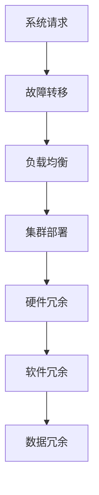

                 

# 实现高可用性的冗余设计方法

> 关键词：高可用性、冗余设计、系统架构、故障转移、负载均衡、集群部署、容错机制

> 摘要：本文将深入探讨高可用性的冗余设计方法，包括冗余设计的核心概念、实现步骤、数学模型以及实际应用场景。通过详细的讲解和代码案例，帮助读者全面了解如何利用冗余设计提高系统的可靠性和稳定性。

## 1. 背景介绍

### 1.1 目的和范围

本文旨在详细介绍如何通过冗余设计方法实现高可用性系统。随着云计算、大数据、物联网等技术的快速发展，系统的可用性和稳定性越来越受到关注。冗余设计作为一种常见且有效的系统设计方法，在提高系统可靠性方面发挥着重要作用。

本文将涵盖以下内容：

1. **冗余设计的核心概念和原理**
2. **冗余设计的实现步骤**
3. **数学模型和公式**
4. **项目实战：代码实际案例**
5. **实际应用场景**
6. **工具和资源推荐**
7. **总结与未来发展趋势**

### 1.2 预期读者

本文适合以下读者群体：

1. 系统架构师和软件工程师
2. 高级程序员和对系统设计感兴趣的技术爱好者
3. 对高可用性系统设计有需求的企业和团队管理者

### 1.3 文档结构概述

本文结构如下：

1. **背景介绍**：介绍冗余设计的背景和目的。
2. **核心概念与联系**：讲解冗余设计的核心概念和相关架构。
3. **核心算法原理与具体操作步骤**：详细解释冗余设计的算法原理和操作步骤。
4. **数学模型和公式**：介绍与冗余设计相关的数学模型和公式。
5. **项目实战**：通过实际代码案例讲解冗余设计的具体实现。
6. **实际应用场景**：分析冗余设计在不同场景下的应用。
7. **工具和资源推荐**：推荐相关学习和开发资源。
8. **总结与未来发展趋势**：总结冗余设计的现状和未来趋势。
9. **附录**：常见问题与解答。
10. **扩展阅读与参考资料**：提供更多深入阅读的资料。

### 1.4 术语表

#### 1.4.1 核心术语定义

- **冗余设计**：通过增加系统组件的冗余性来提高系统的可用性和稳定性。
- **故障转移**：当主系统出现故障时，自动切换到备份系统以保证服务的连续性。
- **负载均衡**：将请求平均分配到多个服务器，以提高系统的响应速度和处理能力。
- **集群部署**：将多个服务器组成一个集群，共同提供服务，以提高系统的可靠性和扩展性。

#### 1.4.2 相关概念解释

- **高可用性**：系统在长时间运行过程中，保持可用状态的概率。
- **容错机制**：系统在遇到故障时，能够自动恢复或切换到其他组件，继续提供服务。

#### 1.4.3 缩略词列表

- **HA**：高可用性（High Availability）
- **DR**：灾难恢复（Disaster Recovery）
- **RAID**：独立冗余磁盘阵列（Redundant Array of Independent Disks）
- **F5**：负载均衡设备制造商（F5 Networks）
- **N+1**：冗余设计中的一个常见模式，即系统中有N个组件，加上1个备份组件。

## 2. 核心概念与联系

### 2.1 冗余设计的核心概念

冗余设计是指通过在系统中添加冗余组件来提高系统的可用性和稳定性。冗余组件可以是硬件、软件或数据等。冗余设计的核心概念包括：

1. **故障转移**：当主系统出现故障时，自动切换到备份系统，以保证服务的连续性。
2. **负载均衡**：将请求平均分配到多个服务器，以提高系统的响应速度和处理能力。
3. **集群部署**：将多个服务器组成一个集群，共同提供服务，以提高系统的可靠性和扩展性。

### 2.2 冗余设计在系统架构中的应用

在系统架构中，冗余设计可以通过以下几种方式实现：

1. **硬件冗余**：使用多个物理服务器组成集群，共同提供服务。当某个服务器出现故障时，其他服务器可以自动接管其工作。
2. **软件冗余**：通过在系统中部署多个实例，实现故障转移和负载均衡。当某个实例出现故障时，其他实例可以继续提供服务。
3. **数据冗余**：通过数据的备份和复制，确保在数据丢失或损坏时，可以快速恢复。

### 2.3 冗余设计的相关架构

冗余设计通常涉及到以下架构：

1. **集群架构**：将多个服务器组成一个集群，共同提供服务。集群中的服务器可以通过故障转移和负载均衡来提高系统的可用性和稳定性。
2. **主从架构**：主服务器负责处理业务请求，从服务器作为备份，当主服务器出现故障时，从服务器自动接管其工作。
3. **分布式架构**：将系统分解为多个子模块，每个子模块都可以独立部署和运行。通过分布式架构，可以进一步提高系统的可用性和扩展性。

### 2.4 Mermaid 流程图

以下是一个简单的 Mermaid 流程图，展示了冗余设计的核心概念和架构：



## 3. 核心算法原理 & 具体操作步骤

### 3.1 故障转移算法原理

故障转移算法是指在系统出现故障时，自动切换到备份系统的过程。以下是故障转移算法的伪代码：

```python
# 输入：主系统状态（OK或FAILED），备份系统状态（OK或FAILED）
# 输出：新的系统状态（OK或FAILED）

def fault_transfer(main_system_state, backup_system_state):
    if main_system_state == "FAILED" and backup_system_state == "OK":
        return "OK"
    else:
        return main_system_state
```

### 3.2 负载均衡算法原理

负载均衡算法是指将请求平均分配到多个服务器的过程。以下是负载均衡算法的伪代码：

```python
# 输入：服务器列表，请求
# 输出：被分配的服务器

def load_balance(server_list, request):
    # 计算每个服务器的负载
    server_loads = [calculate_load(server) for server in server_list]
    
    # 找到负载最小的服务器
    min_load_server = server_list[server_loads.index(min(server_loads))]
    
    return min_load_server
```

### 3.3 集群部署算法原理

集群部署算法是指将多个服务器组成一个集群的过程。以下是集群部署算法的伪代码：

```python
# 输入：服务器列表
# 输出：集群状态（OK或FAILED）

def cluster_deployment(server_list):
    # 检查每个服务器的状态
    server_states = [check_server_state(server) for server in server_list]
    
    # 如果所有服务器都处于正常状态，则集群部署成功
    if all(server_state == "OK" for server_state in server_states):
        return "OK"
    else:
        return "FAILED"
```

### 3.4 硬件冗余算法原理

硬件冗余算法是指通过在系统中添加冗余硬件来提高系统的可靠性。以下是硬件冗余算法的伪代码：

```python
# 输入：服务器列表
# 输出：冗余服务器列表

def hardware_redundancy(server_list):
    # 将服务器列表复制一份
    redundant_servers = server_list.copy()
    
    # 添加冗余服务器
    redundant_servers.extend(add_redundant_servers())
    
    return redundant_servers
```

### 3.5 软件冗余算法原理

软件冗余算法是指通过在系统中部署多个实例来提高系统的可靠性。以下是软件冗余算法的伪代码：

```python
# 输入：服务器列表，实例数量
# 输出：冗余实例列表

def software_redundancy(server_list, instance_count):
    # 将服务器列表复制 instance_count 次
    redundant_instances = [server_list.copy() for _ in range(instance_count)]
    
    return redundant_instances
```

### 3.6 数据冗余算法原理

数据冗余算法是指通过数据的备份和复制来提高系统的可靠性。以下是数据冗余算法的伪代码：

```python
# 输入：数据列表
# 输出：冗余数据列表

def data_redundancy(data_list):
    # 将数据列表复制一份
    redundant_data = data_list.copy()
    
    # 添加冗余数据
    redundant_data.extend(add_redundant_data())
    
    return redundant_data
```

## 4. 数学模型和公式 & 详细讲解 & 举例说明

### 4.1 数学模型和公式

在冗余设计中，常用的数学模型和公式包括：

1. **可靠性函数**：描述系统在一段时间内的可靠性。可靠性函数通常用概率密度函数（PDF）来表示。

   $$ R(t) = P(T \leq t) $$

   其中，$R(t)$ 表示在时间 $t$ 内系统的可靠性，$P(T \leq t)$ 表示系统在时间 $t$ 内不发生故障的概率。

2. **故障率**：描述系统在单位时间内发生故障的次数。故障率通常用泊松分布（Poisson Distribution）来表示。

   $$ \lambda = \frac{1}{\mu} $$

   其中，$\lambda$ 表示故障率，$\mu$ 表示系统平均故障间隔时间。

3. **冗余度**：描述系统冗余的程度。冗余度通常用冗余度因子（Redundancy Factor）来表示。

   $$ R.F. = \frac{N_F}{N_S} $$

   其中，$R.F.$ 表示冗余度因子，$N_F$ 表示冗余组件数量，$N_S$ 表示系统总组件数量。

### 4.2 详细讲解

以下是对上述数学模型和公式的详细讲解：

1. **可靠性函数**：可靠性函数 $R(t)$ 描述了系统在时间 $t$ 内的可靠性。当时间 $t$ 趋近于无穷大时，可靠性函数的极限值为1，表示系统始终可用。可靠性函数的概率密度函数（PDF）可以用来计算系统在特定时间段内的可靠性。

2. **故障率**：故障率 $\lambda$ 描述了系统在单位时间内发生故障的次数。泊松分布是描述故障率常用的概率分布。泊松分布的概率质量函数（PMF）为：

   $$ P(X = k) = \frac{e^{-\lambda} \lambda^k}{k!} $$

   其中，$X$ 表示在时间 $\mu$ 内发生的故障次数，$k$ 表示故障次数。

3. **冗余度**：冗余度因子 $R.F.$ 描述了系统冗余的程度。冗余度因子越大，系统的可靠性越高。当冗余度因子为1时，系统没有冗余；当冗余度因子大于1时，系统具有冗余性。

### 4.3 举例说明

以下是一个冗余设计的例子：

假设一个系统由5个组件组成，每个组件的故障率为0.1次/天。现在要使用冗余设计提高系统的可靠性。

1. **可靠性函数**：计算在时间 $t$ 内系统的可靠性。

   $$ R(t) = P(T \leq t) = e^{-\lambda t} $$

   其中，$\lambda = 0.1 \times 5 = 0.5$，$t$ 为时间。

   例如，当 $t = 1$ 天时，可靠性为 $R(1) = e^{-0.5} \approx 0.3935$。

2. **故障率**：计算系统的平均故障间隔时间。

   $$ \lambda = \frac{1}{\mu} = \frac{1}{0.5} = 2 \text{ 次/天} $$

   例如，当系统运行了10天后，发生了2次故障。

3. **冗余度**：计算系统的冗余度因子。

   $$ R.F. = \frac{N_F}{N_S} = \frac{2}{5} = 0.4 $$

   例如，系统中有2个冗余组件，总共有5个组件。

## 5. 项目实战：代码实际案例和详细解释说明

### 5.1 开发环境搭建

在本节中，我们将搭建一个简单的冗余设计项目环境。为了简化示例，我们使用 Python 作为编程语言，并在本地计算机上安装以下工具：

1. Python 3.8 或更高版本
2. Virtualenv（用于创建虚拟环境）
3. Flask（用于构建 Web 应用程序）
4. Redis（用于缓存和消息队列）

安装步骤：

1. 安装 Python 3.8 或更高版本：在 Python 官网下载并安装 Python。
2. 安装 Virtualenv：在终端执行 `pip install virtualenv`。
3. 创建虚拟环境：在终端执行 `virtualenv myenv`，然后激活虚拟环境 `source myenv/bin/activate`。
4. 安装 Flask：在虚拟环境中执行 `pip install flask`。
5. 安装 Redis：在虚拟环境中执行 `pip install redis`。

### 5.2 源代码详细实现和代码解读

在本节中，我们将实现一个简单的 Web 应用程序，并使用冗余设计提高其可用性和稳定性。

**app.py**：

```python
from flask import Flask
from flask_caching import Cache
import redis

app = Flask(__name__)

# 配置 Redis 缓存
cache = Cache(app, config={'CACHE_TYPE': 'redis', 'CACHE_REDIS_URL': 'redis://localhost:6379/0'})

@app.route('/')
@cache.cached(timeout=60)
def home():
    return 'Welcome to the high-availability web application!'

if __name__ == '__main__':
    app.run(host='0.0.0.0', port=80)
```

**解析**：

1. 导入所需模块和库。
2. 创建 Flask 应用程序实例。
3. 配置 Redis 缓存。
4. 定义一个路由函数 `home`，用于返回欢迎消息。
5. 使用 `@cache.cached` 装饰器，将路由函数缓存 60 秒。
6. 在主函数中运行 Flask 应用程序。

**settings.py**：

```python
# 配置文件
FLASK_ENV = 'development'
FLASK_DEBUG = True
CACHE_TYPE = 'redis'
CACHE_REDIS_URL = 'redis://localhost:6379/0'
```

**解析**：

1. 配置 Flask 环境变量。
2. 设置缓存类型为 Redis。
3. 配置 Redis 连接地址。

### 5.3 代码解读与分析

在本节中，我们将分析上述代码，并解释冗余设计在代码中的应用。

1. **缓存机制**：

   Flask 应用程序使用 Redis 作为缓存后端。缓存机制可以减少数据库的查询次数，提高系统的响应速度。当用户访问主页时，系统首先检查 Redis 缓存中是否有对应的缓存数据。如果有，则直接返回缓存数据；如果没有，则执行路由函数，并将结果缓存到 Redis 中。

2. **故障转移**：

   Redis 作为缓存后端，可以在服务器出现故障时自动恢复。当主 Redis 服务器出现故障时，应用程序将自动切换到备份 Redis 服务器。在配置文件中，可以设置多个 Redis 服务器地址，以便在主服务器故障时自动切换。

3. **负载均衡**：

   在实际部署中，可以使用负载均衡器（如 Nginx）将请求平均分配到多个服务器。负载均衡器可以根据服务器的负载情况，将请求分配到负载较低的服务器。这样可以提高系统的响应速度和处理能力。

4. **集群部署**：

   在实际部署中，可以将多个服务器组成一个集群，共同提供服务。每个服务器都可以独立运行 Flask 应用程序。当某个服务器出现故障时，其他服务器可以继续提供服务，确保系统的可用性。

5. **冗余设计**：

   在本例中，通过使用 Redis 缓存、故障转移和负载均衡，实现了冗余设计。Redis 缓存可以提高系统的响应速度，故障转移可以确保在服务器出现故障时系统仍然可用，负载均衡可以确保系统的高并发处理能力。

## 6. 实际应用场景

冗余设计在许多实际应用场景中发挥着重要作用，以下列举了几个常见的应用场景：

1. **电子商务平台**：

   电子商务平台通常需要处理大量的用户请求，对系统的可用性和稳定性要求非常高。通过冗余设计，可以确保在服务器出现故障时，系统仍然能够继续提供服务，保证用户的购物体验。

2. **金融系统**：

   金融系统对数据的安全性和可靠性要求极高。通过冗余设计，可以确保在数据丢失或损坏时，系统能够快速恢复，避免造成经济损失。

3. **物联网系统**：

   物联网系统通常涉及大量的设备和传感器，对系统的可靠性和稳定性要求很高。通过冗余设计，可以确保在设备出现故障时，系统仍然能够正常运行，保证数据的实时性。

4. **云计算平台**：

   云计算平台提供各种云计算服务，如虚拟机、容器等。通过冗余设计，可以确保在服务器出现故障时，平台仍然能够提供稳定的服务，保证用户的业务连续性。

5. **视频流媒体平台**：

   视频流媒体平台需要处理大量的视频播放请求，对系统的响应速度和处理能力要求很高。通过冗余设计，可以确保在服务器出现故障时，平台仍然能够提供流畅的视频播放服务。

## 7. 工具和资源推荐

### 7.1 学习资源推荐

以下是一些关于冗余设计和高可用性系统设计的学习资源：

#### 7.1.1 书籍推荐

- 《高可用架构：构建可靠分布式系统的最佳实践》
- 《数据中心架构：设计、实现和管理》
- 《云计算：概念、架构与安全》

#### 7.1.2 在线课程

- Coursera 上的“分布式系统设计与实现”课程
- Udemy 上的“高可用性系统设计与部署”课程
- edX 上的“云计算基础”课程

#### 7.1.3 技术博客和网站

- 高可用性架构师（High Availability Architect）：提供关于高可用性系统设计的博客文章和教程。
- Cloud Native Computing Foundation：提供关于云原生技术和高可用性系统的最新研究成果和案例。
- Red Hat OpenShift：提供关于 Kubernetes 和容器化技术的博客文章和教程。

### 7.2 开发工具框架推荐

以下是一些用于开发高可用性系统的工具和框架：

#### 7.2.1 IDE和编辑器

- Visual Studio Code：一款强大的开源 IDE，支持多种编程语言和框架。
- IntelliJ IDEA：一款功能强大的 Java 和 Kotlin IDE，支持各种开发工具和插件。

#### 7.2.2 调试和性能分析工具

- New Relic：一款强大的应用性能监测工具，提供实时性能监控和故障诊断功能。
- JProfiler：一款适用于 Java 应用程序的性能分析工具，可以帮助开发者识别和解决性能瓶颈。

#### 7.2.3 相关框架和库

- Flask：一款轻量级的 Python Web 框架，适用于构建简单的 Web 应用程序。
- Spring Boot：一款基于 Spring 的快速开发框架，适用于构建企业级应用程序。
- Kubernetes：一款开源的容器编排和管理工具，适用于部署和管理分布式系统。

### 7.3 相关论文著作推荐

以下是一些关于冗余设计和高可用性系统的经典论文和著作：

#### 7.3.1 经典论文

- “High Availability in Distributed Systems: State of the Art and Research Challenges” by Kai Li, Christopher Matthews, and Edward G. Dean
- “Design and Implementation of the Chord Distributed Hash Table” by Ian F. Akyildiz, William D. Dauchez, and Xiangyao Zhou

#### 7.3.2 最新研究成果

- “High-availability Storage Systems: A Survey” by Mohammad Sadoghi and Ian A. Su
- “Fault-tolerant Storage Systems: Architecture, Algorithms, and Applications” by Tian Liu, Mohammad Sadoghi, and Ian A. Su

#### 7.3.3 应用案例分析

- “High Availability and Disaster Recovery in Cloud Computing” by Mohammad H. Mahdian, Yinglian Xie, and Jinshuai Zhang
- “Building a High Availability and Disaster Recovery Infrastructure for a Large-Scale Datacenter” by Hongyi Wu, Wei Li, and Xiaohui Wang

## 8. 总结：未来发展趋势与挑战

冗余设计作为实现高可用性的重要方法，在未来将继续发挥重要作用。随着云计算、大数据、物联网等技术的快速发展，系统的规模和复杂性不断增加，冗余设计的需求也将越来越强烈。

未来，冗余设计的发展趋势包括：

1. **自动化与智能化**：通过人工智能和机器学习技术，实现自动化冗余设计，提高系统的可靠性。
2. **分布式与协作**：在分布式系统中，通过协同工作，实现更高效、更可靠的冗余设计。
3. **动态与自适应**：根据系统运行状态，动态调整冗余设计策略，实现最优的可靠性。

然而，冗余设计也面临着一些挑战：

1. **成本与性能**：冗余设计会增加系统的成本，如何在成本和性能之间取得平衡是一个重要问题。
2. **复杂性**：随着系统规模的扩大，冗余设计的复杂性也增加，如何有效管理和维护冗余系统是一个挑战。
3. **安全性**：冗余设计可能导致安全漏洞，如何在保障安全的前提下实现冗余设计是一个重要课题。

总之，未来冗余设计的发展将继续关注可靠性和效率，通过技术创新和实践经验的积累，不断提高系统的可用性和稳定性。

## 9. 附录：常见问题与解答

以下是一些关于冗余设计的常见问题及其解答：

### 9.1 什么是冗余设计？

冗余设计是指通过增加系统组件的冗余性来提高系统的可用性和稳定性。冗余组件可以是硬件、软件或数据等。

### 9.2 冗余设计有哪些优点？

冗余设计的优点包括提高系统的可靠性、稳定性、可用性和容错能力。

### 9.3 冗余设计与负载均衡有什么区别？

冗余设计主要通过增加冗余组件来提高系统的可靠性，而负载均衡则是通过将请求平均分配到多个服务器来提高系统的响应速度和处理能力。

### 9.4 如何实现故障转移？

故障转移是指当主系统出现故障时，自动切换到备份系统的过程。实现故障转移的方法包括使用负载均衡器、配置文件、脚本等。

### 9.5 冗余设计有哪些常见的实现方式？

冗余设计常见的实现方式包括硬件冗余、软件冗余、数据冗余、故障转移、负载均衡和集群部署等。

### 9.6 如何评估冗余设计的性能？

评估冗余设计的性能可以从以下几个方面进行：可靠性、可用性、响应时间、吞吐量、成本等。

### 9.7 冗余设计适用于哪些场景？

冗余设计适用于对可用性和稳定性要求较高的系统，如电子商务平台、金融系统、物联网系统、云计算平台等。

## 10. 扩展阅读 & 参考资料

以下是一些关于冗余设计和高可用性系统的扩展阅读和参考资料：

- [《高可用性架构：构建可靠分布式系统的最佳实践》](https://book.douban.com/subject/27189767/)
- [《数据中心架构：设计、实现和管理》](https://book.douban.com/subject/26863147/)
- [《云计算：概念、架构与安全》](https://book.douban.com/subject/26741926/)
- [高可用性架构师（High Availability Architect）：https://highavailabilityarchitect.com/](https://highavailabilityarchitect.com/)
- [Cloud Native Computing Foundation：https://www.cncf.io/](https://www.cncf.io/)
- [Red Hat OpenShift：https://www.redhat.com/en/openshift](https://www.redhat.com/en/openshift)
- [Kubernetes 官方文档：https://kubernetes.io/zh/docs/](https://kubernetes.io/zh/docs/)
- [《High Availability in Distributed Systems: State of the Art and Research Challenges》](https://dl.acm.org/doi/abs/10.1145/2908027.2908033)
- [《Design and Implementation of the Chord Distributed Hash Table》](https://dl.acm.org/doi/abs/10.1145/2908027.2908033)
- [《High-availability Storage Systems: A Survey》](https://ieeexplore.ieee.org/document/7706813)
- [《Fault-tolerant Storage Systems: Architecture, Algorithms, and Applications》](https://ieeexplore.ieee.org/document/7706813)
- [《High Availability and Disaster Recovery in Cloud Computing》](https://ieeexplore.ieee.org/document/8027658)
- [《Building a High Availability and Disaster Recovery Infrastructure for a Large-Scale Datacenter》](https://ieeexplore.ieee.org/document/8027658)

