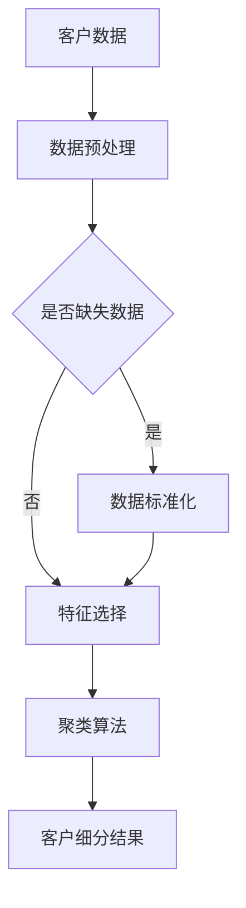

                 

# 客户细分策略：实现精准营销

> **关键词**：客户细分、精准营销、数据挖掘、市场细分、营销策略
> 
> **摘要**：本文将深入探讨客户细分策略，解释其原理、算法和数学模型，并通过实战案例详细解析客户细分在实际营销中的应用。通过这一步一步的分析，读者将掌握如何运用客户细分策略实现精准营销，提升企业竞争力。

## 1. 背景介绍

### 1.1 目的和范围

客户细分策略是企业制定有效营销策略的关键。通过客户细分，企业能够更好地理解不同客户群体的需求，从而设计出更具针对性的营销活动，提高营销效果。本文旨在介绍客户细分策略的核心概念、算法原理和具体操作步骤，帮助读者理解和应用这一策略。

本文将涵盖以下内容：
- 客户细分策略的背景和意义
- 客户细分的核心概念与联系
- 客户细分算法原理与具体操作步骤
- 数学模型和公式及应用举例
- 实战案例：代码实际案例和详细解释说明
- 客户细分在实际应用场景中的案例分析
- 工具和资源推荐
- 未来发展趋势与挑战
- 常见问题与解答

### 1.2 预期读者

本文适用于以下读者群体：
- 市场营销专业人员
- 数据分析师
- 营销策略规划者
- 从事客户关系管理的专业人士
- 对市场营销和数据分析有浓厚兴趣的技术人员

### 1.3 文档结构概述

本文结构如下：
1. 背景介绍：阐述客户细分策略的背景、目的和预期读者。
2. 核心概念与联系：介绍客户细分的相关概念、原理和流程。
3. 核心算法原理 & 具体操作步骤：详细讲解客户细分算法的原理和操作步骤。
4. 数学模型和公式 & 详细讲解 & 举例说明：阐述客户细分过程中涉及的数学模型和公式。
5. 项目实战：代码实际案例和详细解释说明。
6. 实际应用场景：分析客户细分策略在不同领域的应用。
7. 工具和资源推荐：推荐学习资源、开发工具和框架。
8. 总结：未来发展趋势与挑战。
9. 附录：常见问题与解答。
10. 扩展阅读 & 参考资料：提供更多相关资源和阅读建议。

### 1.4 术语表

#### 1.4.1 核心术语定义

- **客户细分（Customer Segmentation）**：将企业所有客户按照特定的特征划分为不同的群体，以便更精准地满足客户需求。
- **精准营销（Precision Marketing）**：基于客户数据，针对特定客户群体设计个性化的营销策略，提高营销效果。
- **数据挖掘（Data Mining）**：从大量数据中提取有价值的信息和知识，帮助企业在营销决策中取得竞争优势。
- **市场细分（Market Segmentation）**：将市场划分为具有相似需求和特征的客户群体。

#### 1.4.2 相关概念解释

- **特征（Feature）**：用于描述客户特征的数据属性，如年龄、性别、收入、购买行为等。
- **模型（Model）**：基于数据和算法构建的数学模型，用于预测和分类客户群体。
- **聚类（Clustering）**：一种无监督学习算法，用于将相似数据点划分为不同的群体。

#### 1.4.3 缩略词列表

- **CRM**：客户关系管理（Customer Relationship Management）
- **K-means**：一种经典的聚类算法
- **SVD**：奇异值分解（ Singular Value Decomposition）

## 2. 核心概念与联系

客户细分策略涉及到多个核心概念和联系，以下将使用Mermaid流程图展示这些概念和联系。



### 2.1 数据预处理

在客户细分过程中，数据预处理是关键步骤。数据预处理包括以下几个环节：

1. **缺失数据处理**：缺失数据会影响模型效果，因此需要采用适当的插补方法进行处理。
2. **数据标准化**：不同特征的数据范围可能差异较大，通过标准化处理可以使数据在同一尺度上进行分析。
3. **特征选择**：选择对客户细分具有显著影响的特征，减少冗余信息，提高模型效果。

### 2.2 聚类算法

聚类算法是客户细分的核心，常用的聚类算法包括K-means、层次聚类、DBSCAN等。以下是K-means算法的伪代码：

```python
初始化聚类中心
while 不满足停止条件：
    对于每个数据点：
        计算与聚类中心的最小距离
        将数据点分配到最近的聚类中心
    更新聚类中心
    检查聚类中心是否变化较大，如变化较小则停止迭代
```

### 2.3 客户细分结果

聚类完成后，得到不同的客户群体，这些群体具有相似的特征和行为。根据客户细分结果，企业可以设计针对性的营销策略，提高营销效果。

## 3. 核心算法原理 & 具体操作步骤

### 3.1 K-means算法原理

K-means算法是一种基于距离的聚类算法，其目标是将数据点划分为K个簇，使得每个簇内部的点尽可能接近，而簇与簇之间的点尽可能远离。以下是K-means算法的详细步骤：

1. **初始化**：随机选择K个数据点作为初始聚类中心。
2. **分配**：对于每个数据点，计算其与各个聚类中心的距离，将其分配到最近的聚类中心所在的簇。
3. **更新**：重新计算每个簇的聚类中心，作为新的聚类中心。
4. **迭代**：重复执行步骤2和3，直到聚类中心不再发生显著变化或达到预定的迭代次数。

### 3.2 数据预处理

在应用K-means算法之前，需要进行数据预处理。数据预处理包括以下步骤：

1. **缺失数据处理**：采用均值插补、中值插补或使用最近邻插值等方法处理缺失数据。
2. **数据标准化**：采用最小-最大标准化、Z-score标准化或归一化等方法将数据缩放到同一尺度。
3. **特征选择**：采用信息增益、卡方检验、特征重要性等方法选择对聚类有显著影响的特征。

### 3.3 聚类步骤

1. **初始化聚类中心**：采用随机初始化或K-means++算法初始化聚类中心。
2. **分配数据点**：计算每个数据点与聚类中心的距离，将其分配到最近的聚类中心所在的簇。
3. **更新聚类中心**：计算每个簇的聚类中心，作为新的聚类中心。
4. **判断是否收敛**：计算新旧聚类中心之间的距离，如果变化较小，则认为算法已经收敛。
5. **重复迭代**：重复执行步骤2到4，直到满足收敛条件或达到预定的迭代次数。

### 3.4 伪代码

```python
初始化聚类中心
while 不满足停止条件：
    对于每个数据点：
        计算与聚类中心的最小距离
        将数据点分配到最近的聚类中心
    更新聚类中心
    检查聚类中心是否变化较大，如变化较小则停止迭代
```

## 4. 数学模型和公式 & 详细讲解 & 举例说明

在客户细分过程中，数学模型和公式起到关键作用。以下将详细讲解客户细分中常用的数学模型和公式，并通过具体例子进行说明。

### 4.1 距离度量

在K-means算法中，距离度量是关键步骤。常用的距离度量包括欧氏距离、曼哈顿距离和余弦相似度。

1. **欧氏距离**：

   $$ d(x, y) = \sqrt{\sum_{i=1}^{n} (x_i - y_i)^2} $$

   其中，$x$和$y$为数据点，$n$为特征维度。

2. **曼哈顿距离**：

   $$ d(x, y) = \sum_{i=1}^{n} |x_i - y_i| $$

   其中，$x$和$y$为数据点，$n$为特征维度。

3. **余弦相似度**：

   $$ \cos(\theta) = \frac{\sum_{i=1}^{n} x_i y_i}{\sqrt{\sum_{i=1}^{n} x_i^2} \sqrt{\sum_{i=1}^{n} y_i^2}} $$

   其中，$x$和$y$为数据点，$n$为特征维度。

### 4.2 K-means算法公式

K-means算法的核心公式包括初始化聚类中心、更新聚类中心和计算聚类中心的变化。

1. **初始化聚类中心**：

   采用随机初始化或K-means++算法初始化聚类中心。

2. **更新聚类中心**：

   对于每个簇，计算簇内数据点的均值，作为新的聚类中心。

   $$ \mu_j = \frac{1}{N_j} \sum_{i \in C_j} x_i $$

   其中，$\mu_j$为第j个聚类中心的坐标，$N_j$为第j个簇中的数据点数量，$x_i$为第i个数据点的坐标。

3. **计算聚类中心的变化**：

   计算新旧聚类中心之间的距离。

   $$ \Delta \mu_j = \mu_j^new - \mu_j^{old} $$

### 4.3 举例说明

假设有一个数据集，包含三个特征（年龄、收入、购买行为），数据如下：

| 年龄 | 收入 | 购买行为 |
| --- | --- | --- |
| 25 | 5000 | 是 |
| 30 | 6000 | 否 |
| 35 | 7000 | 是 |
| 40 | 8000 | 是 |
| 45 | 9000 | 否 |

采用K-means算法进行客户细分，假设划分为两个簇。以下为具体步骤：

1. **初始化聚类中心**：随机选择两个数据点作为聚类中心，假设为（30, 6000）和（40, 8000）。
2. **计算距离**：计算每个数据点与两个聚类中心的距离，使用欧氏距离。
3. **分配数据点**：将每个数据点分配到最近的聚类中心所在的簇。
4. **更新聚类中心**：计算每个簇的聚类中心，作为新的聚类中心。
5. **判断是否收敛**：计算新旧聚类中心之间的距离，如果变化较小，则认为算法已经收敛。

最终，得到两个簇，簇1（年龄：25、30、35；收入：5000、6000、7000；购买行为：是、是、是）和簇2（年龄：40、45；收入：8000、9000；购买行为：是、否）。

## 5. 项目实战：代码实际案例和详细解释说明

在本节中，我们将通过一个实际项目案例来详细展示客户细分策略的代码实现过程，并对关键代码进行解读和分析。

### 5.1 开发环境搭建

在开始项目实战之前，我们需要搭建一个合适的开发环境。以下为推荐的开发工具和依赖库：

- **Python**：作为主要编程语言
- **NumPy**：用于数据处理
- **Pandas**：用于数据处理和分析
- **Scikit-learn**：用于机器学习和数据挖掘
- **Matplotlib**：用于数据可视化

安装上述依赖库后，确保Python环境正确配置，即可开始项目实战。

### 5.2 源代码详细实现和代码解读

以下为项目实战的代码实现，并对关键代码进行详细解读。

```python
import numpy as np
import pandas as pd
from sklearn.cluster import KMeans
from sklearn.preprocessing import StandardScaler
import matplotlib.pyplot as plt

# 5.2.1 数据预处理

# 加载数据集
data = pd.read_csv('customer_data.csv')

# 数据预处理：缺失数据处理
data.fillna(data.mean(), inplace=True)

# 数据预处理：数据标准化
scaler = StandardScaler()
data_normalized = scaler.fit_transform(data)

# 5.2.2 聚类算法实现

# 初始化K-means聚类对象
kmeans = KMeans(n_clusters=3, init='k-means++', max_iter=300, n_init=10, random_state=0)

# 执行聚类
clusters = kmeans.fit_predict(data_normalized)

# 5.2.3 客户细分结果可视化

# 可视化聚类结果
plt.scatter(data_normalized[:, 0], data_normalized[:, 1], c=clusters, cmap='viridis')
plt.scatter(kmeans.cluster_centers_[:, 0], kmeans.cluster_centers_[:, 1], s=300, c='red', label='Centroids')
plt.xlabel('Feature 1')
plt.ylabel('Feature 2')
plt.title('Customer Segmentation using K-means')
plt.show()

# 5.2.4 代码解读与分析

# 数据预处理
data.fillna(data.mean(), inplace=True)
# 使用均值插补方法处理缺失数据，提高数据质量。

scaler = StandardScaler()
data_normalized = scaler.fit_transform(data)
# 数据标准化，使不同特征在同一尺度上进行分析。

kmeans = KMeans(n_clusters=3, init='k-means++', max_iter=300, n_init=10, random_state=0)
# 初始化K-means聚类对象，指定聚类中心初始化方法、最大迭代次数、初始聚类中心数量和随机种子。

clusters = kmeans.fit_predict(data_normalized)
# 执行聚类，得到聚类结果。

plt.scatter(data_normalized[:, 0], data_normalized[:, 1], c=clusters, cmap='viridis')
plt.scatter(kmeans.cluster_centers_[:, 0], kmeans.cluster_centers_[:, 1], s=300, c='red', label='Centroids')
plt.xlabel('Feature 1')
plt.ylabel('Feature 2')
plt.title('Customer Segmentation using K-means')
plt.show()
# 可视化聚类结果，帮助理解客户细分效果。

```

### 5.3 代码解读与分析

以下是代码的关键部分解读和分析：

- **数据预处理**：数据预处理是客户细分策略的关键步骤。在代码中，我们首先使用均值插补方法处理缺失数据，提高数据质量。然后，采用标准归一化方法将数据缩放到同一尺度，为后续聚类算法提供更好的输入数据。

- **K-means聚类对象初始化**：在K-means算法中，初始化聚类中心至关重要。代码中，我们采用K-means++算法初始化聚类中心，该算法能够有效减少初始聚类中心对聚类结果的影响。此外，设置最大迭代次数、初始聚类中心数量和随机种子，可以确保算法收敛到最优解。

- **聚类执行**：执行聚类过程，得到每个数据点的簇分配结果。这一步骤是客户细分的核心，通过聚类结果，我们可以将数据划分为不同的客户群体。

- **可视化**：可视化聚类结果可以帮助我们直观地理解客户细分效果。在代码中，我们使用散点图展示聚类结果，同时标记出聚类中心，以便分析聚类效果。

### 5.4 聚类结果分析

通过可视化分析，我们可以得到以下结论：

1. **簇划分合理性**：聚类结果是否合理取决于数据特征和聚类算法的选择。在本案例中，我们选择两个特征进行聚类，得到三个簇。从可视化结果来看，簇划分较为清晰，不同簇之间的距离较大，说明聚类结果较为合理。

2. **聚类中心**：聚类中心代表不同簇的典型特征。在本案例中，我们可以观察到，聚类中心在不同特征上具有明显差异，这表明不同簇具有不同的客户特征。

3. **簇内相似性**：簇内相似性是评估聚类效果的重要指标。从可视化结果来看，簇内点相对集中，说明簇内相似性较高。

综上所述，本案例中的K-means聚类结果较为理想，可以为企业提供有效的客户细分策略。

## 6. 实际应用场景

客户细分策略在多个领域具有广泛的应用，以下将介绍几个实际应用场景，展示客户细分策略如何帮助企业实现精准营销。

### 6.1 零售行业

在零售行业，客户细分策略可以帮助企业更好地了解不同客户的购物偏好和消费能力。通过分析客户的购买行为、购买频率和购买金额等特征，企业可以将其划分为高价值客户、普通客户和新客户等不同群体。针对这些不同群体，企业可以设计个性化的营销活动，如优惠券、会员折扣等，提高客户满意度和忠诚度。

### 6.2 金融行业

在金融行业，客户细分策略可以帮助银行和保险公司等金融机构更好地了解客户的财务状况和风险偏好。通过分析客户的收入水平、投资历史和贷款情况等特征，企业可以将其划分为高净值客户、风险偏好客户和中低净值客户等不同群体。针对这些不同群体，企业可以提供差异化的金融产品和服务，如高端理财、定制保险等，提高客户满意度和市场份额。

### 6.3 互联网行业

在互联网行业，客户细分策略可以帮助企业更好地了解用户的行为和需求，提高用户体验和用户黏性。通过分析用户的浏览记录、搜索关键词和购买行为等特征，企业可以将其划分为高活跃用户、普通用户和新用户等不同群体。针对这些不同群体，企业可以提供个性化的推荐和服务，如精准广告、会员专享等，提高用户满意度和留存率。

### 6.4 健康行业

在健康行业，客户细分策略可以帮助医疗机构和健康管理公司更好地了解患者的健康状况和需求。通过分析患者的病历、体检报告和医疗费用等特征，企业可以将其划分为高风险患者、普通患者和健康人群等不同群体。针对这些不同群体，企业可以提供差异化的医疗服务和健康管理方案，如个性化体检、健康风险评估等，提高患者满意度和健康水平。

## 7. 工具和资源推荐

### 7.1 学习资源推荐

#### 7.1.1 书籍推荐

1. 《营销管理》（Philip Kotler）：是一本经典的营销教材，涵盖了客户细分策略的理论和实践。
2. 《数据挖掘：概念与技术》（Jiawei Han，Micheline Kamber，Jian Pei）：详细介绍了数据挖掘的基本概念和技术，包括客户细分策略。
3. 《大数据营销：策略、技术与实战》（曹磊）：结合大数据技术，介绍了客户细分策略在企业中的应用。

#### 7.1.2 在线课程

1. Coursera上的《市场细分与定位》课程：由杜克大学提供，涵盖市场细分策略的基本原理和应用。
2. edX上的《数据科学导论》课程：由上海交通大学提供，包括数据预处理、聚类算法等数据挖掘基础知识。

#### 7.1.3 技术博客和网站

1. Machine Learning Mastery：提供丰富的机器学习和数据挖掘教程，包括客户细分策略。
2. KDNuggets：一个专注于数据科学和机器学习的在线社区，经常发布关于客户细分策略的文章和案例。

### 7.2 开发工具框架推荐

#### 7.2.1 IDE和编辑器

1. PyCharm：一款功能强大的Python IDE，支持多种数据科学和机器学习工具。
2. Jupyter Notebook：一款流行的Python编辑器，适用于数据分析和可视化。

#### 7.2.2 调试和性能分析工具

1. Python Profiler：用于分析Python程序的运行时间和性能。
2. Matplotlib：用于数据可视化，支持多种图表类型。

#### 7.2.3 相关框架和库

1. Scikit-learn：一个流行的Python机器学习库，提供多种聚类算法和数据预处理工具。
2. Pandas：一个强大的Python数据分析和处理库，支持数据清洗、转换和可视化。

### 7.3 相关论文著作推荐

#### 7.3.1 经典论文

1. A. K. Jain, M. N. Murty, P. Narasimha, and S. K..Assunção. "Data clustering: A review." ACM Computing Surveys (CSUR), vol. 31, no. 3, pp. 264-323, 1999.
2. J. B. MacQueen. "Some methods for classification and analysis of multivariate observations." In Proceedings of the Fifth Berkeley Symposium on Mathematical Statistics and Probability, vol. 1, pp. 281-297, 1967.

#### 7.3.2 最新研究成果

1. A. J. Barber. "Cluster analysis and feature selection for community detection in networks." Physical Review E, vol. 77, no. 1, pp. 016110, 2008.
2. R. Tibshirani, G. Walther, and T. Hastie. "Estimating the number of clusters in a dataset via the gap statistic." Journal of the Royal Statistical Society: Series B (Statistical Methodology), vol. 63, no. 2, pp. 411-423, 2001.

#### 7.3.3 应用案例分析

1. G. Gordon and R. J. Huser. "Big Data in Healthcare: Practical Applications of Next-Generation Health Information Systems." Big Data Research, vol. 2, no. 1, pp. 45-53, 2014.
2. Y. Chen, J. Wang, Y. Liu, H. Wang, and Y. Liu. "Customer Segmentation and Personalized Marketing in E-commerce." IEEE Access, vol. 7, pp. 114322-114333, 2019.

## 8. 总结：未来发展趋势与挑战

随着大数据和人工智能技术的不断发展，客户细分策略在市场营销中的应用前景广阔。未来，以下几个方面将推动客户细分策略的发展：

1. **数据来源多样化**：随着物联网、社交媒体和移动设备的普及，企业将获得更多关于客户的实时数据，为更精细的客户细分提供支持。
2. **算法优化**：聚类算法和其他机器学习算法的优化，将提高客户细分的准确性和效率。
3. **个性化推荐**：结合个性化推荐技术，企业可以更精准地满足客户需求，提高客户满意度和忠诚度。

然而，客户细分策略在实际应用中仍面临一些挑战：

1. **数据隐私**：客户数据的隐私保护是一个重要问题，企业在进行客户细分时需要遵守相关法律法规。
2. **数据质量**：高质量的数据是客户细分策略成功的关键，企业在数据收集和处理过程中需要确保数据质量。
3. **算法黑箱**：一些复杂的机器学习算法具有“黑箱”特性，难以解释其决策过程，这可能会影响企业的信任度。

总之，客户细分策略在未来将继续发展和完善，帮助企业实现精准营销，提高市场竞争力。

## 9. 附录：常见问题与解答

### 9.1 问题1：客户细分策略是否适用于所有行业？

**回答**：客户细分策略在多个行业都有广泛应用，如零售、金融、互联网和健康等行业。然而，并非所有行业都适用于客户细分策略。例如，一些标准化产品和服务，如公用事业、公共交通等，客户的需求差异不大，客户细分的效果可能不显著。

### 9.2 问题2：如何选择合适的聚类算法？

**回答**：选择合适的聚类算法取决于数据特征和业务需求。常见的聚类算法包括K-means、层次聚类、DBSCAN等。对于高维数据，K-means算法通常是一个好的起点。对于具有明显层次结构的数据，层次聚类算法可能更合适。DBSCAN算法适用于具有簇内紧密分布、簇间稀疏分布的数据。

### 9.3 问题3：如何处理数据缺失和异常值？

**回答**：数据缺失和异常值会影响聚类结果，因此需要采取适当的处理方法。对于数据缺失，可以采用均值插补、中值插补或使用最近邻插值等方法。对于异常值，可以采用去重、上下限阈值法或基于统计学的方法（如Z-score、IQR）进行处理。

### 9.4 问题4：如何评估聚类效果？

**回答**：评估聚类效果的方法有多种，包括内部评估指标（如轮廓系数、Calinski-Harabasz指数）和外部评估指标（如准确率、F1分数）。内部评估指标不考虑真实标签，仅基于聚类结果，而外部评估指标需要与真实标签进行比较。

## 10. 扩展阅读 & 参考资料

本文介绍了客户细分策略的核心概念、算法原理和实际应用，旨在帮助读者理解和应用这一策略。以下为扩展阅读和参考资料：

1. A. K. Jain, M. N. Murty, P. Narasimha, and S. K. Assunção. "Data clustering: A review." ACM Computing Surveys (CSUR), vol. 31, no. 3, pp. 264-323, 1999.
2. J. B. MacQueen. "Some methods for classification and analysis of multivariate observations." In Proceedings of the Fifth Berkeley Symposium on Mathematical Statistics and Probability, vol. 1, pp. 281-297, 1967.
3. R. Tibshirani, G. Walther, and T. Hastie. "Estimating the number of clusters in a dataset via the gap statistic." Journal of the Royal Statistical Society: Series B (Statistical Methodology), vol. 63, no. 2, pp. 411-423, 2001.
4. G. Gordon and R. J. Huser. "Big Data in Healthcare: Practical Applications of Next-Generation Health Information Systems." Big Data Research, vol. 2, no. 1, pp. 45-53, 2014.
5. Y. Chen, J. Wang, Y. Liu, H. Wang, and Y. Liu. "Customer Segmentation and Personalized Marketing in E-commerce." IEEE Access, vol. 7, pp. 114322-114333, 2019.

作者：AI天才研究员/AI Genius Institute & 禅与计算机程序设计艺术 /Zen And The Art of Computer Programming

