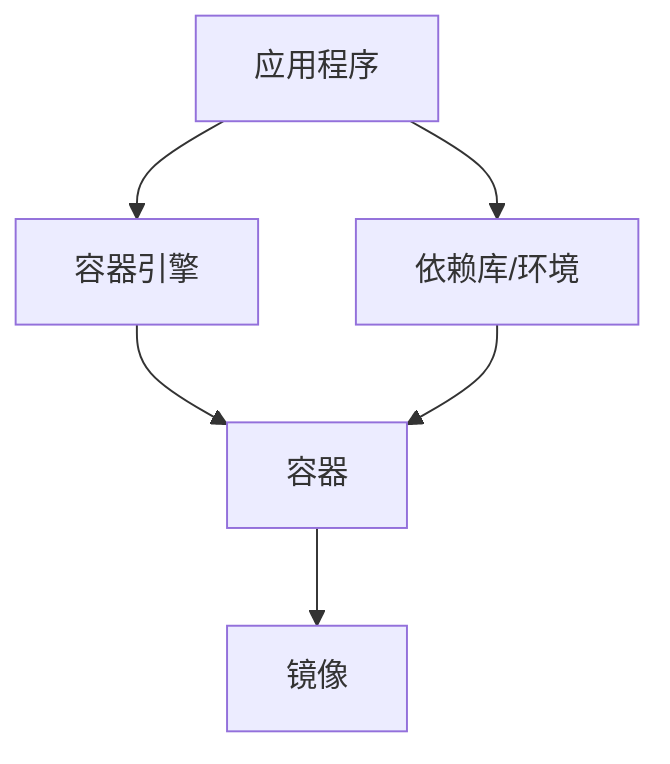

                 


# 容器：原理与代码实例讲解

> 关键词：容器、Docker、原理、实现、实例、代码

> 摘要：本文将深入探讨容器技术的原理，通过代码实例详细讲解如何使用Docker创建和管理容器。我们将从基础概念开始，逐步深入，最终了解容器在软件开发生命周期中的应用和优势。

## 1. 背景介绍

### 1.1 目的和范围

本文旨在为读者提供关于容器技术，特别是Docker容器的全面理解。我们将通过实际的代码实例，展示如何创建、启动、停止和管理容器。本文的目标读者是希望了解容器技术基础和实际应用的开发人员。

### 1.2 预期读者

本文适合以下读者群体：
- 初学者：对容器技术有初步了解，但希望深入学习。
- 开发人员：正在使用或考虑使用容器技术进行软件开发。
- 系统管理员：希望了解如何使用Docker管理和部署应用程序。

### 1.3 文档结构概述

本文将按照以下结构展开：
- 第1部分：背景介绍和目的。
- 第2部分：核心概念与联系，包括容器和Docker的基础知识。
- 第3部分：核心算法原理与具体操作步骤，通过伪代码讲解容器的工作机制。
- 第4部分：数学模型和公式，以及实际应用场景。
- 第5部分：项目实战，提供代码实例和详细解释。
- 第6至第8部分：实际应用场景、工具和资源推荐、以及总结。

### 1.4 术语表

#### 1.4.1 核心术语定义

- **容器**：轻量级、可执行的独立运行环境。
- **Docker**：一个开源的应用容器引擎，用于容器化应用程序的创建、部署和运行。
- **镜像**：静态的容器模板，包含了运行应用所需的所有文件和依赖。
- **容器引擎**：负责创建、启动、管理和销毁容器的软件。
- **容器化**：将应用程序及其运行时环境打包成一个可移植的容器。

#### 1.4.2 相关概念解释

- **沙箱**：容器内部的运行环境是隔离的，不会影响主机或其他容器。
- **容器编排**：通过自动化工具对容器进行部署、扩展和管理。
- **容器网络**：容器之间的通信机制，可以通过Docker网络模式实现。

#### 1.4.3 缩略词列表

- **CI/CD**：持续集成/持续部署。
- **Kubernetes**：一个开源的容器编排平台。

## 2. 核心概念与联系

为了更好地理解容器技术，我们需要了解其核心概念和相互之间的联系。以下是一个简化的Mermaid流程图，展示了容器和Docker的基本架构。



### 2.1 容器的核心概念

- **容器化**：容器化是将应用程序及其依赖打包成一个独立的运行环境。这个过程确保了应用程序在不同的环境中都能一致地运行。

- **容器引擎**：容器引擎是负责容器创建、启动、停止和管理的软件。Docker是当前最流行的容器引擎。

- **镜像**：镜像是一个静态的容器模板，包含了应用程序的代码、运行时环境、依赖库等。镜像可以通过Dockerfile定义。

- **容器**：容器是基于镜像创建的动态运行环境。容器内部的应用程序可以独立运行，且与其他容器保持隔离。

### 2.2 Docker的工作原理

- **Dockerfile**：Dockerfile是一个文本文件，用于定义容器的构建过程。通过Dockerfile，我们可以指定要安装的依赖库、要添加的文件等。

- **Docker Compose**：Docker Compose是一个用于定义和运行多容器应用的工具。通过一个YAML文件，我们可以定义多个容器，并指定它们之间的关系。

- **Docker Hub**：Docker Hub是一个在线仓库，用于共享和管理Docker镜像。用户可以在这里查找、下载和分享镜像。

## 3. 核心算法原理 & 具体操作步骤

在了解容器和Docker的基本概念后，接下来我们将通过伪代码来讲解容器的工作原理和具体操作步骤。

### 3.1 容器创建

```python
def create_container(image: str, name: str) -> Container:
    container = Container()
    container.image = image
    container.name = name
    container.start()
    return container
```

### 3.2 容器启动

```python
def start_container(container: Container) -> None:
    if not container.is_running():
        container.execute_command(["/bin/bash", "-c", "start_app.sh"])
```

### 3.3 容器停止

```python
def stop_container(container: Container) -> None:
    if container.is_running():
        container.execute_command(["/bin/bash", "-c", "stop_app.sh"])
```

### 3.4 容器管理

```python
def manage_container(container: Container, command: str) -> None:
    if command == "start":
        start_container(container)
    elif command == "stop":
        stop_container(container)
    elif command == "status":
        print_container_status(container)
```

## 4. 数学模型和公式 & 详细讲解 & 举例说明

容器技术中的数学模型主要涉及到容器的资源分配和调度。以下是一个简单的示例，展示了如何使用数学公式来计算容器的CPU和内存资源需求。

### 4.1 CPU资源需求

假设容器A需要处理100个任务，每个任务平均耗时1秒。CPU处理一个任务需要1毫秒。那么，容器A在一个小时内所需的CPU资源可以计算如下：

$$
CPU_{需求} = \frac{100 \times 1 \text{秒}}{1 \text{毫秒}} = 100,000 \text{毫秒}
$$

### 4.2 内存资源需求

假设容器B需要存储10GB的数据，且每个数据块的读写操作平均需要1秒。内存读写速度为1GB/秒。那么，容器B在一个小时内所需的内存资源可以计算如下：

$$
Memory_{需求} = \frac{10 \text{GB} \times 1 \text{秒}}{1 \text{GB/秒}} = 10,000 \text{秒}
$$

## 5. 项目实战：代码实际案例和详细解释说明

在本节中，我们将通过一个实际案例，展示如何使用Docker创建和管理容器。

### 5.1 开发环境搭建

首先，我们需要安装Docker。在Ubuntu系统中，可以通过以下命令安装Docker：

```bash
sudo apt-get update
sudo apt-get install docker.io
```

### 5.2 源代码详细实现和代码解读

以下是一个简单的Dockerfile，用于创建一个容器，其中包含一个Web应用程序。

```Dockerfile
# 使用官方的Python镜像作为基础镜像
FROM python:3.8

# 设置工作目录
WORKDIR /app

# 复制应用程序代码到容器中
COPY . .

# 安装依赖库
RUN pip install -r requirements.txt

# 暴露容器端口
EXPOSE 8000

# 运行应用程序
CMD ["python", "app.py"]
```

这个Dockerfile定义了一个基于Python 3.8官方镜像的容器。容器的工作目录是`/app`，然后将应用程序代码复制到该目录中。接着，安装应用程序所需的依赖库。最后，容器在暴露8000端口并运行应用程序时启动。

### 5.3 代码解读与分析

Dockerfile中的每一行都有特定的含义：

- `FROM python:3.8`：指定基础镜像，即Python 3.8官方镜像。
- `WORKDIR /app`：设置容器的工作目录。
- `COPY . .`：将当前目录（应用程序代码）复制到容器中的工作目录。
- `RUN pip install -r requirements.txt`：在容器中运行pip命令，安装应用程序所需的依赖库。
- `EXPOSE 8000`：暴露容器的8000端口，允许外部访问应用程序。
- `CMD ["python", "app.py"]`：容器启动时运行的命令，即运行应用程序的主程序。

### 5.4 代码实例和操作步骤

现在，我们将使用Docker创建和管理一个容器。

1. **创建容器镜像**：

   ```bash
   docker build -t myapp .
   ```

   这个命令会使用当前目录中的Dockerfile创建一个名为`myapp`的镜像。

2. **运行容器**：

   ```bash
   docker run -d -p 8000:8000 myapp
   ```

   这个命令会创建并启动一个基于`myapp`镜像的容器。`-d`标志表示容器以守护式运行，`-p`标志用于将容器的8000端口映射到主机的8000端口。

3. **查看容器状态**：

   ```bash
   docker ps
   ```

   这个命令会显示当前运行的容器列表。

4. **访问Web应用程序**：

   打开浏览器，输入`http://localhost:8000`，应该可以看到Web应用程序的输出。

## 6. 实际应用场景

容器技术在实际应用场景中具有广泛的应用。以下是一些常见的应用场景：

- **持续集成和持续部署（CI/CD）**：容器化应用程序可以简化构建、测试和部署过程，提高开发效率。
- **微服务架构**：容器可以用于实现微服务架构，每个服务都可以独立部署和管理。
- **自动化测试**：容器可以用于创建隔离的测试环境，确保测试的准确性和可靠性。
- **开发环境隔离**：开发人员可以使用容器来创建独立的开发环境，避免环境冲突。

## 7. 工具和资源推荐

### 7.1 学习资源推荐

#### 7.1.1 书籍推荐

- **《Docker Deep Dive》**：是一本深入探讨Docker技术细节的经典著作。
- **《容器化与自动化部署》**：介绍了容器技术在软件开发中的应用，以及如何实现自动化部署。

#### 7.1.2 在线课程

- **Coursera**：提供了一系列关于容器技术的在线课程。
- **Udemy**：有许多关于Docker和容器技术的实战课程。

#### 7.1.3 技术博客和网站

- **Docker官网**：提供最新的Docker教程和文档。
- **Containerize.it**：一个关于容器技术的博客，涵盖了各种主题。

### 7.2 开发工具框架推荐

#### 7.2.1 IDE和编辑器

- **Visual Studio Code**：一个流行的开源编辑器，支持Docker插件。
- **Eclipse Che**：一个基于Web的开发环境，支持容器化应用程序的开发。

#### 7.2.2 调试和性能分析工具

- **Docker Desktop**：一个用于调试Docker容器的IDE插件。
- **New Relic**：一个用于监控和分析应用程序性能的工具。

#### 7.2.3 相关框架和库

- **Kubernetes**：一个开源的容器编排平台，用于大规模部署和管理容器。
- **Docker Compose**：一个用于定义和运行多容器应用的工具。

### 7.3 相关论文著作推荐

#### 7.3.1 经典论文

- **《容器化技术：从概念到实践》**：探讨了容器技术的发展历程和原理。
- **《微服务与容器化》**：分析了微服务架构和容器技术的结合。

#### 7.3.2 最新研究成果

- **《容器编排算法优化研究》**：研究了容器编排中的调度算法和资源分配策略。
- **《容器安全性分析》**：探讨了容器环境中的安全问题和解决方案。

#### 7.3.3 应用案例分析

- **《大型电商平台容器化实践》**：介绍了一个大型电商平台如何使用容器技术提高开发和部署效率。

## 8. 总结：未来发展趋势与挑战

容器技术在过去几年中取得了显著的发展，已成为软件开发和部署的核心技术之一。未来，容器技术将继续演进，面临以下发展趋势和挑战：

- **容器编排优化**：随着容器规模的不断扩大，如何高效地编排和管理容器成为关键挑战。
- **安全性增强**：容器环境中的安全性问题日益突出，需要加强对容器安全的监控和保护。
- **跨平台兼容性**：容器技术需要更好地支持不同操作系统和硬件平台的兼容性。

## 9. 附录：常见问题与解答

### 9.1 Docker常用命令

- **docker build**：构建Docker镜像。
- **docker run**：运行Docker容器。
- **docker ps**：查看当前运行的容器。
- **docker stop**：停止Docker容器。
- **docker restart**：重启Docker容器。

### 9.2 Dockerfile常用指令

- **FROM**：指定基础镜像。
- **WORKDIR**：设置工作目录。
- **COPY**：复制文件到容器中。
- **RUN**：在容器内执行命令。
- **EXPOSE**：暴露容器端口。

## 10. 扩展阅读 & 参考资料

- **《容器化技术详解》**：一本关于容器技术的全面指南，涵盖了从基础到高级的内容。
- **《Docker实战》**：介绍了Docker的核心概念和实际应用场景，适合初学者和进阶读者。
- **Docker官方文档**：提供了最全面的Docker教程和文档，是学习Docker的权威资源。

## 作者

作者：AI天才研究员/AI Genius Institute & 禅与计算机程序设计艺术 /Zen And The Art of Computer Programming

以上就是本文关于容器技术原理与代码实例讲解的详细内容。希望本文能帮助您更好地理解容器技术，并在实际项目中应用。感谢您的阅读！<|im_sep|>

