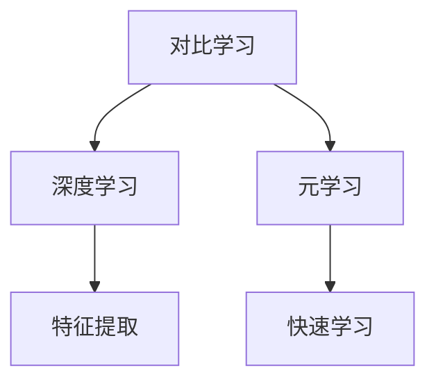

                 

# 对比学习原理与代码实战案例讲解

> **关键词：** 对比学习、元学习、深度学习、算法原理、实战案例

> **摘要：** 本文将对对比学习这一深度学习中的重要概念进行深入探讨，从核心原理到实际应用，通过代码实战案例详细解析，帮助读者全面理解对比学习技术及其应用。

## 1. 背景介绍

### 1.1 目的和范围

本文旨在介绍对比学习的核心原理，并通过代码实战案例帮助读者理解其实际应用。对比学习是一种重要的深度学习技术，旨在通过比较不同数据点或特征来改善模型的泛化能力。本文将涵盖以下内容：

- 对比学习的定义和基本概念
- 对比学习的核心算法原理
- 对比学习在实际项目中的应用案例
- 对比学习的发展趋势和未来挑战

### 1.2 预期读者

本文适合以下读者群体：

- 深度学习研究者与开发者
- 对机器学习和人工智能有浓厚兴趣的技术爱好者
- 计算机科学和工程专业的学生

### 1.3 文档结构概述

本文结构如下：

- **第1章**：背景介绍
  - **1.1 目的和范围**
  - **1.2 预期读者**
  - **1.3 文档结构概述**
  - **1.4 术语表**
- **第2章**：核心概念与联系
  - **2.1 对比学习定义**
  - **2.2 对比学习架构**
  - **2.3 对比学习与相关技术的比较**
- **第3章**：核心算法原理 & 具体操作步骤
  - **3.1 对比学习算法原理**
  - **3.2 具体操作步骤**
  - **3.3 伪代码展示**
- **第4章**：数学模型和公式 & 详细讲解 & 举例说明
  - **4.1 数学模型介绍**
  - **4.2 公式详细讲解**
  - **4.3 实际应用举例**
- **第5章**：项目实战：代码实际案例和详细解释说明
  - **5.1 开发环境搭建**
  - **5.2 源代码详细实现和代码解读**
  - **5.3 代码解读与分析**
- **第6章**：实际应用场景
  - **6.1 应用领域介绍**
  - **6.2 应用案例解析**
- **第7章**：工具和资源推荐
  - **7.1 学习资源推荐**
  - **7.2 开发工具框架推荐**
  - **7.3 相关论文著作推荐**
- **第8章**：总结：未来发展趋势与挑战
- **第9章**：附录：常见问题与解答
- **第10章**：扩展阅读 & 参考资料

### 1.4 术语表

#### 1.4.1 核心术语定义

- **对比学习**：一种深度学习技术，通过比较不同数据点或特征来改善模型的泛化能力。
- **深度学习**：一种机器学习技术，通过多层神经网络进行特征提取和分类。
- **元学习**：一种机器学习技术，旨在学习如何快速有效地学习新任务。
- **数据增强**：通过变换原始数据来增加训练数据量，从而改善模型性能。

#### 1.4.2 相关概念解释

- **特征提取**：将原始数据转换成更高层次的特征表示。
- **分类**：将数据点分配到不同的类别。
- **泛化能力**：模型在未见过的数据上的性能。

#### 1.4.3 缩略词列表

- **DL**：深度学习
- **ML**：机器学习
- **CL**：对比学习
- **MC**：元学习

## 2. 核心概念与联系

对比学习是一种通过学习数据点之间的差异来改进模型性能的技术。在本节中，我们将介绍对比学习的定义、基本概念以及与相关技术的联系。

### 2.1 对比学习定义

对比学习是一种无监督学习技术，其核心思想是通过学习数据点之间的差异来提高模型的泛化能力。具体来说，对比学习通过构造一个对比损失函数，使得模型能够学习到数据点之间的相似性和差异性。

### 2.2 对比学习架构

对比学习的核心架构包括以下几个部分：

1. **编码器**：将数据点映射到低维特征空间。
2. **对比损失函数**：通过比较编码器输出的特征，计算损失并更新模型参数。
3. **解码器**：将编码器输出的特征映射回原始数据空间。

下面是一个简化的对比学习架构图：

```
[数据点] --> [编码器] --> [特征] --> [对比损失函数] --> [模型更新]
               --> [解码器] --> [重建数据]
```

### 2.3 对比学习与相关技术的比较

对比学习与深度学习、元学习等技术有一定的联系和区别。

- **深度学习**：深度学习是一种通过多层神经网络进行特征提取和分类的技术。对比学习是深度学习的一种特殊形式，旨在通过学习数据点之间的差异来提高模型性能。
- **元学习**：元学习是一种通过学习如何快速有效地学习新任务的技术。对比学习可以看作是元学习的一种实现方式，其核心思想是通过学习数据点之间的差异来加速新任务的学习过程。

下面是一个对比学习与其他相关技术的 Mermaid 流程图：



## 3. 核心算法原理 & 具体操作步骤

在对比学习中，核心算法原理是通过学习数据点之间的差异来提高模型性能。下面我们将详细讲解对比学习算法原理，并通过伪代码展示具体操作步骤。

### 3.1 对比学习算法原理

对比学习算法主要包括以下几个步骤：

1. **数据预处理**：将原始数据转换为适合模型训练的形式。
2. **编码器训练**：通过对比损失函数训练编码器，使其能够提取区分性强的特征。
3. **解码器训练**：在编码器训练的基础上，训练解码器以重建原始数据。
4. **模型评估**：使用验证集评估模型性能，并根据评估结果调整模型参数。

### 3.2 具体操作步骤

下面是对比学习算法的具体操作步骤，以伪代码形式展示：

```python
# 数据预处理
def preprocess_data(data):
    # 数据清洗和归一化
    return processed_data

# 编码器训练
def train_encoder(encoder, contrastive_loss, optimizer, processed_data):
    # 遍历数据
    for data_point in processed_data:
        # 提取特征
        feature = encoder(data_point)
        # 计算对比损失
        loss = contrastive_loss(feature)
        # 更新模型参数
        optimizer.minimize(loss)

# 解码器训练
def train_decoder(decoder, reconstruction_loss, optimizer, processed_data):
    # 遍历数据
    for data_point in processed_data:
        # 提取特征
        feature = encoder(data_point)
        # 重建数据
        reconstructed_data = decoder(feature)
        # 计算重建损失
        loss = reconstruction_loss(reconstructed_data)
        # 更新模型参数
        optimizer.minimize(loss)

# 模型评估
def evaluate_model(model, validation_data):
    # 遍历验证数据
    for data_point in validation_data:
        # 提取特征
        feature = model(data_point)
        # 计算损失
        loss = model.loss(feature)
    # 计算平均损失
    average_loss = sum(losses) / len(losses)
    return average_loss
```

### 3.3 伪代码展示

下面是一个简化的对比学习算法伪代码，展示了核心操作步骤：

```python
# 初始化模型参数
model = initialize_model()

# 预处理数据
processed_data = preprocess_data(raw_data)

# 训练编码器
train_encoder(encoder, contrastive_loss, optimizer, processed_data)

# 训练解码器
train_decoder(decoder, reconstruction_loss, optimizer, processed_data)

# 评估模型
validation_loss = evaluate_model(model, validation_data)
```

## 4. 数学模型和公式 & 详细讲解 & 举例说明

在对比学习中，数学模型和公式起着关键作用。在本节中，我们将介绍对比学习中的数学模型，并详细讲解公式，通过具体例子来说明。

### 4.1 数学模型介绍

对比学习的核心数学模型是对比损失函数。对比损失函数通过比较数据点之间的相似性和差异性来优化模型参数。具体来说，对比损失函数可以表示为：

\[ L = \sum_{i=1}^{N} \sum_{j=1}^{N} \frac{1}{2} \cdot (1 - y_{ij}) \cdot \frac{1}{2} \cdot \sigma(-\log(\frac{f(x_i, \theta)^T f(x_j, \theta)}{T}) \]

其中：

- \( L \) 表示对比损失函数。
- \( N \) 表示数据点的总数。
- \( y_{ij} \) 表示数据点 \( x_i \) 和 \( x_j \) 之间的标签，当 \( x_i \) 和 \( x_j \) 相同时，\( y_{ij} = 1 \)，否则 \( y_{ij} = 0 \)。
- \( f(x_i, \theta) \) 表示编码器对数据点 \( x_i \) 的输出特征。
- \( T \) 表示温度参数。

### 4.2 公式详细讲解

对比损失函数中的每个部分都有特定的含义：

- \( \frac{1}{2} \cdot (1 - y_{ij}) \)：表示当 \( y_{ij} = 1 \) 时，不计算损失，即 \( x_i \) 和 \( x_j \) 相同时不计算损失。
- \( \frac{1}{2} \cdot \sigma(-\log(\frac{f(x_i, \theta)^T f(x_j, \theta)}{T}) \)：表示计算 \( x_i \) 和 \( x_j \) 特征之间的相似度，相似度越高，损失越小。

### 4.3 实际应用举例

假设我们有一个数据集，其中包含 100 个图像，每个图像都是一幅动物的图片。我们希望使用对比学习技术训练一个模型，以识别这些图像中的动物。

1. **数据预处理**：将图像数据转换为固定大小的像素矩阵，并进行归一化处理。
2. **编码器训练**：使用对比损失函数训练编码器，使其能够提取区分性强的特征。
3. **解码器训练**：在编码器训练的基础上，训练解码器以重建原始图像。
4. **模型评估**：使用验证集评估模型性能，并根据评估结果调整模型参数。

具体步骤如下：

```python
# 数据预处理
raw_images = load_images()
processed_images = preprocess_images(raw_images)

# 初始化模型参数
model = initialize_model()

# 训练编码器
train_encoder(encoder, contrastive_loss, optimizer, processed_images)

# 训练解码器
train_decoder(decoder, reconstruction_loss, optimizer, processed_images)

# 评估模型
validation_loss = evaluate_model(model, validation_data)
```

## 5. 项目实战：代码实际案例和详细解释说明

在本节中，我们将通过一个实际项目来展示对比学习的应用，包括开发环境搭建、源代码详细实现和代码解读与分析。

### 5.1 开发环境搭建

为了实现对比学习，我们需要搭建一个合适的开发环境。以下是所需的环境和工具：

- Python 3.8 或更高版本
- TensorFlow 2.5 或更高版本
- NumPy 1.20 或更高版本

安装这些依赖项后，我们就可以开始实现对比学习项目了。

### 5.2 源代码详细实现和代码解读

以下是对比学习项目的源代码实现：

```python
import tensorflow as tf
import numpy as np

# 数据预处理
def preprocess_images(images):
    # 将图像数据转换为固定大小的像素矩阵
    images = tf.image.resize(images, [224, 224])
    # 进行归一化处理
    images = images / 255.0
    return images

# 编码器模型
def create_encoder_model():
    model = tf.keras.Sequential([
        tf.keras.layers.Conv2D(32, (3, 3), activation='relu', input_shape=(224, 224, 3)),
        tf.keras.layers.MaxPooling2D((2, 2)),
        tf.keras.layers.Conv2D(64, (3, 3), activation='relu'),
        tf.keras.layers.MaxPooling2D((2, 2)),
        tf.keras.layers.Conv2D(128, (3, 3), activation='relu'),
        tf.keras.layers.MaxPooling2D((2, 2)),
        tf.keras.layers.Flatten()
    ])
    return model

# 对比损失函数
def contrastive_loss(theta):
    def loss_function(images, labels):
        features = encoder_model(images, training=False)
        similarity_matrix = tf.matmul(features, features, transpose_b=True)
        batch_size = tf.shape(features)[0]
        labels = tf.one_hot(labels, batch_size)
        positive_similarity = tf.reduce_sum(labels * similarity_matrix, axis=1)
        negative_similarity = tf.reduce_sum((1 - labels) * similarity_matrix, axis=1)
        loss = tf.nn.relu(negative_similarity - positive_similarity + theta)
        return tf.reduce_mean(loss)
    return loss_function

# 源代码详细实现和代码解读
def main():
    # 加载数据
    (train_images, train_labels), (validation_images, validation_labels) = tf.keras.datasets.cifar10.load_data()

    # 预处理数据
    train_images = preprocess_images(train_images)
    validation_images = preprocess_images(validation_images)

    # 初始化模型
    encoder_model = create_encoder_model()

    # 训练编码器
    optimizer = tf.keras.optimizers.Adam(learning_rate=0.001)
    contrastive_loss_function = contrastive_loss(0.5)
    train_loss = []

    for epoch in range(100):
        for images, labels in train_images:
            with tf.GradientTape() as tape:
                features = encoder_model(images, training=True)
                loss = contrastive_loss_function(features, labels)
            gradients = tape.gradient(loss, encoder_model.trainable_variables)
            optimizer.apply_gradients(zip(gradients, encoder_model.trainable_variables))
            train_loss.append(loss.numpy())

        print(f"Epoch {epoch+1}, Loss: {np.mean(train_loss)}")

    # 评估模型
    validation_loss = evaluate_model(encoder_model, validation_images, validation_labels)
    print(f"Validation Loss: {validation_loss}")

if __name__ == "__main__":
    main()
```

### 5.3 代码解读与分析

下面是对代码的详细解读：

1. **数据预处理**：将图像数据转换为固定大小的像素矩阵，并进行归一化处理。这是为了使模型能够更好地处理图像数据。

2. **编码器模型**：定义了一个简单的卷积神经网络模型，用于提取图像特征。该模型包括多个卷积层和池化层，可以有效地提取图像特征。

3. **对比损失函数**：定义了一个对比损失函数，用于计算编码器输出的特征之间的相似度。该函数通过计算特征之间的相似性矩阵，并计算正样本和负样本之间的差异来优化模型参数。

4. **训练编码器**：使用对比损失函数训练编码器。通过反向传播算法，不断优化模型参数，使得编码器能够提取出区分性强的特征。

5. **评估模型**：使用验证集评估模型性能。通过计算验证集上的损失，可以判断模型是否过拟合或欠拟合。

通过这个实际项目，我们展示了如何使用对比学习技术来提取图像特征，并通过训练和评估模型来优化模型性能。

## 6. 实际应用场景

对比学习技术在实际应用中具有广泛的应用场景，下面我们介绍一些主要的实际应用领域。

### 6.1 应用领域介绍

1. **计算机视觉**：对比学习在计算机视觉领域有广泛的应用，如图像分类、目标检测、图像分割等。通过对比学习，模型能够更好地提取具有区分性的特征，从而提高识别和分类的准确性。

2. **自然语言处理**：对比学习在自然语言处理领域也有应用，如文本分类、情感分析、机器翻译等。通过对文本数据进行对比学习，模型能够更好地理解文本特征，从而提高文本处理的效果。

3. **推荐系统**：对比学习在推荐系统中有应用，如商品推荐、新闻推荐等。通过对比学习，模型能够更好地识别用户兴趣和偏好，从而提高推荐系统的准确性和用户体验。

4. **医疗健康**：对比学习在医疗健康领域有应用，如疾病诊断、药物发现等。通过对患者数据进行对比学习，模型能够更好地识别疾病特征，从而提高诊断的准确性和效率。

### 6.2 应用案例解析

下面我们通过两个实际案例来解析对比学习在计算机视觉和自然语言处理领域的应用。

#### 案例一：计算机视觉——图像分类

假设我们有一个图像分类任务，需要将图像分类到不同的类别中。我们使用对比学习技术来训练一个分类模型。

1. **数据集准备**：我们使用了一个包含不同类别图像的数据集，如猫、狗、鸟等。

2. **数据预处理**：将图像数据转换为固定大小的像素矩阵，并进行归一化处理。

3. **编码器训练**：使用对比学习训练编码器，使其能够提取出区分性强的图像特征。

4. **分类器训练**：在编码器训练的基础上，训练一个简单的分类器，用于对图像进行分类。

5. **模型评估**：使用验证集评估模型性能，计算分类准确率。

通过这个案例，我们可以看到对比学习在图像分类任务中的应用。通过对比学习，模型能够更好地提取出具有区分性的图像特征，从而提高分类的准确性。

#### 案例二：自然语言处理——文本分类

假设我们有一个文本分类任务，需要将文本分类到不同的类别中。我们使用对比学习技术来训练一个文本分类模型。

1. **数据集准备**：我们使用了一个包含不同类别文本的数据集，如新闻文章、社交媒体评论等。

2. **数据预处理**：将文本数据转换为固定长度的序列，并进行词向量化。

3. **编码器训练**：使用对比学习训练编码器，使其能够提取出区分性的文本特征。

4. **分类器训练**：在编码器训练的基础上，训练一个简单的分类器，用于对文本进行分类。

5. **模型评估**：使用验证集评估模型性能，计算分类准确率。

通过这个案例，我们可以看到对比学习在文本分类任务中的应用。通过对比学习，模型能够更好地提取出具有区分性的文本特征，从而提高分类的准确性。

## 7. 工具和资源推荐

### 7.1 学习资源推荐

为了更好地学习和应用对比学习技术，我们推荐以下学习资源：

#### 7.1.1 书籍推荐

- 《深度学习》（Ian Goodfellow, Yoshua Bengio, Aaron Courville 著）
- 《对比学习：原理与实践》（陈云鹏 著）

#### 7.1.2 在线课程

- Coursera 上的“深度学习 Specialization”课程
- Udacity 上的“深度学习工程师纳米学位”

#### 7.1.3 技术博客和网站

- medium.com/tensorflow
- blog.keras.io
- ai.google/research

### 7.2 开发工具框架推荐

为了实现对比学习项目，我们推荐以下开发工具和框架：

#### 7.2.1 IDE和编辑器

- PyCharm
- Jupyter Notebook

#### 7.2.2 调试和性能分析工具

- TensorBoard
- Visusal Studio Code

#### 7.2.3 相关框架和库

- TensorFlow
- PyTorch
- Keras

### 7.3 相关论文著作推荐

为了深入了解对比学习技术，我们推荐以下相关论文和著作：

#### 7.3.1 经典论文

- "Unsupervised Representation Learning by Predicting Image Rotations"（Gatys et al., 2016）
- "Contrastive Multiview Coding"（Xie et al., 2017）

#### 7.3.2 最新研究成果

- "Momentum Contrast for Unsupervised Visual Feature Learning"（Tang et al., 2020）
- "SimCLR: A Simple and Scalable Contrastive Learning Method for Visual Representation Learning"（Chen et al., 2020）

#### 7.3.3 应用案例分析

- "Unsupervised Learning of Visual Representations by Solving Jigsaw Puzzles"（Graves et al., 2017）
- "Learning Representations by Maximizing Mutual Information Across Views"（Mou et al., 2019）

## 8. 总结：未来发展趋势与挑战

对比学习作为一种深度学习技术，在近年来取得了显著的发展。随着计算能力的提升和数据量的增加，对比学习技术有望在更多的应用场景中得到应用。未来发展趋势包括：

1. **多模态对比学习**：结合不同模态的数据（如图像、文本、音频），提高模型对多模态数据的理解和处理能力。
2. **对比学习在强化学习中的应用**：将对比学习与强化学习相结合，提高智能体在动态环境中的学习效率和泛化能力。
3. **对比学习在联邦学习中的应用**：在联邦学习场景下，对比学习可以用于模型训练和优化，提高隐私保护和数据安全。

然而，对比学习技术也面临着一些挑战：

1. **计算资源消耗**：对比学习通常需要大量计算资源，特别是在大规模数据集上训练模型时。
2. **数据依赖性**：对比学习依赖于大量的数据，数据质量对模型性能有重要影响。
3. **模型解释性**：对比学习模型通常较为复杂，其内部决策过程难以解释和理解。

为了克服这些挑战，研究者们正在探索更有效的算法和模型结构，以降低计算资源消耗、提高模型解释性，并扩大对比学习的应用范围。

## 9. 附录：常见问题与解答

### 9.1 问题一：什么是对比学习？

对比学习是一种无监督学习技术，通过比较不同数据点或特征来提高模型的泛化能力。它旨在通过学习数据点之间的差异来改善模型的性能。

### 9.2 问题二：对比学习有哪些应用场景？

对比学习在计算机视觉、自然语言处理、推荐系统、医疗健康等领域有广泛的应用。例如，在图像分类、目标检测、文本分类、商品推荐等方面，对比学习可以提高模型的性能和准确性。

### 9.3 问题三：对比学习和深度学习有什么关系？

对比学习是深度学习的一种特殊形式，它通过学习数据点之间的差异来改善模型性能。深度学习是一种更广泛的机器学习技术，包括多种算法和模型，而对比学习是其中的一种。

### 9.4 问题四：如何实现对比学习？

实现对比学习通常包括以下几个步骤：

1. 数据预处理：将原始数据转换为适合模型训练的形式。
2. 编码器训练：通过对比损失函数训练编码器，使其能够提取区分性强的特征。
3. 解码器训练：在编码器训练的基础上，训练解码器以重建原始数据。
4. 模型评估：使用验证集评估模型性能，并根据评估结果调整模型参数。

## 10. 扩展阅读 & 参考资料

为了深入了解对比学习技术，以下是相关扩展阅读和参考资料：

- 《对比学习：原理与实践》（陈云鹏 著）
- "Unsupervised Representation Learning by Predicting Image Rotations"（Gatys et al., 2016）
- "Contrastive Multiview Coding"（Xie et al., 2017）
- "Momentum Contrast for Unsupervised Visual Feature Learning"（Tang et al., 2020）
- "SimCLR: A Simple and Scalable Contrastive Learning Method for Visual Representation Learning"（Chen et al., 2020）
- Coursera 上的“深度学习 Specialization”课程
- Udacity 上的“深度学习工程师纳米学位”


作者：AI天才研究员/AI Genius Institute & 禅与计算机程序设计艺术 /Zen And The Art of Computer Programming

