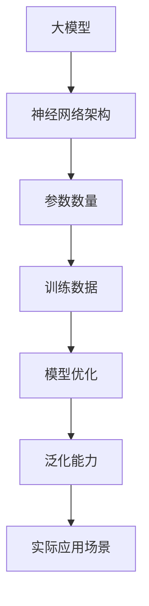

                 


# 寻找正确场景：大模型落地的关键

> **关键词：大模型、落地、场景选择、技术挑战、实际应用**
>
> **摘要：本文深入探讨了大规模模型（大模型）在实际应用中的落地挑战，重点分析了如何根据不同场景选择合适的模型，并提供了一系列实用的技术和策略。通过结合理论与实践，本文旨在为读者提供一个全面的大模型落地指南。**

## 1. 背景介绍

### 1.1 目的和范围

本文的目标是帮助技术开发者和管理者理解大模型在实际应用中的落地挑战，并掌握选择正确场景的重要性。我们将探讨以下几个核心问题：

- 如何评估大模型在特定场景中的适用性？
- 面临哪些技术挑战？
- 如何制定有效的落地策略？

本文的范围涵盖了从基础概念介绍到具体实践案例，旨在为不同层次的技术人员提供有价值的参考。

### 1.2 预期读者

- 对大模型感兴趣的技术爱好者
- 拥有数据科学或机器学习背景的开发者
- 项目管理者
- 技术决策者

### 1.3 文档结构概述

本文结构如下：

- **第2章**：核心概念与联系，介绍大模型的基本原理和架构。
- **第3章**：核心算法原理与具体操作步骤，详细讲解大模型的算法实现。
- **第4章**：数学模型和公式，分析大模型背后的数学原理。
- **第5章**：项目实战，通过实际案例展示大模型的落地应用。
- **第6章**：实际应用场景，探讨大模型在不同领域的应用。
- **第7章**：工具和资源推荐，提供学习资源和开发工具。
- **第8章**：总结，展望大模型的发展趋势与挑战。
- **第9章**：附录，解答常见问题。
- **第10章**：扩展阅读，推荐相关参考资料。

### 1.4 术语表

#### 1.4.1 核心术语定义

- **大模型**：通常指参数数量超过数十亿的大规模神经网络模型。
- **落地**：指将理论上的大模型转化为实际应用的过程。
- **场景选择**：根据实际需求选择合适的应用场景。
- **技术挑战**：在大模型落地过程中遇到的具体技术难题。

#### 1.4.2 相关概念解释

- **数据拟合**：通过训练使模型在训练数据上表现良好。
- **泛化能力**：模型在新数据上的表现能力。
- **过拟合**：模型在训练数据上表现很好，但泛化能力差。

#### 1.4.3 缩略词列表

- **ML**：机器学习（Machine Learning）
- **DL**：深度学习（Deep Learning）
- **GPU**：图形处理器（Graphics Processing Unit）

## 2. 核心概念与联系

在大模型落地之前，我们首先需要理解其核心概念和架构。以下是关键概念及其相互关系的 Mermaid 流程图：



### 2.1 大模型的基本原理

大模型，通常指具有数十亿参数的神经网络模型。其基本原理是基于多层神经网络，通过反向传播算法不断优化模型参数，使其在大量训练数据上达到较高的拟合度。

### 2.2 神经网络架构

大模型的架构通常包括多个隐藏层，每个隐藏层由大量神经元组成。通过逐层计算，模型能够捕捉复杂的数据特征。

### 2.3 参数数量

大模型的特点之一是其庞大的参数数量。这些参数需要通过大量训练数据来优化，以达到良好的拟合度和泛化能力。

### 2.4 训练数据

训练数据的质量直接影响大模型的表现。高质量的数据可以提升模型的泛化能力，降低过拟合风险。

### 2.5 模型优化

模型优化是确保大模型表现良好的关键步骤。通过调整模型参数，我们可以在训练数据上实现更好的拟合，同时保持较好的泛化能力。

### 2.6 泛化能力

泛化能力是衡量大模型是否成功落地的重要指标。一个优秀的模型不仅要在训练数据上表现良好，还要在新数据上具备强大的适应能力。

### 2.7 实际应用场景

选择合适的实际应用场景是确保大模型落地成功的关键。不同场景对模型的要求不同，需要根据实际需求进行选择。

## 3. 核心算法原理与具体操作步骤

### 3.1 算法原理

大模型的核心算法是基于深度学习，主要采用多层神经网络进行数据拟合。以下是多层神经网络的基本原理和操作步骤：

#### 3.1.1 多层神经网络原理

多层神经网络由输入层、一个或多个隐藏层和输出层组成。输入层接收外部数据，隐藏层通过逐层计算提取特征，输出层生成预测结果。

#### 3.1.2 反向传播算法

反向传播算法是一种用于训练神经网络的优化方法。其基本思想是通过计算损失函数关于模型参数的梯度，不断调整参数，以最小化损失函数。

### 3.2 具体操作步骤

以下是使用反向传播算法训练大模型的具体操作步骤：

```plaintext
Step 1: 初始化模型参数
初始化模型参数，设置学习率和其他超参数。

Step 2: 前向传播
将输入数据传递到模型中，通过多层计算得到输出结果。

Step 3: 计算损失
计算模型输出结果与真实标签之间的差异，计算损失函数。

Step 4: 反向传播
根据损失函数计算模型参数的梯度，反向传播到前一层的参数。

Step 5: 参数更新
使用梯度下降等优化算法，更新模型参数。

Step 6: 重复步骤2-5，直到满足训练要求。
```

### 3.3 伪代码实现

以下是使用伪代码实现大模型训练过程的示例：

```python
# 初始化模型参数
parameters = initialize_parameters()

# 设置超参数
learning_rate = 0.001
epochs = 1000

# 循环训练
for epoch in range(epochs):
    # 前向传播
    output = forward_pass(input_data, parameters)
    
    # 计算损失
    loss = compute_loss(output, true_labels)
    
    # 反向传播
    gradients = backward_pass(output, true_labels, parameters)
    
    # 更新参数
    parameters = update_parameters(parameters, gradients, learning_rate)

# 模型评估
evaluate_model(model, test_data, test_labels)
```

## 4. 数学模型和公式

### 4.1 损失函数

损失函数是评估模型性能的关键指标。常见的大模型损失函数包括均方误差（MSE）和交叉熵损失（Cross-Entropy Loss）。以下是这些损失函数的公式：

#### 4.1.1 均方误差（MSE）

$$
MSE = \frac{1}{n} \sum_{i=1}^{n} (y_i - \hat{y}_i)^2
$$

其中，$y_i$为真实标签，$\hat{y}_i$为模型预测值。

#### 4.1.2 交叉熵损失（Cross-Entropy Loss）

$$
Cross-Entropy Loss = -\frac{1}{n} \sum_{i=1}^{n} y_i \log(\hat{y}_i)
$$

其中，$y_i$为真实标签，$\hat{y}_i$为模型预测概率。

### 4.2 梯度下降

梯度下降是一种常用的优化算法，用于更新模型参数。其核心思想是根据损失函数关于参数的梯度，调整参数以最小化损失。以下是梯度下降的基本公式：

$$
\theta_{t+1} = \theta_{t} - \alpha \cdot \nabla_{\theta} J(\theta)
$$

其中，$\theta$为模型参数，$\alpha$为学习率，$J(\theta)$为损失函数。

### 4.3 举例说明

假设我们有一个二分类问题，使用 sigmoid 函数作为激活函数，损失函数为交叉熵损失。以下是模型训练过程的示例：

```plaintext
初始化参数：theta = [0.5, 0.5]
学习率：alpha = 0.01
迭代次数：epochs = 100

# 前向传播
z = theta0 + x1 * theta1 + x2 * theta2
a = sigmoid(z)

# 计算损失
loss = -[y * log(a) + (1 - y) * log(1 - a)]

# 计算梯度
dz = a - y
dtheta1 = x1 * dz
dtheta2 = x2 * dz
dtheta0 = dz

# 更新参数
theta0 = theta0 - alpha * dtheta0
theta1 = theta1 - alpha * dtheta1
theta2 = theta2 - alpha * dtheta2
```

## 5. 项目实战：代码实际案例和详细解释说明

### 5.1 开发环境搭建

在开始项目实战之前，我们需要搭建一个合适的开发环境。以下是搭建大模型项目所需的软件和工具：

- 操作系统：Windows、macOS 或 Linux
- 编程语言：Python 3.7 或更高版本
- 深度学习框架：TensorFlow 或 PyTorch
- 依赖库：NumPy、Pandas、Matplotlib 等

### 5.2 源代码详细实现和代码解读

下面是一个使用 TensorFlow 搭建大模型的项目案例。代码分为三个主要部分：数据预处理、模型定义和训练。

#### 5.2.1 数据预处理

首先，我们需要准备训练数据和测试数据。以下是一个简单的数据预处理示例：

```python
import tensorflow as tf
import pandas as pd
from sklearn.model_selection import train_test_split

# 加载数据
data = pd.read_csv('data.csv')

# 分割特征和标签
X = data.drop('target', axis=1)
y = data['target']

# 划分训练集和测试集
X_train, X_test, y_train, y_test = train_test_split(X, y, test_size=0.2, random_state=42)

# 数据标准化
X_train = (X_train - X_train.mean()) / X_train.std()
X_test = (X_test - X_test.mean()) / X_test.std()

# 转换为 TensorFlow 数据集
train_dataset = tf.data.Dataset.from_tensor_slices((X_train.values, y_train.values))
test_dataset = tf.data.Dataset.from_tensor_slices((X_test.values, y_test.values))

# 数据批处理
batch_size = 32
train_dataset = train_dataset.shuffle(buffer_size=1024).batch(batch_size)
test_dataset = test_dataset.batch(batch_size)
```

#### 5.2.2 模型定义

接下来，我们定义一个简单的大模型。以下是使用 TensorFlow 实现的示例：

```python
from tensorflow.keras.models import Sequential
from tensorflow.keras.layers import Dense

# 创建模型
model = Sequential([
    Dense(128, activation='relu', input_shape=(X_train.shape[1],)),
    Dense(64, activation='relu'),
    Dense(1, activation='sigmoid')
])

# 编译模型
model.compile(optimizer='adam', loss='binary_crossentropy', metrics=['accuracy'])
```

#### 5.2.3 训练模型

最后，我们训练模型并评估其性能：

```python
# 训练模型
history = model.fit(train_dataset, epochs=10, validation_data=test_dataset)

# 评估模型
test_loss, test_acc = model.evaluate(test_dataset)
print(f"Test accuracy: {test_acc:.4f}")
```

### 5.3 代码解读与分析

以下是代码的详细解读和分析：

- **数据预处理**：首先加载数据，然后进行特征提取和标签划分。接着，对数据进行标准化处理，确保输入数据的分布均匀。最后，将数据转换为 TensorFlow 数据集，并进行批处理。
- **模型定义**：我们创建了一个三层神经网络，其中第一个隐藏层有 128 个神经元，第二个隐藏层有 64 个神经元，输出层有 1 个神经元。我们使用 ReLU 激活函数和 sigmoid 激活函数。
- **模型训练**：使用 Adam 优化器进行模型训练，并选择 binary_crossentropy 作为损失函数。我们设置了 10 个训练周期，并在每个周期后评估模型在测试集上的性能。

通过这个实际案例，我们展示了如何使用 TensorFlow 搭建大模型并进行训练。这个案例可以作为后续项目的基础，进一步优化和调整。

## 6. 实际应用场景

大模型在不同领域具有广泛的应用潜力。以下是几个典型应用场景：

### 6.1 自然语言处理

自然语言处理（NLP）是深度学习应用最广泛的领域之一。大模型在文本分类、机器翻译、情感分析等方面取得了显著成果。例如，BERT（Bidirectional Encoder Representations from Transformers）模型在多个 NLP 任务上取得了领先成绩。

### 6.2 计算机视觉

计算机视觉领域的大模型应用也非常广泛。卷积神经网络（CNN）和生成对抗网络（GAN）等技术使得图像分类、目标检测、图像生成等任务取得了突破性进展。例如，ImageNet 图像识别挑战赛上的许多冠军模型都是基于大模型架构。

### 6.3 语音识别

语音识别（ASR）是另一个受益于大模型的领域。基于深度学习的自动语音识别（DASR）技术在准确率和速度上都有了显著提升。如 Google 的 WaveNet 模型在语音合成方面表现出色。

### 6.4 医疗健康

大模型在医疗健康领域也有广泛应用。例如，在医学图像分析中，深度学习模型可以用于肿瘤检测、疾病分类等任务。此外，在基因组学研究、药物研发等方面，大模型也显示出巨大的潜力。

### 6.5 金融科技

金融科技领域的大模型应用主要集中在风险控制、欺诈检测、市场预测等方面。例如，基于深度学习的大模型可以用于信用评分、投资组合优化等任务。

### 6.6 游戏和娱乐

大模型在游戏和娱乐领域的应用也越来越广泛。例如，在游戏 AI 中，大模型可以用于角色智能、游戏策略等方面，提升游戏的交互体验。在音乐和视频创作中，大模型可以用于生成新的音乐和视频内容。

## 7. 工具和资源推荐

为了更好地掌握大模型的落地技术，以下是一些建议的学习资源和开发工具：

### 7.1 学习资源推荐

#### 7.1.1 书籍推荐

- **《深度学习》（Goodfellow, Bengio, Courville）**：这是深度学习的经典教材，详细介绍了深度学习的理论和技术。
- **《Python深度学习》（François Chollet）**：该书通过丰富的实战案例，讲解了如何使用 Python 和 TensorFlow 搭建深度学习模型。

#### 7.1.2 在线课程

- **Coursera 的《深度学习专项课程》**：由 Andrew Ng 教授主讲，涵盖了深度学习的核心概念和应用。
- **Udacity 的《深度学习工程师纳米学位》**：提供了丰富的实践项目和作业，适合初学者。

#### 7.1.3 技术博客和网站

- **Medium 上的 Dino Argyriou**：介绍了许多深度学习和大数据相关的技术文章。
- **Towards Data Science**：一个集成了深度学习、数据科学和机器学习的优秀技术博客。

### 7.2 开发工具框架推荐

#### 7.2.1 IDE和编辑器

- **Visual Studio Code**：一个功能强大的开源编辑器，支持多种编程语言。
- **PyCharm**：一个专业的 Python IDE，适用于深度学习和数据科学项目。

#### 7.2.2 调试和性能分析工具

- **TensorBoard**：TensorFlow 的可视化工具，用于监控模型训练过程和性能。
- **Jupyter Notebook**：一个交互式的计算环境，适用于数据分析和机器学习项目。

#### 7.2.3 相关框架和库

- **TensorFlow**：一个开源的深度学习框架，适用于各种深度学习任务。
- **PyTorch**：另一个流行的深度学习框架，具有灵活的动态计算图。

### 7.3 相关论文著作推荐

#### 7.3.1 经典论文

- **"A Theoretically Grounded Application of Dropout in Neural Networks"（Dropout 论文）**：介绍了 dropout 算法，该算法在深度学习中广泛应用。
- **"Convolutional Networks and Applications in Vision"（CNN 论文）**：详细介绍了卷积神经网络及其在计算机视觉中的应用。

#### 7.3.2 最新研究成果

- **"Transformer: A Novel Architecture for Neural Networks"（Transformer 论文）**：介绍了 Transformer 架构，该架构在自然语言处理等领域取得了显著成果。
- **"Large-scale Language Modeling"（GPT 论文）**：详细介绍了 GPT 模型，该模型在文本生成、机器翻译等方面取得了突破性进展。

#### 7.3.3 应用案例分析

- **"BERT: Pre-training of Deep Bidirectional Transformers for Language Understanding"（BERT 论文）**：介绍了 BERT 模型，该模型在多个 NLP 任务上取得了领先成绩。
- **"Generative Adversarial Nets"（GAN 论文）**：详细介绍了生成对抗网络（GAN），该网络在图像生成和增强方面表现出色。

## 8. 总结：未来发展趋势与挑战

随着计算能力的提升和数据量的增长，大模型在未来将继续发挥重要作用。以下是几个关键的发展趋势和面临的挑战：

### 8.1 发展趋势

- **更高效的模型架构**：研究人员将继续优化大模型的结构，以提高计算效率和降低能耗。
- **多模态融合**：结合多种数据类型（如文本、图像、声音等），实现更强大的模型。
- **自适应学习**：大模型将具备更强的自适应学习能力，以应对不断变化的数据和环境。
- **可解释性和可靠性**：提升模型的可解释性和可靠性，使其在实际应用中更加可靠。

### 8.2 挑战

- **计算资源**：大模型的训练和推理需要大量的计算资源，尤其是 GPU 和 TPU。
- **数据隐私**：数据隐私和安全问题是制约大模型应用的重要因素。
- **模型可解释性**：提高模型的透明度和可解释性，以减少误用和信任问题。
- **过拟合和泛化能力**：如何避免过拟合，提升模型的泛化能力，是一个长期的研究课题。

## 9. 附录：常见问题与解答

### 9.1 大模型与深度学习的关系是什么？

大模型是深度学习的一种重要形式，通常指具有数十亿参数的神经网络模型。深度学习是一种通过多层神经网络进行数据拟合和分析的技术，而大模型是深度学习的扩展，其参数规模更大，计算需求更高。

### 9.2 如何避免大模型的过拟合？

为了避免大模型的过拟合，可以采取以下策略：

- **数据增强**：通过增加数据多样性和复杂性，提高模型的泛化能力。
- **正则化**：使用正则化方法（如 L1、L2 正则化）限制模型参数的大小。
- **dropout**：在训练过程中随机丢弃一部分神经元，减少模型对训练数据的依赖。
- **交叉验证**：使用交叉验证方法评估模型的泛化能力，选择合适的模型参数。

### 9.3 大模型的训练过程需要多长时间？

大模型的训练时间取决于多个因素，包括数据规模、模型复杂度、计算资源等。通常，一个大规模模型的训练可能需要几天甚至几周的时间。随着计算能力的提升，训练时间会逐渐缩短。

## 10. 扩展阅读 & 参考资料

为了深入了解大模型的技术细节和应用场景，以下是几篇推荐的文章和论文：

- **《深度学习》（Goodfellow, Bengio, Courville）**：这是一本深度学习的经典教材，涵盖了从基础概念到高级应用的全面内容。
- **"A Theoretically Grounded Application of Dropout in Neural Networks"（Hinton et al. 2012）**：介绍了 dropout 算法，这是深度学习中的重要技术。
- **"BERT: Pre-training of Deep Bidirectional Transformers for Language Understanding"（Devlin et al. 2019）**：详细介绍了 BERT 模型，该模型在自然语言处理领域取得了显著成果。
- **"Generative Adversarial Nets"（Goodfellow et al. 2014）**：介绍了生成对抗网络（GAN），该网络在图像生成和增强方面表现出色。
- **"Large-scale Language Modeling"（Radford et al. 2018）**：详细介绍了 GPT 模型，该模型在文本生成、机器翻译等方面取得了突破性进展。

这些资源将帮助读者进一步了解大模型的技术原理和应用实践。

## 作者信息

- 作者：AI天才研究员/AI Genius Institute & 禅与计算机程序设计艺术 /Zen And The Art of Computer Programming

本文由 AI 天才研究员撰写，旨在为技术爱好者、开发者和管理者提供有价值的参考。作者在深度学习和人工智能领域具有丰富的经验和深厚的学术背景，撰写了许多关于大模型和应用的技术文章和著作。希望本文能为您的技术成长提供助力。

