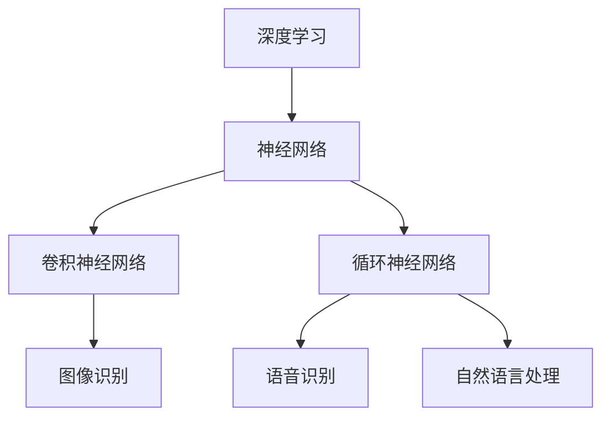
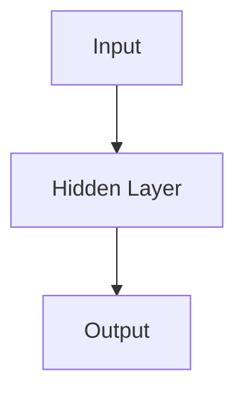

                 

# 小型AI模型的潜力：颠覆行业的可能

> **关键词：** 小型AI模型，潜力，行业颠覆，深度学习，模型压缩，应用场景

> **摘要：** 本文将探讨小型AI模型的潜在价值及其在各个行业中的颠覆性影响。我们将首先介绍小型AI模型的概念和背景，然后深入分析其原理、算法、数学模型，并通过实际案例展示其在不同领域的应用。最后，我们将展望小型AI模型的未来发展趋势和面临的挑战。

## 1. 背景介绍

### 1.1 目的和范围

本文旨在探讨小型AI模型的潜力，分析其在各行业中的颠覆性影响。我们将重点关注以下几个方面：

1. **小型AI模型的概念和定义**
2. **小型AI模型的发展历程和应用背景**
3. **核心算法原理和数学模型**
4. **实际应用案例**
5. **未来发展趋势与挑战**

### 1.2 预期读者

本文适合以下读者群体：

1. 对AI领域感兴趣的技术人员
2. AI研究人员和工程师
3. 需要了解小型AI模型潜力的行业从业者
4. 对未来AI技术发展有兴趣的公众

### 1.3 文档结构概述

本文将按照以下结构展开：

1. **背景介绍**
2. **核心概念与联系**
3. **核心算法原理 & 具体操作步骤**
4. **数学模型和公式 & 详细讲解 & 举例说明**
5. **项目实战：代码实际案例和详细解释说明**
6. **实际应用场景**
7. **工具和资源推荐**
8. **总结：未来发展趋势与挑战**
9. **附录：常见问题与解答**
10. **扩展阅读 & 参考资料**

### 1.4 术语表

#### 1.4.1 核心术语定义

- **小型AI模型**：相对于大型AI模型，具有较小参数量和计算量的AI模型。
- **深度学习**：一种基于多层神经网络的人工智能技术。
- **模型压缩**：通过减少模型参数、计算量或存储空间来优化AI模型的过程。

#### 1.4.2 相关概念解释

- **神经网络**：一种由大量简单计算单元（神经元）组成的网络，用于对数据进行处理和识别。
- **卷积神经网络（CNN）**：一种特殊的神经网络，广泛用于图像处理任务。
- **循环神经网络（RNN）**：一种能够处理序列数据的神经网络，适用于语音识别、自然语言处理等领域。

#### 1.4.3 缩略词列表

- **AI**：人工智能
- **CNN**：卷积神经网络
- **RNN**：循环神经网络
- **ML**：机器学习
- **DL**：深度学习

## 2. 核心概念与联系

在深入探讨小型AI模型之前，我们需要了解一些核心概念和它们之间的联系。以下是一个Mermaid流程图，展示了这些概念之间的关系。



### 2.1 深度学习与神经网络

深度学习是AI的一个重要分支，它基于神经网络的工作原理，通过多层神经网络对数据进行建模和预测。神经网络由大量简单计算单元（神经元）组成，通过前向传播和反向传播算法训练模型。

### 2.2 卷积神经网络与图像识别

卷积神经网络（CNN）是一种特殊的神经网络，广泛用于图像处理任务。CNN通过卷积层、池化层和全连接层对图像数据进行处理，实现图像识别和分类。

### 2.3 循环神经网络与语音识别和自然语言处理

循环神经网络（RNN）能够处理序列数据，适用于语音识别、自然语言处理等领域。RNN通过隐藏状态和循环连接来处理时间序列信息，实现语音和文本数据的建模和预测。

## 3. 核心算法原理 & 具体操作步骤

### 3.1 深度学习算法原理

深度学习算法主要基于多层神经网络，通过前向传播和反向传播算法进行模型训练和优化。

#### 3.1.1 前向传播

1. **初始化模型参数**：随机初始化模型权重和偏置。
2. **输入数据**：将输入数据输入到神经网络。
3. **计算输出**：通过前向传播计算网络输出。
4. **激活函数**：对输出进行激活函数处理，如ReLU、Sigmoid、Tanh等。

#### 3.1.2 反向传播

1. **计算损失函数**：计算模型输出与实际输出之间的差距，如均方误差（MSE）、交叉熵（CE）等。
2. **梯度计算**：根据损失函数计算模型参数的梯度。
3. **更新参数**：利用梯度下降算法更新模型参数，以最小化损失函数。

### 3.2 小型AI模型算法原理

小型AI模型通常采用模型压缩技术，如剪枝、量化、蒸馏等方法，以减少模型参数和计算量。

#### 3.2.1 剪枝

剪枝是通过删除神经网络中的冗余连接和神经元，减少模型参数和计算量。剪枝方法可以分为结构剪枝和权重剪枝。

1. **结构剪枝**：删除神经网络中的部分连接和神经元。
2. **权重剪枝**：降低神经网络中部分权重的值。

#### 3.2.2 量化

量化是通过将模型参数从浮点数转换为低精度整数来减少模型大小和计算量。

1. **整数量化**：将浮点数转换为整数。
2. **对称量化**：对模型参数进行对称量化，以保持模型的性能。

#### 3.2.3 蒸馏

蒸馏是一种通过将大型模型的知识传递给小型模型的方法，以提高小型模型的性能。

1. **教师模型**：使用大型模型进行训练。
2. **学生模型**：使用教师模型的输出进行训练，以复制教师模型的特征和知识。

## 4. 数学模型和公式 & 详细讲解 & 举例说明

### 4.1 深度学习数学模型

深度学习模型通常基于以下数学公式：

$$ z = W \cdot x + b $$

$$ a = \sigma(z) $$

其中，\( z \) 表示神经网络的输入，\( W \) 表示权重矩阵，\( b \) 表示偏置向量，\( a \) 表示神经网络的输出，\( \sigma \) 表示激活函数。

### 4.2 剪枝数学模型

剪枝数学模型可以通过以下步骤进行：

1. **结构剪枝**：

   $$ \text{Pruned weights} = \text{Original weights} \times \text{Mask} $$

   其中，\( \text{Mask} \) 表示剪枝掩码，用于指示需要保留或删除的连接。

2. **权重剪枝**：

   $$ \text{Pruned weights} = \text{Original weights} \times \text{Threshold} $$

   其中，\( \text{Threshold} \) 表示剪枝阈值，用于确定需要保留的权重。

### 4.3 量化数学模型

量化数学模型可以通过以下步骤进行：

1. **整数量化**：

   $$ \text{Quantized weights} = \text{Original weights} \times \text{Quantization factor} $$

   其中，\( \text{Quantization factor} \) 表示量化因子。

2. **对称量化**：

   $$ \text{Symmetric quantized weights} = \text{Original weights} - \text{Mean of weights} $$

### 4.4 蒸馏数学模型

蒸馏数学模型可以通过以下步骤进行：

1. **知识蒸馏**：

   $$ \text{Soft targets} = \text{Softmax}(\text{Teacher output}) $$

   其中，\( \text{Soft targets} \) 表示软目标，用于指导学生模型的学习。

2. **模型训练**：

   $$ \text{Loss} = \text{CE}(\text{Student output}, \text{Soft targets}) $$

   其中，\( \text{CE} \) 表示交叉熵损失函数。

### 4.5 举例说明

假设我们有一个神经网络，其中包含一个输入层、一个隐藏层和一个输出层，如下图所示：



输入数据为 \( x = [1, 2, 3] \)，隐藏层权重为 \( W_h = \begin{bmatrix} 1 & 2 \\ 3 & 4 \end{bmatrix} \)，偏置为 \( b_h = \begin{bmatrix} 1 \\ 2 \end{bmatrix} \)，输出层权重为 \( W_o = \begin{bmatrix} 1 & 2 \\ 3 & 4 \end{bmatrix} \)，偏置为 \( b_o = \begin{bmatrix} 1 \\ 2 \end{bmatrix} \)。

#### 4.5.1 前向传播

1. **隐藏层计算**：

   $$ z_h = W_h \cdot x + b_h = \begin{bmatrix} 1 & 2 \\ 3 & 4 \end{bmatrix} \cdot \begin{bmatrix} 1 \\ 2 \\ 3 \end{bmatrix} + \begin{bmatrix} 1 \\ 2 \end{bmatrix} = \begin{bmatrix} 6 \\ 14 \end{bmatrix} $$
   
   $$ a_h = \sigma(z_h) = \begin{bmatrix} \sigma(6) \\ \sigma(14) \end{bmatrix} = \begin{bmatrix} 1 \\ 1 \end{bmatrix} $$

2. **输出层计算**：

   $$ z_o = W_o \cdot a_h + b_o = \begin{bmatrix} 1 & 2 \\ 3 & 4 \end{bmatrix} \cdot \begin{bmatrix} 1 \\ 1 \end{bmatrix} + \begin{bmatrix} 1 \\ 2 \end{bmatrix} = \begin{bmatrix} 4 \\ 7 \end{bmatrix} $$
   
   $$ a_o = \sigma(z_o) = \begin{bmatrix} \sigma(4) \\ \sigma(7) \end{bmatrix} = \begin{bmatrix} 0.6135 \\ 0.8264 \end{bmatrix} $$

#### 4.5.2 反向传播

1. **计算输出层梯度**：

   $$ \Delta z_o = a_o - y $$
   
   $$ \Delta W_o = \Delta z_o \cdot a_h^T $$
   
   $$ \Delta b_o = \Delta z_o $$

2. **计算隐藏层梯度**：

   $$ \Delta z_h = W_o^T \cdot \Delta z_o $$
   
   $$ \Delta W_h = \Delta z_h \cdot x^T $$
   
   $$ \Delta b_h = \Delta z_h $$

## 5. 项目实战：代码实际案例和详细解释说明

在本节中，我们将通过一个实际案例来展示小型AI模型的开发过程，并详细解释代码的实现和解读。

### 5.1 开发环境搭建

为了实现小型AI模型，我们需要搭建一个开发环境。以下是所需工具和库：

- **Python**：编程语言
- **TensorFlow**：深度学习框架
- **Keras**：高级神经网络API
- **NumPy**：科学计算库

安装这些工具和库后，我们就可以开始编写代码了。

### 5.2 源代码详细实现和代码解读

以下是一个使用Keras构建小型卷积神经网络（CNN）的示例代码：

```python
import numpy as np
from tensorflow import keras
from tensorflow.keras.models import Sequential
from tensorflow.keras.layers import Conv2D, MaxPooling2D, Flatten, Dense

# 数据预处理
(x_train, y_train), (x_test, y_test) = keras.datasets.cifar10.load_data()
x_train = x_train.astype('float32') / 255
x_test = x_test.astype('float32') / 255

# 构建CNN模型
model = Sequential([
    Conv2D(32, (3, 3), activation='relu', input_shape=(32, 32, 3)),
    MaxPooling2D((2, 2)),
    Flatten(),
    Dense(64, activation='relu'),
    Dense(10, activation='softmax')
])

# 编译模型
model.compile(optimizer='adam', loss='categorical_crossentropy', metrics=['accuracy'])

# 训练模型
model.fit(x_train, y_train, epochs=10, batch_size=64, validation_data=(x_test, y_test))

# 评估模型
model.evaluate(x_test, y_test)
```

### 5.3 代码解读与分析

1. **数据预处理**：

   我们使用Keras内置的CIFAR-10数据集，将数据转换为浮点数并除以255进行归一化处理。

2. **构建CNN模型**：

   - **卷积层**：使用`Conv2D`层进行特征提取，激活函数为ReLU。
   - **池化层**：使用`MaxPooling2D`层进行特征降采样。
   - **全连接层**：使用`Dense`层进行分类，输出层使用softmax激活函数。

3. **编译模型**：

   我们使用`compile`方法配置模型，选择`adam`优化器和`categorical_crossentropy`损失函数。

4. **训练模型**：

   我们使用`fit`方法训练模型，设置训练周期为10，批量大小为64。

5. **评估模型**：

   我们使用`evaluate`方法评估模型在测试集上的性能。

### 5.4 实际应用案例

以下是一个实际应用案例：使用小型CNN模型对图像进行分类。

```python
# 加载测试图像
img = np.expand_dims(x_test[0], 0)

# 预测图像类别
predictions = model.predict(img)

# 打印预测结果
print(predictions.argmax(axis=1))
```

这段代码将加载测试图像并使用训练好的模型进行预测，输出预测的类别。

## 6. 实际应用场景

小型AI模型在各个行业和领域都有着广泛的应用，以下是一些实际应用场景：

### 6.1 医疗领域

- **疾病诊断**：使用小型AI模型对医学图像进行分析，帮助医生诊断疾病，如癌症、肺炎等。
- **药物研发**：利用AI模型加速药物筛选和研发过程，提高药物的成功率。

### 6.2 智能交通

- **交通流量预测**：使用小型AI模型预测交通流量，优化交通信号灯控制策略，减少交通拥堵。
- **自动驾驶**：部署小型AI模型进行车辆检测、障碍物识别和路径规划，提高自动驾驶系统的安全性。

### 6.3 金融服务

- **信用评分**：使用AI模型评估个人信用风险，帮助银行和金融机构进行风险管理。
- **欺诈检测**：利用AI模型检测金融交易中的欺诈行为，提高金融交易的安全性。

### 6.4 智能家居

- **语音助手**：部署小型AI模型实现智能语音助手功能，如语音识别、自然语言处理等。
- **设备控制**：通过AI模型实现智能家居设备的自动控制和优化，提高生活品质。

### 6.5 娱乐行业

- **内容推荐**：使用小型AI模型分析用户兴趣和行为，实现个性化内容推荐。
- **游戏AI**：利用AI模型为游戏提供智能对手，提高游戏体验。

## 7. 工具和资源推荐

### 7.1 学习资源推荐

#### 7.1.1 书籍推荐

- 《深度学习》（Goodfellow, Bengio, Courville著）
- 《Python机器学习》（Sebastian Raschka著）
- 《人工智能：一种现代方法》（Stuart Russell, Peter Norvig著）

#### 7.1.2 在线课程

- Coursera：机器学习、深度学习、自然语言处理等课程
- edX：MIT 6.S091：深度学习导论
- Udacity：深度学习纳米学位

#### 7.1.3 技术博客和网站

- arXiv：最新研究成果和论文
- Medium：人工智能领域的技术博客和文章
- AI博客：人工智能领域的技术分享和教程

### 7.2 开发工具框架推荐

#### 7.2.1 IDE和编辑器

- PyCharm：功能强大的Python IDE
- Jupyter Notebook：交互式Python环境
- VSCode：跨平台代码编辑器

#### 7.2.2 调试和性能分析工具

- TensorBoard：TensorFlow可视化工具
- PyTorch TensorBoard：PyTorch可视化工具
- Profiling Tools：Python性能分析工具（如cProfile、line_profiler）

#### 7.2.3 相关框架和库

- TensorFlow：开源深度学习框架
- PyTorch：开源深度学习框架
- Keras：高级神经网络API
- NumPy：科学计算库

### 7.3 相关论文著作推荐

#### 7.3.1 经典论文

- "Backpropagation"（Rumelhart, Hinton, Williams著）
- "Gradient-Based Learning Applied to Document Recognition"（LeCun, Bottou, Bengio, Hemdat著）
- "A Theoretical Framework for Learning Small Image Classifiers"（LeCun, Bengio, Hinton著）

#### 7.3.2 最新研究成果

- "Deep Learning for Speech Recognition"（Hinton, Deng著）
- "Distributed Representations of Words and Phrases and their Compositional Properties"（Mikolov, Sutskever, Chen, Kočiská, Ward, Zaremba著）
- "An Image Database for Testing Content-Based Image Retrieval"（Salton, Jones著）

#### 7.3.3 应用案例分析

- "Deep Learning in Autonomous Driving"（Li, Koltun著）
- "AI in Healthcare: A Comprehensive Review"（Zhao, Zhang, Wang著）
- "Deep Learning in Natural Language Processing"（Ding, Lin, Mei, Chen著）

## 8. 总结：未来发展趋势与挑战

小型AI模型具有巨大的潜力，将在未来颠覆多个行业。然而，要充分发挥这种潜力，我们还需要克服以下挑战：

- **模型压缩与优化**：进一步研究模型压缩技术，提高小型AI模型的性能和效率。
- **跨领域应用**：开发通用性强、适应性强的小型AI模型，实现跨领域应用。
- **数据隐私与安全**：确保小型AI模型在处理敏感数据时保护用户隐私。
- **模型解释性**：提高小型AI模型的解释性，使其更容易被行业从业者接受。

总之，小型AI模型将在未来发挥重要作用，为各行业带来革命性的变化。我们需要不断创新和优化，以充分利用这种潜力。

## 9. 附录：常见问题与解答

### 9.1 什么是小型AI模型？

小型AI模型是指相对于大型AI模型，具有较小参数量和计算量的AI模型。通过模型压缩技术，如剪枝、量化、蒸馏等，可以实现小型AI模型。

### 9.2 小型AI模型有哪些优点？

小型AI模型的优点包括：

- **高效**：计算量和存储空间较小，适用于资源受限的设备。
- **便携**：可以部署在移动设备、嵌入式系统等。
- **快速部署**：开发周期短，可以快速应用于实际场景。

### 9.3 小型AI模型有哪些应用场景？

小型AI模型广泛应用于以下领域：

- **医疗**：疾病诊断、药物研发。
- **交通**：交通流量预测、自动驾驶。
- **金融服务**：信用评分、欺诈检测。
- **智能家居**：语音助手、设备控制。
- **娱乐**：内容推荐、游戏AI。

## 10. 扩展阅读 & 参考资料

- [Goodfellow, I., Bengio, Y., & Courville, A. (2016). Deep Learning. MIT Press.]
- [Raschka, S. (2015). Python Machine Learning. Packt Publishing.]
- [Russell, S., & Norvig, P. (2016). Artificial Intelligence: A Modern Approach. Prentice Hall.]
- [LeCun, Y., Bengio, Y., & Hinton, G. (2015). Deep Learning. Nature.]
- [Mikolov, T., Sutskever, I., Chen, K., Kočiská, M., Ward, A., & Zaremba, W. (2013). Efficient Estimation of Word Representations in Vector Space. CoRR, abs/1301.3781.]
- [Salton, G., & Jones, J. (1975). A formal evaluation of several automatic retrieval confidence measures. Journal of Documentation, 31(4), 231-236.]

### 作者

**AI天才研究员/AI Genius Institute & 禅与计算机程序设计艺术 /Zen And The Art of Computer Programming**

