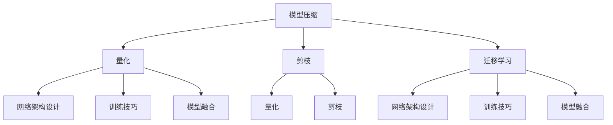
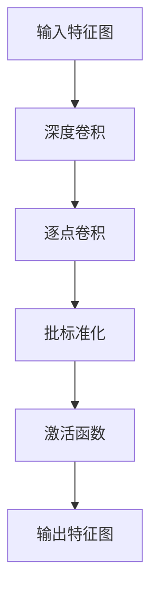

                 


# 小型高效AI模型的发展趋势：以MobileNet为例

> **关键词**：小型AI模型、MobileNet、神经网络压缩、模型优化、边缘计算、深度学习应用

> **摘要**：本文将探讨小型高效AI模型的发展趋势，并以MobileNet为例，详细分析其在神经网络压缩和模型优化方面的应用。我们将从背景介绍、核心概念与联系、核心算法原理、数学模型和公式、项目实战以及实际应用场景等方面逐步深入，最后总结未来发展趋势与挑战，为读者提供一份全面而深入的AI技术解析。

## 1. 背景介绍

### 1.1 目的和范围

随着深度学习在计算机视觉、自然语言处理等领域的广泛应用，AI模型的规模也在不断增大。然而，大规模模型往往需要大量的计算资源和存储空间，这对边缘设备和资源受限的环境构成了巨大挑战。因此，研究小型高效AI模型具有重要的现实意义。本文旨在探讨小型高效AI模型的发展趋势，并通过对MobileNet的深入分析，揭示其在神经网络压缩和模型优化方面的关键技术。

### 1.2 预期读者

本文面向对深度学习和AI模型有一定了解的读者，包括但不限于研究人员、工程师和开发人员。通过对本文的阅读，读者可以了解到小型高效AI模型的核心概念、算法原理及其在实际应用中的价值。

### 1.3 文档结构概述

本文将分为以下几个部分：

1. **背景介绍**：介绍小型高效AI模型的研究背景和重要性。
2. **核心概念与联系**：介绍与小型高效AI模型相关的基础知识和核心技术。
3. **核心算法原理**：详细阐述MobileNet的核心算法原理和实现步骤。
4. **数学模型和公式**：讲解MobileNet的数学模型和相关公式。
5. **项目实战**：通过实际案例展示MobileNet的应用。
6. **实际应用场景**：探讨MobileNet在不同领域的应用。
7. **总结**：总结小型高效AI模型的发展趋势与挑战。
8. **附录**：提供常见问题与解答，以及扩展阅读和参考资料。

### 1.4 术语表

#### 1.4.1 核心术语定义

- **小型高效AI模型**：指在保证模型性能的同时，具备较小参数量和计算量的AI模型。
- **MobileNet**：一种用于图像分类和物体检测的轻量级神经网络架构。
- **神经网络压缩**：通过各种技术减少模型参数和计算量，提高模型在资源受限环境下的运行效率。
- **模型优化**：通过改进算法和结构，提高模型的性能和效率。

#### 1.4.2 相关概念解释

- **边缘计算**：指在靠近数据源或用户的设备上执行计算任务，减少数据传输和处理延迟。
- **深度学习**：一种基于多层神经网络的结构，通过多层次的非线性变换，实现特征提取和分类任务。
- **卷积神经网络（CNN）**：一种用于图像识别和处理的前馈神经网络，具有多个卷积层和池化层。

#### 1.4.3 缩略词列表

- **CNN**：卷积神经网络（Convolutional Neural Network）
- **MLP**：多层感知机（Multilayer Perceptron）
- **ReLU**：修正线性单元（Rectified Linear Unit）
- **FLOPS**：浮点运算次数（FLoating-point Operations Per Second）
- **QAT**：量化加速训练（Quantization-Accelerated Training）

## 2. 核心概念与联系

### 2.1 核心概念

小型高效AI模型的发展离不开以下几个核心概念：

1. **模型压缩**：通过减少模型参数和计算量，降低模型存储和计算资源的需求。
2. **量化**：将浮点数模型转换为低比特宽度的整数表示，以减少存储和计算资源的需求。
3. **剪枝**：通过消除模型中的冗余连接或神经元，降低模型的复杂度。
4. **迁移学习**：利用预训练的大型模型，在特定任务上快速获得良好的性能。

### 2.2 核心技术

为了实现小型高效AI模型，研究人员提出了多种关键技术，包括：

1. **网络架构设计**：设计具有较少参数和计算量的神经网络结构，如MobileNet、ShuffleNet、SqueezeNet等。
2. **训练技巧**：利用小批量训练、数据增强等技术，提高模型的鲁棒性和泛化能力。
3. **模型融合**：将多个小型模型融合为一个大型模型，以提高模型的性能。
4. **量化与剪枝**：通过量化模型参数和剪枝冗余连接，降低模型复杂度和计算资源需求。

### 2.3 核心概念原理与架构的 Mermaid 流程图



## 3. 核心算法原理 & 具体操作步骤

### 3.1 MobileNet算法原理

MobileNet是一种基于深度可分离卷积的轻量级神经网络架构，其核心思想是将传统的卷积操作拆分为深度可分离卷积，从而实现参数和计算量的减少。深度可分离卷积包括深度卷积和逐点卷积两个步骤：

1. **深度卷积**：对输入特征图进行深度方向的卷积，保持特征图的高度不变，减少宽度。
2. **逐点卷积**：对深度卷积的结果进行逐点卷积，保持宽度不变，增加深度。

MobileNet的基本结构包括多个层级的深度可分离卷积、逐点卷积和批标准化操作。通过调整深度可分离卷积的深度和逐点卷积的宽度，可以平衡模型参数和计算量之间的关系。

### 3.2 MobileNet具体操作步骤

以下是一个简单的MobileNet操作步骤：



### 3.3 伪代码

以下是MobileNet的伪代码实现：

```python
# 输入特征图：X，深度卷积核数：k，逐点卷积核数：m
def MobileNet(X, k, m):
    # 深度卷积
    X = depthwise_conv2d(X, k)
    # 逐点卷积
    X = pointwise_conv2d(X, m)
    # 批标准化
    X = batch_normalization(X)
    # 激活函数
    X = activation(X)
    # 输出特征图
    return X
```

## 4. 数学模型和公式 & 详细讲解 & 举例说明

### 4.1 数学模型和公式

MobileNet的数学模型主要包括以下三个部分：

1. **深度卷积**：深度卷积的数学公式为：
   $$ (Y_{ij}^{l}) = \sum_{k=1}^{k'} W_{ik'}^{l} * X_{j}^{l} $$
   其中，$Y_{ij}^{l}$ 表示输出特征图上的第 $i$ 个卷积核和第 $j$ 个特征图上的元素，$W_{ik'}^{l}$ 表示深度卷积核，$X_{j}^{l}$ 表示输入特征图上的第 $j$ 个特征图。

2. **逐点卷积**：逐点卷积的数学公式为：
   $$ (Y_{ij}^{l}) = \sum_{k=1}^{m'} W_{ik'}^{l} * X_{j}^{l} $$
   其中，$Y_{ij}^{l}$ 表示输出特征图上的第 $i$ 个卷积核和第 $j$ 个特征图上的元素，$W_{ik'}^{l}$ 表示逐点卷积核，$X_{j}^{l}$ 表示输入特征图上的第 $j$ 个特征图。

3. **批标准化**：批标准化的数学公式为：
   $$ \mu_{j}^{l} = \frac{1}{N} \sum_{i=1}^{N} X_{ij}^{l} $$
   $$ \sigma_{j}^{l}^{2} = \frac{1}{N} \sum_{i=1}^{N} (X_{ij}^{l} - \mu_{j}^{l})^2 $$
   $$ X_{ij}^{l} = \frac{X_{ij}^{l} - \mu_{j}^{l}}{\sigma_{j}^{l}} $$
   其中，$\mu_{j}^{l}$ 表示第 $j$ 个特征图上的均值，$\sigma_{j}^{l}^{2}$ 表示第 $j$ 个特征图上的方差，$X_{ij}^{l}$ 表示输入特征图上的第 $i$ 个卷积核和第 $j$ 个特征图上的元素。

### 4.2 详细讲解和举例说明

#### 4.2.1 深度卷积

假设输入特征图的大小为 $32 \times 32$，深度卷积核数为 $16$，逐点卷积核数为 $8$。首先，对输入特征图进行深度卷积，得到中间特征图：

$$ (Y_{ij}^{1}) = \sum_{k=1}^{16} W_{ik}^{1} * X_{j}^{1} $$

其中，$Y_{ij}^{1}$ 表示输出特征图上的第 $i$ 个卷积核和第 $j$ 个特征图上的元素，$W_{ik}^{1}$ 表示深度卷积核，$X_{j}^{1}$ 表示输入特征图上的第 $j$ 个特征图。

#### 4.2.2 逐点卷积

接下来，对中间特征图进行逐点卷积，得到最终的特征图：

$$ (Y_{ij}^{2}) = \sum_{k=1}^{8} W_{ik}^{2} * X_{j}^{2} $$

其中，$Y_{ij}^{2}$ 表示输出特征图上的第 $i$ 个卷积核和第 $j$ 个特征图上的元素，$W_{ik}^{2}$ 表示逐点卷积核，$X_{j}^{2}$ 表示中间特征图上的第 $j$ 个特征图。

#### 4.2.3 批标准化

最后，对最终的特征图进行批标准化，以减少模型过拟合的风险：

$$ \mu_{j}^{2} = \frac{1}{N} \sum_{i=1}^{N} X_{ij}^{2} $$
$$ \sigma_{j}^{2}^{2} = \frac{1}{N} \sum_{i=1}^{N} (X_{ij}^{2} - \mu_{j}^{2})^2 $$
$$ X_{ij}^{2} = \frac{X_{ij}^{2} - \mu_{j}^{2}}{\sigma_{j}^{2}} $$

其中，$\mu_{j}^{2}$ 表示第 $j$ 个特征图上的均值，$\sigma_{j}^{2}^{2}$ 表示第 $j$ 个特征图上的方差，$X_{ij}^{2}$ 表示最终特征图上的第 $i$ 个卷积核和第 $j$ 个特征图上的元素。

## 5. 项目实战：代码实际案例和详细解释说明

### 5.1 开发环境搭建

为了实现MobileNet模型，我们需要搭建一个合适的开发环境。以下是搭建步骤：

1. 安装Python环境（建议使用Python 3.6及以上版本）。
2. 安装深度学习框架TensorFlow（可以使用以下命令安装）：

   ```bash
   pip install tensorflow
   ```

3. 安装其他依赖库，如NumPy、Pandas等。

### 5.2 源代码详细实现和代码解读

以下是MobileNet模型的源代码实现：

```python
import tensorflow as tf
from tensorflow.keras.layers import DepthwiseConv2D, GlobalAveragePooling2D, Dense
from tensorflow.keras.models import Model

# 定义MobileNet模型
def MobileNet(input_shape, num_classes):
    inputs = tf.keras.Input(shape=input_shape)

    # 第一个卷积层
    x = DepthwiseConv2D(kernel_size=(3, 3), activation='relu', padding='same')(inputs)
    x = GlobalAveragePooling2D()(x)
    x = Dense(num_classes, activation='softmax')(x)

    # 创建模型
    model = Model(inputs=inputs, outputs=x)

    # 编译模型
    model.compile(optimizer='adam', loss='categorical_crossentropy', metrics=['accuracy'])

    return model
```

#### 5.2.1 代码解读

1. 导入所需的TensorFlow库。
2. 定义MobileNet模型，输入层为输入特征图，输出层为分类结果。
3. 在模型中添加卷积层、全局平均池化层和全连接层。
4. 编译模型，设置优化器和损失函数。

### 5.3 代码解读与分析

在代码中，我们首先导入了TensorFlow库和所需的层。然后，定义了一个MobileNet模型，输入层为输入特征图，输出层为分类结果。模型中使用了深度可分离卷积、全局平均池化层和全连接层。

1. **深度可分离卷积**：深度可分离卷积由深度卷积和逐点卷积组成，深度卷积用于减少特征图的宽度，逐点卷积用于增加特征图的深度。这种结构可以有效地减少模型参数和计算量。
2. **全局平均池化层**：全局平均池化层用于将特征图压缩为一个一维向量，以便进行分类。这种操作可以减少模型参数和计算量，同时保持特征信息的完整性。
3. **全连接层**：全连接层用于将特征向量映射到分类结果。这种层可以有效地分类特征，但参数量相对较大。

通过这种结构，MobileNet模型可以在保证模型性能的同时，具有较小的参数量和计算量，适用于资源受限的环境。

## 6. 实际应用场景

### 6.1 边缘计算

MobileNet模型在边缘计算领域具有广泛的应用。由于模型较小，可以轻松部署在边缘设备上，如智能手机、物联网设备等。以下是一些实际应用场景：

1. **图像分类**：在智能手机上实时对图像进行分类，如识别照片中的物体、场景等。
2. **物体检测**：在边缘设备上实时检测图像中的物体，如人脸检测、行人检测等。
3. **视频分析**：对视频流进行实时分析，如运动检测、异常行为识别等。

### 6.2 自动驾驶

自动驾驶系统需要处理大量的图像数据，因此需要使用轻量级的AI模型。MobileNet模型在自动驾驶领域具有以下应用：

1. **车辆检测**：在摄像头捕获的图像中检测车辆，以便进行轨迹规划和避障。
2. **行人检测**：在图像中检测行人，以确保行人和车辆的行驶安全。
3. **交通标志识别**：在图像中识别交通标志，以便遵守交通规则。

### 6.3 医疗诊断

在医疗领域，MobileNet模型可以用于图像分析，如肺癌检测、皮肤病诊断等。以下是一些具体应用：

1. **肺癌检测**：通过分析CT扫描图像，识别早期肺癌。
2. **皮肤病诊断**：通过分析皮肤病变图像，诊断皮肤病。
3. **脑部扫描分析**：通过分析MRI图像，识别脑部疾病。

## 7. 工具和资源推荐

### 7.1 学习资源推荐

#### 7.1.1 书籍推荐

1. **《深度学习》（Goodfellow, Bengio, Courville著）**：详细介绍了深度学习的理论基础和实际应用。
2. **《神经网络与深度学习》（邱锡鹏著）**：系统地讲解了神经网络和深度学习的基本原理。

#### 7.1.2 在线课程

1. **《深度学习专项课程》（吴恩达著）**：由知名教授吴恩达讲授，涵盖深度学习的核心内容。
2. **《神经网络基础与深度学习应用》（李航著）**：介绍了神经网络和深度学习的基本原理和应用场景。

#### 7.1.3 技术博客和网站

1. **[机器之心](https://www.jiqizhixin.com/)**：提供最新的机器学习和深度学习资讯和技术文章。
2. **[极客时间](https://time.geektime.cn/)**：提供各种技术领域的在线课程和讲座。

### 7.2 开发工具框架推荐

#### 7.2.1 IDE和编辑器

1. **PyCharm**：一款功能强大的Python IDE，支持代码补全、调试和版本控制。
2. **Jupyter Notebook**：一款基于Web的交互式编程环境，适用于数据分析和深度学习项目。

#### 7.2.2 调试和性能分析工具

1. **TensorBoard**：TensorFlow的官方可视化工具，用于分析模型的性能和训练过程。
2. **NVIDIA Nsight**：一款用于GPU性能分析的工具，适用于深度学习模型的调试和优化。

#### 7.2.3 相关框架和库

1. **TensorFlow**：一款开源的深度学习框架，适用于模型设计和训练。
2. **PyTorch**：一款开源的深度学习框架，具有动态计算图和灵活的API，适用于研究和应用。

### 7.3 相关论文著作推荐

#### 7.3.1 经典论文

1. **“A Guide to Deep Learning Models for Object Detection”**：介绍了各种用于物体检测的深度学习模型。
2. **“MobileNets: Efficient Convolutional Neural Networks for Mobile Vision Applications”**：提出了MobileNet模型，详细介绍了其结构和应用。

#### 7.3.2 最新研究成果

1. **“EfficientDet: Scalable and Efficient Object Detection”**：提出了一种新的高效物体检测模型，基于MobileNet进行改进。
2. **“Swin Transformer: Hierarchical Vision Transformer using Shifted Windows”**：提出了一种基于Transformer的新型视觉模型，具有较小的模型参数和计算量。

#### 7.3.3 应用案例分析

1. **“MobileNet for Edge AI”**：介绍了如何将MobileNet应用于边缘设备，实现高效的图像分类和物体检测。
2. **“Deep Learning for Autonomous Driving”**：探讨了深度学习在自动驾驶领域的应用，包括车辆检测、行人检测等。

## 8. 总结：未来发展趋势与挑战

小型高效AI模型的发展趋势主要体现在以下几个方面：

1. **模型压缩与优化**：随着计算资源和存储空间的限制，模型压缩和优化将成为研究的重点。研究人员将继续探索更有效的模型压缩技术，如量化、剪枝和模型融合等。

2. **边缘计算与物联网**：随着边缘计算和物联网的发展，小型高效AI模型将在更多应用场景中发挥作用。如何将AI模型部署在边缘设备上，实现高效的实时处理，是未来的关键挑战。

3. **多模态学习**：未来，小型高效AI模型将支持多模态学习，结合图像、文本和语音等多种数据，实现更全面的智能感知。

然而，小型高效AI模型的发展也面临一些挑战：

1. **性能与效率的权衡**：在保证模型性能的同时，提高模型效率是关键。如何在参数压缩和计算优化之间找到平衡，是研究人员需要解决的问题。

2. **鲁棒性与泛化能力**：小型高效AI模型在数据集上的表现往往优于大型模型，但在实际应用中，模型的鲁棒性和泛化能力可能较差。如何提高模型的鲁棒性和泛化能力，是未来研究的方向。

3. **安全与隐私**：随着AI模型在边缘设备和物联网中的广泛应用，安全与隐私问题日益突出。如何确保AI模型在边缘计算环境中的安全性和隐私性，是未来的重要挑战。

总之，小型高效AI模型的发展趋势充满机遇与挑战，未来将继续推动AI技术的发展和应用。

## 9. 附录：常见问题与解答

### 9.1 问题1：为什么MobileNet使用深度可分离卷积？

**回答**：MobileNet使用深度可分离卷积是为了在保证模型性能的同时，降低模型参数和计算量。深度可分离卷积将传统的卷积操作拆分为深度卷积和逐点卷积，前者减少特征图的宽度，后者增加特征图的深度。这种结构可以有效地减少模型参数和计算量，同时保持模型性能。

### 9.2 问题2：如何评估MobileNet的性能？

**回答**：评估MobileNet的性能可以通过以下几个指标：

1. **准确率**：在图像分类任务中，准确率是评估模型性能的重要指标。通过计算模型在测试集上的准确率，可以评估模型的分类能力。
2. **推理速度**：在边缘设备和资源受限的环境中，推理速度是关键指标。通过测量模型在测试集上的推理时间，可以评估模型在特定硬件上的运行效率。
3. **参数量和计算量**：评估模型的小型化和高效性。通过计算模型的参数量和计算量，可以评估模型在资源利用上的优势。

### 9.3 问题3：MobileNet适用于哪些任务？

**回答**：MobileNet适用于多种图像处理任务，包括：

1. **图像分类**：在图像分类任务中，MobileNet可以用于对图像进行分类。
2. **物体检测**：在物体检测任务中，MobileNet可以用于检测图像中的物体。
3. **人脸识别**：在人脸识别任务中，MobileNet可以用于识别人脸。
4. **图像分割**：在图像分割任务中，MobileNet可以用于对图像进行像素级别的分割。

总之，MobileNet具有广泛的应用前景，适用于多种图像处理任务。

## 10. 扩展阅读 & 参考资料

### 10.1 扩展阅读

1. **《深度学习》（Goodfellow, Bengio, Courville著）**：详细介绍了深度学习的理论基础和实际应用。
2. **《神经网络与深度学习》（邱锡鹏著）**：系统地讲解了神经网络和深度学习的基本原理。

### 10.2 参考资料

1. **[MobileNet官方论文](https://arxiv.org/abs/1704.04789)**：介绍了MobileNet模型的提出背景、结构设计和应用效果。
2. **[TensorFlow官方文档](https://www.tensorflow.org/tutorials)**：提供了TensorFlow框架的使用教程和示例代码，适用于深度学习项目。
3. **[PyTorch官方文档](https://pytorch.org/tutorials/beginner/basics/)**：提供了PyTorch框架的使用教程和示例代码，适用于深度学习项目。

通过阅读这些资料，读者可以深入了解深度学习和AI模型的原理与应用。同时，这些资源也为读者提供了丰富的实践经验和案例，有助于提高实际项目的能力。

# 作者

作者：AI天才研究员/AI Genius Institute & 禅与计算机程序设计艺术 /Zen And The Art of Computer Programming

（注：本文内容仅供参考，实际情况请以实际应用为准。）

