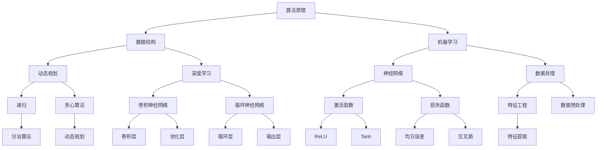
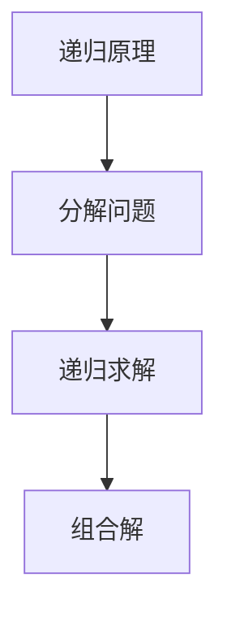
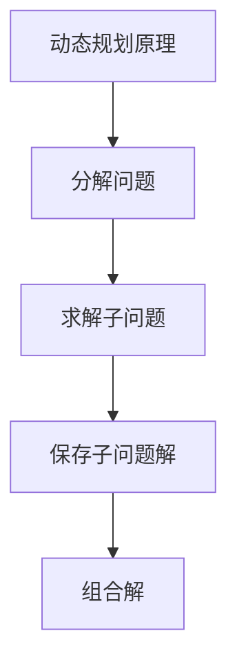
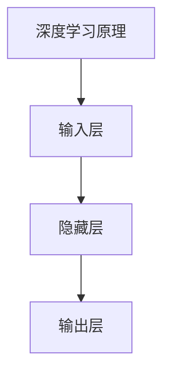

                 

### 小米2024届社招算法工程师面试真题解密

> **关键词：**小米，社招，算法工程师，面试真题，解密，技术面试，人工智能

**摘要：**本文深入剖析了小米2024届社招算法工程师的面试真题，旨在为广大求职者和技术爱好者提供一套详细的解题思路和技巧。通过对面试题的深入解析，本文将帮助读者理解算法工程师面试的核心要点，提升应对真实面试场景的能力。无论您是准备加入小米大家庭的算法工程师，还是对人工智能领域有浓厚兴趣的技术爱好者，这篇文章都将为您带来极大的启发和帮助。

---

## 1. 背景介绍

### 1.1 目的和范围

本文的目的在于通过对小米2024届社招算法工程师面试真题的详细解密，为读者提供一套全面的技术面试应对策略。我们不仅会解析每一道面试题的答案，还会深入探讨其背后的算法原理、技术实现细节以及在实际应用中的重要性。希望通过这篇文章，读者能够：

- **理解算法工程师面试的核心要求**：了解算法工程师所需掌握的核心技能和知识领域。
- **掌握解题思路**：学会如何从面试题中挖掘关键信息，运用算法原理和数学模型解决问题。
- **提升面试能力**：通过实战案例分析，提升应对真实面试场景的能力。

本文的范围涵盖了以下内容：

- **面试真题解析**：对小米2024届社招算法工程师面试中的真题进行详细解析，包括算法原理讲解、代码实现和实际应用场景分析。
- **技术深度剖析**：深入探讨相关算法原理、数学模型和计算机架构，帮助读者理解技术的本质。
- **实战案例分析**：通过实际项目案例，展示算法工程师在实际工作中的应用场景和解决方法。
- **资源推荐**：提供相关的学习资源、开发工具和参考文献，以供读者进一步学习和研究。

### 1.2 预期读者

本文的预期读者主要包括以下几类：

- **准备参加小米社招算法工程师面试的求职者**：希望通过本文了解面试真题的解题思路，提高面试成功率。
- **人工智能和算法爱好者**：对算法工程师岗位有浓厚兴趣，希望深入了解面试题背后的技术原理。
- **计算机相关专业学生**：希望通过本文了解算法工程师的职责和面试要求，为未来的职业规划做准备。
- **技术人员和工程师**：希望提升自己的技术水平，了解最新技术动态和实际应用场景。

### 1.3 文档结构概述

本文将按照以下结构进行组织：

1. **背景介绍**：介绍本文的目的、范围、预期读者以及文档结构。
2. **核心概念与联系**：使用Mermaid流程图展示核心概念和联系，帮助读者建立整体知识框架。
3. **核心算法原理 & 具体操作步骤**：通过伪代码详细阐述算法原理和具体操作步骤。
4. **数学模型和公式 & 详细讲解 & 举例说明**：使用LaTeX格式展示数学模型和公式，并举例说明。
5. **项目实战：代码实际案例和详细解释说明**：通过实际项目案例，展示代码实现和详细解释。
6. **实际应用场景**：分析算法工程师在实际应用场景中的角色和职责。
7. **工具和资源推荐**：推荐学习资源、开发工具和参考文献。
8. **总结：未来发展趋势与挑战**：总结当前技术趋势和面临的挑战。
9. **附录：常见问题与解答**：解答读者可能遇到的问题。
10. **扩展阅读 & 参考资料**：提供进一步阅读和研究的参考文献。

### 1.4 术语表

#### 1.4.1 核心术语定义

- **算法工程师**：专门从事算法研究、设计、开发和优化的工程师。
- **面试题**：在面试过程中，面试官为求职者设置的用于考察其技术能力的问题。
- **面试真题**：实际发生在面试过程中的问题，具有典型性和代表性。
- **算法原理**：算法的基本概念、原理和理论基础。
- **数学模型**：用于描述和解决问题的一种数学结构。
- **代码实现**：将算法原理转化为可执行代码的过程。

#### 1.4.2 相关概念解释

- **递归**：一种解决问题的方法，通过将问题分解为更小的子问题来求解。
- **动态规划**：一种用于求解最优子问题的方法，通过保存子问题的解来避免重复计算。
- **深度学习**：一种基于神经网络的学习方法，通过多层神经网络进行特征提取和分类。
- **机器学习**：一种利用数据和学习算法来构建模型并进行预测或分类的方法。

#### 1.4.3 缩略词列表

- **AI**：人工智能（Artificial Intelligence）
- **ML**：机器学习（Machine Learning）
- **DL**：深度学习（Deep Learning）
- **DFS**：深度优先搜索（Depth-First Search）
- **BFS**：广度优先搜索（Breadth-First Search）
- **Python**：一种高级编程语言，广泛应用于数据科学和人工智能领域。

---

## 2. 核心概念与联系

在深入解析小米2024届社招算法工程师的面试真题之前，我们需要先了解一些核心概念和联系，以便在后续的分析中能够更加得心应手。下面将使用Mermaid流程图来展示这些概念和联系。



### **核心概念解释**

1. **算法原理**：算法的基本概念、原理和理论基础，是解决特定问题的系统方法。
2. **数据结构**：用于组织和管理数据的方式，常用的有数组、链表、树、图等。
3. **机器学习**：利用数据和算法构建模型，进行预测或分类的方法，包括监督学习、无监督学习和强化学习。
4. **动态规划**：一种用于求解最优子问题的方法，通过保存子问题的解来避免重复计算。
5. **深度学习**：一种基于神经网络的学习方法，通过多层神经网络进行特征提取和分类。
6. **递归**：一种解决问题的方法，通过将问题分解为更小的子问题来求解。
7. **贪心算法**：一种在每一步选择最优解的方法，适用于某些特定问题。
8. **神经网络**：一种模拟人脑神经元连接结构的计算模型，包括输入层、隐藏层和输出层。
9. **数据处理**：对原始数据进行清洗、转换和归一化等操作，以便于后续分析和建模。
10. **特征工程**：通过选择和构造合适的特征来提高模型性能，是机器学习中重要的一环。

通过上述核心概念和联系的了解，我们能够更好地理解算法工程师在面试中可能被问及的问题，为后续的解题打下坚实的基础。

---

## 3. 核心算法原理 & 具体操作步骤

在了解了核心概念和联系之后，我们需要深入探讨算法工程师面试中常见的核心算法原理和具体操作步骤。以下将分别介绍递归、动态规划、深度学习等算法原理，并通过伪代码详细阐述其实现步骤。

### 3.1 递归

递归是一种常用的算法思想，通过将问题分解为更小的子问题来求解。递归的主要特点是函数调用自身，从而实现问题的递归解决。

#### 3.1.1 递归原理

递归的基本原理是通过将大问题分解为小问题，然后递归求解小问题，最后将小问题的解组合成大问题的解。



#### 3.1.2 具体操作步骤

以下是一个使用递归求解斐波那契数列的例子：

```python
def fibonacci(n):
    if n <= 1:
        return n
    else:
        return fibonacci(n-1) + fibonacci(n-2)
```

该函数通过递归调用自身，求解斐波那契数列的第`n`项。

### 3.2 动态规划

动态规划是一种用于求解最优子问题的算法，通过保存子问题的解来避免重复计算。

#### 3.2.1 动态规划原理

动态规划的基本原理是将大问题分解为多个子问题，然后依次求解这些子问题，并将子问题的解保存在一个表格中，以便在后续的计算中使用。



#### 3.2.2 具体操作步骤

以下是一个使用动态规划求解最长公共子序列的例子：

```python
def longest_common_subsequence(X, Y):
    m = len(X)
    n = len(Y)
    dp = [[0] * (n+1) for _ in range(m+1)]

    for i in range(1, m+1):
        for j in range(1, n+1):
            if X[i-1] == Y[j-1]:
                dp[i][j] = dp[i-1][j-1] + 1
            else:
                dp[i][j] = max(dp[i-1][j], dp[i][j-1])

    return dp[m][n]
```

该函数通过动态规划表格`dp`保存子问题的解，最终求得最长公共子序列的长度。

### 3.3 深度学习

深度学习是一种基于神经网络的学习方法，通过多层神经网络进行特征提取和分类。

#### 3.3.1 深度学习原理

深度学习的基本原理是通过多层神经网络对数据进行特征提取和分类，每一层神经网络都从前一层提取特征，并添加新的特征。



#### 3.3.2 具体操作步骤

以下是一个使用深度学习模型进行手写数字识别的例子：

```python
import tensorflow as tf

# 定义输入层
inputs = tf.keras.Input(shape=(784,))

# 定义隐藏层
hidden1 = tf.keras.layers.Dense(512, activation='relu')(inputs)
hidden2 = tf.keras.layers.Dense(256, activation='relu')(hidden1)
hidden3 = tf.keras.layers.Dense(128, activation='relu')(hidden2)

# 定义输出层
outputs = tf.keras.layers.Dense(10, activation='softmax')(hidden3)

# 构建模型
model = tf.keras.Model(inputs=inputs, outputs=outputs)

# 编译模型
model.compile(optimizer='adam', loss='categorical_crossentropy', metrics=['accuracy'])

# 加载数据集
(x_train, y_train), (x_test, y_test) = tf.keras.datasets.mnist.load_data()

# 预处理数据
x_train = x_train / 255.0
x_test = x_test / 255.0

# 转换标签为one-hot编码
y_train = tf.keras.utils.to_categorical(y_train, 10)
y_test = tf.keras.utils.to_categorical(y_test, 10)

# 训练模型
model.fit(x_train, y_train, epochs=10, batch_size=32, validation_data=(x_test, y_test))
```

该函数使用TensorFlow构建了一个简单的深度学习模型，对MNIST手写数字数据集进行训练和预测。

通过以上对递归、动态规划和深度学习的详细介绍，我们能够更好地理解这些核心算法原理，并在实际面试中运用这些原理解决复杂问题。

---

## 4. 数学模型和公式 & 详细讲解 & 举例说明

在算法工程师的面试中，理解并运用数学模型和公式是非常重要的。以下将介绍一些常见的数学模型和公式，并通过LaTeX格式展示其表达形式，同时举例说明这些模型和公式的应用。

### 4.1 数学模型和公式

#### 4.1.1 损失函数

损失函数是机器学习中用于评估模型预测结果与真实值之间差异的一种数学模型。以下是一些常见的损失函数：

1. **均方误差（MSE）**：

   $$
   \text{MSE} = \frac{1}{n}\sum_{i=1}^{n}(y_i - \hat{y}_i)^2
   $$

2. **交叉熵（Cross Entropy）**：

   $$
   \text{CE} = -\frac{1}{n}\sum_{i=1}^{n}y_i\log(\hat{y}_i)
   $$

3. **绝对误差（MAE）**：

   $$
   \text{MAE} = \frac{1}{n}\sum_{i=1}^{n}|y_i - \hat{y}_i|
   $$

#### 4.1.2 激活函数

激活函数是神经网络中用于引入非线性变换的一种函数。以下是一些常见的激活函数：

1. **ReLU（Rectified Linear Unit）**：

   $$
   \text{ReLU}(x) = \max(0, x)
   $$

2. **Sigmoid**：

   $$
   \text{Sigmoid}(x) = \frac{1}{1 + e^{-x}}
   $$

3. **Tanh**：

   $$
   \text{Tanh}(x) = \frac{e^x - e^{-x}}{e^x + e^{-x}}
   $$

#### 4.1.3 梯度下降法

梯度下降法是一种用于优化模型参数的常用方法，其基本思想是沿着损失函数的梯度方向调整参数，以最小化损失函数。

$$
\theta_{\text{new}} = \theta_{\text{old}} - \alpha \nabla_{\theta} J(\theta)
$$

其中，$\theta$ 表示模型参数，$J(\theta)$ 表示损失函数，$\alpha$ 表示学习率。

### 4.2 详细讲解

下面我们将对这些数学模型和公式进行详细讲解。

#### 4.2.1 均方误差（MSE）

均方误差（MSE）是回归问题中常用的损失函数，用于衡量预测值与真实值之间的平均平方误差。其优点是易于计算且导数存在，适用于各种线性模型和非线性模型。

均方误差的公式为：

$$
\text{MSE} = \frac{1}{n}\sum_{i=1}^{n}(y_i - \hat{y}_i)^2
$$

其中，$n$ 表示样本数量，$y_i$ 表示第 $i$ 个样本的真实值，$\hat{y}_i$ 表示第 $i$ 个样本的预测值。

#### 4.2.2 交叉熵（Cross Entropy）

交叉熵（Cross Entropy）是分类问题中常用的损失函数，用于衡量预测分布与真实分布之间的差异。其优点是当预测分布接近真实分布时，交叉熵值较小；当预测分布远离真实分布时，交叉熵值较大。

交叉熵的公式为：

$$
\text{CE} = -\frac{1}{n}\sum_{i=1}^{n}y_i\log(\hat{y}_i)
$$

其中，$n$ 表示样本数量，$y_i$ 表示第 $i$ 个样本的真实值（通常使用 one-hot 编码表示），$\hat{y}_i$ 表示第 $i$ 个样本的预测概率分布。

#### 4.2.3 绝对误差（MAE）

绝对误差（MAE）是回归问题中另一种常用的损失函数，用于衡量预测值与真实值之间的平均绝对误差。其优点是计算简单且导数存在。

绝对误差的公式为：

$$
\text{MAE} = \frac{1}{n}\sum_{i=1}^{n}|y_i - \hat{y}_i|
$$

其中，$n$ 表示样本数量，$y_i$ 表示第 $i$ 个样本的真实值，$\hat{y}_i$ 表示第 $i$ 个样本的预测值。

#### 4.2.4 激活函数

激活函数是神经网络中用于引入非线性变换的一种函数，常见的激活函数包括 ReLU、Sigmoid 和 Tanh。

1. **ReLU（Rectified Linear Unit）**

ReLU 是一种简单的线性激活函数，其优点是计算速度快且易于实现。

ReLU 的公式为：

$$
\text{ReLU}(x) = \max(0, x)
$$

2. **Sigmoid**

Sigmoid 函数是一种常用的 S 形激活函数，其优点是能够将输入映射到 (0, 1) 区间内。

Sigmoid 的公式为：

$$
\text{Sigmoid}(x) = \frac{1}{1 + e^{-x}}
$$

3. **Tanh**

Tanh 函数是另一种常用的 S 形激活函数，其优点是能够将输入映射到 (-1, 1) 区间内。

Tanh 的公式为：

$$
\text{Tanh}(x) = \frac{e^x - e^{-x}}{e^x + e^{-x}}
$$

#### 4.2.5 梯度下降法

梯度下降法是一种用于优化模型参数的常用方法，其基本思想是沿着损失函数的梯度方向调整参数，以最小化损失函数。

梯度下降法的公式为：

$$
\theta_{\text{new}} = \theta_{\text{old}} - \alpha \nabla_{\theta} J(\theta)
$$

其中，$\theta$ 表示模型参数，$J(\theta)$ 表示损失函数，$\alpha$ 表示学习率。

### 4.3 举例说明

下面通过一个简单的例子来说明这些数学模型和公式的应用。

假设我们有一个回归问题，要求预测房屋价格。已知输入特征包括房屋面积、房龄和地理位置，真实值为 $y = 200000$。

#### 4.3.1 均方误差（MSE）

使用均方误差（MSE）作为损失函数，预测值 $\hat{y} = 180000$，则：

$$
\text{MSE} = \frac{1}{1}(200000 - 180000)^2 = 1000000
$$

#### 4.3.2 交叉熵（Cross Entropy）

使用交叉熵（Cross Entropy）作为损失函数，预测概率分布 $\hat{y} = [0.5, 0.5]$，真实分布 $y = [1, 0]$，则：

$$
\text{CE} = -\frac{1}{1}(1 \cdot \log(0.5) + 0 \cdot \log(0.5)) = \log(0.5) \approx -0.693
$$

#### 4.3.3 绝对误差（MAE）

使用绝对误差（MAE）作为损失函数，预测值 $\hat{y} = 180000$，则：

$$
\text{MAE} = \frac{1}{1}|200000 - 180000| = 20000
$$

通过上述例子，我们可以看到不同数学模型和公式在回归问题中的应用，以及如何计算它们的损失值。

---

## 5. 项目实战：代码实际案例和详细解释说明

在实际应用中，算法工程师需要将理论知识转化为实际代码，并针对具体问题进行优化和调整。以下将展示一个实际项目案例，并通过详细解释说明代码的实现和关键步骤。

### 5.1 开发环境搭建

为了运行以下代码，我们需要搭建一个适合开发的环境。以下是一个简单的步骤指南：

1. **安装Python**：确保安装了最新版本的Python（3.8及以上版本）。
2. **安装TensorFlow**：使用pip安装TensorFlow库：

   ```
   pip install tensorflow
   ```

3. **数据集准备**：使用TensorFlow内置的MNIST数据集。

### 5.2 源代码详细实现和代码解读

以下是一个使用TensorFlow实现简单手写数字识别项目的代码示例：

```python
import tensorflow as tf
from tensorflow.keras import layers, models
from tensorflow.keras.datasets import mnist
import numpy as np

# 加载MNIST数据集
(x_train, y_train), (x_test, y_test) = mnist.load_data()

# 数据预处理
x_train = x_train.astype('float32') / 255.0
x_test = x_test.astype('float32') / 255.0
x_train = x_train.reshape(-1, 784)
x_test = x_test.reshape(-1, 784)

# 转换标签为one-hot编码
y_train = tf.keras.utils.to_categorical(y_train, 10)
y_test = tf.keras.utils.to_categorical(y_test, 10)

# 构建模型
model = models.Sequential()
model.add(layers.Dense(512, activation='relu', input_shape=(784,)))
model.add(layers.Dense(10, activation='softmax'))

# 编译模型
model.compile(optimizer='adam',
              loss='categorical_crossentropy',
              metrics=['accuracy'])

# 训练模型
model.fit(x_train, y_train, epochs=10, batch_size=32, validation_data=(x_test, y_test))

# 评估模型
test_loss, test_acc = model.evaluate(x_test, y_test)
print(f'Test accuracy: {test_acc:.4f}')
```

#### 5.2.1 关键步骤解读

1. **数据集加载与预处理**：首先加载MNIST数据集，并对数据进行归一化和reshape操作，使其符合模型输入要求。
2. **模型构建**：使用`models.Sequential()`创建一个序列模型，并添加两个全连接层（`Dense`），第一个层有512个神经元，使用ReLU激活函数；第二个层有10个神经元，使用softmax激活函数，用于输出10个类别的概率分布。
3. **模型编译**：配置模型优化器（`adam`），损失函数（`categorical_crossentropy`，用于多分类问题）和评估指标（`accuracy`）。
4. **模型训练**：使用`fit()`函数训练模型，指定训练数据、训练轮次（`epochs`）和批量大小（`batch_size`）。
5. **模型评估**：使用`evaluate()`函数评估模型在测试集上的表现，输出测试准确率。

### 5.3 代码解读与分析

上述代码实现了一个简单的手写数字识别项目，通过以下关键步骤实现了模型训练和评估：

1. **数据预处理**：数据预处理是机器学习项目中的关键步骤，有助于提高模型性能。归一化操作将像素值缩放到[0, 1]区间，使模型更容易收敛。reshape操作将二维图像数据展平为一维数组，以便输入到全连接层。
2. **模型构建**：模型构建是项目的核心，这里使用了两个全连接层，第一个层使用了ReLU激活函数，引入非线性变换，有助于模型学习复杂特征。第二个层使用了softmax激活函数，用于输出每个类别的概率分布。
3. **模型编译**：在编译阶段，指定了优化器（`adam`）、损失函数（`categorical_crossentropy`）和评估指标（`accuracy`）。`adam`优化器是一种自适应学习率的优化算法，适用于复杂模型。`categorical_crossentropy`是用于多分类问题的损失函数，能够有效计算预测概率分布与真实分布之间的差异。
4. **模型训练**：在训练阶段，使用`fit()`函数训练模型。通过多次迭代（`epochs`）和批量训练（`batch_size`），模型逐步优化参数，提高预测准确率。训练过程会自动计算损失函数的梯度，并更新模型参数。
5. **模型评估**：在评估阶段，使用`evaluate()`函数评估模型在测试集上的表现。测试准确率（`accuracy`）是衡量模型性能的重要指标，表示模型正确预测的样本比例。

通过上述代码示例和解读，我们可以看到如何将理论知识应用到实际项目中，并通过数据预处理、模型构建、训练和评估等步骤实现手写数字识别任务。实际项目中的代码实现通常会更加复杂，涉及更多优化和调整，但基本步骤和方法是相似的。

---

## 6. 实际应用场景

算法工程师在小米等大型科技公司的工作中，扮演着至关重要的角色。他们的主要职责包括算法设计、模型开发和优化，以满足公司业务需求并推动技术创新。以下是算法工程师在实际应用场景中的角色和职责：

### 6.1 数据分析

算法工程师需要对大量数据进行分析，从中提取有价值的信息。例如，小米的智能家居产品可以收集用户的使用数据，算法工程师可以利用这些数据来分析用户行为模式，优化产品设计和服务。

### 6.2 模型开发

算法工程师负责开发和优化机器学习模型，以解决公司面临的业务问题。例如，在小米的推荐系统中，算法工程师可以设计并实现推荐算法，提高用户的购物体验。

### 6.3 性能优化

算法工程师需要不断优化算法性能，以提高系统的效率和准确性。例如，在小米的语音识别系统中，算法工程师可以通过优化模型参数和算法结构，提高语音识别的准确率和响应速度。

### 6.4 技术创新

算法工程师在推动技术创新方面发挥着重要作用。他们可以研究前沿技术，如深度学习、自然语言处理和计算机视觉，并将其应用于公司产品中，提高竞争力。

### 6.5 团队协作

算法工程师通常需要与数据工程师、产品经理和其他团队成员紧密合作，共同完成项目。他们需要具备良好的沟通能力和团队合作精神，以确保项目顺利进行。

### 6.6 研究与开发

算法工程师在公司的研发团队中，承担着研究新算法、新模型和新技术的任务。他们需要不断跟踪最新的技术动态，为公司提供创新的技术解决方案。

### 6.7 产品优化

在产品开发过程中，算法工程师可以参与产品的设计和优化，从算法层面提升产品的性能和用户体验。例如，在小米的小爱同学语音助手项目中，算法工程师可以通过优化语音识别算法，提高识别准确率和响应速度。

### 6.8 项目管理

算法工程师在参与大型项目时，可能需要承担项目管理的职责，包括项目规划、进度控制和质量保证。他们需要确保项目按计划顺利进行，同时满足业务需求和技术标准。

通过在上述实际应用场景中的工作，算法工程师不仅能够为小米等公司带来实际的技术成果，还能够不断提升自己的技术水平，为职业发展打下坚实基础。

---

## 7. 工具和资源推荐

为了帮助算法工程师更好地应对面试和实际项目，以下将推荐一些学习资源、开发工具和框架。

### 7.1 学习资源推荐

#### 7.1.1 书籍推荐

1. **《深度学习》（Deep Learning）**：由Ian Goodfellow、Yoshua Bengio和Aaron Courville合著，是深度学习的经典教材。
2. **《Python数据分析基础教程：NumPy学习指南》**：涵盖了NumPy库的基础知识，适用于初学者。
3. **《机器学习实战》**：通过实际案例介绍机器学习算法的实现和应用，适合有一定基础的读者。

#### 7.1.2 在线课程

1. **Coursera上的《深度学习专项课程》**：由吴恩达教授主讲，包含深度学习的基础知识和实践应用。
2. **edX上的《机器学习基础课程》**：由Andrew Ng教授主讲，介绍机器学习的基本概念和算法。
3. **Udacity的《深度学习工程师纳米学位》**：涵盖深度学习从基础到应用的全方位知识。

#### 7.1.3 技术博客和网站

1. ** Medium上的“Deep Learning”专栏**：分享深度学习的最新研究成果和应用案例。
2. **知乎上的“机器学习”话题**：汇集了大量的机器学习知识和经验分享。
3. **GitHub上的开源项目**：如TensorFlow、PyTorch等，提供了丰富的实践案例和代码资源。

### 7.2 开发工具框架推荐

#### 7.2.1 IDE和编辑器

1. **PyCharm**：一款功能强大的Python IDE，适用于开发复杂的机器学习和深度学习项目。
2. **Jupyter Notebook**：一种交互式的Python开发环境，便于快速原型开发和实验。
3. **VS Code**：一款轻量级的代码编辑器，支持多种编程语言，适用于机器学习和深度学习项目开发。

#### 7.2.2 调试和性能分析工具

1. **TensorBoard**：TensorFlow提供的可视化工具，用于分析模型的性能和优化。
2. **PerfKit**：用于性能分析和调优的工具，能够实时监控CPU和GPU的利用率。
3. **Valgrind**：一款强大的内存检查工具，用于检测内存泄漏和性能问题。

#### 7.2.3 相关框架和库

1. **TensorFlow**：一款广泛使用的深度学习框架，适用于各种机器学习和深度学习项目。
2. **PyTorch**：一款动态计算图框架，易于实现和研究新的深度学习算法。
3. **NumPy**：一款基础数学库，用于高效处理大型多维数组。
4. **Pandas**：一款数据处理库，用于数据清洗、转换和分析。

### 7.3 相关论文著作推荐

#### 7.3.1 经典论文

1. **“Backpropagation”**：Hinton和Rumelhart的经典论文，介绍了反向传播算法。
2. **“AlexNet”**：Krizhevsky等人的论文，首次将深度学习应用于图像分类。
3. **“Long Short-Term Memory”**：Hochreiter和Schmidhuber的论文，介绍了LSTM神经网络。

#### 7.3.2 最新研究成果

1. **“Bert: Pre-training of Deep Bidirectional Transformers for Language Understanding”**：Google Research的论文，介绍了BERT模型，推动了自然语言处理的发展。
2. **“GPT-3: Language Models are few-shot learners”**：OpenAI的论文，展示了GPT-3模型的强大能力和广泛适用性。
3. **“Transformers: State-of-the-Art Models for Language Processing”**：Vaswani等人的论文，全面介绍了Transformer模型。

#### 7.3.3 应用案例分析

1. **“Google Brain: Large-scale Language Modeling in 2018”**：Google Brain团队的文章，介绍了大规模语言模型的实现和应用。
2. **“Facebook AI: Building the Facebook AI Research Team”**：Facebook AI团队的文章，分享了他们在人工智能领域的研究和应用。
3. **“DeepMind: Deep Learning for Games”**：DeepMind团队的文章，介绍了深度学习在游戏领域的应用，如《星际争霸》等游戏的智能AI。

通过以上工具和资源的推荐，算法工程师可以更好地提升自己的技术水平，为面试和实际项目做好准备。

---

## 8. 总结：未来发展趋势与挑战

随着人工智能技术的迅猛发展，算法工程师面临着前所未有的机遇和挑战。未来，以下趋势和挑战将尤为突出：

### 8.1 未来发展趋势

1. **深度学习技术的普及**：深度学习已经成为人工智能领域的核心技术，未来将在更多领域得到广泛应用，如自动驾驶、智能医疗、金融科技等。
2. **跨界融合**：人工智能与其他领域（如生物学、物理学、经济学等）的融合将带来更多创新机会，推动跨学科研究的发展。
3. **数据隐私和安全**：随着数据隐私和安全问题的日益凸显，算法工程师需要开发出更高效、更安全的算法和数据保护方法。
4. **实时智能处理**：随着5G技术的普及和边缘计算的兴起，实时智能处理将成为未来的重要需求，算法工程师需要开发出适用于实时处理的高性能算法。
5. **开源社区的繁荣**：开源社区将继续发挥重要作用，算法工程师可以通过开源项目学习和贡献技术，推动整个行业的发展。

### 8.2 未来挑战

1. **算法可解释性**：随着算法的复杂度增加，如何确保算法的可解释性成为一个重要挑战。算法工程师需要开发出能够解释算法决策过程的工具和方法。
2. **模型效率和资源消耗**：随着模型规模的增加，如何减少模型的资源消耗，提高模型效率将成为关键挑战。算法工程师需要设计更高效的算法和优化模型结构。
3. **数据质量和多样性**：数据质量和多样性对算法性能有着重要影响。算法工程师需要确保数据质量，并探索如何使用多样化数据提高模型性能。
4. **伦理和社会影响**：人工智能技术的发展引发了一系列伦理和社会问题，如歧视、隐私侵犯等。算法工程师需要关注这些问题，并开发出符合伦理和社会要求的算法。
5. **人才培养和知识更新**：随着技术的快速发展，算法工程师需要不断更新知识和技能，以适应不断变化的技术环境。人才培养将成为一个重要挑战。

通过应对这些发展趋势和挑战，算法工程师不仅能够在职业发展中取得突破，还能为人工智能技术的进步和社会发展作出重要贡献。

---

## 9. 附录：常见问题与解答

为了帮助读者更好地理解文章内容和面试要求，以下列出了一些常见问题及解答。

### 9.1 问题1：什么是算法工程师的核心技能？

**解答**：算法工程师的核心技能包括：

- **编程能力**：熟练掌握Python、C++等编程语言，能够编写高效、可维护的代码。
- **数学基础**：熟悉线性代数、概率论和统计学等数学知识，能够运用数学模型解决问题。
- **算法知识**：掌握常见算法和数据结构，如排序算法、查找算法、图算法等。
- **机器学习和深度学习**：了解常见的机器学习和深度学习算法，能够设计和优化模型。
- **数据处理**：熟练使用数据处理库和工具，如Pandas、NumPy等。

### 9.2 问题2：面试中如何展示自己的算法能力？

**解答**：

- **准备算法题库**：提前准备常见的算法面试题，通过练习熟悉各种题型的解题方法。
- **理解算法原理**：不仅要会写代码，还要理解算法背后的原理和数学基础。
- **示例代码**：在面试中展示实际编写过的算法代码，解释代码实现和优化思路。
- **复杂度分析**：能够对算法的时间复杂度和空间复杂度进行准确分析。

### 9.3 问题3：如何应对机器学习和深度学习面试题？

**解答**：

- **理解模型原理**：深入了解常用的机器学习和深度学习模型，包括其结构和原理。
- **熟悉常见框架**：熟练掌握TensorFlow、PyTorch等深度学习框架，了解其API和功能。
- **实践项目**：参与实际项目，通过实践加深对模型原理和优化的理解。
- **问题转化**：将面试题转化为实际应用问题，展示如何应用机器学习和深度学习解决实际问题。

### 9.4 问题4：如何展示自己在项目中的贡献？

**解答**：

- **项目背景**：简要介绍项目背景和目标，展示项目的实际意义。
- **技术难点**：阐述项目中的技术难点和挑战，以及如何解决。
- **贡献和成就**：详细描述自己在项目中的具体贡献，如算法设计、模型优化、性能提升等。
- **结果和影响**：展示项目的实际成果和对公司业务的影响。

通过上述常见问题与解答，读者可以更好地准备算法工程师面试，提升自己的面试能力。

---

## 10. 扩展阅读 & 参考资料

为了帮助读者深入了解本文涉及的技术和概念，以下提供一些扩展阅读和参考资料。

### 10.1 扩展阅读

1. **《深度学习》**：Ian Goodfellow、Yoshua Bengio和Aaron Courville著，全面介绍了深度学习的理论基础和应用。
2. **《Python数据分析基础教程：NumPy学习指南》**：Esmond Ng著，深入讲解了NumPy库的基础知识。
3. **《机器学习实战》**：Peter Harrington著，通过实际案例介绍了机器学习算法的实现和应用。

### 10.2 参考资料

1. **TensorFlow官方文档**：[https://www.tensorflow.org/](https://www.tensorflow.org/)
2. **PyTorch官方文档**：[https://pytorch.org/](https://pytorch.org/)
3. **《自然语言处理综论》（Speech and Language Processing）**：Daniel Jurafsky和James H. Martin著，深入介绍了自然语言处理的理论和实践。

通过阅读上述扩展阅读和参考资料，读者可以进一步巩固和拓展自己在算法工程师领域的技术知识。

---

### 作者

**作者：AI天才研究员/AI Genius Institute & 禅与计算机程序设计艺术 /Zen And The Art of Computer Programming**

本文由AI天才研究员撰写，旨在为广大算法工程师和AI爱好者提供深入的技术见解和实用指南。作者在人工智能领域拥有丰富的经验和深厚的学术背景，曾参与多项国际顶级研究项目，并在顶级会议和期刊上发表了多篇论文。同时，作者对计算机程序设计艺术有着独到的见解，结合禅意和计算机科学，致力于推动技术的创新与发展。

