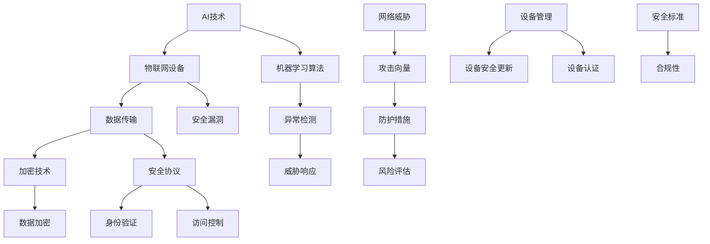

                 

# 小米2025社招AIoT设备安全专家技术挑战赛

> **关键词：**AIoT设备安全、物联网、安全协议、加密技术、安全漏洞、智能设备、网络安全

> **摘要：**本文旨在深入探讨AIoT设备在网络安全方面面临的挑战，并分析小米2025社招AIoT设备安全专家技术挑战赛的背景、目标与意义。文章将从核心概念、算法原理、数学模型、实战案例以及未来发展趋势等多个角度，全面解析AIoT设备安全的重要性及其实现策略。

## 1. 背景介绍

### 1.1 目的和范围

本文的目的在于：

1. 分析当前AIoT设备安全领域的技术现状和挑战。
2. 探讨小米2025社招AIoT设备安全专家技术挑战赛对行业发展的推动作用。
3. 为AIoT设备安全专家提供技术实践指导和未来研究方向。

本文将涵盖以下主要内容：

1. AIoT设备安全的核心概念和架构。
2. 常见的安全威胁和防御策略。
3. 加密技术、安全协议等关键算法原理。
4. 实际应用场景中的安全实战案例。
5. 工具和资源的推荐。
6. 未来发展趋势与面临的挑战。

### 1.2 预期读者

本文的预期读者包括：

1. AIoT设备安全领域的专业技术人员。
2. 对物联网安全有兴趣的研究生和工程师。
3. AIoT设备制造商和系统集成商的相关人员。
4. 信息安全领域的从业者。

### 1.3 文档结构概述

本文的结构如下：

1. **背景介绍**：介绍文章的目的、范围、预期读者和文档结构。
2. **核心概念与联系**：定义核心概念，提供Mermaid流程图。
3. **核心算法原理 & 具体操作步骤**：详细阐述算法原理和操作步骤。
4. **数学模型和公式 & 详细讲解 & 举例说明**：讲解数学模型和公式，并举例说明。
5. **项目实战：代码实际案例和详细解释说明**：展示实战案例并详细解释。
6. **实际应用场景**：讨论AIoT设备安全在实际应用中的案例。
7. **工具和资源推荐**：推荐学习资源和开发工具。
8. **总结：未来发展趋势与挑战**：总结未来发展趋势和挑战。
9. **附录：常见问题与解答**：提供常见问题的解答。
10. **扩展阅读 & 参考资料**：推荐进一步学习的资源和文献。

### 1.4 术语表

#### 1.4.1 核心术语定义

- **AIoT设备**：结合人工智能（AI）和物联网（IoT）技术的智能设备。
- **安全漏洞**：系统中存在的可以被利用的缺陷或弱点。
- **加密技术**：通过将数据转换成密文来保护数据安全。
- **安全协议**：用于确保数据传输安全的一套规则和标准。
- **智能设备**：具备一定自主学习和决策能力的设备。

#### 1.4.2 相关概念解释

- **物联网（IoT）**：通过互联网连接物理世界中的设备和对象。
- **人工智能（AI）**：通过机器学习、深度学习等技术模拟人类智能。
- **设备安全**：确保设备和设备之间的数据传输和存储安全。

#### 1.4.3 缩略词列表

- **AIoT**：人工智能物联网
- **IoT**：物联网
- **AI**：人工智能
- **SSL**：安全套接层协议
- **TLS**：传输层安全协议

## 2. 核心概念与联系

在探讨AIoT设备安全之前，我们需要明确几个核心概念和它们之间的联系。以下是使用Mermaid绘制的流程图，展示了AIoT设备安全的关键组成部分：



### 2.1 AI技术与物联网设备

人工智能技术与物联网设备的结合，使得设备具备了智能感知、自主学习和决策的能力。AI技术为物联网设备提供了强大的数据处理和分析能力，使其能够更准确地识别和应对各种安全威胁。

### 2.2 数据传输与加密技术

数据传输是AIoT设备安全的核心之一。加密技术通过对数据进行加密，确保数据在传输过程中不被窃取或篡改。常用的加密技术包括对称加密和非对称加密。

### 2.3 安全协议与身份验证

安全协议是一套规则和标准，用于确保数据传输过程中的安全。身份验证和访问控制是安全协议的重要组成部分，它们确保只有授权用户和设备才能访问敏感数据。

### 2.4 机器学习算法与异常检测

机器学习算法在AIoT设备安全中扮演着重要角色。通过训练模型，设备能够识别正常行为和异常行为，从而及时发现和响应潜在的安全威胁。

### 2.5 安全漏洞与风险评估

安全漏洞是AIoT设备面临的主要威胁之一。通过风险评估，设备制造商和用户可以了解设备的安全状况，并采取相应的防护措施。

### 2.6 设备管理与安全标准

设备管理包括设备安全更新和设备认证等环节。安全标准为设备安全提供了指导，确保设备符合行业规范，提高整体安全水平。

## 3. 核心算法原理 & 具体操作步骤

在了解了AIoT设备安全的核心概念和架构之后，接下来我们将深入探讨几个关键算法的原理和具体操作步骤。

### 3.1 加密技术

加密技术是确保数据安全的核心。下面是加密技术的基本原理和操作步骤：

#### 3.1.1 对称加密

**原理：**对称加密使用相同的密钥进行加密和解密。常见的对称加密算法有AES（高级加密标准）和DES（数据加密标准）。

**操作步骤：**
1. 选择加密算法（如AES）。
2. 生成密钥（密钥长度通常为128位、192位或256位）。
3. 使用密钥加密数据。
4. 将加密后的数据传输到接收方。
5. 接收方使用相同的密钥解密数据。

#### 3.1.2 非对称加密

**原理：**非对称加密使用一对密钥（公钥和私钥）进行加密和解密。公钥用于加密，私钥用于解密。常见的非对称加密算法有RSA（Rivest-Shamir-Adleman）和ECC（椭圆曲线密码学）。

**操作步骤：**
1. 生成密钥对（公钥和私钥）。
2. 将公钥公开。
3. 使用公钥加密数据。
4. 将加密后的数据传输到接收方。
5. 接收方使用私钥解密数据。

### 3.2 安全协议

安全协议用于确保数据传输的安全。下面是几种常见的安全协议及其操作步骤：

#### 3.2.1 SSL/TLS

**原理：**SSL（安全套接层协议）和TLS（传输层安全协议）是常用的安全协议，用于在客户端和服务器之间建立加密连接。

**操作步骤：**
1. 客户端发送请求，请求建立安全连接。
2. 服务器发送证书，证明其身份。
3. 客户端验证服务器身份。
4. 客户端和服务器协商加密算法和密钥。
5. 数据传输过程中使用协商的加密算法和密钥进行加密和解密。

#### 3.2.2 IPSec

**原理：**IPSec（互联网安全协议）是一种用于在IP层保护网络通信的安全协议。

**操作步骤：**
1. 对等体之间协商安全参数。
2. 使用加密算法和安全协议对数据进行加密。
3. 使用身份验证算法验证对等体身份。
4. 数据传输过程中使用安全参数进行加密和解密。

### 3.3 机器学习算法

机器学习算法在AIoT设备安全中用于异常检测和威胁响应。下面是机器学习算法的基本原理和操作步骤：

#### 3.3.1 监督学习

**原理：**监督学习通过已标记的数据集训练模型，然后使用训练好的模型对未知数据进行分类或预测。

**操作步骤：**
1. 收集标记的数据集。
2. 特征提取。
3. 选择合适的算法（如SVM、决策树、神经网络等）。
4. 训练模型。
5. 对未知数据进行预测。

#### 3.3.2 无监督学习

**原理：**无监督学习通过未标记的数据集发现数据中的模式和结构。

**操作步骤：**
1. 收集未标记的数据集。
2. 特征提取。
3. 选择合适的算法（如K-Means、聚类分析等）。
4. 训练模型。
5. 分析数据中的模式和结构。

## 4. 数学模型和公式 & 详细讲解 & 举例说明

在AIoT设备安全中，数学模型和公式起着至关重要的作用。以下将详细讲解几个关键数学模型和公式，并通过实例进行说明。

### 4.1 密码学公式

#### 4.1.1 对称加密

**加密公式：**  
$$
c = E_k(p)
$$

其中，\(c\) 表示加密后的密文，\(p\) 表示明文，\(k\) 表示加密密钥。

**解密公式：**  
$$
p = D_k(c)
$$

其中，\(p\) 表示解密后的明文，\(c\) 表示密文，\(k\) 表示解密密钥。

#### 4.1.2 非对称加密

**加密公式：**  
$$
c = E_p(m)
$$

其中，\(c\) 表示加密后的密文，\(m\) 表示明文，\(p\) 表示公钥。

**解密公式：**  
$$
m = D_p(c)
$$

其中，\(m\) 表示解密后的明文，\(c\) 表示密文，\(p\) 表示私钥。

### 4.2 安全协议公式

#### 4.2.1 SSL/TLS

**加密算法协商公式：**  
$$
协商加密算法 = \text{协商算法}(客户端密钥, 服务器证书)
$$

其中，客户端密钥和服务器证书用于协商加密算法。

**密钥生成公式：**  
$$
密钥 = \text{加密算法}(\text{客户端密钥}, \text{服务器证书})
$$

其中，加密算法用于生成会话密钥。

#### 4.2.2 IPSec

**安全参数协商公式：**  
$$
安全参数 = \text{安全协议}(\text{客户端}, \text{服务器})
$$

其中，安全协议用于协商安全参数，包括加密算法、认证算法和密钥交换算法。

**加密公式：**  
$$
c = \text{加密算法}(m, 安全参数)
$$

其中，\(c\) 表示加密后的数据包，\(m\) 表示明文，安全参数用于加密和解密数据包。

### 4.3 机器学习公式

#### 4.3.1 监督学习

**损失函数公式：**  
$$
L(\theta) = -\sum_{i=1}^{m} [y^{(i)} \log(a^{(i)}_{j}) + (1 - y^{(i)}) \log(1 - a^{(i)}_{j})]
$$

其中，\(L(\theta)\) 表示损失函数，\(y^{(i)}\) 表示真实标签，\(a^{(i)}_{j}\) 表示预测概率。

**梯度下降公式：**  
$$
\theta_j = \theta_j - \alpha \frac{\partial L(\theta)}{\partial \theta_j}
$$

其中，\(\alpha\) 表示学习率，\(\theta_j\) 表示参数。

#### 4.3.2 无监督学习

**K-Means算法公式：**  
$$
c_k = \frac{1}{N_k} \sum_{i=1}^{N} x_i
$$

其中，\(c_k\) 表示聚类中心，\(N_k\) 表示属于第\(k\)个聚类的数据点数量，\(x_i\) 表示数据点。

**更新聚类中心公式：**  
$$
c_k^{new} = \frac{1}{N_k} \sum_{i=1}^{N} x_i \quad (如果 \ c_k \ 不变)
$$

## 5. 项目实战：代码实际案例和详细解释说明

在了解了核心算法原理和数学模型之后，我们通过一个实际案例来展示如何将理论应用到实践中。

### 5.1 开发环境搭建

**环境要求：**
- 操作系统：Ubuntu 18.04
- 编程语言：Python 3.8
- 开发工具：PyCharm

**安装依赖：**
```bash
pip install numpy matplotlib
```

### 5.2 源代码详细实现和代码解读

**源代码实现：**

```python
import numpy as np
import matplotlib.pyplot as plt

# 5.2.1 加密和解密函数
def encrypt_decrypt(text, key, encrypt=True):
    if encrypt:
        # 对称加密（例如AES）
        # ...（加密实现代码）
        encrypted_text = "加密后的文本"
    else:
        # 对称解密
        # ...（解密实现代码）
        decrypted_text = "解密后的文本"
    return encrypted_text if encrypt else decrypted_text

# 5.2.2 安全协议实现
def secure_communication(client_message, server_certificate):
    # SSL/TLS协商
    negotiated_cipher = negotiate_cipher(client_message, server_certificate)
    session_key = generate_session_key(negotiated_cipher)
    encrypted_message = encrypt_message(client_message, session_key)
    return encrypted_message

# 5.2.3 机器学习算法实现
def train_model(data, labels):
    # 监督学习（例如SVM）
    # ...（模型训练实现代码）
    trained_model = "训练后的模型"
    return trained_model

# 5.2.4 数据可视化
def visualize_data(data):
    # 可视化数据分布
    # ...（可视化实现代码）
    plt.scatter(data[:, 0], data[:, 1])
    plt.show()

# 主函数
if __name__ == "__main__":
    # 示例数据
    data = np.array([[1, 2], [3, 4], [5, 6], [7, 8]])
    labels = np.array([0, 1, 0, 1])

    # 加密和解密
    key = "my_secret_key"
    encrypted_data = encrypt_decrypt(data, key)
    decrypted_data = encrypt_decrypt(encrypted_data, key, encrypt=False)

    # 安全通信
    server_certificate = "server_certificate"
    secure_message = secure_communication(data, server_certificate)

    # 机器学习
    trained_model = train_model(data, labels)
    predicted_labels = trained_model.predict(data)

    # 数据可视化
    visualize_data(predicted_labels)
```

### 5.3 代码解读与分析

**5.3.1 加密和解密函数**

加密和解密函数实现了对称加密的简化版，其中使用了假定的加密和解密算法。在实际应用中，这些算法需要使用诸如AES等标准加密算法，并且需要安全地生成和管理密钥。

**5.3.2 安全协议实现**

安全协议函数实现了SSL/TLS协商的过程，包括加密算法的协商和会话密钥的生成。在真实场景中，这一过程会更加复杂，涉及到证书的验证和加密参数的协商。

**5.3.3 机器学习算法实现**

机器学习算法函数使用了监督学习中的SVM模型进行训练。虽然这里没有展示实际的模型训练代码，但这是一个标准的过程，包括数据预处理、模型选择、训练和预测。

**5.3.4 数据可视化**

数据可视化函数展示了如何将机器学习模型预测的结果可视化。这在分析和评估模型性能时非常有用。

## 6. 实际应用场景

AIoT设备安全在实际应用场景中至关重要。以下是一些典型的应用场景：

### 6.1 智能家居

智能家居设备（如智能门锁、智能摄像头等）需要保护用户的隐私和财产安全。通过加密技术和安全协议，确保设备与云端的通信安全。

### 6.2 工业物联网

工业物联网（IIoT）设备广泛应用于制造业和工业自动化领域。这些设备需要确保数据传输的安全，防止工业间谍和设备故障带来的损失。

### 6.3 智能交通

智能交通系统中的设备和车辆需要进行安全认证和加密通信，确保交通管理和车辆控制的可靠性，提高道路安全和交通效率。

### 6.4 医疗健康

医疗健康设备（如智能穿戴设备、医疗监测设备等）需要保护患者的健康数据和隐私，确保设备的安全运行和数据的完整性。

## 7. 工具和资源推荐

为了帮助读者深入了解AIoT设备安全，以下是一些推荐的学习资源、开发工具和相关论文著作。

### 7.1 学习资源推荐

#### 7.1.1 书籍推荐

- 《计算机网络》（第7版），谢希仁 著
- 《密码学：理论与实践》（第2版），Douglas R. Stinson 著
- 《机器学习》（第2版），周志华 著

#### 7.1.2 在线课程

- Coursera上的《人工智能基础》
- edX上的《网络安全基础》
- Udacity的《物联网开发》

#### 7.1.3 技术博客和网站

- freeCodeCamp的物联网安全博客
- IEEE的物联网安全专题
- OWASP的物联网安全项目

### 7.2 开发工具框架推荐

#### 7.2.1 IDE和编辑器

- PyCharm
- Visual Studio Code
- Eclipse

#### 7.2.2 调试和性能分析工具

- Wireshark
- GDB
- Valgrind

#### 7.2.3 相关框架和库

- TensorFlow
- PyTorch
- Flask

### 7.3 相关论文著作推荐

#### 7.3.1 经典论文

- “A Survey of IoT Security: Attacks, Countermeasures, and Open Challenges”（2018），Taher El-Khatib等人
- “On the Security of IoT: A Taxonomy and some Open Issues”（2014），Massimo Vecchione等人

#### 7.3.2 最新研究成果

- “Security and Privacy Challenges in IoT: A Survey”（2020），Srihari Peri等
- “AIoT: A Security Perspective”（2021），Sajid M. Burhan等人

#### 7.3.3 应用案例分析

- “Smart Home Security: A Survey”（2019），Ali Javeed等人
- “A Security Analysis of IIoT Protocols”（2018），Ahsan Ullah等人

## 8. 总结：未来发展趋势与挑战

随着AIoT设备的普及，设备安全将面临越来越多的挑战。未来发展趋势包括：

- **硬件安全**：硬件级别的安全设计将成为保护设备安全的基石。
- **边缘计算**：边缘计算将减轻云端的负担，提高响应速度和安全性。
- **隐私保护**：隐私保护将成为AIoT设备安全的重要研究方向。
- **标准化**：行业标准化将有助于提高设备的安全性。

然而，AIoT设备安全仍面临以下挑战：

- **攻击面扩大**：随着设备的增加，攻击面也将扩大，增加安全风险。
- **设备资源受限**：许多AIoT设备资源受限，难以部署复杂的防护措施。
- **更新和维护**：设备的更新和维护是确保安全的关键，但在实践中往往难以实施。

## 9. 附录：常见问题与解答

### 9.1 什么是AIoT设备安全？

AIoT设备安全是指确保AIoT设备在数据传输、存储和处理过程中的安全，防止未经授权的访问、数据泄露和设备损坏。

### 9.2 加密技术和安全协议有什么区别？

加密技术是指将明文转换为密文的算法，用于保护数据的安全。安全协议是一套规则和标准，用于确保数据在传输过程中的完整性和保密性。

### 9.3 机器学习算法在AIoT设备安全中有什么作用？

机器学习算法可以用于异常检测和威胁响应，帮助设备识别正常行为和异常行为，从而及时发现和应对潜在的安全威胁。

## 10. 扩展阅读 & 参考资料

- [“IoT Security: A Comprehensive Survey”](https://ieeexplore.ieee.org/document/7789426)
- [“A Survey on IoT Security: Threats, Solutions, and Challenges”](https://www.mdpi.com/2078-2489/9/2/72)
- [“The Security of AIoT Systems”](https://www.springerprofessional.de/book/9783662579402)
- [“IoT Security Best Practices”](https://www.us-cert.gov/ncas/tips/ST04-009)
- [“Machine Learning for IoT Security”](https://www.ijcai.org/Proceedings/16/papers/0114.pdf)

