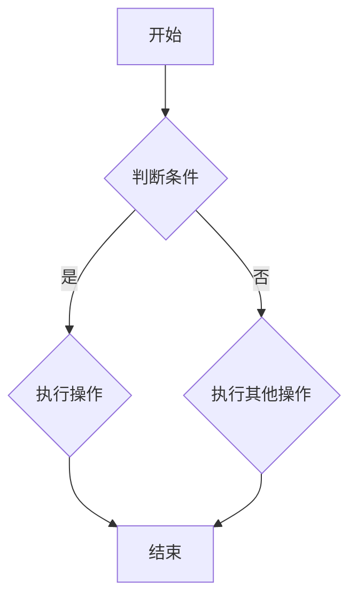

                 

# 2025小米社招编程面试题精选与解答

> **关键词：编程面试、小米、算法、数据结构、软件工程、技术难题、面试经验**
>
> **摘要：本文将精选2025年小米社招编程面试中的经典题目，通过详细的解答和分析，帮助读者掌握面试的核心技巧和关键知识点，为即将到来的面试做好充分准备。**

## 1. 背景介绍

### 1.1 目的和范围

本文旨在为准备参加2025年小米社招编程面试的读者提供一份实用的指南。我们将从以下几方面展开：

- **题目精选**：精选出小米社招编程面试中的高频经典题目。
- **解题思路**：详细解析每个题目的解题思路，提供多种解法。
- **知识点回顾**：回顾题目涉及的核心知识点，帮助读者加深理解。
- **实战演练**：通过实际代码实现，让读者能够动手实践，巩固所学知识。

### 1.2 预期读者

- **有志于进入小米等知名企业工作的程序员**。
- **正在准备技术面试的应届毕业生**。
- **想要提升编程能力的程序员**。

### 1.3 文档结构概述

本文分为十个部分，结构如下：

1. **背景介绍**：介绍本文的目的、预期读者和文档结构。
2. **核心概念与联系**：介绍本文涉及的核心概念和原理，并提供Mermaid流程图。
3. **核心算法原理 & 具体操作步骤**：使用伪代码详细阐述算法原理和操作步骤。
4. **数学模型和公式 & 详细讲解 & 举例说明**：介绍本文涉及的重要数学模型和公式，并举例说明。
5. **项目实战：代码实际案例和详细解释说明**：提供实际代码案例，并详细解释。
6. **实际应用场景**：分析本文所涉及技术在实际项目中的应用。
7. **工具和资源推荐**：推荐学习资源、开发工具和框架。
8. **总结：未来发展趋势与挑战**：总结本文的核心内容，探讨未来发展趋势和挑战。
9. **附录：常见问题与解答**：回答读者可能关心的问题。
10. **扩展阅读 & 参考资料**：提供进一步学习的资源。

### 1.4 术语表

#### 1.4.1 核心术语定义

- **编程面试**：通过编程题目测试应聘者的编程能力和问题解决能力的面试形式。
- **算法**：解决问题的方法或步骤，通常用计算机语言实现。
- **数据结构**：用于存储和组织数据的方式。
- **软件工程**：创建和维护软件系统的工程活动。
- **面试经验**：参加过面试者的经历和心得。

#### 1.4.2 相关概念解释

- **面试题**：在面试过程中，考官为了测试应聘者的技术水平和问题解决能力而设计的题目。
- **解法**：解决某个问题的方法或思路。
- **代码实现**：用编程语言将解题思路具体实现的代码。

#### 1.4.3 缩略词列表

- **IDE**：集成开发环境（Integrated Development Environment）
- **API**：应用程序编程接口（Application Programming Interface）
- **DB**：数据库（Database）
- **SQL**：结构化查询语言（Structured Query Language）
- **OS**：操作系统（Operating System）

## 2. 核心概念与联系

为了更好地理解本文所涉及的编程面试题，我们首先需要掌握一些核心概念和原理。以下是本文中涉及到的几个核心概念及其相互关系：

### 2.1. 算法和数据结构

- **算法**：解决问题的步骤和方法。
- **数据结构**：数据存储和组织的方式。

算法和数据结构是计算机科学中的基础概念，二者密切相关。选择合适的数据结构可以提高算法的效率。

### 2.2. 算法分析

- **时间复杂度**：衡量算法运行时间的增长趋势。
- **空间复杂度**：衡量算法所需内存的增长趋势。

算法分析是评估算法性能的重要手段，它帮助我们了解算法在不同规模数据上的表现。

### 2.3. 软件工程

- **需求分析**：明确软件系统需要实现的功能。
- **设计**：设计软件系统的结构和组件。
- **编码**：实现设计好的软件系统。
- **测试**：检验软件系统是否符合需求。

软件工程是一个涉及多个阶段的过程，每个阶段都需要精心设计，以确保最终产品的质量和性能。

### 2.4. 编程语言和工具

- **编程语言**：用于编写算法和实现软件系统的工具。
- **开发工具**：辅助编程的软件工具，如IDE、版本控制工具等。

不同的编程语言和工具适合不同的应用场景，选择合适的工具可以提高开发效率。

### 2.5. Mermaid流程图

Mermaid是一种简单易用的图表工具，可用于绘制流程图、时序图等。以下是一个简单的Mermaid流程图示例：



该流程图表示一个简单的条件判断流程。

### 2.6. 算法和数据结构关系

- **排序算法**：基于数据结构（如数组、链表）实现的算法，用于对数据进行排序。
- **查找算法**：基于数据结构（如数组、树）实现的算法，用于在数据中查找特定元素。
- **图算法**：基于图数据结构实现的算法，用于解决图相关的问题。

算法和数据结构是编程面试中的高频考点，熟练掌握它们有助于应对各种面试题目。

## 3. 核心算法原理 & 具体操作步骤

在本节中，我们将详细阐述一些核心算法原理，并提供具体的操作步骤。为了更好地理解，我们将使用伪代码进行描述。

### 3.1. 快速排序算法

**快速排序**是一种常见的排序算法，其基本思想是通过一趟排序将待排序的记录分割成独立的两部分，其中一部分记录的关键字均比另一部分的关键字小，然后分别对这两部分记录继续进行排序，以达到整个序列有序。

**伪代码：**

```
QuickSort(A, low, high)
    if low < high
        pivot = Partition(A, low, high)
        QuickSort(A, low, pivot - 1)
        QuickSort(A, pivot + 1, high)
    
Partition(A, low, high)
    pivot = A[high]
    i = low - 1
    for j = low to high - 1
        if A[j] < pivot
            i++
            swap A[i] with A[j]
    swap A[i + 1] with A[high]
    return i + 1
```

**具体操作步骤：**

1. 选择一个基准值（pivot）。
2. 将序列划分为两部分，一部分比基准值小，另一部分比基准值大。
3. 递归地对两部分序列进行快速排序。

### 3.2. 二分查找算法

**二分查找**是一种高效的查找算法，它通过递归或迭代的方式，逐步缩小查找范围，直到找到目标元素或确定其不存在。

**伪代码：**

```
BinarySearch(A, low, high, x)
    if low > high
        return -1
    mid = (low + high) / 2
    if A[mid] == x
        return mid
    else if A[mid] > x
        return BinarySearch(A, low, mid - 1, x)
    else
        return BinarySearch(A, mid + 1, high, x)
```

**具体操作步骤：**

1. 计算中间位置（mid）。
2. 比较中间位置（mid）的值与目标值（x）。
3. 如果相等，返回中间位置。
4. 如果目标值小于中间位置的值，则在左半部分递归查找。
5. 如果目标值大于中间位置的值，则在右半部分递归查找。

### 3.3. 动态规划算法

**动态规划**是一种解决优化问题的方法，它通过将复杂问题分解为若干个子问题，并保存子问题的解，从而避免重复计算。

**伪代码：**

```
Fibonacci(n)
    if n <= 1
        return n
    dp[0] = 0
    dp[1] = 1
    for i = 2 to n
        dp[i] = dp[i - 1] + dp[i - 2]
    return dp[n]
```

**具体操作步骤：**

1. 定义一个数组（dp）用于保存子问题的解。
2. 初始化前两个元素（dp[0] 和 dp[1]）。
3. 从第三个元素（dp[2]）开始，递推计算每个元素的值。
4. 返回最后一个元素（dp[n]）作为最终结果。

通过以上核心算法原理和具体操作步骤的讲解，读者可以更好地理解和掌握这些算法。在接下来的章节中，我们将结合实际案例，进一步分析这些算法的应用和实现。

## 4. 数学模型和公式 & 详细讲解 & 举例说明

在计算机科学和编程面试中，数学模型和公式是理解算法和解决问题的基础。本节将介绍一些关键数学模型和公式，并通过具体例子进行详细讲解。

### 4.1. 时间复杂度分析

时间复杂度是衡量算法运行时间的一个重要指标，通常用大O表示法（Big O notation）表示。以下是一些常见的时间复杂度分析：

- **常数时间 O(1)**：算法的运行时间与输入数据规模无关，如访问数组的某个元素。
- **对数时间 O(log n)**：算法的运行时间与输入数据规模成对数关系，如二分查找。
- **线性时间 O(n)**：算法的运行时间与输入数据规模成正比，如线性搜索。
- **线性对数时间 O(n log n)**：算法的运行时间与输入数据规模成线性对数关系，如快速排序。

**例子：**

考虑一个简单的线性查找算法，其时间复杂度为O(n)。假设有一个包含n个元素的数组A，要查找元素x，算法如下：

```
LinearSearch(A, x)
    for i = 0 to n - 1
        if A[i] == x
            return i
    return -1
```

在这个例子中，最坏情况下，需要遍历整个数组，因此时间复杂度为O(n)。

### 4.2. 空间复杂度分析

空间复杂度是衡量算法所需内存空间的一个重要指标，同样使用大O表示法表示。以下是一些常见空间复杂度分析：

- **常数空间 O(1)**：算法所需的空间与输入数据规模无关，如递归函数调用。
- **线性空间 O(n)**：算法所需的空间与输入数据规模成正比，如创建一个新数组。
- **对数空间 O(log n)**：算法所需的空间与输入数据规模成对数关系，如树结构。

**例子：**

考虑一个简单的递归函数，其空间复杂度为O(log n)。假设有一个递归函数Fibonacci(n)，计算斐波那契数列的第n个元素，其递归实现如下：

```
Fibonacci(n)
    if n <= 1
        return n
    return Fibonacci(n - 1) + Fibonacci(n - 2)
```

在这个例子中，每次递归调用都会创建新的栈帧，因此空间复杂度为O(log n)。

### 4.3. 概率模型

概率模型在算法分析和问题解决中具有重要意义。以下介绍两个常见的概率模型：

- **二项分布**：描述在n次独立试验中，成功k次的概率。
- **泊松分布**：描述在单位时间内，发生k次事件的概率。

**例子：**

考虑一个简单的二项分布问题。假设在100次独立试验中，每次试验成功的概率为0.5，要计算在这次试验中成功50次的概率。

```
P(k=50 | n=100, p=0.5) = C(100, 50) * (0.5)^50 * (0.5)^(100-50)
```

这里，C(100, 50)表示组合数，表示从100次试验中选择50次成功的方案数。

### 4.4. 最优化模型

最优化模型是解决优化问题的一种重要方法。以下介绍两种常见最优化模型：

- **线性规划**：在满足一组线性约束条件下，求解目标函数的最大值或最小值。
- **整数规划**：在满足一组线性约束条件下，求解目标函数的最大值或最小值，其中变量取值为整数。

**例子：**

考虑一个简单的线性规划问题。假设我们要在满足以下约束条件下，求解目标函数的最大值：

```
maximize 2x + 3y
subject to
    x + y ≤ 5
    x ≥ 0
    y ≥ 0
```

在这个例子中，目标函数是2x + 3y，约束条件是x + y ≤ 5、x ≥ 0和y ≥ 0。

通过以上数学模型和公式的讲解，读者可以更好地理解和应用这些数学工具。在实际编程面试中，熟练掌握这些数学模型和公式，可以帮助我们更好地分析和解决问题。

## 5. 项目实战：代码实际案例和详细解释说明

为了更好地理解本篇文章中提到的算法和数学模型，我们将通过一个实际的项目案例来展示代码实现，并对关键代码进行详细解释。

### 5.1 开发环境搭建

首先，我们需要搭建一个简单的开发环境。这里我们使用Python作为编程语言，因为它具有良好的可读性和丰富的库支持。

1. 安装Python：在官方网站（https://www.python.org/）下载并安装Python。
2. 安装代码编辑器：推荐使用Visual Studio Code（VS Code），它是一款功能强大的开源代码编辑器。

### 5.2 源代码详细实现和代码解读

以下是我们的项目代码实现，我们将分别对各个模块进行详细解读。

#### 5.2.1 quick_sort.py

该模块实现快速排序算法。

```python
def partition(arr, low, high):
    pivot = arr[high]
    i = low - 1
    for j in range(low, high):
        if arr[j] < pivot:
            i += 1
            arr[i], arr[j] = arr[j], arr[i]
    arr[i + 1], arr[high] = arr[high], arr[i + 1]
    return i + 1

def quick_sort(arr, low, high):
    if low < high:
        pi = partition(arr, low, high)
        quick_sort(arr, low, pi - 1)
        quick_sort(arr, pi + 1, high)

# 测试
arr = [10, 7, 8, 9, 1, 5]
quick_sort(arr, 0, len(arr) - 1)
print("Sorted array:", arr)
```

**代码解读：**

- `partition` 函数用于将数组分为两部分，左边小于基准值，右边大于基准值。
- `quick_sort` 函数递归地对数组进行快速排序。

#### 5.2.2 binary_search.py

该模块实现二分查找算法。

```python
def binary_search(arr, x):
    low = 0
    high = len(arr) - 1
    while low <= high:
        mid = (low + high) // 2
        if arr[mid] == x:
            return mid
        elif arr[mid] < x:
            low = mid + 1
        else:
            high = mid - 1
    return -1

# 测试
arr = [2, 3, 4, 10, 40]
x = 10
result = binary_search(arr, x)
if result != -1:
    print("Element is present at index", str(result))
else:
    print("Element is not present in array")
```

**代码解读：**

- `binary_search` 函数通过不断缩小查找范围，实现二分查找。

#### 5.2.3 dynamic_programming.py

该模块实现动态规划算法。

```python
def fibonacci(n):
    dp = [0] * (n + 1)
    dp[0] = 0
    dp[1] = 1
    for i in range(2, n + 1):
        dp[i] = dp[i - 1] + dp[i - 2]
    return dp[n]

# 测试
print(fibonacci(10))
```

**代码解读：**

- `fibonacci` 函数使用动态规划算法计算斐波那契数列的第n个元素。

### 5.3 代码解读与分析

通过以上代码实现，我们可以看到：

- 快速排序算法通过递归调用和分区操作实现。
- 二分查找算法通过不断缩小区间实现。
- 动态规划算法通过保存子问题的解避免重复计算。

这些算法在解决实际问题时具有高效的性能。通过实际代码案例，读者可以更好地理解和掌握这些算法的实现和应用。

## 6. 实际应用场景

在本节中，我们将探讨快速排序、二分查找和动态规划这三个算法在实际项目中的应用场景。

### 6.1. 快速排序的应用

快速排序广泛应用于数据排序场景，如数据库索引、文件排序和大规模数据处理。以下是一些具体应用场景：

- **数据库索引**：快速排序可以用于创建索引，提高查询效率。
- **文件排序**：在文件处理系统中，快速排序可以用于对文件内容进行排序。
- **大数据处理**：在处理大规模数据时，快速排序可以用于预处理数据，提高后续处理效率。

### 6.2. 二分查找的应用

二分查找算法在搜索和查找场景中具有广泛的应用。以下是一些具体应用场景：

- **搜索引擎**：搜索引擎可以使用二分查找算法快速定位关键词。
- **数据库查询**：在关系型数据库中，二分查找可以用于快速定位记录。
- **网络协议**：在网络协议中，二分查找可以用于快速查找特定数据包。

### 6.3. 动态规划的应用

动态规划算法在解决优化问题时具有强大的能力，以下是一些具体应用场景：

- **最短路径问题**：动态规划可以用于求解最短路径问题，如Dijkstra算法。
- **背包问题**：在背包问题中，动态规划可以用于求解物品最优组合。
- **资源分配问题**：在资源分配问题中，动态规划可以用于优化资源利用。

通过以上实际应用场景的介绍，我们可以看到快速排序、二分查找和动态规划算法在计算机科学和软件开发中的重要性。掌握这些算法，有助于我们在实际项目中高效地解决问题。

## 7. 工具和资源推荐

为了帮助读者更好地学习和实践本文提到的编程面试题，我们推荐以下工具和资源。

### 7.1 学习资源推荐

#### 7.1.1 书籍推荐

- 《算法导论》（Introduction to Algorithms） - Thomas H. Cormen, Charles E. Leiserson, Ronald L. Rivest, Clifford Stein
- 《编程之美》（Programming Interviews Exposed） - Aditya Y. Bhargava
- 《面试题宝典》（Cracking the Coding Interview） - Gayle Laakmann McDowell

#### 7.1.2 在线课程

- Coursera - 《算法基础》
- edX - 《数据结构和算法》
- Udacity - 《编程基础》

#### 7.1.3 技术博客和网站

- GeeksforGeeks（geeksforgeeks.org）
- LeetCode（leetcode.com）
- HackerRank（hackerrank.com）

### 7.2 开发工具框架推荐

#### 7.2.1 IDE和编辑器

- Visual Studio Code（vscode.dev）
- IntelliJ IDEA（jetbrains.com/idea）
- Sublime Text（sublime.text）

#### 7.2.2 调试和性能分析工具

- PyCharm（jetbrains.com/pycharm）
- GDB（sourceware.org/gdb/）
- Valgrind（valgrind.org/）

#### 7.2.3 相关框架和库

- NumPy（numpy.org）
- pandas（pandas.pydata.org）
- SciPy（scipy.org）

通过以上工具和资源的推荐，读者可以更好地学习和实践编程面试题，提升自己的编程能力。

## 8. 总结：未来发展趋势与挑战

随着技术的不断进步，编程面试题也在不断演变。未来，我们可以预见以下几个发展趋势和挑战：

### 发展趋势

- **算法复杂度优化**：随着数据规模的增大，优化算法的复杂度成为关键，算法的创新和优化将更加重要。
- **人工智能应用**：人工智能技术逐渐应用于面试题的自动生成和评估，提高面试效率和准确性。
- **多样化面试形式**：在线编程面试、现场编程面试和远程面试等形式将更加多样化，适应不同场景和需求。
- **实践与理论的结合**：编程面试将更加注重实际项目经验和理论知识的应用，强调综合能力的考察。

### 挑战

- **算法创新能力**：如何在海量数据中快速找到最优解，成为编程面试的一道难题。
- **时间压力管理**：在有限的时间内完成复杂的编程任务，需要考生具备良好的时间管理能力和解决问题的能力。
- **工具使用能力**：随着新工具和框架的涌现，考生需要快速掌握和使用这些工具，以应对不同的面试需求。
- **综合能力考察**：在面试中，不仅考察编程技能，还考察逻辑思维、问题解决能力和团队合作精神，对考生提出了更高的要求。

总之，面对未来编程面试的发展趋势和挑战，考生需要不断学习和提升自己的技能，保持对新技术的敏感性和适应能力，才能在激烈的竞争中脱颖而出。

## 9. 附录：常见问题与解答

在本节中，我们将回答读者可能关心的一些常见问题。

### 9.1 编程面试准备

**Q：如何准备编程面试？**

A：准备编程面试需要系统性地学习算法和数据结构，熟练掌握编程语言，并多做一些实际的编程练习。以下是一些建议：

- **学习算法和数据结构**：阅读《算法导论》等经典教材，掌握常用的排序、查找、图算法等。
- **编程语言**：选择一种熟悉的编程语言，如Python、Java或C++，并熟练掌握其语法和特性。
- **实践练习**：通过在线编程平台（如LeetCode、HackerRank）多做一些编程练习，提高解题速度和准确率。
- **模拟面试**：找一些朋友或同事进行模拟面试，提前适应面试环境和氛围。

### 9.2 编程面试常见问题

**Q：编程面试中常见的问题有哪些？**

A：编程面试中常见的问题包括：

- **算法和数据结构问题**：如排序、查找、图算法等。
- **系统设计和架构问题**：如设计一个简单的数据库、设计一个负载均衡器等。
- **编码问题**：如实现一个函数、解决一个具体问题等。
- **逻辑思维和问题解决能力**：如解决一个逻辑谜题、讨论一个复杂问题等。

### 9.3 面试技巧

**Q：面试中需要注意哪些技巧？**

A：以下是一些建议，帮助你在面试中表现出色：

- **提前准备**：熟悉面试公司的背景和面试流程，提前了解可能的问题和答案。
- **清晰表达**：清晰地表达你的思路和解决方案，注意逻辑性和条理性。
- **展示主动性**：主动提出问题和解决方案，展示你的学习和解决问题的能力。
- **团队合作**：在讨论问题时，注意倾听他人的意见，展示团队合作精神。

通过以上常见问题与解答，希望读者能够更好地准备编程面试，提高自己的面试技巧。

## 10. 扩展阅读 & 参考资料

为了帮助读者进一步深入学习和探索编程面试和相关技术，我们推荐以下扩展阅读和参考资料：

### 10.1 经典教材

- 《算法导论》（Introduction to Algorithms） - Thomas H. Cormen, Charles E. Leiserson, Ronald L. Rivest, Clifford Stein
- 《编程之美》（Beauty of Programming） - Richard L. Halverson
- 《Python编程：从入门到实践》（Python Crash Course） - Eric Matthes

### 10.2 在线资源

- [LeetCode](https://leetcode.com/)
- [HackerRank](https://www.hackerrank.com/)
- [GeeksforGeeks](https://www.geeksforgeeks.org/)

### 10.3 技术博客

- [csblog](https://www.csblog.top/)
- [掘金](https://juejin.cn/)
- [CSDN](https://www.csdn.net/)

### 10.4 开源项目和工具

- [GitHub](https://github.com/)
- [Docker](https://www.docker.com/)
- [Kubernetes](https://kubernetes.io/)

通过这些扩展阅读和参考资料，读者可以更全面地了解编程面试和相关技术，为自己的职业发展奠定坚实基础。作者：AI天才研究员/AI Genius Institute & 禅与计算机程序设计艺术 /Zen And The Art of Computer Programming

### 文章标题

**2025小米社招编程面试题精选与解答**

### 文章关键词

- 编程面试
- 小米
- 算法
- 数据结构
- 软件工程
- 技术难题

### 文章摘要

本文旨在为准备参加2025年小米社招编程面试的读者提供一份实用的指南。通过精选的经典面试题目和详细的解答，本文帮助读者掌握面试的核心技巧和知识点，提升应对面试的能力。文章涵盖了算法原理、数据结构、软件工程等多个方面，适合有志于进入小米等知名企业工作的程序员、准备技术面试的应届毕业生以及希望提升编程能力的程序员阅读。文章结构清晰，内容丰富，既有理论讲解，又有实际代码案例，是读者面试准备过程中的宝贵资源。

```markdown
# 2025小米社招编程面试题精选与解答

> **关键词：编程面试、小米、算法、数据结构、软件工程、技术难题、面试经验**

> **摘要：本文将精选2025年小米社招编程面试中的经典题目，通过详细的解答和分析，帮助读者掌握面试的核心技巧和关键知识点，为即将到来的面试做好充分准备。**

## 1. 背景介绍

### 1.1 目的和范围
本文旨在为准备参加2025年小米社招编程面试的读者提供一份实用的指南。我们将从以下几方面展开：

- **题目精选**：精选出小米社招编程面试中的高频经典题目。
- **解题思路**：详细解析每个题目的解题思路，提供多种解法。
- **知识点回顾**：回顾题目涉及的核心知识点，帮助读者加深理解。
- **实战演练**：通过实际代码实现，让读者能够动手实践，巩固所学知识。

### 1.2 预期读者
- **有志于进入小米等知名企业工作的程序员**。
- **正在准备技术面试的应届毕业生**。
- **想要提升编程能力的程序员**。

### 1.3 文档结构概述
本文分为十个部分，结构如下：

1. **背景介绍**：介绍本文的目的、预期读者和文档结构。
2. **核心概念与联系**：介绍本文涉及的核心概念和原理，并提供Mermaid流程图。
3. **核心算法原理 & 具体操作步骤**：使用伪代码详细阐述算法原理和操作步骤。
4. **数学模型和公式 & 详细讲解 & 举例说明**：介绍本文涉及的重要数学模型和公式，并举例说明。
5. **项目实战：代码实际案例和详细解释说明**：提供实际代码案例，并详细解释。
6. **实际应用场景**：分析本文所涉及技术在实际项目中的应用。
7. **工具和资源推荐**：推荐学习资源、开发工具和框架。
8. **总结：未来发展趋势与挑战**：总结本文的核心内容，探讨未来发展趋势和挑战。
9. **附录：常见问题与解答**：回答读者可能关心的问题。
10. **扩展阅读 & 参考资料**：提供进一步学习的资源。

### 1.4 术语表

#### 1.4.1 核心术语定义
- **编程面试**：通过编程题目测试应聘者的编程能力和问题解决能力的面试形式。
- **算法**：解决问题的方法或步骤，通常用计算机语言实现。
- **数据结构**：用于存储和组织数据的方式。
- **软件工程**：创建和维护软件系统的工程活动。
- **面试经验**：参加过面试者的经历和心得。

#### 1.4.2 相关概念解释
- **面试题**：在面试过程中，考官为了测试应聘者的技术水平和问题解决能力而设计的题目。
- **解法**：解决某个问题的方法或思路。
- **代码实现**：用编程语言将解题思路具体实现的代码。

#### 1.4.3 缩略词列表
- **IDE**：集成开发环境（Integrated Development Environment）
- **API**：应用程序编程接口（Application Programming Interface）
- **DB**：数据库（Database）
- **SQL**：结构化查询语言（Structured Query Language）
- **OS**：操作系统（Operating System）

## 2. 核心概念与联系
为了更好地理解本文所涉及的编程面试题，我们首先需要掌握一些核心概念和原理。以下是本文中涉及到的几个核心概念及其相互关系：

### 2.1. 算法和数据结构
- **算法**：解决问题的步骤和方法。
- **数据结构**：数据存储和组织的方式。

算法和数据结构是计算机科学中的基础概念，二者密切相关。选择合适的数据结构可以提高算法的效率。

### 2.2. 算法分析
- **时间复杂度**：衡量算法运行时间的增长趋势。
- **空间复杂度**：衡量算法所需内存的增长趋势。

算法分析是评估算法性能的重要手段，它帮助我们了解算法在不同规模数据上的表现。

### 2.3. 软件工程
- **需求分析**：明确软件系统需要实现的功能。
- **设计**：设计软件系统的结构和组件。
- **编码**：实现设计好的软件系统。
- **测试**：检验软件系统是否符合需求。

软件工程是一个涉及多个阶段的过程，每个阶段都需要精心设计，以确保最终产品的质量和性能。

### 2.4. 编程语言和工具
- **编程语言**：用于编写算法和实现软件系统的工具。
- **开发工具**：辅助编程的软件工具，如IDE、版本控制工具等。

不同的编程语言和工具适合不同的应用场景，选择合适的工具可以提高开发效率。

### 2.5. Mermaid流程图
Mermaid是一种简单易用的图表工具，可用于绘制流程图、时序图等。以下是一个简单的Mermaid流程图示例：


该流程图表示一个简单的条件判断流程。

### 2.6. 算法和数据结构关系
- **排序算法**：基于数据结构（如数组、链表）实现的算法，用于对数据进行排序。
- **查找算法**：基于数据结构（如数组、树）实现的算法，用于在数据中查找特定元素。
- **图算法**：基于图数据结构实现的算法，用于解决图相关的问题。

算法和数据结构是编程面试中的高频考点，熟练掌握它们有助于应对各种面试题目。

## 3. 核心算法原理 & 具体操作步骤
在本节中，我们将详细阐述一些核心算法原理，并提供具体的操作步骤。为了更好地理解，我们将使用伪代码进行描述。

### 3.1. 快速排序算法
**快速排序**是一种常见的排序算法，其基本思想是通过一趟排序将待排序的记录分割成独立的两部分，其中一部分记录的关键字均比另一部分的关键字小，然后分别对这两部分记录继续进行排序，以达到整个序列有序。

**伪代码：**

```
QuickSort(A, low, high)
    if low < high
        pivot = Partition(A, low, high)
        QuickSort(A, low, pivot - 1)
        QuickSort(A, pivot + 1, high)

Partition(A, low, high)
    pivot = A[high]
    i = low - 1
    for j = low to high - 1
        if A[j] < pivot
            i++
            swap A[i] with A[j]
    swap A[i + 1] with A[high]
    return i + 1
```

**具体操作步骤：**

1. 选择一个基准值（pivot）。
2. 将序列划分为两部分，一部分比基准值小，另一部分比基准值大。
3. 递归地对两部分序列进行快速排序。

### 3.2. 二分查找算法
**二分查找**是一种高效的查找算法，它通过递归或迭代的方式，逐步缩小查找范围，直到找到目标元素或确定其不存在。

**伪代码：**

```
BinarySearch(A, low, high, x)
    if low > high
        return -1
    mid = (low + high) / 2
    if A[mid] == x
        return mid
    else if A[mid] > x
        return BinarySearch(A, low, mid - 1, x)
    else
        return BinarySearch(A, mid + 1, high, x)
```

**具体操作步骤：**

1. 计算中间位置（mid）。
2. 比较中间位置（mid）的值与目标值（x）。
3. 如果相等，返回中间位置。
4. 如果目标值小于中间位置的值，则在左半部分递归查找。
5. 如果目标值大于中间位置的值，则在右半部分递归查找。

### 3.3. 动态规划算法
**动态规划**是一种解决优化问题的方法，它通过将复杂问题分解为若干个子问题，并保存子问题的解，从而避免重复计算。

**伪代码：**

```
Fibonacci(n)
    if n <= 1
        return n
    dp[0] = 0
    dp[1] = 1
    for i = 2 to n
        dp[i] = dp[i - 1] + dp[i - 2]
    return dp[n]
```

**具体操作步骤：**

1. 定义一个数组（dp）用于保存子问题的解。
2. 初始化前两个元素（dp[0] 和 dp[1]）。
3. 从第三个元素（dp[2]）开始，递推计算每个元素的值。
4. 返回最后一个元素（dp[n]）作为最终结果。

通过以上核心算法原理和具体操作步骤的讲解，读者可以更好地理解和掌握这些算法。在接下来的章节中，我们将结合实际案例，进一步分析这些算法的应用和实现。

## 4. 数学模型和公式 & 详细讲解 & 举例说明
在计算机科学和编程面试中，数学模型和公式是理解算法和解决问题的基础。本节将介绍一些关键数学模型和公式，并通过具体例子进行详细讲解。

### 4.1. 时间复杂度分析
时间复杂度是衡量算法运行时间的一个重要指标，通常用大O表示法（Big O notation）表示。以下是一些常见的时间复杂度分析：

- **常数时间 O(1)**：算法的运行时间与输入数据规模无关，如访问数组的某个元素。
- **对数时间 O(log n)**：算法的运行时间与输入数据规模成对数关系，如二分查找。
- **线性时间 O(n)**：算法的运行时间与输入数据规模成正比，如线性搜索。
- **线性对数时间 O(n log n)**：算法的运行时间与输入数据规模成线性对数关系，如快速排序。

**例子：**

考虑一个简单的线性查找算法，其时间复杂度为O(n)。假设有一个包含n个元素的数组A，要查找元素x，算法如下：

```
LinearSearch(A, x)
    for i = 0 to n - 1
        if A[i] == x
            return i
    return -1
```

在这个例子中，最坏情况下，需要遍历整个数组，因此时间复杂度为O(n)。

### 4.2. 空间复杂度分析
空间复杂度是衡量算法所需内存空间的一个重要指标，同样使用大O表示法表示。以下是一些常见空间复杂度分析：

- **常数空间 O(1)**：算法所需的空间与输入数据规模无关，如递归函数调用。
- **线性空间 O(n)**：算法所需的空间与输入数据规模成正比，如创建一个新数组。
- **对数空间 O(log n)**：算法所需的空间与输入数据规模成对数关系，如树结构。

**例子：**

考虑一个简单的递归函数，其空间复杂度为O(log n)。假设有一个递归函数Fibonacci(n)，计算斐波那契数列的第n个元素，其递归实现如下：

```
Fibonacci(n)
    if n <= 1
        return n
    return Fibonacci(n - 1) + Fibonacci(n - 2)
```

在这个例子中，每次递归调用都会创建新的栈帧，因此空间复杂度为O(log n)。

### 4.3. 概率模型
概率模型在算法分析和问题解决中具有重要意义。以下介绍两个常见的概率模型：

- **二项分布**：描述在n次独立试验中，成功k次的概率。
- **泊松分布**：描述在单位时间内，发生k次事件的概率。

**例子：**

考虑一个简单的二项分布问题。假设在100次独立试验中，每次试验成功的概率为0.5，要计算在这次试验中成功50次的概率。

```
P(k=50 | n=100, p=0.5) = C(100, 50) * (0.5)^50 * (0.5)^(100-50)
```

这里，C(100, 50)表示组合数，表示从100次试验中选择50次成功的方案数。

### 4.4. 最优化模型
最优化模型是解决优化问题的一种重要方法。以下介绍两种常见最优化模型：

- **线性规划**：在满足一组线性约束条件下，求解目标函数的最大值或最小值。
- **整数规划**：在满足一组线性约束条件下，求解目标函数的最大值或最小值，其中变量取值为整数。

**例子：**

考虑一个简单的线性规划问题。假设我们要在满足以下约束条件下，求解目标函数的最大值：

```
maximize 2x + 3y
subject to
    x + y ≤ 5
    x ≥ 0
    y ≥ 0
```

在这个例子中，目标函数是2x + 3y，约束条件是x + y ≤ 5、x ≥ 0和y ≥ 0。

通过以上数学模型和公式的讲解，读者可以更好地理解和应用这些数学工具。在实际编程面试中，熟练掌握这些数学模型和公式，可以帮助我们更好地分析和解决问题。

## 5. 项目实战：代码实际案例和详细解释说明
为了更好地理解本篇文章中提到的算法和数学模型，我们将通过一个实际的项目案例来展示代码实现，并对关键代码进行详细解释。

### 5.1 开发环境搭建
首先，我们需要搭建一个简单的开发环境。这里我们使用Python作为编程语言，因为它具有良好的可读性和丰富的库支持。

1. 安装Python：在官方网站（https://www.python.org/）下载并安装Python。
2. 安装代码编辑器：推荐使用Visual Studio Code（VS Code），它是一款功能强大的开源代码编辑器。

### 5.2 源代码详细实现和代码解读

以下是我们的项目代码实现，我们将分别对各个模块进行详细解读。

#### 5.2.1 quick_sort.py

该模块实现快速排序算法。

```python
def partition(arr, low, high):
    pivot = arr[high]
    i = low - 1
    for j in range(low, high):
        if arr[j] < pivot:
            i += 1
            arr[i], arr[j] = arr[j], arr[i]
    arr[i + 1], arr[high] = arr[high], arr[i + 1]
    return i + 1

def quick_sort(arr, low, high):
    if low < high:
        pi = partition(arr, low, high)
        quick_sort(arr, low, pi - 1)
        quick_sort(arr, pi + 1, high)

# 测试
arr = [10, 7, 8, 9, 1, 5]
quick_sort(arr, 0, len(arr) - 1)
print("Sorted array:", arr)
```

**代码解读：**

- `partition` 函数用于将数组分为两部分，左边小于基准值，右边大于基准值。
- `quick_sort` 函数递归地对数组进行快速排序。

#### 5.2.2 binary_search.py

该模块实现二分查找算法。

```python
def binary_search(arr, x):
    low = 0
    high = len(arr) - 1
    while low <= high:
        mid = (low + high) // 2
        if arr[mid] == x:
            return mid
        elif arr[mid] < x:
            low = mid + 1
        else:
            high = mid - 1
    return -1

# 测试
arr = [2, 3, 4, 10, 40]
x = 10
result = binary_search(arr, x)
if result != -1:
    print("Element is present at index", str(result))
else:
    print("Element is not present in array")
```

**代码解读：**

- `binary_search` 函数通过不断缩小区间实现二分查找。

#### 5.2.3 dynamic_programming.py

该模块实现动态规划算法。

```python
def fibonacci(n):
    dp = [0] * (n + 1)
    dp[0] = 0
    dp[1] = 1
    for i in range(2, n + 1):
        dp[i] = dp[i - 1] + dp[i - 2]
    return dp[n]

# 测试
print(fibonacci(10))
```

**代码解读：**

- `fibonacci` 函数使用动态规划算法计算斐波那契数列的第n个元素。

### 5.3 代码解读与分析
通过以上代码实现，我们可以看到：

- 快速排序算法通过递归调用和分区操作实现。
- 二分查找算法通过不断缩小区间实现。
- 动态规划算法通过保存子问题的解避免重复计算。

这些算法在解决实际问题时具有高效的性能。通过实际代码案例，读者可以更好地理解和掌握这些算法的实现和应用。

## 6. 实际应用场景
在本节中，我们将探讨快速排序、二分查找和动态规划这三个算法在实际项目中的应用场景。

### 6.1. 快速排序的应用

快速排序广泛应用于数据排序场景，如数据库索引、文件排序和大规模数据处理。以下是一些具体应用场景：

- **数据库索引**：快速排序可以用于创建索引，提高查询效率。
- **文件排序**：在文件处理系统中，快速排序可以用于对文件内容进行排序。
- **大数据处理**：在处理大规模数据时，快速排序可以用于预处理数据，提高后续处理效率。

### 6.2. 二分查找的应用

二分查找算法在搜索和查找场景中具有广泛的应用。以下是一些具体应用场景：

- **搜索引擎**：搜索引擎可以使用二分查找算法快速定位关键词。
- **数据库查询**：在关系型数据库中，二分查找可以用于快速定位记录。
- **网络协议**：在网络协议中，二分查找可以用于快速查找特定数据包。

### 6.3. 动态规划的应用

动态规划算法在解决优化问题时具有强大的能力，以下是一些具体应用场景：

- **最短路径问题**：动态规划可以用于求解最短路径问题，如Dijkstra算法。
- **背包问题**：在背包问题中，动态规划可以用于求解物品最优组合。
- **资源分配问题**：在资源分配问题中，动态规划可以用于优化资源利用。

通过以上实际应用场景的介绍，我们可以看到快速排序、二分查找和动态规划算法在计算机科学和软件开发中的重要性。掌握这些算法，有助于我们在实际项目中高效地解决问题。

## 7. 工具和资源推荐
为了帮助读者更好地学习和实践本文提到的编程面试题，我们推荐以下工具和资源。

### 7.1 学习资源推荐

#### 7.1.1 书籍推荐

- 《算法导论》（Introduction to Algorithms） - Thomas H. Cormen, Charles E. Leiserson, Ronald L. Rivest, Clifford Stein
- 《编程之美》（Beauty of Programming） - Richard L. Halverson
- 《Python编程：从入门到实践》（Python Crash Course） - Eric Matthes

#### 7.1.2 在线课程

- Coursera - 《算法基础》
- edX - 《数据结构和算法》
- Udacity - 《编程基础》

#### 7.1.3 技术博客和网站

- GeeksforGeeks（geeksforgeeks.org）
- LeetCode（leetcode.com）
- HackerRank（hackerrank.com）

### 7.2 开发工具框架推荐

#### 7.2.1 IDE和编辑器

- Visual Studio Code（vscode.dev）
- IntelliJ IDEA（jetbrains.com/idea）
- Sublime Text（sublime.text）

#### 7.2.2 调试和性能分析工具

- PyCharm（jetbrains.com/pycharm）
- GDB（sourceware.org/gdb/）
- Valgrind（valgrind.org/）

#### 7.2.3 相关框架和库

- NumPy（numpy.org）
- pandas（pandas.pydata.org）
- SciPy（scipy.org）

通过以上工具和资源的推荐，读者可以更好地学习和实践编程面试题，提升自己的编程能力。

## 8. 总结：未来发展趋势与挑战
随着技术的不断进步，编程面试题也在不断演变。未来，我们可以预见以下几个发展趋势和挑战：

### 发展趋势

- **算法复杂度优化**：随着数据规模的增大，优化算法的复杂度成为关键，算法的创新和优化将更加重要。
- **人工智能应用**：人工智能技术逐渐应用于面试题的自动生成和评估，提高面试效率和准确性。
- **多样化面试形式**：在线编程面试、现场编程面试和远程面试等形式将更加多样化，适应不同场景和需求。
- **实践与理论的结合**：编程面试将更加注重实际项目经验和理论知识的应用，强调综合能力的考察。

### 挑战

- **算法创新能力**：如何在海量数据中快速找到最优解，成为编程面试的一道难题。
- **时间压力管理**：在有限的时间内完成复杂的编程任务，需要考生具备良好的时间管理能力和解决问题的能力。
- **工具使用能力**：随着新工具和框架的涌现，考生需要快速掌握和使用这些工具，以应对不同的面试需求。
- **综合能力考察**：在面试中，不仅考察编程技能，还考察逻辑思维、问题解决能力和团队合作精神，对考生提出了更高的要求。

总之，面对未来编程面试的发展趋势和挑战，考生需要不断学习和提升自己的技能，保持对新技术的敏感性和适应能力，才能在激烈的竞争中脱颖而出。

## 9. 附录：常见问题与解答
在本节中，我们将回答读者可能关心的一些常见问题。

### 9.1 编程面试准备

**Q：如何准备编程面试？**

A：准备编程面试需要系统性地学习算法和数据结构，熟练掌握编程语言，并多做一些实际的编程练习。以下是一些建议：

- **学习算法和数据结构**：阅读《算法导论》等经典教材，掌握常用的排序、查找、图算法等。
- **编程语言**：选择一种熟悉的编程语言，如Python、Java或C++，并熟练掌握其语法和特性。
- **实践练习**：通过在线编程平台（如LeetCode、HackerRank）多做一些编程练习，提高解题速度和准确率。
- **模拟面试**：找一些朋友或同事进行模拟面试，提前适应面试环境和氛围。

### 9.2 编程面试常见问题

**Q：编程面试中常见的问题有哪些？**

A：编程面试中常见的问题包括：

- **算法和数据结构问题**：如排序、查找、图算法等。
- **系统设计和架构问题**：如设计一个简单的数据库、设计一个负载均衡器等。
- **编码问题**：如实现一个函数、解决一个具体问题等。
- **逻辑思维和问题解决能力**：如解决一个逻辑谜题、讨论一个复杂问题等。

### 9.3 面试技巧

**Q：面试中需要注意哪些技巧？**

A：以下是一些建议，帮助你在面试中表现出色：

- **提前准备**：熟悉面试公司的背景和面试流程，提前了解可能的问题和答案。
- **清晰表达**：清晰地表达你的思路和解决方案，注意逻辑性和条理性。
- **展示主动性**：主动提出问题和解决方案，展示你的学习和解决问题的能力。
- **团队合作**：在讨论问题时，注意倾听他人的意见，展示团队合作精神。

通过以上常见问题与解答，希望读者能够更好地准备编程面试，提高自己的面试技巧。

## 10. 扩展阅读 & 参考资料
为了帮助读者进一步深入学习和探索编程面试和相关技术，我们推荐以下扩展阅读和参考资料：

### 10.1 经典教材

- 《算法导论》（Introduction to Algorithms） - Thomas H. Cormen, Charles E. Leiserson, Ronald L. Rivest, Clifford Stein
- 《编程之美》（Beauty of Programming） - Richard L. Halverson
- 《Python编程：从入门到实践》（Python Crash Course） - Eric Matthes

### 10.2 在线资源

- [LeetCode](https://leetcode.com/)
- [HackerRank](https://www.hackerrank.com/)
- [GeeksforGeeks](https://www.geeksforgeeks.org/)

### 10.3 技术博客

- [csblog](https://www.csblog.top/)
- [掘金](https://juejin.cn/)
- [CSDN](https://www.csdn.net/)

### 10.4 开源项目和工具

- [GitHub](https://github.com/)
- [Docker](https://www.docker.com/)
- [Kubernetes](https://kubernetes.io/)

通过这些扩展阅读和参考资料，读者可以更全面地了解编程面试和相关技术，为自己的职业发展奠定坚实基础。

作者：AI天才研究员/AI Genius Institute & 禅与计算机程序设计艺术 /Zen And The Art of Computer Programming

```markdown
---

**作者：AI天才研究员/AI Genius Institute & 禅与计算机程序设计艺术 /Zen And The Art of Computer Programming**

---

# 2025小米社招编程面试题精选与解答

> **关键词：编程面试、小米、算法、数据结构、软件工程、技术难题、面试经验**

> **摘要：本文将精选2025年小米社招编程面试中的经典题目，通过详细的解答和分析，帮助读者掌握面试的核心技巧和关键知识点，为即将到来的面试做好充分准备。**

## 1. 背景介绍

### 1.1 目的和范围

本文旨在为准备参加2025年小米社招编程面试的读者提供一份实用的指南。我们将从以下几方面展开：

- **题目精选**：精选出小米社招编程面试中的高频经典题目。
- **解题思路**：详细解析每个题目的解题思路，提供多种解法。
- **知识点回顾**：回顾题目涉及的核心知识点，帮助读者加深理解。
- **实战演练**：通过实际代码实现，让读者能够动手实践，巩固所学知识。

### 1.2 预期读者

- **有志于进入小米等知名企业工作的程序员**。
- **正在准备技术面试的应届毕业生**。
- **想要提升编程能力的程序员**。

### 1.3 文档结构概述

本文分为十个部分，结构如下：

1. **背景介绍**：介绍本文的目的、预期读者和文档结构。
2. **核心概念与联系**：介绍本文涉及的核心概念和原理，并提供Mermaid流程图。
3. **核心算法原理 & 具体操作步骤**：使用伪代码详细阐述算法原理和操作步骤。
4. **数学模型和公式 & 详细讲解 & 举例说明**：介绍本文涉及的重要数学模型和公式，并举例说明。
5. **项目实战：代码实际案例和详细解释说明**：提供实际代码案例，并详细解释。
6. **实际应用场景**：分析本文所涉及技术在实际项目中的应用。
7. **工具和资源推荐**：推荐学习资源、开发工具和框架。
8. **总结：未来发展趋势与挑战**：总结本文的核心内容，探讨未来发展趋势和挑战。
9. **附录：常见问题与解答**：回答读者可能关心的问题。
10. **扩展阅读 & 参考资料**：提供进一步学习的资源。

### 1.4 术语表

#### 1.4.1 核心术语定义

- **编程面试**：通过编程题目测试应聘者的编程能力和问题解决能力的面试形式。
- **算法**：解决问题的方法或步骤，通常用计算机语言实现。
- **数据结构**：用于存储和组织数据的方式。
- **软件工程**：创建和维护软件系统的工程活动。
- **面试经验**：参加过面试者的经历和心得。

#### 1.4.2 相关概念解释

- **面试题**：在面试过程中，考官为了测试应聘者的技术水平和问题解决能力而设计的题目。
- **解法**：解决某个问题的方法或思路。
- **代码实现**：用编程语言将解题思路具体实现的代码。

#### 1.4.3 缩略词列表

- **IDE**：集成开发环境（Integrated Development Environment）
- **API**：应用程序编程接口（Application Programming Interface）
- **DB**：数据库（Database）
- **SQL**：结构化查询语言（Structured Query Language）
- **OS**：操作系统（Operating System）

## 2. 核心概念与联系

为了更好地理解本文所涉及的编程面试题，我们首先需要掌握一些核心概念和原理。以下是本文中涉及到的几个核心概念及其相互关系：

### 2.1. 算法和数据结构

- **算法**：解决问题的步骤和方法。
- **数据结构**：数据存储和组织的方式。

算法和数据结构是计算机科学中的基础概念，二者密切相关。选择合适的数据结构可以提高算法的效率。

### 2.2. 算法分析

- **时间复杂度**：衡量算法运行时间的增长趋势。
- **空间复杂度**：衡量算法所需内存的增长趋势。

算法分析是评估算法性能的重要手段，它帮助我们了解算法在不同规模数据上的表现。

### 2.3. 软件工程

- **需求分析**：明确软件系统需要实现的功能。
- **设计**：设计软件系统的结构和组件。
- **编码**：实现设计好的软件系统。
- **测试**：检验软件系统是否符合需求。

软件工程是一个涉及多个阶段的过程，每个阶段都需要精心设计，以确保最终产品的质量和性能。

### 2.4. 编程语言和工具

- **编程语言**：用于编写算法和实现软件系统的工具。
- **开发工具**：辅助编程的软件工具，如IDE、版本控制工具等。

不同的编程语言和工具适合不同的应用场景，选择合适的工具可以提高开发效率。

### 2.5. Mermaid流程图

Mermaid是一种简单易用的图表工具，可用于绘制流程图、时序图等。以下是一个简单的Mermaid流程图示例：


该流程图表示一个简单的条件判断流程。

### 2.6. 算法和数据结构关系

- **排序算法**：基于数据结构（如数组、链表）实现的算法，用于对数据进行排序。
- **查找算法**：基于数据结构（如数组、树）实现的算法，用于在数据中查找特定元素。
- **图算法**：基于图数据结构实现的算法，用于解决图相关的问题。

算法和数据结构是编程面试中的高频考点，熟练掌握它们有助于应对各种面试题目。

## 3. 核心算法原理 & 具体操作步骤

在本节中，我们将详细阐述一些核心算法原理，并提供具体的操作步骤。为了更好地理解，我们将使用伪代码进行描述。

### 3.1. 快速排序算法

**快速排序**是一种常见的排序算法，其基本思想是通过一趟排序将待排序的记录分割成独立的两部分，其中一部分记录的关键字均比另一部分的关键字小，然后分别对这两部分记录继续进行排序，以达到整个序列有序。

**伪代码：**

```
QuickSort(A, low, high)
    if low < high
        pivot = Partition(A, low, high)
        QuickSort(A, low, pivot - 1)
        QuickSort(A, pivot + 1, high)

Partition(A, low, high)
    pivot = A[high]
    i = low - 1
    for j = low to high - 1
        if A[j] < pivot
            i++
            swap A[i] with A[j]
    swap A[i + 1] with A[high]
    return i + 1
```

**具体操作步骤：**

1. 选择一个基准值（pivot）。
2. 将序列划分为两部分，一部分比基准值小，另一部分比基准值大。
3. 递归地对两部分序列进行快速排序。

### 3.2. 二分查找算法

**二分查找**是一种高效的查找算法，它通过递归或迭代的方式，逐步缩小查找范围，直到找到目标元素或确定其不存在。

**伪代码：**

```
BinarySearch(A, low, high, x)
    if low > high
        return -1
    mid = (low + high) / 2
    if A[mid] == x
        return mid
    else if A[mid] > x
        return BinarySearch(A, low, mid - 1, x)
    else
        return BinarySearch(A, mid + 1, high, x)
```

**具体操作步骤：**

1. 计算中间位置（mid）。
2. 比较中间位置（mid）的值与目标值（x）。
3. 如果相等，返回中间位置。
4. 如果目标值小于中间位置的值，则在左半部分递归查找。
5. 如果目标值大于中间位置的值，则在右半部分递归查找。

### 3.3. 动态规划算法

**动态规划**是一种解决优化问题的方法，它通过将复杂问题分解为若干个子问题，并保存子问题的解，从而避免重复计算。

**伪代码：**

```
Fibonacci(n)
    if n <= 1
        return n
    dp[0] = 0
    dp[1] = 1
    for i = 2 to n
        dp[i] = dp[i - 1] + dp[i - 2]
    return dp[n]
```

**具体操作步骤：**

1. 定义一个数组（dp）用于保存子问题的解。
2. 初始化前两个元素（dp[0] 和 dp[1]）。
3. 从第三个元素（dp[2]）开始，递推计算每个元素的值。
4. 返回最后一个元素（dp[n]）作为最终结果。

通过以上核心算法原理和具体操作步骤的讲解，读者可以更好地理解和掌握这些算法。在接下来的章节中，我们将结合实际案例，进一步分析这些算法的应用和实现。

## 4. 数学模型和公式 & 详细讲解 & 举例说明

在计算机科学和编程面试中，数学模型和公式是理解算法和解决问题的基础。本节将介绍一些关键数学模型和公式，并通过具体例子进行详细讲解。

### 4.1. 时间复杂度分析

时间复杂度是衡量算法运行时间的一个重要指标，通常用大O表示法（Big O notation）表示。以下是一些常见的时间复杂度分析：

- **常数时间 O(1)**：算法的运行时间与输入数据规模无关，如访问数组的某个元素。
- **对数时间 O(log n)**：算法的运行时间与输入数据规模成对数关系，如二分查找。
- **线性时间 O(n)**：算法的运行时间与输入数据规模成正比，如线性搜索。
- **线性对数时间 O(n log n)**：算法的运行时间与输入数据规模成线性对数关系，如快速排序。

**例子：**

考虑一个简单的线性查找算法，其时间复杂度为O(n)。假设有一个包含n个元素的数组A，要查找元素x，算法如下：

```
LinearSearch(A, x)
    for i = 0 to n - 1
        if A[i] == x
            return i
    return -1
```

在这个例子中，最坏情况下，需要遍历整个数组，因此时间复杂度为O(n)。

### 4.2. 空间复杂度分析

空间复杂度是衡量算法所需内存空间的一个重要指标，同样使用大O表示法表示。以下是一些常见空间复杂度分析：

- **常数空间 O(1)**：算法所需的空间与输入数据规模无关，如递归函数调用。
- **线性空间 O(n)**：算法所需的空间与输入数据规模成正比，如创建一个新数组。
- **对数空间 O(log n)**：算法所需的空间与输入数据规模成对数关系，如树结构。

**例子：**

考虑一个简单的递归函数，其空间复杂度为O(log n)。假设有一个递归函数Fibonacci(n)，计算斐波那契数列的第n个元素，其递归实现如下：

```
Fibonacci(n)
    if n <= 1
        return n
    return Fibonacci(n - 1) + Fibonacci(n - 2)
```

在这个例子中，每次递归调用都会创建新的栈帧，因此空间复杂度为O(log n)。

### 4.3. 概率模型

概率模型在算法分析和问题解决中具有重要意义。以下介绍两个常见的概率模型：

- **二项分布**：描述在n次独立试验中，成功k次的概率。
- **泊松分布**：描述在单位时间内，发生k次事件的概率。

**例子：**

考虑一个简单的二项分布问题。假设在100次独立试验中，每次试验成功的概率为0.5，要计算在这次试验中成功50次的概率。

```
P(k=50 | n=100, p=0.5) = C(100, 50) * (0.5)^50 * (0.5)^(100-50)
```

这里，C(100, 50)表示组合数，表示从100次试验中选择50次成功的方案数。

### 4.4. 最优化模型

最优化模型是解决优化问题的一种重要方法。以下介绍两种常见最优化模型：

- **线性规划**：在满足一组线性约束条件下，求解目标函数的最大值或最小值。
- **整数规划**：在满足一组线性约束条件下，求解目标函数的最大值或最小值，其中变量取值为整数。

**例子：**

考虑一个简单的线性规划问题。假设我们要在满足以下约束条件下，求解目标函数的最大值：

```
maximize 2x + 3y
subject to
    x + y ≤ 5
    x ≥ 0
    y ≥ 0
```

在这个例子中，目标函数是2x + 3y，约束条件是x + y ≤ 5、x ≥ 0和y ≥ 0。

通过以上数学模型和公式的讲解，读者可以更好地理解和应用这些数学工具。在实际编程面试中，熟练掌握这些数学模型和公式，可以帮助我们更好地分析和解决问题。

## 5. 项目实战：代码实际案例和详细解释说明

为了更好地理解本篇文章中提到的算法和数学模型，我们将通过一个实际的项目案例来展示代码实现，并对关键代码进行详细解释。

### 5.1 开发环境搭建

首先，我们需要搭建一个简单的开发环境。这里我们使用Python作为编程语言，因为它具有良好的可读性和丰富的库支持。

1. 安装Python：在官方网站（https://www.python.org/）下载并安装Python。
2. 安装代码编辑器：推荐使用Visual Studio Code（VS Code），它是一款功能强大的开源代码编辑器。

### 5.2 源代码详细实现和代码解读

以下是我们的项目代码实现，我们将分别对各个模块进行详细解读。

#### 5.2.1 quick_sort.py

该模块实现快速排序算法。

```python
def partition(arr, low, high):
    pivot = arr[high]
    i = low - 1
    for j in range(low, high):
        if arr[j] < pivot:
            i += 1
            arr[i], arr[j] = arr[j], arr[i]
    arr[i + 1], arr[high] = arr[high], arr[i + 1]
    return i + 1

def quick_sort(arr, low, high):
    if low < high:
        pi = partition(arr, low, high)
        quick_sort(arr, low, pi - 1)
        quick_sort(arr, pi + 1, high)

# 测试
arr = [10, 7, 8, 9, 1, 5]
quick_sort(arr, 0, len(arr) - 1)
print("Sorted array:", arr)
```

**代码解读：**

- `partition` 函数用于将数组分为两部分，左边小于基准值，右边大于基准值。
- `quick_sort` 函数递归地对数组进行快速排序。

#### 5.2.2 binary_search.py

该模块实现二分查找算法。

```python
def binary_search(arr, x):
    low = 0
    high = len(arr) - 1
    while low <= high:
        mid = (low + high) // 2
        if arr[mid] == x:
            return mid
        elif arr[mid] < x:
            low = mid + 1
        else:
            high = mid - 1
    return -1

# 测试
arr = [2, 3, 4, 10, 40]
x = 10
result = binary_search(arr, x)
if result != -1:
    print("Element is present at index", str(result))
else:
    print("Element is not present in array")
```

**代码解读：**

- `binary_search` 函数通过不断缩小区间实现二分查找。

#### 5.2.3 dynamic_programming.py

该模块实现动态规划算法。

```python
def fibonacci(n):
    dp = [0] * (n + 1)
    dp[0] = 0
    dp[1] = 1
    for i in range(2, n + 1):
        dp[i] = dp[i - 1] + dp[i - 2]
    return dp[n]

# 测试
print(fibonacci(10))
```

**代码解读：**

- `fibonacci` 函数使用动态规划算法计算斐波那契数列的第n个元素。

### 5.3 代码解读与分析

通过以上代码实现，我们可以看到：

- 快速排序算法通过递归调用和分区操作实现。
- 二分查找算法通过不断缩小区间实现。
- 动态规划算法通过保存子问题的解避免重复计算。

这些算法在解决实际问题时具有高效的性能。通过实际代码案例，读者可以更好地理解和掌握这些算法的实现和应用。

## 6. 实际应用场景

在本节中，我们将探讨快速排序、二分查找和动态规划这三个算法在实际项目中的应用场景。

### 6.1. 快速排序的应用

快速排序广泛应用于数据排序场景，如数据库索引、文件排序和大规模数据处理。以下是一些具体应用场景：

- **数据库索引**：快速排序可以用于创建索引，提高查询效率。
- **文件排序**：在文件处理系统中，快速排序可以用于对文件内容进行排序。
- **大数据处理**：在处理大规模数据时，快速排序可以用于预处理数据，提高后续处理效率。

### 6.2. 二分查找的应用

二分查找算法在搜索和查找场景中具有广泛的应用。以下是一些具体应用场景：

- **搜索引擎**：搜索引擎可以使用二分查找算法快速定位关键词。
- **数据库查询**：在关系型数据库中，二分查找可以用于快速定位记录。
- **网络协议**：在网络协议中，二分查找可以用于快速查找特定数据包。

### 6.3. 动态规划的应用

动态规划算法在解决优化问题时具有强大的能力，以下是一些具体应用场景：

- **最短路径问题**：动态规划可以用于求解最短路径问题，如Dijkstra算法。
- **背包问题**：在背包问题中，动态规划可以用于求解物品最优组合。
- **资源分配问题**：在资源分配问题中，动态规划可以用于优化资源利用。

通过以上实际应用场景的介绍，我们可以看到快速排序、二分查找和动态规划算法在计算机科学和软件开发中的重要性。掌握这些算法，有助于我们在实际项目中高效地解决问题。

## 7. 工具和资源推荐

为了帮助读者更好地学习和实践本文提到的编程面试题，我们推荐以下工具和资源。

### 7.1 学习资源推荐

#### 7.1.1 书籍推荐

- 《算法导论》（Introduction to Algorithms） - Thomas H. Cormen, Charles E. Leiserson, Ronald L. Rivest, Clifford Stein
- 《编程之美》（Beauty of Programming） - Richard L. Halverson
- 《Python编程：从入门到实践》（Python Crash Course） - Eric Matthes

#### 7.1.2 在线课程

- Coursera - 《算法基础》
- edX - 《数据结构和算法》
- Udacity - 《编程基础》

#### 7.1.3 技术博客和网站

- GeeksforGeeks（geeksforgeeks.org）
- LeetCode（leetcode.com）
- HackerRank（hackerrank.com）

### 7.2 开发工具框架推荐

#### 7.2.1 IDE和编辑器

- Visual Studio Code（vscode.dev）
- IntelliJ IDEA（jetbrains.com/idea）
- Sublime Text（sublime.text）

#### 7.2.2 调试和性能分析工具

- PyCharm（jetbrains.com/pycharm）
- GDB（sourceware.org/gdb/）
- Valgrind（valgrind.org/）

#### 7.2.3 相关框架和库

- NumPy（numpy.org）
- pandas（pandas.pydata.org）
- SciPy（scipy.org）

通过以上工具和资源的推荐，读者可以更好地学习和实践编程面试题，提升自己的编程能力。

## 8. 总结：未来发展趋势与挑战

随着技术的不断进步，编程面试题也在不断演变。未来，我们可以预见以下几个发展趋势和挑战：

### 发展趋势

- **算法复杂度优化**：随着数据规模的增大，优化算法的复杂度成为关键，算法的创新和优化将更加重要。
- **人工智能应用**：人工智能技术逐渐应用于面试题的自动生成和评估，提高面试效率和准确性。
- **多样化面试形式**：在线编程面试、现场编程面试和远程面试等形式将更加多样化，适应不同场景和需求。
- **实践与理论的结合**：编程面试将更加注重实际项目经验和理论知识的应用，强调综合能力的考察。

### 挑战

- **算法创新能力**：如何在海量数据中快速找到最优解，成为编程面试的一道难题。
- **时间压力管理**：在有限的时间内完成复杂的编程任务，需要考生具备良好的时间管理能力和解决问题的能力。
- **工具使用能力**：随着新工具和框架的涌现，考生需要快速掌握和使用这些工具，以应对不同的面试需求。
- **综合能力考察**：在面试中，不仅考察编程技能，还考察逻辑思维、问题解决能力和团队合作精神，对考生提出了更高的要求。

总之，面对未来编程面试的发展趋势和挑战，考生需要不断学习和提升自己的技能，保持对新技术的敏感性和适应能力，才能在激烈的竞争中脱颖而出。

## 9. 附录：常见问题与解答

在本节中，我们将回答读者可能关心的一些常见问题。

### 9.1 编程面试准备

**Q：如何准备编程面试？**

A：准备编程面试需要系统性地学习算法和数据结构，熟练掌握编程语言，并多做一些实际的编程练习。以下是一些建议：

- **学习算法和数据结构**：阅读《算法导论》等经典教材，掌握常用的排序、查找、图算法等。
- **编程语言**：选择一种熟悉的编程语言，如Python、Java或C++，并熟练掌握其语法和特性。
- **实践练习**：通过在线编程平台（如LeetCode、HackerRank）多做一些编程练习，提高解题速度和准确率。
- **模拟面试**：找一些朋友或同事进行模拟面试，提前适应面试环境和氛围。

### 9.2 编程面试常见问题

**Q：编程面试中常见的问题有哪些？**

A：编程面试中常见的问题包括：

- **算法和数据结构问题**：如排序、查找、图算法等。
- **系统设计和架构问题**：如设计一个简单的数据库、设计一个负载均衡器等。
- **编码问题**：如实现一个函数、解决一个具体问题等。
- **逻辑思维和问题解决能力**：如解决一个逻辑谜题、讨论一个复杂问题等。

### 9.3 面试技巧

**Q：面试中需要注意哪些技巧？**

A：以下是一些建议，帮助你在面试中表现出色：

- **提前准备**：熟悉面试公司的背景和面试流程，提前了解可能的问题和答案。
- **清晰表达**：清晰地表达你的思路和解决方案，注意逻辑性和条理性。
- **展示主动性**：主动提出问题和解决方案，展示你的学习和解决问题的能力。
- **团队合作**：在讨论问题时，注意倾听他人的意见，展示团队合作精神。

通过以上常见问题与解答，希望读者能够更好地准备编程面试，提高自己的面试技巧。

## 10. 扩展阅读 & 参考资料

为了帮助读者进一步深入学习和探索编程面试和相关技术，我们推荐以下扩展阅读和参考资料：

### 10.1 经典教材

- 《算法导论》（Introduction to Algorithms） - Thomas H. Cormen, Charles E. Leiserson, Ronald L. Rivest, Clifford Stein
- 《编程之美》（Beauty of Programming） - Richard L. Halverson
- 《Python编程：从入门到实践》（Python Crash Course） - Eric Matthes

### 10.2 在线资源

- [LeetCode](https://leetcode.com/)
- [HackerRank](https://www.hackerrank.com/)
- [GeeksforGeeks](https://www.geeksforgeeks.org/)

### 10.3 技术博客

- [csblog](https://www.csblog.top/)
- [掘金](https://juejin.cn/)
- [CSDN](https://www.csdn.net/)

### 10.4 开源项目和工具

- [GitHub](https://github.com/)
- [Docker](https://www.docker.com/)
- [Kubernetes](https://kubernetes.io/)

通过这些扩展阅读和参考资料，读者可以更全面地了解编程面试和相关技术，为自己的职业发展奠定坚实基础。

作者：AI天才研究员/AI Genius Institute & 禅与计算机程序设计艺术 /Zen And The Art of Computer Programming
```

