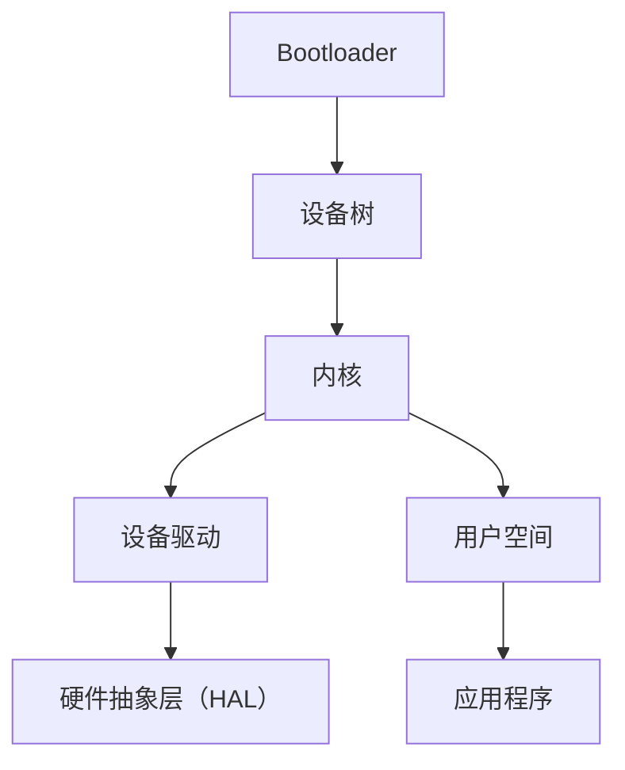

                 

# 嵌入式Linux开发：智能设备的操作系统选择

> 关键词：嵌入式Linux、智能设备、操作系统、开发、架构设计、性能优化、安全特性

> 摘要：本文将深入探讨嵌入式Linux作为智能设备操作系统的选择，从背景介绍、核心概念与联系、核心算法原理、数学模型和公式、项目实战、实际应用场景等多个角度进行分析。我们将通过逐步解析，帮助读者全面了解嵌入式Linux的开发与应用，为其在智能设备领域的推广提供技术支持。

## 1. 背景介绍

### 1.1 目的和范围

本文旨在为嵌入式开发者、智能设备设计师以及相关领域的技术人员提供一份详尽的嵌入式Linux开发指南。我们将从以下几个方面进行讨论：

- **操作系统选择**：分析为何嵌入式Linux是智能设备的理想选择。
- **核心概念与联系**：介绍嵌入式Linux的基本架构和核心组件。
- **核心算法原理**：讲解嵌入式Linux在性能优化和资源管理方面的算法原理。
- **数学模型和公式**：分析嵌入式Linux中的数学模型及其应用。
- **项目实战**：通过实际案例展示嵌入式Linux的开发过程。
- **实际应用场景**：探讨嵌入式Linux在不同领域的应用案例。

### 1.2 预期读者

本文适合以下读者群体：

- 嵌入式Linux开发者
- 智能设备设计师
- 对嵌入式操作系统感兴趣的软件工程师
- 对智能设备应用开发有热情的技术爱好者

### 1.3 文档结构概述

本文结构如下：

1. **背景介绍**：介绍本文的目的、预期读者以及文档结构。
2. **核心概念与联系**：介绍嵌入式Linux的基本架构和核心组件。
3. **核心算法原理**：讲解嵌入式Linux的性能优化和资源管理算法。
4. **数学模型和公式**：分析嵌入式Linux中的数学模型及其应用。
5. **项目实战**：通过实际案例展示嵌入式Linux的开发过程。
6. **实际应用场景**：探讨嵌入式Linux在不同领域的应用案例。
7. **工具和资源推荐**：推荐学习资源、开发工具和最新研究成果。
8. **总结**：总结嵌入式Linux的发展趋势与挑战。
9. **附录**：常见问题与解答。
10. **扩展阅读**：提供进一步阅读的参考资料。

### 1.4 术语表

#### 1.4.1 核心术语定义

- **嵌入式Linux**：基于Linux内核的轻量级操作系统，专门用于嵌入式设备。
- **智能设备**：具有感知、决策和执行能力的设备，如智能家居设备、智能手表、无人机等。
- **操作系统**：管理计算机硬件和软件资源的系统软件。
- **内核**：操作系统的核心部分，负责系统资源的分配和管理。
- **实时操作系统（RTOS）**：专门为实时应用设计的操作系统，具有严格的实时性能要求。

#### 1.4.2 相关概念解释

- **设备树（Device Tree）**：用于描述嵌入式设备硬件配置的数据结构。
- **引导加载程序（Bootloader）**：负责系统启动过程的程序，如U-Boot。
- **内核模块**：可以动态加载和卸载的内核扩展模块。
- **交叉编译**：在宿主机上编译嵌入式设备上的程序。

#### 1.4.3 缩略词列表

- **RTOS**：实时操作系统（Real-time Operating System）
- **IDE**：集成开发环境（Integrated Development Environment）
- **API**：应用程序接口（Application Programming Interface）
- **GPIO**：通用输入/输出（General Purpose Input/Output）

## 2. 核心概念与联系

在嵌入式Linux开发中，了解核心概念与联系至关重要。以下是一个简化的Mermaid流程图，用于描述嵌入式Linux的基本架构和核心组件。



### 2.1 Bootloader

Bootloader是嵌入式系统启动过程中的第一个程序，通常负责硬件初始化、加载设备树和内核镜像，并将控制权传递给内核。常见的Bootloader有U-Boot、GRUB等。

### 2.2 设备树

设备树（Device Tree）是一个用于描述嵌入式设备硬件配置的数据结构。它包含设备、中断、时钟等详细信息，是内核初始化过程中必不可少的一部分。

### 2.3 内核

内核是嵌入式Linux的核心部分，负责系统资源的分配和管理。它包括内核模块、内核线程、内存管理、进程调度等组件。内核还提供了对硬件设备驱动程序的管理接口。

### 2.4 设备驱动

设备驱动程序负责与硬件设备进行通信，包括GPIO、UART、I2C、SPI等。硬件抽象层（HAL）提供了一层抽象，使设备驱动程序与具体的硬件实现解耦。

### 2.5 用户空间

用户空间包括运行在内核之上的各种应用程序和库。应用程序可以通过系统调用访问内核提供的功能。用户空间还包含Shell、图形用户界面等。

### 2.6 硬件抽象层（HAL）

硬件抽象层（HAL）提供了一个统一的接口，使得上层软件（如设备驱动程序）与具体的硬件实现解耦。这有助于简化开发过程，提高代码的可维护性和可移植性。

## 3. 核心算法原理 & 具体操作步骤

### 3.1 内核线程调度算法

内核线程调度算法负责在多处理器系统上高效地调度线程。以下是基于时间片轮转（Round Robin）调度算法的伪代码：

```c
function schedule()
    while (true) {
        for each processor P in system {
            if (P.thread_queue is not empty) {
                P.current_thread = P.thread_queue.dequeue()
                P.thread_queue.enqueue(P.current_thread)
                context_switch(P.current_thread)
                P.cpu_time += time_slice
            }
        }
        sleep_for(scheduling_delay)
    }
```

### 3.2 内存管理算法

内存管理算法负责分配和回收系统内存。以下是基于分页机制的内存分配算法的伪代码：

```c
function allocate_memory(size)
    page_table = create_page_table()
    free_pages = find_free_pages(size)
    if (free_pages is not found) {
        return NULL
    }
    for each page P in free_pages {
        page_table[P] = allocate_physical_memory(page_size)
        map_page_to_virtual_memory(page_table[P], P, size)
    }
    return page_table
```

### 3.3 资源管理算法

资源管理算法负责对系统资源（如CPU、内存、I/O设备等）进行高效分配和回收。以下是基于资源池（Resource Pool）机制的伪代码：

```c
function create_resource_pool(resource_type, num_resources)
    resource_pool = new ResourcePool()
    for i = 1 to num_resources {
        resource = create_resource(resource_type)
        resource_pool.add_resource(resource)
    }
    return resource_pool
end

function allocate_resource(resource_pool)
    if (resource_pool.is_empty()) {
        return NULL
    }
    return resource_pool.dequeue_resource()
end

function release_resource(resource_pool, resource)
    resource_pool.enqueue_resource(resource)
end
```

## 4. 数学模型和公式 & 详细讲解 & 举例说明

### 4.1 系统响应时间

系统响应时间（Response Time）是衡量操作系统性能的重要指标。以下是响应时间的数学模型：

$$
\text{Response Time} = \text{Service Time} + \text{排队时间} + \text{处理时间}
$$

其中：

- **Service Time**：服务时间，即处理请求所需的时间。
- **排队时间**：等待服务的时间。
- **处理时间**：执行请求的过程时间。

### 4.2 平均响应时间

平均响应时间（Average Response Time）是所有响应时间的平均值。计算公式如下：

$$
\text{Average Response Time} = \frac{\sum_{i=1}^{n} \text{Response Time}_i}{n}
$$

其中，\( n \) 是请求的数量。

### 4.3 举例说明

假设一个嵌入式系统需要处理10个请求，其响应时间如下表所示：

| 请求编号 | 响应时间（ms） |
| -------- | -------------- |
| 1        | 20             |
| 2        | 30             |
| 3        | 40             |
| 4        | 50             |
| 5        | 10             |
| 6        | 30             |
| 7        | 20             |
| 8        | 40             |
| 9        | 10             |
| 10       | 50             |

计算平均响应时间：

$$
\text{Average Response Time} = \frac{20 + 30 + 40 + 50 + 10 + 30 + 20 + 40 + 10 + 50}{10} = \frac{310}{10} = 31 \text{ms}
$$

因此，该系统的平均响应时间为31ms。

## 5. 项目实战：代码实际案例和详细解释说明

### 5.1 开发环境搭建

为了进行嵌入式Linux开发，我们需要搭建一个开发环境。以下是一个基本的开发环境搭建步骤：

1. **安装Linux操作系统**：选择一个适用于嵌入式开发的Linux发行版，如Ubuntu。
2. **安装交叉编译工具**：安装交叉编译工具，如GNU Arm Embedded Toolchain，用于编译嵌入式设备上的程序。
3. **安装开发工具**：安装必要的开发工具，如GCC、GDB、Make等。
4. **配置环境变量**：配置环境变量，以便在命令行中方便地使用交叉编译工具。

### 5.2 源代码详细实现和代码解读

以下是一个简单的嵌入式Linux程序，用于读取GPIO引脚状态：

```c
#include <stdio.h>
#include <stdlib.h>
#include <unistd.h>
#include <sys/mman.h>
#include <fcntl.h>

#define GPIO_BASE_ADDR 0x20000000
#define GPIO_SIZE 0x1000

void setup_gpio(int pin)
{
    int fd = open("/dev/mem", O_RDWR);
    if (fd < 0) {
        perror("Unable to open /dev/mem");
        exit(EXIT_FAILURE);
    }

    void *gpio_map = mmap(NULL, GPIO_SIZE, PROT_READ | PROT_WRITE, MAP_SHARED, fd, GPIO_BASE_ADDR);
    if (gpio_map == MAP_FAILED) {
        perror("Unable to mmap /dev/mem");
        exit(EXIT_FAILURE);
    }

    unsigned int *gpio = (unsigned int *)gpio_map;

    // Configure GPIO pin as input
    *gpio |= (1 << pin);

    printf("GPIO pin %d is now configured as input\n", pin);

    munmap(gpio_map, GPIO_SIZE);
    close(fd);
}

int main(int argc, char **argv)
{
    if (argc < 2) {
        printf("Usage: %s <pin number>\n", argv[0]);
        return 1;
    }

    int pin = atoi(argv[1]);

    setup_gpio(pin);

    return 0;
}
```

### 5.3 代码解读与分析

1. **头文件**：代码中包含了必要的头文件，如`stdio.h`、`stdlib.h`、`unistd.h`等。
2. **宏定义**：定义了GPIO基地址和GPIO大小，方便后续代码访问GPIO设备。
3. **setup_gpio函数**：该函数用于设置GPIO引脚为输入模式。具体步骤如下：
   - 打开`/dev/mem`设备文件，用于访问物理内存。
   - 将GPIO基地址映射到用户空间，通过mmap系统调用。
   - 配置GPIO引脚为输入模式，即将相应的位设置为1。
   - 解除GPIO映射，并关闭设备文件。
4. **main函数**：主函数接收命令行参数，调用setup_gpio函数设置GPIO引脚。

### 5.4 运行与测试

要运行此程序，首先确保嵌入式设备上的GPIO引脚已连接到计算机的硬件接口。然后，使用以下命令编译和运行程序：

```bash
gcc -o gpio_program gpio_program.c
./gpio_program 17
```

其中，`17` 是GPIO引脚编号。运行程序后，GPIO引脚将被配置为输入模式，可以通过逻辑分析仪或其他工具验证。

## 6. 实际应用场景

嵌入式Linux在智能设备领域具有广泛的应用场景。以下是一些典型的应用案例：

### 6.1 智能家居

智能家居设备，如智能灯泡、智能门锁、智能摄像头等，通常需要实时响应用户操作并与其他设备进行通信。嵌入式Linux在这些设备中提供了高效、安全的操作系统环境。

### 6.2 智能穿戴设备

智能手表、智能手环等智能穿戴设备具有便携性和实时性要求。嵌入式Linux为这些设备提供了丰富的功能模块，如传感器驱动、图形用户界面、无线通信等。

### 6.3 工业自动化

工业自动化设备，如机器人、自动化生产线等，需要高效、可靠的操作系统。嵌入式Linux在这些设备中提供了实时性能和强大的扩展性。

### 6.4 车联网

车联网（Internet of Vehicles，IoV）是将车辆、道路、基础设施等进行联网的技术。嵌入式Linux在车载设备中提供了实时通信、数据分析和安全防护等功能。

## 7. 工具和资源推荐

### 7.1 学习资源推荐

#### 7.1.1 书籍推荐

- 《Linux设备驱动程序》
- 《嵌入式Linux系统编程》
- 《嵌入式系统设计》
- 《嵌入式系统实践》

#### 7.1.2 在线课程

- Coursera上的《嵌入式系统设计》
- Udacity上的《嵌入式Linux开发》
- edX上的《Linux内核编程》

#### 7.1.3 技术博客和网站

- [嵌入式Linux中文社区](http://www.linux嵌入式.com/)
- [Linux内核邮件列表](https://www.kernel.org/mailman/listinfo/kernel)
- [嵌入式Linux技术博客](http://www.linux嵌入式博客.com/)

### 7.2 开发工具框架推荐

#### 7.2.1 IDE和编辑器

- Eclipse CDT
- NetBeans
- VS Code（适用于Linux开发插件）

#### 7.2.2 调试和性能分析工具

- GDB
- Valgrind
- perf

#### 7.2.3 相关框架和库

- Yocto
- Buildroot
- BusyBox

### 7.3 相关论文著作推荐

#### 7.3.1 经典论文

- "Linux Kernel Internals" by Robert Love
- "Understanding the Linux Kernel" by Daniel P. Bovet and Marco Cesati

#### 7.3.2 最新研究成果

- "Real-Time Linux Extensions: Scheduling and Resource Management" by Ingo Molnar, Thomas Gleixner, and Petr Mladek
- "Linux Device Drivers, Third Edition" by Jonathan Corbet, Alessandro Rubini, and Greg Kroah-Hartman

#### 7.3.3 应用案例分析

- "Real-Time Systems: Design Principles for Distributed Embedded Applications" by Michael A. Whaley

## 8. 总结：未来发展趋势与挑战

### 8.1 未来发展趋势

1. **实时性能优化**：随着物联网（IoT）和智能设备的普及，实时性能优化将成为嵌入式Linux的重要发展方向。
2. **安全特性增强**：安全性日益成为嵌入式系统的关键需求，未来嵌入式Linux将在安全性方面进行更多改进。
3. **跨平台兼容性**：随着硬件技术的快速发展，嵌入式Linux将实现更多硬件平台的兼容性。
4. **自动化工具链**：自动化工具链的开发将进一步提高嵌入式Linux的开发效率。

### 8.2 面临的挑战

1. **实时性能限制**：虽然嵌入式Linux的实时性能不断优化，但与专门设计的实时操作系统（RTOS）相比，仍有提升空间。
2. **安全漏洞问题**：嵌入式Linux面临的安全威胁日益增多，如何提高安全性是一个长期挑战。
3. **资源受限环境**：嵌入式设备通常资源受限，如何在有限的资源下实现高性能和可扩展性是一个难题。
4. **生态建设**：如何建立和完善嵌入式Linux的开发生态，吸引更多开发者和企业参与，是未来发展的关键。

## 9. 附录：常见问题与解答

### 9.1 嵌入式Linux与通用Linux有何区别？

嵌入式Linux与通用Linux在目标应用、性能要求、资源使用等方面有所不同。嵌入式Linux通常更注重实时性能、资源优化和兼容性，而通用Linux则更关注通用性和可扩展性。

### 9.2 如何选择适合的嵌入式Linux发行版？

选择嵌入式Linux发行版时，应考虑以下因素：

- **硬件兼容性**：确保所选发行版支持目标硬件平台。
- **性能要求**：根据应用场景选择性能合适的发行版。
- **开发支持**：选择拥有良好开发社区和文档的发行版。

### 9.3 如何在嵌入式Linux中添加自定义设备驱动？

在嵌入式Linux中添加自定义设备驱动通常包括以下步骤：

- **编写驱动代码**：根据设备规格编写驱动代码。
- **编写设备树节点**：描述设备硬件配置的设备树节点。
- **集成到内核**：将驱动代码和设备树节点集成到内核源码，并编译内核。

## 10. 扩展阅读 & 参考资料

1. 《嵌入式Linux系统编程》
2. 《Linux内核设计与实现》
3. 《嵌入式系统设计指南》
4. [嵌入式Linux中文社区](http://www.linux嵌入式.com/)
5. [Linux内核邮件列表](https://www.kernel.org/mailman/listinfo/kernel)
6. [嵌入式Linux技术博客](http://www.linux嵌入式博客.com/)

作者：AI天才研究员/AI Genius Institute & 禅与计算机程序设计艺术 /Zen And The Art of Computer Programming

