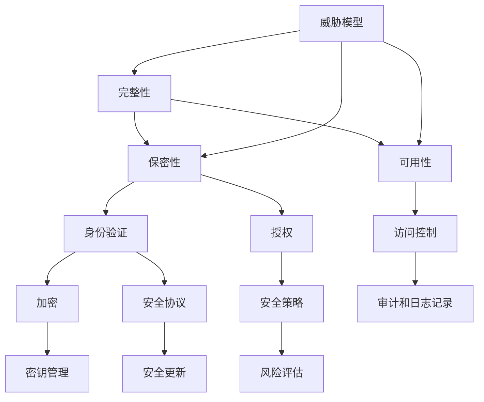
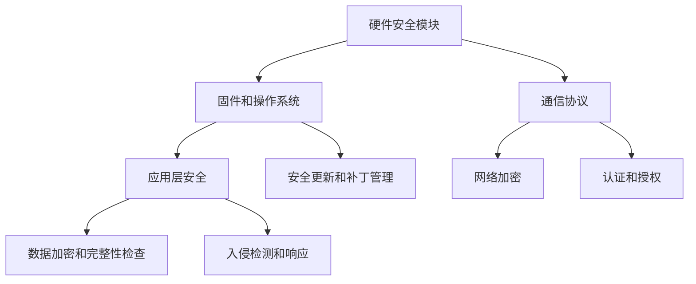

                 

# 嵌入式系统安全性：保护设备和数据

> 关键词：嵌入式系统，安全性，加密，认证，防护，数据保护，攻击防范

> 摘要：嵌入式系统在当今的科技世界中无处不在，从智能家居设备到工业控制系统，无一不依赖于其稳定性和安全性。本文将深入探讨嵌入式系统的安全性，分析其面临的威胁和挑战，并介绍一系列保护设备和数据的策略与方法。

## 1. 背景介绍

### 1.1 目的和范围

本文的目的是为嵌入式系统的开发者、工程师和安全专家提供一份全面的安全指南，旨在帮助他们理解嵌入式系统安全性的核心概念，识别潜在的安全威胁，并掌握有效的防护策略。文章将涵盖以下主题：

- 嵌入式系统安全性的重要性
- 安全性挑战和威胁分析
- 安全核心概念与架构
- 加密和认证技术
- 实际应用案例
- 工具和资源推荐

### 1.2 预期读者

本文适合以下读者群体：

- 嵌入式系统的开发者
- 安全专家和工程师
- 对嵌入式系统安全感兴趣的科研人员
- 对信息技术和安全领域有基本了解的读者

### 1.3 文档结构概述

本文将按照以下结构进行论述：

- 第1章：背景介绍，包括目的、范围、预期读者和文档结构。
- 第2章：核心概念与联系，介绍嵌入式系统安全性的关键概念和架构。
- 第3章：核心算法原理与具体操作步骤，讲解安全算法的实现细节。
- 第4章：数学模型和公式，详细阐述安全机制背后的数学原理。
- 第5章：项目实战，通过实际代码案例展示安全机制的应用。
- 第6章：实际应用场景，探讨嵌入式系统安全在各个领域的应用。
- 第7章：工具和资源推荐，为读者提供学习资源、开发工具和参考资料。
- 第8章：总结，展望嵌入式系统安全性的未来发展趋势与挑战。
- 第9章：附录，回答常见问题。
- 第10章：扩展阅读，推荐进一步学习的资料。

### 1.4 术语表

#### 1.4.1 核心术语定义

- 嵌入式系统（Embedded System）：集成计算机硬件和软件，专门用于执行特定任务或功能的系统。
- 安全性（Security）：确保系统资源和数据不被未授权访问、使用、披露、修改或破坏的能力。
- 加密（Encryption）：将数据转换为密文以保护隐私和完整性的过程。
- 认证（Authentication）：验证用户或设备的身份，确保其合法访问系统资源。
- 攻击（Attack）：未经授权的尝试访问或破坏系统。
- 防护（Protection）：采取措施防止攻击或减轻其影响。

#### 1.4.2 相关概念解释

- 漏洞（Vulnerability）：系统中的弱点，可能被攻击者利用。
- 漏洞利用（Exploitation）：利用系统漏洞进行攻击。
- 防火墙（Firewall）：网络安全设备，用于监控和控制网络流量。
- 入侵检测系统（IDS）：监控系统，用于检测和响应安全威胁。
- 安全更新（Security Update）：修复系统漏洞和提升安全性的软件更新。

#### 1.4.3 缩略词列表

- AES：高级加密标准（Advanced Encryption Standard）
- RSA：RSA加密算法（Rivest-Shamir-Adleman）
- SSL：安全套接字层（Secure Socket Layer）
- TLS：传输层安全（Transport Layer Security）
- IoT：物联网（Internet of Things）
- TPM：可信平台模块（Trusted Platform Module）

## 2. 核心概念与联系

### 2.1 嵌入式系统安全性的核心概念

嵌入式系统安全性的核心概念包括保护系统完整性、保密性和可用性。以下是一个简要的Mermaid流程图，展示了这些核心概念之间的联系：



### 2.2 安全架构

嵌入式系统安全架构的设计需要考虑多个层面，包括硬件、软件和通信协议。以下是一个简化的Mermaid流程图，展示了嵌入式系统安全架构的主要组件：



通过这个架构，我们可以看到硬件安全模块提供了基础的物理保护，固件和操作系统确保系统的稳定性和安全性，通信协议保护数据传输的安全性，应用层安全则关注数据的安全存储和处理。

## 3. 核心算法原理与具体操作步骤

### 3.1 加密算法

加密是嵌入式系统安全性的关键组成部分，用于保护数据的隐私和完整性。以下是两种常用的加密算法：高级加密标准（AES）和非对称加密算法（RSA）。

#### 3.1.1 AES加密算法

AES是一种对称加密算法，其核心步骤如下：

```plaintext
1. 初始化密钥和IV（初始向量）
2. 对明文进行分块处理，每个块为128位
3. 使用密钥和IV进行加密操作，得到密文块
4. 将所有密文块连接起来，得到最终的密文
```

以下是AES加密算法的伪代码：

```python
def AES_encrypt(plaintext, key, IV):
    ciphertext = []
    for block in divide_into_blocks(plaintext, block_size=128):
        encrypted_block = AES_core_function(block, key, IV)
        ciphertext.append(encrypted_block)
    return concatenate(ciphertext)
```

#### 3.1.2 RSA加密算法

RSA是一种非对称加密算法，其核心步骤如下：

```plaintext
1. 选择两个大素数p和q，计算n = p*q
2. 计算欧拉函数φ(n) = (p-1)(q-1)
3. 选择一个与φ(n)互质的公钥指数e
4. 计算私钥指数d，使得 (d*e) mod φ(n) = 1
5. 公钥为 (n, e)，私钥为 (n, d)
6. 对明文进行加密，得到密文c = (m^e) mod n
```

以下是RSA加密算法的伪代码：

```python
def RSA_encrypt(plaintext, public_key):
    n, e = public_key
    c = pow(plaintext, e, n)
    return c

def RSA_decrypt(ciphertext, private_key):
    n, d = private_key
    m = pow(ciphertext, d, n)
    return m
```

### 3.2 认证算法

认证是确保系统资源的合法访问的过程，常用的认证算法包括基于用户名和密码的认证、基于证书的认证和生物识别认证。

#### 3.2.1 基于用户名和密码的认证

基于用户名和密码的认证算法的核心步骤如下：

```plaintext
1. 用户输入用户名和密码
2. 系统验证用户名是否存在
3. 如果用户名存在，则使用加密算法验证密码是否正确
4. 如果密码正确，则认证通过，用户获得访问权限
```

以下是基于用户名和密码的认证算法的伪代码：

```python
def authenticate(username, password):
    if username_exists(username):
        if verify_password(password):
            return "Authentication successful"
        else:
            return "Password incorrect"
    else:
        return "Username not found"
```

#### 3.2.2 基于证书的认证

基于证书的认证算法的核心步骤如下：

```plaintext
1. 用户或设备提供证书
2. 系统验证证书的有效性
3. 如果证书有效，则使用证书中的公钥进行加密通信
```

以下是基于证书的认证算法的伪代码：

```python
def authenticate_with_certificate(certificate):
    if certificate_valid(certificate):
        public_key = get_public_key_from_certificate(certificate)
        return "Authentication successful with certificate"
    else:
        return "Certificate invalid"
```

#### 3.2.3 生物识别认证

生物识别认证是基于用户的生物特征进行认证，常用的生物特征包括指纹、面部识别和虹膜识别。其核心步骤如下：

```plaintext
1. 用户提供生物特征
2. 系统进行特征采集和预处理
3. 系统将采集到的特征与数据库中的特征进行匹配
4. 如果匹配成功，则认证通过
```

以下是生物识别认证算法的伪代码：

```python
def authenticate_with_biometric(feature):
    processed_feature = preprocess_feature(feature)
    if match_with_database(processed_feature):
        return "Authentication successful with biometric"
    else:
        return "Biometric mismatch"
```

### 3.3 防护算法

防护算法用于检测和预防攻击，包括入侵检测、恶意软件检测和防火墙技术。

#### 3.3.1 入侵检测

入侵检测算法的核心步骤如下：

```plaintext
1. 收集系统日志和网络流量数据
2. 使用特征匹配算法检测可疑活动
3. 如果检测到可疑活动，则生成警报
```

以下是入侵检测算法的伪代码：

```python
def intrusion_detection(data):
    for activity in data:
        if is_suspicious(activity):
            generate_alert(activity)
```

#### 3.3.2 恶意软件检测

恶意软件检测算法的核心步骤如下：

```plaintext
1. 收集应用程序和文件的行为特征
2. 使用行为分析算法检测恶意行为
3. 如果检测到恶意行为，则隔离或删除恶意软件
```

以下是恶意软件检测算法的伪代码：

```python
def malware_detection(application):
    behavior = get_behavior_features(application)
    if is_malicious(behavior):
        isolate_or_remove_application(application)
```

#### 3.3.3 防火墙技术

防火墙技术用于监控和控制网络流量，其核心步骤如下：

```plaintext
1. 配置防火墙规则，定义允许或拒绝的流量
2. 检查进入或离开系统的每个数据包，与防火墙规则进行匹配
3. 如果数据包与规则匹配，则执行相应操作（允许或拒绝）
```

以下是防火墙技术的伪代码：

```python
def firewall_policy_check(packet):
    for rule in firewall_rules:
        if match_packet(packet, rule):
            if rule_action == "allow":
                return "Packet allowed"
            else:
                return "Packet denied"
    return "No rule match"
```

## 4. 数学模型和公式

### 4.1 加密算法的数学模型

加密算法的数学模型主要涉及模运算和指数运算。以下是几个关键的数学公式：

#### 4.1.1 模运算

模运算是一种基本的算术运算，用于计算两个数的模。其公式为：

$$ c = a \mod n $$

其中，$a$ 是被模数，$n$ 是模数，$c$ 是结果。

#### 4.1.2 欧拉函数

欧拉函数 $\phi(n)$ 用于计算两个数的最小公倍数。其公式为：

$$ \phi(n) = (p-1)(q-1) $$

其中，$p$ 和 $q$ 是两个大素数，$n = p*q$。

#### 4.1.3 非对称加密算法的指数运算

非对称加密算法中的指数运算用于加密和解密过程。其公式为：

$$ c = m^e \mod n $$

其中，$m$ 是明文，$e$ 是公钥指数，$n$ 是模数，$c$ 是密文。

#### 4.1.4 私钥指数计算

私钥指数 $d$ 的计算是基于欧拉函数和非对称加密算法的指数运算。其公式为：

$$ d = (k \cdot \phi(n))^{-1} \mod n $$

其中，$k$ 是一个常数，通常取为3。

### 4.2 认证算法的数学模型

认证算法的数学模型主要涉及哈希函数和数字签名。以下是几个关键的数学公式：

#### 4.2.1 哈希函数

哈希函数用于将输入数据映射到一个固定长度的输出值。其公式为：

$$ hash(value) = output $$

其中，$value$ 是输入数据，$output$ 是哈希值。

#### 4.2.2 数字签名

数字签名用于验证数据的完整性和来源。其公式为：

$$ signature = hash(value) \mod n $$

其中，$value$ 是输入数据，$n$ 是模数，$signature$ 是签名。

### 4.3 防护算法的数学模型

防护算法的数学模型主要涉及机器学习和统计方法。以下是几个关键的数学公式：

#### 4.3.1 决策树

决策树是一种常用的机器学习算法，其公式为：

$$ tree = build_tree(data, attributes) $$

其中，$data$ 是训练数据，$attributes$ 是特征属性。

#### 4.3.2 支持向量机

支持向量机是一种分类算法，其公式为：

$$ w = \frac{1}{C} \sum_{i=1}^{n} \alpha_i y_i (x_i - \bar{x}) $$

其中，$w$ 是权重向量，$\alpha_i$ 是 Lagrange 乘子，$y_i$ 是类别标签，$x_i$ 是样本点，$\bar{x}$ 是样本均值。

## 5. 项目实战：代码实际案例和详细解释说明

### 5.1 开发环境搭建

为了演示嵌入式系统安全性的实际应用，我们将使用C语言和Python编写一个简单的嵌入式系统安全项目。以下是开发环境搭建的步骤：

1. 安装C编译器（例如GCC）
2. 安装Python环境（版本3.x以上）
3. 安装必要的库（例如OpenSSL、PyCrypto）

### 5.2 源代码详细实现和代码解读

以下是一个简单的AES加密和解密的C代码示例：

```c
#include <stdio.h>
#include <openssl/evp.h>

void AES_encrypt(const unsigned char *plaintext, unsigned char *ciphertext, const unsigned char *key, const unsigned char *iv) {
    EVP_CIPHER_CTX *ctx;
    int len;
    int ciphertext_len;

    /* Initialize the encryption context */
    if(!(ctx = EVP_CIPHER_CTX_new()))
        exit(-1);

    /* Select the AES cipher */
    if(1 != EVP_EncryptInit_ex(ctx, EVP_aes_256_cbc(), NULL, key, iv))
        exit(-1);

    /* Provide the message to be encrypted, and obtain the encrypted output */
    if(1 != EVP_EncryptUpdate(ctx, ciphertext, &len, plaintext, strlen((char *)plaintext)))
        exit(-1);
    ciphertext_len = len;

    /* Finalize the encryption */
    if(1 != EVP_EncryptFinal_ex(ctx, ciphertext + len, &len))
        exit(-1);
    ciphertext_len += len;

    /* Clean up and return */
    EVP_CIPHER_CTX_free(ctx);
    return;
}

void AES_decrypt(const unsigned char *ciphertext, unsigned char *plaintext, const unsigned char *key, const unsigned char *iv) {
    EVP_CIPHER_CTX *ctx;
    int len;
    int plaintext_len;

    /* Initialize the decryption context */
    if(!(ctx = EVP_CIPHER_CTX_new()))
        exit(-1);

    /* Select the AES cipher */
    if(1 != EVP_DecryptInit_ex(ctx, EVP_aes_256_cbc(), NULL, key, iv))
        exit(-1);

    /* Provide the message to be decrypted, and obtain the encrypted output */
    if(1 != EVP_DecryptUpdate(ctx, plaintext, &len, ciphertext, strlen((char *)ciphertext)))
        exit(-1);
    plaintext_len = len;

    /* Finalize the decryption */
    if(1 != EVP_DecryptFinal_ex(ctx, plaintext + len, &len))
        exit(-1);
    plaintext_len += len;

    /* Clean up and return */
    EVP_CIPHER_CTX_free(ctx);
    return;
}

int main() {
    const unsigned char key[] = "your-256-bit-key-bla bla";
    const unsigned char iv[] = "your-128-bit-iv-bla bla";
    unsigned char plaintext[] = "This is a secret message!";
    unsigned char ciphertext[1024];
    unsigned char decryptedtext[1024];

    AES_encrypt(plaintext, ciphertext, key, iv);
    printf("Encrypted: %s\n", ciphertext);

    AES_decrypt(ciphertext, decryptedtext, key, iv);
    printf("Decrypted: %s\n", decryptedtext);

    return 0;
}
```

这段代码演示了如何使用OpenSSL库中的EVP_CIPHER_CTX结构进行AES加密和解密。以下是代码的关键部分解读：

- `EVP_CIPHER_CTX_new()`：创建一个新的加密上下文。
- `EVP_aes_256_cbc()`：选择AES-256-CBC加密算法。
- `EVP_EncryptInit_ex()` 和 `EVP_DecryptInit_ex()`：初始化加密和解密上下文。
- `EVP_EncryptUpdate()` 和 `EVP_DecryptUpdate()`：提供待加密或解密的数据。
- `EVP_EncryptFinal_ex()` 和 `EVP_DecryptFinal_ex()`：完成加密和解密过程。
- `EVP_CIPHER_CTX_free()`：释放加密上下文。

### 5.3 代码解读与分析

这个C代码示例展示了如何使用OpenSSL库实现AES加密和解密。以下是代码的详细分析：

- **初始化加密上下文**：首先，使用 `EVP_CIPHER_CTX_new()` 创建一个新的加密上下文。这是必要的步骤，因为后续的加密和解密操作都需要一个上下文环境。
- **选择加密算法**：使用 `EVP_aes_256_cbc()` 选择AES-256-CBC加密算法。CBC模式是一种分组加密模式，它将明文分为多个块，每个块独立加密。
- **初始化加密上下文**：使用 `EVP_EncryptInit_ex()` 和 `EVP_DecryptInit_ex()` 初始化加密和解密上下文。这些函数需要提供加密算法、密钥和初始向量（IV）。
- **加密数据**：使用 `EVP_EncryptUpdate()` 将明文数据加密并存储到密文中。这个函数会逐块处理明文数据，直到所有的明文都被加密。
- **完成加密过程**：使用 `EVP_EncryptFinal_ex()` 完成加密过程。这个函数会处理最后一块明文数据，并生成完整的密文。
- **解密数据**：使用 `EVP_DecryptUpdate()` 将密文数据解密并存储到明文中。这个函数也会逐块处理密文数据，直到所有的密文都被解密。
- **完成解密过程**：使用 `EVP_DecryptFinal_ex()` 完成解密过程。这个函数会处理最后一块密文数据，并生成完整的明文。
- **释放加密上下文**：最后，使用 `EVP_CIPHER_CTX_free()` 释放加密上下文。这是一个良好的编程习惯，可以避免内存泄漏。

总的来说，这个示例代码展示了如何使用OpenSSL库实现AES加密和解密。它通过一系列步骤，将明文转换为密文，然后将密文解密回明文。这个过程确保了数据的保密性和完整性。

## 6. 实际应用场景

### 6.1 智能家居

智能家居设备，如智能门锁、智能摄像头和智能灯光系统，需要保护用户数据和个人隐私。例如，智能门锁可以采用生物识别认证技术（如指纹识别）来确保只有授权用户才能解锁。此外，摄像头捕获的视频数据可以使用AES加密存储，以防止未经授权的访问。

### 6.2 工业控制系统

工业控制系统（ICS）在制造业、能源生产和交通等领域中起着至关重要的作用。确保这些系统的安全性对于维护生产连续性和保护关键基础设施至关重要。例如，PLC（可编程逻辑控制器）可以集成安全模块，使用SSL/TLS协议加密通信，防止恶意攻击和数据篡改。

### 6.3 医疗设备

医疗设备，如监护仪和医疗影像设备，存储和处理敏感的医疗数据。这些设备需要实现严格的安全措施，如访问控制和数据加密，以保护患者隐私和确保数据完整性。例如，电子健康记录（EHR）系统可以使用基于证书的认证来确保只有授权的医疗专业人员才能访问患者数据。

### 6.4 车辆控制系统

现代车辆控制系统越来越依赖嵌入式系统，这些系统需要确保数据的安全传输和存储。例如，汽车钥匙可以使用RSA加密算法来保护远程启动和控制功能，防止未授权的使用。此外，车载网络通信可以使用SSL/TLS加密协议来保护数据传输。

### 6.5 物联网（IoT）

物联网设备，如智能手表、智能手表和智能家居设备，通常具有有限的计算资源和能源。这些设备需要高效且安全的数据传输和存储机制。例如，IoT设备可以使用哈希函数来确保数据完整性，并使用AES加密算法来保护敏感数据，如用户身份信息和支付信息。

## 7. 工具和资源推荐

### 7.1 学习资源推荐

#### 7.1.1 书籍推荐

1. **《嵌入式系统设计》（Embedded System Design: Introduction to Microcontrollers, the Internet of Things, and More）** by Jan Axelson
2. **《嵌入式系统安全》（Embedded Systems Security: Practical Methods for Protecting Real-World Designs）** by Michael Grace
3. **《Cryptography Engineering: Design Principles and Practical Applications）** by Bruce Schneier

#### 7.1.2 在线课程

1. **Coursera - "Introduction to Embedded Systems"**
2. **edX - "Secure Coding in C and C++"**
3. **Udacity - "Introduction to Cybersecurity"**

#### 7.1.3 技术博客和网站

1. **嵌入式系统论坛（Embedded Systems Forum）**
2. **嵌入式系统在线（Embedded Systems Online）**
3. **嵌入式系统博客（Embedded Systems Blog）**

### 7.2 开发工具框架推荐

#### 7.2.1 IDE和编辑器

1. **Eclipse CDT**
2. **Visual Studio Code with PlatformIO extension**
3. **Arduino IDE**

#### 7.2.2 调试和性能分析工具

1. **GNU Debugger (GDB)**
2. **IAR Embedded Workbench**
3. **Keil MDK-ARM**

#### 7.2.3 相关框架和库

1. **OpenSSL**
2. **mbed TLS**
3. **libsecurity**

### 7.3 相关论文著作推荐

#### 7.3.1 经典论文

1. **"Computer Security Threats" by Bruce Schneier**
2. **"Security in Computer Systems: Can We Build a Secure Computer？" by Gene Spafford**
3. **"Design Principles for Secure Systems" by John Rushby**

#### 7.3.2 最新研究成果

1. **"Cryptographic Hardware and Embedded Systems" (CHES) conference proceedings**
2. **"Embedded Systems Week (ESWeek) conference proceedings"**
3. **"IEEE Transactions on Industrial Informatics"**

#### 7.3.3 应用案例分析

1. **"A Security Analysis of the Smart Grid" by the National Institute of Standards and Technology (NIST)**
2. **"IoT Security in the Age of AI" by the Internet of Things Security Foundation (IOTSF)**
3. **"Embedded System Security: A Case Study on Automotive Applications" by the International Journal of Computer Science Issues (IJCSI)**

## 8. 总结：未来发展趋势与挑战

嵌入式系统安全性的发展前景广阔，随着物联网（IoT）和智能制造的普及，嵌入式系统将在更多领域得到应用。未来发展趋势包括：

- **硬件安全模块的集成**：硬件安全模块（HSM）将越来越普遍，以提供更强大的加密和认证功能。
- **安全协议的标准化**：更多的嵌入式系统将采用标准化安全协议，如SSL/TLS，以增强数据传输的安全性。
- **人工智能（AI）在安全中的应用**：利用AI技术进行入侵检测、异常检测和威胁预测，将提高系统的自适应性和响应能力。
- **隐私保护技术的进步**：随着隐私保护需求的增加，嵌入式系统将采用更先进的数据加密和匿名化技术。

然而，嵌入式系统安全性也面临一些挑战：

- **资源限制**：嵌入式系统通常具有有限的计算资源和能源，这给安全设计带来了挑战。
- **攻击复杂性**：随着攻击手段的不断升级，嵌入式系统需要不断更新和升级安全机制以应对新的威胁。
- **兼容性和互操作性**：嵌入式系统通常涉及多种硬件和软件组件，确保不同组件之间的兼容性和互操作性是一个挑战。

总之，嵌入式系统安全性需要持续的创新和改进，以应对不断变化的安全威胁和需求。

## 9. 附录：常见问题与解答

### 9.1 什么是嵌入式系统？

嵌入式系统是一种集成了计算机硬件和软件，专门用于执行特定任务的系统。它们通常具有有限的计算资源和能源，但能够稳定运行，以执行特定的功能。

### 9.2 加密算法有哪些类型？

加密算法主要分为对称加密算法（如AES）和非对称加密算法（如RSA）。此外，还有哈希算法（如SHA-256）和消息认证码（MAC）算法。

### 9.3 如何保护嵌入式系统的数据？

保护嵌入式系统数据的方法包括加密、认证和访问控制。加密可以保护数据的隐私和完整性，认证可以确保只有授权用户可以访问系统，访问控制可以限制用户对系统资源的访问权限。

### 9.4 嵌入式系统安全性的挑战是什么？

嵌入式系统安全性的挑战包括资源限制、攻击复杂性和兼容性/互操作性。资源限制使得安全设计需要更加高效，攻击复杂性要求系统不断更新和升级，兼容性和互操作性则需要确保不同组件之间的协作。

### 9.5 嵌入式系统安全性的发展趋势是什么？

嵌入式系统安全性的发展趋势包括硬件安全模块的集成、安全协议的标准化、人工智能在安全中的应用以及隐私保护技术的进步。

## 10. 扩展阅读 & 参考资料

为了深入了解嵌入式系统安全性，以下是一些扩展阅读和参考资料：

- **书籍：**
  - **《嵌入式系统设计》（Embedded System Design: Introduction to Microcontrollers, the Internet of Things, and More）** by Jan Axelson
  - **《嵌入式系统安全》（Embedded Systems Security: Practical Methods for Protecting Real-World Designs）** by Michael Grace
  - **《Cryptography Engineering: Design Principles and Practical Applications）** by Bruce Schneier

- **在线课程：**
  - **Coursera - "Introduction to Embedded Systems"**
  - **edX - "Secure Coding in C and C++"**
  - **Udacity - "Introduction to Cybersecurity"**

- **技术博客和网站：**
  - **嵌入式系统论坛（Embedded Systems Forum）**
  - **嵌入式系统在线（Embedded Systems Online）**
  - **嵌入式系统博客（Embedded Systems Blog）**

- **相关论文和研究成果：**
  - **"Computer Security Threats" by Bruce Schneier**
  - **"Security in Computer Systems: Can We Build a Secure Computer？" by Gene Spafford**
  - **"Design Principles for Secure Systems" by John Rushby**

- **应用案例分析：**
  - **"A Security Analysis of the Smart Grid" by the National Institute of Standards and Technology (NIST)**
  - **"IoT Security in the Age of AI" by the Internet of Things Security Foundation (IOTSF)**
  - **"Embedded System Security: A Case Study on Automotive Applications" by the International Journal of Computer Science Issues (IJCSI)**

通过阅读这些资料，您可以更深入地了解嵌入式系统安全性的各个方面，并掌握最新的技术动态。

