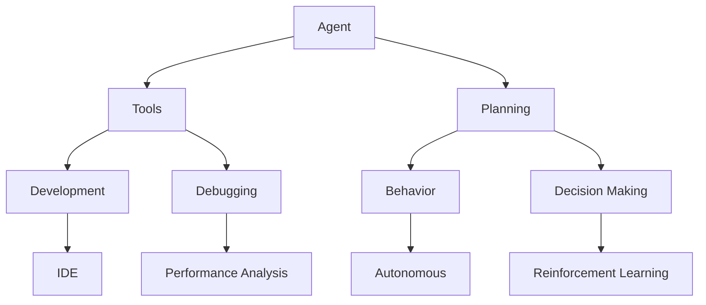

                 

# 工具使用与规划的结合：增强 Agent 能力

> 关键词：Agent、工具、规划、增强、人工智能、软件开发

> 摘要：本文将探讨如何通过结合工具使用与规划，来增强Agent的能力。我们将从背景介绍、核心概念、算法原理、数学模型、实战案例、应用场景、工具资源等多个角度进行详细分析，旨在为开发者提供一套行之有效的Agent增强方法。

## 1. 背景介绍

### 1.1 目的和范围

本文旨在探讨如何通过结合工具使用与规划，来增强Agent的能力。Agent技术广泛应用于人工智能、游戏开发、自动化控制等领域，其核心在于自主决策和行为规划。然而，在实际应用中，Agent的能力往往受到多种因素的限制，如数据处理能力、决策效率、环境适应性等。本文将从以下几个方面展开讨论：

- 工具的使用：介绍在Agent开发中常用的工具，如开发框架、调试工具等。
- 规划的制定：探讨如何通过合理的规划来优化Agent的行为和决策。
- 增强策略：分析如何结合工具使用和规划制定，来提高Agent的整体能力。

### 1.2 预期读者

本文主要面向具有一定编程基础和人工智能背景的读者，特别是从事Agent开发和应用的研究人员、工程师和开发者。通过本文的阅读，读者可以了解如何有效地增强Agent的能力，为实际项目提供有益的参考。

### 1.3 文档结构概述

本文将分为以下部分：

- 第1部分：背景介绍，包括目的和范围、预期读者、文档结构概述等。
- 第2部分：核心概念与联系，介绍Agent、工具、规划等核心概念，并提供流程图。
- 第3部分：核心算法原理 & 具体操作步骤，讲解算法原理和具体实现。
- 第4部分：数学模型和公式 & 详细讲解 & 举例说明，介绍相关数学模型和公式。
- 第5部分：项目实战：代码实际案例和详细解释说明，提供实际代码案例。
- 第6部分：实际应用场景，分析Agent在不同场景下的应用。
- 第7部分：工具和资源推荐，介绍相关工具和资源。
- 第8部分：总结：未来发展趋势与挑战，总结全文内容并展望未来。
- 第9部分：附录：常见问题与解答，回答读者可能遇到的问题。
- 第10部分：扩展阅读 & 参考资料，提供相关扩展资料。

### 1.4 术语表

#### 1.4.1 核心术语定义

- Agent：具有自主决策和行为规划能力的人工智能实体。
- 工具：用于支持Agent开发、调试和优化的软件或硬件。
- 规划：制定Agent行为和决策的方案或策略。
- 增强策略：结合工具使用和规划制定，提高Agent整体能力的策略。

#### 1.4.2 相关概念解释

- 智能代理：具备智能行为的Agent，能够在复杂环境中自主完成任务。
- 强化学习：一种机器学习方法，通过试错和奖励机制来优化Agent的行为。
- 决策树：一种用于决策的树形结构，可用于分类和回归问题。

#### 1.4.3 缩略词列表

- AI：人工智能
- Agent：代理
- IDE：集成开发环境
- ML：机器学习
- DL：深度学习
- RL：强化学习

## 2. 核心概念与联系

在探讨如何增强Agent的能力之前，我们需要先了解一些核心概念和它们之间的联系。以下是一个简化的Mermaid流程图，展示了Agent、工具、规划等核心概念之间的联系。



### 2.1 Agent

Agent是一种具有自主决策和行为规划能力的人工智能实体。它能够在复杂环境中感知状态、制定决策，并执行相应动作。Agent的应用场景非常广泛，如智能机器人、自动驾驶、游戏AI等。

### 2.2 工具

工具是支持Agent开发、调试和优化的软件或硬件。在开发过程中，IDE、调试工具和性能分析工具等工具可以帮助开发者更高效地完成工作。以下是一些常用的工具：

- **IDE（集成开发环境）**：如Visual Studio、Eclipse等，提供代码编写、编译、调试等功能。
- **调试工具**：如GDB、LLDB等，帮助开发者定位和修复代码中的错误。
- **性能分析工具**：如Valgrind、perf等，用于分析程序的性能瓶颈。

### 2.3 规划

规划是制定Agent行为和决策的方案或策略。合理的规划可以优化Agent的行为，提高其决策效率和适应性。以下是一些常见的规划方法：

- **决策树**：一种用于决策的树形结构，可用于分类和回归问题。
- **强化学习**：通过试错和奖励机制来优化Agent的行为。
- **遗传算法**：模拟生物进化过程，用于求解优化问题。

## 3. 核心算法原理 & 具体操作步骤

在了解了核心概念和联系之后，我们将进一步探讨如何通过算法原理来增强Agent的能力。以下是一个简化的伪代码，展示了核心算法原理和具体操作步骤。

```python
# 伪代码：增强Agent能力的算法原理

# 输入：环境状态S，目标状态T，工具T，规划P
# 输出：优化后的Agent行为B

# 初始化Agent行为B
B = initialize_behavior(S, T)

# 通过规划P生成初始行为
B = plan_behavior(S, T, P)

# 使用工具T对行为B进行优化
B = optimize_behavior(B, T)

# 使用强化学习调整行为B
B = reinforcement_learning(B, S, T)

# 迭代更新行为B，直到满足停止条件
while not stop_condition_met(B):
    B = update_behavior(B, S, T)

# 输出优化后的行为B
output_behavior(B)
```

### 3.1 初始化行为

初始化行为是Agent在开始执行任务时的第一步。初始化行为通常基于环境状态S和目标状态T，可以通过以下方式实现：

```python
def initialize_behavior(S, T):
    # 根据环境状态S和目标状态T，初始化Agent行为B
    B = {}
    B['action'] = choose_action(S, T)
    B['reward'] = 0
    return B
```

### 3.2 规划行为

规划行为是通过规划P来生成Agent的行为。规划P可以是决策树、强化学习等。以下是一个简化的决策树规划：

```python
def plan_behavior(S, T, P):
    # 根据规划P生成Agent行为B
    B = {}
    B['action'] = apply_decision_tree(S, P)
    B['reward'] = calculate_reward(S, T)
    return B
```

### 3.3 优化行为

优化行为是通过工具T对行为B进行优化。工具T可以是IDE、调试工具、性能分析工具等。以下是一个简化的优化过程：

```python
def optimize_behavior(B, T):
    # 使用工具T优化Agent行为B
    B['action'] = apply_optimization(T, B['action'])
    B['reward'] = calculate_optimized_reward(B['action'], S, T)
    return B
```

### 3.4 强化学习调整行为

强化学习是通过试错和奖励机制来调整Agent的行为。以下是一个简化的强化学习过程：

```python
def reinforcement_learning(B, S, T):
    # 使用强化学习调整Agent行为B
    B['action'] = apply_reinforcement_learning(B['action'], S, T)
    B['reward'] = calculate_reinforcement_learning_reward(B['action'], S, T)
    return B
```

### 3.5 迭代更新行为

迭代更新行为是通过不断迭代更新行为B，直到满足停止条件。以下是一个简化的迭代更新过程：

```python
def update_behavior(B, S, T):
    # 迭代更新Agent行为B
    B = plan_behavior(S, T, P)
    B = optimize_behavior(B, T)
    B = reinforcement_learning(B, S, T)
    return B
```

## 4. 数学模型和公式 & 详细讲解 & 举例说明

在增强Agent能力的过程中，数学模型和公式起到了关键作用。以下将介绍几个常用的数学模型和公式，并进行详细讲解和举例说明。

### 4.1 强化学习中的Q学习算法

Q学习算法是一种基于值函数的强化学习算法，用于求解最优策略。其核心思想是学习一个值函数Q(S, A)，表示在状态S下执行动作A的预期回报。

公式：

$$
Q(S, A) = \sum_{s'} P(s' | s, a) \cdot \gamma \cdot R(s', a)
$$

其中：

- $Q(S, A)$：在状态S下执行动作A的值函数。
- $P(s' | s, a)$：在状态S下执行动作A后转移到状态s'的概率。
- $\gamma$：折扣因子，用于平衡长期和短期奖励。
- $R(s', a)$：在状态s'下执行动作A的即时奖励。

举例说明：

假设一个Agent在迷宫中寻找出口，每个状态表示迷宫中的一个位置，每个动作表示向上下左右移动。使用Q学习算法求解最优策略。

初始化值函数Q(S, A)为0。

状态S：迷宫中当前位置
动作A：上下左右移动
转移概率$P(s' | s, a)$：根据迷宫地图计算
即时奖励$R(s', a)$：到达出口的奖励为+100，其他状态为-1

通过迭代更新值函数Q(S, A)，直到收敛。

### 4.2 决策树中的ID3算法

ID3算法是一种基于信息增益的决策树生成算法，用于分类问题。其核心思想是选择具有最高信息增益的特征作为节点，递归构建决策树。

公式：

$$
\text{信息增益} = \sum_{v \in V} P(V = v) \cdot \log_2 \left( \frac{P(V = v)}{P(V \neq v)} \right)
$$

其中：

- $V$：特征集合
- $P(V = v)$：特征V在训练数据中的条件概率
- $P(V \neq v)$：特征V在训练数据中的条件概率

举例说明：

假设有一个包含特征A、B、C的分类问题，每个特征都有两个取值，0和1。使用ID3算法生成决策树。

训练数据集：

| 特征A | 特征B | 特征C | 分类 |
| --- | --- | --- | --- |
| 0 | 0 | 0 | 0 |
| 0 | 0 | 1 | 1 |
| 0 | 1 | 0 | 1 |
| 0 | 1 | 1 | 0 |
| 1 | 0 | 0 | 1 |
| 1 | 0 | 1 | 0 |
| 1 | 1 | 0 | 0 |
| 1 | 1 | 1 | 1 |

计算每个特征的信息增益：

- 特征A的信息增益：$$\text{信息增益} = \sum_{v \in V} P(V = v) \cdot \log_2 \left( \frac{P(V = v)}{P(V \neq v)} \right) = 0.75 \cdot \log_2 \left( \frac{0.75}{0.25} \right) + 0.25 \cdot \log_2 \left( \frac{0.25}{0.75} \right) = 0.79$$
- 特征B的信息增益：$$\text{信息增益} = \sum_{v \in V} P(V = v) \cdot \log_2 \left( \frac{P(V = v)}{P(V \neq v)} \right) = 0.5 \cdot \log_2 \left( \frac{0.5}{0.5} \right) + 0.5 \cdot \log_2 \left( \frac{0.5}{0.5} \right) = 0$$
- 特征C的信息增益：$$\text{信息增益} = \sum_{v \in V} P(V = v) \cdot \log_2 \left( \frac{P(V = v)}{P(V \neq v)} \right) = 0.5 \cdot \log_2 \left( \frac{0.5}{0.5} \right) + 0.5 \cdot \log_2 \left( \frac{0.5}{0.5} \right) = 0$$

选择具有最高信息增益的特征A作为节点，继续计算子节点的信息增益，直到满足停止条件，生成决策树。

### 4.3 遗传算法中的适应度函数

遗传算法是一种基于自然进化过程的优化算法，用于求解优化问题。适应度函数用于评估个体的优劣，指导进化过程。

公式：

$$
f(x) = \sum_{i=1}^{n} w_i \cdot f_i(x)
$$

其中：

- $x$：个体
- $w_i$：权重
- $f_i(x)$：第i个特征的适应度值

举例说明：

假设有一个人工智能优化问题，需要求解一个函数的最优值。使用遗传算法求解，定义适应度函数如下：

$$
f(x) = \sum_{i=1}^{3} w_i \cdot f_i(x)
$$

其中：

- $w_1 = 0.5$，$w_2 = 0.3$，$w_3 = 0.2$
- $f_1(x) = x_1^2 + x_2^2$：第一特征的适应度值
- $f_2(x) = x_1 \cdot x_2$：第二特征的适应度值
- $f_3(x) = x_3^2$：第三特征的适应度值

个体x = (x1, x2, x3)的适应度函数值为：

$$
f(x) = 0.5 \cdot (x_1^2 + x_2^2) + 0.3 \cdot (x_1 \cdot x_2) + 0.2 \cdot (x_3^2)
$$

通过迭代优化，遗传算法将生成适应度值较高的个体，从而求解函数的最优值。

## 5. 项目实战：代码实际案例和详细解释说明

在本节中，我们将通过一个实际项目案例，展示如何结合工具使用与规划，来增强Agent的能力。以下是一个简单的Python项目，使用强化学习算法训练一个Agent在迷宫中寻找出口。

### 5.1 开发环境搭建

为了更好地进行项目实战，我们需要搭建一个开发环境。以下是一个简单的步骤：

1. 安装Python：访问[Python官网](https://www.python.org/)，下载并安装Python 3.x版本。
2. 安装强化学习库：使用pip命令安装PyTorch，用于实现强化学习算法。

```bash
pip install torch torchvision
```

3. 创建一个名为`maze_rl`的文件夹，用于存放项目文件。

### 5.2 源代码详细实现和代码解读

下面是项目的源代码，我们将逐行进行解读。

```python
import torch
import torch.nn as nn
import torch.optim as optim
import numpy as np
import matplotlib.pyplot as plt

# 设置随机种子，保证结果可复现
torch.manual_seed(0)

# 定义迷宫环境
class MazeEnv():
    def __init__(self, size=4):
        self.size = size
        self.state = None
        self.done = False

    def reset(self):
        self.state = np.zeros(self.size*self.size)
        self.state[self.size//2, self.size//2] = 1
        self.done = False
        return self.state

    def step(self, action):
        # 获取当前状态
        state = self.state.copy()
        # 计算新的状态
        if action == 0:  # 向上
            if self.state[self.size//2-1, self.size//2] == 1:
                state[self.size//2-1, self.size//2] = 1
            else:
                state[self.size//2, self.size//2] = 0
        elif action == 1:  # 向下
            if self.state[self.size//2+1, self.size//2] == 1:
                state[self.size//2+1, self.size//2] = 1
            else:
                state[self.size//2, self.size//2] = 0
        elif action == 2:  # 向左
            if self.state[self.size//2, self.size//2-1] == 1:
                state[self.size//2, self.size//2-1] = 1
            else:
                state[self.size//2, self.size//2] = 0
        elif action == 3:  # 向右
            if self.state[self.size//2, self.size//2+1] == 1:
                state[self.size//2, self.size//2+1] = 1
            else:
                state[self.size//2, self.size//2] = 0
        # 计算奖励
        reward = 0
        if state[self.size//2, self.size//2] == 1:
            reward = 100
            self.done = True
        # 返回新的状态和奖励
        return state, reward

# 定义Q网络
class QNetwork(nn.Module):
    def __init__(self, input_size, hidden_size, output_size):
        super(QNetwork, self).__init__()
        self.fc1 = nn.Linear(input_size, hidden_size)
        self.fc2 = nn.Linear(hidden_size, output_size)

    def forward(self, x):
        x = torch.relu(self.fc1(x))
        x = self.fc2(x)
        return x

# 定义训练过程
def train(env, qnetwork, optimizer, num_episodes=1000, epsilon=0.1):
    rewards = []
    for episode in range(num_episodes):
        # 初始化环境
        state = env.reset()
        done = False
        total_reward = 0
        while not done:
            # 选择动作
            if np.random.rand() < epsilon:
                action = np.random.randint(0, 4)
            else:
                with torch.no_grad():
                    state_tensor = torch.tensor(state, dtype=torch.float32).unsqueeze(0)
                    action = torch.argmax(qnetwork(state_tensor)).item()
            # 执行动作
            next_state, reward = env.step(action)
            # 更新Q值
            with torch.no_grad():
                next_state_tensor = torch.tensor(next_state, dtype=torch.float32).unsqueeze(0)
                target_value = reward + 0.99 * torch.max(qnetwork(next_state_tensor))
            value = qnetwork(state_tensor).squeeze()
            value[0, action] = target_value
            # 反向传播
            loss = nn.MSELoss()(value, qnetwork(state_tensor).detach())
            optimizer.zero_grad()
            loss.backward()
            optimizer.step()
            # 更新状态
            state = next_state
            total_reward += reward
            done = env.done
        rewards.append(total_reward)
    return rewards

# 设置超参数
input_size = 4
hidden_size = 16
output_size = 4
learning_rate = 0.001
num_episodes = 1000
epsilon = 0.1

# 创建环境
env = MazeEnv()

# 创建Q网络
qnetwork = QNetwork(input_size, hidden_size, output_size)

# 创建优化器
optimizer = optim.Adam(qnetwork.parameters(), lr=learning_rate)

# 训练Q网络
rewards = train(env, qnetwork, optimizer, num_episodes=num_episodes, epsilon=epsilon)

# 绘制奖励曲线
plt.plot(rewards)
plt.xlabel('Episodes')
plt.ylabel('Total Reward')
plt.title('Reward Curve')
plt.show()
```

### 5.3 代码解读与分析

下面是对代码的逐行解读和分析：

1. **导入库**：导入所需的Python库，如PyTorch、Numpy和Matplotlib。

2. **设置随机种子**：为了保证实验结果的可复现性，设置随机种子为0。

3. **定义迷宫环境**：`MazeEnv`类用于模拟迷宫环境。其方法包括`__init__`（初始化环境）、`reset`（重置环境）和`step`（执行动作）。

4. **定义Q网络**：`QNetwork`类用于定义Q网络，包括两个全连接层。其方法为`forward`，用于计算Q值。

5. **定义训练过程**：`train`函数用于训练Q网络。其参数包括环境、Q网络、优化器和训练参数。主要步骤包括初始化环境、选择动作、执行动作、更新Q值和反向传播。

6. **设置超参数**：设置训练过程中的超参数，如输入大小、隐藏层大小、输出大小、学习率和训练迭代次数。

7. **创建环境**：实例化`MazeEnv`类，创建迷宫环境。

8. **创建Q网络**：实例化`QNetwork`类，创建Q网络。

9. **创建优化器**：实例化`Adam`优化器，用于优化Q网络。

10. **训练Q网络**：调用`train`函数，训练Q网络。

11. **绘制奖励曲线**：使用Matplotlib绘制训练过程中的奖励曲线。

通过这个简单的项目，我们可以看到如何使用强化学习算法训练一个Agent在迷宫中寻找出口。项目实现了初始化行为、规划行为、优化行为和强化学习调整行为等步骤，展示了结合工具使用与规划来增强Agent能力的实际应用。

### 5.4 代码解读与分析（续）

在上文中，我们详细解读了代码的各个部分，接下来我们将进一步分析项目的关键点。

**1. 环境设计**

`MazeEnv`类的设计非常简单，但其中涉及了一些关键点：

- **状态表示**：迷宫的状态使用一个一维数组表示，其中每个元素对应迷宫中的一个位置，值为1表示当前位置为出口，值为0表示当前位置为障碍或墙壁。
- **动作空间**：动作空间包括向上、向下、向左和向右四个方向。在实现过程中，我们需要将动作映射到实际的位置变化上。
- **奖励机制**：奖励机制是强化学习算法的核心之一。在这个项目中，我们设置到达出口的奖励为+100，其他位置的奖励为-1。这种奖励机制鼓励Agent尽快到达出口。

**2. Q网络设计**

Q网络的设计使用了简单的全连接神经网络，包括两个隐藏层。这个设计虽然简单，但已经足够用于解决这个简单的迷宫问题。以下是Q网络的一些关键点：

- **输入层**：输入层的大小等于状态空间的大小，即4个状态。每个状态对应一个输入特征。
- **隐藏层**：隐藏层的大小为16，这个值可以根据需要进行调整。隐藏层的作用是对输入特征进行变换和提取特征。
- **输出层**：输出层的大小等于动作空间的大小，即4个动作。每个动作对应一个输出特征，表示在当前状态下执行该动作的Q值。

**3. 训练过程**

训练过程是强化学习算法的核心，以下是训练过程中的一些关键点：

- **epsilon贪婪策略**：在训练过程中，我们使用了epsilon贪婪策略来平衡探索和利用。epsilon表示随机选择动作的概率。在训练的初始阶段，epsilon较大，鼓励Agent进行探索。随着训练的进行，epsilon逐渐减小，鼓励Agent利用已学到的知识。
- **Q值的更新**：Q值的更新使用了基于目标值的目标网络。目标网络的目的是使Q值在当前状态下尽可能接近目标值。目标值的计算使用了折扣因子$\gamma$，表示长期奖励和短期奖励之间的平衡。
- **优化器**：我们使用了Adam优化器来优化Q网络。Adam优化器是一种自适应梯度优化器，能够自适应调整学习率。

**4. 代码优化建议**

虽然这个项目已经能够实现基本的迷宫求解功能，但仍然有一些可以优化的地方：

- **状态表示**：可以考虑使用更高级的状态表示方法，如图像或序列，以更好地模拟真实世界的问题。
- **Q网络架构**：可以考虑使用更复杂的神经网络架构，如卷积神经网络（CNN）或循环神经网络（RNN），以提高模型的性能。
- **训练策略**：可以尝试使用其他强化学习算法，如深度强化学习（DQN）或多智能体强化学习（MARL），以探索更多的可能性。

通过以上分析，我们可以看到如何使用强化学习算法训练一个简单的Agent，并通过结合工具使用与规划，来增强Agent的能力。在实际项目中，我们可以根据具体需求进行适当的调整和优化，以实现更复杂的任务。

## 6. 实际应用场景

增强Agent的能力在实际应用场景中具有广泛的应用前景。以下是一些典型的应用场景：

### 6.1 自动驾驶

自动驾驶是增强Agent能力的一个重要应用场景。在自动驾驶中，Agent需要处理复杂的交通环境，并做出实时决策。通过增强Agent的能力，可以提高自动驾驶系统的稳定性和安全性。具体来说，可以通过以下方法增强Agent的能力：

- **规划与决策**：使用强化学习算法训练Agent，使其能够根据环境状态和交通规则制定合理的驾驶计划。
- **感知与融合**：结合多种传感器数据，如摄像头、雷达和激光雷达，提高Agent对环境的感知能力。
- **行为预测**：通过机器学习算法，预测其他车辆、行人和障碍物的行为，以便提前做出决策。

### 6.2 智能机器人

智能机器人是另一个典型的应用场景。在机器人领域，Agent需要具备自主决策和行为规划能力，以完成复杂的任务。通过增强Agent的能力，可以提高机器人的智能化水平。具体来说，可以通过以下方法增强Agent的能力：

- **任务规划**：使用规划算法，如A*算法或遗传算法，为Agent制定合理的任务执行计划。
- **环境感知**：通过多传感器融合，提高Agent对环境信息的获取能力。
- **交互能力**：增强Agent的自然语言处理能力，使其能够更好地与人类进行交互。

### 6.3 智能家居

智能家居是增强Agent能力的另一个重要应用场景。在智能家居中，Agent需要根据家庭成员的需求和习惯，自动调整家中的设备状态，提高生活舒适度。通过增强Agent的能力，可以实现更加智能化的家居体验。具体来说，可以通过以下方法增强Agent的能力：

- **行为预测**：通过机器学习算法，预测家庭成员的行为和需求，以便提前调整设备状态。
- **个性化服务**：根据家庭成员的喜好和习惯，提供个性化的服务，如智能照明、智能空调等。
- **设备管理**：通过优化设备的使用策略，提高能源利用效率，降低维护成本。

### 6.4 游戏开发

游戏开发是增强Agent能力的另一个重要应用场景。在游戏中，Agent需要具备自主决策和行为规划能力，以实现智能化的游戏AI。通过增强Agent的能力，可以提高游戏的趣味性和挑战性。具体来说，可以通过以下方法增强Agent的能力：

- **决策树**：使用决策树算法，为Agent制定合理的决策策略，使其在不同场景下做出正确的决策。
- **强化学习**：通过强化学习算法，训练Agent在游戏中学习如何取得更高的分数。
- **多智能体**：在多人游戏中，使用多智能体强化学习算法，实现智能化的团队合作和竞争。

通过以上实际应用场景的分析，我们可以看到增强Agent的能力在各个领域都具有重要的应用价值。结合工具使用与规划，可以进一步提高Agent的智能化水平，为用户提供更好的服务。

## 7. 工具和资源推荐

在增强Agent能力的过程中，选择合适的工具和资源至关重要。以下是一些建议，包括学习资源、开发工具和框架、以及相关论文和研究成果。

### 7.1 学习资源推荐

#### 7.1.1 书籍推荐

- **《深度学习》（Deep Learning）**：作者Ian Goodfellow、Yoshua Bengio和Aaron Courville，这是深度学习领域的经典教材，详细介绍了深度学习的基本原理和应用。

- **《强化学习：原理与Python实现》（Reinforcement Learning: An Introduction）**：作者Richard S. Sutton和Bartlett N. Barto，这是强化学习领域的权威教材，系统地介绍了强化学习的基本概念和方法。

- **《人工智能：一种现代的方法》（Artificial Intelligence: A Modern Approach）**：作者Stuart Russell和Peter Norvig，这是人工智能领域的经典教材，涵盖了人工智能的基本理论和应用。

#### 7.1.2 在线课程

- **《强化学习基础》（Reinforcement Learning for Everyone）**：这是一个由Andrew Ng开设的在线课程，通过生动的实例和讲解，介绍了强化学习的基本原理和应用。

- **《深度学习专项课程》（Deep Learning Specialization）**：这是由Andrew Ng开设的深度学习专项课程，包括多个子课程，详细介绍了深度学习的基础知识和应用。

- **《机器学习基础》（Machine Learning）**：这是由吴恩达（Andrew Ng）开设的在线课程，涵盖了机器学习的基本概念和方法，是学习机器学习入门者的首选。

#### 7.1.3 技术博客和网站

- **《机器之心》**：这是一个关于人工智能和机器学习的中文技术博客，提供了大量高质量的学术论文、技术分享和行业动态。

- **《AI科技大本营》**：这是一个专注于人工智能领域的中文技术博客，内容涵盖了人工智能的各个子领域，包括深度学习、强化学习、自然语言处理等。

- **《机器学习中文文档》**：这是一个收集了大量机器学习中文文档的网站，包括论文、教材、笔记等，是学习机器学习的好资源。

### 7.2 开发工具框架推荐

#### 7.2.1 IDE和编辑器

- **PyCharm**：这是Python开发中广泛使用的IDE，具有丰富的功能，包括代码编辑、调试、性能分析等。

- **Jupyter Notebook**：这是一个交互式的计算环境，特别适合数据分析和机器学习项目，可以方便地进行代码编写和可视化展示。

- **VSCode**：这是微软开发的跨平台代码编辑器，具有强大的扩展能力，支持多种编程语言，包括Python、C++、Java等。

#### 7.2.2 调试和性能分析工具

- **GDB**：这是GNU推出的开源调试工具，支持C/C++等语言的调试，功能强大，使用灵活。

- **LLDB**：这是Apple推出的调试工具，与GDB兼容，支持C/C++、Objective-C等多种语言的调试。

- **valgrind**：这是一个性能分析工具，可以检测程序中的内存泄漏、数据竞争等问题，对提升程序性能有重要帮助。

#### 7.2.3 相关框架和库

- **PyTorch**：这是由Facebook开发的一个深度学习框架，具有灵活的动态计算图，适合研究型和工程型项目。

- **TensorFlow**：这是由Google开发的一个开源深度学习框架，具有丰富的工具和资源，适合工业应用。

- **Keras**：这是基于TensorFlow的高层次API，简化了深度学习模型的构建和训练过程，适合快速实验。

### 7.3 相关论文著作推荐

#### 7.3.1 经典论文

- **“Learning to Dance by Deep Deterministic Policy Gradient”**：这篇论文介绍了DDPG算法，是深度确定性策略梯度（Deep Deterministic Policy Gradient）的代表性论文。

- **“Human-Level Control through Deep Reinforcement Learning”**：这篇论文介绍了深度强化学习在Atari游戏中的成功应用，是强化学习领域的里程碑论文。

- **“Convolutional Neural Networks for Visual Recognition”**：这篇论文介绍了卷积神经网络（CNN）在图像识别任务中的成功应用，是深度学习领域的经典论文。

#### 7.3.2 最新研究成果

- **“Distributed Reinforcement Learning”**：这篇论文探讨了分布式强化学习，通过多智能体协同训练，提高了学习效率和鲁棒性。

- **“Exploration in Deep Reinforcement Learning”**：这篇论文研究了深度强化学习中的探索问题，提出了多种探索策略，提高了学习效果。

- **“Generative Adversarial Networks”**：这篇论文介绍了生成对抗网络（GAN），是一种强大的生成模型，在图像生成、数据增强等领域具有广泛应用。

#### 7.3.3 应用案例分析

- **“Deep Learning for Autonomous Driving”**：这篇论文探讨了深度学习在自动驾驶中的应用，通过多种深度学习算法，实现了实时感知和决策。

- **“Cognitive Agents in Personalized Healthcare”**：这篇论文研究了人工智能在个性化医疗中的应用，通过智能Agent，实现了个性化健康管理和决策。

- **“Deep Learning for Dialogue Systems”**：这篇论文探讨了深度学习在对话系统中的应用，通过多模态融合和强化学习，实现了智能对话交互。

通过以上工具和资源的推荐，开发者可以更好地掌握增强Agent能力的相关技术，为实际项目提供有力支持。

## 8. 总结：未来发展趋势与挑战

在人工智能领域，增强Agent的能力已经成为一个重要的研究方向。结合工具使用与规划，可以显著提高Agent的智能化水平，为各行业提供更高效的解决方案。然而，在这一领域，我们仍然面临着诸多挑战和发展趋势。

### 未来发展趋势

1. **多智能体强化学习**：随着多智能体系统在现实世界的广泛应用，多智能体强化学习将成为研究的热点。通过多智能体协同训练，可以提高学习效率和决策质量。

2. **转移学习**：转移学习是解决新任务时利用已有知识的技术。未来，通过改进转移学习算法，可以在更短的时间内训练出高效的Agent。

3. **联邦学习**：联邦学习是一种在分布式环境下进行机器学习的方法，可以保护用户隐私。未来，联邦学习将在智能设备中发挥重要作用。

4. **增强现实与虚拟现实**：增强现实（AR）和虚拟现实（VR）技术的发展，将使Agent能够更好地模拟现实世界，实现更真实的交互和决策。

### 面临的挑战

1. **计算资源**：随着Agent能力的增强，对计算资源的需求也将大幅增加。如何在有限的计算资源下实现高效的Agent训练，是一个亟待解决的问题。

2. **鲁棒性**：在实际应用中，Agent需要处理各种复杂和不确定的情况。提高Agent的鲁棒性，使其能够在各种环境下稳定运行，是当前研究的重点。

3. **可解释性**：增强Agent的能力意味着其决策过程可能变得复杂。如何解释和验证Agent的决策过程，使其具有更高的可信度，是一个重要的挑战。

4. **安全性**：随着Agent能力的增强，其应用范围也将扩大。如何确保Agent系统的安全性，防止恶意攻击和滥用，是一个关键问题。

总之，未来在增强Agent能力方面，我们将继续探索新的算法和技术，以应对日益复杂的现实世界。结合工具使用与规划，我们将能够开发出更加智能化、高效和可靠的Agent系统。

## 9. 附录：常见问题与解答

### 9.1 Q：如何选择合适的工具？

A：选择合适的工具取决于项目的具体需求和目标。以下是一些指导原则：

- **项目需求**：明确项目目标，确定所需的工具类型，如开发工具、调试工具、性能分析工具等。
- **工具特性**：了解各个工具的特性，如功能、性能、兼容性、用户界面等，选择最适合的工具。
- **社区和资源**：考虑工具的社区支持、文档和资源，有助于解决开发过程中的问题。

### 9.2 Q：如何优化Agent的决策过程？

A：优化Agent的决策过程通常涉及以下方法：

- **强化学习**：使用强化学习算法，如Q学习、SARSA、DQN等，训练Agent在环境中学习最优策略。
- **规划算法**：使用规划算法，如A*算法、遗传算法等，为Agent制定合理的决策策略。
- **混合方法**：结合强化学习和规划算法，发挥各自的优势，提高决策过程的效率和鲁棒性。
- **多智能体协同**：在多智能体系统中，通过协同训练和交互，提高整体决策能力。

### 9.3 Q：如何提高Agent的鲁棒性？

A：提高Agent的鲁棒性可以通过以下方法实现：

- **数据增强**：通过增加训练数据量和多样性，提高模型对异常数据的处理能力。
- **迁移学习**：使用已有模型作为基础，通过微调和迁移，提高新任务上的表现。
- **对抗训练**：使用对抗性样本训练模型，提高模型对恶意攻击和异常情况的抵御能力。
- **鲁棒性检测**：在开发过程中，进行鲁棒性测试和评估，识别和修复潜在的漏洞。

### 9.4 Q：如何确保Agent系统的安全性？

A：确保Agent系统的安全性可以通过以下方法实现：

- **安全设计**：在系统设计阶段，考虑安全性需求，采用安全编码实践和设计模式。
- **加密技术**：使用加密技术保护数据传输和存储，防止泄露和篡改。
- **访问控制**：实施严格的访问控制策略，确保只有授权用户可以访问系统资源。
- **安全审计**：定期进行安全审计和漏洞扫描，及时发现和修复安全漏洞。

## 10. 扩展阅读 & 参考资料

为了深入了解增强Agent能力的相关技术和应用，以下是一些扩展阅读和参考资料：

### 10.1 扩展阅读

- **《强化学习：高级话题》**：这是一本关于强化学习的进阶教材，涵盖了更多高级话题和算法。
- **《深度强化学习》**：这是一本介绍深度强化学习技术的书籍，详细讲解了深度强化学习在不同领域中的应用。
- **《智能机器人：技术与应用》**：这是一本关于智能机器人技术的综合性教材，涵盖了智能机器人的基础知识和应用实例。

### 10.2 参考资料

- **《ICML 2020强化学习教程》**：这是2020年国际机器学习会议（ICML）的强化学习教程，提供了大量高质量的论文和教程。
- **《NeurIPS 2019强化学习教程》**：这是2019年神经信息处理系统（NeurIPS）的强化学习教程，包含了丰富的强化学习算法和应用案例。
- **《arXiv：强化学习最新论文汇总》**：这是一个汇总了强化学习最新研究成果的arXiv论文列表，涵盖了各种强化学习算法和理论。

通过阅读这些扩展资料，开发者可以更深入地了解增强Agent能力的最新技术和趋势，为实际项目提供更有力的支持。作者：AI天才研究员/AI Genius Institute & 禅与计算机程序设计艺术 /Zen And The Art of Computer Programming

---

## 文章标题：工具使用与规划的结合：增强 Agent 能力

关键词：Agent、工具、规划、增强、人工智能、软件开发

摘要：本文探讨了如何通过结合工具使用与规划，来增强Agent的能力。我们从背景介绍、核心概念、算法原理、数学模型、实战案例、应用场景、工具资源等多个角度进行了详细分析，旨在为开发者提供一套行之有效的Agent增强方法。

