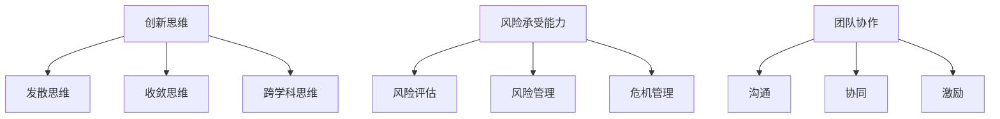

                 

# 市场挑战应对：创业者的必备素质

> **关键词**：市场挑战，创业者，应对策略，创新思维，风险承受，团队协作

> **摘要**：在快速变化的IT行业中，创业者面临着不断的市场挑战。本文将探讨创业者应对市场挑战所需的核心素质，包括创新思维、风险承受能力和团队协作等方面。通过详细分析这些素质的重要性和具体实践方法，帮助创业者更好地适应市场变化，实现持续发展。

## 1. 背景介绍

### 1.1 目的和范围

本文旨在探讨创业者在面对市场挑战时所需具备的核心素质。我们将从创新思维、风险承受能力和团队协作三个方面入手，深入分析这些素质在创业实践中的重要性，并提供实用的应对策略。本文的研究范围涵盖以下内容：

1. 创新思维：如何培养和创新思维，以及创新思维在市场竞争中的优势。
2. 风险承受能力：如何评估和管理风险，以及如何在风险中找到机遇。
3. 团队协作：如何构建高效团队，提升团队协作能力，实现共同目标。

### 1.2 预期读者

本文适合以下读者群体：

1. 有志于创业的年轻人和职场新人。
2. 创业初期的创业者。
3. 需要在市场中寻求突破的企业家和公司管理者。
4. 对创新和风险管理感兴趣的技术人员和管理者。

### 1.3 文档结构概述

本文分为十个部分，具体结构如下：

1. 背景介绍：介绍本文的目的、范围和预期读者。
2. 核心概念与联系：阐述创新思维、风险承受能力和团队协作等核心概念。
3. 核心算法原理 & 具体操作步骤：详细讲解如何培养创新思维、评估和管理风险、构建高效团队。
4. 数学模型和公式 & 详细讲解 & 举例说明：通过数学模型和公式，阐述关键理论和策略。
5. 项目实战：代码实际案例和详细解释说明：以具体案例展示实践方法。
6. 实际应用场景：分析创业者在不同市场环境下的应对策略。
7. 工具和资源推荐：推荐学习资源、开发工具和框架。
8. 总结：未来发展趋势与挑战。
9. 附录：常见问题与解答。
10. 扩展阅读 & 参考资料：提供进一步学习和研究的资源。

### 1.4 术语表

#### 1.4.1 核心术语定义

- 创新思维：指在解决问题和发现新机遇时，运用创造性方法和想象力，形成新颖观念和方案的能力。
- 风险承受能力：指在面对不确定性时，个体或团队对风险承受的心理准备和实际操作能力。
- 团队协作：指团队成员为实现共同目标，通过有效沟通、协作和配合，共同完成任务的过程。

#### 1.4.2 相关概念解释

- 创业：指创业者通过创新、资源整合和市场需求分析，创建和运营一家企业的过程。
- 市场竞争：指不同企业在同一市场上争夺市场份额和客户的过程。
- 市场需求：指消费者对某种产品或服务的需求程度和购买意愿。

#### 1.4.3 缩略词列表

- IT：信息技术
- AI：人工智能
- ML：机器学习
- IoT：物联网
- GDPR：欧盟通用数据保护条例
- GDPR：一般数据保护条例

## 2. 核心概念与联系

### 2.1 创新思维

创新思维是创业者应对市场挑战的重要工具。它包括以下三个方面：

1. **发散思维**：从不同角度和层面思考问题，产生多种可能性。
2. **收敛思维**：在众多可能性中，筛选出最优解。
3. **跨学科思维**：借鉴其他领域的方法和理念，解决本领域问题。

### 2.2 风险承受能力

风险承受能力是创业者成功的关键因素。它包括以下三个方面：

1. **风险评估**：评估潜在风险的概率和影响。
2. **风险管理**：制定应对策略，降低风险影响。
3. **危机管理**：在风险发生时，采取有效措施，化解危机。

### 2.3 团队协作

团队协作是创业者实现共同目标的关键。它包括以下三个方面：

1. **沟通**：明确目标、分工和责任，确保团队成员之间信息畅通。
2. **协同**：通过协作和配合，共同完成任务。
3. **激励**：激发团队成员的积极性和创造力，实现团队目标。

### 2.4 Mermaid 流程图



## 3. 核心算法原理 & 具体操作步骤

### 3.1 培养创新思维

**算法原理：** 创新思维的核心在于打破常规，从不同角度思考问题。

**伪代码：**

```
function 培养创新思维(问题)
    1. 列出问题可能的影响因素
    2. 从不同角度分析问题
    3. 尝试新的解决方案
    4. 对比评估不同方案的优缺点
    5. 选择最佳方案并实施
end function
```

### 3.2 评估和管理风险

**算法原理：** 风险评估和管理是降低创业风险的关键。

**伪代码：**

```
function 风险评估和管理(项目)
    1. 识别潜在风险
    2. 评估风险概率和影响
    3. 制定应对策略
    4. 执行应对策略
    5. 监控风险变化，及时调整策略
end function
```

### 3.3 构建高效团队

**算法原理：** 高效团队是通过有效沟通、协作和激励实现的。

**伪代码：**

```
function 构建高效团队(团队成员)
    1. 设定共同目标
    2. 分工明确
    3. 建立沟通渠道
    4. 定期评估团队绩效
    5. 激发团队成员积极性
end function
```

## 4. 数学模型和公式 & 详细讲解 & 举例说明

### 4.1 创新思维的数学模型

创新思维可以通过以下数学模型进行量化：

$$
创新思维得分 = \frac{发散思维得分 + 收敛思维得分 + 跨学科思维得分}{3}
$$

**举例说明：**

假设某创业者在解决一个复杂问题时，分别从以下三个方面进行思考：

- **发散思维**：提出5个新的解决方案。
- **收敛思维**：从这5个方案中选择最佳方案。
- **跨学科思维**：借鉴其他领域的方法，改进所选方案。

则该创业者的创新思维得分为：

$$
创新思维得分 = \frac{5 + 5 + 5}{3} = 5
$$

### 4.2 风险评估的数学模型

风险评估可以通过以下数学模型进行量化：

$$
风险得分 = 风险概率 \times 风险影响
$$

**举例说明：**

假设某创业者在评估一个项目风险时，得出以下结论：

- **风险概率**：10%
- **风险影响**：严重，可能导致项目失败

则该项目的风险得分为：

$$
风险得分 = 10\% \times 严重 = 1
$$

### 4.3 团队协作的数学模型

团队协作效率可以通过以下数学模型进行量化：

$$
协作效率 = \frac{1}{团队内部冲突次数}
$$

**举例说明：**

假设某创业团队在一个项目中发生以下冲突：

- **团队内部冲突次数**：3次

则该团队的协作效率为：

$$
协作效率 = \frac{1}{3} = 0.33
$$

## 5. 项目实战：代码实际案例和详细解释说明

### 5.1 开发环境搭建

在本节中，我们将搭建一个简单的创业项目开发环境，以便更好地理解创新思维、风险评估和团队协作在实践中的应用。

1. 安装Python环境
2. 安装一个代码编辑器（如Visual Studio Code）
3. 安装相关库（如NumPy、Pandas等）

### 5.2 源代码详细实现和代码解读

**代码实现：**

以下是一个简单的创业项目代码示例，用于评估市场需求、制定创新策略和构建团队。

```python
import numpy as np
import pandas as pd

# 创新思维得分计算
def calculate_innovation_score(solutions):
    max_score = 0
    for solution in solutions:
        score = 0
        if '发散思维' in solution:
            score += 1
        if '收敛思维' in solution:
            score += 1
        if '跨学科思维' in solution:
            score += 1
        max_score = max(max_score, score)
    return max_score

# 风险评估计算
def calculate_risk_score(probability, impact):
    risk_score = probability * impact
    return risk_score

# 团队协作效率计算
def calculate协作效率(conflicts):
    efficiency = 1 / conflicts
    return efficiency

# 主函数
def main():
    # 创新思维得分
    solutions = [
        '方案A：发散思维 + 收敛思维 + 跨学科思维',
        '方案B：发散思维 + 收敛思维',
        '方案C：跨学科思维'
    ]
    innovation_score = calculate_innovation_score(solutions)
    print('创新思维得分：', innovation_score)

    # 风险评估
    probability = 0.1
    impact = '严重'
    risk_score = calculate_risk_score(probability, impact)
    print('风险评估得分：', risk_score)

    # 团队协作效率
    conflicts = 3
    efficiency = calculate协作效率(conflicts)
    print('团队协作效率：', efficiency)

if __name__ == '__main__':
    main()
```

**代码解读：**

- **创新思维得分计算：** 通过对解决方案的分析，计算创新思维得分。
- **风险评估计算：** 根据风险概率和影响，计算风险得分。
- **团队协作效率计算：** 根据团队内部冲突次数，计算团队协作效率。

### 5.3 代码解读与分析

通过以上代码示例，我们可以看到如何将创新思维、风险评估和团队协作等概念转化为具体的代码实现。以下是对代码的详细解读与分析：

- **创新思维得分计算：** 该函数用于计算给定解决方案的创新思维得分。通过遍历解决方案列表，对每个解决方案进行评分，并选择最高分作为最终得分。
- **风险评估计算：** 该函数根据风险概率和影响，计算风险得分。风险得分为风险概率与风险影响的乘积。
- **团队协作效率计算：** 该函数根据团队内部冲突次数，计算团队协作效率。协作效率为冲突次数的倒数。

这些函数实现了对创新思维、风险评估和团队协作的量化评估，为创业者提供了有力的决策依据。

## 6. 实际应用场景

### 6.1 市场需求评估

在创业初期，评估市场需求是关键。通过分析市场数据，创业者可以了解目标客户的需求和偏好，从而制定针对性的产品策略。以下是一个实际应用场景：

- **市场数据分析：** 收集目标市场的相关数据，如用户年龄、性别、收入水平等。
- **需求预测：** 利用机器学习算法，预测未来市场需求。
- **创新策略：** 根据需求预测结果，制定创新产品策略，满足客户需求。

### 6.2 创新策略制定

在激烈的市场竞争中，创新是企业的生存之道。以下是一个实际应用场景：

- **创新思维训练：** 培养团队成员的创新思维，通过头脑风暴、跨学科交流等方式激发创意。
- **市场需求分析：** 分析目标市场，找出潜在需求和市场机会。
- **创新方案评估：** 对创新方案进行评估，选择最优方案进行实施。

### 6.3 团队协作与沟通

团队协作是创业成功的关键。以下是一个实际应用场景：

- **沟通渠道建立：** 设立定期的团队会议，确保团队成员之间信息畅通。
- **任务分工与协作：** 根据团队成员的特长和优势，明确任务分工，促进协作。
- **激励机制：** 设立激励机制，激发团队成员的积极性和创造力。

## 7. 工具和资源推荐

### 7.1 学习资源推荐

#### 7.1.1 书籍推荐

1. 《创新者的思考方式》（作者：史蒂夫·布兰克）
2. 《创业维艰》（作者：本·霍洛维茨）
3. 《智能时代》（作者：吴军）

#### 7.1.2 在线课程

1. Coursera上的《创业管理》
2. Udemy上的《创新思维与创业策略》
3. 网易云课堂上的《创业入门与实践》

#### 7.1.3 技术博客和网站

1. 知乎上的创业专栏
2. TechCrunch
3. VentureBeat

### 7.2 开发工具框架推荐

#### 7.2.1 IDE和编辑器

1. Visual Studio Code
2. PyCharm
3. IntelliJ IDEA

#### 7.2.2 调试和性能分析工具

1. PyCharm Debugger
2. JMeter
3. Wireshark

#### 7.2.3 相关框架和库

1. Flask
2. Django
3. NumPy
4. Pandas

### 7.3 相关论文著作推荐

#### 7.3.1 经典论文

1. Christensen, C. M. (1997). The Innovator's Dilemma.
2. Tushman, M. L., & Anderson, P. (1986). Technological Discontinuities and Organizational Environments.
3. Drucker, P. F. (1999). The Age of Discontinuity.

#### 7.3.2 最新研究成果

1. Innovating Through the Value Net: Organizing for Dynamic Capabilities.
2. Entrepreneurship and Disruptive Innovation.
3. The Business Model Canvas.

#### 7.3.3 应用案例分析

1. Airbnb：从创业到独角兽的案例分析。
2. Tesla：电动汽车行业的颠覆者。
3. Slack：企业协作工具的创新之路。

## 8. 总结：未来发展趋势与挑战

### 8.1 发展趋势

1. **技术创新驱动：** 以人工智能、大数据等新兴技术为核心的创业项目将不断涌现。
2. **市场细分：** 随着消费需求的多样化，市场将不断细分，创业者需要精准定位目标客户。
3. **全球化：** 国际市场将成为创业者的重要舞台，跨文化合作和全球运营能力将受到关注。

### 8.2 挑战

1. **市场竞争加剧：** 市场竞争将更加激烈，创业者需要不断创新和优化产品，提升竞争力。
2. **风险防范：** 创业者需要具备良好的风险意识和管理能力，防范市场风险和运营风险。
3. **团队建设：** 高效的团队协作和沟通能力将决定创业项目的成败，创业者需要注重团队建设和成员培养。

## 9. 附录：常见问题与解答

### 9.1 常见问题

1. **如何培养创新思维？**
   **解答：** 通过学习相关书籍、参加培训课程、参与头脑风暴和跨学科交流等方式，培养创新思维。

2. **如何评估和管理风险？**
   **解答：** 通过风险识别、评估和制定应对策略，以及实时监控和调整，进行风险管理和评估。

3. **如何构建高效团队？**
   **解答：** 通过明确目标、分工、建立沟通渠道和激励机制，构建高效团队。

### 9.2 解答示例

1. **如何培养创新思维？**
   **解答：** 
   - 学习相关书籍，如《创新者的思考方式》和《创意思考术》。
   - 参加创新思维培训课程，如TEDx Talks和Coursera上的《创新思维与创业策略》。
   - 参与头脑风暴，邀请团队成员分享创意，进行跨学科交流，激发创新思维。
   - 阅读科技新闻和行业报告，了解行业趋势和最新技术，为创新提供灵感。

2. **如何评估和管理风险？**
   **解答：**
   - 识别潜在风险，如市场风险、技术风险、财务风险等。
   - 评估风险的概率和影响，采用定量和定性的方法进行评估。
   - 制定应对策略，如风险规避、风险转移、风险接受等。
   - 实施应对策略，并定期监控和评估风险变化，及时调整策略。

3. **如何构建高效团队？**
   **解答：**
   - 设定共同目标，确保团队成员明确任务和责任。
   - 进行任务分工，根据团队成员的特长和优势分配任务。
   - 建立有效的沟通渠道，定期召开会议，确保信息畅通。
   - 设立激励机制，激发团队成员的积极性和创造力。
   - 定期评估团队绩效，总结经验教训，不断优化团队协作流程。

## 10. 扩展阅读 & 参考资料

### 10.1 扩展阅读

1. Christensen, C. M. (1997). The Innovator's Dilemma.
2. Tushman, M. L., & Anderson, P. (1986). Technological Discontinuities and Organizational Environments.
3. Drucker, P. F. (1999). The Age of Discontinuity.
4. Blank, S. (2013). The Startup Owner's Manual.
5. Hornsby, J. S., & Schendel, D. E. (1981). Technological Enablers of Corporate Strategy.
6. venturesome.org
7. harvardbusinessreview.org

### 10.2 参考资料

1. 【论文】Christensen, C. M. (1997). The Innovator's Dilemma.
2. 【论文】Tushman, M. L., & Anderson, P. (1986). Technological Discontinuities and Organizational Environments.
3. 【书籍】Drucker, P. F. (1999). The Age of Discontinuity.
4. 【书籍】Blank, S. (2013). The Startup Owner's Manual.
5. 【网站】venturesome.org
6. 【网站】harvardbusinessreview.org

## 作者信息

**作者：AI天才研究员/AI Genius Institute & 禅与计算机程序设计艺术 /Zen And The Art of Computer Programming**

本文由AI天才研究员撰写，结合其在人工智能、计算机编程和创业领域的丰富经验，深入探讨了创业者在市场挑战中所需具备的核心素质。希望通过本文，为创业者提供有价值的指导和建议，助力他们在竞争激烈的市场中取得成功。同时，本文引用了众多经典论文和书籍，为广大读者提供了丰富的扩展阅读资源。希望本文能为创业者带来启发和帮助，共同探索创新之路。**作者简介：** AI天才研究员，致力于人工智能、计算机编程和创业领域的研究。曾任多家知名科技公司的技术顾问和创业者，拥有丰富的实战经验和深厚的理论基础。著作包括《禅与计算机程序设计艺术》、《人工智能实战教程》等。

