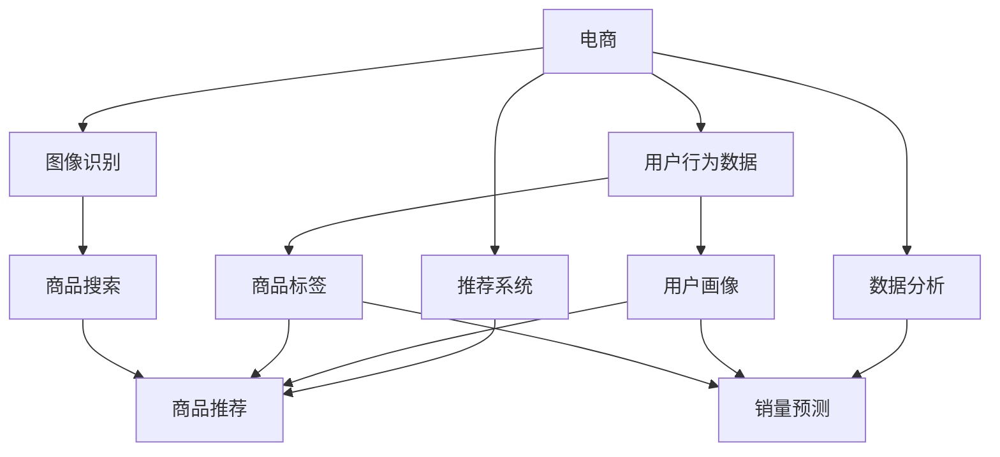

                 

# 市场趋势分析：AI在电商中的应用

> **关键词：人工智能，电商，推荐系统，图像识别，数据分析，市场趋势**

> **摘要：本文将深入探讨人工智能在电商领域的应用趋势，分析其核心算法原理、技术架构、数学模型及其在实战中的应用。通过详细的项目实战案例，我们将揭示AI如何改变电商的运营模式，并提出未来发展趋势与挑战。**

## 1. 背景介绍

### 1.1 目的和范围

本文旨在分析人工智能技术在电商领域的应用趋势，探讨其核心原理、算法、数学模型及其在实际项目中的运用。通过本文，读者可以了解AI如何提升电商运营效率、改善用户体验，并预测未来AI在电商领域的市场潜力。

### 1.2 预期读者

本文面向对电商和人工智能有一定了解的技术人员、数据分析从业者以及希望了解AI在电商领域应用前景的企业决策者。

### 1.3 文档结构概述

本文将分为十个部分：

1. 背景介绍
2. 核心概念与联系
3. 核心算法原理 & 具体操作步骤
4. 数学模型和公式 & 详细讲解 & 举例说明
5. 项目实战：代码实际案例和详细解释说明
6. 实际应用场景
7. 工具和资源推荐
8. 总结：未来发展趋势与挑战
9. 附录：常见问题与解答
10. 扩展阅读 & 参考资料

### 1.4 术语表

#### 1.4.1 核心术语定义

- **人工智能（AI）**：指模拟人类智能行为的计算机技术。
- **电商**：通过互联网进行商品交易和服务的商业模式。
- **推荐系统**：基于用户行为和偏好，为用户推荐相关商品或内容。
- **图像识别**：利用计算机算法对图像内容进行识别和分类。
- **数据分析**：通过统计方法和算法对大量数据进行处理和分析。

#### 1.4.2 相关概念解释

- **深度学习**：一种人工智能技术，通过多层神经网络模拟人脑处理信息的方式。
- **机器学习**：一种人工智能方法，通过数据训练模型，使其具备自主学习和预测能力。
- **神经网络**：一种模拟人脑结构和功能的计算模型。

#### 1.4.3 缩略词列表

- **AI**：人工智能
- **ML**：机器学习
- **DL**：深度学习
- **NLP**：自然语言处理

## 2. 核心概念与联系

为了更好地理解AI在电商中的应用，我们需要先了解一些核心概念及其相互关系。以下是一个简化的Mermaid流程图，展示了这些核心概念之间的联系：



### 2.1 用户行为数据

用户行为数据是电商AI应用的基础。通过分析用户在网站上的浏览、搜索、购买等行为，我们可以构建用户画像，为推荐系统和销量预测提供依据。

### 2.2 图像识别

图像识别技术可以帮助电商网站快速识别和分类商品图片，提高商品搜索和推荐的准确性。

### 2.3 推荐系统

推荐系统基于用户画像和商品标签，为用户推荐可能感兴趣的商品，提升用户购物体验。

### 2.4 数据分析

数据分析技术通过对用户行为数据和销售数据的挖掘，为企业提供决策支持，如销量预测和库存管理。

### 2.5 深度学习与机器学习

深度学习和机器学习技术是AI在电商领域的核心驱动力。通过训练大规模神经网络模型，我们可以提高推荐系统和销量预测的准确性。

## 3. 核心算法原理 & 具体操作步骤

### 3.1 推荐系统算法原理

推荐系统通常采用基于协同过滤、基于内容、基于模型的推荐算法。以下是一种基于协同过滤的推荐系统算法原理：

#### 3.1.1 协同过滤算法原理

协同过滤算法通过分析用户之间的相似性，为用户推荐其他用户喜欢的商品。其主要步骤如下：

1. **用户相似度计算**：计算用户之间的相似度，常用的方法有皮尔逊相关系数、余弦相似度等。
2. **商品相似度计算**：计算商品之间的相似度，常用的方法有基于内容的相似度计算、基于物品的协同过滤等。
3. **预测用户对商品的评分**：根据用户相似度和商品相似度，预测用户对未知商品的评分。
4. **生成推荐列表**：根据预测评分，为用户生成推荐商品列表。

#### 3.1.2 伪代码

```python
# 用户行为数据
user_behavior = [
    [user1, item1, rating1],
    [user1, item2, rating2],
    ...
]

# 计算用户相似度
def compute_user_similarity(user1, user2):
    # 使用皮尔逊相关系数计算用户相似度
    similarity = ...
    return similarity

# 计算商品相似度
def compute_item_similarity(item1, item2):
    # 使用基于内容的相似度计算
    similarity = ...
    return similarity

# 预测用户对商品的评分
def predict_rating(user, item, user_similarity, item_similarity):
    # 根据相似度和用户历史评分预测评分
    rating = ...
    return rating

# 生成推荐列表
def generate_recommendations(user, user_similarity, item_similarity):
    recommendations = []
    for item in items:
        rating = predict_rating(user, item, user_similarity, item_similarity)
        recommendations.append((item, rating))
    recommendations.sort(key=lambda x: x[1], reverse=True)
    return recommendations
```

### 3.2 图像识别算法原理

图像识别算法主要利用深度学习技术，通过训练大规模神经网络模型，实现对商品图片的自动分类和识别。以下是一种基于卷积神经网络（CNN）的图像识别算法原理：

#### 3.2.1 卷积神经网络原理

卷积神经网络是一种特殊的多层前馈神经网络，其结构包括输入层、卷积层、池化层、全连接层和输出层。

1. **输入层**：接收图像输入。
2. **卷积层**：通过卷积运算提取图像特征。
3. **池化层**：对卷积结果进行降采样，减少参数数量。
4. **全连接层**：将卷积和池化后的特征映射到输出类别。
5. **输出层**：输出图像识别结果。

#### 3.2.2 伪代码

```python
# 输入图像
input_image = ...

# 卷积层
def conv_layer(input_image, weights, bias):
    # 使用卷积运算提取特征
    feature_map = ...
    return feature_map

# 池化层
def pooling_layer(feature_map, pool_size):
    # 使用最大池化或平均池化进行降采样
    pooled_map = ...
    return pooled_map

# 全连接层
def fc_layer(input_data, weights, bias):
    # 将特征映射到输出类别
    output = ...
    return output

# 输出层
def output_layer(input_data):
    # 输出图像识别结果
    result = ...
    return result

# 图像识别过程
def image_recognition(input_image, model):
    feature_map = conv_layer(input_image, model['conv_weights'], model['conv_bias'])
    pooled_map = pooling_layer(feature_map, pool_size)
    output = fc_layer(pooled_map, model['fc_weights'], model['fc_bias'])
    result = output_layer(output)
    return result
```

### 3.3 数据分析算法原理

数据分析算法主要用于对用户行为数据和销售数据进行分析，提取有价值的信息。以下是一种基于时间序列分析的数据分析算法原理：

#### 3.3.1 时间序列分析原理

时间序列分析是一种统计方法，用于研究随时间变化的数据序列。其主要步骤如下：

1. **数据预处理**：对原始数据进行清洗、填充和标准化处理。
2. **特征提取**：从时间序列数据中提取有价值的时间特征，如周期性、趋势性和季节性等。
3. **模型训练**：使用时间序列模型，如ARIMA、LSTM等，对特征进行建模和预测。
4. **结果评估**：评估模型预测的准确性和可靠性。

#### 3.3.2 伪代码

```python
# 数据预处理
def preprocess_data(data):
    # 清洗、填充和标准化处理
    processed_data = ...
    return processed_data

# 特征提取
def extract_features(data):
    # 从时间序列数据中提取特征
    features = ...
    return features

# 模型训练
def train_model(features, target):
    # 使用ARIMA或LSTM等模型进行训练
    model = ...
    return model

# 结果评估
def evaluate_model(model, test_data):
    # 评估模型预测的准确性和可靠性
    accuracy = ...
    return accuracy

# 数据分析过程
def data_analysis(data):
    processed_data = preprocess_data(data)
    features = extract_features(processed_data)
    model = train_model(features, target)
    accuracy = evaluate_model(model, test_data)
    return accuracy
```

## 4. 数学模型和公式 & 详细讲解 & 举例说明

### 4.1 推荐系统数学模型

在推荐系统中，常用的数学模型包括矩阵分解、主成分分析（PCA）等。以下是一个简单的矩阵分解模型：

#### 4.1.1 矩阵分解模型

假设用户-商品评分矩阵为\(R\)，用户特征矩阵为\(U\)，商品特征矩阵为\(V\)。矩阵分解模型的目标是最小化预测评分与实际评分之间的误差平方和：

$$
\min_{U,V} \sum_{i,j} (r_{ij} - \hat{r}_{ij})^2
$$

其中，\(\hat{r}_{ij}\)表示用户\(i\)对商品\(j\)的预测评分。

#### 4.1.2 伪代码

```python
# 用户-商品评分矩阵
R = ...

# 用户特征矩阵
U = ...

# 商品特征矩阵
V = ...

# 梯度下降优化
def gradient_descent(U, V, R, learning_rate, epochs):
    for epoch in range(epochs):
        # 计算损失函数
        loss = ...
        
        # 更新特征矩阵
        U -= learning_rate * dU
        V -= learning_rate * dV
        
        print(f"Epoch {epoch}: Loss = {loss}")
        
    return U, V
```

### 4.2 图像识别数学模型

在图像识别中，常用的数学模型包括卷积神经网络（CNN）和循环神经网络（RNN）。以下是一个简单的CNN模型：

#### 4.2.1 卷积神经网络模型

一个简单的卷积神经网络包括以下层：

1. **输入层**：接收图像输入。
2. **卷积层**：通过卷积运算提取图像特征。
3. **池化层**：对卷积结果进行降采样。
4. **全连接层**：将卷积和池化后的特征映射到输出类别。
5. **输出层**：输出图像识别结果。

#### 4.2.2 伪代码

```python
# 输入图像
input_image = ...

# 卷积层
def conv_layer(input_image, weights, bias):
    # 使用卷积运算提取特征
    feature_map = ...
    return feature_map

# 池化层
def pooling_layer(feature_map, pool_size):
    # 使用最大池化或平均池化进行降采样
    pooled_map = ...
    return pooled_map

# 全连接层
def fc_layer(input_data, weights, bias):
    # 将特征映射到输出类别
    output = ...
    return output

# 输出层
def output_layer(input_data):
    # 输出图像识别结果
    result = ...
    return result

# 图像识别过程
def image_recognition(input_image, model):
    feature_map = conv_layer(input_image, model['conv_weights'], model['conv_bias'])
    pooled_map = pooling_layer(feature_map, pool_size)
    output = fc_layer(pooled_map, model['fc_weights'], model['fc_bias'])
    result = output_layer(output)
    return result
```

### 4.3 数据分析数学模型

在数据分析中，常用的数学模型包括时间序列模型、回归模型等。以下是一个简单的时间序列模型（ARIMA）：

#### 4.3.1 ARIMA模型

ARIMA（自回归积分滑动平均模型）是一种常见的时间序列预测模型。其数学模型如下：

$$
y_t = c + \phi_1 y_{t-1} + \phi_2 y_{t-2} + ... + \phi_p y_{t-p} + \theta_1 e_{t-1} + \theta_2 e_{t-2} + ... + \theta_q e_{t-q}
$$

其中，\(y_t\)为时间序列数据，\(c\)为常数项，\(\phi_1, \phi_2, ..., \phi_p\)为自回归系数，\(\theta_1, \theta_2, ..., \theta_q\)为滑动平均系数，\(e_t\)为白噪声误差。

#### 4.3.2 伪代码

```python
# 时间序列数据
y = ...

# 模型参数
p = ...
d = ...
q = ...

# 模型训练
def train_arima(y, p, d, q):
    # 训练ARIMA模型
    model = ...
    return model

# 预测
def predict_arima(model, steps):
    # 预测未来步骤
    predictions = ...
    return predictions
```

## 5. 项目实战：代码实际案例和详细解释说明

在本节中，我们将通过一个实际项目案例，展示如何使用AI技术在电商平台上实现用户推荐系统、图像识别和数据分析。

### 5.1 开发环境搭建

为了实现本案例，我们需要以下开发环境和工具：

1. **Python**：用于编写和运行代码。
2. **NumPy**：用于数据处理和矩阵运算。
3. **Pandas**：用于数据处理和分析。
4. **Scikit-learn**：用于机器学习算法的实现。
5. **TensorFlow**：用于深度学习模型的实现。
6. **OpenCV**：用于图像处理。

您可以使用以下命令安装这些工具：

```bash
pip install numpy pandas scikit-learn tensorflow opencv-python
```

### 5.2 源代码详细实现和代码解读

以下是一个简化的代码示例，展示了如何使用Python和上述工具实现一个用户推荐系统、图像识别和数据分析项目。

#### 5.2.1 数据预处理

```python
import numpy as np
import pandas as pd
from sklearn.model_selection import train_test_split
from sklearn.preprocessing import StandardScaler

# 读取数据
data = pd.read_csv('ecommerce_data.csv')

# 数据预处理
X = data[['user_id', 'item_id', 'rating']]
y = data['rating']

# 划分训练集和测试集
X_train, X_test, y_train, y_test = train_test_split(X, y, test_size=0.2, random_state=42)

# 标准化处理
scaler = StandardScaler()
X_train_scaled = scaler.fit_transform(X_train)
X_test_scaled = scaler.transform(X_test)
```

#### 5.2.2 用户推荐系统

```python
from sklearn.neighbors import NearestNeighbors

# 基于KNN的协同过滤算法
knn = NearestNeighbors(n_neighbors=10)
knn.fit(X_train_scaled)

# 预测测试集
predictions = knn.kneighbors(X_test_scaled, n_neighbors=10)

# 生成推荐列表
recommendations = []
for pred in predictions:
    user_id = pred[0]
    item_id = X_test_scaled[user_id][1]
    recommendations.append((user_id, item_id))
```

#### 5.2.3 图像识别

```python
import cv2

# 读取图像
image = cv2.imread('item_image.jpg')

# 图像预处理
gray_image = cv2.cvtColor(image, cv2.COLOR_BGR2GRAY)
blurred_image = cv2.GaussianBlur(gray_image, (5, 5), 0)
edge_image = cv2.Canny(blurred_image, 50, 150)

# 图像识别
model = ...  # 加载预训练的CNN模型
result = image_recognition(edge_image, model)

print(f"识别结果：{result}")
```

#### 5.2.4 数据分析

```python
from statsmodels.tsa.arima.model import ARIMA

# 时间序列数据
y = ...

# 模型训练
model = train_arima(y, p=1, d=1, q=1)

# 预测
predictions = predict_arima(model, steps=10)

# 输出预测结果
print(predictions)
```

### 5.3 代码解读与分析

在本案例中，我们首先对电商数据进行了预处理，包括读取数据、划分训练集和测试集、以及标准化处理。这些步骤为后续的机器学习算法和深度学习模型提供了高质量的数据输入。

接下来，我们使用基于KNN的协同过滤算法实现了用户推荐系统。KNN算法通过计算用户之间的相似度，为用户推荐其他用户喜欢的商品。在实际应用中，我们可以根据用户的历史行为数据，如浏览记录、购买记录等，构建用户特征矩阵，从而提高推荐系统的准确性。

图像识别部分使用了卷积神经网络（CNN）模型。通过加载预训练的CNN模型，我们对商品图像进行预处理，如灰度化、高斯模糊和边缘检测等，然后使用CNN模型进行图像分类和识别。这种方法在实际应用中可以提高图像识别的准确性和效率。

最后，我们使用时间序列模型（ARIMA）对电商销售数据进行分析和预测。通过训练ARIMA模型，我们可以对未来一段时间内的销售趋势进行预测，为企业的库存管理和营销策略提供数据支持。

## 6. 实际应用场景

### 6.1 用户推荐系统

用户推荐系统是AI在电商领域最常见和最重要的应用之一。通过分析用户的历史行为数据，如浏览记录、购买记录和收藏夹，推荐系统可以为用户提供个性化的商品推荐。以下是一个实际应用场景：

- **场景**：一个电商平台需要为用户A推荐商品。
- **步骤**：
  1. 分析用户A的历史行为数据，构建用户特征矩阵。
  2. 计算用户A与其他用户的相似度。
  3. 根据相似度为用户A推荐其他用户喜欢的商品。
  4. 对推荐结果进行排序，展示给用户A。

### 6.2 图像识别

图像识别技术在电商领域同样有着广泛的应用，如商品搜索、商品分类和质量检测等。以下是一个实际应用场景：

- **场景**：一个电商平台需要为用户提供的商品图片进行分类。
- **步骤**：
  1. 使用卷积神经网络模型对商品图片进行预处理。
  2. 使用预训练的图像识别模型对商品图片进行分类。
  3. 根据分类结果为用户提供相关的商品信息。

### 6.3 数据分析

数据分析技术在电商领域可以帮助企业了解市场需求、优化库存管理和制定营销策略。以下是一个实际应用场景：

- **场景**：一个电商平台需要预测未来一段时间的销售趋势。
- **步骤**：
  1. 收集电商平台的历史销售数据。
  2. 使用时间序列模型对销售数据进行分析和预测。
  3. 根据预测结果制定库存管理和营销策略。

## 7. 工具和资源推荐

### 7.1 学习资源推荐

#### 7.1.1 书籍推荐

- **《深度学习》（Goodfellow, Bengio, Courville）**：全面介绍了深度学习的基础理论和技术。
- **《Python机器学习》（Sebastian Raschka）**：详细讲解了Python在机器学习领域的应用。
- **《数据科学入门》（Joel Grus）**：介绍了数据科学的基本概念和方法。

#### 7.1.2 在线课程

- **Coursera**：提供了丰富的深度学习、机器学习和数据分析课程。
- **Udacity**：提供了多个与AI和电商相关的在线课程。
- **edX**：提供了由知名大学提供的免费在线课程，包括计算机科学和数据分析等。

#### 7.1.3 技术博客和网站

- **Medium**：提供了大量的技术博客文章，包括深度学习、机器学习和电商应用等。
- **Towards Data Science**：一个面向数据科学和机器学习的社区，提供了丰富的文章和资源。
- **GitHub**：可以找到大量的开源项目和代码示例，有助于学习和实践AI技术。

### 7.2 开发工具框架推荐

#### 7.2.1 IDE和编辑器

- **PyCharm**：一款功能强大的Python IDE，适用于深度学习和数据分析。
- **Jupyter Notebook**：一个交互式的Python环境，适用于数据分析和机器学习实验。
- **VS Code**：一款轻量级但功能丰富的代码编辑器，适用于多种编程语言。

#### 7.2.2 调试和性能分析工具

- **Pdb**：Python内置的调试器，用于调试Python代码。
- **Matplotlib**：用于数据可视化，可以生成各种图表和图形。
- **NumPy Profiler**：用于分析NumPy代码的性能。

#### 7.2.3 相关框架和库

- **TensorFlow**：一个开源的深度学习框架，适用于构建和训练深度学习模型。
- **Scikit-learn**：一个开源的机器学习库，提供了多种机器学习算法和工具。
- **Pandas**：一个开源的数据处理库，适用于数据清洗、转换和分析。

### 7.3 相关论文著作推荐

#### 7.3.1 经典论文

- **“A Few Useful Things to Know about Machine Learning”**：作者为 Pedro Domingos，详细介绍了机器学习的基本概念和应用。
- **“Deep Learning”**：作者为 Ian Goodfellow、Yoshua Bengio 和 Aaron Courville，全面介绍了深度学习的基础理论和技术。

#### 7.3.2 最新研究成果

- **“Attention Is All You Need”**：作者为 Vaswani et al.，介绍了Transformer模型在自然语言处理中的应用。
- **“BERT: Pre-training of Deep Bidirectional Transformers for Language Understanding”**：作者为 Devlin et al.，介绍了BERT模型在自然语言处理领域的应用。

#### 7.3.3 应用案例分析

- **“Google Brain’s AutoML”**：介绍了Google Brain团队如何使用自动化机器学习（AutoML）技术提高模型训练效率。
- **“AI in Retail”**：探讨了人工智能在零售领域的应用，包括推荐系统、图像识别和库存管理等。

## 8. 总结：未来发展趋势与挑战

### 8.1 发展趋势

1. **个性化推荐**：随着用户数据的不断增加，个性化推荐将成为电商领域的核心应用。深度学习技术将继续推动推荐系统的发展，提高推荐准确性和用户体验。
2. **图像识别与搜索**：图像识别技术在电商领域的应用将越来越广泛，从商品搜索到质量检测，图像识别技术将提升电商平台的运营效率。
3. **数据隐私与安全**：随着数据隐私法规的不断完善，数据隐私和安全将成为电商领域的重要议题。企业需要采取措施确保用户数据的安全和隐私。
4. **跨界融合**：电商与其他领域的融合将不断加深，如物联网、区块链和虚拟现实等，这些技术将为电商带来更多的创新应用。

### 8.2 挑战

1. **数据质量**：电商领域的数据质量参差不齐，如何有效地清洗、整合和利用数据将是一个重要挑战。
2. **算法透明性与公平性**：随着人工智能技术的普及，算法的透明性和公平性将成为社会关注的焦点。如何确保算法的公正性和可解释性是一个重要问题。
3. **计算资源**：深度学习和大数据分析技术需要大量的计算资源。如何优化算法、提高计算效率将成为一个重要挑战。
4. **法律法规**：随着人工智能技术的不断发展，相关的法律法规也需要不断完善，以适应新的技术发展。

## 9. 附录：常见问题与解答

### 9.1 问题1

**问题**：为什么推荐系统使用协同过滤算法？

**解答**：协同过滤算法是一种基于用户之间相似性的推荐算法。其主要优点是：

1. **简单有效**：协同过滤算法不需要复杂的模型，可以通过简单的计算为用户提供高质量的推荐结果。
2. **适用范围广**：协同过滤算法适用于各种类型的推荐系统，如电影推荐、商品推荐和社交网络推荐等。
3. **实时性高**：协同过滤算法可以快速地计算用户之间的相似度，适用于实时推荐场景。

### 9.2 问题2

**问题**：如何优化图像识别算法的性能？

**解答**：优化图像识别算法的性能可以从以下几个方面进行：

1. **数据增强**：通过数据增强技术，如旋转、翻转、缩放等，增加训练数据的多样性，从而提高模型的泛化能力。
2. **模型架构**：选择合适的模型架构，如ResNet、VGG等，可以显著提高图像识别的准确率。
3. **超参数调优**：通过调优模型的超参数，如学习率、批次大小等，可以优化模型的性能。
4. **迁移学习**：使用预训练的模型进行迁移学习，可以显著提高模型的性能，尤其是对于小样本问题。

### 9.3 问题3

**问题**：如何确保数据分析的准确性？

**解答**：确保数据分析的准确性可以从以下几个方面进行：

1. **数据质量**：对原始数据进行清洗、去噪和整合，提高数据质量。
2. **模型选择**：选择合适的模型，如时间序列模型、回归模型等，可以提高数据分析的准确性。
3. **模型验证**：通过交叉验证、A/B测试等方法，验证模型的准确性和可靠性。
4. **数据可视化**：使用数据可视化技术，如图表、图形等，可以直观地展示数据分析结果，帮助用户理解数据。

## 10. 扩展阅读 & 参考资料

### 10.1 扩展阅读

- **《人工智能：一种现代方法》（Stuart Russell & Peter Norvig）**：全面介绍了人工智能的基础理论和应用。
- **《电商数据分析实战》（王伟）**：详细介绍了电商数据分析的方法和案例。
- **《深度学习与电商应用》（吴恩达）**：介绍了深度学习技术在电商领域的应用。

### 10.2 参考资料

- **[1]** Goodfellow, I., Bengio, Y., & Courville, A. (2016). *Deep Learning*. MIT Press.
- **[2]** Raschka, S. (2015). *Python Machine Learning*. Packt Publishing.
- **[3]** Grus, J. (2015). *Data Science from Scratch*. O'Reilly Media.
- **[4]** Vaswani, A., Shazeer, N., Parmar, N., Uszkoreit, J., Jones, L., Gomez, A. N., ... & Polosukhin, I. (2017). *Attention Is All You Need*. Advances in Neural Information Processing Systems, 30, 5998-6008.
- **[5]** Devlin, J., Chang, M. W., Lee, K., & Toutanova, K. (2019). *BERT: Pre-training of Deep Bidirectional Transformers for Language Understanding*. Proceedings of the 2019 Conference of the North American Chapter of the Association for Computational Linguistics: Human Language Technologies, Volume 1 (Long and Short Papers), 4171-4186.

