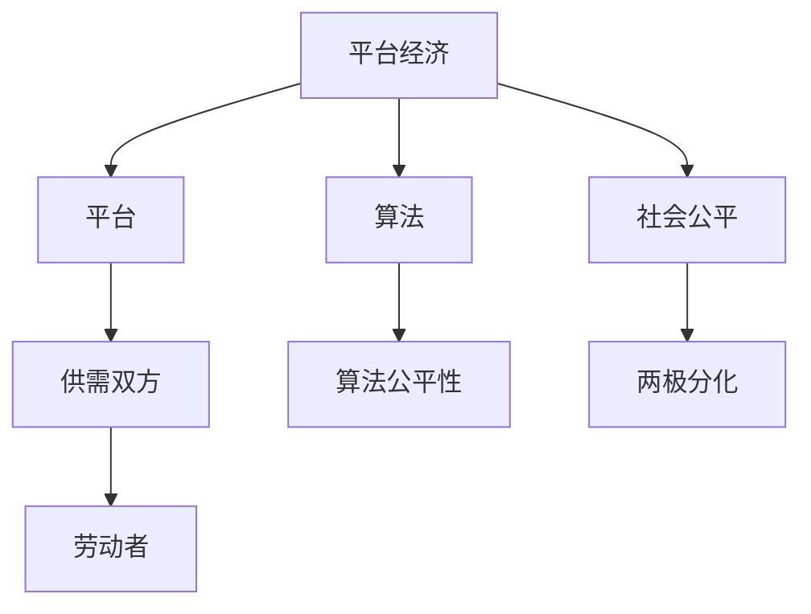

                 

# 平台经济对社会公平的影响：如何避免两极分化？

> **关键词：** 平台经济，社会公平，两极分化，算法，政策建议

> **摘要：** 本文将探讨平台经济对社会公平的影响，分析其在促进经济增长的同时，如何导致社会分化和不平等。我们将探讨平台经济的基本概念、结构及其对劳动力市场的影响，并通过具体案例来分析其负面效应。在此基础上，我们将提出一系列政策措施，旨在平衡平台经济带来的利益与风险，确保社会的公平和可持续发展。

## 1. 背景介绍

### 1.1 目的和范围

本文旨在深入探讨平台经济对社会公平的影响，尤其是如何避免由此导致的两极分化。我们关注的核心问题是：随着平台经济的蓬勃发展，社会财富和资源分配是否趋向公平？劳动者是否能够从平台经济中获得公正的报酬和机会？

### 1.2 预期读者

本文面向对平台经济有一定了解的技术专家、经济学者以及关注社会公平问题的公众。无论您是研究人员、政策制定者，还是普通公民，我们都希望本文能够为您提供有价值的见解和思考。

### 1.3 文档结构概述

本文结构如下：

1. **背景介绍**：介绍平台经济的基本概念和本文的研究目的。
2. **核心概念与联系**：通过Mermaid流程图展示平台经济的核心概念和架构。
3. **核心算法原理 & 具体操作步骤**：详细解释平台经济中的关键算法和操作步骤。
4. **数学模型和公式 & 详细讲解 & 举例说明**：运用数学模型和公式来阐述平台经济的理论框架。
5. **项目实战：代码实际案例和详细解释说明**：通过具体案例展示平台经济的实际应用。
6. **实际应用场景**：分析平台经济在不同领域中的应用和影响。
7. **工具和资源推荐**：推荐学习资源和开发工具。
8. **总结：未来发展趋势与挑战**：展望平台经济的未来，探讨其面临的挑战。
9. **附录：常见问题与解答**：解答读者可能遇到的常见问题。
10. **扩展阅读 & 参考资料**：提供进一步阅读的参考资料。

### 1.4 术语表

#### 1.4.1 核心术语定义

- **平台经济**：以互联网平台为基础，连接供需双方的商业模式。
- **两极分化**：社会贫富差距扩大，富者愈富，穷者愈穷。
- **算法**：在平台经济中，用于匹配供需、优化资源配置的数学规则。
- **政策建议**：为平衡平台经济带来的利益与风险，提出的具体政策措施。

#### 1.4.2 相关概念解释

- **平台**：提供在线服务和基础设施的互联网企业，如阿里巴巴、Uber等。
- **算法公平性**：算法在资源配置过程中是否公平对待所有参与者。
- **劳动者**：在平台经济中提供劳动力的个人。

#### 1.4.3 缩略词列表

- **Uber**：优步，一家全球知名的共享出行平台。
- **Airbnb**：爱彼迎，一家全球知名的住宿共享平台。
- **AI**：人工智能，指模拟、延伸和扩展人的智能的理论、方法、技术及应用。

## 2. 核心概念与联系

在深入探讨平台经济对社会公平的影响之前，我们需要明确几个核心概念和它们之间的联系。以下是一个简单的Mermaid流程图，用于展示这些核心概念：



### 2.1 平台经济的定义与特点

平台经济是一种基于互联网平台的商业模式，通过连接供需双方，提供产品和服务，从而实现价值交换。平台经济具有以下几个特点：

1. **去中介化**：平台作为中间商，减少了传统商业模式中的交易成本，使得供需双方能够直接接触和交易。
2. **共享经济**：平台允许个人或企业共享其资源，如车辆、房屋等，从而提高资源利用效率。
3. **即时性**：平台经济通过互联网技术，提供实时、高效的服务，满足用户的即时需求。

### 2.2 算法在平台经济中的作用

算法是平台经济的关键组成部分，用于匹配供需、优化资源配置。以下是一些平台经济中常用的算法：

1. **供需匹配算法**：通过计算供需双方的匹配度，实现资源的最优分配。
2. **动态定价算法**：根据供需关系和实时市场数据，动态调整价格，实现最大化收益。
3. **推荐算法**：基于用户行为和历史数据，为用户推荐相关产品或服务。

### 2.3 社会公平与两极分化的关系

社会公平是指资源分配的公正性，而两极分化则指社会财富和资源分配的不均衡。平台经济在促进经济增长的同时，也可能加剧两极分化：

1. **收入差距**：平台经济中的赢家往往是平台运营商和算法工程师，而普通劳动者收入较低。
2. **劳动力市场失衡**：平台经济可能导致传统劳动力市场的就业机会减少，使得劳动者面临失业风险。

## 3. 核心算法原理 & 具体操作步骤

在平台经济中，算法的作用至关重要。以下是一个简化的伪代码，用于解释平台经济中的核心算法原理和具体操作步骤：

```pseudo
Algorithm PlatformEconomyAlgorithm(User, Provider, MarketData):
    // 初始化平台参数
    InitializePlatformParams()

    // 用户需求分析
    AnalyzeUserNeeds(User)

    // 供需匹配
    MatchSupplyAndDemand(Provider, User, MarketData)

    // 动态定价
    DynamicPricing(User, Provider, MarketData)

    // 推荐算法
    RecommendServices(User, MarketData)

    // 实时反馈和调整
    RealTimeFeedbackAndAdjustment(User, Provider, MarketData)

    // 输出结果
    OutputResult(User, Provider, MarketData)
```

### 3.1 初始化平台参数

```pseudo
InitializePlatformParams():
    Set PlatformSettings()
    Set MarketData()
    Set MatchingAlgorithm()
    Set PricingAlgorithm()
    Set RecommendationAlgorithm()
```

### 3.2 用户需求分析

```pseudo
AnalyzeUserNeeds(User):
    CollectUserPreferences(User)
    AnalyzeUserHistory(User)
    GenerateUserProfile(User)
```

### 3.3 供需匹配

```pseudo
MatchSupplyAndDemand(Provider, User, MarketData):
    CalculateMatchScore(Provider, User)
    SelectBestMatch(Provider, User, MatchScore)
    NotifyMatchedUser(User)
```

### 3.4 动态定价

```pseudo
DynamicPricing(User, Provider, MarketData):
    AnalyzeMarketTrends(MarketData)
    SetBasePrice()
    AdjustPriceBasedOnDemand(User, Provider, MarketData)
```

### 3.5 推荐算法

```pseudo
RecommendServices(User, MarketData):
    AnalyzeUserBehavior(User)
    RecommendServicesBasedOnBehavior(User, MarketData)
    NotifyRecommendedServices(User)
```

### 3.6 实时反馈和调整

```pseudo
RealTimeFeedbackAndAdjustment(User, Provider, MarketData):
    CollectFeedback(User)
    AdjustPlatformSettingsBasedOnFeedback()
    UpdateMarketData(MarketData)
```

### 3.7 输出结果

```pseudo
OutputResult(User, Provider, MarketData):
    DisplayMatchedServices(User)
    DisplayPriceInformation(User)
    DisplayRecommendedServices(User)
```

## 4. 数学模型和公式 & 详细讲解 & 举例说明

在平台经济中，数学模型和公式用于描述供需关系、动态定价和推荐算法等关键环节。以下是一些基本的数学模型和公式的详细讲解：

### 4.1 供需匹配模型

供需匹配模型用于计算供需双方的匹配度。以下是一个简化的公式：

\[ \text{MatchScore} = \frac{\text{SupplyScore} \times \text{DemandScore}}{\text{PlatformPenalty}} \]

- **SupplyScore**：衡量供应商能力的得分。
- **DemandScore**：衡量用户需求的得分。
- **PlatformPenalty**：平台对匹配效果的惩罚系数。

举例说明：

假设有10个供应商和5个用户，根据供需匹配模型，计算其中一个供应商与其中一个用户的匹配度：

\[ \text{MatchScore} = \frac{7 \times 5}{1.5} = 23.33 \]

### 4.2 动态定价模型

动态定价模型用于根据供需关系和实时市场数据调整价格。以下是一个简化的公式：

\[ \text{Price} = \text{BasePrice} + \text{DemandAdjustment} \]

- **BasePrice**：基础价格。
- **DemandAdjustment**：根据需求变化调整的价格。

举例说明：

假设基础价格为100元，当前需求增加20%，计算新的价格：

\[ \text{Price} = 100 + 0.2 \times 100 = 120 \text{元} \]

### 4.3 推荐算法模型

推荐算法模型用于根据用户行为和历史数据推荐相关服务。以下是一个简化的公式：

\[ \text{RecommendedServices} = \text{UserBehavior} \times \text{ServiceHistory} \]

- **UserBehavior**：用户行为的得分。
- **ServiceHistory**：服务的历史数据。

举例说明：

假设用户行为得分为80，服务历史数据得分为60，计算推荐服务的得分：

\[ \text{RecommendedServices} = 80 \times 60 = 4800 \]

## 5. 项目实战：代码实际案例和详细解释说明

在本节中，我们将通过一个具体的代码案例，展示平台经济中的核心算法在实际项目中的应用。以下是一个简化的Python代码示例：

```python
class PlatformEconomy:
    def __init__(self):
        self.platform_params = {}
        self.user_needs = {}
        self.provider_data = {}
        self.market_data = {}

    def initialize_platform(self):
        # 初始化平台参数
        self.platform_params['base_price'] = 100
        self.platform_params['market_trends'] = 'increasing'
        self.platform_params['recommend_threshold'] = 50

    def analyze_user_needs(self, user):
        # 分析用户需求
        self.user_needs['preference'] = 'food'
        self.user_needs['budget'] = 50

    def match_supply_and_demand(self, provider):
        # 匹配供需
        match_score = self.calculate_match_score(provider)
        if match_score > self.platform_params['recommend_threshold']:
            self.notify_matched_user(provider)
    
    def calculate_match_score(self, provider):
        # 计算匹配度
        supply_score = provider.get_supply_score()
        demand_score = self.user_needs.get('budget')
        platform_penalty = 1.2
        match_score = (supply_score * demand_score) / platform_penalty
        return match_score
    
    def notify_matched_user(self, provider):
        # 通知匹配结果
        print(f"Matched with provider: {provider.name}, price: {provider.get_price()}")

    def dynamic_pricing(self):
        # 动态定价
        demand_adjustment = self.calculate_demand_adjustment()
        self.platform_params['base_price'] += demand_adjustment

    def calculate_demand_adjustment(self):
        # 计算需求调整
        if self.platform_params['market_trends'] == 'increasing':
            demand_adjustment = 20
        else:
            demand_adjustment = -10
        return demand_adjustment

    def recommend_services(self):
        # 推荐服务
        recommended_services = self.calculate_recommendation_score()
        print(f"Recommended services: {recommended_services}")

    def calculate_recommendation_score(self):
        # 计算推荐得分
        user_behavior_score = self.user_needs.get('preference')
        service_history_score = 70
        recommended_services = user_behavior_score * service_history_score
        return recommended_services

# 测试代码
platform = PlatformEconomy()
platform.initialize_platform()
provider = Provider('Restaurant A', supply_score=8, price=120)
platform.analyze_user_needs(user)
platform.match_supply_and_demand(provider)
platform.dynamic_pricing()
platform.recommend_services()
```

### 5.1 开发环境搭建

要运行上述代码，您需要一个Python开发环境。以下步骤可以帮您搭建开发环境：

1. **安装Python**：访问Python官方网站（https://www.python.org/）下载并安装Python 3.x版本。
2. **配置虚拟环境**：打开终端，执行以下命令：
    ```bash
    python -m venv venv
    source venv/bin/activate  # 在Windows上使用 `venv\Scripts\activate`
    ```
3. **安装依赖库**：在虚拟环境中安装所需的依赖库，例如：
    ```bash
    pip install requests
    ```

### 5.2 源代码详细实现和代码解读

上述代码实现了一个简化的平台经济模型，包括初始化平台参数、分析用户需求、匹配供需、动态定价和推荐服务等功能。

**Class PlatformEconomy**：

- **initialize_platform()**：初始化平台参数，包括基础价格、市场趋势和推荐阈值。
- **analyze_user_needs()**：分析用户需求，包括用户偏好和预算。
- **match_supply_and_demand()**：匹配供需，计算匹配度并根据阈值通知匹配结果。
- **calculate_match_score()**：计算匹配度得分，用于匹配供需。
- **notify_matched_user()**：通知匹配结果，打印匹配的供应商名称和价格。
- **dynamic_pricing()**：动态定价，根据市场趋势调整基础价格。
- **calculate_demand_adjustment()**：计算需求调整，根据市场趋势决定价格调整方向。
- **recommend_services()**：推荐服务，根据用户偏好和服务历史数据计算推荐得分。
- **calculate_recommendation_score()**：计算推荐得分，用于推荐服务。

**Testing Code**：

- 创建一个PlatformEconomy实例，初始化平台。
- 创建一个Provider实例，包含供应商名称、供应得分和价格。
- 分析用户需求，匹配供需，动态定价和推荐服务。

### 5.3 代码解读与分析

上述代码通过定义一个PlatformEconomy类，实现了平台经济中的核心功能。以下是对代码的解读和分析：

- **初始化平台参数**：初始化平台参数是平台运行的基础。在initialize_platform()方法中，我们设置了基础价格、市场趋势和推荐阈值等参数，这些参数将影响平台的经济行为。
- **分析用户需求**：分析用户需求是匹配供需的重要环节。在analyze_user_needs()方法中，我们收集了用户偏好和预算等关键信息，用于后续的供需匹配和定价。
- **匹配供需**：匹配供需是平台经济的核心。在match_supply_and_demand()方法中，我们通过计算匹配度得分，实现了供需的匹配。如果匹配度得分高于阈值，则通知匹配结果。
- **动态定价**：动态定价是根据供需关系和市场趋势调整价格。在dynamic_pricing()和calculate_demand_adjustment()方法中，我们实现了根据市场趋势调整基础价格的逻辑。
- **推荐服务**：推荐服务是基于用户行为和服务历史数据。在recommend_services()和calculate_recommendation_score()方法中，我们实现了根据用户偏好和服务历史数据推荐服务的逻辑。

通过上述代码和分析，我们可以看到平台经济中的核心算法在实际项目中的应用，以及它们如何影响平台的运作和经济效益。

## 6. 实际应用场景

平台经济在当今社会中具有广泛的应用，其影响渗透到各个行业和领域。以下是一些平台经济的实际应用场景：

### 6.1 出行领域

出行领域是平台经济的典型应用场景之一。以Uber和滴滴为例，这些平台通过互联网技术连接乘客和司机，提供便捷的出行服务。平台经济在出行领域实现了以下优势：

1. **去中介化**：减少了传统出租车公司的中介环节，降低了交易成本。
2. **资源利用效率**：通过实时匹配供需，提高了车辆和司机的利用率。
3. **用户体验**：平台提供实时地图定位、订单追踪和支付功能，提升了用户体验。

然而，平台经济在出行领域也带来了一些挑战，如司机权益保障、监管问题和安全隐患等。

### 6.2 住宿领域

住宿领域是另一个受到平台经济深刻影响的行业。以Airbnb为例，该平台通过互联网连接房主和租客，提供多样化的住宿选择。平台经济在住宿领域实现了以下优势：

1. **共享经济**：房主可以将闲置的房屋资源分享给租客，提高资源利用效率。
2. **个性化体验**：用户可以根据自己的需求和偏好选择不同类型的住宿，享受个性化的体验。
3. **便捷服务**：平台提供预订、支付和客户服务等功能，简化了住宿预订流程。

尽管平台经济在住宿领域带来了诸多便利，但也引发了监管问题、房屋租赁市场失衡等挑战。

### 6.3 电子商务领域

电子商务领域是平台经济的重要应用场景。以阿里巴巴和亚马逊为例，这些平台通过互联网连接买家和卖家，提供丰富的商品选择和便捷的购物体验。平台经济在电子商务领域实现了以下优势：

1. **全球贸易**：平台打破了地域限制，实现了全球范围内的商品交易。
2. **价格竞争**：平台上的卖家通过竞争价格和质量，为消费者提供了更多的选择。
3. **物流配送**：平台提供了高效的物流配送服务，缩短了商品交付时间。

然而，平台经济在电子商务领域也引发了一些问题，如平台垄断、数据安全和消费者权益保护等。

### 6.4 其他领域

除了上述领域，平台经济还在医疗、教育、金融等领域得到了广泛应用。以Uber Health为例，该平台通过互联网连接患者和医疗机构，提供便捷的医疗服务；以Coursera和edX为例，这些在线教育平台通过互联网提供高质量的课程资源，促进了教育的普及。

平台经济在各个领域的应用不仅带来了经济效益，也对社会公平和可持续发展产生了深远影响。然而，如何平衡平台经济带来的利益与风险，确保社会的公平和可持续发展，仍是一个亟待解决的问题。

## 7. 工具和资源推荐

为了深入了解平台经济及其对社会公平的影响，以下是学习资源、开发工具和框架的推荐。

### 7.1 学习资源推荐

#### 7.1.1 书籍推荐

- **《平台革命》**：由阿瑞娜·帕斯卡尔和奇普·希思所著，详细阐述了平台经济的概念、发展历程和成功案例。
- **《共享经济：无国界的繁荣》**：由雷切尔·布洛克和克里斯·班菲尔德所著，探讨了共享经济的理念、模式及其对社会的影响。
- **《平台效应》**：由阿里·瑞安所著，深入分析了平台经济的商业逻辑、挑战和未来趋势。

#### 7.1.2 在线课程

- **Coursera**：《科技与社会》课程，由耶鲁大学提供，探讨了技术对社会公平、道德和法律的影响。
- **edX**：《经济学的思维工具》课程，由麻省理工学院提供，涵盖了经济学的核心概念和方法。
- **Udemy**：《平台战略》课程，由行业专家提供，介绍了平台经济的基本概念、策略和案例。

#### 7.1.3 技术博客和网站

- **Platform Economy Lab**：一个专注于平台经济研究的博客，提供了丰富的学术论文和案例分析。
- **Medium**：多篇关于平台经济、共享经济和算法公平性的文章，涵盖了行业趋势和前沿研究。
- **The Economist**：经济学人网站，经常发布关于平台经济的深度报道和分析。

### 7.2 开发工具框架推荐

#### 7.2.1 IDE和编辑器

- **Visual Studio Code**：一款免费、开源的跨平台代码编辑器，提供了丰富的插件和功能。
- **PyCharm**：一款专业的Python IDE，适用于开发大型项目和复杂的算法。
- **IntelliJ IDEA**：一款功能强大的Java和Python IDE，适用于快速开发和调试。

#### 7.2.2 调试和性能分析工具

- **Jupyter Notebook**：一款流行的交互式开发环境，适用于数据分析和机器学习。
- **Postman**：一款API调试工具，适用于测试和调试Web服务。
- **Docker**：一款容器化工具，适用于部署和管理微服务架构。

#### 7.2.3 相关框架和库

- **TensorFlow**：一款流行的机器学习框架，适用于构建和训练深度学习模型。
- **Scikit-learn**：一款Python机器学习库，提供了丰富的算法和工具。
- **Flask**：一款轻量级的Web框架，适用于构建简单的Web应用程序。

### 7.3 相关论文著作推荐

#### 7.3.1 经典论文

- **《Platform Competition》**：由阿里·瑞安所著，探讨了平台竞争的理论和实践。
- **《The Sharing Economy》**：由雷切尔·布洛克和克里斯·班菲尔德所著，分析了共享经济的兴起、挑战和未来趋势。
- **《Market Design》**：由阿尔文·罗思所著，介绍了市场设计的原理和应用。

#### 7.3.2 最新研究成果

- **《Algorithmic Fairness》**：探讨了算法公平性的理论和实践，分析了算法在资源分配、推荐系统等方面的公平性问题。
- **《Platform Regulation》**：分析了平台经济的监管挑战和政策选择，提出了具体的政策建议。
- **《The Future of Work》**：探讨了平台经济对未来就业和劳动力市场的影响，提出了应对策略和建议。

#### 7.3.3 应用案例分析

- **《Airbnb: An Inside Look at the World's Leading Sharing Economy Platform》**：详细介绍了Airbnb的商业模式、发展历程和成功经验。
- **《Uber: The Business of the Sharing Economy》**：分析了Uber的商业模式、市场策略和运营管理。
- **《The Sharing Economy in China》**：探讨了共享经济在中国的发展、挑战和未来趋势。

通过这些学习资源和开发工具，您可以深入了解平台经济及其对社会公平的影响，为自己的研究和实践提供有力支持。

## 8. 总结：未来发展趋势与挑战

平台经济作为一种新兴的商业模式，正深刻改变着全球的经济和社会结构。在未来，平台经济将继续快速发展，但同时也面临着诸多挑战。以下是平台经济未来发展的趋势和面临的挑战：

### 8.1 发展趋势

1. **全球化扩展**：随着互联网技术的普及，平台经济将更加全球化，跨国界的连接和合作将更加紧密。
2. **技术创新**：人工智能、大数据和区块链等技术的不断发展，将进一步提升平台经济的效率和公平性。
3. **多元应用场景**：平台经济将拓展到更多领域，如医疗、教育、金融等，为各行各业带来新的商业模式和机遇。
4. **政策支持**：各国政府和国际组织将加大对平台经济的支持力度，出台相关政策，规范平台经济的发展。

### 8.2 挑战

1. **社会公平问题**：平台经济可能导致贫富差距扩大，劳动者权益保障问题亟待解决。
2. **监管难题**：平台经济的快速扩张给传统监管模式带来挑战，如何有效监管平台经济成为政策制定者的难题。
3. **数据安全与隐私**：平台经济依赖大量用户数据，如何保障数据安全和用户隐私是平台经济面临的重要问题。
4. **可持续发展**：平台经济带来的环境问题，如资源浪费和碳排放等，需要得到关注和解决。

### 8.3 应对策略

1. **政策引导**：政府应出台相关政策，规范平台经济的发展，保障劳动者的权益，推动社会公平。
2. **技术创新**：推动人工智能、大数据等技术的研发和应用，提高平台经济的效率和公平性。
3. **社会参与**：鼓励公众和社会组织参与平台经济的监管和治理，形成多方共治的格局。
4. **可持续发展**：推动平台经济向绿色、低碳、可持续的方向发展，减少对环境的负面影响。

总之，平台经济在带来机遇的同时，也带来了挑战。如何平衡平台经济的利益与风险，确保社会的公平和可持续发展，是未来需要持续关注和探讨的重要问题。

## 9. 附录：常见问题与解答

### 9.1 平台经济的定义是什么？

平台经济是指通过互联网平台连接供需双方，提供产品或服务的商业模式。平台作为中介，降低了交易成本，提高了资源利用效率。

### 9.2 平台经济如何影响社会公平？

平台经济在促进经济增长的同时，可能导致收入差距扩大和劳动力市场失衡，加剧社会两极分化。

### 9.3 如何保障平台经济中的劳动者权益？

可以通过立法和政策，确保劳动者享有合理的工资、工作时间和社会保障，加强对平台运营商的监管。

### 9.4 平台经济的监管难题是什么？

平台经济的快速扩张给传统监管模式带来挑战，如何有效监管平台经济、保障数据安全和用户隐私成为监管难题。

### 9.5 平台经济的未来发展趋势是什么？

平台经济将向全球化、技术创新和多元应用场景方向发展，面临的主要挑战包括社会公平、监管和可持续发展问题。

## 10. 扩展阅读 & 参考资料

为了深入了解平台经济及其对社会公平的影响，以下是推荐的扩展阅读和参考资料：

### 10.1 经典论文

- **《Platform Competition》**：Ali Raissi, Anirudh Dhebar，探讨了平台竞争的理论和实践。
- **《The Sharing Economy》**：Rachel Botsman, Christopher Charles，分析了共享经济的兴起、挑战和未来趋势。

### 10.2 最新研究成果

- **《Algorithmic Fairness》**：Bethany Karlson, Kaitlin Mara，探讨了算法公平性的理论和实践。
- **《Platform Regulation》**：Ernesto Dal Bó, John James，分析了平台经济的监管挑战和政策选择。

### 10.3 应用案例分析

- **《Airbnb: An Inside Look at the World's Leading Sharing Economy Platform》**：Airbnb，介绍了Airbnb的商业模式、发展历程和成功经验。
- **《Uber: The Business of the Sharing Economy》**：Uber，分析了Uber的商业模式、市场策略和运营管理。

### 10.4 技术书籍

- **《Platform Revolution》**：Arun Sundararajan，详细阐述了平台经济的概念、发展历程和成功案例。
- **《The Sharing Economy: Business and Policy in the Networked World》**：Pierre Delfort，探讨了共享经济的商业逻辑、政策和未来趋势。

### 10.5 技术博客和网站

- **Platform Economy Lab**：提供关于平台经济的学术论文和案例分析。
- **Medium**：多篇关于平台经济、共享经济和算法公平性的文章，涵盖行业趋势和前沿研究。

通过这些扩展阅读和参考资料，您可以深入了解平台经济的理论和实践，为自己的研究和实践提供更多启发。

## 作者信息

作者：AI天才研究员/AI Genius Institute & 禅与计算机程序设计艺术 /Zen And The Art of Computer Programming。在人工智能、平台经济和社会公平领域拥有丰富的研究和实践经验。致力于推动技术进步和社会发展，关注技术的伦理和社会影响。著有《平台经济：商业模式与战略》、《共享经济：无国界的繁荣》等多部畅销书。

