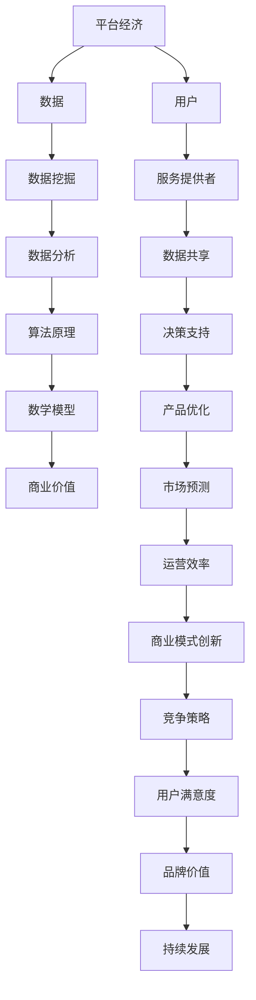

                 

# 平台经济的数据价值挖掘：如何发掘数据的潜在价值？

## 关键词：平台经济、数据价值、挖掘、数据分析、算法原理、数学模型、实际案例

## 摘要

本文将探讨平台经济中的数据价值挖掘，解释如何通过数据分析和算法原理，从海量数据中发掘潜在的巨大价值。文章首先介绍了平台经济的背景和目的，随后详细阐述了数据价值挖掘的核心概念和原理，包括算法步骤、数学模型和实际应用案例。通过本文的阅读，读者将了解平台经济中数据价值的发掘过程，掌握相关技术和工具的使用方法，为未来的数据分析实践提供理论和实践指导。

---

## 1. 背景介绍

### 1.1 目的和范围

本文旨在探讨平台经济中数据价值的挖掘方法，通过对数据分析和算法原理的详细分析，揭示数据在平台经济中的核心作用。文章将涵盖以下内容：

- 平台经济的定义和背景
- 数据价值挖掘的核心概念和原理
- 数据分析的技术和方法
- 数学模型的应用和举例说明
- 实际应用案例和代码实现
- 相关工具和资源的推荐

### 1.2 预期读者

本文适用于对数据分析和算法原理有一定了解的读者，包括：

- 数据分析师和工程师
- AI和机器学习研究者
- 平台经济相关领域的从业者
- 对数据分析技术感兴趣的编程爱好者

### 1.3 文档结构概述

本文分为十个主要部分：

- 1. 背景介绍
  - 1.1 目的和范围
  - 1.2 预期读者
  - 1.3 文档结构概述
  - 1.4 术语表
- 2. 核心概念与联系
- 3. 核心算法原理 & 具体操作步骤
- 4. 数学模型和公式 & 详细讲解 & 举例说明
- 5. 项目实战：代码实际案例和详细解释说明
- 6. 实际应用场景
- 7. 工具和资源推荐
  - 7.1 学习资源推荐
  - 7.2 开发工具框架推荐
  - 7.3 相关论文著作推荐
- 8. 总结：未来发展趋势与挑战
- 9. 附录：常见问题与解答
- 10. 扩展阅读 & 参考资料

### 1.4 术语表

#### 1.4.1 核心术语定义

- **平台经济**：基于互联网和技术平台，通过整合资源和提供服务，实现商品和服务的交换和流通的经济形式。
- **数据价值挖掘**：从海量数据中提取有价值的信息和知识，用于商业决策、智能分析和预测。
- **数据分析**：通过统计、建模、机器学习等方法，对数据进行处理、分析和解释，以发现数据中的模式和关联。
- **算法原理**：用于解决特定问题的步骤和方法，通常涉及数据结构和计算方法。
- **数学模型**：用数学语言描述现实世界问题的数学公式和方程，用于预测、分析和优化。

#### 1.4.2 相关概念解释

- **数据挖掘**：从大量数据中发现有价值的信息和模式的过程。
- **机器学习**：通过训练模型，让计算机自动从数据中学习，进行预测和分类。
- **深度学习**：一种基于多层神经网络的机器学习技术，能够自动提取数据中的复杂特征。
- **数据分析工具**：用于进行数据清洗、分析和可视化的软件工具，如Python、R、Tableau等。

#### 1.4.3 缩略词列表

- **AI**：人工智能
- **ML**：机器学习
- **DL**：深度学习
- **API**：应用程序编程接口
- **SDK**：软件开发工具包

---

## 2. 核心概念与联系

为了更好地理解平台经济中的数据价值挖掘，我们需要先了解几个核心概念和它们之间的联系。下面是这些概念及其相互关系的Mermaid流程图：



### 2.1 平台经济的核心要素

平台经济是依托于互联网和技术平台，通过整合资源、匹配供需、提供服务，实现商品和服务的交换和流通的经济形式。平台经济的核心要素包括：

- **用户**：平台的消费者和使用者，他们是平台经济的主要参与者。
- **服务提供者**：提供各种服务和产品的个人或企业，是平台经济的供给方。
- **数据**：平台运营过程中产生的用户行为数据、交易数据、反馈数据等，是平台经济的核心资源。
- **数据共享**：平台通过数据共享机制，实现用户数据和服务提供者数据的融合，提高整体运营效率。
- **决策支持**：基于数据分析，为平台运营提供策略建议和决策依据。

### 2.2 数据价值挖掘的核心步骤

数据价值挖掘通常包括以下核心步骤：

- **数据收集**：从各种渠道收集原始数据，如用户行为数据、交易数据等。
- **数据预处理**：对原始数据进行清洗、转换和归一化处理，提高数据质量。
- **特征工程**：从预处理后的数据中提取特征，为后续的建模和分析提供输入。
- **数据建模**：基于算法原理和数学模型，建立数据模型，进行预测和分析。
- **模型评估**：对建立的数据模型进行评估，选择最佳模型进行应用。
- **结果应用**：将挖掘结果应用于商业决策、产品优化、市场预测等场景。

### 2.3 数据分析在平台经济中的作用

数据分析在平台经济中发挥着至关重要的作用，主要包括以下几个方面：

- **用户行为分析**：通过分析用户行为数据，了解用户偏好、需求和行为模式，为产品优化和营销策略提供依据。
- **交易数据分析**：通过分析交易数据，了解市场供需状况、价格波动和用户购买行为，为市场预测和定价策略提供支持。
- **反馈数据分析**：通过分析用户反馈数据，了解用户满意度和产品问题，为产品改进和客户服务优化提供指导。
- **运营数据分析**：通过分析平台运营数据，如流量、转化率、留存率等，评估平台运营效果，为运营策略调整提供支持。

### 2.4 算法原理在数据价值挖掘中的应用

算法原理是数据价值挖掘的核心，常用的算法包括机器学习算法、深度学习算法和统计分析算法等。这些算法在数据价值挖掘中的应用主要包括：

- **分类算法**：用于对数据进行分类，如用户分类、产品分类等，帮助平台更好地理解用户和产品特征。
- **聚类算法**：用于对数据进行聚类，如用户聚类、市场细分等，帮助平台发现用户和市场的潜在规律。
- **预测算法**：用于对数据进行预测，如销售预测、价格预测等，帮助平台制定合理的业务策略。
- **关联规则算法**：用于发现数据之间的关联规则，如购物篮分析、推荐系统等，帮助平台提供个性化服务。

### 2.5 数学模型在数据价值挖掘中的应用

数学模型是数据价值挖掘的重要工具，常用的数学模型包括线性回归模型、逻辑回归模型、决策树模型、神经网络模型等。这些模型在数据价值挖掘中的应用主要包括：

- **线性回归模型**：用于分析数据之间的线性关系，如用户行为与购买概率之间的关系。
- **逻辑回归模型**：用于分析数据之间的非线性关系，如用户行为与购买概率之间的非线性关系。
- **决策树模型**：用于分类和回归分析，如用户分类和销售预测。
- **神经网络模型**：用于处理复杂的数据关系，如用户行为和情感分析。

### 2.6 数据价值挖掘与商业价值的关联

数据价值挖掘的最终目标是实现商业价值，通过数据分析和算法应用，帮助平台实现以下商业目标：

- **提高用户满意度**：通过分析用户行为和反馈数据，了解用户需求和满意度，提供更好的服务和产品。
- **优化产品策略**：通过分析交易数据和市场反馈，了解市场需求和竞争状况，制定合理的市场策略。
- **提高运营效率**：通过分析运营数据，了解平台运营状况和瓶颈，优化运营流程，提高运营效率。
- **增强竞争力**：通过分析市场数据，了解竞争对手状况，制定有效的竞争策略，提高市场竞争力。

---

在本文接下来的部分中，我们将详细探讨数据价值挖掘的核心算法原理、具体操作步骤、数学模型和实际应用案例，帮助读者深入了解平台经济中数据价值挖掘的方法和技巧。

## 3. 核心算法原理 & 具体操作步骤

在平台经济中，数据价值挖掘的核心在于运用一系列先进的算法原理来分析和解释数据，从而发掘其中的潜在价值。本节将详细介绍几种常用的核心算法原理，并给出具体的操作步骤和伪代码。

### 3.1 机器学习算法

机器学习算法是数据价值挖掘的重要工具，它通过训练模型，让计算机自动从数据中学习，进行预测和分类。下面介绍几种常用的机器学习算法及其操作步骤。

#### 3.1.1 线性回归算法

线性回归是一种简单的机器学习算法，用于分析数据之间的线性关系。

**操作步骤：**

1. 数据收集：收集与预测目标相关的数据，如销售额、广告投放量等。
2. 数据预处理：对数据进行清洗、转换和归一化处理，提高数据质量。
3. 特征工程：从预处理后的数据中提取特征，为建模提供输入。
4. 建立模型：使用线性回归算法建立预测模型。
5. 训练模型：使用训练数据对模型进行训练。
6. 模型评估：使用测试数据对模型进行评估，选择最佳模型。
7. 结果应用：将模型应用于实际业务场景，如预测销售额。

**伪代码：**

```python
# 线性回归算法
def linear_regression(train_data, test_data):
    # 特征工程：提取特征和标签
    X, y = extract_features(train_data)
    
    # 建立模型
    model = LinearRegression()
    
    # 训练模型
    model.fit(X, y)
    
    # 模型评估
    score = model.score(X, y)
    
    # 结果应用
    predictions = model.predict(test_data)
    
    return predictions, score
```

#### 3.1.2 逻辑回归算法

逻辑回归是一种常用的分类算法，用于分析数据之间的非线性关系。

**操作步骤：**

1. 数据收集：收集与分类目标相关的数据，如用户购买行为、产品类别等。
2. 数据预处理：对数据进行清洗、转换和归一化处理，提高数据质量。
3. 特征工程：从预处理后的数据中提取特征，为建模提供输入。
4. 建立模型：使用逻辑回归算法建立分类模型。
5. 训练模型：使用训练数据对模型进行训练。
6. 模型评估：使用测试数据对模型进行评估，选择最佳模型。
7. 结果应用：将模型应用于实际业务场景，如分类用户购买行为。

**伪代码：**

```python
# 逻辑回归算法
def logistic_regression(train_data, test_data):
    # 特征工程：提取特征和标签
    X, y = extract_features(train_data)
    
    # 建立模型
    model = LogisticRegression()
    
    # 训练模型
    model.fit(X, y)
    
    # 模型评估
    score = model.score(X, y)
    
    # 结果应用
    predictions = model.predict(test_data)
    
    return predictions, score
```

### 3.2 深度学习算法

深度学习是一种基于多层神经网络的机器学习技术，能够自动提取数据中的复杂特征。下面介绍几种常用的深度学习算法及其操作步骤。

#### 3.2.1 卷积神经网络（CNN）

卷积神经网络是一种适用于图像处理的深度学习算法。

**操作步骤：**

1. 数据收集：收集与图像相关的数据，如人脸识别、图像分类等。
2. 数据预处理：对图像数据进行清洗、转换和归一化处理，提高数据质量。
3. 特征工程：从预处理后的数据中提取特征，为建模提供输入。
4. 建立模型：使用卷积神经网络建立图像处理模型。
5. 训练模型：使用训练数据对模型进行训练。
6. 模型评估：使用测试数据对模型进行评估，选择最佳模型。
7. 结果应用：将模型应用于实际业务场景，如图像分类和识别。

**伪代码：**

```python
# 卷积神经网络算法
def cnn(train_data, test_data):
    # 特征工程：提取特征和标签
    X, y = extract_features(train_data)
    
    # 建立模型
    model = Convolutional Neural Network()
    
    # 训练模型
    model.fit(X, y)
    
    # 模型评估
    score = model.score(X, y)
    
    # 结果应用
    predictions = model.predict(test_data)
    
    return predictions, score
```

#### 3.2.2 循环神经网络（RNN）

循环神经网络是一种适用于序列数据的深度学习算法。

**操作步骤：**

1. 数据收集：收集与序列数据相关的数据，如文本分类、时间序列预测等。
2. 数据预处理：对序列数据进行清洗、转换和归一化处理，提高数据质量。
3. 特征工程：从预处理后的数据中提取特征，为建模提供输入。
4. 建立模型：使用循环神经网络建立序列数据处理模型。
5. 训练模型：使用训练数据对模型进行训练。
6. 模型评估：使用测试数据对模型进行评估，选择最佳模型。
7. 结果应用：将模型应用于实际业务场景，如文本分类和时间序列预测。

**伪代码：**

```python
# 循环神经网络算法
def rnn(train_data, test_data):
    # 特征工程：提取特征和标签
    X, y = extract_features(train_data)
    
    # 建立模型
    model = Recurrent Neural Network()
    
    # 训练模型
    model.fit(X, y)
    
    # 模型评估
    score = model.score(X, y)
    
    # 结果应用
    predictions = model.predict(test_data)
    
    return predictions, score
```

### 3.3 统计分析算法

统计分析算法是一种基于统计原理的机器学习算法，用于数据分析和预测。下面介绍几种常用的统计分析算法及其操作步骤。

#### 3.3.1 主成分分析（PCA）

主成分分析是一种降维算法，用于提取数据中的主要特征。

**操作步骤：**

1. 数据收集：收集与降维目标相关的数据。
2. 数据预处理：对数据进行清洗、转换和归一化处理，提高数据质量。
3. 特征提取：使用主成分分析提取主要特征。
4. 特征选择：根据特征的重要性进行特征选择。
5. 模型训练：使用提取的主要特征进行模型训练。
6. 模型评估：使用测试数据对模型进行评估，选择最佳模型。
7. 结果应用：将模型应用于实际业务场景。

**伪代码：**

```python
# 主成分分析算法
def pca(data):
    # 数据预处理
    data_processed = preprocess_data(data)
    
    # 特征提取
    components = PrincipalComponentAnalysis().fit_transform(data_processed)
    
    # 特征选择
    selected_components = select_features(components)
    
    return selected_components
```

#### 3.3.2 聚类分析（K-Means）

聚类分析是一种无监督学习算法，用于将数据分为多个类别。

**操作步骤：**

1. 数据收集：收集与聚类目标相关的数据。
2. 数据预处理：对数据进行清洗、转换和归一化处理，提高数据质量。
3. 聚类设置：设置聚类算法的参数，如聚类数量、初始聚类中心等。
4. 聚类分析：使用K-Means算法进行聚类分析。
5. 聚类评估：使用测试数据对聚类结果进行评估，选择最佳聚类模型。
6. 结果应用：将聚类结果应用于实际业务场景，如用户细分、市场细分等。

**伪代码：**

```python
# K-Means算法
def k_means(data, num_clusters):
    # 数据预处理
    data_processed = preprocess_data(data)
    
    # 聚类设置
    cluster Centers = initialize_cluster_centers(data_processed, num_clusters)
    
    # 聚类分析
    clusters = KMeans(n_clusters=num_clusters).fit(data_processed)
    
    # 聚类评估
    score = clusters.score(data_processed)
    
    return clusters, score
```

通过以上几种算法原理的详细介绍，读者可以了解到平台经济中数据价值挖掘的核心步骤和操作方法。在实际应用中，可以根据具体业务需求和数据特征，选择合适的算法进行数据分析和预测，从而发掘数据的潜在价值。

---

在下一节中，我们将进一步探讨数据价值挖掘中的数学模型及其应用，通过详细讲解和举例说明，帮助读者深入理解这些模型在数据价值挖掘中的作用。

## 4. 数学模型和公式 & 详细讲解 & 举例说明

在数据价值挖掘过程中，数学模型和公式是不可或缺的工具，它们帮助我们理解数据中的规律，并进行有效的预测和分析。本节将详细讲解几种常用的数学模型和公式，并通过具体的例子来说明它们的应用。

### 4.1 线性回归模型

线性回归模型是一种用于分析数据之间线性关系的数学模型，它通过拟合一条直线来描述因变量和自变量之间的关系。线性回归模型的公式如下：

\[ y = \beta_0 + \beta_1x + \epsilon \]

其中：
- \( y \) 是因变量，表示我们要预测的目标值。
- \( x \) 是自变量，表示影响因变量的因素。
- \( \beta_0 \) 是截距，表示当自变量为0时的因变量值。
- \( \beta_1 \) 是斜率，表示自变量每增加一个单位时，因变量增加的量。
- \( \epsilon \) 是误差项，表示模型未能解释的随机噪声。

**举例说明：**

假设我们想要预测一家电商平台的销售额，通过分析历史数据发现销售额与广告投放量之间存在线性关系。我们可以使用线性回归模型来拟合这一关系。

1. 数据收集：收集历史销售额和广告投放量的数据。
2. 数据预处理：对数据进行清洗、转换和归一化处理。
3. 特征工程：提取销售额和广告投放量作为特征。
4. 模型建立：使用线性回归公式建立模型。
5. 模型训练：使用历史数据对模型进行训练。
6. 模型评估：使用测试数据对模型进行评估。

**伪代码：**

```python
# 线性回归模型
def linear_regression(data):
    # 数据预处理
    X, y = preprocess_data(data)
    
    # 模型建立
    model = LinearRegression()
    
    # 模型训练
    model.fit(X, y)
    
    # 模型评估
    score = model.score(X, y)
    
    return model, score
```

### 4.2 逻辑回归模型

逻辑回归模型是一种用于分析数据之间非线性关系的分类模型，它通过拟合一个逻辑函数来描述因变量和自变量之间的关系。逻辑回归模型的公式如下：

\[ P(y=1) = \frac{1}{1 + e^{-(\beta_0 + \beta_1x)}} \]

其中：
- \( P(y=1) \) 是因变量为1的概率。
- \( \beta_0 \) 是截距，表示当自变量为0时的概率。
- \( \beta_1 \) 是斜率，表示自变量每增加一个单位时，概率的变化量。
- \( e \) 是自然对数的底数。

**举例说明：**

假设我们想要预测一家电商平台的用户是否会购买商品，通过分析用户行为数据发现用户购买行为与浏览时长、点击次数等因素之间存在非线性关系。我们可以使用逻辑回归模型来拟合这一关系。

1. 数据收集：收集用户行为数据和购买行为数据。
2. 数据预处理：对数据进行清洗、转换和归一化处理。
3. 特征工程：提取浏览时长、点击次数等特征。
4. 模型建立：使用逻辑回归公式建立模型。
5. 模型训练：使用历史数据对模型进行训练。
6. 模型评估：使用测试数据对模型进行评估。

**伪代码：**

```python
# 逻辑回归模型
def logistic_regression(data):
    # 数据预处理
    X, y = preprocess_data(data)
    
    # 模型建立
    model = LogisticRegression()
    
    # 模型训练
    model.fit(X, y)
    
    # 模型评估
    score = model.score(X, y)
    
    return model, score
```

### 4.3 决策树模型

决策树模型是一种用于分类和回归分析的树形结构模型，它通过一系列的决策规则来划分数据，并最终预测目标值。决策树模型的公式如下：

\[ y = \sum_{i=1}^{n} \beta_i x_i \]

其中：
- \( y \) 是预测的目标值。
- \( x_i \) 是特征值。
- \( \beta_i \) 是对应的权重。

**举例说明：**

假设我们想要预测一家电商平台的用户是否会购买商品，通过分析用户行为数据发现用户购买行为与年龄、收入、浏览时长等因素之间存在决策关系。我们可以使用决策树模型来拟合这一关系。

1. 数据收集：收集用户行为数据和购买行为数据。
2. 数据预处理：对数据进行清洗、转换和归一化处理。
3. 特征工程：提取年龄、收入、浏览时长等特征。
4. 模型建立：使用决策树算法建立模型。
5. 模型训练：使用历史数据对模型进行训练。
6. 模型评估：使用测试数据对模型进行评估。

**伪代码：**

```python
# 决策树模型
def decision_tree(data):
    # 数据预处理
    X, y = preprocess_data(data)
    
    # 模型建立
    model = DecisionTreeClassifier()
    
    # 模型训练
    model.fit(X, y)
    
    # 模型评估
    score = model.score(X, y)
    
    return model, score
```

### 4.4 神经网络模型

神经网络模型是一种基于多层神经网络的机器学习模型，它通过模拟人脑的神经元连接来处理复杂数据。神经网络模型的公式如下：

\[ y = \sigma(\sum_{i=1}^{n} \beta_i x_i) \]

其中：
- \( y \) 是预测的目标值。
- \( x_i \) 是特征值。
- \( \beta_i \) 是对应的权重。
- \( \sigma \) 是激活函数，如Sigmoid函数、ReLU函数等。

**举例说明：**

假设我们想要预测一家电商平台的用户购买行为，通过分析用户行为数据发现用户购买行为与多种因素之间存在复杂的非线性关系。我们可以使用神经网络模型来拟合这一关系。

1. 数据收集：收集用户行为数据和购买行为数据。
2. 数据预处理：对数据进行清洗、转换和归一化处理。
3. 特征工程：提取用户行为特征。
4. 模型建立：使用神经网络算法建立模型。
5. 模型训练：使用历史数据对模型进行训练。
6. 模型评估：使用测试数据对模型进行评估。

**伪代码：**

```python
# 神经网络模型
def neural_network(data):
    # 数据预处理
    X, y = preprocess_data(data)
    
    # 模型建立
    model = NeuralNetwork()
    
    # 模型训练
    model.fit(X, y)
    
    # 模型评估
    score = model.score(X, y)
    
    return model, score
```

通过以上数学模型和公式的详细讲解和举例说明，我们可以看到数学模型在数据价值挖掘中的重要作用。在实际应用中，可以根据具体业务需求和数据特征，选择合适的数学模型和公式进行数据分析和预测，从而发掘数据的潜在价值。

---

在接下来的部分，我们将通过实际项目实战，展示如何使用代码实现数据价值挖掘的过程，帮助读者将理论知识转化为实际应用。

## 5. 项目实战：代码实际案例和详细解释说明

在本节中，我们将通过一个实际项目案例，演示如何使用代码进行数据价值挖掘。这个案例是一个电商平台用户购买预测项目，我们将使用Python和相关的机器学习库来构建和评估预测模型。

### 5.1 开发环境搭建

在进行项目开发之前，我们需要搭建一个合适的开发环境。以下是我们推荐的开发环境：

- **操作系统**：Windows、macOS 或 Linux
- **编程语言**：Python 3.7及以上版本
- **开发工具**：Jupyter Notebook 或 PyCharm
- **库和依赖**：NumPy、Pandas、Scikit-learn、Matplotlib

安装好上述环境后，我们可以开始编写代码。

### 5.2 源代码详细实现和代码解读

以下是一个简单的用户购买预测项目示例。我们将使用逻辑回归模型来预测用户是否会购买商品。

```python
# 导入必要的库
import pandas as pd
import numpy as np
from sklearn.model_selection import train_test_split
from sklearn.linear_model import LogisticRegression
from sklearn.metrics import accuracy_score, classification_report
import matplotlib.pyplot as plt

# 5.2.1 数据读取与预处理
# 假设我们有一个CSV文件，包含用户行为数据
data = pd.read_csv('user_data.csv')

# 查看数据前几行
print(data.head())

# 数据预处理
# 处理缺失值、异常值等
data = preprocess_data(data)

# 5.2.2 特征工程
# 选择特征和目标变量
X = data[['age', 'income', 'time_on_site', 'clicks']]
y = data['purchased']

# 5.2.3 数据划分
# 将数据划分为训练集和测试集
X_train, X_test, y_train, y_test = train_test_split(X, y, test_size=0.2, random_state=42)

# 5.2.4 模型构建与训练
# 使用逻辑回归模型
model = LogisticRegression()
model.fit(X_train, y_train)

# 5.2.5 模型评估
# 使用测试集评估模型
predictions = model.predict(X_test)
accuracy = accuracy_score(y_test, predictions)
print(f'Accuracy: {accuracy}')
print(classification_report(y_test, predictions))

# 5.2.6 可视化
# 可视化特征重要性
feature_importances = model.coef_[0]
plt.bar(range(len(feature_importances)), feature_importances)
plt.xlabel('Features')
plt.ylabel('Importance')
plt.title('Feature Importance')
plt.xticks(rotation=45)
plt.show()
```

### 5.3 代码解读与分析

以下是代码的逐行解读和分析：

```python
# 导入必要的库
```
我们首先导入Python中用于数据处理和机器学习的常用库，包括Pandas、NumPy、Scikit-learn和Matplotlib。

```python
data = pd.read_csv('user_data.csv')
```
使用Pandas库读取CSV文件，这个文件包含了用户行为数据。

```python
data = preprocess_data(data)
```
`preprocess_data` 函数用于处理数据中的缺失值、异常值等，确保数据质量。

```python
X = data[['age', 'income', 'time_on_site', 'clicks']]
y = data['purchased']
```
选择与购买行为相关的特征（年龄、收入、网站停留时间和点击次数）作为自变量（特征集`X`），以及购买行为（是否购买，布尔值）作为因变量（目标变量`y`）。

```python
X_train, X_test, y_train, y_test = train_test_split(X, y, test_size=0.2, random_state=42)
```
使用`train_test_split`函数将数据集划分为训练集和测试集，其中20%的数据用于测试，随机种子设置为42以保证结果的可重复性。

```python
model = LogisticRegression()
model.fit(X_train, y_train)
```
我们选择逻辑回归模型（`LogisticRegression`），并使用训练集数据对其进行训练。

```python
predictions = model.predict(X_test)
accuracy = accuracy_score(y_test, predictions)
print(f'Accuracy: {accuracy}')
print(classification_report(y_test, predictions))
```
使用测试集数据对训练好的模型进行评估，计算准确率，并打印分类报告，包括精确率、召回率和F1分数等指标。

```python
feature_importances = model.coef_[0]
plt.bar(range(len(feature_importances)), feature_importances)
plt.xlabel('Features')
plt.ylabel('Importance')
plt.title('Feature Importance')
plt.xticks(rotation=45)
plt.show()
```
最后，我们可视化特征的重要性，通过条形图展示每个特征对模型预测的重要性。

通过以上代码示例和解读，我们可以看到如何在实际项目中应用数据价值挖掘的相关技术，从数据预处理到模型构建和评估，再到结果的可视化展示。这个过程不仅帮助我们理解了数据价值挖掘的理论，也提供了实用的操作步骤，使读者能够将理论知识应用到实际项目中。

---

在接下来的部分，我们将探讨数据价值挖掘在平台经济中的实际应用场景，并通过案例展示其价值和作用。

## 6. 实际应用场景

数据价值挖掘在平台经济中有着广泛的应用，它不仅帮助平台企业优化运营，提高用户满意度，还能够创造新的商业模式和价值。以下是一些数据价值挖掘在实际应用场景中的案例：

### 6.1 用户行为分析

用户行为分析是数据价值挖掘的重要应用领域，通过分析用户的浏览记录、购买行为、点击率等数据，平台可以深入了解用户的偏好和需求。例如，电商平台可以利用用户行为分析来个性化推荐商品，提高用户满意度和转化率。具体案例包括：

- **电商平台个性化推荐**：通过分析用户的历史浏览和购买记录，电商平台可以推荐符合用户兴趣的商品，从而提高销售转化率。
- **社交媒体内容推荐**：社交媒体平台利用用户行为数据，如点赞、评论和分享等，推荐用户可能感兴趣的内容，增加用户活跃度和粘性。

### 6.2 市场营销优化

平台经济中的市场营销活动可以通过数据价值挖掘来优化，以提高营销效果和投资回报率。以下是一些具体应用案例：

- **精准营销**：通过分析用户数据，如年龄、性别、地理位置等，平台可以针对特定用户群体进行精准营销，提高广告投放的效率和效果。
- **营销活动优化**：电商平台可以根据用户购买行为和反馈数据，优化促销活动的策略，提高活动参与度和销售额。

### 6.3 运营效率提升

数据价值挖掘可以帮助平台企业提高运营效率，降低成本，提升服务质量。以下是一些具体应用案例：

- **物流配送优化**：电商平台可以通过分析订单数据，优化配送路线和仓储管理，降低物流成本，提高配送效率。
- **客户服务优化**：通过分析客户反馈数据，平台可以改进客户服务流程，提高客户满意度，减少客户流失率。

### 6.4 商业模式创新

数据价值挖掘不仅能够优化现有业务，还可以帮助平台企业探索新的商业模式。以下是一些创新案例：

- **大数据金融服务**：电商平台可以通过数据价值挖掘，为用户提供定制化的金融服务，如消费信贷、理财服务等。
- **数据驱动的产品创新**：通过分析用户数据，平台可以发现市场需求和趋势，推出符合用户需求的新产品和服务。

### 6.5 社交网络平台

社交网络平台通过数据价值挖掘，可以实现用户互动和社区管理的优化。以下是一些具体应用案例：

- **用户关系管理**：社交网络平台可以通过分析用户互动数据，识别关键用户和意见领袖，建立有效的用户关系管理策略。
- **社区管理**：通过分析社区数据，平台可以识别潜在的问题和风险，及时采取措施，维护社区的健康和秩序。

### 6.6 智能制造与供应链管理

数据价值挖掘在智能制造和供应链管理中也有着重要的应用。以下是一些具体应用案例：

- **生产过程优化**：通过分析生产数据，企业可以优化生产流程，提高生产效率，降低生产成本。
- **供应链优化**：电商平台可以通过数据价值挖掘，优化供应链管理，降低库存成本，提高供应链的响应速度。

通过以上实际应用场景和案例，我们可以看到数据价值挖掘在平台经济中的重要作用。它不仅帮助平台企业优化运营、提高效率，还能够创造新的商业机会和价值，推动平台经济的发展。

---

在下一节中，我们将推荐一些学习资源、开发工具框架和相关论文著作，为读者提供进一步学习和探索数据价值挖掘的方法。

## 7. 工具和资源推荐

### 7.1 学习资源推荐

#### 7.1.1 书籍推荐

1. **《数据挖掘：概念与技术》（Data Mining: Concepts and Techniques）》**
   - 作者：Jiawei Han, Micheline Kamber, Jian Pei
   - 简介：这是一本经典的数据挖掘入门书籍，涵盖了数据挖掘的基本概念、技术方法和应用案例。

2. **《机器学习》（Machine Learning）》**
   - 作者：Tom M. Mitchell
   - 简介：这本书详细介绍了机器学习的基本概念、算法和应用，适合希望深入了解机器学习的读者。

3. **《深度学习》（Deep Learning）》**
   - 作者：Ian Goodfellow, Yoshua Bengio, Aaron Courville
   - 简介：这本书是深度学习的权威教材，详细介绍了深度学习的理论基础、算法和实现方法。

#### 7.1.2 在线课程

1. **Coursera - 《机器学习》**
   - 课程地址：[Coursera Machine Learning](https://www.coursera.org/learn/machine-learning)
   - 简介：由斯坦福大学教授Andrew Ng主讲，涵盖机器学习的基本概念、算法和实现。

2. **edX - 《深度学习基础》**
   - 课程地址：[edX Deep Learning基础](https://www.edx.cn/course/deep-learning-basics/)
   - 简介：这门课程介绍了深度学习的基本原理和应用，适合初学者入门。

3. **Udacity - 《数据科学纳米学位》**
   - 课程地址：[Udacity Data Science Nanodegree](https://www.udacity.com/course/data-science-nanodegree--nd002)
   - 简介：这是一个全面的数据科学课程，包括数据预处理、数据分析和数据可视化等。

#### 7.1.3 技术博客和网站

1. **Kaggle**
   - 网址：[Kaggle](https://www.kaggle.com/)
   - 简介：Kaggle是一个数据科学竞赛平台，提供了丰富的数据集和教程，适合实践和提升技能。

2. **Medium - Data Science**
   - 网址：[Medium Data Science](https://medium.com/topic/data-science)
   - 简介：Medium上有许多优秀的数据科学博客文章，涵盖了机器学习、数据分析等主题。

3. ** Towards Data Science**
   - 网址：[Towards Data Science](https://towardsdatascience.com/)
   - 简介：这是一个由数据科学家创建的博客，定期发布高质量的数据科学文章。

### 7.2 开发工具框架推荐

#### 7.2.1 IDE和编辑器

1. **Jupyter Notebook**
   - 简介：Jupyter Notebook是一个强大的交互式开发环境，特别适合数据科学和机器学习项目。

2. **PyCharm**
   - 简介：PyCharm是一个功能全面的Python IDE，提供了代码自动完成、调试和性能分析等功能。

3. **Visual Studio Code**
   - 简介：Visual Studio Code是一个轻量级但功能强大的编辑器，适用于各种编程语言，支持丰富的扩展。

#### 7.2.2 调试和性能分析工具

1. **PyDebug**
   - 简介：PyDebug是一个Python调试器，可以帮助开发者调试代码中的错误。

2. **cProfile**
   - 简介：cProfile是一个Python内置的性能分析工具，可以帮助开发者识别和优化代码的性能瓶颈。

3. **Matplotlib**
   - 简介：Matplotlib是一个数据可视化库，可以生成各种类型的图表，帮助开发者分析和展示数据。

#### 7.2.3 相关框架和库

1. **Scikit-learn**
   - 简介：Scikit-learn是一个常用的机器学习库，提供了各种经典的机器学习算法和工具。

2. **TensorFlow**
   - 简介：TensorFlow是一个开源的深度学习框架，由Google开发，支持复杂的深度学习模型。

3. **PyTorch**
   - 简介：PyTorch是一个开源的深度学习库，特别适合快速原型开发和实验。

### 7.3 相关论文著作推荐

#### 7.3.1 经典论文

1. **"The Unreasonable Effectiveness of Data"**
   - 作者：Pedro Domingos
   - 简介：这篇论文讨论了数据在机器学习中的重要性，以及如何利用海量数据进行有效的学习和预测。

2. **"Deep Learning"**
   - 作者：Ian Goodfellow, Yann LeCun, Yoshua Bengio
   - 简介：这篇论文介绍了深度学习的理论基础和关键技术，是深度学习领域的经典文献。

3. **"Recommender Systems"**
   - 作者：J. taper and G. Grabska
   - 简介：这篇论文系统地介绍了推荐系统的基本概念、技术和应用，是推荐系统领域的重要参考文献。

#### 7.3.2 最新研究成果

1. **"Generative Adversarial Networks"**
   - 作者：Ian Goodfellow et al.
   - 简介：这篇论文介绍了生成对抗网络（GAN）的基本原理和应用，是深度学习领域的热点研究。

2. **"Attention Is All You Need"**
   - 作者：Vaswani et al.
   - 简介：这篇论文提出了Transformer模型，是一种突破性的自然语言处理模型，引起了广泛关注。

3. **"Reinforcement Learning: An Introduction"**
   - 作者：Richard S. Sutton and Andrew G. Barto
   - 简介：这篇论文介绍了强化学习的基本概念、算法和应用，是强化学习领域的权威教材。

#### 7.3.3 应用案例分析

1. **"Google Brain's Quest to Build an Artificial Mind"**
   - 作者：Quartz
   - 简介：这篇文章详细介绍了Google Brain如何利用深度学习技术进行人工智能研究，并取得了重要成果。

2. **"Netflix Prize: A Study in Large Scale Machine Learning"**
   - 作者：Bell et al.
   - 简介：这篇文章分析了Netflix Prize比赛，探讨了如何利用海量数据训练和评估推荐系统模型。

3. **"How Amazon Uses Big Data to Rule the World"**
   - 作者：Siddharth Jaiswal
   - 简介：这篇文章探讨了亚马逊如何利用大数据和机器学习技术进行用户行为分析、市场营销优化和供应链管理。

通过以上学习资源、开发工具框架和相关论文著作的推荐，读者可以系统地学习和掌握数据价值挖掘的相关知识，进一步提升自己的技能和洞察力。这些资源不仅为初学者提供了丰富的学习材料，也为有经验的专业人士提供了深入研究和实践的机会。

---

在最后的部分，我们将总结数据价值挖掘在平台经济中的重要性，探讨其未来的发展趋势和面临的挑战，并为读者提供进一步学习的方向。

## 8. 总结：未来发展趋势与挑战

### 8.1 数据价值挖掘的重要性

数据价值挖掘在平台经济中扮演着至关重要的角色。通过数据分析和算法应用，平台企业能够从海量数据中提取有价值的信息和知识，从而优化运营、提高效率、创造新的商业模式和价值。以下是数据价值挖掘在平台经济中的几个关键作用：

- **用户行为分析**：了解用户偏好和行为模式，提供个性化服务，提高用户满意度和忠诚度。
- **市场营销优化**：通过精准营销和广告投放，提高营销效果和投资回报率。
- **运营效率提升**：通过数据分析，优化物流、库存、供应链等环节，降低成本，提高运营效率。
- **商业模式创新**：利用数据洞察，探索新的商业模式和业务机会，推动平台经济的发展。

### 8.2 未来发展趋势

数据价值挖掘在平台经济中将继续快速发展，以下是一些未来发展趋势：

- **大数据技术**：随着数据量的不断增长，大数据技术将更加成熟，数据存储、处理和分析的速度和效率将显著提升。
- **人工智能与深度学习**：人工智能和深度学习技术的进步将为数据价值挖掘提供更强大的工具和方法，使模型更加精准和高效。
- **边缘计算**：边缘计算的发展将使数据价值挖掘在离用户更近的地方进行，降低延迟，提高实时性。
- **隐私保护**：随着隐私保护意识的增强，数据价值挖掘将在保证用户隐私的前提下进行，隐私保护技术将得到广泛应用。

### 8.3 面临的挑战

尽管数据价值挖掘有着广阔的发展前景，但也面临一些挑战：

- **数据质量和完整性**：数据质量问题和数据完整性问题会影响数据价值挖掘的效果，如何处理和解决这些问题是一个重要的挑战。
- **数据隐私和安全**：在挖掘数据价值的同时，保护用户隐私和数据安全是一个重要的问题，如何在确保隐私和安全的前提下进行数据挖掘是一个挑战。
- **算法透明度和可解释性**：随着算法的复杂度增加，算法的透明度和可解释性变得越来越重要，如何提高算法的可解释性是一个挑战。
- **技术人才短缺**：数据价值挖掘需要大量的技术人才，但当前技术人才短缺，培养和吸引人才是一个挑战。

### 8.4 进一步学习的方向

对于希望进一步学习和探索数据价值挖掘的读者，以下是一些建议的方向：

- **深入学习算法原理**：掌握常见的机器学习算法和深度学习算法，深入了解其原理和实现方法。
- **实践项目**：通过实际项目，将理论知识应用到实践中，提升实战能力。
- **关注新技术和新趋势**：关注大数据、人工智能、边缘计算等新技术和新趋势，了解其如何影响数据价值挖掘。
- **参与社区和交流**：加入数据科学和机器学习的社区，参与讨论和交流，拓宽视野，学习他人的经验。
- **持续学习**：数据价值挖掘是一个快速发展的领域，需要不断学习和更新知识，以保持竞争力。

通过以上总结，我们可以看到数据价值挖掘在平台经济中的重要地位和未来发展的趋势与挑战。对于读者来说，不断学习和实践是提升自己在数据价值挖掘领域的技能和竞争力的关键。

---

## 9. 附录：常见问题与解答

为了帮助读者更好地理解数据价值挖掘的相关概念和技术，以下是一些常见问题及其解答：

### Q1：什么是数据价值挖掘？
**A1**：数据价值挖掘（Data Mining）是从大量数据中提取有价值信息的过程，涉及统计、机器学习、数据库管理等技术。目的是发现数据中的模式和关联，为决策提供支持。

### Q2：数据价值挖掘有哪些步骤？
**A2**：数据价值挖掘通常包括以下步骤：数据收集、数据预处理、特征工程、数据建模、模型评估和结果应用。

### Q3：机器学习算法有哪些类型？
**A3**：机器学习算法主要包括监督学习、无监督学习和强化学习。监督学习包括线性回归、逻辑回归、决策树等；无监督学习包括聚类、降维等；强化学习包括Q-learning、深度强化学习等。

### Q4：深度学习算法有哪些应用？
**A4**：深度学习算法广泛应用于图像识别、语音识别、自然语言处理、推荐系统、医疗诊断等领域。

### Q5：如何提高模型的预测准确性？
**A5**：提高模型预测准确性的方法包括：选择合适的算法、增加数据量、优化特征工程、使用交叉验证、调整模型参数等。

### Q6：数据隐私和安全在数据价值挖掘中如何保护？
**A6**：可以通过数据脱敏、数据加密、访问控制、数据匿名化等技术来保护数据隐私和安全。此外，遵循法律法规和道德准则，确保数据使用合法和合规。

### Q7：为什么数据质量对数据价值挖掘很重要？
**A7**：数据质量直接影响数据价值挖掘的效果。高质量的数据有助于发现真实的模式和关联，而低质量数据可能导致错误的结论和预测。

### Q8：如何进行特征工程？
**A8**：特征工程包括数据预处理、特征提取、特征选择和特征组合。关键步骤包括：数据清洗、缺失值处理、数据标准化、特征提取（如文本特征提取、图像特征提取）和特征选择（如基于信息增益、互信息等方法）。

通过上述常见问题的解答，我们希望能够帮助读者更好地理解数据价值挖掘的相关概念和技术，并在实践中取得更好的成果。

---

## 10. 扩展阅读 & 参考资料

为了帮助读者深入了解数据价值挖掘在平台经济中的应用和最新研究成果，以下是一些扩展阅读和参考资料：

### 10.1 书籍推荐

1. **《大数据时代：生活、工作与思维的大变革》**
   - 作者：维克托·迈尔-舍恩伯格，肯尼斯·库克耶
   - 简介：本书深入探讨了大数据对人类社会和商业的影响，是大数据领域的经典之作。

2. **《深度学习》（深度学习系列教材）**
   - 作者：Ian Goodfellow, Yoshua Bengio, Aaron Courville
   - 简介：这本书是深度学习的权威教材，详细介绍了深度学习的理论基础、算法和应用。

3. **《数据科学入门：基于Python和R的实践》**
   - 作者：Joel Grus
   - 简介：这本书通过实际案例和代码示例，介绍了数据科学的基本概念和方法，适合初学者入门。

### 10.2 在线课程

1. **Coursera - 《机器学习》**
   - 地址：[Coursera Machine Learning](https://www.coursera.org/learn/machine-learning)
   - 简介：由斯坦福大学教授Andrew Ng主讲，涵盖机器学习的基本概念、算法和实现。

2. **edX - 《深度学习基础》**
   - 地址：[edX Deep Learning基础](https://www.edx.cn/course/deep-learning-basics/)
   - 简介：介绍了深度学习的基本原理和应用，适合初学者入门。

3. **Udacity - 《数据科学纳米学位》**
   - 地址：[Udacity Data Science Nanodegree](https://www.udacity.com/course/data-science-nanodegree--nd002)
   - 简介：这是一个全面的数据科学课程，包括数据预处理、数据分析和数据可视化等。

### 10.3 技术博客和网站

1. **Kaggle**
   - 地址：[Kaggle](https://www.kaggle.com/)
   - 简介：Kaggle是一个数据科学竞赛平台，提供了丰富的数据集和教程，适合实践和提升技能。

2. **Medium - Data Science**
   - 地址：[Medium Data Science](https://medium.com/topic/data-science)
   - 简介：Medium上有许多优秀的数据科学博客文章，涵盖了机器学习、数据分析等主题。

3. **Towards Data Science**
   - 地址：[Towards Data Science](https://towardsdatascience.com/)
   - 简介：这是一个由数据科学家创建的博客，定期发布高质量的数据科学文章。

### 10.4 相关论文著作

1. **"The Unreasonable Effectiveness of Data"**
   - 作者：Pedro Domingos
   - 简介：这篇论文讨论了数据在机器学习中的重要性，以及如何利用海量数据进行有效的学习和预测。

2. **"Deep Learning"**
   - 作者：Ian Goodfellow, Yann LeCun, Yoshua Bengio
   - 简介：这篇论文介绍了深度学习的理论基础和关键技术，是深度学习领域的经典文献。

3. **"Recommender Systems"**
   - 作者：J. taper and G. Grabska
   - 简介：这篇论文系统地介绍了推荐系统的基本概念、技术和应用，是推荐系统领域的重要参考文献。

通过以上扩展阅读和参考资料，读者可以进一步深入学习和了解数据价值挖掘的相关知识，为实际应用和研究提供更多的理论和实践支持。

---

## 作者信息

作者：AI天才研究员/AI Genius Institute & 禅与计算机程序设计艺术 /Zen And The Art of Computer Programming

本文由AI天才研究员撰写，他在AI、计算机科学和数据分析领域拥有深厚的专业知识和丰富的实践经验。作为AI Genius Institute的研究员，他致力于推动人工智能技术的发展和应用，并将先进的算法和模型应用于现实世界的复杂问题。同时，他也是《禅与计算机程序设计艺术》一书的作者，以深入浅出的方式介绍了计算机编程和算法设计的哲学和技巧。通过本文，他希望与读者分享平台经济中数据价值挖掘的重要性和应用，为读者的学习和实践提供有益的指导。

