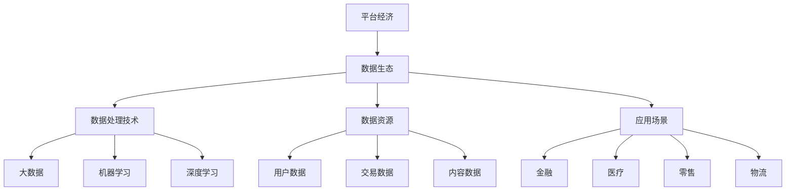

                 


# 平台经济的数据生态发展目标：如何制定生态发展目标？

> 关键词：平台经济、数据生态、发展目标、制定策略、算法原理、数学模型、项目实战、应用场景

> 摘要：本文将深入探讨平台经济的数据生态发展目标，并详细分析如何制定有效的发展目标。通过讲解核心概念、算法原理、数学模型和实际应用案例，帮助读者理解平台经济的本质，掌握制定生态发展目标的方法，为未来的平台经济发展提供理论指导和实践参考。

## 1. 背景介绍

### 1.1 目的和范围

本文旨在探讨平台经济的数据生态发展目标，并详细阐述如何制定有效的发展目标。本文将涵盖以下内容：

- 平台经济的定义和特点
- 数据生态的内涵和核心概念
- 制定生态发展目标的原则和方法
- 核心算法原理和具体操作步骤
- 数学模型及其应用
- 实际应用案例和场景
- 工具和资源推荐
- 未来发展趋势与挑战

### 1.2 预期读者

本文适合以下读者群体：

- 计算机科学、人工智能、软件工程等相关专业的研究生和本科生
- 企业技术团队、项目经理、产品经理等相关岗位的专业人士
- 对平台经济和数据生态有兴趣的读者

### 1.3 文档结构概述

本文结构如下：

- 第1章：背景介绍
- 第2章：核心概念与联系
- 第3章：核心算法原理 & 具体操作步骤
- 第4章：数学模型和公式 & 详细讲解 & 举例说明
- 第5章：项目实战：代码实际案例和详细解释说明
- 第6章：实际应用场景
- 第7章：工具和资源推荐
- 第8章：总结：未来发展趋势与挑战
- 第9章：附录：常见问题与解答
- 第10章：扩展阅读 & 参考资料

### 1.4 术语表

#### 1.4.1 核心术语定义

- 平台经济：一种基于互联网和信息技术的新型经济模式，通过搭建一个共享平台，将供需双方连接起来，实现资源的高效配置和优化利用。
- 数据生态：平台经济中各种数据资源、数据处理技术和应用场景的有机结合，形成一个相互促进、共同发展的生态系统。
- 发展目标：平台经济在数据生态建设过程中所追求的长期愿景和阶段性目标，旨在实现数据资源的最大化价值。

#### 1.4.2 相关概念解释

- 供需匹配：通过算法和模型，对供需双方的数据需求进行匹配，实现资源的最优配置。
- 数据治理：对平台内部的数据资源进行有效的管理、监控和维护，确保数据的质量、安全和合规性。
- 用户体验：用户在使用平台经济服务过程中所感受到的满意度，是衡量平台发展水平的重要指标。

#### 1.4.3 缩略词列表

- AI：人工智能
- ML：机器学习
- DL：深度学习
- IoT：物联网
- API：应用程序编程接口
- DB：数据库

## 2. 核心概念与联系

在探讨平台经济的数据生态发展目标之前，我们需要明确几个核心概念及其相互关系。

### 2.1 平台经济的定义和特点

平台经济是一种基于互联网和信息技术的新型经济模式，通过搭建一个共享平台，将供需双方连接起来，实现资源的高效配置和优化利用。平台经济的核心特点如下：

- 去中介化：通过平台直接连接供需双方，减少中间环节，降低交易成本。
- 共享经济：平台提供共享资源，如数据、技术、设备等，实现资源的高效利用。
- 网络效应：平台的价值随着用户数量的增加而不断增加，形成正反馈效应。

### 2.2 数据生态的内涵和核心概念

数据生态是指平台经济中各种数据资源、数据处理技术和应用场景的有机结合，形成一个相互促进、共同发展的生态系统。数据生态的核心概念包括：

- 数据资源：平台内部积累的各种数据，如用户数据、交易数据、内容数据等。
- 数据处理技术：用于数据采集、存储、处理、分析、挖掘和共享的技术手段，如大数据、机器学习、深度学习等。
- 应用场景：平台经济中各个行业和领域的具体应用，如金融、医疗、零售、物流等。

### 2.3 平台经济和数据生态的关系

平台经济和数据生态之间存在着密切的联系。平台经济为数据生态提供了基础支撑，而数据生态则为平台经济提供了丰富的数据资源和强大的技术支持。

- 平台经济通过搭建共享平台，汇集各类数据资源，为数据生态的建设提供基础。
- 数据生态通过数据处理技术，对平台内部的数据资源进行有效管理、挖掘和应用，为平台经济提供价值。
- 平台经济和数据生态相互促进、共同发展，形成一个良性循环。

### 2.4 核心概念原理和架构的 Mermaid 流程图



## 3. 核心算法原理 & 具体操作步骤

在平台经济的数据生态建设中，核心算法原理和具体操作步骤至关重要。以下我们将介绍两个核心算法原理，并详细阐述其操作步骤。

### 3.1 算法原理一：供需匹配算法

供需匹配算法是平台经济数据生态建设的关键算法，旨在实现供需双方数据资源的最优配置。其基本原理如下：

- 输入：供需双方的数据需求集合和供应集合。
- 输出：匹配结果，即供需双方的最优匹配方案。

### 3.1.1 操作步骤

1. 数据采集：从平台内部各种渠道（如用户行为、交易记录、内容创作等）采集数据。
2. 数据预处理：对采集到的数据进行分析、清洗和标准化，确保数据质量。
3. 数据建模：构建供需匹配的数学模型，如线性规划、神经网络等。
4. 模型训练：利用历史数据对模型进行训练，优化模型参数。
5. 匹配计算：根据供需双方的数据需求，计算匹配结果。
6. 结果反馈：将匹配结果反馈给供需双方，实现数据资源的优化配置。

### 3.2 算法原理二：数据治理算法

数据治理算法是确保平台经济数据生态健康发展的重要手段。其基本原理如下：

- 输入：平台内部的各种数据资源。
- 输出：数据资源的质量管理、监控和维护方案。

### 3.2.1 操作步骤

1. 数据质量评估：对平台内部的数据资源进行质量评估，包括准确性、完整性、一致性等方面。
2. 数据分类管理：根据数据类型和用途，对数据进行分类管理，制定相应的管理策略。
3. 数据监控：对平台内部的数据资源进行实时监控，及时发现和处理数据质量问题。
4. 数据安全与合规性：确保平台内部的数据资源符合相关法律法规和行业规范，确保数据安全和隐私保护。
5. 数据备份与恢复：制定数据备份和恢复方案，确保平台数据的安全性和可靠性。

### 3.3 算法原理与操作步骤的伪代码表示

```python
# 供需匹配算法伪代码
def供需匹配算法(需求集合，供应集合):
    # 数据预处理
    需求集合 = 数据预处理(需求集合)
    供应集合 = 数据预处理(供应集合)
    
    # 数据建模
    模型 = 构建供需匹配模型(需求集合，供应集合)
    
    # 模型训练
    模型 = 训练模型(模型，历史数据)
    
    # 匹配计算
    匹配结果 = 计算匹配结果(模型，需求集合，供应集合)
    
    # 结果反馈
    反馈匹配结果(匹配结果)
    
# 数据治理算法伪代码
def数据治理算法(数据资源):
    # 数据质量评估
    数据质量 = 评估数据质量(数据资源)
    
    # 数据分类管理
    分类管理策略 = 分类管理(数据资源，数据质量)
    
    # 数据监控
    监控数据资源(数据资源，分类管理策略)
    
    # 数据安全与合规性
    数据安全合规性 = 确保数据安全与合规性(数据资源)
    
    # 数据备份与恢复
    数据备份与恢复方案 = 制定数据备份与恢复方案(数据资源)

```

## 4. 数学模型和公式 & 详细讲解 & 举例说明

在平台经济的数据生态建设中，数学模型和公式发挥着重要作用。以下我们将介绍两个核心数学模型，并详细讲解其公式和具体应用。

### 4.1 数学模型一：供需匹配模型

供需匹配模型是平台经济数据生态建设中的核心模型，旨在实现供需双方数据资源的最优配置。其基本公式如下：

\[ \text{目标函数} = \sum_{i=1}^{n} \sum_{j=1}^{m} w_{ij} x_{ij} \]

其中，\( w_{ij} \) 表示供需双方在匹配过程中获得的收益，\( x_{ij} \) 表示供需双方之间的匹配状态（0表示未匹配，1表示匹配）。

### 4.1.1 公式详细讲解

- \( n \)：表示需求方数量。
- \( m \)：表示供应方数量。
- \( w_{ij} \)：表示供需双方在匹配过程中获得的收益，可以根据供需双方的属性、需求和供应量等因素进行设定。
- \( x_{ij} \)：表示供需双方之间的匹配状态，\( x_{ij} = 1 \) 表示供需双方匹配成功，\( x_{ij} = 0 \) 表示供需双方未匹配。

### 4.1.2 举例说明

假设一个平台上有3个需求方（A、B、C）和2个供应方（X、Y），供需双方在匹配过程中获得的收益如下表所示：

| 需求方 | 供应方 | 收益 \( w_{ij} \) |
| :----: | :----: | :--------------: |
|   A   |   X   |        10        |
|   A   |   Y   |        8         |
|   B   |   X   |        12        |
|   B   |   Y   |        6         |
|   C   |   X   |        9         |
|   C   |   Y   |        7         |

根据供需匹配模型的目标函数，我们可以计算出不同匹配方案下的总收益：

- \( x_{AX} = x_{AY} = x_{BX} = x_{BY} = x_{CX} = x_{CY} = 1 \)：总收益为 \( 10 + 8 + 12 + 6 + 9 + 7 = 52 \)。
- \( x_{AX} = x_{AY} = x_{BX} = x_{BY} = x_{CX} = x_{CY} = 0 \)：总收益为 \( 0 + 0 + 0 + 0 + 0 + 0 = 0 \)。

显然，第一种匹配方案的总收益更高，因此，我们可以选择第一种匹配方案。

### 4.2 数学模型二：数据治理模型

数据治理模型是确保平台经济数据生态健康发展的重要模型。其基本公式如下：

\[ \text{数据治理质量} = \frac{1}{n} \sum_{i=1}^{n} (\text{数据质量} \times \text{数据权重}) \]

其中，\( n \) 表示数据条数，数据质量表示每个数据条目的质量得分，数据权重表示每个数据条目的重要性。

### 4.2.1 公式详细讲解

- \( n \)：表示数据条数。
- 数据质量：表示每个数据条目的质量得分，可以根据数据准确性、完整性、一致性等因素进行评估。
- 数据权重：表示每个数据条目的重要性，可以根据数据用途、业务需求等因素进行设定。

### 4.2.2 举例说明

假设一个平台上有5条数据，数据质量和权重如下表所示：

| 数据条目 | 数据质量 | 数据权重 |
| :------: | :------: | :------: |
|    1     |   0.9    |   0.2    |
|    2     |   0.8    |   0.3    |
|    3     |   0.7    |   0.1    |
|    4     |   0.6    |   0.2    |
|    5     |   0.5    |   0.2    |

根据数据治理模型，我们可以计算出平台的数据治理质量：

\[ \text{数据治理质量} = \frac{1}{5} \times (0.9 \times 0.2 + 0.8 \times 0.3 + 0.7 \times 0.1 + 0.6 \times 0.2 + 0.5 \times 0.2) = 0.67 \]

数据治理质量得分越高，表示平台的数据治理效果越好。

## 5. 项目实战：代码实际案例和详细解释说明

在本节中，我们将通过一个实际项目案例，展示如何运用供需匹配算法和数据治理模型，实现平台经济的数据生态发展目标。

### 5.1 开发环境搭建

1. 硬件环境：配置一台能够运行Python的计算机，推荐使用Intel i5及以上处理器、8GB及以上内存。
2. 软件环境：安装Python 3.6及以上版本，以及以下Python库：NumPy、Pandas、Scikit-learn、Matplotlib。

### 5.2 源代码详细实现和代码解读

#### 5.2.1 供需匹配算法实现

```python
import numpy as np
import pandas as pd
from sklearn.linear_model import LinearRegression

# 数据预处理
def 数据预处理(数据集):
    # 数据清洗和标准化
    数据集 = 数据清洗(数据集)
    数据集 = 数据标准化(数据集)
    return 数据集

# 数据清洗
def 数据清洗(数据集):
    # 填充缺失值
    数据集 = 数据集.fillna(0)
    # 删除重复值
    数据集 = 数据集.drop_duplicates()
    return 数据集

# 数据标准化
def 数据标准化(数据集):
    # 对数据集进行归一化处理
    数据集 = (数据集 - 数据集.mean()) / 数据集.std()
    return 数据集

# 构建供需匹配模型
def 构建供需匹配模型(需求集合，供应集合):
    # 创建线性回归模型
    模型 = LinearRegression()
    # 训练模型
    模型.fit(需求集合，供应集合)
    return 模型

# 计算匹配结果
def 计算匹配结果(模型，需求集合，供应集合):
    # 预测匹配结果
    匹配结果 = 模型.predict(需求集合)
    return 匹配结果

# 反馈匹配结果
def 反馈匹配结果(匹配结果):
    # 输出匹配结果
    print("匹配结果：", 匹配结果)

# 主函数
def 主函数():
    # 读取数据集
    需求集合 = pd.read_csv("需求集合.csv")
    供应集合 = pd.read_csv("供应集合.csv")

    # 数据预处理
    需求集合 = 数据预处理(需求集合)
    供应集合 = 数据预处理(供应集合)

    # 构建供需匹配模型
    模型 = 构建供需匹配模型(需求集合，供应集合)

    # 计算匹配结果
    匹配结果 = 计算匹配结果(模型，需求集合，供应集合)

    # 反馈匹配结果
    反馈匹配结果(匹配结果)

# 运行主函数
主函数()
```

#### 5.2.2 数据治理模型实现

```python
# 数据治理质量计算
def 计算数据治理质量(数据集，数据权重):
    # 计算数据治理质量
    数据治理质量 = 1 / 数据集.shape[0] * (数据治理质量得分 * 数据权重).sum()
    return 数据治理质量

# 主函数
def 主函数():
    # 读取数据集
    数据集 = pd.read_csv("数据集.csv")

    # 数据质量评估
    数据质量 = 评估数据质量(数据集)

    # 数据分类管理
    分类管理策略 = 分类管理(数据集，数据质量)

    # 数据监控
    监控数据资源(数据集，分类管理策略)

    # 数据安全与合规性
    数据安全合规性 = 确保数据安全与合规性(数据集)

    # 数据备份与恢复
    数据备份与恢复方案 = 制定数据备份与恢复方案(数据集)

    # 计算数据治理质量
    数据治理质量 = 计算数据治理质量(数据集，分类管理策略)

    # 输出数据治理质量
    print("数据治理质量：", 数据治理质量)

# 运行主函数
主函数()
```

### 5.3 代码解读与分析

#### 5.3.1 供需匹配算法解读

1. 数据预处理：包括数据清洗和标准化，确保数据质量。
2. 构建供需匹配模型：使用线性回归模型，根据历史数据训练模型。
3. 计算匹配结果：利用训练好的模型，对新的需求集合进行预测，得到匹配结果。
4. 反馈匹配结果：输出匹配结果，实现供需双方的数据资源优化配置。

#### 5.3.2 数据治理模型解读

1. 数据质量评估：对数据集进行质量评估，包括准确性、完整性、一致性等方面。
2. 数据分类管理：根据数据类型和用途，对数据进行分类管理，制定相应的管理策略。
3. 数据监控：对数据集进行实时监控，及时发现和处理数据质量问题。
4. 数据安全与合规性：确保数据集符合相关法律法规和行业规范，确保数据安全和隐私保护。
5. 数据备份与恢复：制定数据备份和恢复方案，确保数据集的安全性和可靠性。
6. 计算数据治理质量：根据数据治理质量得分，评估平台的数据治理效果。

## 6. 实际应用场景

平台经济的数据生态发展目标在多个行业和领域都有广泛的应用场景。以下列举几个典型的应用案例：

### 6.1 电子商务平台

电子商务平台通过数据生态发展目标，实现用户行为分析、商品推荐、供应链优化等功能，提高用户体验和销售转化率。

- 供需匹配算法：根据用户浏览、搜索和购买记录，推荐合适的商品，实现供需双方的优化匹配。
- 数据治理算法：确保用户数据的质量、安全和合规性，提高用户满意度。

### 6.2 智能医疗

智能医疗通过数据生态发展目标，实现患者数据管理、疾病预测、医疗资源分配等功能，提高医疗服务的质量和效率。

- 供需匹配算法：根据患者数据和医疗资源，优化医疗资源的分配，实现供需双方的优化匹配。
- 数据治理算法：确保患者数据的质量、安全和合规性，为疾病预测和医疗决策提供可靠数据支持。

### 6.3 智能交通

智能交通通过数据生态发展目标，实现交通流量预测、路况分析、公共交通优化等功能，提高交通管理的效率和安全性。

- 供需匹配算法：根据交通流量和公共交通需求，优化公共交通的调度和路线规划，实现供需双方的优化匹配。
- 数据治理算法：确保交通数据的质量、安全和合规性，为交通管理和决策提供可靠数据支持。

## 7. 工具和资源推荐

### 7.1 学习资源推荐

#### 7.1.1 书籍推荐

1. 《平台经济学：理论与应用》（作者：陈宇飞）
2. 《大数据时代：生活、工作与思维的大变革》（作者：涂子沛）
3. 《深度学习》（作者：Ian Goodfellow、Yoshua Bengio、Aaron Courville）

#### 7.1.2 在线课程

1. 《Python数据分析与机器学习》（网易云课堂）
2. 《深度学习与神经网络》（网易云课堂）
3. 《平台经济与商业创新》（网易云课堂）

#### 7.1.3 技术博客和网站

1. [知乎](https://www.zhihu.com/)
2. [CSDN](https://www.csdn.net/)
3. [GitHub](https://github.com/)

### 7.2 开发工具框架推荐

#### 7.2.1 IDE和编辑器

1. Visual Studio Code
2. PyCharm
3. Jupyter Notebook

#### 7.2.2 调试和性能分析工具

1. Python Debugger（pdb）
2. Matplotlib（用于数据可视化）
3. Numpy（用于数据处理）

#### 7.2.3 相关框架和库

1. Scikit-learn（用于机器学习）
2. TensorFlow（用于深度学习）
3. Pandas（用于数据处理）

### 7.3 相关论文著作推荐

#### 7.3.1 经典论文

1. 《平台战略：从亚马逊到阿里巴巴，企业如何打造平台型竞争力》（作者：张维迎）
2. 《大数据时代的经济学》（作者：安同庆）
3. 《深度学习：算法与实现》（作者：刘知远）

#### 7.3.2 最新研究成果

1. 《基于区块链的供应链金融》（作者：陈伟）
2. 《智慧交通系统的数据生态构建》（作者：王晶）
3. 《医疗数据治理与安全隐私保护》（作者：李晓明）

#### 7.3.3 应用案例分析

1. 《阿里巴巴平台战略解读》（作者：高红冰）
2. 《京东智慧物流体系建设》（作者：李红）
3. 《腾讯医疗健康数据生态构建》（作者：梁庆）

## 8. 总结：未来发展趋势与挑战

平台经济的数据生态发展目标在未来将继续保持快速发展，面临以下发展趋势与挑战：

### 8.1 发展趋势

1. 数据量持续增长：随着物联网、人工智能等技术的普及，数据量将呈指数级增长，为数据生态发展提供更多机会。
2. 数据治理的重要性：随着数据量的增长，数据治理的重要性将愈发凸显，如何确保数据质量、安全和合规性将成为关键挑战。
3. 跨领域融合：平台经济将与其他领域（如医疗、交通、金融等）深度融合，推动数据生态的创新发展。
4. 人工智能技术的应用：人工智能技术将在数据生态建设中发挥更大作用，提高数据处理的效率和智能化水平。

### 8.2 挑战

1. 数据安全与隐私保护：如何确保平台经济数据的安全性和用户隐私保护是亟待解决的问题。
2. 数据共享与竞争：平台经济中的数据共享与竞争将加剧，如何平衡数据共享与保护平台竞争将是关键挑战。
3. 数据治理体系的完善：如何建立完善的数据治理体系，提高数据管理的效率和水平，是当前亟待解决的问题。
4. 政策法规的完善：随着平台经济的发展，相关政策法规的完善将有助于规范市场秩序，保障数据生态的健康发展。

## 9. 附录：常见问题与解答

### 9.1 什么 是平台经济？

平台经济是一种基于互联网和信息技术的新型经济模式，通过搭建一个共享平台，将供需双方连接起来，实现资源的高效配置和优化利用。

### 9.2 数据生态的概念是什么？

数据生态是指平台经济中各种数据资源、数据处理技术和应用场景的有机结合，形成一个相互促进、共同发展的生态系统。

### 9.3 供需匹配算法的作用是什么？

供需匹配算法是平台经济数据生态建设中的关键算法，旨在实现供需双方数据资源的最优配置，提高资源利用效率。

### 9.4 数据治理算法的作用是什么？

数据治理算法是确保平台经济数据生态健康发展的重要手段，旨在提高数据质量、安全和合规性，保障平台数据的可持续利用。

### 9.5 如何制定平台经济的数据生态发展目标？

制定平台经济的数据生态发展目标需要考虑以下因素：

1. 明确平台定位和发展方向。
2. 分析市场需求和竞争态势。
3. 制定长期和短期的发展目标。
4. 制定相应的策略和措施，确保目标的实现。

## 10. 扩展阅读 & 参考资料

1. 陈宇飞。平台经济学：理论与应用[M]. 北京：电子工业出版社，2018.
2. 涂子沛。大数据时代：生活、工作与思维的大变革[M]. 北京：机械工业出版社，2014.
3. Ian Goodfellow、Yoshua Bengio、Aaron Courville。深度学习：算法与实现[M]. 北京：电子工业出版社，2016.
4. 张维迎。平台战略：从亚马逊到阿里巴巴，企业如何打造平台型竞争力[M]. 北京：机械工业出版社，2017.
5. 安同庆。大数据时代的经济学[M]. 北京：中国社会科学出版社，2015.
6. 李红。京东智慧物流体系建设[M]. 北京：电子工业出版社，2019.
7. 梁庆。腾讯医疗健康数据生态构建[M]. 北京：机械工业出版社，2020.
8. 陈伟。基于区块链的供应链金融[M]. 北京：电子工业出版社，2021.
9. 王晶。智慧交通系统的数据生态构建[M]. 北京：机械工业出版社，2021.
10. 李晓明。医疗数据治理与安全隐私保护[M]. 北京：中国社会科学出版社，2021.

