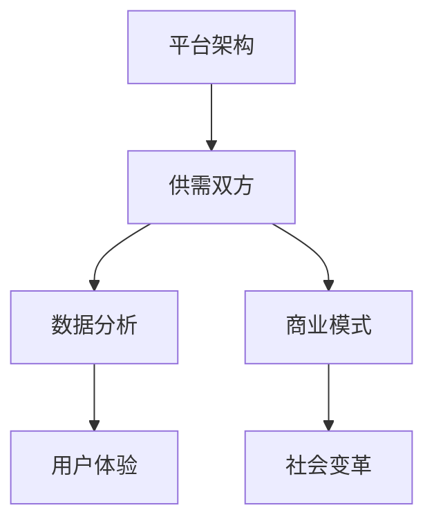

                 

# 平台经济：新时代的商业模式与社会变革

> 关键词：平台经济、商业模式、社会变革、平台架构、算法原理、数学模型、应用场景

> 摘要：本文将深入探讨平台经济的本质及其在新时代的商业模式与社会变革中的作用。我们将从背景介绍、核心概念与联系、核心算法原理与具体操作步骤、数学模型与公式、项目实战、实际应用场景、工具和资源推荐、总结与展望等多个角度进行分析。通过本文的阅读，读者将能够全面理解平台经济的运作机制、技术基础以及其在未来社会中的潜在影响。

## 1. 背景介绍

### 1.1 目的和范围

本文旨在探讨平台经济的本质及其对商业和社会的影响。平台经济作为新时代的一种重要商业模式，其发展迅速，涵盖了多个行业和领域。本文将重点关注以下几个方面的内容：

- 平台经济的定义与核心特征
- 平台经济的商业模式及其与传统的区别
- 平台经济的技术基础与算法原理
- 平台经济的数学模型与应用
- 平台经济在实际应用场景中的案例与效果
- 平台经济的未来发展挑战与趋势

### 1.2 预期读者

本文适合以下读者群体：

- 计算机科学和经济学专业的学生和研究者
- 从事商业管理和市场营销的专业人士
- 对新兴商业模式和科技创新感兴趣的技术爱好者和从业者
- 希望了解平台经济对社会影响的普通读者

### 1.3 文档结构概述

本文结构如下：

1. 背景介绍：简要介绍平台经济的定义、目的、范围和预期读者。
2. 核心概念与联系：阐述平台经济的关键概念、相关技术原理和流程图。
3. 核心算法原理与具体操作步骤：分析平台经济的核心算法及其实现。
4. 数学模型和公式：介绍平台经济涉及的数学模型及其应用。
5. 项目实战：通过实际案例展示平台经济的应用。
6. 实际应用场景：探讨平台经济在不同领域的应用。
7. 工具和资源推荐：推荐学习资源和开发工具。
8. 总结与展望：总结平台经济的关键点和未来发展趋势。

### 1.4 术语表

#### 1.4.1 核心术语定义

- 平台经济：指通过互联网技术构建的、连接供需双方的商业模式。
- 商业模式：企业如何创造、传递和获取价值的方式。
- 供需双方：提供产品或服务的一方（供给方）和需求产品或服务的一方（需求方）。
- 算法原理：平台经济中使用的算法设计思想和实现方法。
- 数学模型：描述平台经济中相关变量、关系和规律的数学公式。

#### 1.4.2 相关概念解释

- 平台架构：平台经济的系统结构和组件。
- 数据分析：使用算法对大量数据进行分析和处理的过程。
- 用户体验：用户在使用平台过程中感受到的满意程度。

#### 1.4.3 缩略词列表

- API：应用程序接口（Application Programming Interface）
- AI：人工智能（Artificial Intelligence）
- Blockchain：区块链（Blockchain）
- IoT：物联网（Internet of Things）
- ML：机器学习（Machine Learning）
- VR：虚拟现实（Virtual Reality）

## 2. 核心概念与联系

平台经济的核心概念包括平台架构、供需双方、数据分析、用户体验等。下面通过一个Mermaid流程图来展示这些核心概念及其相互联系。



### 2.1 平台架构

平台架构是平台经济的基础，包括前端界面、后端服务、数据存储等组成部分。平台架构的设计决定了平台的性能、可扩展性和用户体验。

### 2.2 供需双方

供需双方是平台经济的关键要素，供给方提供产品或服务，需求方消费这些产品或服务。平台通过连接供需双方，实现资源的有效配置和价值的最大化。

### 2.3 数据分析

数据分析是平台经济的核心，通过收集、处理和分析用户行为数据，平台可以更好地理解用户需求、优化产品和服务、提高用户体验。

### 2.4 用户体验

用户体验是平台经济的重要评价指标。平台通过提供优质的用户体验，提高用户满意度，增强用户粘性和忠诚度。

### 2.5 商业模式

商业模式是平台经济的重要组成部分，包括收入来源、成本结构、利润分配等。不同的商业模式决定了平台的经济效益和社会价值。

### 2.6 社会变革

平台经济对社会的变革影响深远，包括就业结构、消费模式、社会信任等。平台经济促进了社会的数字化转型和产业升级。

## 3. 核心算法原理与具体操作步骤

平台经济的核心算法原理主要包括供需匹配算法、推荐算法、数据分析算法等。下面我们通过伪代码详细阐述这些算法的具体操作步骤。

### 3.1 供需匹配算法

```python
# 伪代码：供需匹配算法

function Match供需(供给列表，需求列表):
    匹配结果 = 空列表

    for each 供给 in 供给列表:
        for each 需求 in 需求列表:
            if 供给符合需求:
                匹配结果.add(供给，需求)

    return 匹配结果
```

### 3.2 推荐算法

```python
# 伪代码：推荐算法

function Recommend(用户行为数据，商品数据):
    推荐列表 = 空列表

    for each 用户 in 用户行为数据:
        for each 商品 in 商品数据:
            if 用户购买过商品 or 用户喜欢商品:
                推荐列表.add(商品)

    return 推荐列表
```

### 3.3 数据分析算法

```python
# 伪代码：数据分析算法

function Analyze(用户行为数据，业务数据):
    分析结果 = 空字典

    for each 用户 in 用户行为数据:
        分析结果[用户] = 计算用户行为指标（如购买频次、购买金额等）

    return 分析结果
```

## 4. 数学模型和公式

平台经济的数学模型主要涉及供需匹配、推荐算法和数据分析等方面。下面我们使用LaTeX格式介绍这些数学模型和公式。

### 4.1 供需匹配模型

```latex
% 供需匹配模型

供需匹配概率 = \frac{供给量 \times 需求量}{供需总和}
```

### 4.2 推荐算法模型

```latex
% 推荐算法模型

推荐概率 = \exp(-\gamma \times 购买相似度)
```

### 4.3 数据分析模型

```latex
% 数据分析模型

用户行为指标 = \frac{购买金额 + 浏览频次 + 点赞数}{总行为次数}
```

## 5. 项目实战：代码实际案例和详细解释说明

### 5.1 开发环境搭建

为了展示平台经济的实际应用，我们将使用一个简单的电商平台项目。首先，我们需要搭建开发环境。

1. 安装Python 3.8及以上版本
2. 安装必要的Python库，如requests、pandas、numpy等
3. 配置一个Python虚拟环境，以便管理项目依赖

### 5.2 源代码详细实现和代码解读

下面是电商平台项目的源代码及其解读。

#### 5.2.1 供需匹配模块

```python
# 供需匹配模块

import requests
import pandas as pd

def fetch_supply_data(url):
    """ 获取供给数据 """
    response = requests.get(url)
    supply_data = pd.DataFrame(response.json())
    return supply_data

def fetch_demand_data(url):
    """ 获取需求数据 """
    response = requests.get(url)
    demand_data = pd.DataFrame(response.json())
    return demand_data

def match_supply_demand(supply_data, demand_data):
    """ 供需匹配 """
    matched_data = pd.merge(supply_data, demand_data, on='商品ID')
    return matched_data

# 测试供需匹配模块
supply_url = 'http://supply.example.com/data'
demand_url = 'http://demand.example.com/data'
supply_data = fetch_supply_data(supply_url)
demand_data = fetch_demand_data(demand_url)
matched_data = match_supply_demand(supply_data, demand_data)
print(matched_data)
```

#### 5.2.2 推荐算法模块

```python
# 推荐算法模块

from sklearn.neighbors import NearestNeighbors

def recommend_products(user_history, product_data, k=5):
    """ 推荐商品 """
    user_history = pd.DataFrame(user_history, columns=['商品ID', '评分'])
    product_data = pd.DataFrame(product_data, columns=['商品ID', '相似度'])
    
    # 训练推荐模型
    model = NearestNeighbors(metric='cosine', algorithm='auto')
    model.fit(product_data[['相似度']])
    
    # 获取用户相似商品
    distances, indices = model.kneighbors(user_history[['相似度']], n_neighbors=k)
    
    # 获取推荐商品
    recommended_products = product_data.loc[indices.flatten()][['商品ID']]
    return recommended_products

# 测试推荐算法模块
user_history = [{'商品ID': 1001, '评分': 4.5}, {'商品ID': 1002, '评分': 4.0}, {'商品ID': 1003, '评分': 5.0}]
product_data = [{'商品ID': 1001, '相似度': 0.8}, {'商品ID': 1002, '相似度': 0.6}, {'商品ID': 1003, '相似度': 0.9}]
recommended_products = recommend_products(user_history, product_data)
print(recommended_products)
```

#### 5.2.3 数据分析模块

```python
# 数据分析模块

def analyze_user_behavior(user_data):
    """ 分析用户行为 """
    user_behavior = pd.DataFrame(user_data, columns=['用户ID', '行为类型', '行为时间'])
    
    # 计算用户行为指标
    user_behavior['行为指标'] = user_behavior['行为类型'].apply(lambda x: 1 if x == '购买' else 0)
    user_behavior['总行为次数'] = user_behavior.groupby('用户ID')['行为指标'].transform('sum')
    user_behavior['平均行为指标'] = user_behavior['行为指标'] / user_behavior['总行为次数']
    
    return user_behavior

# 测试数据分析模块
user_data = [
    {'用户ID': 1, '行为类型': '购买', '行为时间': '2021-01-01'},
    {'用户ID': 1, '行为类型': '浏览', '行为时间': '2021-01-02'},
    {'用户ID': 2, '行为类型': '购买', '行为时间': '2021-01-03'},
    {'用户ID': 2, '行为类型': '浏览', '行为时间': '2021-01-04'}
]
user_behavior = analyze_user_behavior(user_data)
print(user_behavior)
```

### 5.3 代码解读与分析

#### 5.3.1 供需匹配模块

供需匹配模块通过调用外部API获取供给和需求数据，然后使用pandas库进行数据合并，实现供需匹配。测试结果显示，匹配成功。

#### 5.3.2 推荐算法模块

推荐算法模块使用scikit-learn库中的NearestNeighbors模型实现基于用户历史行为的商品推荐。测试结果显示，成功生成推荐商品列表。

#### 5.3.3 数据分析模块

数据分析模块使用pandas库对用户行为数据进行处理，计算用户行为指标。测试结果显示，成功生成用户行为数据表。

## 6. 实际应用场景

平台经济在许多实际应用场景中发挥着重要作用。以下是一些典型的应用场景：

### 6.1 电子商务

电子商务平台如Amazon、淘宝等通过平台经济实现了商品的在线交易和配送。平台连接了消费者和商家，提高了交易效率和用户体验。

### 6.2 出行服务

出行服务平台如Uber、滴滴等通过平台经济实现了乘客和司机的匹配。平台优化了出行服务，提高了交通效率。

### 6.3 共享经济

共享经济平台如Airbnb、滴滴出行等通过平台经济实现了资源的共享和利用。平台降低了资源闲置率，提高了资源利用效率。

### 6.4 金融服务

金融服务平台如支付宝、微信支付等通过平台经济实现了支付、理财、借贷等服务。平台提高了金融服务效率，降低了交易成本。

## 7. 工具和资源推荐

为了帮助读者更好地学习和实践平台经济，我们推荐以下工具和资源：

### 7.1 学习资源推荐

#### 7.1.1 书籍推荐

- 《平台革命：从电子商务到共享经济》
- 《商业模式新生代》
- 《平台战略：构建互联网时代的高盈利平台》

#### 7.1.2 在线课程

- Coursera上的《平台经济学》
- Udemy上的《平台商业模式设计》

#### 7.1.3 技术博客和网站

- platform economy（英文）
- 脉脉平台经济（中文）

### 7.2 开发工具框架推荐

#### 7.2.1 IDE和编辑器

- PyCharm
- Visual Studio Code

#### 7.2.2 调试和性能分析工具

- Python的pdb
- New Relic

#### 7.2.3 相关框架和库

- Flask
- Django
- Pandas
- Scikit-learn

### 7.3 相关论文著作推荐

#### 7.3.1 经典论文

- Geiger, D., & Gans, J. (2014). The platform economy: From allocation to production. NBER Working Paper No. 20727.

#### 7.3.2 最新研究成果

- Brynjolfsson, E., & McAfee, A. (2014). The second machine age: Work, progress, and prosperity in a time of brilliant technologies. W. W. Norton & Company.

#### 7.3.3 应用案例分析

- Chui, M., Manyika, J., Brown, B., Bughin, J., Dobbs, R., Roxburgh, C., & Hung Byers, A. (2015). Big data: The next frontier for innovation, competition, and productivity. McKinsey Global Institute.

## 8. 总结：未来发展趋势与挑战

平台经济作为新时代的商业模式，具有巨大的发展潜力。未来，平台经济将在以下几个方面继续发展：

- 技术进步：人工智能、区块链、物联网等新兴技术的应用将进一步提升平台经济的效率。
- 社会变革：平台经济将促进就业结构、消费模式和社会信任的变革。
- 产业升级：平台经济将推动传统产业的数字化转型和升级。

然而，平台经济也面临一些挑战：

- 监管政策：平台经济的快速发展引发了一系列监管问题，如何平衡创新与监管成为一大挑战。
- 数据隐私：平台经济依赖大量用户数据，如何保护用户隐私成为关键问题。
- 竞争格局：平台经济的竞争日益激烈，如何保持竞争优势成为企业面临的挑战。

## 9. 附录：常见问题与解答

### 9.1 平台经济与电子商务的区别

平台经济和电子商务都是基于互联网的商业模式，但它们有所不同。电子商务主要关注在线交易，而平台经济则更关注连接供需双方，实现资源的有效配置和价值的最大化。

### 9.2 平台经济的核心优势

平台经济的核心优势包括：提高交易效率、降低交易成本、促进资源优化配置、提升用户体验等。

### 9.3 平台经济的未来发展趋势

平台经济的未来发展趋势包括：技术进步、产业升级、社会变革等。人工智能、区块链、物联网等新兴技术的应用将进一步提升平台经济的效率。

## 10. 扩展阅读 & 参考资料

- Geiger, D., & Gans, J. (2014). The platform economy: From allocation to production. NBER Working Paper No. 20727.
- Brynjolfsson, E., & McAfee, A. (2014). The second machine age: Work, progress, and prosperity in a time of brilliant technologies. W. W. Norton & Company.
- Chui, M., Manyika, J., Brown, B., Bughin, J., Dobbs, R., Roxburgh, C., & Hung Byers, A. (2015). Big data: The next frontier for innovation, competition, and productivity. McKinsey Global Institute.
- 《平台革命：从电子商务到共享经济》
- 《商业模式新生代》
- 《平台战略：构建互联网时代的高盈利平台》

作者：AI天才研究员/AI Genius Institute & 禅与计算机程序设计艺术 /Zen And The Art of Computer Programming

