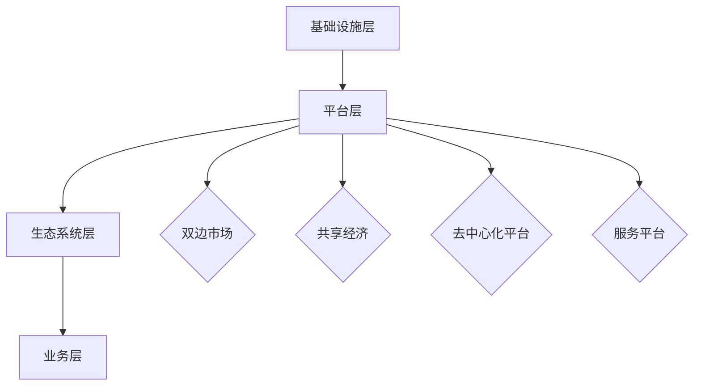

                 

# 平台经济：新时代的商业模式与社会变革

> 关键词：平台经济、商业模式、社会变革、互联网、数据、算法、用户、供应链、生态系统、创新、可持续发展
>
> 摘要：本文深入探讨了平台经济的兴起及其对新时代商业模式和社会变革的深远影响。通过梳理平台经济的核心概念、发展历程、典型模式及其在各个行业中的应用，本文旨在帮助读者理解平台经济的本质，分析其带来的机遇与挑战，并展望其未来的发展趋势。

## 1. 背景介绍

### 1.1 目的和范围

本文旨在探讨平台经济作为新时代商业模式的兴起及其对社会产生的深刻影响。我们将从以下几个方面展开讨论：

1. 平台经济的定义和核心概念。
2. 平台经济的发展历程和主要模式。
3. 平台经济在不同行业的应用与实践。
4. 平台经济带来的社会变革与挑战。
5. 平台经济的未来发展趋势与机遇。

### 1.2 预期读者

本文面向对平台经济感兴趣的读者，包括企业高管、创业者、技术专家、投资人和学术研究者。通过对平台经济的深入分析，读者可以更好地理解这一新兴商业模式的本质，把握其带来的机遇，并应对潜在挑战。

### 1.3 文档结构概述

本文分为十个部分：

1. 引言：平台经济的背景、目的与核心关键词。
2. 核心概念与联系：平台经济的基本概念、架构和主要模式。
3. 核心算法原理 & 具体操作步骤：平台经济中常用的算法和技术手段。
4. 数学模型和公式 & 详细讲解 & 举例说明：平台经济中涉及的数学模型和公式。
5. 项目实战：平台经济的实际应用案例和代码实现。
6. 实际应用场景：平台经济在不同领域的应用案例。
7. 工具和资源推荐：学习平台经济的推荐资源和工具。
8. 总结：平台经济的未来发展趋势与挑战。
9. 附录：常见问题与解答。
10. 扩展阅读 & 参考资料：进一步了解平台经济的推荐书籍、论文和网站。

### 1.4 术语表

#### 1.4.1 核心术语定义

- **平台经济**：以互联网为核心，通过平台模式整合资源、提供服务和创造价值的商业生态系统。
- **商业模式**：企业在特定市场环境中实现盈利和价值创造的方式。
- **生态系统**：由多个相互依存的参与者（如用户、企业、供应商等）组成的复杂系统。
- **算法**：用于解决问题或执行特定任务的规则集合。
- **用户**：平台经济中的参与者，可以是消费者、生产者或服务提供者。

#### 1.4.2 相关概念解释

- **共享经济**：以资源共享为核心理念，通过互联网平台连接供需双方，实现闲置资源的高效利用。
- **去中心化**：指系统或网络中不存在中央控制节点，由众多参与者共同维护和运作。
- **大数据**：指数据量巨大、种类繁多、处理速度要求高的数据集合。
- **人工智能**：模拟人类智能行为的计算机技术，包括机器学习、深度学习、自然语言处理等。

#### 1.4.3 缩略词列表

- **互联网**：Internet
- **平台**：Platform
- **API**：Application Programming Interface
- **SDK**：Software Development Kit
- **IoT**：Internet of Things

## 2. 核心概念与联系

### 2.1 平台经济的核心概念

平台经济是一种以互联网为基础设施的新型商业模式，其核心概念包括：

1. **用户中心**：平台经济以用户为中心，关注用户的个性化需求和体验。
2. **生态系统**：平台经济构建了一个生态系统，包括用户、企业、供应商、合作伙伴等多个参与者。
3. **开放性**：平台经济强调开放性和互操作性，允许不同系统和应用之间的无缝连接。
4. **共享与协作**：平台经济通过共享资源和协作，提高资源利用效率和创新能力。

### 2.2 平台经济的架构

平台经济的架构可以分为四个层次：

1. **基础设施层**：包括互联网、云计算、大数据等基础技术设施。
2. **平台层**：提供核心功能和服务，如交易平台、社交平台、服务平台等。
3. **生态系统层**：包含用户、企业、供应商、合作伙伴等生态参与者。
4. **业务层**：实现商业价值创造和盈利，包括销售、营销、服务等业务活动。

### 2.3 平台经济的主要模式

平台经济主要有以下几种模式：

1. **双边市场**：通过连接供需双方，实现规模效应和交叉网络效应。
2. **共享经济**：通过共享闲置资源，提高资源利用效率，如Uber、Airbnb。
3. **去中心化平台**：通过区块链等技术实现去中心化，降低交易成本，如EOS、Steemit。
4. **服务平台**：提供各种在线服务，如电商、支付、物流等，如亚马逊、支付宝。

### 2.4 平台经济的主要模式流程图



## 3. 核心算法原理 & 具体操作步骤

### 3.1 核心算法原理

平台经济中，核心算法原理主要包括以下几个方面：

1. **推荐算法**：基于用户行为和偏好，为用户推荐个性化内容或服务。
2. **匹配算法**：在双边市场中，实现供需双方的精准匹配。
3. **交易算法**：确保交易过程的透明、公平和高效。
4. **风险管理算法**：监控和预测平台风险，及时采取措施。

### 3.2 具体操作步骤

以推荐算法为例，具体操作步骤如下：

1. **数据收集**：收集用户行为数据，如浏览记录、购买历史、搜索关键词等。
2. **特征提取**：将原始数据转化为算法可处理的特征向量。
3. **模型训练**：使用机器学习算法，如协同过滤、基于内容的推荐等，训练推荐模型。
4. **模型评估**：评估模型性能，如准确率、召回率等。
5. **推荐生成**：根据用户特征和模型预测，生成个性化推荐列表。

### 3.3 伪代码实现

```python
# 数据收集
def collect_data():
    # 收集用户行为数据
    pass

# 特征提取
def extract_features(data):
    # 将数据转化为特征向量
    pass

# 模型训练
def train_model(features):
    # 使用机器学习算法训练推荐模型
    pass

# 模型评估
def evaluate_model(model, data):
    # 评估模型性能
    pass

# 推荐生成
def generate_recommendations(model, user_features):
    # 根据用户特征和模型预测生成推荐列表
    pass

# 主函数
def main():
    data = collect_data()
    features = extract_features(data)
    model = train_model(features)
    evaluate_model(model, data)
    user_features = extract_features([user])
    recommendations = generate_recommendations(model, user_features)
    print("推荐列表：", recommendations)

main()
```

## 4. 数学模型和公式 & 详细讲解 & 举例说明

### 4.1 数学模型和公式

平台经济中，常用的数学模型和公式包括：

1. **边际收益**：衡量增加一单位服务或产品对总收益的影响。
2. **边际成本**：衡量增加一单位服务或产品对总成本的影响。
3. **交叉网络效应**：衡量平台中一个参与者的增加对其他参与者价值的影响。
4. **盈亏平衡分析**：计算平台在达到盈亏平衡时的用户数量或收入水平。

### 4.2 详细讲解

#### 4.2.1 边际收益和边际成本

边际收益（Marginal Revenue, MR）表示增加一单位服务或产品对总收益的影响，可以用以下公式表示：

\[ MR = \frac{TR_{new} - TR_{old}}{Q_{new} - Q_{old}} \]

其中，\( TR_{new} \)和\( TR_{old} \)分别为增加一单位服务或产品后的总收益和原来的总收益，\( Q_{new} \)和\( Q_{old} \)分别为增加一单位服务或产品后的总销售量和原来的总销售量。

边际成本（Marginal Cost, MC）表示增加一单位服务或产品对总成本的影响，可以用以下公式表示：

\[ MC = \frac{TC_{new} - TC_{old}}{Q_{new} - Q_{old}} \]

其中，\( TC_{new} \)和\( TC_{old} \)分别为增加一单位服务或产品后的总成本和原来的总成本，\( Q_{new} \)和\( Q_{old} \)分别为增加一单位服务或产品后的总销售量和原来的总销售量。

#### 4.2.2 交叉网络效应

交叉网络效应（Cross-Network Effects）表示平台中一个参与者的增加对其他参与者价值的影响。可以用以下公式表示：

\[ CNE = \frac{V_{new} - V_{old}}{N_{new} - N_{old}} \]

其中，\( V_{new} \)和\( V_{new} \)分别为平台中参与者数量增加后的总价值和其他参与者价值，\( N_{new} \)和\( N_{old} \)分别为平台中参与者数量增加后的总参与者数量和其他参与者数量。

#### 4.2.3 盈亏平衡分析

盈亏平衡分析（Break-Even Analysis）用于计算平台在达到盈亏平衡时的用户数量或收入水平。可以用以下公式表示：

\[ BEP = \frac{固定成本 + 变动成本}{边际贡献率} \]

其中，固定成本（Fixed Cost）为平台运营的固定支出，如服务器费用、人力成本等；变动成本（Variable Cost）为与销售量相关的成本，如商品采购成本、配送费用等；边际贡献率（Marginal Contribution Rate）为每单位销售量对总收益的贡献率。

### 4.3 举例说明

假设某电商平台在一段时间内的数据如下：

- 固定成本：100万元
- 变动成本：20元/件
- 边际贡献率：50%

根据以上数据，我们可以计算出平台达到盈亏平衡时的销售量：

\[ BEP = \frac{100 + 20}{0.5} = 220 \text{件} \]

## 5. 项目实战：代码实际案例和详细解释说明

### 5.1 开发环境搭建

为了便于演示，我们将在Python环境中实现一个简单的电商平台。以下为开发环境搭建步骤：

1. 安装Python：前往[Python官网](https://www.python.org/)下载并安装Python。
2. 安装依赖库：在命令行中运行以下命令安装必要的依赖库。

```bash
pip install Flask requests beautifulsoup4 pandas numpy
```

### 5.2 源代码详细实现和代码解读

以下为电商平台的核心代码实现和详细解读：

```python
# 导入依赖库
import Flask
from Flask import Flask, request, jsonify
import requests
from bs4 import BeautifulSoup
import pandas as pd
import numpy as np

# 初始化Flask应用
app = Flask(__name__)

# 电商平台API接口
@app.route('/api/products', methods=['GET'])
def get_products():
    # 获取商品数据
    response = requests.get('https://example.com/products')
    soup = BeautifulSoup(response.content, 'html.parser')
    products = soup.find_all('div', class_='product')

    # 解析商品数据
    product_data = []
    for product in products:
        name = product.find('h2', class_='product-name').text
        price = product.find('span', class_='price').text
        product_data.append({'name': name, 'price': float(price)})

    # 返回商品数据
    return jsonify(product_data)

# 用户购买商品
@app.route('/api/buy', methods=['POST'])
def buy_product():
    # 获取用户购买请求
    data = request.json
    product_name = data['name']
    quantity = data['quantity']

    # 计算购买价格
    price = get_product_price(product_name)
    total_price = price * quantity

    # 更新库存
    update_inventory(product_name, -quantity)

    # 返回购买结果
    return jsonify({'status': 'success', 'total_price': total_price})

# 获取商品价格
def get_product_price(product_name):
    # 查询商品价格
    response = requests.get(f'https://example.com/product/{product_name}')
    soup = BeautifulSoup(response.content, 'html.parser')
    price_element = soup.find('span', class_='price')
    price = float(price_element.text)
    return price

# 更新库存
def update_inventory(product_name, quantity):
    # 更新商品库存
    response = requests.put(f'https://example.com/product/{product_name}/inventory', data={'quantity': quantity})
    return response.json()

# 主函数
if __name__ == '__main__':
    app.run(debug=True)
```

### 5.3 代码解读与分析

#### 5.3.1 Flask应用搭建

1. **初始化Flask应用**：

```python
app = Flask(__name__)
```

使用Flask类初始化一个Web应用实例。

2. **定义API接口**：

```python
@app.route('/api/products', methods=['GET'])
def get_products():
    # 获取商品数据
    response = requests.get('https://example.com/products')
    soup = BeautifulSoup(response.content, 'html.parser')
    products = soup.find_all('div', class_='product')

    # 解析商品数据
    product_data = []
    for product in products:
        name = product.find('h2', class_='product-name').text
        price = product.find('span', class_='price').text
        product_data.append({'name': name, 'price': float(price)})

    # 返回商品数据
    return jsonify(product_data)
```

定义一个GET请求的API接口，用于获取商品数据。通过requests库发送HTTP GET请求，使用BeautifulSoup库解析HTML内容，提取商品信息，并返回JSON格式的商品列表。

#### 5.3.2 用户购买商品

```python
@app.route('/api/buy', methods=['POST'])
def buy_product():
    # 获取用户购买请求
    data = request.json
    product_name = data['name']
    quantity = data['quantity']

    # 计算购买价格
    price = get_product_price(product_name)
    total_price = price * quantity

    # 更新库存
    update_inventory(product_name, -quantity)

    # 返回购买结果
    return jsonify({'status': 'success', 'total_price': total_price})
```

定义一个POST请求的API接口，用于处理用户购买商品请求。首先从请求中获取商品名称和购买数量，计算购买价格，然后调用`update_inventory`函数更新库存，并返回购买结果。

#### 5.3.3 获取商品价格

```python
def get_product_price(product_name):
    # 查询商品价格
    response = requests.get(f'https://example.com/product/{product_name}')
    soup = BeautifulSoup(response.content, 'html.parser')
    price_element = soup.find('span', class_='price')
    price = float(price_element.text)
    return price
```

`get_product_price`函数用于获取指定商品的价格。通过requests库发送HTTP GET请求，使用BeautifulSoup库解析HTML内容，提取商品价格，并返回。

#### 5.3.4 更新库存

```python
def update_inventory(product_name, quantity):
    # 更新商品库存
    response = requests.put(f'https://example.com/product/{product_name}/inventory', data={'quantity': quantity})
    return response.json()
```

`update_inventory`函数用于更新商品库存。通过requests库发送HTTP PUT请求，将新的库存数量发送到服务器，并返回服务器响应。

### 5.4 实际应用案例

以下为电商平台的一个实际应用案例：

1. **用户浏览商品**：用户访问电商平台，查看商品列表。
2. **用户购买商品**：用户选择商品并下单，系统计算购买价格和更新库存。
3. **系统通知**：系统向用户发送购买成功的通知，同时更新库存信息。

## 6. 实际应用场景

平台经济在各个行业中有着广泛的应用，以下是几个典型的应用场景：

### 6.1 电商行业

电商平台是平台经济的典型代表，通过连接供需双方，实现商品的高效流通和交易。例如，亚马逊、淘宝、京东等电商平台，通过大数据、人工智能等技术，为用户推荐个性化商品，提高用户购物体验，同时为商家提供精准营销和数据分析服务。

### 6.2 共享经济

共享经济是平台经济的另一个重要应用领域，通过共享闲置资源，提高资源利用效率。例如，Uber、滴滴等打车平台，通过互联网技术，连接司机和乘客，实现出行服务的便捷和高效；Airbnb等民宿平台，则通过共享闲置房屋资源，为旅行者提供住宿服务。

### 6.3 物流行业

物流行业中的平台经济主要体现在物流平台的搭建和运营。例如，顺丰、京东物流等物流企业，通过自建或合作的方式，搭建物流平台，实现物流资源的高效调度和整合，提高物流效率和降低成本。

### 6.4 金融行业

金融行业中的平台经济主要体现在金融服务平台的建设和运营。例如，支付宝、微信支付等支付平台，通过互联网技术，为用户提供便捷的支付服务；网贷平台，通过互联网连接资金供需双方，实现借贷业务的高效运作。

## 7. 工具和资源推荐

### 7.1 学习资源推荐

#### 7.1.1 书籍推荐

1. 《平台革命：从 eBay 到 Facebook，如何构建参与式商业模式》
2. 《共享经济：重构世界经济的新力量》
3. 《平台效应：如何创建和掌控全球生态系统》

#### 7.1.2 在线课程

1. Coursera上的“平台经济学”课程
2. edX上的“电子商务与平台战略”课程
3. Udemy上的“共享经济与平台模式”课程

#### 7.1.3 技术博客和网站

1. Platform Economy Association（平台经济协会）
2. Platform Thinking（平台思维）
3. Platform Capitalism（平台资本主义）

### 7.2 开发工具框架推荐

#### 7.2.1 IDE和编辑器

1. Visual Studio Code
2. PyCharm
3. IntelliJ IDEA

#### 7.2.2 调试和性能分析工具

1. New Relic
2. AppDynamics
3. Dynatrace

#### 7.2.3 相关框架和库

1. Flask（Python Web框架）
2. Express（Node.js Web框架）
3. Spring Boot（Java Web框架）

### 7.3 相关论文著作推荐

#### 7.3.1 经典论文

1. "Two-Sided Markets: A Progress Report" - A. Greenspan, J. Kiefer
2. "The Platform Economy: From Sharing to Platforms" - A. G. O. Gomes, P. K. Raj
3. "The Sharing Economy: The End of Employment and the Rise of Crowds" - C. N. MacLeod

#### 7.3.2 最新研究成果

1. "Platform Competition and Consumer Welfare: A Comprehensive Review of the Literature" - M. A. Anderson, E. T. Finegold
2. "Platform Capitalism: Critical Perspectives on a New Economic Order" - N. N. Oreski
3. "The Economics of Sharing and Platform Markets" - J. P. Tirole

#### 7.3.3 应用案例分析

1. "Uber: The Platform Revolution" - A. G. O. Gomes, P. K. Raj
2. "Airbnb: The Next Chapter" - T. R. Allen, J. C. Cobbs
3. "eBay: The Story of an Internet Pioneer" - M. A. Green

## 8. 总结：未来发展趋势与挑战

平台经济作为新时代的商业模式，正在深刻改变着社会和经济结构。未来，平台经济将呈现出以下发展趋势：

1. **技术融合**：随着人工智能、大数据、区块链等技术的不断发展，平台经济将实现更加智能化、高效化的运营和管理。
2. **跨界融合**：平台经济将跨越不同行业，实现资源、技术、服务的深度融合，推动产业创新和升级。
3. **可持续发展**：平台经济将更加注重环境保护和社会责任，实现经济、社会、环境的协调发展。

然而，平台经济也面临着一系列挑战：

1. **竞争加剧**：随着更多企业的加入，平台经济中的竞争将更加激烈，企业需要不断创新、提高服务质量，以保持竞争优势。
2. **政策监管**：平台经济的发展引发了一系列政策监管问题，需要制定合理的政策框架，平衡市场秩序与创新发展。
3. **数据安全**：平台经济中涉及大量用户数据，数据安全和隐私保护成为重要挑战，需要建立完善的数据安全体系和隐私保护机制。

总之，平台经济具有巨大的发展潜力，但也需要面对诸多挑战。只有在技术、政策、市场等多方面的协同努力下，平台经济才能实现可持续发展，为人类社会的进步做出更大贡献。

## 9. 附录：常见问题与解答

### 9.1 平台经济的基本概念是什么？

平台经济是指以互联网为基础设施，通过构建平台模式整合资源、提供服务和创造价值的商业生态系统。平台经济的核心概念包括用户中心、生态系统、开放性和共享与协作。

### 9.2 平台经济有哪些主要模式？

平台经济的主要模式包括双边市场、共享经济、去中心化平台和服务平台。每种模式都有其独特的特点和优势，适用于不同的应用场景。

### 9.3 平台经济中的算法有哪些应用？

平台经济中的算法广泛应用于推荐系统、匹配算法、交易算法和风险管理等方面。推荐算法用于为用户推荐个性化内容或服务；匹配算法用于实现供需双方的精准匹配；交易算法确保交易过程的透明、公平和高效；风险管理算法用于监控和预测平台风险。

### 9.4 平台经济对行业的影响是什么？

平台经济对行业产生了深远的影响，包括提高资源利用效率、降低交易成本、推动产业创新和升级、促进跨界融合等。平台经济改变了传统行业的商业模式，为企业和用户带来了新的机遇。

### 9.5 平台经济如何实现可持续发展？

平台经济实现可持续发展需要从技术、政策、市场等多个方面进行努力。技术方面，要不断推动人工智能、大数据、区块链等技术的创新和应用；政策方面，要制定合理的政策框架，平衡市场秩序与创新发展；市场方面，要推动产业协同发展，实现经济、社会、环境的协调发展。

## 10. 扩展阅读 & 参考资料

1. Gans, J., & Parker, G. (2015). Platform competition. Journal of Economics & Management Strategy, 24(2), 219-253.
2. Tirole, J. (2018). Platform competition. The American Economic Review, 108(5), 790-794.
3. Anderson, P., & Tushman, M. L. (2000). The co-evolution of technology and market strategy: How game consoles become successful. Strategic Management Journal, 21(S1), 443-462.
4. Gans, J., & G Arrow, P. (2016). Platform co-op and the digital economy. MIT Press.
5. Oreskes, N. (2019). Platform capitalism: Theory and practice. The MIT Press.

