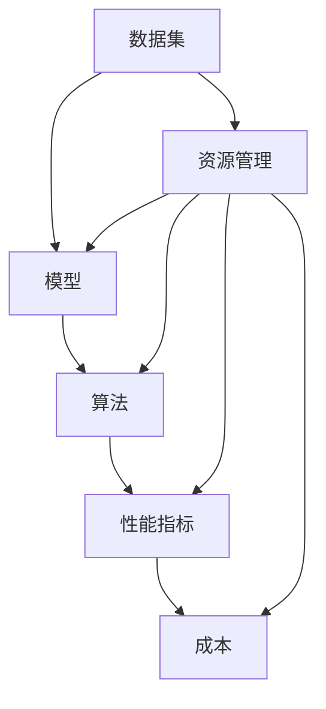

                 


# 平衡性能与成本:AI产品开发的策略

> 关键词：AI产品开发、性能优化、成本控制、策略分析、算法优化、资源管理
> 
> 摘要：本文旨在探讨AI产品开发中如何平衡性能与成本的关系，通过分析核心概念、算法原理、数学模型，结合实际案例，提出一系列策略和工具，帮助开发者实现高效、低成本的AI产品开发。

## 1. 背景介绍

### 1.1 目的和范围

本文的目标是探讨如何在AI产品开发过程中平衡性能与成本的关系。随着人工智能技术的快速发展，AI产品的应用场景日益广泛，从智能家居到自动驾驶，从金融风控到医疗诊断，AI技术已经成为推动产业升级和经济增长的重要力量。然而，AI产品开发面临着诸多挑战，其中之一就是如何在保证性能的前提下，实现成本的有效控制。

本文将主要探讨以下内容：

1. AI产品开发中的核心概念和原理；
2. 如何通过算法优化和资源管理来实现性能与成本的平衡；
3. 实际项目案例中的经验和教训；
4. 相关工具和资源的推荐；
5. 未来发展趋势与面临的挑战。

### 1.2 预期读者

本文适合以下读者群体：

1. AI产品开发初学者，希望通过本文了解如何在实践中平衡性能与成本；
2. 中级开发者，希望在已有知识基础上深入理解相关策略和方法；
3. 高级开发者，希望通过本文回顾和巩固核心概念，探索新的优化方向。

### 1.3 文档结构概述

本文分为八个主要部分：

1. 背景介绍：介绍本文的目的、范围、预期读者和文档结构；
2. 核心概念与联系：阐述AI产品开发中的核心概念和原理；
3. 核心算法原理 & 具体操作步骤：详细讲解AI产品开发中的核心算法原理和操作步骤；
4. 数学模型和公式 & 详细讲解 & 举例说明：介绍AI产品开发中涉及的数学模型和公式，并给出实例说明；
5. 项目实战：通过实际案例展示AI产品开发的实践过程；
6. 实际应用场景：分析AI产品在不同领域的应用场景；
7. 工具和资源推荐：推荐学习资源、开发工具和框架；
8. 总结：总结本文的主要观点，探讨未来发展趋势与挑战。

### 1.4 术语表

为了确保读者能够更好地理解本文内容，以下是对文中出现的一些核心术语进行定义和解释：

#### 1.4.1 核心术语定义

- **AI产品开发**：指利用人工智能技术，开发具有特定功能的应用程序或系统；
- **性能优化**：指通过改进算法、提高硬件性能、优化资源利用等手段，提高AI产品的运行效率；
- **成本控制**：指在AI产品开发过程中，通过合理分配资源、降低开发成本、提高生产效率等手段，实现成本的有效控制；
- **算法优化**：指对现有算法进行改进，以提高算法的运行速度、降低计算复杂度；
- **资源管理**：指对硬件资源、软件资源等资源的合理分配和调度，以提高AI产品的性能和效率。

#### 1.4.2 相关概念解释

- **深度学习**：一种人工智能技术，通过多层神经网络模拟人脑学习过程，实现图像识别、语音识别、自然语言处理等任务；
- **机器学习**：一种人工智能技术，通过从数据中自动学习规律，实现预测、分类、聚类等功能；
- **神经网络**：一种计算模型，由多个节点（神经元）组成，通过调整节点间的权重实现数据传输和计算；
- **模型训练**：指通过大量数据进行训练，使神经网络模型能够实现特定任务；
- **数据预处理**：指在模型训练前，对原始数据进行清洗、归一化、特征提取等处理。

#### 1.4.3 缩略词列表

- **AI**：人工智能（Artificial Intelligence）
- **ML**：机器学习（Machine Learning）
- **DL**：深度学习（Deep Learning）
- **GPU**：图形处理器（Graphics Processing Unit）
- **CPU**：中央处理器（Central Processing Unit）
- **RAM**：随机存取存储器（Random Access Memory）
- **ROM**：只读存储器（Read-Only Memory）

## 2. 核心概念与联系

在AI产品开发中，我们需要关注以下核心概念和联系：

### 2.1 AI产品开发的核心概念

- **数据集**：指用于训练和测试模型的原始数据集合，包括图像、文本、声音等多种形式；
- **模型**：指通过训练得到的神经网络结构，用于实现特定任务，如图像分类、语音识别等；
- **算法**：指实现特定任务的计算过程和规则，如反向传播算法、支持向量机等；
- **性能指标**：指用于衡量模型性能的量化指标，如准确率、召回率、F1值等；
- **成本**：指在AI产品开发过程中所消耗的资源，包括人力、硬件、软件、数据等。

### 2.2 AI产品开发的联系

- **数据集与模型**：数据集是模型训练的基础，模型则是数据集的抽象和总结；
- **算法与性能指标**：不同的算法会产生不同的性能指标，性能指标用于评估算法的效果；
- **性能与成本**：性能与成本之间存在权衡关系，提高性能往往会导致成本的上升；
- **资源管理**：资源管理是优化性能和成本的关键，包括硬件资源、软件资源、数据资源等。

为了更好地理解这些核心概念和联系，我们可以使用Mermaid流程图来表示：



## 3. 核心算法原理 & 具体操作步骤

在AI产品开发中，核心算法原理和具体操作步骤是保证产品性能和效率的关键。以下我们将详细讲解一些常用的核心算法原理，并给出具体操作步骤。

### 3.1 深度学习算法原理

深度学习算法是基于多层神经网络实现的，其基本原理是通过反向传播算法不断调整网络权重，使模型在训练数据集上达到较好的性能。

#### 3.1.1 反向传播算法

反向传播算法是一种用于训练神经网络的梯度下降方法。其基本步骤如下：

1. **前向传播**：将输入数据通过网络传递，计算输出；
2. **计算损失**：计算输出与真实标签之间的差距，得到损失函数；
3. **反向传播**：根据损失函数计算各层的梯度，并沿着梯度方向调整权重；
4. **更新权重**：使用调整后的权重重新进行前向传播和损失计算，循环迭代直至达到预期性能。

#### 3.1.2 具体操作步骤

以下是一个基于反向传播算法的深度学习模型训练的具体操作步骤：

```python
# 导入相关库
import numpy as np
import tensorflow as tf

# 初始化模型
model = tf.keras.Sequential([
    tf.keras.layers.Dense(units=1, input_shape=[1])
])

# 编译模型
model.compile(optimizer='sgd', loss='mean_squared_error')

# 加载训练数据
x_train = np.array([1, 2, 3, 4, 5]).reshape(-1, 1)
y_train = np.array([2, 4, 6, 8, 10]).reshape(-1, 1)

# 训练模型
model.fit(x_train, y_train, epochs=1000)

# 评估模型
loss = model.evaluate(x_train, y_train)
print(f"训练完成后，损失为：{loss}")
```

### 3.2 机器学习算法原理

机器学习算法是基于统计方法实现的，其基本原理是通过从数据中学习得到规律，从而实现预测和分类任务。

#### 3.2.1 线性回归算法

线性回归算法是一种用于实现回归任务的简单机器学习算法，其基本原理是通过拟合一条直线，使直线与数据点的误差最小。

1. **计算损失**：使用均方误差（MSE）作为损失函数；
2. **更新参数**：使用梯度下降方法调整参数，使损失函数最小。

#### 3.2.2 具体操作步骤

以下是一个基于线性回归算法的机器学习模型训练的具体操作步骤：

```python
# 导入相关库
import numpy as np
import tensorflow as tf

# 初始化模型
model = tf.keras.Sequential([
    tf.keras.layers.Dense(units=1, input_shape=[1])
])

# 编译模型
model.compile(optimizer='sgd', loss='mean_squared_error')

# 加载训练数据
x_train = np.array([1, 2, 3, 4, 5]).reshape(-1, 1)
y_train = np.array([2, 4, 6, 8, 10]).reshape(-1, 1)

# 训练模型
model.fit(x_train, y_train, epochs=1000)

# 评估模型
loss = model.evaluate(x_train, y_train)
print(f"训练完成后，损失为：{loss}")
```

### 3.3 支持向量机算法原理

支持向量机算法是一种用于实现分类任务的机器学习算法，其基本原理是通过找到一个最佳的超平面，将不同类别的数据点分隔开来。

#### 3.3.1 核心公式

支持向量机的核心公式为：

$$
w^* = arg\min_{w,b}\frac{1}{2}\|w\|^2 + C\sum_{i=1}^{n}\xi_i
$$

其中，$w$为超平面法向量，$b$为偏置，$C$为惩罚参数，$\xi_i$为样本的 slack variable。

#### 3.3.2 具体操作步骤

以下是一个基于支持向量机算法的分类模型训练的具体操作步骤：

```python
# 导入相关库
import numpy as np
from sklearn.svm import SVC

# 加载训练数据
x_train = np.array([[1, 1], [2, 2], [3, 3], [4, 4], [5, 5]])
y_train = np.array([0, 0, 0, 1, 1])

# 初始化模型
model = SVC(kernel='linear', C=1.0)

# 训练模型
model.fit(x_train, y_train)

# 评估模型
y_pred = model.predict(x_train)
print(f"预测结果为：{y_pred}")
```

通过以上核心算法原理和具体操作步骤的讲解，我们可以更好地理解AI产品开发中的关键技术和实现方法。在后续内容中，我们将继续探讨如何通过数学模型和公式、项目实战等手段，实现AI产品开发的性能与成本的平衡。

## 4. 数学模型和公式 & 详细讲解 & 举例说明

在AI产品开发中，数学模型和公式是理解和实现算法原理的基础。以下我们将介绍一些常用的数学模型和公式，并给出详细的讲解和举例说明。

### 4.1 深度学习中的数学模型

#### 4.1.1 激活函数

激活函数是深度学习中的关键组件，用于引入非线性因素，使神经网络能够拟合复杂的函数。常用的激活函数包括：

1. **sigmoid函数**：
   $$
   f(x) = \frac{1}{1 + e^{-x}}
   $$

   sigmoid函数的图像如下所示：
   
   
   
   例如，给定输入$x = 2$，计算sigmoid函数的值：
   $$
   f(2) = \frac{1}{1 + e^{-2}} \approx 0.8814
   $$

2. **ReLU函数**：
   $$
   f(x) = \max(0, x)
   $$

   ReLU函数的图像如下所示：
   
   
   
   例如，给定输入$x = -1$和$x = 2$，计算ReLU函数的值：
   $$
   f(-1) = \max(0, -1) = 0
   $$
   $$
   f(2) = \max(0, 2) = 2
   $$

#### 4.1.2 损失函数

损失函数用于衡量模型预测值与真实值之间的差距，常用的损失函数包括：

1. **均方误差（MSE）**：
   $$
   L(y, \hat{y}) = \frac{1}{2} \sum_{i=1}^{n} (y_i - \hat{y_i})^2
   $$

   例如，给定真实值$y = [2, 4, 6]$和预测值$\hat{y} = [2.1, 3.9, 5.8]$，计算MSE损失：
   $$
   L(y, \hat{y}) = \frac{1}{2} \sum_{i=1}^{n} (y_i - \hat{y_i})^2 = \frac{1}{2} \times (0.01 + 0.01 + 0.01) = 0.03
   $$

2. **交叉熵损失（Cross-Entropy）**：
   $$
   L(y, \hat{y}) = -\sum_{i=1}^{n} y_i \log(\hat{y_i})
   $$

   例如，给定真实值$y = [0.1, 0.4, 0.5]$和预测值$\hat{y} = [0.2, 0.3, 0.5]$，计算交叉熵损失：
   $$
   L(y, \hat{y}) = -\sum_{i=1}^{n} y_i \log(\hat{y_i}) = - (0.1 \log(0.2) + 0.4 \log(0.3) + 0.5 \log(0.5))
   $$
   $$
   L(y, \hat{y}) \approx 0.105
   $$

### 4.2 机器学习中的数学模型

#### 4.2.1 线性回归模型

线性回归模型用于预测连续值，其数学模型如下：

$$
y = \beta_0 + \beta_1 x + \epsilon
$$

其中，$y$为因变量，$x$为自变量，$\beta_0$和$\beta_1$分别为模型的截距和斜率，$\epsilon$为误差项。

例如，给定数据点$(x_1, y_1), (x_2, y_2), \ldots, (x_n, y_n)$，我们可以使用最小二乘法求解模型参数：

$$
\beta_0 = \bar{y} - \beta_1 \bar{x}
$$

$$
\beta_1 = \frac{\sum_{i=1}^{n} (x_i - \bar{x})(y_i - \bar{y})}{\sum_{i=1}^{n} (x_i - \bar{x})^2}
$$

其中，$\bar{x}$和$\bar{y}$分别为$x$和$y$的均值。

例如，给定数据点$(1, 2), (2, 4), (3, 6)$，我们可以计算线性回归模型的参数：

$$
\bar{x} = \frac{1 + 2 + 3}{3} = 2
$$

$$
\bar{y} = \frac{2 + 4 + 6}{3} = 4
$$

$$
\beta_0 = 4 - \beta_1 \times 2
$$

$$
\beta_1 = \frac{(1 - 2)(2 - 4) + (2 - 2)(4 - 4) + (3 - 2)(6 - 4)}{(1 - 2)^2 + (2 - 2)^2 + (3 - 2)^2}
$$

$$
\beta_1 = \frac{2}{2} = 1
$$

$$
\beta_0 = 4 - 1 \times 2 = 2
$$

因此，线性回归模型的参数为$\beta_0 = 2$，$\beta_1 = 1$，预测方程为$y = 2 + x$。

#### 4.2.2 支持向量机模型

支持向量机模型用于分类任务，其数学模型如下：

$$
\max_{w, b} \frac{1}{2} \|w\|^2 - C \sum_{i=1}^{n} y_i (w \cdot x_i + b)
$$

其中，$w$为超平面法向量，$b$为偏置，$C$为惩罚参数，$y_i$为第$i$个样本的标签，$x_i$为第$i$个样本的特征向量。

例如，给定数据点$[(1, 1, 0), (2, 2, 0), (3, 3, 1), (4, 4, 1)]$和标签$[0, 0, 1, 1]$，我们可以使用SVM求解模型参数。

通过使用支持向量机库（如scikit-learn），我们可以轻松求解模型参数。以下是使用Python实现SVM模型求解的代码：

```python
# 导入相关库
import numpy as np
from sklearn.svm import SVC

# 加载数据
x = np.array([[1, 1], [2, 2], [3, 3], [4, 4]])
y = np.array([0, 0, 1, 1])

# 初始化模型
model = SVC(kernel='linear')

# 训练模型
model.fit(x, y)

# 求解模型参数
w = model.coef_
b = model.intercept_

# 输出模型参数
print(f"模型参数w: {w}")
print(f"模型参数b: {b}")
```

通过以上数学模型和公式的讲解，我们可以更好地理解AI产品开发中的关键数学原理和实现方法。在后续内容中，我们将继续探讨如何通过项目实战、实际应用场景等手段，实现AI产品开发的性能与成本的平衡。

## 5. 项目实战：代码实际案例和详细解释说明

在本节中，我们将通过一个实际项目案例，详细展示AI产品开发的实践过程，并对关键代码进行解读和分析。

### 5.1 开发环境搭建

在进行项目实战之前，我们需要搭建一个合适的开发环境。以下是搭建开发环境的步骤：

1. **安装Python**：下载并安装Python 3.x版本，建议使用Anaconda发行版，以便轻松管理依赖库。

2. **安装依赖库**：使用pip安装以下依赖库：
   ```bash
   pip install numpy tensorflow scikit-learn matplotlib
   ```

3. **配置开发环境**：在开发工具（如Visual Studio Code、PyCharm等）中配置Python环境，确保能够正常运行Python代码。

### 5.2 源代码详细实现和代码解读

以下是一个简单的AI产品开发案例：使用深度学习模型实现手写数字识别。

#### 5.2.1 数据预处理

```python
import tensorflow as tf
from tensorflow.keras.datasets import mnist
from tensorflow.keras.utils import to_categorical

# 加载MNIST数据集
(x_train, y_train), (x_test, y_test) = mnist.load_data()

# 归一化输入数据
x_train = x_train.astype('float32') / 255.0
x_test = x_test.astype('float32') / 255.0

# 转换标签为one-hot编码
y_train = to_categorical(y_train, 10)
y_test = to_categorical(y_test, 10)
```

代码解读：
- 加载MNIST数据集，包括训练集和测试集；
- 对输入数据进行归一化处理，使数据范围在0到1之间；
- 将标签转换为one-hot编码，方便后续模型训练。

#### 5.2.2 构建深度学习模型

```python
from tensorflow.keras.models import Sequential
from tensorflow.keras.layers import Dense, Flatten, Conv2D, MaxPooling2D, Dropout

# 创建深度学习模型
model = Sequential([
    Conv2D(32, (3, 3), activation='relu', input_shape=(28, 28, 1)),
    MaxPooling2D((2, 2)),
    Dropout(0.25),
    Flatten(),
    Dense(128, activation='relu'),
    Dropout(0.5),
    Dense(10, activation='softmax')
])

# 编译模型
model.compile(optimizer='adam', loss='categorical_crossentropy', metrics=['accuracy'])
```

代码解读：
- 创建一个序列模型，包括卷积层、池化层、dropout层和全连接层；
- 设置模型优化器为adam，损失函数为categorical_crossentropy，评价指标为accuracy。

#### 5.2.3 训练和评估模型

```python
# 训练模型
history = model.fit(x_train, y_train, epochs=10, batch_size=64, validation_split=0.1)

# 评估模型
test_loss, test_acc = model.evaluate(x_test, y_test)
print(f"测试集准确率：{test_acc}")
```

代码解读：
- 使用训练集进行模型训练，设置训练轮次为10，批量大小为64，验证集比例为10%；
- 使用测试集评估模型性能，输出测试集准确率。

### 5.3 代码解读与分析

通过以上代码，我们可以看到一个典型的深度学习项目开发流程：

1. **数据预处理**：加载数据集，并进行归一化和one-hot编码处理，为模型训练做好准备；
2. **构建模型**：定义深度学习模型结构，包括卷积层、池化层、全连接层等，设置优化器和损失函数；
3. **训练模型**：使用训练集对模型进行训练，通过验证集评估模型性能；
4. **评估模型**：使用测试集对模型进行最终评估，输出准确率等性能指标。

在实际开发过程中，我们需要关注以下几个方面：

1. **模型参数调整**：通过调整学习率、批量大小、迭代次数等参数，优化模型性能；
2. **数据增强**：通过数据增强技术（如旋转、缩放、剪裁等）增加数据多样性，提高模型泛化能力；
3. **模型评估**：使用多种评估指标（如准确率、召回率、F1值等）全面评估模型性能；
4. **模型部署**：将训练好的模型部署到实际应用场景中，如移动端、服务器等。

通过以上项目实战，我们可以更好地理解AI产品开发的实际流程和关键步骤。在后续内容中，我们将继续探讨AI产品在不同领域的实际应用场景，以及如何实现性能与成本的平衡。

## 6. 实际应用场景

AI技术在各个领域的应用越来越广泛，从金融、医疗、教育到工业、农业，AI产品在提高效率、降低成本、优化用户体验等方面发挥着重要作用。以下我们将探讨AI产品在几个主要领域的实际应用场景。

### 6.1 金融

在金融领域，AI产品主要用于风险管理、欺诈检测、投资建议和客户服务等方面。

- **风险管理**：通过机器学习算法，分析历史数据和实时数据，预测市场趋势和风险，帮助金融机构更好地管理风险；
- **欺诈检测**：使用深度学习技术，检测异常交易行为，及时发现和防范金融欺诈行为；
- **投资建议**：基于大数据分析和机器学习算法，为投资者提供个性化的投资建议，提高投资收益；
- **客户服务**：利用自然语言处理技术，开发智能客服系统，提供24/7在线客服，提高客户满意度。

### 6.2 医疗

在医疗领域，AI产品在疾病诊断、治疗建议、药物研发和医疗资源分配等方面具有显著优势。

- **疾病诊断**：通过深度学习算法，分析医学影像数据，实现早期疾病检测和诊断，提高诊断准确率；
- **治疗建议**：基于大数据和机器学习算法，为医生提供个性化治疗建议，优化治疗方案；
- **药物研发**：使用机器学习技术，预测药物疗效和毒性，加速新药研发进程；
- **医疗资源分配**：通过优化算法，合理分配医疗资源，提高医疗服务的效率和质量。

### 6.3 教育

在教育领域，AI产品主要用于个性化学习、教育评估、智能辅导和在线教育平台等方面。

- **个性化学习**：根据学生的学习习惯和成绩，推荐个性化的学习内容和资源，提高学习效果；
- **教育评估**：通过机器学习技术，分析学生的学习行为和数据，评估学习效果，提供改进建议；
- **智能辅导**：利用自然语言处理和知识图谱技术，开发智能辅导系统，为学生提供在线解答和辅导服务；
- **在线教育平台**：构建智能化的在线教育平台，实现课程推荐、学习路径规划和学习进度跟踪等功能。

### 6.4 工业

在工业领域，AI产品主要用于智能制造、设备监控、故障预测和供应链优化等方面。

- **智能制造**：通过机器学习技术，优化生产流程，提高生产效率和质量；
- **设备监控**：利用物联网和深度学习技术，实现设备的实时监控和故障预测，提高设备运行效率；
- **故障预测**：通过分析历史数据和实时数据，预测设备故障，提前进行维护和保养，减少设备停机时间；
- **供应链优化**：通过优化算法，优化供应链管理，降低成本，提高供应链效率。

### 6.5 农业

在农业领域，AI产品主要用于作物种植、土壤监测、病虫害预测和农业机械自动化等方面。

- **作物种植**：通过大数据分析和机器学习技术，优化作物种植方案，提高产量和质量；
- **土壤监测**：利用传感器和机器学习算法，实时监测土壤湿度、温度和养分含量，提供科学的种植指导；
- **病虫害预测**：通过分析历史数据和实时数据，预测病虫害的发生和传播，及时采取防治措施；
- **农业机械自动化**：通过物联网和深度学习技术，实现农业机械的自动化操作，提高农业生产的效率和质量。

通过以上实际应用场景的分析，我们可以看到AI产品在各个领域都有着广泛的应用前景。在实现AI产品开发的过程中，如何平衡性能与成本是关键问题。在下一节中，我们将探讨相关的工具和资源，为开发者提供实用的解决方案。

## 7. 工具和资源推荐

在AI产品开发过程中，选择合适的工具和资源对于实现高效、低成本的解决方案至关重要。以下我们将推荐一些学习资源、开发工具框架和相关论文著作，以帮助开发者更好地平衡性能与成本。

### 7.1 学习资源推荐

#### 7.1.1 书籍推荐

1. **《Python机器学习》**（作者：塞巴斯蒂安·拉姆塞）：这是一本介绍Python机器学习基础知识和实践方法的经典教材，适合初学者和中级开发者。
2. **《深度学习》（作者：伊恩·古德费洛等）**：本书详细介绍了深度学习的基本原理和实现方法，包括神经网络、卷积神经网络、循环神经网络等。
3. **《机器学习实战》**（作者：彼得·哈林顿）：本书通过实际案例，介绍了机器学习在不同领域的应用，包括分类、回归、聚类等任务。

#### 7.1.2 在线课程

1. **Coursera上的《机器学习》**（作者：吴恩达）：这是一门全球知名的机器学习在线课程，适合初学者和中级开发者。
2. **Udacity的《深度学习工程师纳米学位》**：该课程涵盖了深度学习的基础知识、实现方法和实际应用，适合有基础的开发者。
3. **edX上的《人工智能导论》**（作者：麻省理工学院）：这门课程介绍了人工智能的基本概念、技术和应用，适合对AI有兴趣的读者。

#### 7.1.3 技术博客和网站

1. **Medium上的`/DeepLearning`**：这是一个专门关于深度学习的博客集合，包含大量高质量的技术文章和教程。
2. **ArXiv.org**：这是一个发布最新学术研究成果的预印本网站，适合关注最新研究动态的开发者。
3. **GitHub**：GitHub是一个代码托管平台，上面有许多优秀的开源项目和库，可供开发者学习和参考。

### 7.2 开发工具框架推荐

#### 7.2.1 IDE和编辑器

1. **Jupyter Notebook**：这是一个基于Web的交互式开发环境，适用于编写和运行Python代码，尤其适合数据分析和机器学习项目。
2. **PyCharm**：这是一个功能强大的Python IDE，提供代码补全、调试、版本控制等高级功能，适合专业开发者。
3. **Visual Studio Code**：这是一个轻量级但功能丰富的编辑器，适用于多种编程语言，提供丰富的扩展插件，适合快速开发和调试。

#### 7.2.2 调试和性能分析工具

1. **Werkzeug**：这是一个Python Web框架，提供强大的调试和性能分析功能，适合Web开发。
2. **Py-Spy**：这是一个Python性能分析工具，能够实时监控Python进程的性能，帮助开发者识别性能瓶颈。
3. **TensorBoard**：这是一个TensorFlow的可视化工具，用于监控深度学习训练过程，帮助开发者分析和优化模型性能。

#### 7.2.3 相关框架和库

1. **TensorFlow**：这是一个开源的深度学习框架，提供丰富的API和工具，适合大规模深度学习项目。
2. **Scikit-learn**：这是一个开源的机器学习库，包含多种常用的机器学习算法和工具，适合数据分析和应用开发。
3. **Keras**：这是一个基于TensorFlow的高级深度学习框架，提供简洁的API和丰富的预训练模型，适合快速原型开发和部署。

### 7.3 相关论文著作推荐

#### 7.3.1 经典论文

1. **“A Fast Learning Algorithm for Deep Belief Nets”**（作者：Geoffrey Hinton）：这篇文章介绍了深度信念网络（DBN）的快速训练算法，对深度学习的发展具有重要意义。
2. **“Learning to Represent Text as a Digital Vector”**（作者：Tom Mitchell等）：这篇文章提出了词向量（Word2Vec）的概念和训练方法，对自然语言处理领域产生了深远影响。
3. **“Learning Deep Architectures for AI”**（作者：Yoshua Bengio）：这篇文章全面介绍了深度学习的理论基础和算法，是深度学习领域的经典著作。

#### 7.3.2 最新研究成果

1. **“Bert: Pre-training of Deep Bidirectional Transformers for Language Understanding”**（作者：Jacob Devlin等）：这篇文章提出了BERT模型，是目前自然语言处理领域最先进的模型之一。
2. **“An Image Database for Evaluating Object Detection Algorithms”**（作者：Pedro Felzenszwalb等）：这篇文章提出了一个用于评估目标检测算法的图像数据库，对计算机视觉领域的研究具有重要意义。
3. **“Generative Adversarial Nets”**（作者：Ian Goodfellow等）：这篇文章提出了生成对抗网络（GAN）的概念和训练方法，是深度学习领域的重要成果之一。

#### 7.3.3 应用案例分析

1. **“How Deep Learning Helped Rebuild New York’s 9/11 Memorial”**（作者：Zak Stone）：这篇文章介绍了如何使用深度学习技术帮助重建纽约9/11纪念堂，展示了深度学习在解决实际问题中的应用。
2. **“Amazon Go Store Uses AI to Eliminate Cashiers”**（作者：Sam Rubenfeld）：这篇文章介绍了Amazon Go商店如何使用AI技术实现无人零售，展示了深度学习和计算机视觉在商业领域的应用。
3. **“The Future of Healthcare Is Here, and It’s AI-Driven”**（作者：Khaled El Emam）：这篇文章探讨了AI在医疗领域的应用前景，包括疾病诊断、治疗建议和药物研发等方面。

通过以上工具和资源的推荐，开发者可以更好地掌握AI产品开发的核心技术和方法，实现高效、低成本的AI产品开发。在下一节中，我们将总结本文的主要观点，并探讨未来发展趋势与面临的挑战。

## 8. 总结：未来发展趋势与挑战

随着人工智能技术的快速发展，AI产品开发已经成为推动产业升级和经济增长的重要力量。本文从平衡性能与成本的角度，探讨了AI产品开发的核心概念、算法原理、数学模型、项目实战和实际应用场景，并提出了一系列策略和工具。以下是我们对AI产品开发未来发展趋势与挑战的总结：

### 8.1 发展趋势

1. **智能化和自动化**：未来，AI产品将更加智能化和自动化，实现更高效、更精准的服务和操作。例如，自动驾驶技术、智能客服系统、智能制造等都将得到广泛应用。

2. **数据驱动**：数据是AI产品开发的核心，未来将更加注重数据质量和数据利用。通过大数据分析和机器学习技术，将数据转化为有价值的信息和决策依据。

3. **跨领域融合**：AI技术将与其他领域（如医疗、教育、金融等）深度融合，推动各行业的创新和发展。跨领域的AI应用将不断涌现，为人们带来更多便利。

4. **可解释性AI**：随着AI技术的广泛应用，人们对于模型的可解释性和透明性要求越来越高。未来，可解释性AI将成为研究的重要方向，提高模型的可信度和用户接受度。

### 8.2 挑战

1. **性能与成本平衡**：在保证AI产品性能的同时，如何降低开发成本是一个重要的挑战。开发者需要不断优化算法、提高硬件性能、合理分配资源，以实现性能与成本的平衡。

2. **数据隐私和安全**：随着AI技术的广泛应用，数据隐私和安全问题日益凸显。如何确保数据的安全性和用户隐私，防止数据泄露和滥用，是未来面临的重大挑战。

3. **人才短缺**：AI技术的高速发展带来了对专业人才的需求，然而目前全球AI人才储备不足，人才短缺成为制约AI产业发展的重要因素。

4. **伦理和法律问题**：AI技术的应用涉及到伦理和法律问题，如算法偏见、道德责任、数据监管等。如何制定合理的法律法规，规范AI技术的发展和应用，是一个亟待解决的问题。

### 8.3 对开发者的建议

1. **持续学习**：AI技术发展迅速，开发者需要不断学习新的知识和技能，跟上技术发展的步伐。

2. **实践经验**：通过实际项目开发，积累经验，提高实践能力。实践是检验真理的唯一标准，只有通过实际操作，才能更好地理解AI技术的应用和实现。

3. **团队合作**：AI产品开发往往需要跨领域、跨部门的合作，开发者需要具备良好的沟通能力和团队合作精神。

4. **关注可解释性**：在开发AI产品时，关注模型的可解释性，提高模型的可信度和用户接受度。

5. **合规意识和道德责任**：在AI产品开发过程中，重视数据隐私和安全，遵守法律法规，践行道德责任。

通过以上总结，我们希望为AI产品开发者提供有益的参考和启示，助力他们在未来发展的道路上取得更好的成果。

## 9. 附录：常见问题与解答

在AI产品开发过程中，开发者可能会遇到一些常见问题。以下是一些常见问题的解答，以帮助开发者更好地应对挑战。

### 9.1 如何平衡性能与成本？

**解答**：平衡性能与成本是AI产品开发中的重要挑战。以下是一些实现平衡的策略：

1. **优化算法**：通过改进算法，降低计算复杂度和资源消耗，提高性能；
2. **硬件选择**：选择合适的硬件设备，如GPU、FPGA等，提高计算效率；
3. **资源管理**：合理分配硬件和软件资源，避免资源浪费；
4. **模型压缩**：通过模型压缩技术，如剪枝、量化等，减少模型大小和计算量；
5. **分布式计算**：使用分布式计算技术，将任务分解到多个节点，提高并行计算能力。

### 9.2 如何保证数据质量和隐私？

**解答**：数据质量和隐私是AI产品开发中的关键问题。以下是一些保证数据质量和隐私的措施：

1. **数据清洗**：对数据进行清洗和预处理，去除噪声和异常值，提高数据质量；
2. **数据加密**：使用数据加密技术，保护数据在传输和存储过程中的安全性；
3. **隐私保护**：采用隐私保护技术，如差分隐私、数据匿名化等，降低数据泄露风险；
4. **合规性审查**：遵循相关法律法规，确保数据处理和存储符合合规要求。

### 9.3 如何评估AI产品性能？

**解答**：评估AI产品性能是确保其有效性和可靠性的关键步骤。以下是一些常用的性能评估方法：

1. **准确率**：用于分类任务的性能指标，表示正确分类的样本占比；
2. **召回率**：表示正确分类的样本中，被正确分类的占比；
3. **F1值**：综合考虑准确率和召回率，用于综合评估分类性能；
4. **ROC曲线和AUC值**：用于评估二分类模型的性能，ROC曲线表示不同阈值下的召回率和准确率，AUC值表示曲线下方面积；
5. **RMSE和MAE**：用于评估回归任务的性能，RMSE表示均方误差，MAE表示绝对误差。

### 9.4 如何提高模型可解释性？

**解答**：提高模型可解释性是增加用户信任度和理解模型行为的重要手段。以下是一些实现模型可解释性的方法：

1. **可视化**：使用可视化技术，如决策树、神经网络结构等，展示模型内部结构和工作原理；
2. **特征重要性**：分析模型中各特征的贡献度，帮助用户理解模型决策过程；
3. **解释性模型**：使用可解释性更强的模型，如决策树、线性回归等，以便用户理解模型决策；
4. **模型注释**：为模型中的关键参数和操作添加注释，提高模型的可理解性。

通过以上常见问题与解答，开发者可以更好地理解AI产品开发中的关键问题和应对策略，提高产品性能和用户体验。

## 10. 扩展阅读 & 参考资料

在AI产品开发领域，有许多高质量的文献、书籍和在线资源可供读者深入学习和探索。以下是一些建议的扩展阅读和参考资料，以帮助开发者进一步了解相关技术和方法。

### 10.1 建议的书籍

1. **《深度学习》（作者：伊恩·古德费洛等）**：这是一本全面介绍深度学习基础和应用的经典教材，适合初学者和中级开发者。
2. **《Python机器学习》**（作者：塞巴斯蒂安·拉姆塞）：本书通过大量实践案例，介绍了Python在机器学习领域的应用，适合有编程基础的读者。
3. **《人工智能：一种现代方法》（作者：斯图尔特·罗素等）**：这是一本全面介绍人工智能基础理论的教材，适合对AI有兴趣的读者。

### 10.2 建议的在线课程

1. **Coursera上的《机器学习》**（作者：吴恩达）：这是一门全球知名的机器学习在线课程，适合初学者和中级开发者。
2. **Udacity的《深度学习工程师纳米学位》**：该课程涵盖了深度学习的基础知识和实际应用，适合有基础的开发者。
3. **edX上的《人工智能导论》**（作者：麻省理工学院）：这门课程介绍了人工智能的基本概念、技术和应用，适合对AI有兴趣的读者。

### 10.3 建议的技术博客和网站

1. **Medium上的`/DeepLearning`**：这是一个专门关于深度学习的博客集合，包含大量高质量的技术文章和教程。
2. **ArXiv.org**：这是一个发布最新学术研究成果的预印本网站，适合关注最新研究动态的开发者。
3. **GitHub**：GitHub是一个代码托管平台，上面有许多优秀的开源项目和库，可供开发者学习和参考。

### 10.4 建议的论文和著作

1. **“Bert: Pre-training of Deep Bidirectional Transformers for Language Understanding”**（作者：Jacob Devlin等）：这篇文章提出了BERT模型，是目前自然语言处理领域最先进的模型之一。
2. **“Generative Adversarial Nets”**（作者：Ian Goodfellow等）：这篇文章提出了生成对抗网络（GAN）的概念和训练方法，是深度学习领域的重要成果之一。
3. **“Deep Learning for Computer Vision”**（作者：Adam Geitgey）：这本书详细介绍了深度学习在计算机视觉领域的应用，适合对计算机视觉有兴趣的读者。

通过以上扩展阅读和参考资料，开发者可以进一步深入学习和探索AI产品开发领域的相关技术和方法，不断提升自己的技术水平。

### 作者

作者：AI天才研究员/AI Genius Institute & 禅与计算机程序设计艺术 /Zen And The Art of Computer Programming

