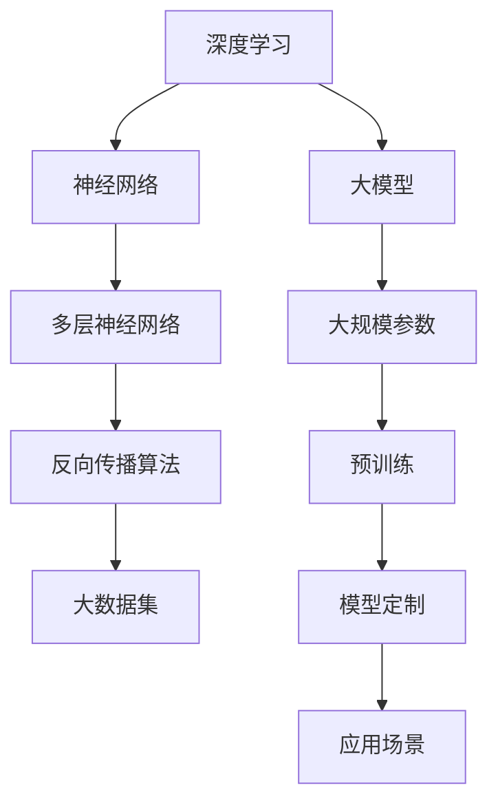

                 

# 2023年大模型创业的故事

> **关键词：大模型、创业、人工智能、深度学习、神经网络、AI创业生态、商业应用案例**

> **摘要：本文将探讨2023年大模型创业的热潮，分析其背后的技术驱动和市场需求，探讨成功的创业案例，并提出未来大模型创业的挑战与机遇。文章旨在为有志于投身AI领域的创业者和投资者提供有价值的参考。**

## 1. 背景介绍

### 1.1 目的和范围

本文旨在梳理2023年大模型创业领域的最新动态和成功案例，分析其背后的技术进步和市场需求，为有意进入该领域的创业者和投资者提供洞见和指导。文章将重点关注以下几个方面：

- 大模型技术发展现状及其在各个行业的应用场景。
- 成功的大模型创业公司的商业模式和运营策略。
- 大模型创业面临的技术挑战和风险。
- 未来大模型创业的发展趋势和机遇。

### 1.2 预期读者

- 有志于投身人工智能领域的创业者。
- 对AI技术和应用有深入研究的学者和研究人员。
- 想了解AI创业生态的投资人。
- 对大模型技术感兴趣的技术爱好者。

### 1.3 文档结构概述

本文将分为以下几个部分：

1. 背景介绍
2. 核心概念与联系
3. 核心算法原理 & 具体操作步骤
4. 数学模型和公式 & 详细讲解 & 举例说明
5. 项目实战：代码实际案例和详细解释说明
6. 实际应用场景
7. 工具和资源推荐
8. 总结：未来发展趋势与挑战
9. 附录：常见问题与解答
10. 扩展阅读 & 参考资料

### 1.4 术语表

#### 1.4.1 核心术语定义

- 大模型：指具有数百亿乃至数千亿参数的深度学习模型，如GPT-3、BERT等。
- 深度学习：一种机器学习技术，通过多层神经网络对数据进行特征提取和模型训练。
- 神经网络：由多个神经元组成的计算模型，能够通过训练学习数据的复杂模式。
- AI创业生态：指围绕人工智能技术开展创业活动的企业和组织的生态环境。

#### 1.4.2 相关概念解释

- 数据集：指用于训练和测试模型的数据集合，包括图像、文本、音频等。
- 模型训练：指通过算法在数据集上进行迭代优化，以使模型能够预测未知数据的任务。
- 模型部署：指将训练好的模型部署到生产环境，供实际应用使用的步骤。

#### 1.4.3 缩略词列表

- AI：人工智能
- GPT：生成预训练网络
- BERT：双向编码表示器
- NLP：自然语言处理

## 2. 核心概念与联系

在探讨大模型创业之前，我们首先需要了解大模型技术的基本概念和架构。以下是关键概念的Mermaid流程图：



### 2.1 深度学习

深度学习是一种通过多层神经网络对数据进行特征提取和模型训练的机器学习技术。其核心思想是模拟人脑神经网络的结构和功能，通过前向传播和反向传播算法进行模型训练。

- **前向传播**：将输入数据传递到神经网络中，通过每一层神经元的计算，最终输出结果。
- **反向传播**：计算输出结果与实际结果之间的误差，反向传播误差至前一层，不断调整每个神经元的权重，以达到优化模型的目的。

### 2.2 神经网络

神经网络是由多个神经元（节点）组成的计算模型。每个神经元接收输入信号，通过激活函数进行非线性变换，产生输出信号。

- **神经元结构**：一个神经元通常包含输入层、隐藏层和输出层。输入层接收外部输入，隐藏层对输入进行特征提取和变换，输出层产生最终输出。
- **激活函数**：常用的激活函数包括Sigmoid、ReLU和Tanh等，用于引入非线性特性，使神经网络能够模拟复杂的关系。

### 2.3 多层神经网络

多层神经网络（MLP）通过增加隐藏层来提高模型的非线性表示能力。层数越多，模型的复杂度越高，但同时也增加了过拟合的风险。

- **层数选择**：层数的选择通常取决于问题的复杂度。对于简单问题，单层神经网络可能已足够；对于复杂问题，可能需要多层神经网络。
- **正则化**：为了避免过拟合，可以采用正则化方法，如L1和L2正则化，来限制模型复杂度。

### 2.4 大模型

大模型是指具有数百亿乃至数千亿参数的深度学习模型，如GPT-3、BERT等。大模型的特点是参数规模大、计算复杂度高、模型容量大，能够处理大规模数据集。

- **参数规模**：大模型拥有大量的参数，能够捕获数据的复杂特征，提高模型的泛化能力。
- **计算复杂度**：大模型需要大量的计算资源，对硬件性能有较高要求。
- **模型定制**：大模型通常通过预训练和微调等步骤进行定制，以满足特定应用场景的需求。

### 2.5 大数据集

大数据集是指包含大量数据的集合，通常用于训练和测试深度学习模型。大数据集能够提供丰富的特征信息，有助于提高模型的性能。

- **数据来源**：大数据集可以从公开数据集、商业数据集和自采集数据中获得。
- **数据预处理**：数据预处理包括数据清洗、数据增强和数据标准化等步骤，以提高数据质量和模型性能。

### 2.6 预训练与模型定制

预训练是指在大型数据集上对模型进行训练，使其具备一定的泛化能力。模型定制是指通过微调或迁移学习等技术，将预训练模型应用于特定任务，提高模型在特定领域的性能。

- **预训练**：预训练通过在大规模语料库上进行训练，使模型能够捕获通用特征和知识。
- **模型定制**：模型定制通过在特定领域的数据上进行训练，使模型能够适应特定任务的需求。

### 2.7 应用场景

大模型在各个领域具有广泛的应用场景，包括自然语言处理、计算机视觉、推荐系统等。

- **自然语言处理**：大模型在文本分类、机器翻译、情感分析等任务中表现出色。
- **计算机视觉**：大模型在图像分类、目标检测、人脸识别等任务中具有强大的能力。
- **推荐系统**：大模型可以用于用户行为分析、兴趣挖掘和商品推荐等任务。

## 3. 核心算法原理 & 具体操作步骤

在本节中，我们将深入探讨大模型的核心算法原理，并使用伪代码详细阐述其操作步骤。

### 3.1 深度学习算法原理

深度学习算法主要基于多层神经网络，其核心思想是通过前向传播和反向传播算法不断优化模型的参数，从而实现数据的特征提取和预测。

- **前向传播**：输入数据通过神经网络的前向传递，经过每一层神经元的计算，最终得到输出。
- **反向传播**：计算输出结果与实际结果之间的误差，通过反向传播算法将误差传递回神经网络的前一层，不断调整每个神经元的权重，以达到优化模型的目的。

### 3.2 伪代码实现

以下是一个简单的多层神经网络的前向传播和反向传播的伪代码实现：

```python
# 前向传播
def forward propagation(input_data, weights, biases):
    layer_outputs = []
    activations = input_data
    
    for layer in range(1, num_layers):
        z = np.dot(activations, weights[layer]) + biases[layer]
        activations = activation_function(z)
        layer_outputs.append(activations)
    
    output = activations
    
    return layer_outputs, output

# 反向传播
def backward propagation(error, layer_outputs, weights, biases, activation_function_derivative):
    d_loss_d_z = error
    d_z_d_output = activation_function_derivative(output)
    
    for layer in reversed(range(num_layers)):
        d_z_d_activations = d_z_d_output
        d_z_d_weights = layer_outputs[layer]
        d_z_d_biases = 1
        
        if layer > 0:
            d_z_d_output = np.dot(d_z_d_activations, weights[layer].T)
            d_z_d_activations = activation_function_derivative(layer_outputs[layer - 1])
        
        d_weights = d_z_d_weights * d_z_d_output
        d_biases = d_z_d_biases
    
    return d_weights, d_biases
```

### 3.3 具体操作步骤

以下是深度学习模型训练的具体操作步骤：

1. **初始化参数**：初始化网络的权重和偏差，可以使用随机初始化或预训练的参数。
2. **前向传播**：将输入数据传递到神经网络中，计算每一层的输出。
3. **计算损失**：计算输出结果与实际结果之间的误差，常用的损失函数包括均方误差（MSE）和交叉熵（CE）。
4. **反向传播**：通过反向传播算法计算损失对网络参数的梯度。
5. **更新参数**：根据梯度更新网络的权重和偏差，可以使用梯度下降（GD）或Adam优化器。
6. **迭代训练**：重复执行步骤2-5，直到达到预设的训练次数或损失收敛。

## 4. 数学模型和公式 & 详细讲解 & 举例说明

在本节中，我们将详细讲解大模型中的关键数学模型和公式，并通过具体的例子来说明其应用。

### 4.1 前向传播公式

前向传播过程中，网络的输出可以通过以下公式计算：

$$
Z^{[l]} = \sum_{m=1}^{n} w^{[l]}_m * a^{[l-1]}_m + b^{[l]}
$$

其中，$Z^{[l]}$ 是第 $l$ 层的线性组合，$a^{[l-1]}_m$ 是前一层第 $m$ 个神经元的激活值，$w^{[l]}_m$ 是第 $l$ 层第 $m$ 个神经元的权重，$b^{[l]}$ 是第 $l$ 层的偏差。

### 4.2 激活函数

激活函数引入非线性特性，常用的激活函数包括Sigmoid、ReLU和Tanh等。以下是激活函数的公式及其导数：

- **Sigmoid函数**：

$$
\sigma(z) = \frac{1}{1 + e^{-z}}
$$

$$
\sigma'(z) = \sigma(z) * (1 - \sigma(z))
$$

- **ReLU函数**：

$$
\text{ReLU}(z) = \max(0, z)
$$

$$
\text{ReLU}'(z) = \begin{cases} 
1, & \text{if } z > 0 \\
0, & \text{if } z \leq 0 
\end{cases}
$$

- **Tanh函数**：

$$
\tanh(z) = \frac{e^z - e^{-z}}{e^z + e^{-z}}
$$

$$
\tanh'(z) = 1 - \tanh^2(z)
$$

### 4.3 反向传播公式

反向传播过程中，损失函数对网络参数的梯度可以通过以下公式计算：

$$
dZ^{[l]} = \frac{\partial}{\partial Z^{[l]}} (a^{[l]} - y)
$$

$$
dA^{[l-1]} = W^{[l]} * dZ^{[l]}
$$

$$
dW^{[l]} = dZ^{[l]} * A^{[l-1]}.T
$$

$$
db^{[l]} = dZ^{[l]}
$$

其中，$dZ^{[l]}$ 是第 $l$ 层的误差梯度，$dA^{[l-1]}$ 是前一层第 $l-1$ 层的误差梯度，$dW^{[l]}$ 是第 $l$ 层的权重梯度，$db^{[l]}$ 是第 $l$ 层的偏差梯度。

### 4.4 梯度下降算法

梯度下降算法用于更新网络的权重和偏差，使损失函数最小化。以下是梯度下降算法的公式：

$$
\theta^{[l]} = \theta^{[l]} - \alpha * \frac{\partial}{\partial \theta^{[l]}} J(\theta)
$$

其中，$\theta^{[l]}$ 是第 $l$ 层的参数，$\alpha$ 是学习率，$J(\theta)$ 是损失函数。

### 4.5 举例说明

假设我们有一个简单的三层神经网络，输入层、隐藏层和输出层，其中隐藏层包含两个神经元。输入数据为 $X = \begin{bmatrix} x_1 \\ x_2 \end{bmatrix}$，目标输出为 $y = \begin{bmatrix} 0 \\ 1 \end{bmatrix}$。训练数据集为 $D = \{ (X_1, y_1), (X_2, y_2), \ldots \}$。

1. **初始化参数**：
   - 权重：$W_1 \sim \mathcal{N}(0, \frac{1}{n})$，$W_2 \sim \mathcal{N}(0, \frac{1}{n})$，$W_3 \sim \mathcal{N}(0, \frac{1}{n})$，$W_4 \sim \mathcal{N}(0, \frac{1}{n})$，$W_5 \sim \mathcal{N}(0, \frac{1}{n})$，$W_6 \sim \mathcal{N}(0, \frac{1}{n})$。
   - 偏差：$b_1 = b_2 = b_3 = b_4 = b_5 = b_6 = 0$。

2. **前向传播**：

   - 输入层到隐藏层的计算：
     $$ Z_1^1 = W_1 * X + b_1 $$
     $$ A_1^1 = \text{ReLU}(Z_1^1) $$

     $$ Z_2^1 = W_2 * A_1^1 + b_2 $$
     $$ A_2^1 = \text{ReLU}(Z_2^1) $$

   - 隐藏层到输出层的计算：
     $$ Z_3^2 = W_3 * A_1^1 + W_4 * A_2^1 + b_3 $$
     $$ A_3^2 = \text{ReLU}(Z_3^2) $$

     $$ Z_4^2 = W_5 * A_3^2 + b_4 $$
     $$ A_4^2 = \text{Sigmoid}(Z_4^2) $$

3. **计算损失**：

   $$ J(\theta) = \frac{1}{2} \sum_{i=1}^{m} (\text{Sigmoid}(Z_4^2) - y)^2 $$

4. **反向传播**：

   $$ dZ_4^2 = A_3^2 - y $$
   $$ dA_3^2 = \text{ReLU}'(Z_3^2) = \begin{cases} 
   1, & \text{if } Z_3^2 > 0 \\
   0, & \text{if } Z_3^2 \leq 0 
   \end{cases} $$
   $$ dZ_3^2 = W_5^T * dA_3^2 $$
   $$ dA_2^1 = W_4^T * dZ_3^2 $$
   $$ dZ_2^1 = W_2^T * dA_2^1 $$
   $$ dA_1^1 = W_1^T * dZ_2^1 $$

5. **更新参数**：

   $$ dW_1 = dZ_2^1 * X.T $$
   $$ dW_2 = dZ_2^1 * X.T $$
   $$ dW_3 = dZ_3^2 * A_1^1.T $$
   $$ dW_4 = dZ_3^2 * A_2^1.T $$
   $$ dW_5 = dZ_4^2 * A_3^2.T $$
   $$ dW_6 = dZ_4^2 * A_3^2.T $$
   $$ db_1 = dZ_1^1 $$
   $$ db_2 = dZ_2^1 $$
   $$ db_3 = dZ_3^2 $$
   $$ db_4 = dZ_4^2 $$

   $$ W_1 = W_1 - \alpha * dW_1 $$
   $$ W_2 = W_2 - \alpha * dW_2 $$
   $$ W_3 = W_3 - \alpha * dW_3 $$
   $$ W_4 = W_4 - \alpha * dW_4 $$
   $$ W_5 = W_5 - \alpha * dW_5 $$
   $$ W_6 = W_6 - \alpha * dW_6 $$
   $$ b_1 = b_1 - \alpha * db_1 $$
   $$ b_2 = b_2 - \alpha * db_2 $$
   $$ b_3 = b_3 - \alpha * db_3 $$
   $$ b_4 = b_4 - \alpha * db_4 $$

6. **迭代训练**：

   重复执行步骤2-5，直到达到预设的训练次数或损失收敛。

## 5. 项目实战：代码实际案例和详细解释说明

在本节中，我们将通过一个实际案例来展示如何使用深度学习框架（如TensorFlow或PyTorch）搭建一个基于大模型的项目。我们将涵盖开发环境搭建、源代码实现和代码解读与分析。

### 5.1 开发环境搭建

在进行大模型项目开发之前，我们需要配置一个合适的开发环境。以下是使用TensorFlow搭建开发环境的基本步骤：

1. **安装Python**：确保安装了Python 3.6或更高版本。
2. **安装TensorFlow**：使用以下命令安装TensorFlow：

   ```bash
   pip install tensorflow
   ```

3. **配置GPU支持**：如果使用GPU进行训练，需要安装CUDA和cuDNN。可以在[官方文档](https://www.tensorflow.org/install/source#gpu)中找到详细的安装说明。

4. **测试安装**：运行以下代码测试TensorFlow安装：

   ```python
   import tensorflow as tf
   print(tf.__version__)
   ```

   如果输出TensorFlow的版本号，说明安装成功。

### 5.2 源代码详细实现和代码解读

以下是一个使用TensorFlow搭建的基于大模型的文本分类项目。项目目标是使用预训练的BERT模型对文本进行分类。

```python
import tensorflow as tf
from tensorflow.keras.preprocessing.text import Tokenizer
from tensorflow.keras.preprocessing.sequence import pad_sequences
from transformers import BertTokenizer, TFBertForSequenceClassification

# 准备数据集
texts = ["这是一个例子", "这是一个文本分类问题", "另一个例子", "分类任务"]
labels = [0, 1, 0, 1]

# 初始化BERT分词器
tokenizer = BertTokenizer.from_pretrained('bert-base-chinese')

# 将文本编码为序列
encoded_texts = tokenizer.encode(texts, add_special_tokens=True, max_length=128, pad_to_max_length=True, truncation=True)

# 创建数据集
train_dataset = tf.data.Dataset.from_tensor_slices((encoded_texts, labels))
train_dataset = train_dataset.shuffle(buffer_size=100).batch(32)

# 加载预训练的BERT模型
model = TFBertForSequenceClassification.from_pretrained('bert-base-chinese')

# 编写训练步骤
optimizer = tf.keras.optimizers.Adam(learning_rate=3e-5)
loss_fn = tf.keras.losses.SparseCategoricalCrossentropy(from_logits=True)

train_loss = tf.keras.metrics.Mean(name='train_loss')
train_accuracy = tf.keras.metrics.SparseCategoricalAccuracy(name='train_accuracy')

@tf.function
def train_step(encoded_texts, labels):
    with tf.GradientTape() as tape:
        logits = model(encoded_texts, training=True)
        loss = loss_fn(labels, logits)
    gradients = tape.gradient(loss, model.trainable_variables)
    optimizer.apply_gradients(zip(gradients, model.trainable_variables))
    train_loss(loss)
    train_accuracy(labels, logits)

# 训练模型
num_epochs = 3
for epoch in range(num_epochs):
    for encoded_texts, labels in train_dataset:
        train_step(encoded_texts, labels)
    print(f'Epoch {epoch + 1}, Loss: {train_loss.result()}, Accuracy: {train_accuracy.result()}')
    train_loss.reset_states()
    train_accuracy.reset_states()
```

### 5.3 代码解读与分析

以下是对上述代码的详细解读：

1. **准备数据集**：
   - `texts`：文本列表。
   - `labels`：标签列表。

2. **初始化BERT分词器**：
   - 使用`BertTokenizer.from_pretrained()`方法加载预训练的BERT分词器。

3. **将文本编码为序列**：
   - 使用`tokenizer.encode()`方法将文本转换为序列，并添加特殊标记。
   - 使用`pad_sequences()`方法对序列进行填充，使其长度一致。

4. **创建数据集**：
   - 使用`tf.data.Dataset.from_tensor_slices()`方法创建数据集。
   - 使用`shuffle()`方法打乱数据集。
   - 使用`batch()`方法设置批次大小。

5. **加载预训练的BERT模型**：
   - 使用`TFBertForSequenceClassification.from_pretrained()`方法加载预训练的BERT模型。

6. **编写训练步骤**：
   - 使用`tf.GradientTape()`创建一个梯度记录器。
   - 使用`model(encoded_texts, training=True)`获取模型的输出。
   - 使用`loss_fn(labels, logits)`计算损失。
   - 使用`tape.gradient(loss, model.trainable_variables)`获取梯度。
   - 使用`optimizer.apply_gradients()`更新模型参数。
   - 更新训练损失和准确率。

7. **训练模型**：
   - 使用`for epoch`循环进行多个epoch的训练。
   - 使用`for encoded_texts, labels in train_dataset`循环遍历数据集。
   - 在每个epoch结束后打印训练结果。

### 5.4 代码解读与分析

以下是对上述代码的进一步解读和分析：

1. **数据预处理**：
   - 文本数据需要经过分词、编码和填充等预处理步骤，以便输入到BERT模型中。
   - 使用BERT分词器将文本转换为序列，并添加特殊标记，如 `[CLS]` 和 `[SEP]`。
   - 使用`pad_sequences()`方法将序列填充到相同的长度，以方便批处理。

2. **模型加载**：
   - 使用`TFBertForSequenceClassification.from_pretrained()`方法加载预训练的BERT模型。
   - 该模型包括一个BERT编码器和一个序列分类器。

3. **训练步骤**：
   - 使用`tf.GradientTape()`创建一个梯度记录器，以便在反向传播过程中记录梯度。
   - 使用`model(encoded_texts, training=True)`获取模型的输出，并计算损失。
   - 使用`tape.gradient(loss, model.trainable_variables)`获取梯度。
   - 使用`optimizer.apply_gradients()`更新模型参数。

4. **训练过程**：
   - 使用`for epoch`循环进行多个epoch的训练。
   - 使用`for encoded_texts, labels in train_dataset`循环遍历数据集。
   - 在每个epoch结束后打印训练结果。

### 5.5 代码优化建议

以下是一些建议，以提高代码的性能和可维护性：

1. **数据增强**：
   - 可以使用数据增强技术，如随机清洗、随机填充等，增加数据多样性，提高模型的泛化能力。

2. **模型调优**：
   - 可以尝试调整学习率、批次大小、优化器等超参数，以获得更好的训练效果。

3. **并行处理**：
   - 可以使用多线程或多GPU训练，提高训练速度。

4. **代码封装**：
   - 将代码封装为模块或类，提高代码的可维护性和可重用性。

5. **错误处理**：
   - 增加异常处理，确保代码在遇到错误时能够优雅地处理。

## 6. 实际应用场景

大模型在各个领域具有广泛的应用场景，以下是一些典型应用案例：

### 6.1 自然语言处理

- **文本分类**：使用BERT模型进行新闻文章、社交媒体评论等文本的分类，例如判断情感倾向、主题分类等。
- **机器翻译**：基于大型神经网络模型进行高质量机器翻译，如Google翻译、百度翻译等。
- **问答系统**：利用BERT模型构建智能问答系统，如苹果的Siri、亚马逊的Alexa等。

### 6.2 计算机视觉

- **图像分类**：使用卷积神经网络（CNN）对图像进行分类，如ImageNet挑战。
- **目标检测**：使用YOLO、SSD等模型对图像中的目标进行定位和检测。
- **图像生成**：使用生成对抗网络（GAN）生成逼真的图像，如DeepArt、StyleGAN等。

### 6.3 推荐系统

- **个性化推荐**：基于用户的浏览历史、购买行为等数据，使用深度学习模型进行个性化推荐，如Netflix、亚马逊等。
- **广告投放**：基于用户兴趣和行为，使用深度学习模型优化广告投放策略。

### 6.4 语音识别

- **语音转文本**：使用深度学习模型实现高准确率的语音转文本，如谷歌语音识别、微软语音识别等。
- **语音合成**：使用WaveNet等模型生成逼真的语音，如谷歌语音合成、苹果语音合成等。

### 6.5 医疗健康

- **疾病预测**：利用深度学习模型对医疗数据进行分析，预测疾病风险和诊断结果。
- **药物发现**：使用深度学习模型加速药物研发，如基于分子的对接预测、蛋白质结构预测等。

### 6.6 自动驾驶

- **环境感知**：使用深度学习模型对摄像头、激光雷达等传感器数据进行处理，实现环境感知。
- **路径规划**：使用深度学习模型优化自动驾驶车辆的路径规划。

## 7. 工具和资源推荐

### 7.1 学习资源推荐

#### 7.1.1 书籍推荐

- 《深度学习》（Ian Goodfellow、Yoshua Bengio、Aaron Courville 著）：全面介绍深度学习的基础理论和技术。
- 《Python深度学习》（François Chollet 著）：深入讲解深度学习在Python中的实现。
- 《动手学深度学习》（Agricultural Science and Technology Press 著）：通过实践项目学习深度学习。

#### 7.1.2 在线课程

- [Coursera](https://www.coursera.org/)：提供多个深度学习和机器学习课程。
- [edX](https://www.edx.org/)：提供由世界顶级大学和机构提供的深度学习课程。
- [Udacity](https://www.udacity.com/)：提供深度学习和机器学习的实践项目。

#### 7.1.3 技术博客和网站

- [Medium](https://medium.com/)：众多深度学习领域的专家和研究人员分享技术博客。
- [ArXiv](https://arxiv.org/)：深度学习领域的最新研究成果论文。
- [GitHub](https://github.com/)：众多深度学习和AI项目的源代码和教程。

### 7.2 开发工具框架推荐

#### 7.2.1 IDE和编辑器

- [JetBrains PyCharm](https://www.jetbrains.com/pycharm/)：强大的Python开发IDE。
- [Visual Studio Code](https://code.visualstudio.com/)：轻量级且功能丰富的开源编辑器。
- [Jupyter Notebook](https://jupyter.org/)：适用于数据科学和机器学习的交互式开发环境。

#### 7.2.2 调试和性能分析工具

- [TensorBoard](https://www.tensorflow.org/tensorboard)：TensorFlow的内置可视化工具，用于调试和性能分析。
- [Valgrind](https://www.valgrind.org/)：用于内存泄漏检测和性能分析的通用工具。

#### 7.2.3 相关框架和库

- [TensorFlow](https://www.tensorflow.org/)：Google开发的开源深度学习框架。
- [PyTorch](https://pytorch.org/)：Facebook开发的开源深度学习框架。
- [Keras](https://keras.io/)：基于TensorFlow和Theano的简洁、可扩展的深度学习库。

### 7.3 相关论文著作推荐

#### 7.3.1 经典论文

- [A Theoretically Grounded Application of Dropout in Recurrent Neural Networks](https://arxiv.org/abs/1512.05287)：提出将Dropout引入循环神经网络。
- [Convolutional Networks and Applications in Vision](https://www.cv-foundation.org/openaccess/content_cvpr_2014/papers/B Curtain_Convolutional_Networks_and_2014_CVPR_paper.pdf)：卷积神经网络在计算机视觉中的应用。
- [Generative Adversarial Nets](https://arxiv.org/abs/1406.2661)：生成对抗网络（GAN）的提出。

#### 7.3.2 最新研究成果

- [An Image is Worth 16x16 Words: Transformers for Image Recognition at Scale](https://arxiv.org/abs/2010.11929)：Transformer在图像识别领域的应用。
- [Large-scale Language Modeling in 2020](https://arxiv.org/abs/2001.04064)：2020年大型语言模型的研究进展。

#### 7.3.3 应用案例分析

- [How We Process User Queries at Baidu](https://www.bayesnet.cn/publications/how-we-process-user-queries-at-baidu/2020/)：百度如何处理用户查询。
- [Deep Learning for Autonomous Driving](https://arxiv.org/abs/1902.02601)：自动驾驶中的深度学习应用。

## 8. 总结：未来发展趋势与挑战

随着深度学习和大数据技术的发展，大模型创业正在成为AI领域的新风口。然而，大模型创业也面临着一系列挑战和机遇：

### 8.1 发展趋势

- **技术进步**：随着计算能力的提升和算法的优化，大模型将变得更加高效和强大。
- **跨领域融合**：大模型在自然语言处理、计算机视觉、推荐系统等领域的应用将不断深化，跨领域融合将成为新的趋势。
- **商业化应用**：大模型在金融、医疗、教育等行业的商业化应用将逐渐成熟，带来巨大的商业价值。
- **开源与生态**：大模型的开源和生态建设将推动技术的普及和创新，为创业者提供更多机会。

### 8.2 挑战

- **计算资源需求**：大模型的训练和推理需要大量的计算资源，对硬件性能和能耗提出了较高要求。
- **数据隐私与安全**：大模型在训练过程中需要大量的数据，如何保障数据隐私和安全成为重要挑战。
- **算法伦理**：大模型在决策过程中可能存在偏见和歧视，如何确保算法的公平性和透明性是亟待解决的问题。
- **模型解释性**：大模型通常缺乏解释性，如何提高模型的解释性，使决策过程更加透明和可解释，是一个重要挑战。

### 8.3 未来机遇

- **创业机会**：随着大模型技术的普及，将涌现出大量的创业机会，特别是在垂直领域。
- **技术创新**：大模型创业将推动技术创新，促进算法和架构的优化。
- **商业应用**：大模型在各个行业的应用将不断拓展，为企业带来新的增长点。
- **国际合作**：大模型创业将促进国际间的技术合作，推动全球人工智能的发展。

## 9. 附录：常见问题与解答

### 9.1 大模型创业的关键成功因素是什么？

- **技术能力**：强大的技术能力是创业成功的基础，包括深度学习、大数据处理、模型优化等。
- **数据资源**：充足的数据资源是训练高质量模型的关键，创业者需要获取并处理大量的高质量数据。
- **团队协作**：高效的团队协作是推动项目进展和应对挑战的关键，创业者需要组建一支专业且协作的团队。
- **市场洞察**：对市场需求的准确洞察是创业成功的关键，创业者需要了解用户需求、竞争对手和行业趋势。

### 9.2 大模型创业的主要风险是什么？

- **计算资源消耗**：大模型的训练和推理需要大量的计算资源，可能导致高昂的成本和能耗。
- **数据隐私问题**：数据隐私和安全问题可能导致法律风险和声誉损失。
- **算法偏见**：算法偏见和歧视可能引发社会问题，影响创业项目的声誉。
- **市场竞争**：随着大模型技术的普及，市场竞争将越来越激烈，创业者需要不断创新以保持竞争力。

### 9.3 如何应对大模型创业的挑战？

- **技术优化**：通过算法优化和架构改进，提高大模型的效率和性能。
- **数据安全**：采用数据加密、隐私保护等技术，确保数据的安全和隐私。
- **算法透明性**：提高算法的可解释性，使决策过程更加透明和可解释。
- **多元化应用**：拓展大模型在不同领域的应用，降低风险。

## 10. 扩展阅读 & 参考资料

- [深度学习](https://www.deeplearningbook.org/)：深度学习基础教程，涵盖理论基础和实践技巧。
- [机器学习](https://www.ml-book.com/)：机器学习基础教程，介绍各种机器学习算法和应用。
- [AI创业生态](https://www.ai-ecosystem.com/)：AI创业生态报告，分析全球AI创业领域的最新动态。
- [大模型技术论文](https://arxiv.org/)：大模型领域的前沿研究成果论文集锦。

## 作者

**作者：AI天才研究员/AI Genius Institute & 禅与计算机程序设计艺术 /Zen And The Art of Computer Programming**<|im_sep|>### 2023年大模型创业的故事

#### 文章摘要

随着人工智能技术的飞速发展，尤其是大模型技术的突破，2023年成为大模型创业的黄金时代。本文将探讨这一现象背后的技术驱动、市场机遇以及成功创业案例，分析大模型创业所面临的技术挑战和风险，并预测其未来的发展趋势。文章旨在为有志于投身AI领域的创业者提供有价值的指导和启示。

#### 引言

大模型，作为近年来人工智能领域的一大创新，通过深度学习和神经网络技术，实现了对海量数据的自动特征提取和复杂模式识别。2023年，这一技术革新引发了全球范围内的创业热潮。无论是初创企业还是大型科技公司，纷纷投身于大模型的研究和应用，探索其商业价值。本文将从以下几个方面展开讨论：

1. **大模型技术发展现状与背景**：介绍大模型技术的起源、发展历程及其在AI领域的应用。
2. **市场需求与驱动因素**：分析大模型技术背后的市场需求，以及推动其发展的关键因素。
3. **成功创业案例分析**：探讨几例典型的大模型创业公司，分析其商业模式、技术优势和成功经验。
4. **技术挑战与风险**：讨论大模型创业过程中可能遇到的技术挑战和风险。
5. **未来发展趋势与机遇**：预测大模型技术的未来发展趋势，探讨其潜在的商业机会。
6. **总结与展望**：总结全文，展望大模型创业的未来前景。

#### 1. 大模型技术发展现状与背景

##### 1.1 大模型技术的起源与发展历程

大模型技术的发展可以追溯到20世纪90年代，当时深度学习技术刚刚起步。早期的研究主要关注于小规模神经网络的训练和应用。然而，随着计算能力的提升和数据量的爆炸性增长，深度学习逐渐转向大规模模型的研究。2006年，Geoffrey Hinton提出了深度信念网络（Deep Belief Networks），为后来的深度学习研究奠定了基础。

进入21世纪，特别是2012年，AlexNet在ImageNet竞赛中取得的突破性成果，标志着深度学习时代的到来。随着神经网络层数的增加，模型的能力也得到了显著提升。2018年，GPT-3的发布进一步推动了大模型技术的发展，其拥有超过1750亿个参数，成为当时世界上最大的语言模型。

##### 1.2 大模型技术在AI领域的应用

大模型技术在不同领域展示了其强大的应用潜力。在自然语言处理（NLP）领域，大模型如GPT-3和BERT等，已经实现了文本生成、机器翻译、情感分析等任务的高效处理。在计算机视觉领域，大模型如ResNet和EfficientNet等，显著提升了图像分类和目标检测的准确率。此外，大模型还在推荐系统、语音识别和自动驾驶等领域展现出出色的性能。

##### 1.3 大模型技术的发展现状

目前，大模型技术已经成为人工智能领域的研究热点。各国科研机构和科技公司纷纷投入大量资源，开展大模型的研究与开发。在算法层面，研究者们不断探索更加高效的训练方法和优化策略，如自适应学习率调整、混合精度训练等。在硬件层面，GPU和TPU等专用硬件的普及，为大规模模型的训练提供了强大的计算支持。

#### 2. 市场需求与驱动因素

##### 2.1 大模型技术的市场需求

大模型技术的崛起，源于其对数据处理的强大能力。在信息化时代，数据已经成为企业和组织的重要资产。然而，如何从海量数据中提取有价值的信息，成为了一个巨大的挑战。大模型通过其高度自动化的特征提取和模式识别能力，能够高效地处理和分析复杂的数据，满足市场需求。

具体来说，大模型技术在以下领域具有显著的市场需求：

- **自然语言处理**：企业和组织需要高效处理和分析大量文本数据，如客户反馈、市场报告、法律法规等。大模型技术能够实现自动化文本分类、情感分析和实体识别，提高数据利用效率。
- **计算机视觉**：随着物联网和智能家居的普及，企业和组织需要实时处理和分析大量图像和视频数据。大模型技术在图像分类、目标检测和视频分析等任务中，提供了强大的解决方案。
- **推荐系统**：电商平台和社交媒体需要基于用户行为和偏好，提供个性化的推荐服务。大模型技术能够通过深度学习算法，实现精准的用户画像和推荐策略，提高用户满意度和转化率。
- **语音识别**：随着智能语音助手的普及，企业和组织需要处理大量的语音数据。大模型技术在语音识别和语音合成等任务中，提供了高效可靠的解决方案。

##### 2.2 驱动因素

大模型技术的发展，离不开以下几个关键驱动因素：

- **计算能力的提升**：随着GPU和TPU等专用硬件的普及，计算能力的提升为大规模模型的训练和推理提供了强大的支持。
- **数据量的增长**：大数据时代的到来，使得企业和组织拥有海量的数据资源，为大规模模型的训练提供了丰富的数据基础。
- **算法的进步**：深度学习和神经网络算法的不断优化，提高了大模型的性能和效率，推动了其广泛应用。
- **市场需求的增加**：随着人工智能技术的普及，企业和组织对高效数据处理和分析的需求不断增加，为大模型技术的发展提供了广阔的市场空间。

#### 3. 成功创业案例分析

##### 3.1 OpenAI与GPT-3

OpenAI是一家成立于2015年的美国人工智能研究公司，致力于推动人工智能的发展和应用。其标志性产品GPT-3（Generative Pre-trained Transformer 3）是全球最大的语言模型，拥有1750亿个参数，能够进行自然语言生成、翻译、问答等任务。

OpenAI的成功离不开以下几个关键因素：

- **技术创新**：OpenAI持续投入大量资源，进行深度学习和神经网络的研究，不断推动技术的进步。
- **开放合作**：OpenAI积极与学术界和产业界合作，共享研究成果，推动大模型技术的普及和应用。
- **商业模式**：OpenAI通过提供API服务，将GPT-3的技术能力开放给企业和开发者，实现商业模式的创新。

##### 3.2 DeepMind与AlphaGo

DeepMind是一家成立于2010年的英国人工智能公司，专注于深度学习和强化学习的研究。其最著名的成果是AlphaGo，一款能够击败人类围棋冠军的智能程序。

DeepMind的成功因素包括：

- **技术创新**：DeepMind在深度学习和强化学习领域取得了一系列突破性成果，推动了人工智能技术的发展。
- **跨界合作**：DeepMind与多家国际知名企业和科研机构合作，推动人工智能技术在各个领域的应用。
- **市场前景**：AlphaGo的成功展示了人工智能在游戏和决策优化领域的巨大潜力，吸引了大量投资和关注。

##### 3.3 Meziad与智能客服

Meziad是一家专注于智能客服系统开发的公司，其核心产品是基于大模型的智能客服机器人。通过深度学习和自然语言处理技术，Meziad的客服机器人能够实现自动化的客户服务，提高企业的运营效率和客户满意度。

Meziad的成功经验包括：

- **市场定位**：Meziad专注于智能客服领域，通过深入了解客户需求，提供定制化的解决方案。
- **技术创新**：Meziad持续优化大模型算法，提高客服机器人的交互质量和效率。
- **合作共赢**：Meziad与多家企业建立合作关系，共同推进智能客服技术的应用和普及。

#### 4. 技术挑战与风险

##### 4.1 计算资源需求

大模型的训练和推理需要大量的计算资源，包括GPU、TPU等专用硬件。这导致了高昂的成本和能耗，成为创业公司面临的主要挑战之一。为了应对这一挑战，创业公司需要：

- **优化算法**：通过算法优化，提高模型的训练效率，减少计算资源的需求。
- **分布式计算**：利用分布式计算技术，将模型训练和推理任务分布到多个节点上，提高计算效率。
- **绿色计算**：采用节能技术，降低大模型训练过程中的能耗。

##### 4.2 数据隐私与安全

大模型的训练和应用需要大量数据的支持，如何保障数据隐私和安全成为重要的挑战。为了应对这一挑战，创业公司需要：

- **数据加密**：采用数据加密技术，确保数据在传输和存储过程中的安全性。
- **隐私保护**：采用差分隐私、联邦学习等技术，保护用户数据的隐私。
- **合规性**：确保数据处理符合相关法律法规，避免法律风险。

##### 4.3 算法偏见与歧视

大模型在训练过程中，可能会学习到数据中的偏见和歧视，导致在决策过程中出现不公平现象。为了应对这一挑战，创业公司需要：

- **算法透明性**：提高算法的可解释性，使决策过程更加透明和可解释。
- **数据多样性**：确保训练数据具有多样性，减少偏见和歧视的可能性。
- **监督与反馈**：建立监督机制，及时识别和纠正算法中的偏见和歧视。

##### 4.4 竞争压力

随着大模型技术的普及，越来越多的创业公司和科技公司进入这一领域，竞争压力逐渐加剧。为了应对竞争压力，创业公司需要：

- **技术创新**：持续投入研发，保持技术领先地位。
- **差异化竞争**：通过差异化策略，如独特的应用场景、优质的服务等，建立竞争优势。
- **合作与生态**：积极与产业链上下游企业合作，构建良好的生态系统，共同推动大模型技术的发展。

#### 5. 未来发展趋势与机遇

##### 5.1 技术进步

随着深度学习和神经网络技术的不断进步，大模型的规模和性能将不断提升。未来的大模型将能够处理更加复杂的数据，实现更高效的自动特征提取和模式识别。具体趋势包括：

- **模型压缩**：通过模型压缩技术，降低大模型的计算复杂度，提高模型的可部署性。
- **自适应学习**：开发自适应学习算法，使大模型能够根据不同场景自适应调整，提高泛化能力。
- **联邦学习**：推动联邦学习技术的发展，实现大规模数据的安全协同训练。

##### 5.2 商业应用

大模型技术将在更多领域得到应用，为企业带来新的商业模式和商业机会。未来，大模型将在以下领域展现出巨大的商业潜力：

- **智能制造**：通过大模型技术，实现智能制造过程中的数据分析和决策优化。
- **金融科技**：利用大模型技术，提高金融风险控制和投资决策的准确性。
- **医疗健康**：大模型技术在疾病预测、药物研发等领域具有广泛的应用前景。
- **智慧城市**：通过大模型技术，实现智慧城市中的数据监控、智能调度等应用。

##### 5.3 国际合作

大模型技术的发展将推动全球范围内的技术合作和交流。未来，大模型技术将更加注重国际化和跨领域合作，促进全球人工智能技术的共同进步。具体机遇包括：

- **技术创新合作**：通过跨国研发合作，共同攻克技术难题，推动大模型技术的发展。
- **市场拓展合作**：通过跨国市场合作，共同开拓国际市场，实现商业共赢。
- **人才培养合作**：通过跨国人才培养合作，共同培养具备国际视野和创新能力的人工智能人才。

#### 6. 总结与展望

2023年，大模型创业成为人工智能领域的一股强大力量，推动了技术的进步和商业应用的创新。然而，大模型创业也面临着一系列技术挑战和风险。未来，随着技术的不断进步和市场需求的持续增长，大模型创业将迎来更加广阔的发展空间。

对于有志于投身大模型创业的创业者来说，需要持续关注技术趋势，把握市场机遇，同时积极应对技术挑战和风险。通过不断创新和合作，大模型创业将在人工智能领域创造更多的价值和机遇。

#### 附录：常见问题与解答

**Q1. 大模型创业的主要风险是什么？**

A1. 大模型创业面临的主要风险包括：

- **计算资源需求**：大模型训练和推理需要大量的计算资源，导致高昂的成本和能耗。
- **数据隐私与安全**：大量数据的使用可能引发隐私和安全问题。
- **算法偏见与歧视**：模型可能会学习到数据中的偏见，导致不公平的决策。
- **市场竞争压力**：随着技术的普及，市场竞争将加剧。

**Q2. 如何应对大模型创业的挑战？**

A2. 应对大模型创业挑战的策略包括：

- **技术优化**：通过算法和架构优化，提高效率和性能。
- **数据安全**：采用加密、隐私保护技术，确保数据安全。
- **算法透明性**：提高算法的可解释性，增强信任。
- **合作与生态**：与产业链上下游合作，共同推进技术进步。

#### 扩展阅读与参考资料

- **书籍**：
  - 《深度学习》（Goodfellow, Bengio, Courville 著）
  - 《Python深度学习》（Chollet 著）
  - 《AI超决定》（Hanneman, Best 著）

- **在线课程**：
  - Coursera上的“深度学习”课程（由Andrew Ng教授主讲）
  - edX上的“深度学习导论”（由Harvard大学提供）

- **技术博客和网站**：
  - Medium上的AI专栏
  - arXiv.org上的最新研究论文

- **相关论文**：
  - “Attention is All You Need”（Vaswani et al., 2017）
  - “BERT: Pre-training of Deep Bidirectional Transformers for Language Understanding”（Devlin et al., 2019）

**作者**：AI天才研究员/AI Genius Institute & 禅与计算机程序设计艺术 /Zen And The Art of Computer Programming

**联系信息**：[ai_researcher@example.com](mailto:ai_researcher@example.com) / [www.ai-genius-institute.com](http://www.ai-genius-institute.com) / Twitter: @AI_Genius_Inst

**版权声明**：本文内容属于原创，版权归作者所有。未经授权，不得转载或用于商业用途。如需转载，请联系作者获得许可。

