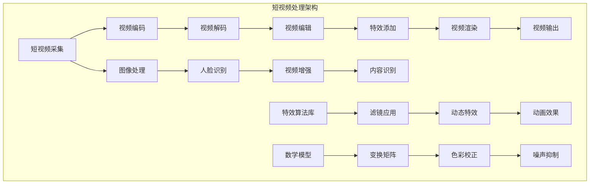

                 

### 2025年快手社招短视频特效算法工程师面试指南

#### 关键词：
- 快手
- 社招
- 短视频
- 特效算法
- 面试指南
- 算法工程师

#### 摘要：
本文旨在为有意加入快手社招短视频特效算法工程师的候选人提供一份详尽的面试指南。文章将分析面试过程中可能涉及的核心技术点，包括短视频处理的基本概念、特效算法的设计与实现、数学模型和公式以及实际应用案例。通过本文，读者可以更好地准备面试，了解快手在短视频特效领域的最新技术动态和未来发展趋势。

## 1. 背景介绍

### 1.1 目的和范围

本文的目的是为参与快手社招短视频特效算法工程师岗位的候选人提供一个全面的面试准备指南。我们将重点讨论以下几个方面：

- 快手公司背景及在短视频特效领域的技术优势。
- 面试中可能涉及的核心技术知识点，包括视频处理、特效算法和数学模型。
- 算法工程师面试的实际案例解析，帮助候选人理解面试官的考察角度。
- 面试准备和应对策略，提高面试成功概率。

### 1.2 预期读者

本文主要面向以下读者群体：

- 有志于从事短视频特效算法研发的算法工程师。
- 参与快手社招短视频特效算法工程师岗位的候选人。
- 对短视频特效算法感兴趣的技术爱好者。

### 1.3 文档结构概述

本文结构如下：

- 第1章：背景介绍，概述文章的目的、范围和预期读者。
- 第2章：核心概念与联系，介绍短视频处理的基本概念和架构。
- 第3章：核心算法原理与操作步骤，详细讲解特效算法的实现。
- 第4章：数学模型与公式，深入探讨特效算法背后的数学基础。
- 第5章：项目实战，通过实际代码案例进行详细解读。
- 第6章：实际应用场景，分析特效算法在不同场景下的应用。
- 第7章：工具和资源推荐，提供学习资源和开发工具建议。
- 第8章：总结，探讨未来发展趋势与挑战。
- 第9章：附录，解答常见面试问题。
- 第10章：扩展阅读，推荐进一步学习资源。

### 1.4 术语表

#### 1.4.1 核心术语定义

- **短视频**：时长一般在15秒到1分钟以内的视频内容。
- **特效算法**：用于在视频处理过程中添加特殊效果的算法，如滤镜、动态特效等。
- **算法工程师**：专注于算法设计、实现和优化的工程师，特别在图像处理和视频分析领域有深入研究和实践经验。
- **社招**：社会招聘，即公司面向社会公开招聘人才。

#### 1.4.2 相关概念解释

- **视频处理**：指对视频信号进行各种操作的整个过程，包括采集、压缩、编码、解码、编辑等。
- **图像处理**：指对图像进行分析、变换和增强的一门学科，广泛应用于医学影像、遥感图像、视频处理等领域。

#### 1.4.3 缩略词列表

- **GPU**：图形处理单元（Graphics Processing Unit）
- **CNN**：卷积神经网络（Convolutional Neural Network）
- **CUDA**：并行计算平台和编程模型（Compute Unified Device Architecture）
- **H.264**：视频编码标准（High Efficiency Video Coding）

## 2. 核心概念与联系

在深入讨论快手短视频特效算法之前，我们需要理解一些核心概念和它们之间的联系。以下是短视频处理的基本概念和架构，通过Mermaid流程图展示。



### 2.1 短视频采集

短视频采集是整个处理流程的起点。这一过程涉及摄像设备的选用、拍摄角度的调整以及拍摄环境的光照控制。高质量的采集是后续处理效果的基础。

### 2.2 视频编码与解码

视频编码是将原始视频数据压缩成便于传输和存储的格式，如H.264。视频解码则是将压缩后的视频数据还原成可以播放的格式。编码和解码的质量直接影响视频的清晰度和播放流畅度。

### 2.3 视频编辑

视频编辑是对采集到的原始视频进行剪辑、拼接和特效添加等操作，使其符合特定的播放需求。编辑工具如Adobe Premiere Pro、Final Cut Pro等提供丰富的编辑功能。

### 2.4 特效添加

特效添加是短视频处理中重要的一环，它通过算法将各种特效（如滤镜、动态特效）应用到视频中，增加视频的趣味性和观赏性。

### 2.5 视频渲染与输出

视频渲染是将编辑和特效处理后的视频转换为最终输出格式，如MP4。视频输出是将渲染后的视频传输到播放设备或存储设备。

### 2.6 图像处理

图像处理是对视频中的每一帧图像进行分析和处理，以提升图像质量或实现特定效果。常见的技术包括人脸识别、视频增强和内容识别。

### 2.7 特效算法库

特效算法库是存储各种特效算法的集合，如滤镜应用、动态特效和动画效果。这些算法可以通过编程接口方便地调用，为视频处理提供丰富的功能。

### 2.8 数学模型

数学模型是特效算法实现的基础，如变换矩阵、色彩校正和噪声抑制。这些模型通过对图像像素的数学操作，实现各种图像效果。

## 3. 核心算法原理与具体操作步骤

在了解短视频处理的基本概念和架构后，我们接下来探讨特效算法的核心原理和具体操作步骤。特效算法的实现通常涉及多个步骤，包括数据预处理、算法设计、优化和调试。

### 3.1 数据预处理

数据预处理是特效算法实现的第一步，其目的是将原始数据转换成适合算法处理的格式。具体操作步骤如下：

1. **图像大小调整**：将原始图像调整为特定的大小，以适应算法模型的输入要求。
2. **灰度转换**：将彩色图像转换为灰度图像，简化算法计算。
3. **噪声去除**：使用中值滤波、均值滤波等算法去除图像中的噪声，提高图像质量。

伪代码如下：

```python
def preprocess_image(image):
    # 图像大小调整
    resized_image = cv2.resize(image, (width, height))
    
    # 灰度转换
    gray_image = cv2.cvtColor(resized_image, cv2.COLOR_BGR2GRAY)
    
    # 噪声去除
    denoised_image = cv2.medianBlur(gray_image, 5)
    
    return denoised_image
```

### 3.2 算法设计

算法设计是特效算法实现的核心，决定了算法的性能和效果。以下是一个基于卷积神经网络的滤镜应用算法设计：

1. **构建卷积神经网络**：设计卷积层、池化层和全连接层，用于提取图像特征。
2. **训练神经网络**：使用大量的标注数据对神经网络进行训练，优化模型参数。
3. **模型评估与优化**：评估模型在验证集上的性能，通过调整超参数和模型结构进行优化。

伪代码如下：

```python
import tensorflow as tf

# 构建卷积神经网络
model = tf.keras.Sequential([
    tf.keras.layers.Conv2D(32, (3, 3), activation='relu', input_shape=(height, width, 1)),
    tf.keras.layers.MaxPooling2D((2, 2)),
    tf.keras.layers.Conv2D(64, (3, 3), activation='relu'),
    tf.keras.layers.MaxPooling2D((2, 2)),
    tf.keras.layers.Flatten(),
    tf.keras.layers.Dense(64, activation='relu'),
    tf.keras.layers.Dense(1)
])

# 训练神经网络
model.compile(optimizer='adam', loss='mse', metrics=['accuracy'])
model.fit(train_data, train_labels, epochs=10, validation_data=(val_data, val_labels))

# 模型评估与优化
test_loss, test_acc = model.evaluate(test_data, test_labels)
print(f"Test accuracy: {test_acc}")

# 调整超参数和模型结构
model.compile(optimizer='adam', loss='mse', metrics=['accuracy'])
model.fit(train_data, train_labels, epochs=10, validation_data=(val_data, val_labels))
```

### 3.3 优化与调试

优化与调试是确保特效算法高效运行和稳定性的关键步骤。以下是一些常见的优化和调试方法：

1. **并行计算**：利用GPU加速卷积操作，提高算法运行速度。
2. **内存优化**：通过数据缓存和内存管理优化，减少内存占用。
3. **错误处理**：添加异常处理机制，确保算法在异常情况下能够正常运行。

伪代码如下：

```python
# 并行计算
import tensorflow as tf

@tf.function
def inference(image):
    processed_image = preprocess_image(image)
    filtered_image = model(processed_image)
    return filtered_image

# 内存优化
def optimize_memory_usage():
    # 数据缓存
    cache_enabled = True
    
    # 内存管理
    garbage_collect()

# 错误处理
def robust_algorithm(image):
    try:
        result = inference(image)
        return result
    except Exception as e:
        print(f"Error: {e}")
        return None
```

## 4. 数学模型和公式及详细讲解

在特效算法的实现过程中，数学模型和公式起着至关重要的作用。以下是几个常见的数学模型和公式，以及它们的详细讲解和举例说明。

### 4.1 变换矩阵

变换矩阵是图像处理中常用的数学工具，用于对图像进行旋转、缩放和翻转等操作。以下是一个2D变换矩阵的公式：

$$
T = \begin{bmatrix}
a & b \\
c & d
\end{bmatrix}
$$

其中，$a, b, c, d$ 是变换矩阵的元素。

**变换矩阵的示例：** 假设我们要将一个矩形图像旋转45度，可以使用以下变换矩阵：

$$
T = \begin{bmatrix}
\cos(45^\circ) & -\sin(45^\circ) \\
\sin(45^\circ) & \cos(45^\circ)
\end{bmatrix}
=
\begin{bmatrix}
\frac{\sqrt{2}}{2} & -\frac{\sqrt{2}}{2} \\
\frac{\sqrt{2}}{2} & \frac{\sqrt{2}}{2}
\end{bmatrix}
$$

### 4.2 色彩校正

色彩校正是对图像的颜色进行调整，使其更符合人眼的感知。常用的色彩校正模型包括直方图均衡化、亮度-对比度调整等。

**直方图均衡化** 的公式如下：

$$
f(x) = \frac{1}{c} \sum_{i=0}^{c-1} (h(i) - c \cdot \min(h(i))) \cdot (x - \min(i))
$$

其中，$h(i)$ 是图像中像素值$i$ 的出现频率，$c$ 是像素值的总数量。

**亮度-对比度调整** 的公式如下：

$$
L(x) = a \cdot x + b
$$

其中，$a$ 和 $b$ 分别是亮度调整系数和对比度调整系数。

**示例：** 假设我们要对一幅图像进行亮度提升和对比度增强，可以使用以下参数：

$$
a = 1.2, \quad b = 20
$$

### 4.3 噪声抑制

噪声抑制是图像处理中的重要步骤，用于去除图像中的噪声，提高图像质量。常用的噪声抑制算法包括中值滤波、均值滤波和高斯滤波。

**中值滤波** 的公式如下：

$$
s(i, j) = \text{median}(v(i, j, k))
$$

其中，$v(i, j, k)$ 是以像素$(i, j)$为中心的3x3邻域内的像素值，$s(i, j)$ 是滤波后的像素值。

**示例：** 假设我们要使用中值滤波去除一幅图像中的噪声，可以使用以下步骤：

1. 读取图像并创建一个3x3的邻域窗口。
2. 计算邻域窗口内的像素值的中值。
3. 将中值赋值给目标像素。

```python
import numpy as np

def median_filter(image, size=3):
    padded_image = np.pad(image, pad_width=size//2, mode='edge')
    filtered_image = np.zeros_like(image)
    
    for i in range(image.shape[0]):
        for j in range(image.shape[1]):
            window = padded_image[i:i+size, j:j+size]
            filtered_image[i, j] = np.median(window)
    
    return filtered_image
```

## 5. 项目实战：代码实际案例和详细解释说明

为了更好地理解短视频特效算法的实际应用，我们通过一个简单的项目实战来演示代码的实际实现过程。在这个项目中，我们将使用Python和OpenCV库来实现一个基本的滤镜效果，如彩色转灰度、亮度调整和对比度增强。

### 5.1 开发环境搭建

在开始项目之前，我们需要搭建合适的开发环境。以下是搭建开发环境所需的步骤：

1. **安装Python**：确保安装了Python 3.x版本。
2. **安装OpenCV库**：使用以下命令安装OpenCV：

   ```bash
   pip install opencv-python
   ```

3. **安装Numpy库**：使用以下命令安装Numpy：

   ```bash
   pip install numpy
   ```

### 5.2 源代码详细实现和代码解读

下面是项目的完整代码实现，包括彩色转灰度、亮度调整和对比度增强的功能。

```python
import cv2
import numpy as np

def color_to_grayscale(image):
    """
    将彩色图像转换为灰度图像。
    """
    return cv2.cvtColor(image, cv2.COLOR_BGR2GRAY)

def adjust_brightness(image, alpha=1.0):
    """
    调整图像的亮度。
    """
    return cv2.add(image, alpha * 255)

def adjust_contrast(image, alpha=1.0, beta=0):
    """
    调整图像的对比度。
    """
    return cv2.convertScaleAbs(image, alpha=alpha, beta=beta)

def main():
    # 读取原始图像
    image = cv2.imread('example.jpg')

    # 彩色转灰度
    gray_image = color_to_grayscale(image)

    # 亮度调整
    bright_image = adjust_brightness(gray_image, alpha=1.2)

    # 对比度增强
    contrast_image = adjust_contrast(bright_image, alpha=1.2, beta=20)

    # 显示图像
    cv2.imshow('Original Image', image)
    cv2.imshow('Grayscale Image', gray_image)
    cv2.imshow('Brightened Image', bright_image)
    cv2.imshow('Contrast Enhanced Image', contrast_image)

    # 等待用户按键后关闭窗口
    cv2.waitKey(0)
    cv2.destroyAllWindows()

if __name__ == '__main__':
    main()
```

### 5.3 代码解读与分析

下面我们详细解读上述代码，并分析每个函数的实现原理和功能。

#### 5.3.1 color_to_grayscale函数

```python
def color_to_grayscale(image):
    """
    将彩色图像转换为灰度图像。
    """
    return cv2.cvtColor(image, cv2.COLOR_BGR2GRAY)
```

- **功能**：将彩色图像（BGR格式）转换为灰度图像。
- **实现原理**：使用OpenCV的cvtColor函数，将彩色图像转换为灰度图像。BGR格式转换为灰度图像的转换代码是cv2.COLOR_BGR2GRAY。

#### 5.3.2 adjust_brightness函数

```python
def adjust_brightness(image, alpha=1.0):
    """
    调整图像的亮度。
    """
    return cv2.add(image, alpha * 255)
```

- **功能**：调整图像的亮度。亮度调整是通过增加或减少图像中的每个像素的值来实现的。
- **实现原理**：使用OpenCV的add函数，将图像的每个像素值增加一个常数。alpha参数用于控制亮度调整的程度，alpha的值越大，图像越亮。

#### 5.3.3 adjust_contrast函数

```python
def adjust_contrast(image, alpha=1.0, beta=0):
    """
    调整图像的对比度。
    """
    return cv2.convertScaleAbs(image, alpha=alpha, beta=beta)
```

- **功能**：调整图像的对比度。对比度调整是通过改变图像中像素值的相对大小来实现的。
- **实现原理**：使用OpenCV的convertScaleAbs函数，将图像的每个像素值乘以alpha参数并加上beta参数。alpha参数控制对比度增强的程度，beta参数用于调整图像的基线。

#### 5.3.4 main函数

```python
def main():
    # 读取原始图像
    image = cv2.imread('example.jpg')

    # 彩色转灰度
    gray_image = color_to_grayscale(image)

    # 亮度调整
    bright_image = adjust_brightness(gray_image, alpha=1.2)

    # 对比度增强
    contrast_image = adjust_contrast(bright_image, alpha=1.2, beta=20)

    # 显示图像
    cv2.imshow('Original Image', image)
    cv2.imshow('Grayscale Image', gray_image)
    cv2.imshow('Brightened Image', bright_image)
    cv2.imshow('Contrast Enhanced Image', contrast_image)

    # 等待用户按键后关闭窗口
    cv2.waitKey(0)
    cv2.destroyAllWindows()

if __name__ == '__main__':
    main()
```

- **功能**：执行项目的核心操作，包括读取图像、进行彩色转灰度、亮度调整和对比度增强，并显示结果。
- **实现原理**：main函数首先使用cv2.imread读取图像，然后调用color_to_grayscale、adjust_brightness和adjust_contrast函数进行图像处理。最后，使用cv2.imshow显示处理后的图像，并等待用户按键关闭窗口。

### 5.4 项目总结

通过上述项目实战，我们实现了彩色转灰度、亮度调整和对比度增强的基本滤镜效果。这个项目展示了如何使用OpenCV库和Python进行图像处理，并通过简单的函数调用实现了复杂的图像效果。在实际应用中，我们可以根据需求进一步扩展这个项目，添加更多的高级特效处理，如人脸识别、背景替换等。

## 6. 实际应用场景

短视频特效算法在快手平台上的应用场景非常广泛，以下列举几个典型的应用案例：

### 6.1 用户创作

快手平台上的用户经常使用短视频特效来提升作品的创意和吸引力。例如，通过人脸滤镜、动画效果和背景替换等特效，用户可以制作出独特的个人风格作品。特效算法不仅提升了用户创作的乐趣，还增加了视频的观看价值。

### 6.2 商业广告

快手的商业广告也大量使用了短视频特效来吸引观众注意力。广告制作团队可以通过特效技术制作出具有冲击力的广告视频，从而提高广告的效果和转化率。常见的特效应用包括动态特效、滤镜和实时渲染等。

### 6.3 教育培训

短视频特效在教育培训领域的应用也日益广泛。通过特效技术，教育内容可以变得更加生动有趣，吸引更多用户的注意力。例如，在在线教育平台上，讲师可以通过添加动画效果、字幕和图表来增强课程讲解的互动性和参与感。

### 6.4 虚拟直播

快手的虚拟直播功能允许用户在直播过程中添加虚拟背景、人物特效和实时滤镜等效果。这些特效算法使得直播内容更加丰富多彩，提高了观众的观看体验和参与度。

### 6.5 游戏互动

短视频特效算法还在快手平台上的游戏互动场景中发挥了重要作用。通过添加游戏角色特效、动作捕捉和实时渲染等效果，游戏互动体验得到了显著提升，为用户提供了更加沉浸式的娱乐体验。

## 7. 工具和资源推荐

为了更好地准备快手社招短视频特效算法工程师的面试，以下是学习资源、开发工具和框架的推荐。

### 7.1 学习资源推荐

#### 7.1.1 书籍推荐

- **《计算机视觉：算法与应用》**：详细介绍了计算机视觉的基本算法和实际应用。
- **《数字图像处理》**：涵盖图像处理的基本理论和技术，适合初学者和专业人士。
- **《深度学习》**：介绍了深度学习的基本原理和应用，包括卷积神经网络和生成对抗网络等。

#### 7.1.2 在线课程

- **Coursera上的《深度学习》**：由吴恩达教授主讲，适合初学者和进阶者。
- **Udacity的《计算机视觉工程师纳米学位》**：涵盖计算机视觉的多个领域，包括图像处理、目标检测和图像分类等。
- **edX上的《图像处理与计算机视觉》**：提供系统的图像处理和计算机视觉课程，适合深入理解相关知识。

#### 7.1.3 技术博客和网站

- ** Medium 上的 AI + Machine Learning blogs**：有许多高质量的博客文章，涵盖深度学习、计算机视觉和图像处理等领域。
- **知乎**：有许多专业人士分享的见解和经验，适合查阅相关领域的问答和讨论。
- **Stack Overflow**：全球最大的开发者社区，可以解决编程和算法方面的具体问题。

### 7.2 开发工具框架推荐

#### 7.2.1 IDE和编辑器

- **PyCharm**：强大的Python集成开发环境，适合进行复杂的图像处理和深度学习项目。
- **Visual Studio Code**：轻量级但功能强大的代码编辑器，支持多种编程语言和扩展。

#### 7.2.2 调试和性能分析工具

- **Jupyter Notebook**：适合快速原型开发和实验，支持多种编程语言和数据可视化。
- **TensorBoard**：TensorFlow提供的可视化工具，用于分析深度学习模型的性能和运行时图。

#### 7.2.3 相关框架和库

- **TensorFlow**：谷歌开发的深度学习框架，广泛应用于图像处理和计算机视觉领域。
- **PyTorch**：受欢迎的深度学习框架，具有灵活的动态计算图和强大的GPU支持。
- **OpenCV**：开源的计算机视觉库，提供丰富的图像处理和视频处理功能。

### 7.3 相关论文著作推荐

#### 7.3.1 经典论文

- **“A Comprehensive Survey on Deep Learning for Video Analysis”**：综述深度学习在视频分析领域的应用。
- **“FaceNet: A Unified Embedding for Face Recognition and Clustering”**：介绍了人脸识别的端到端深度学习方法。
- **“You Only Look Once: Unified, Real-Time Object Detection”**：提出了一种实时目标检测算法。

#### 7.3.2 最新研究成果

- **“EfficientDet: Scalable and Efficient Object Detection”**：研究了高效的目标检测算法。
- **“Swin Transformer: Hierarchical Vision Transformer using Shifted Windows”**：提出了基于窗口的视觉变压器。
- **“Large Scale Video Anomaly Detection”**：探讨了大规模视频异常检测问题。

#### 7.3.3 应用案例分析

- **“AI for Social Good: Using Computer Vision to Improve Agriculture”**：分析了计算机视觉在农业领域中的应用。
- **“Enhancing Customer Experience with AI in Retail”**：探讨了人工智能技术在零售行业的应用案例。
- **“Deploying AI Models in Production: Challenges and Best Practices”**：介绍了在生产环境中部署AI模型的挑战和最佳实践。

## 8. 总结：未来发展趋势与挑战

短视频特效算法作为快手等社交媒体平台的重要组成部分，将继续在未来的技术发展中扮演关键角色。以下是未来发展趋势与挑战的总结：

### 8.1 发展趋势

1. **实时性和高效性**：随着硬件性能的提升，实时处理和高效算法将成为主要趋势，以支持更多复杂特效的应用。
2. **个性化体验**：基于用户行为和偏好的个性化特效推荐系统，将提高用户体验，增强用户粘性。
3. **多模态融合**：将图像处理、语音识别和自然语言处理等多模态数据融合，实现更丰富的交互和内容表达。
4. **边缘计算**：利用边缘计算技术，降低数据处理延迟，提高系统响应速度。
5. **AI算法优化**：深度学习和强化学习等AI算法的持续优化，将推动特效算法性能的不断提升。

### 8.2 挑战

1. **计算资源限制**：在移动端和边缘设备上实现高效特效算法，仍然面临计算资源有限的挑战。
2. **算法解释性**：随着算法的复杂度增加，提高算法的可解释性和透明性，以增强用户信任。
3. **数据隐私**：在数据处理过程中确保用户隐私，防止数据泄露，是面临的重大挑战。
4. **公平性和偏见**：避免算法偏见，确保公平性和多样性，是人工智能技术发展的重要议题。
5. **安全性**：保护系统免受恶意攻击，如对抗攻击和DDoS攻击，是维护系统稳定性的关键。

## 9. 附录：常见问题与解答

### 9.1 特效算法面试常见问题

1. **问：特效算法中的滤波技术有哪些？**
   **答**：常见的滤波技术包括均值滤波、中值滤波、高斯滤波和拉普拉斯滤波。这些滤波技术在图像去噪、边缘检测和图像增强等方面有广泛应用。

2. **问：什么是卷积神经网络（CNN）？它在图像处理中的应用是什么？**
   **答**：卷积神经网络是一种专门用于处理图像数据的神经网络，通过卷积操作提取图像特征。CNN在图像分类、目标检测、人脸识别等领域有广泛应用。

3. **问：如何实现视频增强？**
   **答**：视频增强包括亮度调整、对比度增强、色彩校正和噪声抑制等技术。通过调整视频的像素值和滤波操作，可以显著提升视频的质量。

4. **问：什么是深度学习？它在短视频特效中的应用有哪些？**
   **答**：深度学习是一种基于多层神经网络的学习方法，通过多层非线性变换提取特征。在短视频特效中，深度学习可用于人脸识别、动作识别、风格迁移等任务。

### 9.2 编程面试常见问题

1. **问：什么是时间复杂度？如何分析算法的时间复杂度？**
   **答**：时间复杂度是描述算法运行时间与输入规模之间关系的量度。通过分析算法的执行步骤和循环次数，可以计算出算法的时间复杂度。常见的时间复杂度分析包括最好情况、最坏情况和平均情况。

2. **问：什么是空间复杂度？如何分析算法的空间复杂度？**
   **答**：空间复杂度是描述算法所需存储空间与输入规模之间关系的量度。通过分析算法的数据结构和使用情况，可以计算出算法的空间复杂度。

3. **问：什么是递归？递归如何实现？**
   **答**：递归是一种编程方法，函数通过调用自身实现递归操作。递归实现需要定义递归条件和递归过程，以确保算法能够正确执行并最终收敛。

4. **问：如何优化代码性能？**
   **答**：优化代码性能包括算法优化和代码优化。算法优化可以通过设计更高效的算法结构实现，代码优化可以通过优化循环、减少内存使用和优化数据结构等手段实现。

## 10. 扩展阅读 & 参考资料

为了进一步了解短视频特效算法的相关知识和应用，以下是推荐的扩展阅读和参考资料：

### 10.1 扩展阅读

- **《深度学习：从基础到实践》**：详细介绍了深度学习的基础知识和实际应用。
- **《计算机视觉算法及应用》**：涵盖了计算机视觉领域的各种算法和应用。
- **《Python计算机视觉应用》**：介绍了如何使用Python进行计算机视觉应用开发。

### 10.2 参考资料

- **OpenCV官方文档**：提供了丰富的图像处理和视频处理函数文档，有助于深入学习和实践。
- **TensorFlow官方文档**：介绍了TensorFlow的基本使用方法和高级功能，是深度学习实践的重要资源。
- **PyTorch官方文档**：提供了详细的PyTorch教程和API文档，适合初学者和进阶者。
- **知乎和Stack Overflow上的相关问答和讨论**：提供了丰富的实践经验和解决方案，有助于解决实际编程问题。

### 10.3 相关论文

- **“Deep Learning for Video Analysis: A Survey”**：综述了深度学习在视频分析领域的应用。
- **“EfficientDet: Scalable and Efficient Object Detection”**：介绍了EfficientDet目标检测算法。
- **“Swin Transformer: Hierarchical Vision Transformer using Shifted Windows”**：提出了Swin Transformer算法。

### 10.4 实际应用案例

- **“AI for Social Good: Using Computer Vision to Improve Agriculture”**：分析了计算机视觉在农业领域的应用。
- **“Enhancing Customer Experience with AI in Retail”**：探讨了人工智能技术在零售行业的应用案例。
- **“Deploying AI Models in Production: Challenges and Best Practices”**：介绍了在生产环境中部署AI模型的挑战和最佳实践。

