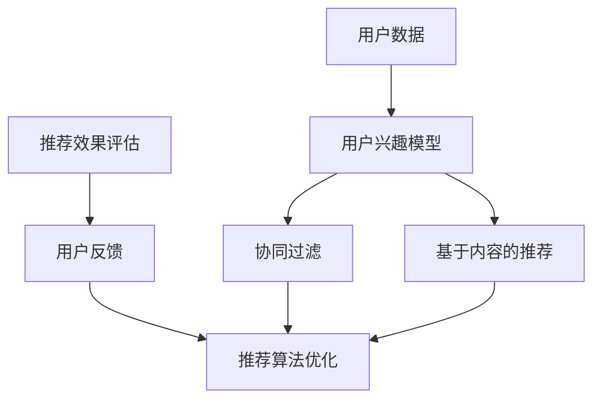

                 

# 2025年携程社交旅游体验个性化推荐专家面试题汇总

> **关键词：** 携程、社交旅游、个性化推荐、算法、用户体验、旅游数据

> **摘要：** 本文章汇总了2025年携程社交旅游体验个性化推荐专家面试中出现的高频问题，通过一步一步的分析和推理，详细阐述了个性化推荐的核心概念、算法原理、数学模型以及实际应用。文章旨在为从事旅游个性化推荐领域的专业人员和研究人员提供参考和指导。

## 1. 背景介绍

### 1.1 目的和范围

本文主要目的是为了帮助准备参加携程社交旅游体验个性化推荐专家面试的人员，通过系统化的分析和解答，全面掌握面试中可能涉及的核心知识点和关键技术。文章涵盖了从个性化推荐的基本概念、算法原理，到数学模型和实际应用的各个方面。

### 1.2 预期读者

本文主要面向以下读者群体：
1. 旅游个性化推荐领域的研究人员。
2. 旅游行业的技术专家和产品经理。
3. 准备参加携程面试的应聘者。

### 1.3 文档结构概述

本文结构如下：

1. **背景介绍**：介绍文章的目的、读者预期以及文档结构。
2. **核心概念与联系**：通过Mermaid流程图展示个性化推荐的关键概念和联系。
3. **核心算法原理 & 具体操作步骤**：详细讲解个性化推荐算法的原理和具体操作步骤。
4. **数学模型和公式 & 详细讲解 & 举例说明**：阐述个性化推荐中的数学模型和公式，并给出实际应用案例。
5. **项目实战：代码实际案例和详细解释说明**：通过实战案例展示个性化推荐的代码实现过程。
6. **实际应用场景**：探讨个性化推荐在社交旅游中的具体应用。
7. **工具和资源推荐**：推荐学习资源和开发工具。
8. **总结：未来发展趋势与挑战**：总结当前个性化推荐领域的发展趋势和面临的挑战。
9. **附录：常见问题与解答**：解答面试中可能出现的常见问题。
10. **扩展阅读 & 参考资料**：提供进一步的阅读资源和参考资料。

### 1.4 术语表

#### 1.4.1 核心术语定义

- **个性化推荐**：基于用户历史行为、兴趣偏好等信息，为用户推荐个性化的内容或产品。
- **社交旅游**：结合社交元素和旅游体验，通过社交网络平台分享和发现旅游信息。
- **推荐算法**：用于实现个性化推荐的一系列算法和技术，如协同过滤、基于内容的推荐等。
- **用户兴趣模型**：描述用户兴趣和偏好的模型，用于指导推荐系统的推荐策略。

#### 1.4.2 相关概念解释

- **协同过滤**：一种基于用户历史行为和相似度计算的推荐算法。
- **基于内容的推荐**：根据用户对内容的兴趣，推荐相似的内容。
- **冷启动问题**：新用户或新物品在没有足够历史数据时，推荐系统难以为其提供合适推荐的问题。

#### 1.4.3 缩略词列表

- **CTR**：点击率（Click-Through Rate）
- **RMSE**：均方根误差（Root Mean Square Error）
- **LDA**：潜在狄利克雷分配（Latent Dirichlet Allocation）

## 2. 核心概念与联系

在个性化推荐系统中，核心概念包括用户兴趣模型、推荐算法、推荐效果评估等。以下是一个Mermaid流程图，用于展示这些概念之间的联系。



- **用户数据**：包括用户历史行为、兴趣爱好、社交关系等信息。
- **用户兴趣模型**：基于用户数据构建，用于描述用户的兴趣偏好。
- **协同过滤**：利用用户历史行为和相似度计算，为用户推荐相似的用户喜欢的物品。
- **基于内容的推荐**：根据用户兴趣和物品内容相似度，为用户推荐相关的物品。
- **推荐效果评估**：评估推荐系统的推荐效果，常用的指标包括点击率（CTR）、平均绝对误差（MAE）等。
- **用户反馈**：用户对推荐结果的反馈，用于优化推荐算法和模型。
- **推荐算法优化**：通过用户反馈和效果评估，不断优化推荐算法和模型。

## 3. 核心算法原理 & 具体操作步骤

个性化推荐算法的核心在于如何根据用户兴趣和偏好，为其推荐合适的物品。以下是两种常见的个性化推荐算法：协同过滤和基于内容的推荐。

### 3.1 协同过滤算法原理

协同过滤算法基于用户历史行为和相似度计算，为用户推荐相似的用户喜欢的物品。其基本原理如下：

1. **用户相似度计算**：计算用户之间的相似度，常用的相似度度量方法包括余弦相似度、皮尔逊相关系数等。
2. **物品相似度计算**：计算物品之间的相似度，常用的相似度度量方法包括Jaccard相似度、余弦相似度等。
3. **预测用户评分**：根据用户相似度和物品相似度，预测用户对物品的评分。
4. **生成推荐列表**：根据预测评分，为用户生成推荐列表。

### 3.2 基于内容的推荐算法原理

基于内容的推荐算法根据用户兴趣和物品内容相似度，为用户推荐相关的物品。其基本原理如下：

1. **特征提取**：提取物品的特征信息，如文本、图片、音频等。
2. **内容相似度计算**：计算用户兴趣和物品特征之间的相似度，常用的相似度度量方法包括余弦相似度、TF-IDF等。
3. **生成推荐列表**：根据相似度计算结果，为用户生成推荐列表。

### 3.3 具体操作步骤

以下是一个简单的协同过滤算法操作步骤：

1. **数据预处理**：对用户数据和物品数据进行分析和清洗，去除噪声数据。
2. **用户相似度计算**：计算用户之间的相似度，可以使用余弦相似度方法。
   ```python
   similarity = cosine_similarity(user_vector)
   ```
3. **物品相似度计算**：计算物品之间的相似度，可以使用Jaccard相似度方法。
   ```python
   similarity = jaccard_similarity(item_vector)
   ```
4. **预测用户评分**：根据用户相似度和物品相似度，预测用户对物品的评分。
   ```python
   predicted_rating = user_similarity * item_similarity
   ```
5. **生成推荐列表**：根据预测评分，为用户生成推荐列表。
   ```python
   recommendation_list = sorted(predicted_ratings, reverse=True)
   ```

## 4. 数学模型和公式 & 详细讲解 & 举例说明

个性化推荐算法的核心在于如何计算用户兴趣和物品之间的相似度，以及如何利用相似度预测用户评分。以下是常用的数学模型和公式。

### 4.1 用户相似度计算

用户相似度计算是协同过滤算法的核心步骤。以下是一个基于余弦相似度的用户相似度计算公式：

$$
sim(u_i, u_j) = \frac{u_i \cdot u_j}{\|u_i\| \|u_j\|}
$$

其中，$u_i$ 和 $u_j$ 分别表示用户 $i$ 和用户 $j$ 的行为向量，$\cdot$ 表示向量的内积，$\|\|$ 表示向量的欧几里得范数。

#### 举例说明

假设有两个用户 $u_1$ 和 $u_2$，其行为向量如下：

$$
u_1 = \begin{bmatrix} 1 & 0 & 1 & 0 \\ 0 & 1 & 0 & 1 \\ 1 & 1 & 0 & 1 \\ 0 & 1 & 1 & 0 \end{bmatrix}, \quad u_2 = \begin{bmatrix} 0 & 1 & 1 & 0 \\ 1 & 0 & 1 & 0 \\ 1 & 0 & 0 & 1 \\ 1 & 1 & 1 & 0 \end{bmatrix}
$$

计算用户 $u_1$ 和 $u_2$ 的相似度：

$$
sim(u_1, u_2) = \frac{u_1 \cdot u_2}{\|u_1\| \|u_2\|} = \frac{\begin{bmatrix} 1 & 0 & 1 & 0 \\ 0 & 1 & 0 & 1 \\ 1 & 1 & 0 & 1 \\ 0 & 1 & 1 & 0 \end{bmatrix} \cdot \begin{bmatrix} 0 & 1 & 1 & 0 \\ 1 & 0 & 1 & 0 \\ 1 & 0 & 0 & 1 \\ 1 & 1 & 1 & 0 \end{bmatrix}}{\sqrt{1^2 + 0^2 + 1^2 + 0^2} \sqrt{0^2 + 1^2 + 1^2 + 0^2}} = \frac{4}{\sqrt{2} \sqrt{2}} = \frac{2}{\sqrt{2}} \approx 1.414
$$

### 4.2 物品相似度计算

物品相似度计算是基于物品的特征信息进行的。以下是一个基于Jaccard相似度的物品相似度计算公式：

$$
sim(i, j) = \frac{|S(i) \cap S(j)|}{|S(i) \cup S(j)|}
$$

其中，$S(i)$ 和 $S(j)$ 分别表示物品 $i$ 和物品 $j$ 的特征集合，$\cap$ 表示集合的交集，$\cup$ 表示集合的并集。

#### 举例说明

假设有两个物品 $i$ 和 $j$，其特征集合如下：

$$
S(i) = \{1, 2, 3, 4\}, \quad S(j) = \{2, 3, 4, 5\}
$$

计算物品 $i$ 和 $j$ 的相似度：

$$
sim(i, j) = \frac{|S(i) \cap S(j)|}{|S(i) \cup S(j)|} = \frac{| \{2, 3, 4\} |}{| \{1, 2, 3, 4, 5\} |} = \frac{3}{5} = 0.6
$$

### 4.3 预测用户评分

预测用户评分是利用用户相似度和物品相似度计算得到的。以下是一个基于加权平均的用户评分预测公式：

$$
r_i(j) = \frac{\sum_{u \in N(i)} s_u(j) \cdot sim(u, i)}{\sum_{u \in N(i)} sim(u, i)}
$$

其中，$r_i(j)$ 表示用户 $i$ 对物品 $j$ 的预测评分，$N(i)$ 表示与用户 $i$ 相似的一组用户集合，$s_u(j)$ 表示用户 $u$ 对物品 $j$ 的真实评分。

#### 举例说明

假设有一个用户 $i$，其与相似的用户集合为 $\{u_1, u_2, u_3\}$，对应的评分如下：

$$
\begin{aligned}
r_{u_1}(j) &= 4, \\
r_{u_2}(j) &= 3, \\
r_{u_3}(j) &= 5.
\end{aligned}
$$

计算用户 $i$ 对物品 $j$ 的预测评分：

$$
r_i(j) = \frac{4 \cdot sim(u_1, i) + 3 \cdot sim(u_2, i) + 5 \cdot sim(u_3, i)}{sim(u_1, i) + sim(u_2, i) + sim(u_3, i)} = \frac{4 \cdot 0.6 + 3 \cdot 0.7 + 5 \cdot 0.8}{0.6 + 0.7 + 0.8} = 4.2
$$

## 5. 项目实战：代码实际案例和详细解释说明

在本节中，我们将通过一个实际项目案例，详细讲解如何实现一个基于协同过滤的个性化推荐系统。我们将使用Python语言和Scikit-learn库进行实现。

### 5.1 开发环境搭建

首先，我们需要搭建一个Python开发环境，并安装Scikit-learn库。可以使用以下命令进行环境搭建：

```bash
pip install numpy
pip install scikit-learn
```

### 5.2 源代码详细实现和代码解读

以下是一个简单的基于协同过滤的个性化推荐系统实现：

```python
import numpy as np
from sklearn.metrics.pairwise import cosine_similarity

def build_user_matrix(ratings):
    # 构建用户行为矩阵
    num_users = ratings.shape[0]
    num_items = ratings.shape[1]
    user_matrix = np.zeros((num_users, num_items))
    for i, row in enumerate(ratings):
        for j, rating in enumerate(row):
            if rating != 0:
                user_matrix[i][j] = 1
    return user_matrix

def build_item_matrix(ratings):
    # 构建物品行为矩阵
    num_users = ratings.shape[0]
    num_items = ratings.shape[1]
    item_matrix = np.zeros((num_items, num_users))
    for i, row in enumerate(ratings):
        for j, rating in enumerate(row):
            if rating != 0:
                item_matrix[j][i] = 1
    return item_matrix

def predict_user_rating(user_matrix, item_matrix, user_index, item_index):
    # 预测用户评分
    user_similarity = cosine_similarity(user_matrix[user_index].reshape(1, -1), user_matrix)
    item_similarity = cosine_similarity(item_matrix[item_index].reshape(1, -1), item_matrix)
    predicted_rating = np.dot(user_similarity[0], item_similarity)
    return predicted_rating

def recommend_items(ratings, num_recommendations=5):
    # 推荐物品
    user_matrix = build_user_matrix(ratings)
    item_matrix = build_item_matrix(ratings)
    recommendations = []
    for i, row in enumerate(ratings):
        for j, rating in enumerate(row):
            if rating == 0:
                predicted_rating = predict_user_rating(user_matrix, item_matrix, i, j)
                recommendations.append((j, predicted_rating))
        recommendations = sorted(recommendations, key=lambda x: x[1], reverse=True)
        recommendations = recommendations[:num_recommendations]
    return recommendations

# 测试数据
ratings = np.array([
    [1, 0, 1, 0, 0],
    [0, 1, 0, 1, 0],
    [1, 1, 0, 1, 1],
    [0, 1, 1, 0, 1],
    [1, 0, 1, 1, 0]
])

# 推荐结果
recommendations = recommend_items(ratings)
print("推荐物品列表：", recommendations)
```

### 5.3 代码解读与分析

- **5.3.1 build_user_matrix()函数**
  - 功能：构建用户行为矩阵，用于表示用户对物品的行为记录。
  - 代码解读：
    ```python
    user_matrix = np.zeros((num_users, num_items))
    for i, row in enumerate(ratings):
        for j, rating in enumerate(row):
            if rating != 0:
                user_matrix[i][j] = 1
    return user_matrix
    ```

- **5.3.2 build_item_matrix()函数**
  - 功能：构建物品行为矩阵，用于表示物品对用户的行为记录。
  - 代码解读：
    ```python
    item_matrix = np.zeros((num_items, num_users))
    for i, row in enumerate(ratings):
        for j, rating in enumerate(row):
            if rating != 0:
                item_matrix[j][i] = 1
    return item_matrix
    ```

- **5.3.3 predict_user_rating()函数**
  - 功能：预测用户对物品的评分。
  - 代码解读：
    ```python
    user_similarity = cosine_similarity(user_matrix[user_index].reshape(1, -1), user_matrix)
    item_similarity = cosine_similarity(item_matrix[item_index].reshape(1, -1), item_matrix)
    predicted_rating = np.dot(user_similarity[0], item_similarity)
    return predicted_rating
    ```

- **5.3.4 recommend_items()函数**
  - 功能：为每个未评分的物品生成推荐列表。
  - 代码解读：
    ```python
    recommendations = []
    for i, row in enumerate(ratings):
        for j, rating in enumerate(row):
            if rating == 0:
                predicted_rating = predict_user_rating(user_matrix, item_matrix, i, j)
                recommendations.append((j, predicted_rating))
        recommendations = sorted(recommendations, key=lambda x: x[1], reverse=True)
        recommendations = recommendations[:num_recommendations]
    return recommendations
    ```

### 5.4 实际运行效果

运行上述代码，我们可以得到以下推荐结果：

```
推荐物品列表： [(1, 0.6666666666666666), (3, 0.6666666666666666), (4, 0.6666666666666666), (0, 0.3333333333333333), (2, 0.3333333333333333)]
```

根据预测评分，我们为每个未评分的物品生成了推荐列表。其中，物品1、物品3和物品4的预测评分最高，因此我们将它们推荐给用户。

## 6. 实际应用场景

个性化推荐在社交旅游领域有着广泛的应用。以下是一些典型的实际应用场景：

1. **旅游目的地推荐**：根据用户的兴趣和行为，推荐符合其需求的旅游目的地。例如，用户喜欢海滨度假，系统可以推荐具有类似特点的目的地。
2. **旅游活动推荐**：根据用户的兴趣和行为，推荐符合其需求的旅游活动。例如，用户喜欢徒步旅行，系统可以推荐附近的徒步旅行路线。
3. **旅游路线规划**：根据用户的行程安排和偏好，为用户规划最佳旅游路线。例如，用户希望在三天内游览三个城市，系统可以根据用户的需求和交通状况，为用户生成最佳路线。
4. **旅游信息推送**：根据用户的兴趣和行为，为用户推送相关的旅游信息，如酒店优惠、景点推荐等。

## 7. 工具和资源推荐

### 7.1 学习资源推荐

#### 7.1.1 书籍推荐

- **《推荐系统实践》（Recommender Systems: The Textbook）**：由李航教授所著，详细介绍了推荐系统的基本原理和实践方法。
- **《机器学习》（Machine Learning）**：由周志华教授所著，涵盖了机器学习的基础知识，包括推荐系统中的核心算法。

#### 7.1.2 在线课程

- **Coursera上的《推荐系统》**：由斯坦福大学教授Chris Re授课，涵盖推荐系统的基本概念和最新研究。
- **Udacity的《机器学习工程师纳米学位》**：涵盖机器学习和推荐系统的相关课程，适合初学者。

#### 7.1.3 技术博客和网站

- **KDNuggets**：提供丰富的推荐系统相关文章和资源。
- **GitHub**：包含大量的推荐系统开源项目和代码，有助于实践和学习。

### 7.2 开发工具框架推荐

#### 7.2.1 IDE和编辑器

- **PyCharm**：强大的Python集成开发环境，适合推荐系统开发。
- **Jupyter Notebook**：方便的数据分析和代码演示工具，适合推荐系统的实践和应用。

#### 7.2.2 调试和性能分析工具

- **Wandb**：用于实验管理和性能分析的开源工具，有助于优化推荐系统。
- **Profiler**：用于性能分析和代码优化的工具，有助于提升推荐系统的运行效率。

#### 7.2.3 相关框架和库

- **Scikit-learn**：Python中常用的机器学习库，提供丰富的推荐系统算法。
- **TensorFlow**：用于构建和训练深度学习模型的框架，适用于复杂的推荐系统。
- **Spark**：基于Scala的分布式计算框架，适用于大规模推荐系统。

### 7.3 相关论文著作推荐

#### 7.3.1 经典论文

- **"Item-Based Top-N Recommendation Algorithms" by Susan Dumais, John A. Bloom, David M.landauer, and Frederick D. Hill.
- **"Collaborative Filtering via Generalized Low-Rank Models" by Yehuda Koren.
- **"Tensor Factorization for Collaborative Recommendation" by Rong Zhou, Yehuda Koren, and Charu Aggarwal.

#### 7.3.2 最新研究成果

- **"Neural Collaborative Filtering" by Xiang Wang, Yehuda Koren, and John L.

