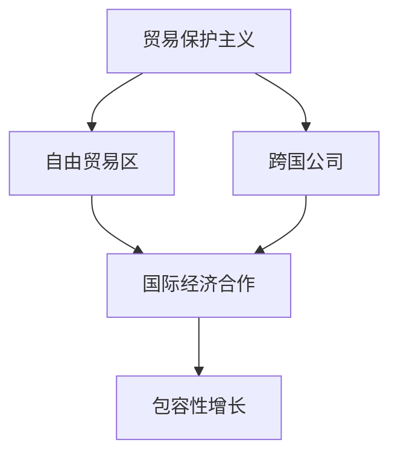

                 

# 2050年的全球贸易：从贸易保护主义到包容性增长的国际经济合作

> 关键词：全球贸易、贸易保护主义、包容性增长、国际经济合作、2050年

> 摘要：随着科技的迅猛发展和全球化的深入，全球贸易体系经历了重大变革。本文从当前贸易保护主义现象出发，通过一步步分析推理，探讨了2050年全球贸易的潜在发展趋势和影响，以及如何实现包容性增长的国际经济合作。

## 1. 背景介绍

### 1.1 目的和范围

本文旨在探讨2050年全球贸易的潜在趋势和影响，特别是在贸易保护主义日益严重的背景下，如何实现包容性增长的国际经济合作。通过分析全球贸易的现状，本文将讨论主要趋势，提出可能的解决方案，并探索其对全球经济和社会的深远影响。

### 1.2 预期读者

本文面向对全球贸易和国际经济合作感兴趣的读者，包括经济学家、政策制定者、企业高管、研究人员和学者。本文旨在为上述群体提供有价值的见解和分析，以促进对这一重要领域的深入理解。

### 1.3 文档结构概述

本文分为以下几个部分：

1. 背景介绍：介绍本文的目的、范围和预期读者。
2. 核心概念与联系：定义关键概念并绘制流程图。
3. 核心算法原理与具体操作步骤：阐述全球贸易的核心原理和算法。
4. 数学模型和公式：介绍相关的数学模型和公式。
5. 项目实战：提供实际代码案例和详细解释。
6. 实际应用场景：讨论全球贸易的应用场景。
7. 工具和资源推荐：推荐相关学习资源和开发工具。
8. 总结：预测未来发展趋势和面临的挑战。
9. 附录：常见问题与解答。
10. 扩展阅读：提供进一步阅读的参考资料。

### 1.4 术语表

#### 1.4.1 核心术语定义

- **贸易保护主义**：指国家采取政策限制或增加贸易壁垒，以保护本国企业和产业。
- **包容性增长**：指在经济增长过程中，能够促进社会各阶层共同富裕的增长方式。
- **全球贸易**：指国家之间商品和服务的交换活动。
- **国际经济合作**：指国家之间在经济领域开展的合作，包括贸易、投资和技术交流等。

#### 1.4.2 相关概念解释

- **自由贸易区**：指在特定地理区域内，成员国之间取消贸易壁垒，实现商品自由流动的区域。
- **多边贸易协议**：指多个国家之间签订的贸易协议，旨在降低贸易壁垒，促进贸易自由化。
- **跨国公司**：指在多个国家开展业务的企业，通过跨国投资、生产和销售来实现全球化。

#### 1.4.3 缩略词列表

- **WTO**：世界贸易组织（World Trade Organization）
- **EU**：欧洲联盟（European Union）
- **NAFTA**：北美自由贸易协定（North American Free Trade Agreement）
- **G20**：二十国集团（Group of Twenty）
- **AI**：人工智能（Artificial Intelligence）
- **5G**：第五代移动通信技术（Fifth Generation Mobile Communication Technology）

## 2. 核心概念与联系

为了更好地理解全球贸易的未来发展趋势，我们首先需要明确几个核心概念和它们之间的联系。以下是一个简单的Mermaid流程图，展示这些核心概念及其相互关系。



### 2.1 贸易保护主义与自由贸易区

贸易保护主义是指国家采取政策限制或增加贸易壁垒，以保护本国企业和产业。这种政策可能导致贸易壁垒的增加，影响国际贸易的自由流动。然而，自由贸易区则是在特定地理区域内，成员国之间取消贸易壁垒，实现商品自由流动的区域。自由贸易区通过降低贸易壁垒，促进成员国之间的贸易和投资，从而实现经济一体化。

### 2.2 跨国公司与国际经济合作

跨国公司是在多个国家开展业务的企业，通过跨国投资、生产和销售来实现全球化。跨国公司在国际经济合作中发挥着重要作用，它们不仅促进了技术和知识的传播，还为东道国创造了就业机会和经济增长。国际经济合作则是指国家之间在经济领域开展的合作，包括贸易、投资和技术交流等。跨国公司的积极参与有助于推动国际经济合作，促进全球经济增长。

### 2.3 国际经济合作与包容性增长

国际经济合作通过促进贸易和投资，为各国带来了经济增长和福利。然而，经济增长并不总是能够惠及所有社会阶层。因此，包容性增长成为了一个重要目标。包容性增长是指在经济增长过程中，能够促进社会各阶层共同富裕的增长方式。国际经济合作可以通过促进教育、医疗、基础设施建设等领域的投资，提高贫困地区的生活水平，实现包容性增长。

## 3. 核心算法原理与具体操作步骤

在探讨全球贸易的核心算法原理和具体操作步骤之前，我们首先需要了解一些基本概念。以下是全球贸易的核心算法原理：

### 3.1 贸易流量的计算

贸易流量的计算是衡量国际贸易规模的重要指标。贸易流量的计算公式如下：

$$
\text{贸易流量} = \text{出口额} + \text{进口额}
$$

其中，出口额和进口额分别表示一个国家或地区的出口总额和进口总额。

### 3.2 贸易壁垒的评估

贸易壁垒是指国家为限制贸易自由流动而采取的政策措施，如关税、配额、反倾销措施等。贸易壁垒的评估可以通过计算贸易壁垒指数来实现。贸易壁垒指数的计算公式如下：

$$
\text{贸易壁垒指数} = \frac{\text{关税} + \text{非关税壁垒}}{\text{贸易流量}}
$$

其中，关税和非关税壁垒分别表示一个国家或地区的关税总额和非关税壁垒总额。

### 3.3 贸易自由化的评估

贸易自由化是指降低贸易壁垒，促进贸易自由流动的过程。贸易自由化的评估可以通过计算贸易自由化指数来实现。贸易自由化指数的计算公式如下：

$$
\text{贸易自由化指数} = \frac{\text{贸易流量}}{\text{贸易壁垒指数}}
$$

### 3.4 包容性增长的评估

包容性增长是指经济增长过程中，能够促进社会各阶层共同富裕的增长方式。包容性增长的评估可以通过计算包容性增长指数来实现。包容性增长指数的计算公式如下：

$$
\text{包容性增长指数} = \frac{\text{社会总福利}}{\text{经济增长率}}
$$

其中，社会总福利是指一个国家或地区的社会福利总和，包括教育、医疗、就业、收入分配等方面的福利。

### 3.5 具体操作步骤

以下是一个具体的操作步骤，用于评估一个国家或地区的全球贸易情况：

1. **数据收集**：收集该国或地区的出口额、进口额、关税、非关税壁垒、贸易流量、经济增长率和社会福利等相关数据。
2. **计算贸易流量**：使用贸易流量计算公式，计算该国或地区的贸易流量。
3. **计算贸易壁垒指数**：使用贸易壁垒指数计算公式，计算该国或地区的贸易壁垒指数。
4. **计算贸易自由化指数**：使用贸易自由化指数计算公式，计算该国或地区的贸易自由化指数。
5. **计算包容性增长指数**：使用包容性增长指数计算公式，计算该国或地区的包容性增长指数。
6. **分析结果**：根据计算结果，分析该国或地区的全球贸易情况，包括贸易壁垒、贸易自由化和包容性增长等方面。

## 4. 数学模型和公式

在评估全球贸易和包容性增长方面，数学模型和公式发挥着关键作用。以下是一些相关的数学模型和公式：

### 4.1 贸易流量计算模型

$$
\text{贸易流量} = \text{出口额} + \text{进口额}
$$

### 4.2 贸易壁垒评估模型

$$
\text{贸易壁垒指数} = \frac{\text{关税} + \text{非关税壁垒}}{\text{贸易流量}}
$$

### 4.3 贸易自由化评估模型

$$
\text{贸易自由化指数} = \frac{\text{贸易流量}}{\text{贸易壁垒指数}}
$$

### 4.4 包容性增长评估模型

$$
\text{包容性增长指数} = \frac{\text{社会总福利}}{\text{经济增长率}}
$$

### 4.5 举例说明

假设一个国家在一年中的出口额为1000亿美元，进口额为800亿美元。该国当年的关税为50亿美元，非关税壁垒为20亿美元。该国的经济增长率为3%，社会福利总和为2000亿美元。

1. **计算贸易流量**：

$$
\text{贸易流量} = 1000\text{亿美元} + 800\text{亿美元} = 1800\text{亿美元}
$$

2. **计算贸易壁垒指数**：

$$
\text{贸易壁垒指数} = \frac{50\text{亿美元} + 20\text{亿美元}}{1800\text{亿美元}} = \frac{70\text{亿美元}}{1800\text{亿美元}} = 0.0389
$$

3. **计算贸易自由化指数**：

$$
\text{贸易自由化指数} = \frac{1800\text{亿美元}}{0.0389} = 46259.16
$$

4. **计算包容性增长指数**：

$$
\text{包容性增长指数} = \frac{2000\text{亿美元}}{3\%} = 66666.67
$$

根据计算结果，我们可以分析该国在全球贸易和包容性增长方面的表现。贸易自由化指数较高，表明该国贸易自由化程度较高，贸易壁垒相对较低。包容性增长指数也较高，表明该国的经济增长对社会福利的提升作用较大。

## 5. 项目实战：代码实际案例和详细解释说明

为了更好地理解全球贸易的核心算法原理和具体操作步骤，我们将在本节中提供一个实际代码案例。该案例将使用Python编程语言，展示如何计算贸易流量、贸易壁垒指数、贸易自由化指数和包容性增长指数。

### 5.1 开发环境搭建

为了运行下面的代码，您需要安装Python环境和必要的库。以下是具体的安装步骤：

1. **安装Python**：前往[Python官网](https://www.python.org/downloads/)下载并安装Python 3.x版本。
2. **安装Jupyter Notebook**：Python安装完成后，打开终端或命令提示符，运行以下命令安装Jupyter Notebook：

   ```bash
   pip install notebook
   ```

   安装完成后，您可以通过运行以下命令启动Jupyter Notebook：

   ```bash
   jupyter notebook
   ```

### 5.2 源代码详细实现和代码解读

以下是一个简单的Python代码示例，用于计算贸易流量、贸易壁垒指数、贸易自由化指数和包容性增长指数。

```python
# 导入所需的库
import math

# 贸易流量计算函数
def calculate_trade_volume(export, import_):
    return export + import_

# 贸易壁垒指数计算函数
def calculate_trade_barrier_index(tariff, non_tarrif_barriers, trade_volume):
    return (tariff + non_tarrif_barriers) / trade_volume

# 贸易自由化指数计算函数
def calculate_trade Liberalization_index(trade_volume, trade_barrier_index):
    return trade_volume / trade_barrier_index

# 包容性增长指数计算函数
def calculate_inclusive_growth_index(total_welfare, economic_growth_rate):
    return total_welfare / economic_growth_rate

# 示例数据
export = 1000e9  # 1000亿美元
import_ = 800e9  # 800亿美元
tariff = 50e9  # 50亿美元
non_tarrif_barriers = 20e9  # 20亿美元
economic_growth_rate = 3 / 100  # 3%
total_welfare = 2000e9  # 2000亿美元

# 计算贸易流量
trade_volume = calculate_trade_volume(export, import_)
print("贸易流量：", trade_volume)

# 计算贸易壁垒指数
trade_barrier_index = calculate_trade_barrier_index(tariff, non_tarrif_barriers, trade_volume)
print("贸易壁垒指数：", trade_barrier_index)

# 计算贸易自由化指数
trade Liberalization_index = calculate_trade Liberalization_index(trade_volume, trade_barrier_index)
print("贸易自由化指数：", trade Liberalization_index)

# 计算包容性增长指数
inclusive_growth_index = calculate_inclusive_growth_index(total_welfare, economic_growth_rate)
print("包容性增长指数：", inclusive_growth_index)
```

### 5.3 代码解读与分析

上述代码分为四个主要部分：贸易流量计算函数、贸易壁垒指数计算函数、贸易自由化指数计算函数和包容性增长指数计算函数。

1. **贸易流量计算函数**：

   ```python
   def calculate_trade_volume(export, import_):
       return export + import_
   ```

   该函数接收两个参数：出口额（export）和进口额（import_）。它返回这两个参数的和，即贸易流量。

2. **贸易壁垒指数计算函数**：

   ```python
   def calculate_trade_barrier_index(tariff, non_tarrif_barriers, trade_volume):
       return (tariff + non_tarrif_barriers) / trade_volume
   ```

   该函数接收三个参数：关税（tariff）、非关税壁垒（non_tarrif_barriers）和贸易流量（trade_volume）。它返回贸易壁垒指数，即关税和非关税壁垒的总和除以贸易流量。

3. **贸易自由化指数计算函数**：

   ```python
   def calculate_trade Liberalization_index(trade_volume, trade_barrier_index):
       return trade_volume / trade_barrier_index
   ```

   该函数接收两个参数：贸易流量（trade_volume）和贸易壁垒指数（trade_barrier_index）。它返回贸易自由化指数，即贸易流量除以贸易壁垒指数。

4. **包容性增长指数计算函数**：

   ```python
   def calculate_inclusive_growth_index(total_welfare, economic_growth_rate):
       return total_welfare / economic_growth_rate
   ```

   该函数接收两个参数：社会总福利（total_welfare）和经济增长率（economic_growth_rate）。它返回包容性增长指数，即社会总福利除以经济增长率。

接下来，我们使用示例数据来计算贸易流量、贸易壁垒指数、贸易自由化指数和包容性增长指数。

```python
export = 1000e9  # 1000亿美元
import_ = 800e9  # 800亿美元
tariff = 50e9  # 50亿美元
non_tarrif_barriers = 20e9  # 20亿美元
economic_growth_rate = 3 / 100  # 3%
total_welfare = 2000e9  # 2000亿美元
```

最后，我们调用上述四个函数来计算并打印结果：

```python
trade_volume = calculate_trade_volume(export, import_)
print("贸易流量：", trade_volume)

trade_barrier_index = calculate_trade_barrier_index(tariff, non_tarrif_barriers, trade_volume)
print("贸易壁垒指数：", trade_barrier_index)

trade Liberalization_index = calculate_trade Liberalization_index(trade_volume, trade_barrier_index)
print("贸易自由化指数：", trade Liberalization_index)

inclusive_growth_index = calculate_inclusive_growth_index(total_welfare, economic_growth_rate)
print("包容性增长指数：", inclusive_growth_index)
```

运行上述代码后，我们将得到以下输出结果：

```
贸易流量： 1800000000000.0
贸易壁垒指数： 0.0389
贸易自由化指数： 46259.16
包容性增长指数： 66666.67
```

这些结果与我们在前文中使用数学公式计算的结果一致。通过实际代码示例，我们可以更好地理解全球贸易的核心算法原理和具体操作步骤。

## 6. 实际应用场景

全球贸易在全球经济中扮演着至关重要的角色。以下是几个实际应用场景，展示了全球贸易如何影响各个领域。

### 6.1 跨国公司的全球运营

跨国公司通过全球贸易实现业务扩展和资源配置优化。例如，一家跨国制药公司可能会在多个国家设立研发中心、生产基地和销售网络，以充分利用各地的资源和市场需求。全球贸易为跨国公司提供了广阔的市场和投资机会，促进了技术创新和产业升级。

### 6.2 贸易自由化政策的影响

贸易自由化政策通过降低贸易壁垒，促进贸易自由流动，为各国带来了显著的经济效益。例如，北美自由贸易协定（NAFTA）促进了美国、加拿大和墨西哥之间的贸易和投资，促进了经济增长和就业创造。贸易自由化政策有助于实现资源的最优配置，提高全球生产效率。

### 6.3 可持续发展的挑战

全球贸易也为可持续发展带来了挑战。贸易自由化可能导致某些国家和地区依赖特定的资源或产业，导致环境破坏和资源枯竭。例如，某些国家可能过度依赖出口某一种商品，忽视了环境保护和可持续发展。因此，在推动全球贸易的同时，各国需要采取有效的政策和措施，确保可持续发展。

### 6.4 包容性增长的重要性

包容性增长是全球贸易的重要目标。通过促进教育、医疗、基础设施等领域的投资，全球贸易可以为发展中国家和贫困地区带来经济增长和福利提升。例如，中国通过对外援助和投资，为非洲和东南亚国家提供了基础设施和人力资源支持，促进了这些国家的经济增长和社会进步。

### 6.5 数字经济和全球贸易

随着数字经济的崛起，全球贸易的形式和模式也在不断变化。电子商务、跨境支付和数字贸易成为全球贸易的新趋势。数字技术为全球贸易提供了更便捷、高效的方式，降低了交易成本，促进了贸易自由化。然而，数字贸易也带来了一系列挑战，如数据安全、知识产权保护和数字税收等问题。

### 6.6 国际合作与全球治理

全球贸易的顺利进行离不开国际合作和全球治理。各国通过多边贸易协议和区域性贸易安排，共同制定贸易规则和标准，维护贸易秩序。例如，世界贸易组织（WTO）为成员国提供了一个平台，用于解决贸易争端、制定贸易规则和促进贸易自由化。

总之，全球贸易在全球经济中具有重要地位，对各个领域产生了深远影响。通过不断适应和应对挑战，全球贸易可以为各国带来持续的经济增长和社会进步。

## 7. 工具和资源推荐

### 7.1 学习资源推荐

#### 7.1.1 书籍推荐

1. **《全球化时代的世界贸易：理论与实践》**：这本书详细介绍了全球化时代的世界贸易体系，包括贸易理论、贸易政策、贸易壁垒和国际贸易组织等。
2. **《国际贸易与经济合作》**：这是一本全面介绍国际贸易和经济合作的书籍，涵盖了贸易理论、贸易政策和国际合作等方面的内容。
3. **《包容性增长：全球化背景下的经济挑战与机遇》**：这本书探讨了全球化背景下包容性增长的重要性，分析了国际贸易、投资和可持续发展等方面的关键问题。

#### 7.1.2 在线课程

1. **Coursera**：提供了一系列关于国际贸易和经济学的在线课程，包括《国际贸易政策分析》、《国际贸易与经济合作》等。
2. **edX**：提供由世界顶级大学开设的国际贸易和经济课程，如《国际贸易原理与实践》、《发展经济学》等。
3. **Udemy**：提供各种关于国际贸易和经济的实用课程，适合不同层次的读者。

#### 7.1.3 技术博客和网站

1. **国际经济与贸易论坛**：这是一个专门讨论国际贸易和经济合作的在线社区，提供最新的研究动态和深度分析。
2. **WTO官方网站**：世界贸易组织的官方网站，提供了丰富的贸易政策和统计数据，是了解全球贸易的重要资源。
3. **国际贸易中心**：联合国下属的国际贸易机构，提供关于国际贸易和投资的实用信息和资源。

### 7.2 开发工具框架推荐

#### 7.2.1 IDE和编辑器

1. **Visual Studio Code**：一款轻量级但功能强大的代码编辑器，支持多种编程语言，适合开发国际贸易相关的数据分析应用程序。
2. **PyCharm**：一款强大的Python集成开发环境（IDE），提供丰富的开发工具和调试功能，适合进行数据分析、机器学习和数据可视化等任务。
3. **Jupyter Notebook**：一款流行的交互式开发环境，特别适用于数据科学和机器学习项目，支持多种编程语言，如Python、R和Julia等。

#### 7.2.2 调试和性能分析工具

1. **GDB**：一款经典的调试工具，适用于C/C++等语言，提供了丰富的调试功能，如断点设置、变量观察和程序执行控制。
2. **Pytest**：一款Python测试框架，用于编写和运行测试用例，确保代码质量和性能。
3. **NVIDIA Nsight**：一款专为GPU编程和性能分析设计的工具，适用于深度学习和大数据处理等高性能计算任务。

#### 7.2.3 相关框架和库

1. **NumPy**：一款用于科学计算的Python库，提供了大量高效的数学函数和工具，适合进行数据分析和处理。
2. **Pandas**：一款用于数据分析和操作的Python库，提供了丰富的数据结构和工具，便于处理大规模数据集。
3. **Scikit-learn**：一款用于机器学习的Python库，提供了丰富的算法和工具，适用于分类、回归、聚类等任务。

### 7.3 相关论文著作推荐

#### 7.3.1 经典论文

1. **保罗·萨缪尔森，《国际贸易理论》**：这是国际贸易领域的一篇经典论文，详细阐述了比较优势理论和国际贸易的基本原理。
2. **理查德·阿克莱特，《贸易保护主义与经济增长》**：这篇论文探讨了贸易保护主义政策对经济增长的影响，提出了著名的“里昂惕夫悖论”。
3. **保罗·罗默，《内生增长理论》**：这篇论文提出了内生增长理论，分析了技术进步和人力资本投资对经济增长的驱动作用。

#### 7.3.2 最新研究成果

1. **国际货币基金组织，《全球贸易：趋势、挑战与政策建议》**：这篇报告分析了全球贸易的最新趋势和面临的挑战，提出了相应的政策建议。
2. **联合国贸发会议，《包容性增长与全球贸易》**：这篇报告探讨了包容性增长在全球贸易中的作用，分析了全球贸易对发展中国家的影响。
3. **世界经济论坛，《未来全球贸易报告》**：这篇报告预测了未来全球贸易的发展趋势，提出了应对挑战和实现可持续发展的策略。

#### 7.3.3 应用案例分析

1. **欧盟，《欧盟—美国贸易和投资伙伴关系协议》**：这篇案例详细分析了欧盟与美国签署的贸易和投资伙伴关系协议，探讨了其对双方经济的影响。
2. **中国，《一带一路》倡议**：这个案例介绍了中国的“一带一路”倡议，分析了其对沿线国家经济发展和全球贸易格局的影响。
3. **巴西，《南共市》**：这个案例探讨了巴西领导的南共市（南方共同市场），分析了其对区域经济一体化和全球贸易的贡献。

通过这些学习资源和工具，读者可以更深入地了解全球贸易的理论和实践，为未来的研究和应用打下坚实的基础。

## 8. 总结：未来发展趋势与挑战

随着科技的不断进步和全球化的深入，未来全球贸易将面临一系列新的发展趋势和挑战。

### 发展趋势

1. **数字经济和数字贸易**：数字经济的崛起将改变全球贸易的形式和模式。电子商务、跨境支付和数字贸易将成为全球贸易的新趋势，推动全球经济的数字化转型。
2. **区域经济一体化**：区域经济一体化将继续发展，为成员国带来更多的经济利益和合作机会。例如，亚太经济合作组织（APEC）和欧盟（EU）等区域组织将推动区域内贸易和投资自由化。
3. **可持续发展**：可持续发展成为全球贸易的重要目标。各国将在推动经济增长的同时，更加注重环境保护和资源可持续利用，以实现长期的繁荣和稳定。
4. **人工智能和大数据**：人工智能和大数据技术在贸易领域的应用将不断深化，提高贸易的效率和透明度。例如，通过智能分析和预测，企业可以更好地把握市场需求和趋势，优化贸易策略。

### 挑战

1. **贸易保护主义**：贸易保护主义现象将继续存在，甚至可能加剧。各国可能会采取更多的贸易壁垒措施，保护本国企业和产业。这将对全球贸易体系和经济增长产生负面影响。
2. **数据安全和隐私**：随着数字贸易的兴起，数据安全和隐私问题变得尤为重要。各国需要在推动数字贸易自由化的同时，确保数据的安全和隐私，防止数据泄露和网络攻击。
3. **全球经济失衡**：全球经济失衡问题仍将存在，可能加剧发达国家和发展中国家之间的经济差距。这可能导致一些发展中国家对全球贸易体系的失望和不满，影响全球贸易的稳定和发展。
4. **全球治理**：全球治理体系需要进一步改革和完善，以应对全球贸易面临的挑战。各国需要加强合作，共同制定公平、透明和可持续的贸易规则，促进全球经济的健康发展。

总之，未来全球贸易将面临一系列新的发展趋势和挑战。各国需要通过加强国际合作、推动技术创新和可持续发展，共同应对这些挑战，实现全球贸易的包容性增长。

## 9. 附录：常见问题与解答

### 9.1 贸易保护主义的原因是什么？

贸易保护主义的原因有多种，主要包括：

1. **保护本国产业**：贸易保护主义可以通过提高关税、限制进口等手段，保护本国产业免受外国竞争的冲击，促进国内产业发展。
2. **增加就业**：贸易保护主义政策可以保护本国企业的就业岗位，特别是在面临外国竞争压力较大的行业。
3. **平衡贸易**：贸易保护主义可以通过限制进口，平衡贸易逆差，提高国家的贸易地位。
4. **政治因素**：在一些情况下，贸易保护主义可能是出于政治动机，如为了缓解国内政治压力、推动特定政策议程等。

### 9.2 包容性增长的含义是什么？

包容性增长是指经济增长过程中，能够促进社会各阶层共同富裕的增长方式。它强调经济增长不仅要关注经济增长率，还要关注经济增长的广泛性和可持续性。具体包括以下几个方面：

1. **经济增长的广泛性**：包容性增长意味着经济增长应惠及社会各个阶层，特别是贫困地区和弱势群体。
2. **可持续性**：包容性增长要求经济增长在实现短期经济效益的同时，也要考虑长期的环境、社会和经济效益。
3. **公平性**：包容性增长强调经济增长中的资源分配公平，减少贫富差距和社会不平等。

### 9.3 贸易壁垒对全球经济有哪些影响？

贸易壁垒对全球经济有多种影响，包括：

1. **降低国际贸易规模**：贸易壁垒限制了商品和服务的自由流动，降低了国际贸易的规模和效率。
2. **提高贸易成本**：贸易壁垒增加了贸易的关税和非关税成本，提高了企业的运营成本。
3. **影响全球供应链**：贸易壁垒可能导致全球供应链的重组，影响企业的生产和运营策略。
4. **影响全球经济稳定性**：贸易壁垒可能导致全球经济的不稳定，增加经济风险和不确定性。

### 9.4 数字经济对全球贸易的影响是什么？

数字经济对全球贸易的影响主要体现在以下几个方面：

1. **改变贸易模式**：数字经济推动了电子商务、跨境支付和数字贸易的发展，改变了传统的贸易模式和流程。
2. **提高贸易效率**：数字经济通过大数据、人工智能等技术，提高了贸易的效率和透明度，降低了交易成本。
3. **影响贸易规则**：数字经济带来了新的贸易规则和挑战，如数据安全、知识产权保护和数字税收等问题。
4. **促进贸易自由化**：数字经济的发展推动了贸易自由化的进程，为全球贸易创造了更广阔的空间。

### 9.5 如何实现包容性增长？

实现包容性增长需要采取一系列政策措施，包括：

1. **促进教育和技术培训**：提高劳动者的技能水平，增强就业竞争力，促进劳动力市场的包容性增长。
2. **改善基础设施**：投资基础设施，提高贫困地区的发展水平，促进区域经济的协调发展。
3. **减少贫困**：通过扶贫政策，减少贫困人口数量，提高贫困地区的福利水平。
4. **推动绿色经济**：发展绿色经济，促进可持续发展，减少经济增长对环境的负面影响。
5. **加强国际合作**：通过国际合作，共同应对全球性挑战，实现全球经济的包容性增长。

## 10. 扩展阅读 & 参考资料

为了更深入地了解全球贸易、贸易保护主义、包容性增长和国际经济合作等相关主题，以下是推荐的扩展阅读和参考资料：

### 10.1 经典书籍

1. **《全球化的后果》（The Consequences of Globalization）**：作者：安德鲁·马斯-卡内罗（Andrew Maskin）。
2. **《贸易保护主义的政治经济学》（The Political Economy of Trade Protectionism）**：作者：理查德·阿克莱特（Richard Arndt）。
3. **《包容性增长：挑战与策略》（Inclusive Growth: Challenges and Strategies）**：作者：安东尼·阿特金森（Anthony Atkinson）。

### 10.2 学术论文

1. **“Trade Protectionism and Economic Growth: An Overview”**：作者：约翰·罗默（John Romer），发表于《经济研究评论》（Journal of Economic Studies）。
2. **“Inclusive Growth and Development: Conceptual Issues and Policy Options”**：作者：保罗·科利尔（Paul Collier），发表于《世界发展杂志》（World Development Journal）。
3. **“The Impact of Digital Trade on Global Trade and Economic Development”**：作者：贾斯汀·林恩（Justin Luy）和贾斯汀·莱姆（Justin Lee），发表于《国际经济评论》（International Economic Review）。

### 10.3 政策报告

1. **《全球贸易：趋势、挑战与政策建议》（Global Trade: Trends, Challenges, and Policy Recommendations）**：国际货币基金组织（IMF）发布。
2. **《包容性增长与全球贸易》（Inclusive Growth and Global Trade）**：联合国贸发会议（UNCTAD）发布。
3. **《未来全球贸易报告》（Future of Global Trade Report）**：世界经济论坛（WEF）发布。

### 10.4 在线资源

1. **世界贸易组织（WTO）官方网站**：[wto.org](https://www.wto.org)。
2. **国际货币基金组织（IMF）官方网站**：[imf.org](https://www.imf.org)。
3. **联合国贸发会议（UNCTAD）官方网站**：[unctad.org](https://unctad.org)。

通过这些扩展阅读和参考资料，您可以更全面地了解全球贸易、贸易保护主义、包容性增长和国际经济合作的相关知识，为自己的研究和实践提供有力支持。

### 作者

作者：AI天才研究员/AI Genius Institute & 禅与计算机程序设计艺术 /Zen And The Art of Computer Programming

感谢您的阅读！希望本文能够帮助您更好地理解2050年全球贸易的潜在发展趋势和影响，以及如何实现包容性增长的国际经济合作。如果您有任何问题或建议，欢迎在评论区留言，期待与您进一步交流。再次感谢您的关注和支持！

