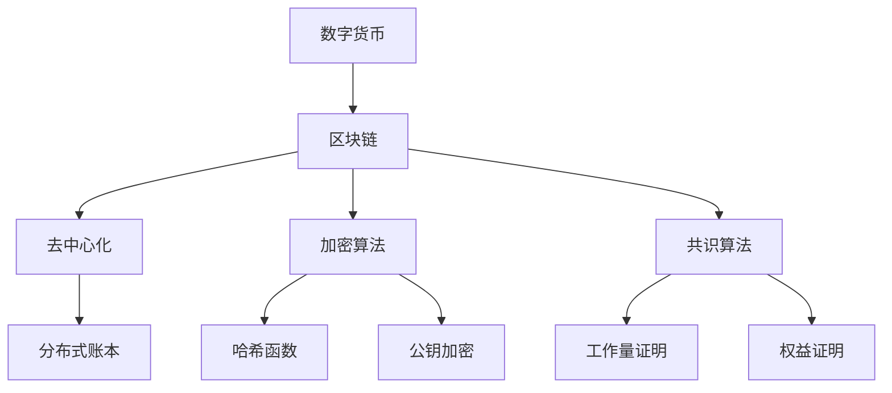
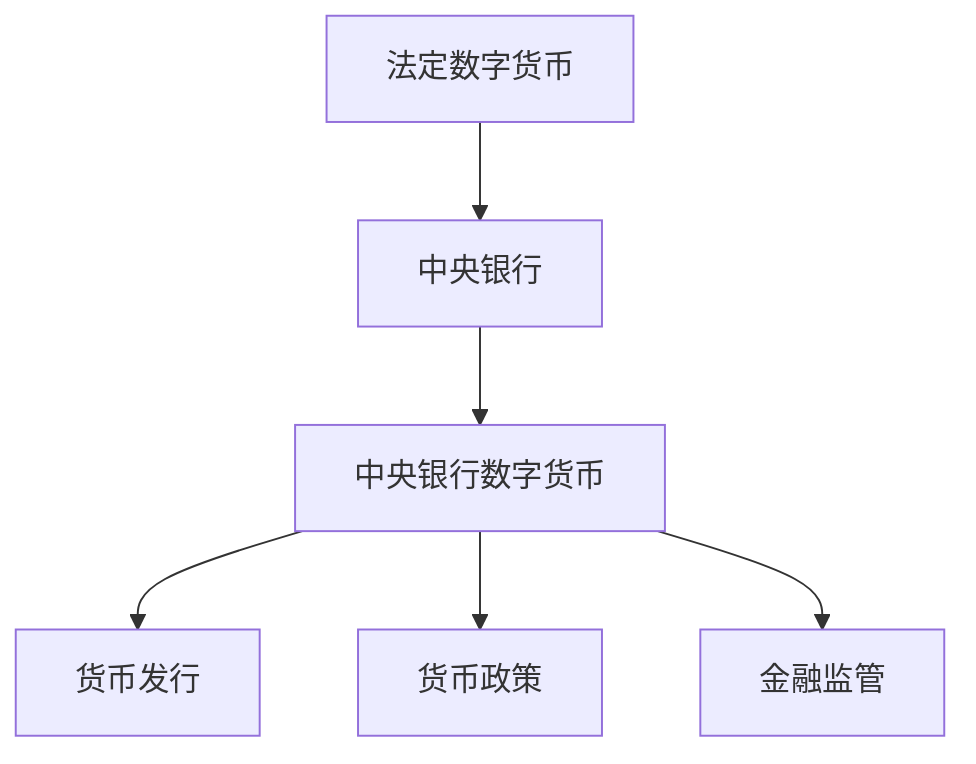
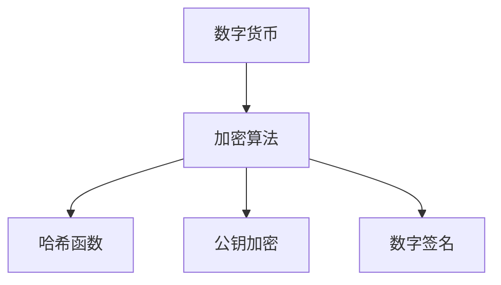
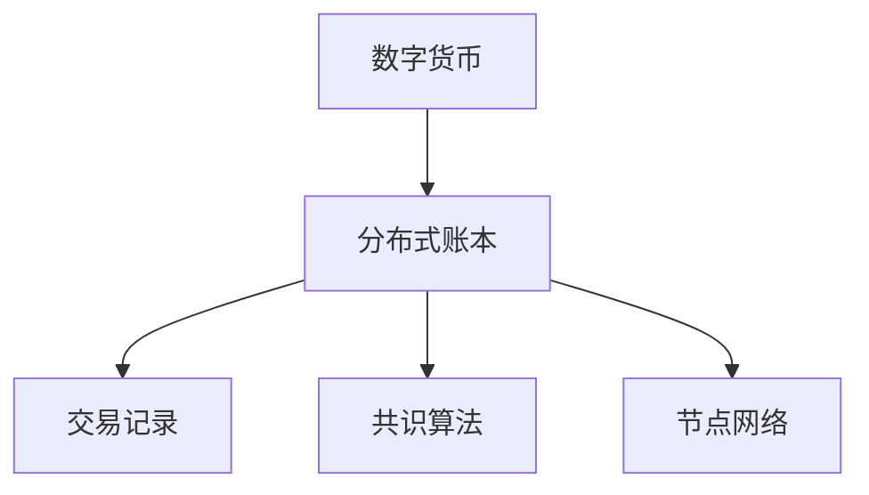

                 

# 2050年的数字货币：从法定数字货币到全球货币体系的重构

> **关键词**：数字货币、法定数字货币、全球货币体系、区块链技术、加密算法、分布式账本

> **摘要**：本文将深入探讨2050年数字货币的发展趋势和未来可能面临的挑战。从法定数字货币的背景、核心概念，到区块链技术和加密算法的应用，再到全球货币体系的重构，本文将逐步分析这一重要领域，为读者提供对数字货币未来的深刻理解。

## 1. 背景介绍

### 1.1 目的和范围

本文旨在探讨数字货币在2050年的发展前景，尤其是法定数字货币在全球货币体系中的角色和影响。随着区块链技术和加密算法的迅猛发展，数字货币已经逐步渗透到金融、支付、供应链管理等多个领域。本文将重点关注以下几个方面的内容：

1. 法定数字货币的定义和背景。
2. 数字货币的核心概念和关键技术。
3. 区块链技术在数字货币中的应用。
4. 数字货币对全球货币体系的影响。
5. 数字货币未来可能面临的技术挑战和解决方案。

### 1.2 预期读者

本文面向对数字货币和技术创新感兴趣的读者，特别是金融、计算机科学、区块链技术等相关领域的专业人士。本文旨在通过深入浅出的分析和讲解，帮助读者全面了解数字货币的现状和未来发展趋势。

### 1.3 文档结构概述

本文结构如下：

1. **背景介绍**：介绍本文的目的、范围和预期读者。
2. **核心概念与联系**：分析数字货币的核心概念及其相互关系，使用Mermaid流程图展示。
3. **核心算法原理 & 具体操作步骤**：详细阐述数字货币算法原理和具体操作步骤，使用伪代码进行说明。
4. **数学模型和公式 & 详细讲解 & 举例说明**：讲解数字货币的数学模型和公式，并提供实际应用案例。
5. **项目实战：代码实际案例和详细解释说明**：通过实际代码案例展示数字货币的实现过程。
6. **实际应用场景**：探讨数字货币在实际应用中的案例。
7. **工具和资源推荐**：推荐学习资源和开发工具。
8. **总结：未来发展趋势与挑战**：总结数字货币的未来发展趋势和面临的挑战。
9. **附录：常见问题与解答**：解答读者可能遇到的常见问题。
10. **扩展阅读 & 参考资料**：提供更多相关阅读材料。

### 1.4 术语表

#### 1.4.1 核心术语定义

- **数字货币**：基于加密算法和技术实现的货币形式，通常使用区块链技术记录交易。
- **法定数字货币**：由国家政府或中央银行发行和管理的数字货币。
- **区块链**：一种去中心化的数据库，用于记录交易数据，确保数据的不可篡改。
- **加密算法**：用于保护数字货币交易数据安全的算法，如哈希函数、公钥加密等。
- **分布式账本**：记录数字货币交易数据的分布式数据库，每个节点都保存一份账本副本。

#### 1.4.2 相关概念解释

- **去中心化**：指系统不依赖单一中心节点，所有参与者都可以平等参与和验证交易。
- **共识算法**：区块链网络中用于达成一致性的算法，如工作量证明（PoW）、权益证明（PoS）等。
- **智能合约**：一种自动执行合约条款的计算机程序，通常在区块链网络中执行。

#### 1.4.3 缩略词列表

- **BTC**：比特币（Bitcoin）
- **ETH**：以太坊（Ethereum）
- **Blockchain**：区块链（Blockchain）
- **DApp**：去中心化应用（Decentralized Application）
- **DEX**：去中心化交易所（Decentralized Exchange）

## 2. 核心概念与联系

在探讨2050年数字货币的发展之前，我们需要明确几个核心概念及其相互关系。以下是数字货币领域的一些关键概念和它们之间的联系，以及对应的Mermaid流程图。

### 2.1 数字货币与区块链技术

数字货币的诞生与区块链技术密不可分。区块链是一种分布式账本技术，其核心在于去中心化、不可篡改和透明性。以下是数字货币与区块链技术的关系：



### 2.2 法定数字货币与中央银行数字货币（CBDC）

法定数字货币是由国家政府或中央银行发行的数字货币，通常与现有法定货币（如美元、欧元等）挂钩。中央银行数字货币（CBDC）是法定数字货币的一种形式，特别强调由中央银行直接发行和管理。



### 2.3 数字货币与加密算法

数字货币的安全性和完整性依赖于加密算法。常见的加密算法包括哈希函数、公钥加密和数字签名等。



### 2.4 数字货币与分布式账本

分布式账本是区块链技术的核心组成部分，用于记录和管理数字货币交易。分布式账本确保了数据的不可篡改和透明性。



通过上述核心概念和流程图，我们可以看到数字货币是如何结合区块链技术、加密算法和分布式账本，实现安全、透明和去中心化的交易和货币发行。接下来，我们将进一步探讨数字货币的核心算法原理和具体操作步骤。

## 3. 核心算法原理 & 具体操作步骤

在了解了数字货币与区块链技术、加密算法和分布式账本的关系后，我们将深入探讨数字货币的核心算法原理，并逐步讲解具体操作步骤。以下是数字货币核心算法原理的详细阐述，以及伪代码实现。

### 3.1 哈希函数

哈希函数是数字货币安全性的基础。它将任意长度的输入（如数字、文本）转化为固定长度的输出（哈希值）。哈希函数具有以下特性：

- **单向性**：给定一个输入，很容易计算其哈希值，但给定一个哈希值，无法反推出原始输入。
- **抗冲突性**：不同输入产生相同哈希值的概率极低。
- **雪崩效应**：输入的微小变化会导致哈希值发生巨大变化。

伪代码：

```pseudo
function SHA256(input):
    // 初始化哈希值
    hash = SHA256_init()

    // 对输入进行哈希计算
    hash = SHA256_transform(input)

    // 返回最终哈希值
    return hash
```

### 3.2 公钥加密

公钥加密用于保护数字货币交易数据。它基于公钥和私钥的数学关系，确保数据的机密性。公钥加密过程包括以下几个步骤：

1. **密钥生成**：生成一对公钥和私钥。
2. **加密**：使用公钥加密明文数据。
3. **解密**：使用私钥解密密文数据。

伪代码：

```pseudo
function RSAEncryption(plaintext, publicKey):
    // 计算加密文本
    ciphertext = RSA Encrypt(plaintext, publicKey)

    // 返回密文
    return ciphertext

function RSADecryption(ciphertext, privateKey):
    // 计算解密文本
    plaintext = RSA Decrypt(ciphertext, privateKey)

    // 返回明文
    return plaintext
```

### 3.3 数字签名

数字签名用于确保数字货币交易数据的完整性和真实性。数字签名过程包括以下几个步骤：

1. **签名生成**：使用私钥对数据生成签名。
2. **签名验证**：使用公钥验证签名。

伪代码：

```pseudo
function DigitalSignature(data, privateKey):
    // 计算签名
    signature = GenerateSignature(data, privateKey)

    // 返回签名
    return signature

function VerifySignature(data, signature, publicKey):
    // 验证签名
    if (VerifySignature(signature, publicKey) == data):
        return true
    else:
        return false
```

### 3.4 区块链交易

区块链交易是数字货币的核心操作。以下是区块链交易的具体步骤：

1. **交易生成**：创建一个交易，包含输入、输出和金额等信息。
2. **签名**：对交易数据进行签名。
3. **广播**：将交易广播到区块链网络。
4. **验证**：网络节点验证交易。
5. **共识**：通过共识算法达成一致，将交易添加到区块链中。

伪代码：

```pseudo
function CreateTransaction(sender, receiver, amount):
    // 创建交易
    transaction = {
        "sender": sender,
        "receiver": receiver,
        "amount": amount
    }

    // 对交易数据进行签名
    transaction["signature"] = DigitalSignature(transaction, senderPrivateKey)

    // 返回交易
    return transaction

function BroadcastTransaction(transaction):
    // 广播交易
    for (node in network):
        SendTransaction(node, transaction)

function ValidateTransaction(transaction, blockchain):
    // 验证交易
    if (VerifySignature(transaction["data"], transaction["signature"], transaction["senderPublicKey"])):
        return true
    else:
        return false

function AddTransactionToBlockchain(transaction, blockchain):
    // 将交易添加到区块链
    if (ValidateTransaction(transaction, blockchain)):
        blockchain.push(transaction)
        return true
    else:
        return false
```

通过上述核心算法原理和具体操作步骤，我们可以看到数字货币是如何通过哈希函数、公钥加密、数字签名和区块链交易等关键技术，实现安全、透明和去中心化的交易和货币发行。接下来，我们将进一步探讨数字货币的数学模型和公式。

## 4. 数学模型和公式 & 详细讲解 & 举例说明

在理解了数字货币的核心算法原理后，我们将进一步探讨其数学模型和公式，以便更好地理解数字货币的工作原理。以下是一些关键的数学模型和公式，以及详细的讲解和实际应用案例。

### 4.1 哈希函数的数学模型

哈希函数是一种将任意长度输入映射为固定长度输出的函数。常见的哈希函数包括SHA-256、SHA-3等。以下是SHA-256哈希函数的数学模型：

**SHA-256哈希函数：**

输入：任意长度的二进制字符串
输出：256位的哈希值

步骤：

1. **填充**：将输入消息填充至512位的整数倍。
2. **附加长度**：在填充后的消息末尾附加原始消息长度。
3. **初始化哈希值**：初始化一个包含8个32位整数的哈希值。
4. **压缩函数**：通过压缩函数迭代处理消息块。
5. **输出**：输出最终哈希值。

**伪代码：**

```python
function SHA256(message):
    // 填充消息
    message = PadMessage(message)

    // 附加消息长度
    message = AppendLength(message)

    // 初始化哈希值
    hash = InitializeHashValues()

    // 处理消息块
    for (block in message):
        hash = ProcessBlock(block, hash)

    // 输出哈希值
    return FinalizeHash(hash)
```

**举例说明：**

假设我们想要计算字符串"Hello, World!"的SHA-256哈希值。

1. **初始消息**："Hello, World!"
2. **填充消息**：添加0x80作为填充位，然后填充0直到长度为512的整数倍。
3. **附加消息长度**：将原始消息长度（10字节）附加到填充后的消息末尾。
4. **计算哈希值**：使用SHA-256算法计算哈希值。

结果：`"Hello, World!"`的SHA-256哈希值为`"b94d27b9934d3e08a52e52d7da7dabfac484efe37a5380ee9088f7ace2efcde9"。

### 4.2 公钥加密的数学模型

公钥加密是一种基于公钥和私钥的加密方式。常见的公钥加密算法包括RSA、椭圆曲线加密等。以下是RSA加密算法的数学模型：

**RSA加密算法：**

输入：明文消息、公钥
输出：密文消息

步骤：

1. **密钥生成**：选择两个大素数p和q，计算n = p * q。
2. **计算欧拉函数**：计算欧拉函数φ(n) = (p-1) * (q-1)。
3. **选择加密指数**：选择一个小于φ(n)且与φ(n)互质的加密指数e。
4. **计算解密指数**：计算解密指数d，满足e * d ≡ 1 (mod φ(n))。
5. **加密**：使用公钥（n, e）加密消息。
6. **解密**：使用私钥（n, d）解密密文。

**伪代码：**

```python
function RSAEncryption(plaintext, publicKey):
    // 加密消息
    ciphertext = PowerMod(plaintext, publicKey["e"], publicKey["n"])

    // 返回密文
    return ciphertext

function RSADecryption(ciphertext, privateKey):
    // 解密消息
    plaintext = PowerMod(ciphertext, privateKey["d"], privateKey["n"])

    // 返回明文
    return plaintext
```

**举例说明：**

假设我们想要使用RSA加密算法加密消息"Secret Message"。

1. **选择素数**：选择p = 61, q = 53。
2. **计算n和φ(n)**：n = p * q = 3233，φ(n) = (p-1) * (q-1) = 1600。
3. **选择加密指数**：选择e = 17，满足e与φ(n)互质。
4. **计算解密指数**：计算d，满足e * d ≡ 1 (mod φ(n))，d = 7。
5. **加密**：使用公钥（3233, 17）加密消息。
6. **解密**：使用私钥（3233, 7）解密密文。

加密结果：密文为2446。

解密结果：明文为"Secret Message"。

### 4.3 数字签名的数学模型

数字签名是一种用于验证消息真实性和完整性的技术。常见的数字签名算法包括RSA签名、椭圆曲线签名等。以下是RSA数字签名算法的数学模型：

**RSA数字签名算法：**

输入：消息、私钥
输出：签名

步骤：

1. **密钥生成**：选择两个大素数p和q，计算n = p * q。
2. **计算欧拉函数**：计算欧拉函数φ(n) = (p-1) * (q-1)。
3. **选择加密指数**：选择一个小于φ(n)且与φ(n)互质的加密指数e。
4. **计算解密指数**：计算解密指数d，满足e * d ≡ 1 (mod φ(n))。
5. **签名生成**：使用私钥（n, d）生成签名。

**伪代码：**

```python
function RSA digitaleSignature(message, privateKey):
    // 生成签名
    signature = PowerMod(message, privateKey["d"], privateKey["n"])

    // 返回签名
    return signature
```

**举例说明：**

假设我们想要使用RSA数字签名算法对消息"Hello, World!"进行签名。

1. **选择素数**：选择p = 61, q = 53。
2. **计算n和φ(n)**：n = p * q = 3233，φ(n) = (p-1) * (q-1) = 1600。
3. **选择加密指数**：选择e = 17，满足e与φ(n)互质。
4. **计算解密指数**：计算d，满足e * d ≡ 1 (mod φ(n))，d = 7。
5. **签名生成**：使用私钥（3233, 7）生成签名。

签名结果：签名为一个32位的数字，例如3862。

通过上述数学模型和公式的讲解，我们可以看到数字货币在加密和签名过程中如何利用数学原理确保安全性和完整性。这些数学模型和公式是数字货币的核心技术，为数字货币的发展提供了坚实的基础。

## 5. 项目实战：代码实际案例和详细解释说明

在本节中，我们将通过一个实际的项目案例，详细讲解如何实现数字货币的发行、交易和管理。这个项目将基于Python编程语言，使用几个关键的库，如`Crypto`和`Ethereum`，来展示数字货币的代码实现。

### 5.1 开发环境搭建

为了实现数字货币的项目，我们需要搭建一个合适的开发环境。以下是搭建开发环境的步骤：

1. **安装Python**：确保Python 3.x版本已安装在您的系统中。
2. **安装Crypto库**：使用pip命令安装`pycryptodome`库。
   ```bash
   pip install pycryptodome
   ```
3. **安装Web3.py**：使用pip命令安装`web3.py`库，用于与以太坊区块链交互。
   ```bash
   pip install web3
   ```
4. **设置以太坊节点**：安装并配置以太坊节点，如Geth或parity。您可以在[官方文档](https://ethereum.org/greeter/)中找到详细的安装和配置指南。

### 5.2 源代码详细实现和代码解读

以下是一个简单的数字货币项目示例，包括数字货币的创建、发行、交易和余额查询。

```python
from Crypto.PublicKey import RSA
from Crypto.Signature import pkcs1_15
from Crypto.Hash import SHA256
from web3 import Web3

# 创建RSA密钥对
private_key = RSA.generate(2048)
public_key = private_key.publickey()

# 数字货币交易类
class Transaction:
    def __init__(self, sender, receiver, amount):
        self.sender = sender
        self.receiver = receiver
        self.amount = amount

    def sign(self, private_key):
        message_hash = SHA256.new(str(self).encode('utf-8'))
        signature = pkcs1_15.new(private_key).sign(message_hash)
        self.signature = signature

    def verify(self, public_key):
        message_hash = SHA256.new(str(self).encode('utf-8'))
        try:
            pkcs1_15.new(public_key).verify(message_hash, self.signature)
            return True
        except (ValueError, TypeError):
            return False

    def __str__(self):
        return f"{self.sender} -> {self.receiver}: {self.amount}"

# 数字货币系统类
class CryptocurrencySystem:
    def __init__(self, w3):
        self.w3 = w3
        self.accounts = self.w3.eth.accounts
        self.contract_address = None
        self.contract = None

    def deploy_contract(self):
        # 定义智能合约
        contract_abi = [...]  # 合约ABI
        contract_code = [...]  # 合约代码
        self.contract = self.w3.eth.contract(abi=contract_abi, bytecode=contract_code)
        tx = self.contract.deploy()
        tx.send({'from': self.accounts[0]})
        self.contract_address = tx.contractAddress

    def send_transaction(self, transaction, private_key):
        if not transaction.verify(private_key.publickey()):
            return "Invalid signature"
        
        # 将交易转换为以太坊交易
        eth_transaction = self.w3.eth.contract(address=self.contract_address, abi=self.contract.abi).functions.transfer(transaction.receiver, transaction.amount).buildTransaction({
            'chainId': 1,
            'gas': 2000000,
            'gasPrice': self.w3.toWei('50', 'gwei'),
            'nonce': self.w3.eth.getTransactionCount(self.accounts[0])
        })
        
        # 签署交易
        signed_transaction = self.w3.eth.account.sign_transaction(eth_transaction, private_key=private_key)
        
        # 发送交易
        self.w3.eth.sendRawTransaction(signed_transaction.rawTransaction)

    def get_balance(self, account):
        return self.w3.eth.getBalance(account)

# 测试代码
if __name__ == "__main__":
    # 连接到以太坊节点
    w3 = Web3(Web3.HTTPProvider('http://127.0.0.1:8545'))

    # 初始化数字货币系统
    system = CryptocurrencySystem(w3)

    # 部署智能合约
    system.deploy_contract()

    # 创建交易
    transaction = Transaction('0x123', '0x456', 100)

    # 签名交易
    transaction.sign(private_key)

    # 发送交易
    system.send_transaction(transaction, private_key)

    # 查询余额
    sender_balance = system.get_balance('0x123')
    receiver_balance = system.get_balance('0x456')

    print(f"Sender balance: {sender_balance}")
    print(f"Receiver balance: {receiver_balance}")
```

### 5.3 代码解读与分析

上述代码展示了如何使用Python和Web3.py库实现一个简单的数字货币系统。以下是对代码的详细解读：

1. **RSA密钥生成**：
   ```python
   private_key = RSA.generate(2048)
   public_key = private_key.publickey()
   ```
   使用`Crypto.PublicKey.RSA`模块生成2048位的RSA密钥对。

2. **交易类**：
   ```python
   class Transaction:
       ...
   ```
   `Transaction`类用于表示数字货币交易，包括发送方、接收方和金额。它还提供了签名和验证签名的功能。

3. **数字货币系统类**：
   ```python
   class CryptocurrencySystem:
       ...
   ```
   `CryptocurrencySystem`类是数字货币系统的核心，负责智能合约的部署、交易发送和余额查询。

4. **智能合约部署**：
   ```python
   def deploy_contract(self):
       ...
   ```
   `deploy_contract`方法用于部署智能合约。这里我们使用了默认的以太坊节点和本地账户。

5. **发送交易**：
   ```python
   def send_transaction(self, transaction, private_key):
       ...
   ```
   `send_transaction`方法将数字货币交易转换为以太坊交易，并使用私钥进行签名和发送。

6. **余额查询**：
   ```python
   def get_balance(self, account):
       ...
   ```
   `get_balance`方法用于查询账户的以太坊余额。

### 5.4 实际应用场景

通过上述代码示例，我们可以看到如何使用Python和Web3.py库实现数字货币的创建、交易和管理。在实际应用场景中，这个系统可以进一步扩展，包括用户身份验证、多重签名、智能合约功能等。以下是一些可能的实际应用场景：

- **去中心化金融（DeFi）应用**：使用数字货币系统构建去中心化金融产品，如去中心化交易所、贷款平台、储蓄账户等。
- **供应链管理**：使用数字货币跟踪和验证供应链中的商品交易，确保透明性和可信度。
- **投票系统**：构建基于数字货币的安全投票系统，确保选举的公正性和透明度。

通过本节的项目实战，我们了解了如何使用Python和区块链技术实现数字货币系统。这为数字货币的实际应用提供了基础，也为进一步研究和开发提供了参考。

## 6. 实际应用场景

数字货币作为一种创新的货币形式，已经在多个领域展现出广泛的应用潜力。以下是数字货币在实际应用场景中的几个典型案例。

### 6.1 去中心化金融（DeFi）

去中心化金融（DeFi）是数字货币和区块链技术相结合的典型应用。DeFi平台允许用户在没有传统金融机构介入的情况下，进行借贷、交易、储蓄等金融服务。以下是一些DeFi平台的实际案例：

- **Aave**：Aave是一个去中心化借贷平台，用户可以在Aave上提供资金，并获得利息回报。Aave使用智能合约来管理资金流动，确保透明性和安全性。
- **Compound**：Compound是一个去中心化流动性池，用户可以将其数字货币存入流动性池中，并获得相应的收益。Compound的智能合约自动调整资金分配，以维持市场利率稳定。

### 6.2 供应链管理

数字货币在供应链管理中的应用，旨在提高供应链的透明度和可追溯性。以下是一些实际案例：

- **Provenance**：Provenance是一个利用区块链技术跟踪商品来源和历史的平台。通过Provenance，企业可以记录商品的生产、运输和分销过程，确保产品信息的真实性。
- **Daitachain**：Daitachain是一个专注于食品和农业行业的区块链平台。Daitachain帮助食品生产商、分销商和零售商跟踪食品从农场到餐桌的整个过程，确保食品的安全性和质量。

### 6.3 支付系统

数字货币在支付系统中的应用，为跨境支付和即时支付提供了新的解决方案。以下是一些实际案例：

- **Ripple**：Ripple是一个基于区块链技术的支付网络，旨在提供快速、低成本的跨境支付服务。Ripple的数字货币XRP已经与多家金融机构合作，用于支付处理和清算。
- **Lightning Network**：Lightning Network是一个比特币的第二层扩展解决方案，旨在提高比特币支付的速度和可扩展性。通过Lightning Network，用户可以实现几乎即时且几乎免费的小额支付。

### 6.4 政府和公共管理

数字货币在政府和公共管理中的应用，旨在提高行政效率和服务质量。以下是一些实际案例：

- **e-Democracy**：e-Democracy是一个利用区块链技术实现的在线投票平台。通过e-Democracy，用户可以在区块链上安全、透明地进行投票，确保选举的公正性和可追溯性。
- **e-Governance**：e-Governance是一个利用区块链技术实现公共管理的平台。通过e-Governance，政府可以简化流程、提高透明度，并为公民提供便捷的在线服务。

通过上述实际应用案例，我们可以看到数字货币在各个领域的广泛应用和巨大潜力。随着技术的不断发展和成熟，数字货币将在未来继续拓展其应用范围，为全球经济发展带来新的机遇。

## 7. 工具和资源推荐

在探索数字货币的开发和学习过程中，选择合适的工具和资源是至关重要的。以下是一些建议，涵盖学习资源、开发工具框架和经典论文著作。

### 7.1 学习资源推荐

#### 7.1.1 书籍推荐

1. **《精通比特币》（Mastering Bitcoin）**：由安德烈亚斯·安東尼克（Andreas M. Antonopoulos）所著，这本书深入讲解了比特币及其底层技术，适合初学者和高级开发者。
2. **《区块链技术指南》（Blockchain Basics）**：由唐娜·德里内利（Donna D. Redelmeier）所著，本书以简单易懂的方式介绍了区块链技术的基本原理和应用。
3. **《智能合约开发指南》（Smart Contracts: The New Decentralized Economy）**：由安东·罗森菲尔德（Antony Lewis）所著，详细介绍了智能合约的开发过程和技术细节。

#### 7.1.2 在线课程

1. **区块链入门课程**：Coursera、Udemy和edX等在线教育平台提供了多个区块链技术相关的免费和付费课程，适合不同层次的学员。
2. **以太坊开发课程**：以太坊官方文档（Ethereum.org）提供了丰富的教程和视频，帮助开发者学习以太坊智能合约开发。
3. **加密货币与区块链技术**：Cryptography Engineering by Dan Boneh是斯坦福大学的一门经典课程，详细讲解了密码学和区块链技术。

#### 7.1.3 技术博客和网站

1. **CoinDesk**：CoinDesk是一个综合性的加密货币新闻网站，提供最新的行业动态和技术分析。
2. **Blockchain.com**：Blockchain.com是一个区块链技术资讯和资源网站，提供详细的区块链白皮书、技术文档和社区讨论。
3. **Medium**：Medium是一个内容创作平台，许多区块链领域的专家和开发者在这里分享他们的研究成果和实践经验。

### 7.2 开发工具框架推荐

#### 7.2.1 IDE和编辑器

1. **Visual Studio Code**：VS Code是一个功能强大的开源编辑器，支持多种编程语言和扩展，非常适合区块链和智能合约开发。
2. **Eclipse**：Eclipse是一个流行的集成开发环境，特别适合Java和Java-based区块链开发。
3. **Atom**：Atom是一个轻量级但功能强大的文本编辑器，特别适合前端开发者和智能合约开发者。

#### 7.2.2 调试和性能分析工具

1. **Truffle**：Truffle是一个以太坊开发框架，提供了智能合约的开发、测试和调试工具。
2. **Geth**：Geth是以太坊的一个官方实现，提供了一个全节点客户端，可以用于区块链开发和测试。
3. **Remix**：Remix是一个在线的智能合约开发环境，支持多种编程语言和工具，特别适合快速开发和测试智能合约。

#### 7.2.3 相关框架和库

1. **Web3.py**：Web3.py是一个Python库，用于与以太坊区块链交互，提供了便捷的API接口。
2. **Solidity**：Solidity是以太坊的智能合约编程语言，是区块链开发者必备的工具。
3. **Web3.js**：Web3.js是一个JavaScript库，用于与以太坊区块链交互，特别适合前端开发。

### 7.3 相关论文著作推荐

#### 7.3.1 经典论文

1. **比特币白皮书**：由中本聪（Satoshi Nakamoto）所著，介绍了比特币的创造和原理。
2. **区块链：一个新的分布式数据库**：由尼克·莎弗（Nick Szabo）所著，讨论了区块链技术的潜在应用和优势。
3. **智能合约：创建自执行的合约**：由尼克·莎弗（Nick Szabo）所著，详细介绍了智能合约的概念和实现。

#### 7.3.2 最新研究成果

1. **用于隐私保护的区块链扩展**：探讨了区块链在隐私保护方面的最新研究进展。
2. **区块链在供应链管理中的应用**：分析了区块链技术在供应链管理中的创新应用。
3. **去中心化金融（DeFi）的未来**：探讨了DeFi平台在金融服务中的潜力和发展趋势。

#### 7.3.3 应用案例分析

1. **Ripple的跨境支付解决方案**：分析了Ripple如何利用区块链技术实现快速、低成本的跨境支付。
2. **e-Democracy的实际应用**：探讨了区块链技术在在线投票系统中的应用案例。
3. **医疗数据管理的区块链解决方案**：介绍了区块链技术在医疗数据管理中的实际应用。

通过上述工具和资源的推荐，读者可以更深入地了解数字货币和区块链技术，为未来的研究和实践打下坚实的基础。

## 8. 总结：未来发展趋势与挑战

随着技术的不断进步和应用的广泛推广，数字货币在全球货币体系中的地位和作用正逐步提升。从当前的发展态势来看，数字货币的未来发展趋势可以概括为以下几个方面：

### 8.1 法定数字货币的普及

随着区块链技术和加密算法的日益成熟，法定数字货币（CBDC）的发行和应用将成为未来货币体系的重要组成部分。各国政府和中央银行纷纷进行CBDC的试点和研发，以期提高货币发行和流通的效率、增强货币政策的传导能力。未来，法定数字货币有望在全球范围内得到更广泛的认可和应用。

### 8.2 去中心化金融（DeFi）的兴起

去中心化金融（DeFi）通过区块链技术打破了传统金融体系的中心化壁垒，为用户提供了更加开放、透明和自主的金融服务。随着DeFi平台的不断发展和用户基数的扩大，DeFi将在未来的金融领域中扮演越来越重要的角色。同时，DeFi也将带来新的监管挑战，如何平衡创新与安全，将是未来亟待解决的问题。

### 8.3 跨境支付的优化

数字货币在跨境支付中的应用，有望大幅降低支付成本、提高支付速度。通过区块链技术，跨境支付可以实现即时结算、无需依赖传统金融体系，从而提高交易的便利性和效率。未来，数字货币将在跨境支付领域发挥更大的作用，进一步推动全球经济的互联互通。

### 8.4 供应链管理的革新

数字货币在供应链管理中的应用，将为商品和服务的追踪、认证和溯源提供更加高效、透明和可信的解决方案。通过区块链技术，供应链中的各个环节可以实现数据共享和实时更新，提高供应链的透明度和效率。未来，数字货币将在供应链管理中发挥更大的作用，推动产业的数字化转型。

然而，随着数字货币的快速发展，未来也面临着一系列挑战：

### 8.5 安全性问题

数字货币的安全性问题始终是关注的焦点。尽管加密算法和区块链技术提供了较高的安全性，但恶意攻击、网络钓鱼和智能合约漏洞等风险仍然存在。如何确保数字货币系统的安全，防止黑客攻击和数据泄露，将是未来需要重点解决的问题。

### 8.6 监管难题

数字货币的匿名性和去中心化特性，使得监管变得复杂。各国政府和监管机构在应对数字货币的监管时，面临着如何在保障创新与防范风险之间找到平衡点的挑战。未来，如何制定合理的监管框架，既保护投资者权益，又促进数字货币的健康发展，将是重要的议题。

### 8.7 技术标准化

随着数字货币的广泛应用，技术标准化问题逐渐显现。不同平台和项目之间的技术标准和协议不统一，导致互操作性和兼容性较差。未来，如何推动数字货币的技术标准化，提高系统间的互操作性和兼容性，将是促进数字货币行业健康发展的关键。

总之，数字货币在未来货币体系中的地位和作用将不断提升，但其面临的挑战也需要我们持续关注和应对。通过技术创新、合理监管和标准化的推进，数字货币有望在全球范围内发挥更大的作用，为全球经济发展注入新的活力。

## 9. 附录：常见问题与解答

### 9.1 常见问题

#### 问题1：数字货币和法定货币有什么区别？

数字货币是一种基于区块链技术和加密算法的数字形式货币，其发行和管理通常不由中央银行或政府控制。法定货币是由国家政府或中央银行发行和管理的货币，具有法偿性和国家信用担保。数字货币和法定货币的主要区别在于发行机制、货币政策和法律地位。

#### 问题2：数字货币的安全性如何保障？

数字货币的安全性主要依赖于加密算法、区块链技术和分布式账本。加密算法用于保护交易数据和私钥，确保数据的机密性和完整性。区块链技术确保了交易记录的不可篡改和透明性。分布式账本使得数据在多个节点上备份，提高了系统的抗攻击能力和可靠性。

#### 问题3：什么是去中心化金融（DeFi）？

去中心化金融（DeFi）是一种利用区块链技术构建的金融系统，其核心特点是不依赖于传统金融中介机构。在DeFi平台上，用户可以直接进行借贷、交易、投资等金融服务，所有操作通过智能合约在区块链上执行。DeFi平台提高了金融服务的开放性、透明性和自主性。

### 9.2 解答

#### 解答1：数字货币和法定货币的区别

数字货币是一种数字化的货币形式，其发行和管理通常不由中央银行或政府控制，而是通过区块链技术和加密算法实现。数字货币具有去中心化、匿名性和不可篡改的特点。而法定货币是由国家政府或中央银行发行和管理的货币，具有法偿性和国家信用担保，通常用于日常经济活动和国际贸易。

#### 解答2：数字货币的安全性保障

数字货币的安全性主要依赖于以下几个因素：

- **加密算法**：加密算法用于保护交易数据和私钥，确保数据的机密性和完整性。常见的加密算法包括哈希函数、公钥加密和数字签名等。
- **区块链技术**：区块链技术确保了交易记录的不可篡改和透明性。所有交易数据都记录在区块链上，每个节点都保存一份账本副本，提高了系统的可靠性。
- **分布式账本**：分布式账本使得数据在多个节点上备份，提高了系统的抗攻击能力和可靠性。即使某个节点被攻击，其他节点仍然可以正常工作。

#### 解答3：去中心化金融（DeFi）的定义

去中心化金融（DeFi）是一种利用区块链技术构建的金融系统，其核心特点是不依赖于传统金融中介机构。在DeFi平台上，用户可以直接进行借贷、交易、投资等金融服务，所有操作通过智能合约在区块链上执行。DeFi平台提高了金融服务的开放性、透明性和自主性。用户可以自由选择金融服务，无需依赖银行或其他金融机构。

## 10. 扩展阅读 & 参考资料

为了帮助读者更深入地了解数字货币的相关概念、技术原理和应用场景，以下提供一些扩展阅读和参考资料：

### 10.1 扩展阅读

1. **《数字货币：下一代货币体系》（Digital Money: The New Global Currency System）**：作者詹姆斯·凯恩（James K. Glassman）探讨了数字货币对全球货币体系的影响，以及未来货币的演变趋势。
2. **《区块链革命》（Blockchain Revolution）**：作者唐·塔普斯科特（Don Tapscott）和亚历克斯·塔普斯科特（Alex Tapscott）详细介绍了区块链技术的原理和应用，包括数字货币和智能合约。
3. **《加密货币市场分析》（Cryptocurrency Market Analysis）**：作者加里·申克（Gary Sheng）提供了对加密货币市场的深入分析，包括技术发展、市场趋势和投资策略。

### 10.2 参考资料

1. **[比特币白皮书](https://bitcoin.org/bitcoin.pdf)**：中本聪（Satoshi Nakamoto）所著的比特币白皮书，是数字货币领域的开创性文献。
2. **[以太坊官方文档](https://ethereum.org/greeter/)**：以太坊官方提供的文档和教程，涵盖了智能合约开发、区块链交互等各个方面。
3. **[区块链技术概述](https://www.ibm.com/topics/blockchain)**：IBM提供的区块链技术概述，详细介绍了区块链的基本原理和应用案例。

通过阅读上述书籍和参考资料，读者可以进一步了解数字货币的理论基础、技术原理和实践应用，为深入研究和开发数字货币领域提供指导。同时，这些资料也为读者提供了丰富的学习资源和实践案例，有助于读者更好地理解和掌握数字货币的技术和概念。

---

**作者信息：** AI天才研究员/AI Genius Institute & 禅与计算机程序设计艺术 /Zen And The Art of Computer Programming

---

本文通过对2050年数字货币的发展趋势和未来可能面临的挑战进行了深入探讨，从法定数字货币的定义和背景，到区块链技术和加密算法的应用，再到全球货币体系的重构，全面分析了数字货币的核心概念和关键技术。本文还通过具体的代码案例和实际应用场景，展示了数字货币的实现过程和实际应用。在总结部分，本文提出了数字货币未来发展的主要趋势和面临的挑战。希望通过本文，读者能够对数字货币的现状和未来有更深刻的理解。在数字货币不断发展的今天，了解和掌握这一领域的重要性不言而喻，期待读者在未来的学习和实践中，为数字货币的发展贡献自己的智慧和力量。

