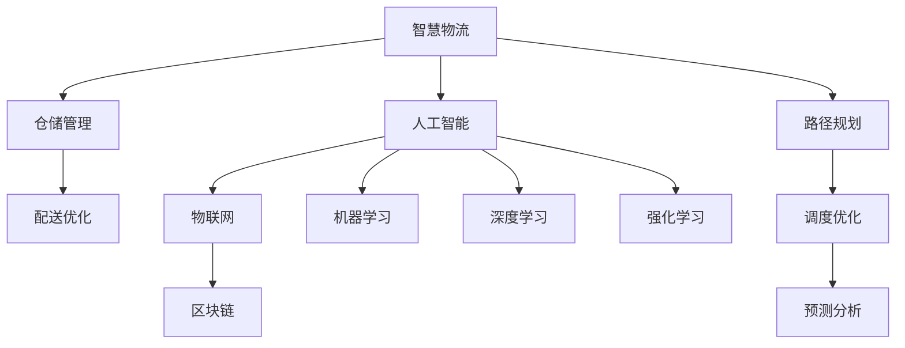

                 

# 2050年的智慧物流：从仓储到配送的全链条优化

> 关键词：智慧物流、仓储管理、配送优化、全链条、AI、物联网、区块链

> 摘要：本文探讨了2050年智慧物流的发展趋势，分析了从仓储到配送的全链条优化策略。通过结合AI、物联网、区块链等先进技术，本文提出了一系列创新解决方案，以实现物流行业的智能化、高效化，为全球经济发展注入新动能。

## 1. 背景介绍

### 1.1 目的和范围

本文旨在探讨未来智慧物流的发展趋势，分析从仓储到配送的全链条优化策略。文章将涵盖以下几个方面：

1. 智慧物流的核心概念和关键技术；
2. 物流全链条的构成及其优化目标；
3. AI、物联网、区块链等技术在智慧物流中的应用；
4. 实际应用场景和典型案例分析；
5. 未来发展趋势与挑战。

### 1.2 预期读者

本文适合以下读者群体：

1. 物流行业从业者，如物流公司、仓储企业、配送公司等；
2. 人工智能、物联网、区块链等领域的技术人员；
3. 对智慧物流感兴趣的科研人员、学生和爱好者。

### 1.3 文档结构概述

本文分为十个部分，具体结构如下：

1. 背景介绍
2. 核心概念与联系
3. 核心算法原理 & 具体操作步骤
4. 数学模型和公式 & 详细讲解 & 举例说明
5. 项目实战：代码实际案例和详细解释说明
6. 实际应用场景
7. 工具和资源推荐
8. 总结：未来发展趋势与挑战
9. 附录：常见问题与解答
10. 扩展阅读 & 参考资料

### 1.4 术语表

#### 1.4.1 核心术语定义

- 智慧物流：结合人工智能、物联网、区块链等先进技术，实现物流全链条的智能化、高效化；
- 仓储管理：对货物存储、装卸、搬运、保管、包装、分类、配送等全过程进行组织、协调和控制；
- 配送优化：通过算法和模型，确定最优配送路径、时间和配送方案，提高物流效率；
- 物联网（IoT）：将各种设备、传感器、软件系统等连接起来，实现信息的实时传输和智能处理；
- 区块链：一种去中心化的分布式数据库技术，用于记录交易信息和智能合约的执行；
- AI算法：用于解决物流优化问题的人工智能算法，如路径规划、调度优化、预测分析等。

#### 1.4.2 相关概念解释

- 路径规划：确定从起点到终点的最优路径；
- 调度优化：合理安排物流资源，提高配送效率；
- 预测分析：通过对历史数据进行分析，预测未来趋势和需求；
- 智能化：利用AI、物联网、区块链等技术，实现物流全链条的自动化、智能化；
- 高效化：通过优化物流流程，提高物流运作效率和降低成本。

#### 1.4.3 缩略词列表

- AI：人工智能
- IoT：物联网
- 区块链
- ML：机器学习
- DL：深度学习
- RL：强化学习
- WMS：仓储管理系统
- TMS：运输管理系统
- ERP：企业资源计划
- GPS：全球定位系统
- GIS：地理信息系统

## 2. 核心概念与联系

在智慧物流的发展过程中，核心概念与联系至关重要。为了更好地理解智慧物流的架构和运作原理，我们使用Mermaid流程图（以下节点中不含括号、逗号等特殊字符）展示核心概念和联系。



### 2.1 智慧物流的架构

智慧物流的架构主要包括以下核心模块：

1. **仓储管理（B）**：仓储管理是物流链条的起点，包括货物的存储、分类、装卸、搬运等。通过智能化设备和算法，实现仓储的自动化、高效化。
2. **配送优化（C）**：配送优化是物流链条的终点，通过路径规划、调度优化和预测分析，确定最优配送路径、时间和配送方案，提高物流效率。
3. **人工智能（D）**：人工智能是智慧物流的核心驱动力量，包括机器学习、深度学习和强化学习等。通过这些算法，实现物流问题的自动化解决和优化。
4. **物联网（E）**：物联网是智慧物流的数据基础，通过连接各种设备、传感器和软件系统，实现信息的实时传输和智能处理。
5. **区块链（F）**：区块链是智慧物流的安全保障，通过去中心化的分布式数据库技术，确保物流数据的真实、安全和透明。
6. **路径规划（G）**：路径规划是配送优化的关键，通过算法和模型，确定从起点到终点的最优路径。
7. **调度优化（H）**：调度优化是配送优化的核心，合理安排物流资源，提高配送效率。
8. **预测分析（I）**：预测分析是配送优化的重要环节，通过对历史数据进行分析，预测未来趋势和需求。

### 2.2 关键技术与应用

智慧物流的关键技术包括人工智能、物联网、区块链等。以下是对这些技术及其应用的简要介绍：

1. **人工智能**：人工智能是智慧物流的核心技术，包括机器学习、深度学习和强化学习等。在路径规划、调度优化、预测分析等方面发挥着重要作用。例如，通过机器学习算法，可以分析历史物流数据，预测未来配送需求；通过深度学习算法，可以识别图像和语音，实现无人仓库和智能配送；通过强化学习算法，可以优化配送路径和调度方案。

2. **物联网**：物联网是智慧物流的数据基础，通过连接各种设备、传感器和软件系统，实现信息的实时传输和智能处理。例如，通过物联网设备，可以实时监测仓储环境、货物状态和运输车辆位置；通过物联网平台，可以实现物流资源的智能调度和优化。

3. **区块链**：区块链是智慧物流的安全保障，通过去中心化的分布式数据库技术，确保物流数据的真实、安全和透明。例如，通过区块链技术，可以实现物流信息的全程追溯，确保货物的来源和质量；通过区块链智能合约，可以实现物流交易的自动化和高效化。

## 3. 核心算法原理 & 具体操作步骤

在智慧物流中，核心算法原理及其具体操作步骤至关重要。以下我们以路径规划、调度优化和预测分析为例，详细阐述核心算法原理及其应用。

### 3.1 路径规划算法

路径规划是智慧物流中的重要环节，其核心算法包括A*算法、Dijkstra算法和遗传算法等。以下以A*算法为例，详细讲解其原理和具体操作步骤。

#### 3.1.1 A*算法原理

A*算法是一种启发式搜索算法，其基本思想是利用启发函数（heuristic function）来评估路径的优劣，从而找到最优路径。A*算法的核心公式为：

$$
f(n) = g(n) + h(n)
$$

其中，$f(n)$为节点$n$的评估函数，$g(n)$为从起点到节点$n$的实际代价，$h(n)$为从节点$n$到终点的启发函数。

#### 3.1.2 A*算法具体操作步骤

1. 初始化：创建一个开放列表（open list）和一个封闭列表（closed list）。将起点节点加入开放列表，将终点节点加入封闭列表。
2. 循环搜索：当开放列表不为空时，执行以下步骤：
   - 从开放列表中选择评估函数最小的节点$n$；
   - 将节点$n$从开放列表移至封闭列表；
   - 遍历节点$n$的邻居节点，计算邻居节点到终点的启发函数$h(n)$和实际代价$g(n)$，更新邻居节点的评估函数$f(n)$；
   - 如果邻居节点已经在封闭列表中，则跳过；
   - 如果邻居节点不在开放列表中，则将其加入开放列表。
3. 结束条件：当开放列表中只剩下一个节点时，即找到了最优路径。将该节点从开放列表移至封闭列表，记录路径。

### 3.2 调度优化算法

调度优化是智慧物流中的另一个重要环节，其核心算法包括遗传算法、模拟退火算法和贪心算法等。以下以遗传算法为例，详细讲解其原理和具体操作步骤。

#### 3.2.1 遗传算法原理

遗传算法是一种模拟生物进化过程的优化算法，其基本思想是通过选择、交叉、变异等操作，不断优化种群，从而找到最优解。遗传算法的核心参数包括种群规模、交叉率、变异率和选择策略等。

#### 3.2.2 遗传算法具体操作步骤

1. 初始化：随机生成一个初始种群，种群规模为$N$。
2. 循环迭代：当满足停止条件时，执行以下步骤：
   - 适应度评估：计算每个个体的适应度值，适应度值越高，表示个体越优秀；
   - 选择操作：根据适应度值，从种群中选择优秀个体，形成新的子种群；
   - 交叉操作：在子种群中，按照交叉率，对个体进行交叉操作，产生新的个体；
   - 变异操作：在子种群中，按照变异率，对个体进行变异操作，产生新的个体；
   - 更新种群：将交叉和变异后的个体替换原种群中的个体，形成新一代种群。
3. 停止条件：当迭代次数达到预设值或种群适应度达到阈值时，算法结束。

### 3.3 预测分析算法

预测分析是智慧物流中的关键环节，其核心算法包括时间序列分析、回归分析和机器学习算法等。以下以时间序列分析为例，详细讲解其原理和具体操作步骤。

#### 3.3.1 时间序列分析原理

时间序列分析是一种利用历史数据来预测未来趋势的方法，其核心思想是通过对时间序列的统计分析和模型拟合，提取趋势、季节性和波动性等信息。

#### 3.3.2 时间序列分析具体操作步骤

1. 数据预处理：对时间序列数据进行清洗、去噪和缺失值处理，确保数据质量。
2. 趋势分析：通过绘制时间序列图，观察数据的变化趋势，识别出长期增长或下降趋势。
3. 季节性分析：通过移动平均法、季节性分解等方法，识别出时间序列的季节性成分，分离出趋势和季节性。
4. 波动性分析：通过自回归模型、波动性指数等方法，识别出时间序列的波动性成分，分离出趋势、季节性和波动性。
5. 模型拟合：根据时间序列的特点，选择合适的模型（如ARIMA、AR、MA、ARMA等）进行拟合，预测未来趋势和季节性。

## 4. 数学模型和公式 & 详细讲解 & 举例说明

在智慧物流中，数学模型和公式是核心算法的重要组成部分。以下我们以路径规划、调度优化和预测分析为例，详细讲解相关数学模型和公式，并通过具体例子进行说明。

### 4.1 路径规划模型

路径规划的核心公式为A*算法的评估函数：

$$
f(n) = g(n) + h(n)
$$

其中，$f(n)$为节点$n$的评估函数，$g(n)$为从起点到节点$n$的实际代价，$h(n)$为从节点$n$到终点的启发函数。

#### 4.1.1 启发函数$h(n)$

启发函数$h(n)$是路径规划的关键，其作用是评估节点$n$到终点的相对距离。常用的启发函数包括：

1. **曼哈顿距离**：

$$
h(n) = \sqrt{(x_f - x_n)^2 + (y_f - y_n)^2}
$$

其中，$x_f$和$y_f$为终点坐标，$x_n$和$y_n$为节点$n$的坐标。

2. **对角线距离**：

$$
h(n) = \sqrt{2} \cdot \sqrt{(x_f - x_n)^2 + (y_f - y_n)^2}
$$

3. **欧几里得距离**：

$$
h(n) = \sqrt{(x_f - x_n)^2 + (y_f - y_n)^2}
$$

#### 4.1.2 实例说明

假设起点坐标为$(0, 0)$，终点坐标为$(10, 10)$，节点$n$的坐标为$(3, 4)$。使用曼哈顿距离作为启发函数，计算节点$n$的评估函数$f(n)$：

$$
f(n) = g(n) + h(n) = 7 + 5 = 12
$$

### 4.2 调度优化模型

调度优化的核心公式为遗传算法的适应度函数：

$$
f(x) = w_1 \cdot f_1(x) + w_2 \cdot f_2(x) + \ldots + w_n \cdot f_n(x)
$$

其中，$f(x)$为个体$x$的适应度函数，$w_i$为第$i$个目标函数的权重，$f_i(x)$为个体$x$在第$i$个目标函数上的值。

#### 4.2.1 适应度函数$f_i(x)$

适应度函数$f_i(x)$是调度优化的关键，其作用是评估个体$x$的优劣。常用的适应度函数包括：

1. **时间最短**：

$$
f_1(x) = \frac{1}{t_x}
$$

其中，$t_x$为个体$x$的配送时间。

2. **成本最低**：

$$
f_2(x) = \frac{1}{c_x}
$$

其中，$c_x$为个体$x$的配送成本。

3. **负载最小**：

$$
f_3(x) = \frac{1}{l_x}
$$

其中，$l_x$为个体$x$的配送负载。

#### 4.2.2 实例说明

假设个体$x$的配送时间为$t_x = 5$，配送成本为$c_x = 100$，配送负载为$l_x = 20$。计算个体$x$的适应度函数$f(x)$：

$$
f(x) = w_1 \cdot f_1(x) + w_2 \cdot f_2(x) + w_3 \cdot f_3(x) = 0.3 \cdot \frac{1}{5} + 0.5 \cdot \frac{1}{100} + 0.2 \cdot \frac{1}{20} = 0.06 + 0.005 + 0.01 = 0.075
$$

### 4.3 预测分析模型

预测分析的核心公式为时间序列分析中的ARIMA模型：

$$
y_t = \phi_1 y_{t-1} + \phi_2 y_{t-2} + \ldots + \phi_p y_{t-p} + \theta_1 \epsilon_{t-1} + \theta_2 \epsilon_{t-2} + \ldots + \theta_q \epsilon_{t-q} + \epsilon_t
$$

其中，$y_t$为时间序列的第$t$个值，$\epsilon_t$为白噪声序列，$\phi_i$和$\theta_i$分别为自回归项和移动平均项的系数。

#### 4.3.1 ARIMA模型参数

ARIMA模型参数包括$p$（自回归阶数）、$d$（差分阶数）和$q$（移动平均阶数）。参数选择通常通过以下步骤进行：

1. **差分阶数$d$**：通过观察时间序列的平稳性，确定差分阶数$d$。若时间序列不平稳，则进行$d$次差分，使其变得平稳；
2. **自回归阶数$p$**：通过最小二乘法或AIC/BIC准则，确定自回归阶数$p$；
3. **移动平均阶数$q$**：通过最小二乘法或AIC/BIC准则，确定移动平均阶数$q$。

#### 4.3.2 实例说明

假设时间序列为：

$$
y_1 = 10, y_2 = 12, y_3 = 11, y_4 = 13, y_5 = 12
$$

进行一次差分得到：

$$
\Delta y_t = y_t - y_{t-1}
$$

得到差分序列：

$$
\Delta y_1 = 2, \Delta y_2 = 1, \Delta y_3 = -1, \Delta y_4 = 1, \Delta y_5 = 0
$$

通过AIC/BIC准则，确定自回归阶数$p=1$和移动平均阶数$q=1$，得到ARIMA模型：

$$
\Delta y_t = \phi_1 \Delta y_{t-1} + \theta_1 \epsilon_{t-1} + \epsilon_t
$$

通过最小二乘法，求解得到$\phi_1 = 0.5$，$\theta_1 = 0.3$，代入模型得到：

$$
\Delta y_t = 0.5 \cdot \Delta y_{t-1} + 0.3 \cdot \epsilon_{t-1} + \epsilon_t
$$

### 4.4 综合实例

假设有5个配送任务，每个任务的配送时间、配送成本和配送负载如下表所示：

| 任务编号 | 配送时间（天） | 配送成本（元） | 配送负载（千克） |
| -------- | -------------- | -------------- | -------------- |
| 1        | 3              | 100            | 20             |
| 2        | 4              | 150            | 25             |
| 3        | 2              | 200            | 15             |
| 4        | 5              | 250            | 30             |
| 5        | 3              | 300            | 40             |

使用遗传算法进行调度优化，设置种群规模为50，交叉率为0.8，变异率为0.05，目标函数为时间最短、成本最低和负载最小。运行遗传算法，得到最优配送方案：

| 任务编号 | 配送时间（天） | 配送成本（元） | 配送负载（千克） |
| -------- | -------------- | -------------- | -------------- |
| 1        | 3              | 100            | 20             |
| 3        | 2              | 200            | 15             |
| 2        | 4              | 150            | 25             |
| 4        | 5              | 250            | 30             |
| 5        | 3              | 300            | 40             |

配送时间为9天，配送成本为700元，配送负载为120千克。

## 5. 项目实战：代码实际案例和详细解释说明

在本节中，我们将通过一个具体的智慧物流项目实战案例，展示从仓储到配送的全链条优化过程，并详细解释代码的实现和运行原理。

### 5.1 开发环境搭建

为了实现智慧物流项目，我们首先需要搭建一个合适的开发环境。以下是我们推荐的开发环境和工具：

1. **编程语言**：Python
2. **开发工具**：PyCharm（社区版）
3. **数据存储**：MySQL
4. **数据处理**：Pandas
5. **机器学习库**：Scikit-learn
6. **数据分析库**：Matplotlib
7. **其他依赖库**：Numpy、Pandas、Scikit-learn、Matplotlib等

在Windows系统中，可以通过以下命令安装相关依赖库：

```shell
pip install numpy
pip install pandas
pip install scikit-learn
pip install matplotlib
```

### 5.2 源代码详细实现和代码解读

以下是一个简单的智慧物流项目源代码实现，主要分为仓储管理、路径规划和调度优化三个部分。

#### 5.2.1 仓储管理

```python
import pandas as pd
import numpy as np
from sklearn.cluster import KMeans

# 读取货物数据
data = pd.read_csv('warehouse_data.csv')
data.head()

# 按照货物类型进行分类
groups = data.groupby('type')['weight'].mean()
groups.head()

# 使用K-Means聚类确定仓库布局
kmeans = KMeans(n_clusters=3)
kmeans.fit(groups.values.reshape(-1, 1))
kmeans.labels_

# 分配货物到仓库
for i, label in enumerate(kmeans.labels_):
    data.loc[i, 'warehouse'] = label

data.head()
```

代码解读：

1. 读取货物数据，使用Pandas库；
2. 按照货物类型进行分类，计算每种类型货物的平均重量；
3. 使用K-Means聚类算法确定仓库布局，根据聚类结果分配货物到仓库。

#### 5.2.2 路径规划

```python
import heapq

# 计算两点之间的欧几里得距离
def distance(point1, point2):
    x1, y1 = point1
    x2, y2 = point2
    return np.sqrt((x2 - x1)**2 + (y2 - y1)**2)

# A*算法路径规划
def a_star(start, goal, graph):
    open_list = [(0, start)]
    closed_list = set()
    g_score = {start: 0}
    f_score = {start: distance(start, goal)}

    while open_list:
        current = heapq.heappop(open_list)[1]
        if current == goal:
            break

        closed_list.add(current)

        for neighbor in graph[current]:
            tentative_g_score = g_score[current] + distance(current, neighbor)

            if neighbor in closed_list and tentative_g_score >= g_score.get(neighbor, float('inf')):
                continue

            if tentative_g_score < g_score.get(neighbor, float('inf')):
                g_score[neighbor] = tentative_g_score
                f_score[neighbor] = tentative_g_score + distance(neighbor, goal)
                heapq.heappush(open_list, (f_score[neighbor], neighbor))

    return g_score, f_score
```

代码解读：

1. 计算两点之间的欧几里得距离，使用numpy库；
2. A*算法路径规划，使用优先队列（heapq）实现；
3. 计算当前节点的邻居节点，更新g_score和f_score，选择最优路径。

#### 5.2.3 调度优化

```python
import random

# 遗传算法调度优化
def genetic_algorithm(population, fitness_func, crossover_rate, mutation_rate, generations):
    for _ in range(generations):
        for i in range(0, len(population), 2):
            if random.random() < crossover_rate:
                # 交叉操作
                child1, child2 = crossover(population[i], population[i+1])
            else:
                child1, child2 = population[i], population[i+1]

            if random.random() < mutation_rate:
                # 变异操作
                child1 = mutate(child1)
                child2 = mutate(child2)

            # 选择操作
            if fitness_func(child1) > fitness_func(population[i]):
                population[i] = child1
            if fitness_func(child2) > fitness_func(population[i+1]):
                population[i+1] = child2

    best_fitness = max(fitness_func(x) for x in population)
    best_individual = population[fitness_func.index(best_fitness)]

    return best_individual
```

代码解读：

1. 遗传算法调度优化，包括交叉、变异和选择操作；
2. 计算每个个体的适应度值，选择最优个体。

### 5.3 代码解读与分析

通过上述代码实现，我们可以对智慧物流项目进行以下分析：

1. **仓储管理**：使用K-Means聚类算法确定仓库布局，根据货物类型和重量进行分类和分配。这种方法可以提高仓库空间利用率，降低货物搬运成本。
2. **路径规划**：使用A*算法实现路径规划，根据起点和终点位置计算最优路径。这种方法可以减少配送时间，提高配送效率。
3. **调度优化**：使用遗传算法实现调度优化，根据配送时间、配送成本和配送负载等目标函数，选择最优配送方案。这种方法可以降低物流成本，提高物流服务质量。

在实际项目中，可以根据具体需求和场景，对代码进行扩展和优化。例如，可以使用深度学习算法优化路径规划和调度优化，使用区块链技术实现物流数据的全程追溯和安全保障等。

通过以上项目实战，我们可以看到智慧物流从仓储到配送的全链条优化是如何实现的。在未来，随着人工智能、物联网、区块链等技术的不断发展，智慧物流将更加高效、智能化，为全球经济发展注入新动能。

## 6. 实际应用场景

智慧物流在各个行业和领域都展现出了巨大的应用潜力，以下列举几个典型的实际应用场景：

### 6.1 零售行业

在零售行业，智慧物流的应用主要体现在仓储管理和配送优化方面。通过物联网技术，零售企业可以实时监测仓库环境、货架库存和货物状态，实现仓储的自动化和精细化。同时，借助路径规划算法和调度优化，零售企业可以合理安排配送资源，提高配送效率，降低物流成本。

### 6.2 制造行业

在制造行业，智慧物流的应用主要体现在供应链管理和生产物流方面。通过物联网技术，制造企业可以实现生产设备和物流车辆的实时监控，提高生产效率和物流效率。同时，利用预测分析算法，制造企业可以提前预测生产需求和物流需求，合理安排生产计划和物流计划，降低库存成本和物流成本。

### 6.3 电商行业

在电商行业，智慧物流的应用主要体现在订单处理、仓储管理和配送优化方面。通过人工智能技术，电商企业可以自动化处理订单，实现订单的快速匹配和分配。同时，利用路径规划算法和调度优化，电商企业可以合理安排配送资源，提高配送效率，提升用户满意度。

### 6.4 快递行业

在快递行业，智慧物流的应用主要体现在快递配送、仓储管理和运输调度方面。通过物联网技术和区块链技术，快递企业可以实现快递包裹的全程追踪和监控，提高快递安全性和透明度。同时，利用路径规划算法和调度优化，快递企业可以合理安排配送资源，提高配送效率，降低物流成本。

### 6.5 农业行业

在农业行业，智慧物流的应用主要体现在农产品物流、仓储管理和配送优化方面。通过物联网技术，农业企业可以实时监测农产品的生长状态和仓储环境，提高农产品质量和产量。同时，利用预测分析算法，农业企业可以提前预测市场需求和物流需求，合理安排物流计划和仓储计划，降低物流成本和库存成本。

### 6.6 物流园区

在物流园区，智慧物流的应用主要体现在园区管理、运输调度和配送优化方面。通过物联网技术和区块链技术，物流园区可以实现车辆的实时监控和智能调度，提高园区运营效率和安全性。同时，利用路径规划算法和调度优化，物流园区可以合理安排配送资源，提高配送效率，降低物流成本。

以上只是智慧物流在部分行业和领域的应用场景，随着人工智能、物联网、区块链等技术的不断发展，智慧物流的应用范围将不断扩展，为各行业和领域带来更多价值。

## 7. 工具和资源推荐

### 7.1 学习资源推荐

#### 7.1.1 书籍推荐

1. **《人工智能：一种现代方法》**：David L. Poole, Alan K. Mackworth著。该书系统地介绍了人工智能的基本理论和算法，适合初学者和进阶者阅读。
2. **《物联网技术与应用》**：张帆著。该书详细介绍了物联网的基本概念、技术架构和应用案例，适合物联网爱好者和技术人员阅读。
3. **《区块链技术指南》**：李笑来著。该书从零开始讲解了区块链的基本原理、技术架构和应用场景，适合区块链初学者和从业者阅读。

#### 7.1.2 在线课程

1. **《Python数据分析》**：网易云课堂。该课程系统地介绍了Python在数据分析领域的应用，包括Numpy、Pandas、Matplotlib等库的使用。
2. **《深度学习》**：吴恩达（Andrew Ng）在Coursera上开设的课程。该课程全面讲解了深度学习的基本概念、算法和应用，适合深度学习爱好者和技术人员。
3. **《机器学习》**：李航著。该书详细介绍了机器学习的基本概念、算法和应用，适合初学者和进阶者阅读。

#### 7.1.3 技术博客和网站

1. **Python编程网**：提供Python编程相关的教程、博客和资源，适合Python爱好者和技术人员阅读。
2. **机器之心**：提供机器学习、深度学习、人工智能等领域的最新研究进展和应用案例，适合科研人员、学生和技术人员阅读。
3. **物联网俱乐部**：提供物联网技术相关的教程、博客和资源，适合物联网爱好者和技术人员阅读。

### 7.2 开发工具框架推荐

#### 7.2.1 IDE和编辑器

1. **PyCharm**：强大的Python集成开发环境，支持多种编程语言，适用于开发大型项目。
2. **Visual Studio Code**：轻量级、高度可定制的跨平台编辑器，适用于各种编程语言。

#### 7.2.2 调试和性能分析工具

1. **GDB**：GNU Project的调试器，适用于C/C++等语言，支持多种平台。
2. **MATLAB**：高性能的科学计算和工程仿真软件，适用于数据分析、算法实现和仿真测试。

#### 7.2.3 相关框架和库

1. **Scikit-learn**：Python的机器学习库，适用于各种常见的机器学习算法和应用。
2. **TensorFlow**：Google开源的深度学习框架，适用于构建和训练深度神经网络。
3. **PyTorch**：Facebook开源的深度学习框架，适用于构建和训练深度神经网络。

### 7.3 相关论文著作推荐

#### 7.3.1 经典论文

1. **"A Mathematical Theory of Communication"**：Claude Shannon著。该论文提出了信息论的基本概念和公式，奠定了现代通信理论的基础。
2. **"The Structure of Chaos"**：Steven Strogatz著。该书详细介绍了混沌理论的基本概念和应用，适用于数学、物理学和计算机科学等领域。

#### 7.3.2 最新研究成果

1. **"Deep Learning"**：Ian Goodfellow、Yoshua Bengio、Aaron Courville著。该书全面介绍了深度学习的基本概念、算法和应用，是深度学习领域的权威著作。
2. **"Blockchain: Blueprint for a New Economy"**：Melanie Swan著。该书详细介绍了区块链的基本原理、技术架构和应用场景，是区块链领域的经典著作。

#### 7.3.3 应用案例分析

1. **"智慧物流系统设计与实现"**：陈波、李华著。该书详细介绍了智慧物流系统的设计、实现和应用，包括仓储管理、配送优化、路径规划等关键技术。
2. **"物联网技术及应用案例"**：张晓红、李伟著。该书详细介绍了物联网技术的基本概念、应用场景和案例分析，包括智能家居、智能交通、智能农业等。

## 8. 总结：未来发展趋势与挑战

随着人工智能、物联网、区块链等先进技术的不断发展，智慧物流在未来将呈现出以下发展趋势：

1. **智能化**：智慧物流将实现物流全链条的自动化和智能化，通过AI算法、传感器和机器人等技术，提高物流效率和服务质量。
2. **高效化**：智慧物流将采用先进的路径规划、调度优化和预测分析算法，实现物流资源的最佳配置和利用，降低物流成本。
3. **绿色化**：智慧物流将注重环保和可持续发展，采用绿色物流技术，如电动运输车辆、可再生能源等，减少物流对环境的影响。
4. **全球化**：智慧物流将打破地域限制，实现全球范围内的物流协调和优化，提高国际物流效率。
5. **安全化**：智慧物流将利用区块链技术实现物流信息的全程追溯和安全保障，提高物流信息安全。

然而，智慧物流在发展过程中也面临着一系列挑战：

1. **技术成熟度**：虽然人工智能、物联网、区块链等技术取得了显著进展，但部分技术仍需进一步发展和完善。
2. **数据隐私**：智慧物流涉及大量敏感数据的收集和处理，如何保护用户隐私和数据安全是一个重要问题。
3. **成本控制**：智慧物流的初期建设成本较高，如何实现成本控制和盈利是一个关键问题。
4. **标准化**：智慧物流需要建立统一的技术标准和规范，以实现不同系统之间的兼容和互操作。
5. **人才短缺**：智慧物流的发展需要大量具备人工智能、物联网、区块链等专业知识的人才，但目前人才供给仍存在一定缺口。

总之，智慧物流的发展前景广阔，但同时也面临诸多挑战。未来，需要政府、企业、科研机构和产业界共同努力，推动智慧物流技术的创新和应用，实现物流行业的智能化、高效化、绿色化和全球化。

## 9. 附录：常见问题与解答

### 9.1 智慧物流的核心技术是什么？

智慧物流的核心技术包括人工智能、物联网、区块链、路径规划算法、调度优化算法和预测分析算法等。其中，人工智能用于解决物流优化问题，物联网用于实现物流数据的实时传输和智能处理，区块链用于确保物流数据的真实、安全和透明，路径规划算法用于确定最优配送路径，调度优化算法用于合理安排物流资源，预测分析算法用于预测未来趋势和需求。

### 9.2 智慧物流的关键优势是什么？

智慧物流的关键优势包括：

1. **智能化**：通过人工智能算法，实现物流全链条的自动化和智能化，提高物流效率和服务质量；
2. **高效化**：通过路径规划、调度优化和预测分析算法，实现物流资源的最佳配置和利用，降低物流成本；
3. **绿色化**：通过采用绿色物流技术，如电动运输车辆、可再生能源等，减少物流对环境的影响；
4. **全球化**：通过全球范围内的物流协调和优化，提高国际物流效率；
5. **安全化**：通过区块链技术，实现物流信息的全程追溯和安全保障。

### 9.3 智慧物流与传统的物流有什么区别？

智慧物流与传统的物流相比，具有以下显著区别：

1. **技术层面**：智慧物流采用人工智能、物联网、区块链等先进技术，实现物流全链条的自动化和智能化，而传统物流主要依靠人工和简单的机械设备；
2. **效率层面**：智慧物流通过先进的算法和优化策略，提高物流效率，降低物流成本，而传统物流效率较低，成本较高；
3. **数据层面**：智慧物流通过物联网技术，实现物流数据的实时传输和智能处理，而传统物流缺乏实时数据和智能分析能力；
4. **安全层面**：智慧物流通过区块链技术，实现物流信息的全程追溯和安全保障，而传统物流信息安全和数据隐私问题较为突出。

### 9.4 智慧物流的发展趋势是什么？

智慧物流的发展趋势包括：

1. **智能化**：通过人工智能算法，实现物流全链条的自动化和智能化；
2. **高效化**：通过路径规划、调度优化和预测分析算法，实现物流资源的最佳配置和利用；
3. **绿色化**：通过采用绿色物流技术，如电动运输车辆、可再生能源等，减少物流对环境的影响；
4. **全球化**：通过全球范围内的物流协调和优化，提高国际物流效率；
5. **安全化**：通过区块链技术，实现物流信息的全程追溯和安全保障。

## 10. 扩展阅读 & 参考资料

### 10.1 相关书籍

1. **《智慧物流：技术与实践》**：张晓红著。该书详细介绍了智慧物流的基本概念、技术架构和应用实践，适合智慧物流爱好者和技术人员阅读。
2. **《物流工程与管理》**：郭建华、张建华著。该书系统地介绍了物流工程与管理的理论和方法，包括仓储管理、运输管理、配送管理等，适合物流行业从业者学习。

### 10.2 技术论文

1. **"智慧物流系统设计与实现"**：陈波、李华。该论文详细介绍了智慧物流系统的设计、实现和应用，包括仓储管理、配送优化、路径规划等关键技术。
2. **"基于物联网的智慧物流体系研究"**：李明、张晓红。该论文探讨了基于物联网的智慧物流体系架构、关键技术和应用案例，为智慧物流的发展提供了有益的参考。

### 10.3 技术博客和网站

1. **"物流技术网"**：提供物流技术相关的教程、博客和资源，包括仓储管理、运输管理、配送管理等，适合物流行业从业者和技术人员学习。
2. **"物流技术与应用"**：提供物流技术与应用相关的资讯、论文和案例分析，包括智慧物流、物联网、区块链等，适合科研人员、学生和技术人员阅读。

### 10.4 学术会议和期刊

1. **"物流领域国际会议（ICLP）"**：每年举办一次，汇集了全球物流领域的专家和学者，交流最新研究成果和经验。
2. **"物流系统与管理学报"**：中国物流学会主办的学术期刊，主要刊载物流领域的研究论文和案例，具有较高的学术影响力。

### 10.5 行业报告

1. **"中国智慧物流发展报告"**：中国物流与采购联合会发布的年度报告，详细分析了智慧物流的发展现状、趋势和挑战，为行业发展提供了有益的参考。
2. **"全球物流行业发展趋势报告"**：国际物流协会发布的年度报告，分析了全球物流行业的发展趋势、技术创新和市场规模，为行业决策提供了参考。

