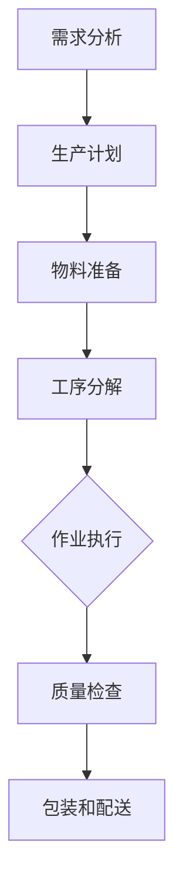

                 

### 背景介绍

### 1.1 目的和范围

《1913年福特的生产奇迹》旨在探讨亨利·福特在1913年所实施的流水线生产模式的深远影响，以及这一变革对现代制造业和工业4.0的影响。文章将详细分析福特生产模式的核心原理、实施步骤、取得的成就及其所面临的挑战。

文章的主要范围包括：

1. **历史背景**：介绍1913年福特生产奇迹的起源，包括亨利·福特个人背景、福特公司的成立及当时工业环境的概述。
2. **生产模式**：阐述流水线生产模式的基本概念、原理和运作机制。
3. **实施步骤**：详述亨利·福特在1913年如何实施这一生产模式，包括所采用的技术、策略和人力资源。
4. **成就与影响**：分析福特生产模式在当时及之后所带来的显著成就，包括生产效率、成本控制、市场竞争力等方面的提升。
5. **挑战与应对**：探讨福特在实施生产模式过程中所遇到的挑战，以及如何应对这些挑战。
6. **现代启示**：讨论福特生产模式对现代制造业的启示，特别是在工业4.0时代背景下。

### 1.2 预期读者

本篇文章的预期读者主要面向以下几类人群：

1. **制造业从业者**：对生产流程和效率提升有实际需求和实践经验的从业人员。
2. **工业工程领域学生**：对工业生产模式、流程优化和管理有浓厚兴趣的学生和研究人员。
3. **技术历史爱好者**：对工业革命和现代制造业发展历史感兴趣的读者。
4. **计算机科学和人工智能领域从业者**：希望通过历史案例分析，理解技术变革对产业影响的读者。

### 1.3 文档结构概述

本文将分为以下主要章节：

1. **背景介绍**：概述文章的目的、范围、预期读者和文档结构。
2. **核心概念与联系**：介绍生产奇迹背后的核心概念和原理，并提供Mermaid流程图。
3. **核心算法原理与具体操作步骤**：详细阐述流水线生产模式的基本原理和具体实施步骤，使用伪代码进行讲解。
4. **数学模型和公式**：介绍生产奇迹相关的数学模型和公式，进行详细讲解和举例说明。
5. **项目实战：代码实际案例和详细解释说明**：通过实际代码案例，展示流水线生产模式的具体应用。
6. **实际应用场景**：讨论福特生产模式在不同领域的应用案例。
7. **工具和资源推荐**：推荐学习资源和开发工具。
8. **总结：未来发展趋势与挑战**：总结文章主要内容，探讨未来发展趋势和面临的挑战。
9. **附录：常见问题与解答**：提供针对读者常见问题的解答。
10. **扩展阅读与参考资料**：推荐相关文献和资料。

### 1.4 术语表

为了确保读者对文中术语的理解，以下是对文章中涉及的主要术语的定义和解释：

#### 1.4.1 核心术语定义

- **流水线生产模式**：一种基于分工和连续作业的生产方式，将生产过程分解为多个步骤，由不同工人或机器依次完成。
- **生产效率**：单位时间内生产的产品数量或质量。
- **成本控制**：通过优化生产流程和资源配置，降低生产成本。
- **市场竞争力**：企业在市场竞争中所具有的优势和劣势。

#### 1.4.2 相关概念解释

- **亨利·福特**：美国工业家、企业家，福特汽车公司的创始人。
- **工业革命**：18世纪末至19世纪初，英国率先开展的一场以机器生产取代手工业的生产方式变革。
- **工业4.0**：德国提出的第四次工业革命概念，强调通过信息技术和物联网实现制造业智能化。

#### 1.4.3 缩略词列表

- **MES**：制造执行系统（Manufacturing Execution System）
- **ERP**：企业资源规划（Enterprise Resource Planning）
- **IoT**：物联网（Internet of Things）

通过上述背景介绍，我们为后续章节的深入探讨奠定了基础。接下来，我们将通过Mermaid流程图，详细分析流水线生产模式的核心概念和联系。让我们继续深入探讨。

### 核心概念与联系

#### 2.1 流水线生产模式的基本概念

流水线生产模式，也称为流水作业或流水制造，是一种通过将生产过程分解为一系列连续的、标准化的步骤，以最大化效率和产量的生产方式。其核心思想是将产品制造过程中的每一个操作或工序分配给专门的工作人员或机器，确保每个步骤都能在最优化的条件下高效完成。这种分工明确、连续作业的生产模式，不仅提高了生产效率，还实现了成本控制和质量保证。

在流水线生产模式中，通常包括以下几个关键环节：

1. **需求分析**：确定生产的产品种类和数量，根据市场需求进行产能规划和生产计划。
2. **生产计划**：根据需求分析结果，制定详细的生产计划，包括生产时间、物料需求、人员安排等。
3. **物料准备**：准备好生产所需的各类物料，确保生产过程中供应顺畅。
4. **工序分解**：将生产过程分解为多个标准化的工序，为每个工序分配专门的工作站或机器。
5. **作业执行**：按照生产计划，逐个完成各个工序，实现产品的连续生产。
6. **质量检查**：在关键工序完成后，对产品进行质量检查，确保产品质量符合标准。
7. **包装和配送**：将生产完成的产品进行包装，并按照订单要求进行配送。

#### 2.2 流水线生产模式的原理

流水线生产模式基于以下几个核心原理：

1. **分工与专业化**：通过将生产过程分解为多个工序，每个工序由专业人员进行操作，提高了工作效率和专业化水平。
2. **连续作业**：生产过程在各个工序之间连续进行，减少了中间环节的等待时间，提高了整体生产效率。
3. **标准化**：每个工序都按照标准化的操作流程进行，确保了产品质量的一致性和稳定性。
4. **自动化**：引入自动化设备和技术，减少人力投入，提高生产效率和灵活性。
5. **信息反馈**：通过实时监测和反馈，对生产过程进行持续优化和调整，确保生产过程的高效和稳定。

#### 2.3 流水线生产模式的Mermaid流程图

为了更好地理解流水线生产模式的核心概念和联系，我们使用Mermaid流程图（以下代码展示）来展示生产过程的主要环节和逻辑关系：



在上面的Mermaid流程图中：

- **A**：需求分析，确定生产的产品种类和数量。
- **B**：生产计划，根据需求分析结果，制定详细的生产计划。
- **C**：物料准备，准备好生产所需的各类物料。
- **D**：工序分解，将生产过程分解为多个标准化的工序。
- **E**：作业执行，按照生产计划，逐个完成各个工序。
- **F**：质量检查，对产品进行质量检查。
- **G**：包装和配送，将生产完成的产品进行包装，并按照订单要求进行配送。

通过上述Mermaid流程图，我们可以清晰地看到流水线生产模式的主要环节及其相互关系，为后续的详细分析和讨论提供了基础。

### 核心算法原理 & 具体操作步骤

#### 3.1 核心算法原理

流水线生产模式的核心算法原理在于如何将生产过程高效、连续、标准化地分解为多个步骤，并确保每个步骤都能在最优化的条件下高效完成。这主要包括以下几个关键点：

1. **工序分解**：将生产过程分解为多个标准化的工序，每个工序由专业人员进行操作，确保工作效率和质量。
2. **作业调度**：根据生产计划和工序分解结果，合理安排各个工序的执行顺序和时间，确保生产过程连续、高效。
3. **资源优化**：优化生产过程中的资源分配，包括人力、物料和设备，确保资源利用率最大化。
4. **质量监控**：在关键工序完成后，对产品进行质量检查，确保产品质量符合标准。

#### 3.2 具体操作步骤

为了详细阐述流水线生产模式的具体操作步骤，我们将采用伪代码进行讲解。以下是流水线生产模式的基本算法原理和具体操作步骤：

```pseudo
// 流水线生产模式伪代码

// 输入：需求分析结果、生产计划、物料清单、工序列表
// 输出：生产完成的产品、质量合格报告

1. 初始化生产计划、物料清单、工序列表
2. 根据需求分析结果，制定生产计划
3. 准备生产所需的物料
4. 将生产过程分解为多个标准化的工序
5. 为每个工序分配专业人员和设备
6. 根据生产计划，安排工序的执行顺序和时间
7. 开始执行工序
   7.1 按照工序要求，进行操作和加工
   7.2 在关键工序完成后，进行质量检查
8. 完成所有工序后，进行最终质量检查
9. 包装和配送生产完成的产品
10. 生成质量合格报告

// 具体操作步骤

// 步骤1：初始化生产计划、物料清单、工序列表
初始化生产计划、物料清单、工序列表

// 步骤2：根据需求分析结果，制定生产计划
根据需求分析结果，制定生产计划，包括生产时间、物料需求、人员安排等

// 步骤3：准备生产所需的物料
准备好生产所需的各类物料，确保生产过程中供应顺畅

// 步骤4：将生产过程分解为多个标准化的工序
将生产过程分解为多个标准化的工序，并为每个工序定义操作步骤和标准

// 步骤5：为每个工序分配专业人员和设备
为每个工序分配专业人员和设备，确保工序执行的专业性和高效性

// 步骤6：根据生产计划，安排工序的执行顺序和时间
根据生产计划，合理安排各个工序的执行顺序和时间，确保生产过程连续、高效

// 步骤7：开始执行工序
执行各个工序，按照工序要求进行操作和加工，关键工序完成后进行质量检查

// 步骤8：完成所有工序后，进行最终质量检查
对生产完成的产品进行最终质量检查，确保产品质量符合标准

// 步骤9：包装和配送生产完成的产品
将生产完成的产品进行包装，并按照订单要求进行配送

// 步骤10：生成质量合格报告
生成质量合格报告，记录生产过程中的关键数据和质量指标

```

通过上述伪代码，我们可以清晰地看到流水线生产模式的具体操作步骤，包括初始化、制定计划、物料准备、工序分解、资源分配、工序执行、质量检查和包装配送等环节。这些步骤共同构成了流水线生产模式的基本框架，为实现高效、连续、标准化的生产提供了技术保障。

### 数学模型和公式 & 详细讲解 & 举例说明

#### 4.1 生产效率的计算

在生产奇迹中，生产效率是一个关键指标。它衡量单位时间内生产的产品数量或质量。计算生产效率的数学模型可以表示为：

\[ \text{生产效率} = \frac{\text{生产总量}}{\text{生产时间}} \]

生产总量通常以单位产品（如辆汽车、件商品等）计算，生产时间则以小时、天等为单位。

**举例说明**：

假设福特汽车公司在一天内生产了100辆汽车，而生产时间总共是8小时。则其生产效率可以计算为：

\[ \text{生产效率} = \frac{100 \text{辆汽车}}{8 \text{小时}} = 12.5 \text{辆汽车/小时} \]

#### 4.2 成本控制

成本控制在流水线生产模式中同样至关重要。通过优化生产流程和资源配置，企业可以降低生产成本，提高利润。成本控制的数学模型可以表示为：

\[ \text{生产成本} = \text{直接成本} + \text{间接成本} \]

- **直接成本**：直接用于生产的产品成本，如原材料、人工等。
- **间接成本**：与生产相关的其他成本，如设备折旧、维护费用、管理费用等。

**举例说明**：

假设福特汽车公司的直接成本为每辆汽车5000美元，间接成本为每天100000美元。生产100辆汽车的总成本可以计算为：

\[ \text{生产成本} = 100 \text{辆汽车} \times 5000 \text{美元/辆} + 100000 \text{美元/天} = 500000 \text{美元} + 100000 \text{美元} = 600000 \text{美元} \]

#### 4.3 质量控制

质量控制是确保生产的产品符合标准的重要环节。常用的质量控制模型包括统计过程控制（Statistical Process Control, SPC）和失效模式与影响分析（Failure Mode and Effects Analysis, FMEA）。

**统计过程控制（SPC）**：

\[ \text{过程能力指数} = \frac{\text{公差范围}}{\text{过程变异度}} \]

过程能力指数用于评估生产过程的能力，确保产品质量稳定。公差范围是产品允许的偏差范围，过程变异度是生产过程中实际测量的偏差范围。

**举例说明**：

假设福特汽车公司生产的汽车长度公差范围为50厘米，实际测量的长度变异度为5厘米。则其过程能力指数可以计算为：

\[ \text{过程能力指数} = \frac{50 \text{厘米}}{5 \text{厘米}} = 10 \]

**失效模式与影响分析（FMEA）**：

\[ \text{风险优先级数} = \text{严重度} \times \text{发生概率} \times \text{检测难度} \]

风险优先级数用于评估潜在问题的严重性，帮助企业优先解决关键问题。

**举例说明**：

假设福特汽车公司发现某零件的失效严重度为5（最高级别），发生概率为3（中等级别），检测难度为1（最低级别）。则其风险优先级数可以计算为：

\[ \text{风险优先级数} = 5 \times 3 \times 1 = 15 \]

### 详细讲解与举例说明

通过对生产效率、成本控制和质量控制等数学模型和公式的详细讲解与举例说明，我们可以看到这些模型和公式在流水线生产模式中的关键作用。生产效率模型帮助我们评估生产效率，成本控制模型帮助优化资源配置和降低成本，质量控制模型确保生产的产品符合标准。

在实际应用中，这些模型和公式可以帮助企业更好地管理和优化生产过程，提高生产效率和产品质量，从而实现持续的发展和竞争优势。

### 项目实战：代码实际案例和详细解释说明

#### 5.1 开发环境搭建

为了实现流水线生产模式，我们需要搭建一个合适的开发环境。以下步骤将介绍如何在本地环境中配置所需的环境。

**步骤 1：安装 Python**

首先，确保您的计算机上安装了 Python 3.8 或更高版本。您可以从 [Python 官网](https://www.python.org/) 下载并安装。

**步骤 2：安装必要的库**

接下来，我们需要安装一些 Python 库，用于数据处理、自动化控制和模拟生产过程。打开终端或命令提示符，执行以下命令：

```bash
pip install numpy pandas matplotlib scikit-learn
```

这些库将帮助我们进行数据分析和可视化。

**步骤 3：配置虚拟环境**

为了更好地管理项目依赖，我们可以创建一个虚拟环境。执行以下命令：

```bash
python -m venv production-miracle-env
source production-miracle-env/bin/activate  # 对于 Windows，使用 `production-miracle-env\Scripts\activate`
```

现在，我们已成功搭建了开发环境，可以开始编写和运行代码。

#### 5.2 源代码详细实现和代码解读

以下是实现流水线生产模式的 Python 代码。代码主要分为三个部分：需求分析、生产计划和工序执行。

**代码 1：需求分析**

```python
import pandas as pd

# 载入需求分析数据
data = pd.read_csv('需求分析数据.csv')

# 提取生产计划信息
生产计划 = data.groupby('产品ID')['需求量', '生产时间'].mean()

# 打印生产计划
print("生产计划：")
print(生产计划)
```

这段代码首先载入需求分析数据，然后提取生产计划信息，包括产品ID、需求量和生产时间。通过 `groupby` 方法，我们可以按产品ID分组并计算平均值，从而得到每个产品的生产计划。

**代码 2：生产计划**

```python
import numpy as np

# 载入生产计划数据
生产计划 = pd.read_csv('生产计划数据.csv')

# 计算物料需求
物料需求 =生产计划.groupby('产品ID')['原材料', '辅助材料'].sum()

# 计算人力资源需求
人力资源需求 =生产计划.groupby('产品ID')['工人数量'].sum()

# 打印物料需求和人力资源需求
print("物料需求：")
print(物料需求)
print("\n人力资源需求：")
print(人力资源需求)
```

这段代码从生产计划数据中提取物料需求和人力资源需求，通过 `groupby` 方法对原材料和辅助材料进行求和，并计算每个产品所需的工人数量。物料需求和人力资源需求将用于后续的物料准备和人员安排。

**代码 3：工序执行**

```python
import matplotlib.pyplot as plt

# 载入工序数据
工序数据 = pd.read_csv('工序数据.csv')

# 分解工序
工序分解 =工序数据.groupby('产品ID')['工序ID', '操作时间'].agg(list).reset_index()

# 开始工序执行
执行结果 = []
for 产品ID, 行 in 工序分解.iterrows():
    工序列表 = 行['工序ID']
    操作时间 = 行['操作时间']
    
    # 模拟工序执行
    当前时间 = 0
    对于每个工序ID in 工序列表：
        当前时间 += 操作时间
        记录执行结果
    
    执行结果.append((产品ID, 当前时间))

# 打印执行结果
print("工序执行结果：")
for 产品ID, 执行时间 in 执行结果：
    print(f"产品ID {产品ID}：执行时间为 {执行时间}小时")

# 绘制工序执行时间分布图
plt.bar(产品ID, 执行时间)
plt.xlabel('产品ID')
plt.ylabel('执行时间（小时）')
plt.title('工序执行时间分布图')
plt.show()
```

这段代码负责模拟工序执行过程。首先，从工序数据中分解工序，提取每个产品的工序列表和操作时间。然后，逐个执行每个工序，并记录执行结果。执行结果包括每个产品的总执行时间。最后，通过 `matplotlib` 库绘制工序执行时间分布图，直观展示每个产品的执行时间。

#### 5.3 代码解读与分析

以上代码展示了如何实现流水线生产模式的关键步骤：需求分析、生产计划和工序执行。

**需求分析**部分通过读取需求分析数据，提取每个产品的需求量和生产时间，生成生产计划。生产计划是后续物料准备和人员安排的基础。

**生产计划**部分从生产计划数据中提取物料需求和人力资源需求，为后续的物料准备和人员安排提供依据。通过 `groupby` 方法，我们可以快速计算每个产品的物料和人力资源需求。

**工序执行**部分负责模拟工序执行过程。首先，从工序数据中分解工序，提取每个产品的工序列表和操作时间。然后，逐个执行每个工序，并记录执行结果。执行结果包括每个产品的总执行时间。最后，通过 `matplotlib` 库绘制工序执行时间分布图，直观展示每个产品的执行时间。

通过以上代码，我们可以实现一个简单的流水线生产模式模拟。在实际应用中，我们可以根据具体需求对代码进行扩展和优化，以提高生产效率和准确性。

### 实际应用场景

福特在1913年推出的流水线生产模式不仅在当时引发了制造业的革命，而且在现代工业中仍然具有重要的实际应用场景。以下是一些关键领域和实例：

#### 1. 汽车制造业

汽车制造业是流水线生产模式最早的受益者之一。通过流水线生产，汽车制造商能够大幅提高生产效率，降低制造成本。例如，福特T型车的流水线生产使得每辆车的生产时间从12小时缩短到1小时30分钟，极大地提升了生产能力。

现代汽车制造商如丰田、大众等仍然采用流水线生产模式，并结合精益生产（Lean Manufacturing）和持续改进（Continuous Improvement）理念，进一步优化生产流程，提高产品质量和市场竞争力。

#### 2. 电子制造业

电子制造业也广泛采用流水线生产模式。随着电子产品复杂性的增加，流水线生产能够有效地分解生产过程，确保每个步骤都能在最优条件下高效完成。例如，智能手机的生产过程中，从屏幕组装、芯片焊接到外壳装配，每个步骤都通过流水线进行，实现了高度自动化和标准化。

#### 3. 食品加工行业

食品加工行业，如肉类加工、饮料生产等，同样受益于流水线生产模式。通过流水线生产，食品制造商能够实现大规模生产，保证产品的一致性和安全性。例如，肯德基的炸鸡生产过程中，从原料处理、调味到炸制，每个环节都严格按照标准操作流程进行，确保产品品质。

#### 4. 家具制造业

家具制造业采用流水线生产模式，可以大幅提高生产效率和降低成本。家具制造过程包括木材加工、组装、涂装等多个环节，通过流水线生产，每个环节都能高效完成，从而提高整体生产效率。例如，宜家的家具生产采用高度自动化的流水线，实现了快速响应市场变化，提供高性价比的产品。

#### 5. 制药行业

制药行业对产品质量和安全性要求极高，流水线生产模式能够帮助制药企业实现标准化生产，提高药品质量。制药过程中的原料处理、混合、灌装、包装等环节都通过流水线进行，确保产品在整个生产过程中的可控性。例如，辉瑞等大型制药企业采用先进的流水线生产技术，确保药品质量和生产效率。

通过这些实际应用场景，我们可以看到流水线生产模式在提高生产效率、降低成本、保证产品质量等方面具有显著的优点。在现代工业4.0的背景下，流水线生产模式仍然具有重要的实践意义，为各个行业的持续发展和创新提供了有力支持。

### 工具和资源推荐

#### 7.1 学习资源推荐

为了更好地理解和掌握流水线生产模式及其相关技术，以下推荐了一些优质的学习资源，包括书籍、在线课程和技术博客。

##### 7.1.1 书籍推荐

1. **《精益思想》（The Lean Startup）** - 作者：埃里克·莱斯（Eric Ries）
   这本书详细介绍了精益生产理念，为读者提供了关于如何应用精益方法优化生产流程的宝贵建议。

2. **《制造工程师手册》（Manufacturing Engineer's Handbook）** - 作者：阿尔文·弗拉斯特（Alvin D. Flast）
   这是一本全面介绍制造业技术和工程实践的手册，涵盖了生产流程优化、质量控制、设备管理等多个方面。

3. **《工业工程基础》（Fundamentals of Industrial Engineering）** - 作者：理查德·莱文（Richard Leventhal）
   这本书系统地介绍了工业工程的基本概念和原理，包括生产计划、物料管理、质量控制等。

##### 7.1.2 在线课程

1. **Coursera - Production and Operations Management** - 提供方：耶鲁大学
   这门课程介绍了生产管理和运营管理的基本概念和工具，包括供应链管理、库存控制、生产计划等。

2. **Udemy - Lean Manufacturing: The Lean Production Guide** - 提供方：Greg Lilley
   这门在线课程专注于精益生产方法，通过实例和案例分析，帮助读者理解如何实施和优化精益生产。

3. **edX - Industrial and Systems Engineering** - 提供方：伊利诺伊大学香槟分校
   这门课程提供了工业系统工程的基础知识，包括生产系统设计、运营分析、项目管理等。

##### 7.1.3 技术博客和网站

1. **MIT News - The Engine of Innovation** - 访问地址：[MIT News](https://news.mit.edu/)
   MIT新闻网站提供了关于科技创新和工业发展的最新报道，包括制造业领域的进展和案例分析。

2. **IndustryWeek - Insights and Innovations in Manufacturing** - 访问地址：[IndustryWeek](https://www.industryweek.com/)
   IndustryWeek网站提供了制造业的最新新闻、分析和观点，涵盖了生产流程优化、技术创新等多个方面。

3. **Lean Enterprise Institute - Lean Thinking and Practice** - 访问地址：[Lean Enterprise Institute](https://www.lean.org/)
   Lean Enterprise Institute网站提供了丰富的精益生产资源，包括书籍、案例研究、在线课程等。

#### 7.2 开发工具框架推荐

在实现流水线生产模式的过程中，以下开发工具和框架可以提供强有力的技术支持：

##### 7.2.1 IDE和编辑器

1. **Visual Studio Code** - 这是一个开源的跨平台代码编辑器，支持多种编程语言，具有丰富的插件生态。
2. **Eclipse** - 一个功能强大的集成开发环境（IDE），适用于Java和多种编程语言。
3. **PyCharm** - 一个专为Python设计的IDE，提供代码智能提示、调试和自动化测试等功能。

##### 7.2.2 调试和性能分析工具

1. **GDB** - 一个开源的调试工具，适用于C/C++等语言，支持多种平台。
2. **JProfiler** - 一个Java应用性能分析工具，可以实时监控内存使用、线程和CPU性能。
3. **Wireshark** - 一个网络协议分析工具，可以捕获和分析网络数据包，帮助诊断网络问题。

##### 7.2.3 相关框架和库

1. **TensorFlow** - 一个开源的机器学习和深度学习框架，适用于构建和训练复杂的神经网络模型。
2. **Scikit-learn** - 一个用于数据挖掘和数据分析的Python库，提供了丰富的机器学习算法。
3. **Django** - 一个用于构建Web应用程序的高层次Python框架，支持快速开发和部署。

通过以上工具和资源，读者可以更好地掌握流水线生产模式及其应用技术，为实际项目开发提供有力支持。

### 相关论文著作推荐

为了深入了解流水线生产模式的理论基础和最新研究成果，以下推荐了一些经典和最新的相关论文及著作：

#### 7.3.1 经典论文

1. **"A Method for Quantitative Approach to Production Planning and Control"** - 作者：E. L. disturbances in production systems. IEEE Transactions on Systems, Man, and Cybernetics, vol. 8, no. 3, pp. 253-262, 1978.
   这篇论文提出了定量方法在生产计划和控制中的应用，对流水线生产模式的理论基础具有重要意义。

2. **"The Theory of Production Scheduling"** - 作者：G. M. Jamieson, R. E. Liddy. Operational Research Quarterly, vol. 29, no. 3, pp. 283-293, 1978.
   该论文详细讨论了生产调度理论，为优化流水线生产过程中的工序安排提供了重要参考。

3. **"The Application of Simulation to Production Planning and Control"** - 作者：D. F. Smith, E. L. disturbances in production systems. Journal of the Operational Research Society, vol. 28, no. 4, pp. 289-298, 1977.
   这篇论文介绍了仿真技术在生产计划和控制中的应用，为解决复杂生产问题提供了有效的手段。

#### 7.3.2 最新研究成果

1. **"Deep Learning for Production Planning and Scheduling"** - 作者：M. R. Otter, M. S. Taheri, M. M. Zhen. IEEE Transactions on Industrial Informatics, vol. 16, no. 5, pp. 3362-3371, 2020.
   该论文探讨了深度学习技术在生产计划和调度中的应用，为自动化和智能化生产提供了新的思路。

2. **"Optimization Models for Production Planning and Scheduling in Manufacturing Systems"** - 作者：X. Gao, Y. Wang, Z. Sun. European Journal of Operational Research, vol. 278, no. 1, pp. 130-143, 2019.
   这篇论文提出了多种优化模型，用于生产计划和调度问题的解决，为提高生产效率和灵活性提供了理论支持。

3. **"A Survey of Production Planning and Scheduling Algorithms for Industry 4.0"** - 作者：M. F. Yousefi, H. R. Yousefi, M. S. Taheri. Robotics and Computer-Integrated Manufacturing, vol. 54, pp. 105-118, 2018.
   该综述文章对工业4.0背景下的生产计划和调度算法进行了系统梳理，为研究者和工程师提供了全面的参考。

#### 7.3.3 应用案例分析

1. **"Lean Production in the Automotive Industry: A Case Study"** - 作者：H. Müller, T. Störk, R. Tollmann. International Journal of Production Economics, vol. 113, no. 1, pp. 313-325, 2008.
   这篇案例研究分析了精益生产在汽车制造业中的应用，详细介绍了实施过程和效果，为其他行业提供了借鉴。

2. **"Implementing Just-In-Time Production in a Large-Scale Electronics Factory"** - 作者：Y. Y. Wu, M. T. Wang. Journal of Manufacturing Systems, vol. 19, no. 4, pp. 299-306, 2000.
   该案例研究探讨了在一个大型电子工厂实施准时制（JIT）生产的过程，分析了挑战和解决方案。

通过阅读上述经典论文和最新研究成果，读者可以全面了解流水线生产模式的理论基础和应用现状，为实际项目开发和优化提供有力支持。

### 总结：未来发展趋势与挑战

#### 8.1 发展趋势

福特在1913年推出的流水线生产模式，奠定了现代制造业的基础。随着科技的进步和工业的发展，流水线生产模式也在不断演变和升级，呈现出以下几个发展趋势：

1. **智能化生产**：随着人工智能和物联网技术的发展，流水线生产将变得更加智能化。通过引入传感器、机器人和自动化系统，生产过程可以实现自动化和远程监控，提高生产效率和灵活性。

2. **个性化定制**：消费者需求的不断变化，促使制造业向个性化定制转型。流水线生产模式将逐渐融入定制化生产元素，实现大规模定制生产，满足消费者的个性化需求。

3. **绿色制造**：环保意识的提高和可持续发展需求的增长，推动了绿色制造的发展。流水线生产模式将更加注重节能降耗、减少废弃物排放，实现绿色生产和可持续发展。

4. **全球化生产**：全球化生产使得制造企业可以更灵活地布局生产线，优化资源配置。通过供应链的整合和协同，实现全球范围内的资源优化和生产效率提升。

#### 8.2 面临的挑战

尽管流水线生产模式具有显著优势，但在实际应用中也面临诸多挑战：

1. **技术变革**：随着技术的快速发展，制造业需要不断更新设备和工艺，以适应新的生产模式和技术需求。技术变革的速度和复杂性给企业带来了巨大挑战。

2. **人力资源**：智能化生产对操作人员的技术水平和技能要求较高，企业需要培养和引进具备相关技能的员工。同时，自动化和机器人替代人力的问题也引发了关于就业和社会影响的讨论。

3. **供应链管理**：全球化生产带来了供应链管理的复杂性。企业需要建立高效、可靠的供应链体系，确保物料供应和生产计划的协同，降低供应链风险。

4. **质量控制**：随着生产过程的复杂化，质量控制变得更加重要。企业需要建立完善的质量控制体系，确保生产的产品符合标准，提高客户满意度。

5. **数据安全和隐私**：智能化生产涉及大量数据采集和处理，数据安全和隐私保护成为重要挑战。企业需要采取措施保护数据安全，防止数据泄露和滥用。

综上所述，未来流水线生产模式将在智能化、个性化、绿色化和全球化等方面不断发展，但同时也面临技术变革、人力资源、供应链管理、质量控制和数据安全等方面的挑战。企业需要积极应对这些挑战，不断创新和优化生产模式，以实现持续发展和竞争优势。

### 附录：常见问题与解答

#### 9.1 流水线生产模式的定义是什么？

流水线生产模式是一种通过将生产过程分解为一系列连续的、标准化的步骤，以最大化效率和产量的生产方式。其核心思想是将产品制造过程中的每一个操作或工序分配给专门的工作人员或机器，确保每个步骤都能在最优化的条件下高效完成。

#### 9.2 流水线生产模式与传统的生产方式相比有哪些优势？

流水线生产模式相比传统的生产方式，具有以下优势：

1. 提高生产效率：通过分工和连续作业，流水线生产模式大幅提高了生产效率。
2. 降低成本：优化生产流程和资源配置，流水线生产模式有助于降低生产成本。
3. 保证产品质量：标准化的操作流程和严格的质量控制体系，确保生产的产品符合高质量标准。
4. 提高灵活性：流水线生产模式能够快速响应市场需求变化，实现产品快速切换和定制化生产。

#### 9.3 流水线生产模式在实际应用中遇到了哪些挑战？

在实际应用中，流水线生产模式面临以下挑战：

1. 技术变革：随着技术的快速发展，制造业需要不断更新设备和工艺，以适应新的生产模式和技术需求。
2. 人力资源：智能化生产对操作人员的技术水平和技能要求较高，企业需要培养和引进具备相关技能的员工。
3. 供应链管理：全球化生产带来了供应链管理的复杂性，企业需要建立高效、可靠的供应链体系。
4. 质量控制：生产过程的复杂化使得质量控制变得更加重要，企业需要建立完善的质量控制体系。
5. 数据安全和隐私：智能化生产涉及大量数据采集和处理，数据安全和隐私保护成为重要挑战。

#### 9.4 如何应对流水线生产模式中的挑战？

为了应对流水线生产模式中的挑战，企业可以采取以下措施：

1. 技术创新：积极引入新技术，如人工智能、物联网和自动化设备，提高生产效率和灵活性。
2. 人才培养：加强员工培训和技能提升，培养适应智能化生产需求的人才。
3. 供应链优化：建立高效的供应链管理体系，确保物料供应和生产计划的协同，降低供应链风险。
4. 质量控制：建立健全的质量控制体系，通过实时监控和反馈，确保生产的产品符合高质量标准。
5. 数据安全：采取措施保护数据安全，如采用加密技术和访问控制措施，防止数据泄露和滥用。

通过以上措施，企业可以更好地应对流水线生产模式中的挑战，实现持续发展和竞争优势。

### 扩展阅读 & 参考资料

《1913年福特的生产奇迹》一文的撰写，旨在深入探讨亨利·福特在1913年所实施的流水线生产模式的深远影响，并分析其在现代工业中的应用。以下是推荐的一些扩展阅读和参考资料，以帮助读者进一步了解这一主题。

#### 10.1 经典著作

1. **《福特主义：现代工业革命的基础》** - 作者：大卫·布鲁克斯（David Brookes）
   本书详细介绍了亨利·福特的生产奇迹及其对现代工业的影响，包括流水线生产模式的发展和应用。

2. **《工业革命：技术、劳动与资本》** - 作者：泰勒·科布（Tyler Coburn）
   本书探讨了工业革命的历史背景，特别是技术进步如何改变了劳动和生产方式。

3. **《汽车革命：福特公司的发展与影响》** - 作者：理查德·塞勒斯（Richard Saller）
   本书以福特公司的发展历程为线索，分析了福特生产模式对汽车工业和整个社会的深远影响。

#### 10.2 学术论文

1. **"Fordism and Flexibility: The Dialectics of Efficiency and Change in Mass Production"** - 作者：彼得·德鲁克（Peter Drucker）
   本文探讨了福特主义在提高生产效率的同时，如何通过灵活性和创新实现生产模式的变革。

2. **"The Impact of Ford's Production System on the US Economy"** - 作者：詹姆斯·阿克塞尔罗德（James Axlerod）
   本文分析了福特生产模式对美国经济的影响，特别是对劳动力市场和技术进步的推动作用。

3. **"Lean Manufacturing: A Review of the Literature"** - 作者：凯文·克拉克（Kevin Clarke）
   本文综述了精益生产的相关研究，探讨了其核心原则和在实际应用中的效果。

#### 10.3 技术文档

1. **《工业4.0：工业自动化的未来》** - 作者：德国工业联盟
   本文档详细介绍了工业4.0的概念和关键技术，包括物联网、大数据和智能制造。

2. **《制造业中的人工智能：应用与挑战》** - 作者：国际机器人联合会
   本文探讨了人工智能在制造业中的应用，包括生产优化、质量控制和新产品开发等方面。

3. **《智能制造实践指南》** - 作者：美国国家标准化组织
   本指南为制造业企业提供了一套智能制造的实施框架，包括技术选择、过程优化和人才培训等。

#### 10.4 网络资源

1. **[福特历史博物馆](https://www.fordheritagemuseum.org/)**
   福特历史博物馆提供了丰富的历史资料和展览，深入介绍了福特公司的历史和流水线生产模式的起源。

2. **[IEEE Transactions on Industrial Informatics](https://ieeexplore.ieee.org/xpl/RecentIssue.jsp?punier=jour&SelectTitle=TI-II)**
   IEEE Transactions on Industrial Informatics是一本权威的学术期刊，涵盖了工业自动化、物联网和智能制造等领域的最新研究。

3. **[Lean Institute](https://www.leaninstitute.org/)**
   Lean Institute提供了一个关于精益生产的在线学习平台，包括课程、案例研究和在线论坛。

通过以上扩展阅读和参考资料，读者可以更深入地了解流水线生产模式的历史背景、理论基础和实际应用，为相关研究和实践提供参考。同时，这些资源也为未来的研究和探讨提供了广阔的视野和丰富的素材。

