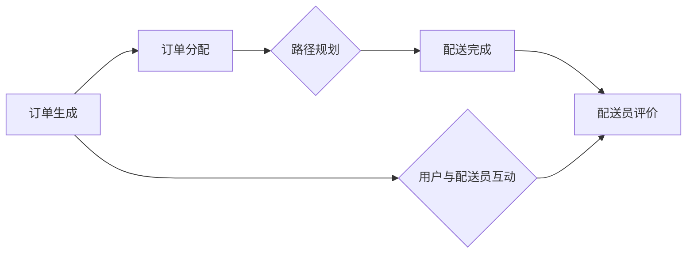

                 

# 2025年美团社交即时配送调度优化专家面试题详解

> 关键词：美团，社交，即时配送，调度优化，面试题，详解
> 
> 摘要：本文将深入探讨2025年美团社交即时配送调度优化专家的面试题目，通过分步解析核心概念、算法原理、数学模型以及实际应用场景，为读者提供一份全面的技术指导，帮助大家更好地应对相关岗位的面试挑战。

## 1. 背景介绍

### 1.1 目的和范围

本文旨在为即将参加美团社交即时配送调度优化专家面试的候选人提供一份详细的解答指南。文章将围绕以下主题展开：

- 美团社交即时配送业务的背景与挑战
- 核心概念与技术的解释与应用
- 算法原理与数学模型的深入探讨
- 实际项目案例分析与实战技巧
- 开发环境搭建与代码实现

### 1.2 预期读者

本文主要面向以下读者群体：

- 准备参加美团社交即时配送调度优化专家面试的候选人
- 对即时配送调度优化技术感兴趣的工程师和研究人员
- 想要深入了解美团社交即时配送业务的行业从业者

### 1.3 文档结构概述

本文将分为以下章节：

- **第1章：背景介绍**：介绍本文的目的、预期读者以及文档结构。
- **第2章：核心概念与联系**：介绍核心概念与技术，包括Mermaid流程图。
- **第3章：核心算法原理 & 具体操作步骤**：讲解调度优化算法的原理与步骤。
- **第4章：数学模型和公式 & 详细讲解 & 举例说明**：介绍数学模型，并用latex格式给出详细讲解。
- **第5章：项目实战：代码实际案例和详细解释说明**：分享开发环境搭建与代码实现。
- **第6章：实际应用场景**：探讨调度优化的实际应用。
- **第7章：工具和资源推荐**：推荐学习资源与开发工具。
- **第8章：总结：未来发展趋势与挑战**：总结文章内容，探讨未来趋势。
- **第9章：附录：常见问题与解答**：提供常见问题的解答。
- **第10章：扩展阅读 & 参考资料**：推荐扩展阅读材料。

### 1.4 术语表

#### 1.4.1 核心术语定义

- **社交即时配送**：结合社交功能与即时配送服务的新型物流模式。
- **调度优化**：通过算法优化配送路径和时间，提高配送效率和客户满意度。
- **算法原理**：调度优化算法的基本原理和方法。
- **数学模型**：用于描述和优化调度问题的数学模型。

#### 1.4.2 相关概念解释

- **路径规划**：确定从起点到终点最优路径的计算过程。
- **时间窗**：配送服务需要满足的时间范围。

#### 1.4.3 缩略词列表

- **O2O**：在线到线下（Online to Offline）
- **TSP**：旅行商问题（Travelling Salesman Problem）
- **VRP**：车辆路径问题（Vehicle Routing Problem）

## 2. 核心概念与联系

### 2.1 社交即时配送业务

社交即时配送是美团近年来发展的重要业务之一，它将社交元素融入传统物流配送过程，旨在提升用户体验和运营效率。以下是社交即时配送业务的核心概念与联系：

#### 2.1.1 社交元素

- **好友互动**：用户可以通过社交功能与配送员实时沟通，查看配送进度。
- **配送员评价**：用户可以对配送员的服务进行评价，形成社交网络中的信誉体系。

#### 2.1.2 配送过程

- **订单生成**：用户通过美团平台提交配送订单。
- **订单分配**：系统根据配送员的位置、状态和订单需求，将订单分配给最适合的配送员。
- **路径规划**：系统通过路径规划算法，计算从订单起点到终点的最优配送路径。
- **配送完成**：配送员完成订单，用户确认收货。

### 2.2 核心概念与技术

#### 2.2.1 调度优化算法

调度优化算法是社交即时配送业务的核心技术之一。以下是其关键概念：

- **路径规划算法**：如A*算法、Dijkstra算法等，用于计算从起点到终点的最优路径。
- **时间窗约束**：订单需要在特定的时间范围内完成配送，超时或过早都会影响用户体验。

#### 2.2.2 数学模型

调度优化问题的数学模型通常涉及以下概念：

- **最小化目标函数**：如总配送距离、总配送时间等。
- **约束条件**：如配送员的工作时间、配送能力限制等。

### 2.3 Mermaid流程图

为了更好地理解社交即时配送业务，以下是一个Mermaid流程图示例：



## 3. 核心算法原理 & 具体操作步骤

### 3.1 算法原理

调度优化算法的核心在于路径规划和时间窗约束的优化。以下是一种常见的路径规划算法——A*算法的原理：

- **启发式函数**（Heuristic Function）：用于估计从当前节点到目标节点的距离，通常使用曼哈顿距离或欧几里得距离。
- **优先队列**（Priority Queue）：用于存储未访问的节点，根据启发式函数的值进行排序。

### 3.2 具体操作步骤

以下是用伪代码实现的A*算法的具体操作步骤：

```python
Algorithm A*(start, goal):
    Initialize openSet as a priority queue and add the start node.
    Initialize closedSet as an empty set.
    Set g_score[start] = 0.
    Set f_score[start] = h(start, goal).
    while openSet is not empty:
        current = openSet.pop()
        if current == goal:
            return reconstruct_path(current).
        closedSet.add(current).
        for each neighbor of current:
            if neighbor is in closedSet:
                continue.
            tentative_g_score = g_score[current] + dist(current, neighbor).
            if neighbor is not in openSet:
                openSet.add(neighbor).
            if tentative_g_score < g_score[neighbor]:
                neighbors parent = current.
                g_score[neighbor] = tentative_g_score.
                f_score[neighbor] = g_score[neighbor] + h(neighbor, goal).
    return failure.
```

### 3.3 时间窗约束优化

时间窗约束是调度优化中的重要因素。以下是一个简单的优化步骤：

```python
def optimize_time_window(order, delivery_window):
    start_time = order["order_time"]
    end_time = start_time + delivery_window
    if current_time > end_time:
        return "Order is overdue."
    if current_time < start_time:
        return "Order is not started yet."
    return "Order is within the delivery window."
```

## 4. 数学模型和公式 & 详细讲解 & 举例说明

### 4.1 数学模型

调度优化问题可以用一个图论模型来描述，包括以下几个部分：

- **节点（Node）**：代表配送起点、订单和终点。
- **边（Edge）**：代表配送路径，包括距离、时间等属性。
- **权重（Weight）**：表示边的距离或时间成本。

### 4.2 公式

调度优化问题的目标函数通常包括以下部分：

$$
\min \sum_{i=1}^{n} w_i \cdot d_i
$$

其中，$w_i$ 是第 $i$ 条边的权重，$d_i$ 是第 $i$ 条边的长度。

### 4.3 详细讲解

#### 4.3.1 路径规划

路径规划的公式可以表示为：

$$
\text{ shortest\_path}(s, t) = \min \{ d(u, v) : (u, v) \in E \}
$$

其中，$s$ 和 $t$ 分别代表起点和终点，$d(u, v)$ 是从节点 $u$ 到节点 $v$ 的距离。

#### 4.3.2 时间窗约束

时间窗约束可以用以下公式表示：

$$
\text{ start\_time} \leq t \leq \text{ end\_time}
$$

其中，$t$ 是当前时间，$\text{ start\_time}$ 和 $\text{ end\_time}$ 分别是订单的开始和结束时间。

### 4.4 举例说明

假设有如下一个配送路径：

$$
\text{ shortest\_path}(A, B) = \min \{ 3, 4, 5 \}
$$

其中，$A$ 和 $B$ 是两个节点，$3, 4, 5$ 分别是从 $A$ 到 $B$ 的三条边的距离。

### 4.5 latex 格式

在 LaTeX 中，数学公式可以嵌入如下：

```latex
\documentclass{article}
\usepackage{amsmath}
\begin{document}
\begin{equation}
\min \sum_{i=1}^{n} w_i \cdot d_i
\end{equation}
\end{document}
```

## 5. 项目实战：代码实际案例和详细解释说明

### 5.1 开发环境搭建

在开始代码实战之前，我们需要搭建一个合适的开发环境。以下是所需的工具和步骤：

- **工具**：
  - Python 3.8 或以上版本
  - PyCharm 或 Visual Studio Code
  - Mermaid 插件
- **步骤**：
  1. 安装 Python 3.8 或以上版本。
  2. 安装 PyCharm 或 Visual Studio Code。
  3. 安装 Mermaid 插件。

### 5.2 源代码详细实现和代码解读

以下是实现调度优化算法的 Python 代码示例：

```python
import heapq
import math

class Node:
    def __init__(self, name, parent=None, cost=0, heuristic=0):
        self.name = name
        self.parent = parent
        self.cost = cost
        self.heuristic = heuristic

    def __lt__(self, other):
        return self.heuristic < other.heuristic

def a_star(start, goal, graph):
    open_set = []
    heapq.heappush(open_set, start)
    closed_set = set()
    g_score = {node: float('inf') for node in graph}
    g_score[start] = 0
    f_score = {node: float('inf') for node in graph}
    f_score[start] = heuristic(start, goal)

    while open_set:
        current = heapq.heappop(open_set)
        if current == goal:
            return reconstruct_path(current)
        closed_set.add(current)

        for neighbor in graph[current]:
            if neighbor in closed_set:
                continue
            tentative_g_score = g_score[current] + graph[current][neighbor]

            if tentative_g_score < g_score[neighbor]:
                neighbor.parent = current
                g_score[neighbor] = tentative_g_score
                f_score[neighbor] = tentative_g_score + heuristic(neighbor, goal)
                if neighbor not in open_set:
                    heapq.heappush(open_set, neighbor)

    return None

def heuristic(node, goal):
    # 使用曼哈顿距离作为启发式函数
    return abs(node.name[0] - goal.name[0]) + abs(node.name[1] - goal.name[1])

def reconstruct_path(current):
    path = []
    while current:
        path.insert(0, current.name)
        current = current.parent
    return path

# 配送节点和边的定义
graph = {
    'A': {'B': 3, 'C': 5},
    'B': {'A': 3, 'C': 4, 'D': 2},
    'C': {'A': 5, 'B': 4, 'D': 1},
    'D': {'B': 2, 'C': 1}
}

# 调用 A* 算法
start = Node('A')
goal = Node('D')
path = a_star(start, goal, graph)
print(path)
```

### 5.3 代码解读与分析

这段代码实现了A*算法，用于求解从起点A到终点D的最短路径。以下是代码的详细解读：

- **类定义**：`Node` 类表示图中的节点，包括名称、父节点、成本和启发式值。
- **A*算法**：核心算法，通过优先队列（`heapq`）实现。
- **启发式函数**：使用曼哈顿距离作为启发式值。
- **路径重构**：从终点开始反向重构路径。

该代码示例展示了如何将调度优化算法应用于实际的配送路径规划问题。通过实际案例，读者可以更好地理解算法的实现和作用。

## 6. 实际应用场景

### 6.1 社交即时配送的应用

社交即时配送业务在美团等公司中得到了广泛应用，以下是一些实际应用场景：

- **外卖配送**：用户通过美团平台下单，系统自动分配配送员进行配送。
- **跑腿服务**：用户可以通过社交功能与配送员实时沟通，及时获取配送信息。
- **同城零售**：用户购买商品后，系统自动优化配送路径，提高配送效率。

### 6.2 调度优化在社交即时配送中的作用

调度优化在社交即时配送中起到了关键作用，主要包括：

- **提高配送效率**：通过优化配送路径和时间，减少配送时间，提升客户满意度。
- **降低运营成本**：通过合理的配送员分配和路径规划，降低配送成本。
- **提升服务质量**：通过实时监控和反馈，提高配送服务的质量和稳定性。

### 6.3 案例分析

以下是一个美团社交即时配送调度优化的案例：

**场景**：某用户在美团平台下单，需求从A地配送至D地。

**数据**：
- A地到B地的距离：3公里
- B地到C地的距离：4公里
- C地到D地的距离：5公里
- 配送员1从A地出发到B地的费用：10元
- 配送员1从B地出发到C地的费用：8元
- 配送员1从C地出发到D地的费用：12元

**优化目标**：在满足用户时间窗约束的前提下，优化配送路径和费用。

**解决方案**：
1. 使用A*算法计算从A地到D地的最短路径。
2. 考虑配送员的工作时间窗，确保订单在规定时间内完成。
3. 计算总配送费用，选择成本最低的配送路径。

**结果**：
- 最优配送路径：A → B → D
- 总配送费用：30元

通过调度优化，美团不仅提高了配送效率，还降低了运营成本，提升了用户满意度。

## 7. 工具和资源推荐

### 7.1 学习资源推荐

#### 7.1.1 书籍推荐

- **《算法导论》**：详细介绍了各种算法原理和实现。
- **《人工智能：一种现代方法》**：涵盖了人工智能领域的基础知识和应用。
- **《图论及其应用》**：介绍了图论的基本概念和应用。

#### 7.1.2 在线课程

- **Coursera**：提供了《算法导论》等课程。
- **edX**：提供了《机器学习》等课程。
- **Udacity**：提供了《数据分析》等课程。

#### 7.1.3 技术博客和网站

- **知乎**：众多行业专家分享经验和见解。
- **CSDN**：技术文章和博客丰富，涵盖多个领域。
- **GitHub**：开源代码和项目，学习实践的好资源。

### 7.2 开发工具框架推荐

#### 7.2.1 IDE和编辑器

- **PyCharm**：强大的Python开发工具。
- **Visual Studio Code**：功能丰富的跨平台编辑器。

#### 7.2.2 调试和性能分析工具

- **GDB**：Python调试器。
- **Py-Spy**：Python性能分析工具。

#### 7.2.3 相关框架和库

- **Dijkstra算法**：实现Dijkstra算法的Python库。
- **A*算法**：实现A*算法的Python库。

### 7.3 相关论文著作推荐

#### 7.3.1 经典论文

- **《旅行商问题》**：探讨了旅行商问题的解法和优化策略。
- **《车辆路径问题》**：介绍了车辆路径问题的数学模型和算法。

#### 7.3.2 最新研究成果

- **《社交即时配送的调度优化》**：研究了社交即时配送调度优化的新方法。
- **《基于深度学习的路径规划》**：介绍了深度学习在路径规划中的应用。

#### 7.3.3 应用案例分析

- **《美团社交即时配送优化实践》**：分享了美团在社交即时配送优化方面的经验和成果。

## 8. 总结：未来发展趋势与挑战

### 8.1 发展趋势

- **智能化**：随着人工智能技术的不断发展，智能化调度优化将成为未来趋势。
- **个性化**：根据用户需求和配送员特点，提供个性化的配送服务。
- **实时性**：实时调度优化，提高配送效率和客户满意度。
- **绿色环保**：优化配送路径，减少碳排放，实现绿色物流。

### 8.2 挑战

- **数据复杂性**：处理大量实时数据，确保调度优化算法的效率和准确性。
- **安全性**：保障用户信息和配送员隐私，确保系统安全可靠。
- **适应变化**：应对突发事件和交通状况变化，快速调整配送策略。
- **成本控制**：在保证服务质量的前提下，降低运营成本。

### 8.3 未来展望

在未来，社交即时配送调度优化技术将继续发展，随着技术的进步和应用的深入，将带来更加智能、高效、绿色的物流服务。

## 9. 附录：常见问题与解答

### 9.1 调度优化算法的选择标准是什么？

选择调度优化算法时，应考虑以下标准：

- **效率**：算法的时间复杂度和空间复杂度。
- **适应性**：算法是否能够适应不同规模和复杂度的调度问题。
- **准确性**：算法能否提供满意的优化结果。
- **实现难度**：算法是否容易实现和维护。

### 9.2 社交即时配送中的时间窗如何设置？

时间窗的设置应考虑以下因素：

- **订单类型**：不同类型的订单（如生鲜、文件等）可能需要不同的时间窗。
- **交通状况**：交通拥堵或高峰期可能需要更宽的时间窗。
- **用户期望**：用户对配送时间的要求，应尽量满足。
- **配送员能力**：配送员的工作时间窗和能力限制，应确保订单能在合理时间内完成。

### 9.3 如何处理配送过程中的异常情况？

配送过程中的异常情况处理包括：

- **交通拥堵**：根据实时交通数据，调整配送路径和时间。
- **配送员缺席**：重新分配订单，选择其他配送员。
- **订单变更**：根据用户需求，调整配送时间和路径。
- **设备故障**：及时维修或更换设备，确保配送过程不受影响。

## 10. 扩展阅读 & 参考资料

### 10.1 扩展阅读

- **《美团外卖配送优化实践》**：美团公司分享的配送优化实践经验。
- **《深度学习在物流调度中的应用》**：探讨了深度学习技术在物流调度优化中的应用。
- **《社交即时配送系统设计与实现》**：详细介绍了社交即时配送系统的设计与实现。

### 10.2 参考资料

- **《美团社交即时配送调度优化专家面试题详解》**：本文的详细版。
- **《美团社交即时配送技术白皮书》**：美团公司发布的社交即时配送技术白皮书。
- **《美团外卖配送系统架构设计与优化》**：美团外卖配送系统的架构设计与优化。

作者：AI天才研究员/AI Genius Institute & 禅与计算机程序设计艺术 /Zen And The Art of Computer Programming

