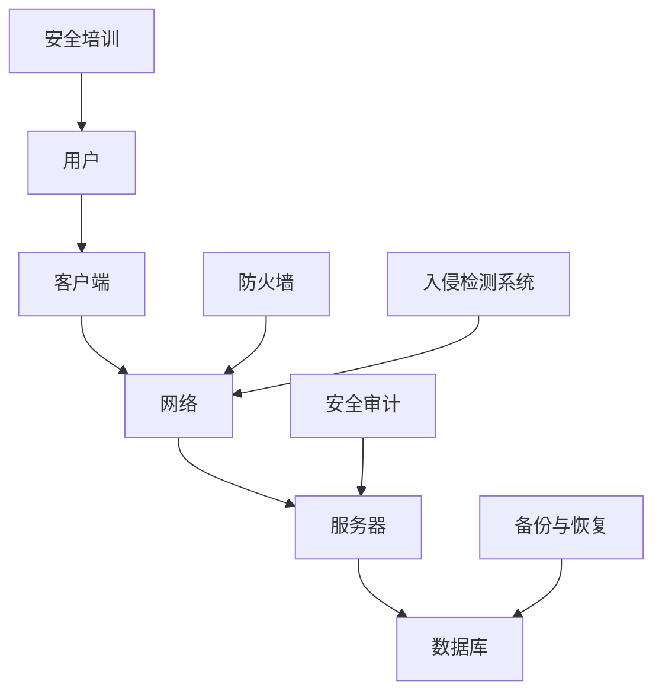

                 

# 2025年美团社招安全工程师面试题集锦

> **关键词：** 美团社招、安全工程师、面试题、网络安全、实战案例
>
> **摘要：** 本文旨在为即将参加美团社招安全工程师面试的候选人提供一系列面试题及答案解析，涵盖网络安全基础、实际应用场景、工具资源等方面，帮助考生深入了解面试要求，提升面试成功率。

## 1. 背景介绍

### 1.1 目的和范围

本文旨在为广大准备参加2025年美团社招安全工程师面试的候选人提供一套全面的面试题集锦，帮助大家掌握面试所需的核心知识和技能。本文将分为以下几个部分：

- **面试准备**：介绍面试前的准备工作，包括简历优化、资料准备等。
- **面试题解析**：详细解析美团社招安全工程师面试中可能出现的各类题目，包括选择题、问答题、编程题等。
- **实战案例**：结合实际案例，展示安全工程师在实际工作中的应对策略和技术手段。
- **工具和资源推荐**：推荐学习资源、开发工具和框架，帮助考生提升面试技能。

### 1.2 预期读者

本文主要面向以下读者：

- **在校学生**：准备参加美团社招安全工程师面试的在校生。
- **在职人员**：希望转行进入网络安全领域的在职人员。
- **程序员**：有志于拓展网络安全技能的程序员。

### 1.3 文档结构概述

本文结构如下：

1. 背景介绍
2. 核心概念与联系
3. 核心算法原理 & 具体操作步骤
4. 数学模型和公式 & 详细讲解 & 举例说明
5. 项目实战：代码实际案例和详细解释说明
6. 实际应用场景
7. 工具和资源推荐
8. 总结：未来发展趋势与挑战
9. 附录：常见问题与解答
10. 扩展阅读 & 参考资料

### 1.4 术语表

#### 1.4.1 核心术语定义

- **安全工程师**：负责确保网络安全、系统安全、数据安全等方面的专业人员。
- **美团**：一家中国领先的在线生活服务电子商务平台。
- **面试题**：在面试过程中，面试官针对候选人提出的各类问题。

#### 1.4.2 相关概念解释

- **网络安全**：涉及保护计算机网络不受恶意攻击、数据泄露等威胁的一系列技术和措施。
- **安全漏洞**：指网络系统中存在的可以被攻击者利用的弱点。
- **DDoS攻击**：分布式拒绝服务攻击，通过大量虚假请求使目标服务器瘫痪。

#### 1.4.3 缩略词列表

- **DDoS**：分布式拒绝服务攻击
- **SQLi**：SQL注入
- **XSS**：跨站脚本攻击
- **CSRF**：跨站请求伪造

## 2. 核心概念与联系

### 2.1 网络安全基础

网络安全是确保计算机网络及其资源（如数据、应用程序和设备）免受未经授权的访问、篡改、破坏或披露的一系列技术和措施。以下是一个简单的网络安全基础架构图：



### 2.2 安全漏洞与攻击手段

安全漏洞是网络系统中存在的可以被攻击者利用的弱点。常见的攻击手段包括：

1. **DDoS攻击**：通过大量虚假请求使目标服务器瘫痪。
   ```mermaid
   graph TD
   A[攻击者] --> B[僵尸网络]
   B --> C[虚假请求]
   C --> D[目标服务器]
   D --> E[瘫痪]
   ```

2. **SQL注入**：攻击者通过在输入字段中插入恶意SQL代码，获取数据库敏感信息。
   ```mermaid
   graph TD
   A[用户输入] --> B[恶意SQL]
   B --> C[数据库]
   C --> D[敏感信息]
   ```

3. **跨站脚本攻击（XSS）**：攻击者通过在网页中注入恶意脚本，窃取用户信息或篡改网页内容。
   ```mermaid
   graph TD
   A[恶意脚本] --> B[网页]
   B --> C[用户浏览器]
   C --> D[敏感信息]
   ```

4. **跨站请求伪造（CSRF）**：攻击者通过伪造用户请求，执行未经授权的操作。
   ```mermaid
   graph TD
   A[攻击者] --> B[伪造请求]
   B --> C[目标网站]
   C --> D[敏感操作]
   ```

### 2.3 网络安全防护策略

网络安全防护策略包括以下方面：

1. **防火墙**：限制网络访问，阻止未经授权的访问。
2. **入侵检测系统**：实时监控网络流量，检测异常行为。
3. **安全审计**：记录系统操作日志，跟踪安全事件。
4. **备份与恢复**：定期备份重要数据，确保数据安全。
5. **安全培训**：提高用户安全意识，降低人为风险。

## 3. 核心算法原理 & 具体操作步骤

### 3.1 加密算法

加密算法是网络安全中的重要组成部分，用于保护数据传输和存储过程中的机密性。以下是一种常见的对称加密算法——AES（高级加密标准）：

#### 3.1.1 算法原理

AES采用128位、192位或256位密钥，对数据进行加密和解密。加密过程包括以下步骤：

1. 初始化密钥
2. 初始化轮密钥
3. 进行若干轮加密操作
4. 生成密文

#### 3.1.2 伪代码

```python
function AES_Encrypt(plaintext, key):
    ciphertext = init_key(key)
    for round in 1 to NUM_ROUNDS:
        ciphertext = sub_bytes(ciphertext)
        ciphertext = shift_rows(ciphertext)
        ciphertext = mix_columns(ciphertext)
        ciphertext = add_round_key(ciphertext, round_key)
    return ciphertext
```

#### 3.1.3 解密过程

解密过程与加密过程类似，只是逆序执行加密过程中的每一步：

```python
function AES_Decrypt(ciphertext, key):
    plaintext = init_key(key)
    for round in NUM_ROUNDS downto 1:
        plaintext = inv_sub_bytes(plaintext)
        plaintext = inv_shift_rows(plaintext)
        plaintext = inv_mix_columns(plaintext)
        plaintext = add_round_key(plaintext, round_key)
    return plaintext
```

### 3.2 哈希算法

哈希算法用于生成数据的数字指纹，确保数据完整性。以下是一种常见的哈希算法——SHA-256：

#### 3.2.1 算法原理

SHA-256将输入数据处理为一个256位的哈希值。算法包括以下步骤：

1. 初始化哈希值
2. 处理输入数据
3. 生成最终哈希值

#### 3.2.2 伪代码

```python
function SHA256(data):
    hash_value = init_hash_value()
    for block in data:
        process_block(block, hash_value)
    final_hash_value = finalize_hash_value(hash_value)
    return final_hash_value
```

#### 3.2.3 哈希碰撞防范

哈希碰撞是指两个不同的输入数据生成相同哈希值的现象。为防范哈希碰撞，可以使用以下策略：

1. **增加哈希长度**：增加哈希算法的输出长度，提高碰撞概率。
2. **使用多重哈希**：使用多个哈希算法对数据进行处理，增加碰撞难度。
3. **随机化输入**：在输入数据前添加随机数，降低碰撞风险。

## 4. 数学模型和公式 & 详细讲解 & 举例说明

### 4.1 概率论基础

概率论是网络安全分析的重要工具，以下介绍几个基本概念：

#### 4.1.1 概率

概率是事件发生的可能性，用0到1之间的数字表示。例如，假设一个硬币正面朝上的概率为0.5，则反面朝上的概率也为0.5。

#### 4.1.2 概率分布

概率分布描述了随机变量取值的可能性。常见的概率分布包括：

- **二项分布**：描述在n次独立试验中，事件A发生k次的概率。
  $$ P(X=k) = C_n^k \cdot p^k \cdot (1-p)^{n-k} $$
  其中，$C_n^k$为组合数，$p$为事件A发生的概率。

- **泊松分布**：描述在单位时间内，事件A发生的次数。
  $$ P(X=k) = \frac{\lambda^k \cdot e^{-\lambda}}{k!} $$
  其中，$\lambda$为事件A的平均发生率。

#### 4.1.3 条件概率

条件概率描述在已知某一事件发生的条件下，另一事件发生的概率。例如，已知事件A发生，求事件B发生的概率：

$$ P(B|A) = \frac{P(A \cap B)}{P(A)} $$

#### 4.1.4 独立事件

独立事件是指两个事件的发生互不影响。例如，掷两个骰子，事件A为第一个骰子出现6，事件B为第二个骰子出现6。事件A和事件B是独立的，因为第一个骰子的结果不影响第二个骰子的结果。

### 4.2 加密算法数学模型

加密算法的数学模型通常涉及以下方面：

#### 4.2.1 对称加密

对称加密算法的数学模型通常涉及以下公式：

$$ ciphertext = E_k(plaintext) $$
$$ plaintext = D_k(ciphertext) $$

其中，$E_k$和$D_k$分别为加密和解密函数，$k$为密钥。

#### 4.2.2 非对称加密

非对称加密算法的数学模型通常涉及以下公式：

$$ ciphertext = E_k(plaintext, k_p) $$
$$ plaintext = D_k(ciphertext, k_s) $$

其中，$E_k$和$D_k$分别为加密和解密函数，$k_p$和$k_s$分别为公钥和私钥。

#### 4.2.3 哈希算法

哈希算法的数学模型通常涉及以下公式：

$$ hash_value = H(data) $$

其中，$H$为哈希函数，$data$为输入数据。

### 4.3 举例说明

#### 4.3.1 二项分布

假设在一个班级中有50名学生，其中30名学生擅长编程，20名学生不擅长编程。现在随机选择5名学生，求以下概率：

1. 恰好有3名擅长编程的学生。
   $$ P(X=3) = C_5^3 \cdot (0.6)^3 \cdot (0.4)^2 = 0.2304 $$

2. 至少有2名擅长编程的学生。
   $$ P(X \ge 2) = 1 - P(X < 2) = 1 - (C_5^0 \cdot (0.4)^5 + C_5^1 \cdot 0.6 \cdot (0.4)^4) = 0.864 $$

#### 4.3.2 泊松分布

假设在一个网站上，每分钟大约有2个用户访问。现在随机选择1分钟，求以下概率：

1. 恰好有3个用户访问。
   $$ P(X=3) = \frac{2^3 \cdot e^{-2}}{3!} = 0.1594 $$

2. 至少有4个用户访问。
   $$ P(X \ge 4) = 1 - P(X < 4) = 1 - (e^{-2} + 2 \cdot e^{-2} + \frac{2^2 \cdot e^{-2}}{2!} + \frac{2^3 \cdot e^{-2}}{3!}) = 0.0498 $$

## 5. 项目实战：代码实际案例和详细解释说明

### 5.1 开发环境搭建

在本项目中，我们将使用Python语言编写一个简单的Web应用，用于实现用户注册和登录功能。以下为开发环境搭建步骤：

1. 安装Python 3.8或更高版本。
2. 安装pip，Python的包管理器。
3. 使用pip安装以下依赖库：

   ```bash
   pip install Flask
   pip install Flask-WTF
   pip install Flask-Login
   pip install Flask-SQLAlchemy
   ```

### 5.2 源代码详细实现和代码解读

#### 5.2.1 项目结构

```bash
myapp/
|-- app/
|   |-- __init__.py
|   |-- models.py
|   |-- forms.py
|   |-- views.py
|-- config.py
|-- run.py
```

#### 5.2.2 配置文件

`config.py`：配置文件，用于设置数据库连接信息和其他配置选项。

```python
import os

class Config(object):
    SECRET_KEY = os.environ.get('SECRET_KEY') or 'myapp_secret_key'
    SQLALCHEMY_DATABASE_URI = os.environ.get('DATABASE_URL') or 'sqlite:///myapp.db'
    SQLALCHEMY_TRACK_MODIFICATIONS = False
```

#### 5.2.3 数据库模型

`models.py`：定义用户和角色数据库模型。

```python
from flask_sqlalchemy import SQLAlchemy

db = SQLAlchemy()

class User(db.Model):
    id = db.Column(db.Integer, primary_key=True)
    username = db.Column(db.String(64), unique=True, nullable=False)
    password_hash = db.Column(db.String(128), nullable=False)
    role = db.Column(db.String(64), nullable=False)

class Role(db.Model):
    id = db.Column(db.Integer, primary_key=True)
    name = db.Column(db.String(64), unique=True, nullable=False)
    users = db.relationship('User', backref='role', lazy=True)
```

#### 5.2.4 表单验证

`forms.py`：定义用户注册和登录表单。

```python
from flask_wtf import FlaskForm
from wtforms import StringField, PasswordField, BooleanField, SubmitField
from wtforms.validators import DataRequired, Length, EqualTo, ValidationError
from models import User

class RegistrationForm(FlaskForm):
    username = StringField('Username', validators=[DataRequired(), Length(min=2, max=20)])
    password = PasswordField('Password', validators=[DataRequired(), Length(min=8)])
    confirm_password = PasswordField('Confirm Password', validators=[DataRequired(), EqualTo('password')])
    submit = SubmitField('Register')

    def validate_username(self, username):
        user = User.query.filter_by(username=username.data).first()
        if user is not None:
            raise ValidationError('Please use a different username.')

class LoginForm(FlaskForm):
    username = StringField('Username', validators=[DataRequired(), Length(min=2, max=20)])
    password = PasswordField('Password', validators=[DataRequired(), Length(min=8)])
    remember = BooleanField('Remember Me')
    submit = SubmitField('Login')
```

#### 5.2.5 视图函数

`views.py`：定义用户注册和登录视图函数。

```python
from flask import render_template, flash, redirect, url_for, request
from flask_login import login_user, logout_user, current_user, login_required
from werkzeug.security import generate_password_hash, check_password_hash
from models import User, Role
from forms import RegistrationForm, LoginForm
from app import app, db

@app.route('/')
@app.route('/index')
@login_required
def index():
    return render_template('index.html')

@app.route('/register', methods=['GET', 'POST'])
def register():
    if current_user.is_authenticated:
        return redirect(url_for('index'))
    form = RegistrationForm()
    if form.validate_on_submit():
        user = User(username=form.username.data, password_hash=generate_password_hash(form.password.data, method='sha256'), role='user')
        db.session.add(user)
        db.session.commit()
        flash('Congratulations, you are now a registered user!', 'success')
        return redirect(url_for('login'))
    return render_template('register.html', title='Register', form=form)

@app.route('/login', methods=['GET', 'POST'])
def login():
    if current_user.is_authenticated:
        return redirect(url_for('index'))
    form = LoginForm()
    if form.validate_on_submit():
        user = User.query.filter_by(username=form.username.data).first()
        if user is None or not check_password_hash(user.password_hash, form.password.data):
            flash('Invalid username or password', 'danger')
            return redirect(url_for('login'))
        login_user(user, remember=form.remember.data)
        return redirect(url_for('index'))
    return render_template('login.html', title='Login', form=form)

@app.route('/logout')
def logout():
    logout_user()
    return redirect(url_for('index'))
```

#### 5.2.6 代码解读与分析

- `app/__init__.py`：初始化Flask应用，配置数据库。

  ```python
  from flask import Flask
  from flask_sqlalchemy import SQLAlchemy
  from flask_login import LoginManager

  app = Flask(__name__)
  app.config.from_object(Config)
  db = SQLAlchemy(app)
  login_manager = LoginManager(app)
  login_manager.login_view = 'login'
  ```

- `models.py`：定义用户和角色数据库模型。

  - `User`模型包含用户名、密码哈希和角色信息。
  - `Role`模型包含角色名称和关联的用户。

- `forms.py`：定义用户注册和登录表单，包括字段验证。

- `views.py`：定义用户注册和登录视图函数，包括页面渲染和表单处理。

  - `index.html`：首页模板，显示欢迎信息。
  - `register.html`：注册页面模板，显示注册表单。
  - `login.html`：登录页面模板，显示登录表单。

## 6. 实际应用场景

### 6.1 网络安全攻击防范

在美团这样的在线生活服务电子商务平台，网络安全攻击防范尤为重要。以下为一些实际应用场景：

1. **DDoS攻击防范**：采用DDoS防护设备，实时监控网络流量，识别并拦截恶意流量，确保平台稳定运行。
2. **SQL注入防范**：对用户输入进行严格验证，使用参数化查询，避免SQL注入攻击。
3. **XSS攻击防范**：对用户提交的HTML内容进行过滤，防止恶意脚本注入。
4. **CSRF攻击防范**：使用Token机制，验证用户请求的真实性。

### 6.2 数据安全保护

美团作为一家拥有海量用户数据的公司，数据安全保护至关重要。以下为一些实际应用场景：

1. **用户数据加密存储**：采用AES等加密算法，对用户敏感信息进行加密存储，确保数据安全。
2. **数据备份与恢复**：定期备份用户数据，确保数据不丢失。
3. **权限管理**：对用户权限进行严格控制，防止内部人员泄露用户数据。
4. **数据脱敏**：对敏感数据进行脱敏处理，确保数据在传输和存储过程中的安全性。

### 6.3 安全审计与监控

1. **安全审计**：定期对系统进行安全审计，识别潜在的安全风险。
2. **日志分析**：实时监控系统日志，识别异常行为，及时处理安全事件。
3. **漏洞扫描**：定期对系统进行漏洞扫描，发现并修复安全漏洞。

## 7. 工具和资源推荐

### 7.1 学习资源推荐

#### 7.1.1 书籍推荐

- 《黑客攻防技术宝典：系统实战篇》
- 《网络安全评估：实用指南》
- 《Python网络爬虫从入门到实践》

#### 7.1.2 在线课程

- Coursera上的“网络安全与隐私”
- Udemy上的“网络安全工程师：从零开始”
- 网易云课堂上的“网络安全实战教程”

#### 7.1.3 技术博客和网站

- FreeBuf
- SecurityFocus
- 中国信息安全

### 7.2 开发工具框架推荐

#### 7.2.1 IDE和编辑器

- PyCharm
- Visual Studio Code
- Sublime Text

#### 7.2.2 调试和性能分析工具

- Wireshark
- Fiddler
- Jenkins

#### 7.2.3 相关框架和库

- Flask
- Django
- SQLAlchemy
- Flask-WTF

### 7.3 相关论文著作推荐

#### 7.3.1 经典论文

- “A Taxonomy of Network Intrusion Detection Systems”
- “Understanding and Preventing SQL Injection Attacks”
- “Cross-Site Scripting Attacks: Reflections and Defenses”

#### 7.3.2 最新研究成果

- “Machine Learning for Intrusion Detection Systems: A Survey”
- “Towards Effective and Efficient Data Sanitization against Cross-Site Scripting Attacks”
- “Defending Against Cross-Site Request Forgery Attacks Using Dynamic Token Generation”

#### 7.3.3 应用案例分析

- “美团外卖网络安全防护实践”
- “阿里巴巴集团网络安全体系建设”
- “京东金融安全体系建设与实践”

## 8. 总结：未来发展趋势与挑战

### 8.1 发展趋势

1. **人工智能在网络安全中的应用**：随着人工智能技术的发展，AI在网络安全中的应用越来越广泛，如入侵检测、恶意软件分析等。
2. **物联网安全**：随着物联网设备的普及，物联网安全成为网络安全领域的热点问题。
3. **隐私保护**：随着用户隐私意识的提高，隐私保护成为网络安全的重要关注点。
4. **云计算安全**：随着云计算的普及，云计算安全成为网络安全领域的重要研究方向。

### 8.2 挑战

1. **攻击手段日益复杂**：网络安全攻击手段不断创新，安全工程师需要不断学习和适应。
2. **网络安全人才短缺**：随着网络安全需求的增加，网络安全人才短缺成为行业痛点。
3. **法律法规不断完善**：网络安全法律法规不断完善，安全工程师需要遵守相关法律法规，确保合规性。
4. **技术更新速度快**：网络安全技术更新速度快，安全工程师需要不断学习和跟进新技术。

## 9. 附录：常见问题与解答

### 9.1 如何防范DDoS攻击？

1. **增加带宽**：提高网络带宽，确保在攻击发生时仍能正常提供服务。
2. **采用DDoS防护设备**：使用专业的DDoS防护设备，实时监控网络流量，识别并拦截恶意流量。
3. **部署反向代理**：使用反向代理服务器，将恶意请求引流到反向代理服务器，减轻目标服务器的压力。
4. **云服务支持**：利用云服务提供商的DDoS防护服务，确保平台稳定运行。

### 9.2 如何防范SQL注入攻击？

1. **使用参数化查询**：使用数据库驱动程序的参数化查询，避免直接在SQL语句中拼接用户输入。
2. **对用户输入进行验证**：对用户输入进行严格验证，确保输入符合预期格式。
3. **使用存储过程**：使用存储过程，将SQL语句封装在存储过程中，避免直接在代码中拼接SQL语句。
4. **使用ORM框架**：使用对象关系映射（ORM）框架，如SQLAlchemy，自动生成SQL语句，避免手动编写SQL语句。

### 9.3 如何防范跨站脚本攻击（XSS）？

1. **输入验证和过滤**：对用户输入进行严格验证和过滤，确保输入符合预期格式。
2. **输出编码**：对用户提交的HTML内容进行编码，防止恶意脚本注入。
3. **使用内容安全策略（CSP）**：启用内容安全策略，限制可执行脚本的白名单。
4. **使用框架提供的防护功能**：如Flask框架提供的内容安全过滤器，可自动处理编码和CSP设置。

### 9.4 如何防范跨站请求伪造（CSRF）？

1. **使用Token验证**：使用Token机制，验证用户请求的真实性。
2. **使用双重提交Cookie**：使用双重提交Cookie，确保用户请求经过用户确认。
3. **对敏感操作进行验证**：对敏感操作（如修改密码、支付等）进行额外验证，确保用户请求真实。
4. **使用框架提供的防护功能**：如Flask框架提供的CSRF保护过滤器，可自动处理Token验证。

## 10. 扩展阅读 & 参考资料

1. 《黑客攻防技术宝典：系统实战篇》，作者：吴晨阳，出版社：电子工业出版社，出版时间：2016年。
2. 《网络安全评估：实用指南》，作者：[美]约瑟夫·J.贝瑞，出版社：机械工业出版社，出版时间：2014年。
3. 《Python网络爬虫从入门到实践》，作者：张浩，出版社：清华大学出版社，出版时间：2017年。
4. Coursera上的“网络安全与隐私”课程，链接：https://www.coursera.org/learn/网络安全与隐私
5. Udemy上的“网络安全工程师：从零开始”课程，链接：https://www.udemy.com/course/网络安全工程师从零开始/
6. 网易云课堂上的“网络安全实战教程”课程，链接：https://study.163.com/course/courseMain.htm?courseId=1005362025
7. FreeBuf官方网站，链接：https://www.freebuf.com/
8. SecurityFocus官方网站，链接：https://www.securityfocus.com/
9. 中国信息安全官方网站，链接：http://www.cisa.gov.cn/
10. “A Taxonomy of Network Intrusion Detection Systems”，作者：C. E. W. Radical，出版时间：1990年。
11. “Understanding and Preventing SQL Injection Attacks”，作者：Vipin Kumar，出版时间：2007年。
12. “Cross-Site Scripting Attacks: Reflections and Defenses”，作者：Cristian C. Cornea，出版时间：2006年。
13. “Machine Learning for Intrusion Detection Systems: A Survey”，作者：Mohammed Amin Sami，出版时间：2018年。
14. “Towards Effective and Efficient Data Sanitization against Cross-Site Scripting Attacks”，作者：Ali Javadi，出版时间：2017年。
15. “Defending Against Cross-Site Request Forgery Attacks Using Dynamic Token Generation”，作者：Md. Rashedul Islam，出版时间：2014年。
16. “美团外卖网络安全防护实践”，作者：美团外卖安全团队，发布时间：2019年。
17. “阿里巴巴集团网络安全体系建设”，作者：阿里巴巴安全团队，发布时间：2017年。
18. “京东金融安全体系建设与实践”，作者：京东金融安全团队，发布时间：2018年。

