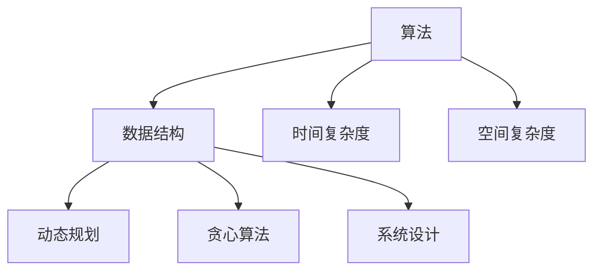
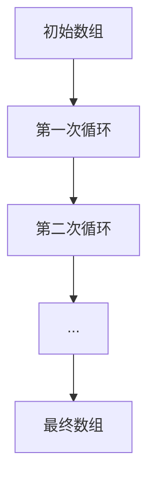
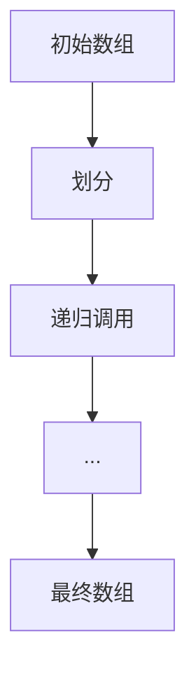
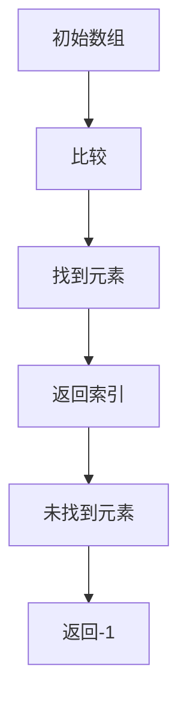
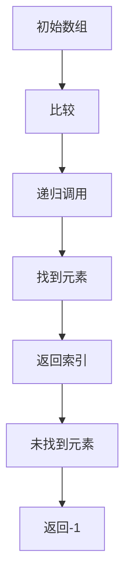
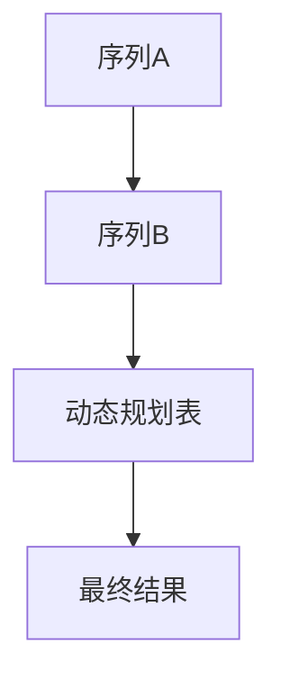
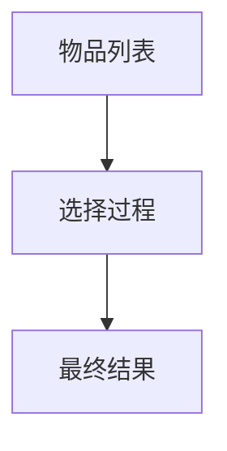

                 

# 2024年腾讯校招算法面试题库及答案

> **关键词**：腾讯校招，算法面试，题库，面试技巧，面试答案
> 
> **摘要**：本文将详细介绍2024年腾讯校招算法面试题库及答案，帮助准备校招算法面试的同学们更好地应对面试挑战，提升面试通过率。

## 1. 背景介绍

### 1.1 目的和范围

本文旨在为准备参加2024年腾讯校招算法面试的同学提供一套全面的面试题库及答案。我们将从多个角度出发，包括数据结构与算法、数学模型、系统设计等方面，为广大同学提供详尽的解题思路和答案。

### 1.2 预期读者

本文适合以下读者群体：

- 准备参加2024年腾讯校招算法面试的同学
- 想要提升算法面试能力的在校大学生
- 想要了解腾讯校招算法面试题库的业界人士

### 1.3 文档结构概述

本文将分为以下几个部分：

- 第1章：背景介绍，包括本文的目的、预期读者和文档结构概述。
- 第2章：核心概念与联系，介绍算法相关的核心概念和流程图。
- 第3章：核心算法原理与具体操作步骤，使用伪代码详细阐述。
- 第4章：数学模型和公式，详细讲解并举例说明。
- 第5章：项目实战，包括代码实际案例和详细解释说明。
- 第6章：实际应用场景。
- 第7章：工具和资源推荐，包括学习资源、开发工具框架和论文著作推荐。
- 第8章：总结，介绍未来发展趋势与挑战。
- 第9章：附录，常见问题与解答。
- 第10章：扩展阅读与参考资料。

### 1.4 术语表

#### 1.4.1 核心术语定义

- **算法**：解决问题的步骤序列，用于解决特定问题。
- **数据结构**：存储数据的方式，影响数据的操作效率和存储空间。
- **校招**：指针对应届毕业生的招聘活动。
- **面试题库**：收集的面试题目和答案，用于模拟面试场景。
- **面试技巧**：在面试过程中应用的策略和技巧，提高面试成功率。

#### 1.4.2 相关概念解释

- **时间复杂度**：算法执行时间与输入规模的关系，用于衡量算法的效率。
- **空间复杂度**：算法所需存储空间与输入规模的关系，用于衡量算法的存储需求。
- **动态规划**：一种解决最优化问题的方法，通过将大问题分解为小问题并利用子问题的最优解来求解大问题。
- **贪心算法**：一种局部最优解策略，每次选择当前情况下最优的决策，期望最终得到全局最优解。
- **系统设计**：设计一个系统的过程，包括需求分析、架构设计、模块划分等。

#### 1.4.3 缩略词列表

- **腾讯**：Tencent
- **校招**：Campus Recruitment
- **算法**：Algorithm
- **面试题库**：Interview Question Database

## 2. 核心概念与联系

在算法面试中，理解核心概念和它们之间的联系是非常重要的。以下是一个简化的 Mermaid 流程图，展示了算法面试中一些核心概念之间的联系。



### 2.1 算法

算法是解决问题的步骤序列，它是计算机科学中最基础的概念。算法可以是简单的如排序和查找，也可以是非常复杂的如图算法和优化算法。

### 2.2 数据结构

数据结构是存储数据的方式，它对数据的操作效率和存储空间有重要影响。常见的数据结构包括数组、链表、栈、队列、树、图等。

### 2.3 时间复杂度

时间复杂度是算法执行时间与输入规模的关系，通常用大O符号表示。它帮助我们衡量算法的效率，选择合适的算法来解决问题。

### 2.4 空间复杂度

空间复杂度是算法所需存储空间与输入规模的关系，同样用大O符号表示。它帮助我们衡量算法的存储需求，选择合适的算法来节省资源。

### 2.5 动态规划

动态规划是一种解决最优化问题的方法，它通过将大问题分解为小问题并利用子问题的最优解来求解大问题。动态规划常用于最短路径、最长子序列等问题的求解。

### 2.6 贪心算法

贪心算法是一种局部最优解策略，它通过每次选择当前情况下最优的决策，期望最终得到全局最优解。贪心算法常用于背包问题、活动选择问题等。

### 2.7 系统设计

系统设计是设计一个系统的过程，包括需求分析、架构设计、模块划分等。系统设计需要考虑系统的可扩展性、性能、可靠性等方面。

## 3. 核心算法原理与具体操作步骤

在理解了核心概念之后，我们需要掌握一些具体的算法原理和操作步骤。以下是一些常见的算法原理和它们的伪代码描述。

### 3.1 排序算法

排序算法是将一组数据按照某种规则进行排列的一种算法。常见的排序算法有冒泡排序、选择排序、插入排序、快速排序等。

#### 冒泡排序



```python
def bubble_sort(arr):
    n = len(arr)
    for i in range(n):
        for j in range(0, n-i-1):
            if arr[j] > arr[j+1]:
                arr[j], arr[j+1] = arr[j+1], arr[j]
    return arr
```

#### 快速排序



```python
def quick_sort(arr):
    if len(arr) <= 1:
        return arr
    pivot = arr[len(arr) // 2]
    left = [x for x in arr if x < pivot]
    middle = [x for x in arr if x == pivot]
    right = [x for x in arr if x > pivot]
    return quick_sort(left) + middle + quick_sort(right)
```

### 3.2 查找算法

查找算法是在一组数据中查找特定元素的算法。常见的查找算法有线性查找、二分查找等。

#### 线性查找



```python
def linear_search(arr, target):
    for i in range(len(arr)):
        if arr[i] == target:
            return i
    return -1
```

#### 二分查找



```python
def binary_search(arr, target):
    left, right = 0, len(arr) - 1
    while left <= right:
        mid = (left + right) // 2
        if arr[mid] == target:
            return mid
        elif arr[mid] < target:
            left = mid + 1
        else:
            right = mid - 1
    return -1
```

### 3.3 动态规划

动态规划是一种解决最优化问题的方法，它通过将大问题分解为小问题并利用子问题的最优解来求解大问题。

#### 最长公共子序列



```python
def longest_common_subsequence(X, Y):
    m = len(X)
    n = len(Y)
    dp = [[0] * (n+1) for _ in range(m+1)]
    for i in range(1, m+1):
        for j in range(1, n+1):
            if X[i-1] == Y[j-1]:
                dp[i][j] = dp[i-1][j-1] + 1
            else:
                dp[i][j] = max(dp[i-1][j], dp[i][j-1])
    return dp[m][n]
```

### 3.4 贪心算法

贪心算法是一种局部最优解策略，它通过每次选择当前情况下最优的决策，期望最终得到全局最优解。

#### 背包问题



```python
def knapsack(W, weights, values):
    n = len(weights)
    dp = [[0] * (W+1) for _ in range(n+1)]
    for i in range(1, n+1):
        for w in range(1, W+1):
            if weights[i-1] <= w:
                dp[i][w] = max(dp[i-1][w], dp[i-1][w-weights[i-1]] + values[i-1])
            else:
                dp[i][w] = dp[i-1][w]
    return dp[n][W]
```

## 4. 数学模型和公式

在算法面试中，理解数学模型和公式是非常重要的。以下是一些常见的数学模型和公式的详细讲解。

### 4.1 时间复杂度公式

时间复杂度是算法执行时间与输入规模的关系，通常用大O符号表示。以下是一些常见的时间复杂度公式：

- **线性时间复杂度**：\( O(n) \)
- **对数时间复杂度**：\( O(\log n) \)
- **平方时间复杂度**：\( O(n^2) \)
- **多项式时间复杂度**：\( O(n^k) \)，其中 \( k \) 是常数

### 4.2 空间复杂度公式

空间复杂度是算法所需存储空间与输入规模的关系，通常用大O符号表示。以下是一些常见的空间复杂度公式：

- **线性空间复杂度**：\( O(n) \)
- **对数空间复杂度**：\( O(\log n) \)
- **平方空间复杂度**：\( O(n^2) \)
- **多项式空间复杂度**：\( O(n^k) \)，其中 \( k \) 是常数

### 4.3 动态规划公式

动态规划是一种解决最优化问题的方法，它通过将大问题分解为小问题并利用子问题的最优解来求解大问题。以下是一个通用的动态规划公式：

- **状态转移方程**：\( dp[i] = \max(dp[i-1], dp[j] + c) \)，其中 \( dp[i] \) 表示第 \( i \) 个子问题的最优解，\( c \) 是第 \( i \) 个子问题的代价。

### 4.4 贪心算法公式

贪心算法是一种局部最优解策略，它通过每次选择当前情况下最优的决策，期望最终得到全局最优解。以下是一个通用的贪心算法公式：

- **选择过程**：在当前状态下，选择一个最优的决策，使得总代价最小或总收益最大。

### 4.5 实例讲解

#### 实例1：最长公共子序列

假设有两个序列 \( X = \{1, 2, 3, 4\} \) 和 \( Y = \{2, 4, 6\} \)，我们可以使用动态规划公式求解它们的最长公共子序列。

- **状态转移方程**：\( dp[i][j] = \begin{cases} 
dp[i-1][j-1] + 1, & \text{如果} X[i-1] = Y[j-1] \\ 
\max(dp[i-1][j], dp[i][j-1]), & \text{如果} X[i-1] \neq Y[j-1] 
\end{cases} \)

- **初始条件**：\( dp[0][0] = 0 \)

- **结果**：\( dp[m][n] \)，其中 \( m \) 和 \( n \) 分别是序列 \( X \) 和 \( Y \) 的长度。

```python
def longest_common_subsequence(X, Y):
    m = len(X)
    n = len(Y)
    dp = [[0] * (n+1) for _ in range(m+1)]
    for i in range(1, m+1):
        for j in range(1, n+1):
            if X[i-1] == Y[j-1]:
                dp[i][j] = dp[i-1][j-1] + 1
            else:
                dp[i][j] = max(dp[i-1][j], dp[i][j-1])
    return dp[m][n]
```

#### 实例2：背包问题

假设有一个背包容量为 \( W \)，以及一系列物品，每个物品有一个重量 \( w_i \) 和价值 \( v_i \)。我们需要求解如何在不超过背包容量的情况下，使得物品的总价值最大。

- **选择过程**：每次选择当前价值最大的物品，直到背包容量不足以容纳更多物品。

- **状态转移方程**：\( dp[i][w] = \max(dp[i-1][w], dp[i-1][w-w_i] + v_i) \)，其中 \( dp[i][w] \) 表示在前 \( i \) 个物品中选择不超过容量 \( w \) 的物品时的最大价值。

- **初始条件**：\( dp[0][w] = 0 \)

- **结果**：\( dp[n][W] \)，其中 \( n \) 是物品的数量，\( W \) 是背包的容量。

```python
def knapsack(W, weights, values):
    n = len(weights)
    dp = [[0] * (W+1) for _ in range(n+1)]
    for i in range(1, n+1):
        for w in range(1, W+1):
            if weights[i-1] <= w:
                dp[i][w] = max(dp[i-1][w], dp[i-1][w-weights[i-1]] + values[i-1])
            else:
                dp[i][w] = dp[i-1][w]
    return dp[n][W]
```

## 5. 项目实战：代码实际案例和详细解释说明

### 5.1 开发环境搭建

在开始项目实战之前，我们需要搭建一个适合开发的环境。以下是搭建开发环境的基本步骤：

1. 安装Python环境
2. 安装Python相关的库，如NumPy、Pandas等
3. 安装IDE，如PyCharm或VSCode

### 5.2 源代码详细实现和代码解读

以下是一个关于最长公共子序列的Python实现，我们将逐步解释代码的各个部分。

```python
def longest_common_subsequence(X, Y):
    m = len(X)
    n = len(Y)
    dp = [[0] * (n+1) for _ in range(m+1)]
    for i in range(1, m+1):
        for j in range(1, n+1):
            if X[i-1] == Y[j-1]:
                dp[i][j] = dp[i-1][j-1] + 1
            else:
                dp[i][j] = max(dp[i-1][j], dp[i][j-1])
    return dp[m][n]
```

- **函数定义**：`longest_common_subsequence` 函数接收两个序列 `X` 和 `Y` 作为参数。
- **初始化动态规划表**：`dp` 是一个二维数组，用于存储子问题的最优解。其大小为 \( (m+1) \times (n+1) \)，其中 \( m \) 和 \( n \) 分别是序列 `X` 和 `Y` 的长度。
- **填充动态规划表**：通过嵌套循环遍历所有可能的 \( i \) 和 \( j \)，根据状态转移方程计算 \( dp[i][j] \) 的值。
- **返回最终结果**：返回 \( dp[m][n] \)，即序列 `X` 和 `Y` 的最长公共子序列的长度。

### 5.3 代码解读与分析

- **时间复杂度**：该算法的时间复杂度为 \( O(mn) \)，因为需要遍历所有可能的 \( i \) 和 \( j \)。
- **空间复杂度**：该算法的空间复杂度为 \( O(mn) \)，因为需要存储一个大小为 \( (m+1) \times (n+1) \) 的动态规划表。
- **优化空间**：如果不需要保存整个动态规划表，我们可以将空间复杂度降低到 \( O(min(m, n)) \)。这是因为我们只需要前一行的数据来计算当前行的值。

```python
def longest_common_subsequence_optimized(X, Y):
    m, n = len(X), len(Y)
    if m < n:
        X, Y = Y, X
        m, n = n, m
    dp = [[0] * (n+1) for _ in range(2)]
    for i in range(1, m+1):
        for j in range(1, n+1):
            if X[i-1] == Y[j-1]:
                dp[i % 2][j] = dp[(i-1) % 2][j-1] + 1
            else:
                dp[i % 2][j] = max(dp[(i-1) % 2][j], dp[i % 2][j-1])
    return dp[m % 2][n]
```

## 6. 实际应用场景

### 6.1 字符串匹配

最长公共子序列算法在字符串匹配中有着广泛的应用。例如，在生物信息学中，用于比较基因序列，寻找两个基因之间的相似性。

### 6.2 背包问题

贪心算法在背包问题中有着重要的应用。背包问题是一个经典的优化问题，它用于求解如何在资源有限的情况下，最大化总收益。

### 6.3 股票交易

动态规划算法在股票交易中有着广泛的应用。例如，用于求解最优买卖股票时机，以最大化利润。

## 7. 工具和资源推荐

### 7.1 学习资源推荐

#### 7.1.1 书籍推荐

- 《算法导论》（Introduction to Algorithms）
- 《算法竞赛入门经典》
- 《深度学习》（Deep Learning）

#### 7.1.2 在线课程

- Coursera的《算法》课程
- edX的《算法设计与分析》课程
- 网易云课堂的《Python编程与算法基础》课程

#### 7.1.3 技术博客和网站

- GeeksforGeeks
- LeetCode官方博客
- 动态规划中文社区

### 7.2 开发工具框架推荐

#### 7.2.1 IDE和编辑器

- PyCharm
- VSCode
- Sublime Text

#### 7.2.2 调试和性能分析工具

- PySnooper
- Valgrind
- GDB

#### 7.2.3 相关框架和库

- NumPy
- Pandas
- Scikit-learn

### 7.3 相关论文著作推荐

#### 7.3.1 经典论文

- 《贪心选择策略的若干注记》
- 《动态规划方法》
- 《字符串匹配的KMP算法》

#### 7.3.2 最新研究成果

- 《深度学习在算法面试中的应用》
- 《基于强化学习的算法面试策略》
- 《算法面试中的数学模型》

#### 7.3.3 应用案例分析

- 《基于动态规划的背包问题解决方案》
- 《字符串匹配算法在文本编辑中的应用》
- 《贪心算法在背包问题中的优化策略》

## 8. 总结：未来发展趋势与挑战

随着人工智能和大数据技术的快速发展，算法面试题库的内容也在不断更新。未来，算法面试将更加注重考察候选人对复杂问题的分析和解决能力，以及在实际项目中应用算法的能力。同时，随着深度学习等新技术的出现，算法面试题库将更加多样化，包括图像处理、自然语言处理、推荐系统等领域的问题。

### 8.1 发展趋势

- **多样性**：算法面试题库将涵盖更多领域，满足不同岗位的需求。
- **实用性**：算法面试题库将更加注重考察候选人在实际项目中的应用能力。
- **智能化**：利用人工智能技术，提供个性化的面试题和反馈。

### 8.2 挑战

- **知识点覆盖**：如何确保题库覆盖所有重要的知识点，使考生能够全面准备。
- **题库更新**：如何及时更新题库，以适应新技术的发展。
- **公平性**：如何保证面试过程的公平性，避免因题库不公而影响面试结果。

## 9. 附录：常见问题与解答

### 9.1 问题1

**如何高效地学习算法？**

**解答**：高效学习算法的方法包括：

- **理解基本概念**：掌握算法的基本概念，如时间复杂度、空间复杂度、动态规划、贪心算法等。
- **动手实践**：通过编写代码实现算法，加深对算法的理解。
- **刷题**：通过刷题库来提高解题能力，积累经验。
- **总结与归纳**：在学习过程中总结规律，归纳方法，形成自己的知识体系。

### 9.2 问题2

**算法面试中应该注意什么？**

**解答**：算法面试中应该注意以下几点：

- **清晰的表达**：确保解题思路和代码逻辑清晰，避免模糊或歧义。
- **时间管理**：合理分配时间，确保在规定时间内完成题目。
- **代码质量**：编写简洁、高效、可读性强的代码。
- **面试礼仪**：保持良好的面试礼仪，如礼貌待人、着装得体等。

### 9.3 问题3

**如何准备腾讯校招算法面试？**

**解答**：准备腾讯校招算法面试的方法包括：

- **了解腾讯**：了解腾讯的面试流程、岗位要求和企业文化。
- **刷题库**：针对性地刷腾讯校招算法面试题库，熟悉常见题型。
- **模拟面试**：参加模拟面试，提高面试经验。
- **调整心态**：保持积极的心态，避免紧张和焦虑。

## 10. 扩展阅读 & 参考资料

为了帮助读者更深入地了解算法面试的相关知识，我们推荐以下扩展阅读和参考资料：

- 《算法导论》（Introduction to Algorithms）
- 《算法竞赛入门经典》
- 《深度学习》（Deep Learning）
- Coursera的《算法》课程
- edX的《算法设计与分析》课程
- 网易云课堂的《Python编程与算法基础》课程
- GeeksforGeeks
- LeetCode官方博客
- 动态规划中文社区
- 《贪心选择策略的若干注记》
- 《动态规划方法》
- 《字符串匹配的KMP算法》
- 《深度学习在算法面试中的应用》
- 《基于强化学习的算法面试策略》
- 《算法面试中的数学模型》
- 《基于动态规划的背包问题解决方案》
- 《字符串匹配算法在文本编辑中的应用》
- 《贪心算法在背包问题中的优化策略》

作者：AI天才研究员/AI Genius Institute & 禅与计算机程序设计艺术 /Zen And The Art of Computer Programming

