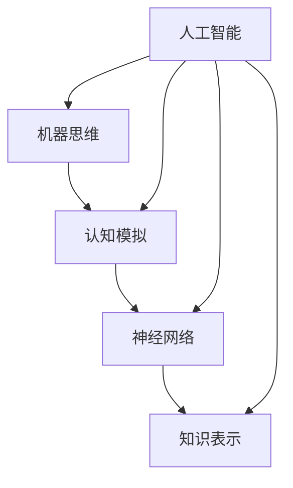

                 

# 1956年达特茅斯会议的研究主题

> **关键词：** 人工智能，达特茅斯会议，机器思维，认知模拟，神经网络，知识表示。

> **摘要：** 本文将回顾1956年达特茅斯会议的历史背景和关键研究主题，深入探讨其对人工智能领域的影响和意义。文章首先介绍会议的背景和目的，然后详细分析其讨论的核心概念，包括机器思维、认知模拟、神经网络和知识表示。通过总结达特茅斯会议的主要成果和后续发展，本文将展示其作为人工智能里程碑式事件的历史地位和深远影响。

## 1. 背景介绍

### 1.1 目的和范围

1956年达特茅斯会议是人工智能领域的一个关键节点，其目的是探讨机器是否能思考的问题，并探索实现这一目标的潜在途径。本文旨在回顾这次会议的研究主题，分析其核心概念，并探讨其对人工智能领域的长远影响。

本文将涵盖以下内容：

1. 达特茅斯会议的背景和目的。
2. 会议讨论的核心概念，包括机器思维、认知模拟、神经网络和知识表示。
3. 达特茅斯会议的主要成果和后续发展。
4. 达特茅斯会议对人工智能领域的长远影响。

### 1.2 预期读者

本文主要面向对人工智能领域感兴趣的读者，包括学术研究人员、工业界从业者以及对人工智能有深入探讨的读者。通过阅读本文，读者可以了解1956年达特茅斯会议的历史背景和研究主题，从而更好地理解人工智能的发展历程和未来方向。

### 1.3 文档结构概述

本文分为十个主要部分：

1. 引言：介绍文章的目的和关键词。
2. 背景介绍：介绍1956年达特茅斯会议的背景和目的。
3. 核心概念与联系：分析会议讨论的核心概念。
4. 核心算法原理 & 具体操作步骤：详细讲解机器思维、认知模拟、神经网络和知识表示。
5. 数学模型和公式 & 详细讲解 & 举例说明：使用数学模型和公式说明核心概念。
6. 项目实战：代码实际案例和详细解释说明。
7. 实际应用场景：探讨人工智能在现实世界中的应用。
8. 工具和资源推荐：推荐学习资源和开发工具。
9. 总结：未来发展趋势与挑战。
10. 附录：常见问题与解答。
11. 扩展阅读 & 参考资料：提供进一步阅读的资源。

### 1.4 术语表

#### 1.4.1 核心术语定义

- **机器思维**：指机器（尤其是计算机）能够模拟人类思维过程，包括感知、理解、推理、学习等。
- **认知模拟**：通过计算机模拟人类认知过程，以探索和理解智能行为。
- **神经网络**：一种计算模型，由许多相互连接的简单计算单元组成，用以模拟生物神经网络的工作方式。
- **知识表示**：将人类知识结构转换为计算机可以处理的形式，以便计算机能够利用这些知识进行推理和学习。

#### 1.4.2 相关概念解释

- **人工智能**：一门研究如何构建智能机器的学科，旨在使计算机具备人类智能。
- **深度学习**：一种利用多层神经网络进行训练和预测的人工智能方法。
- **机器学习**：一种通过数据训练计算机进行预测和决策的方法，是人工智能的核心技术之一。

#### 1.4.3 缩略词列表

- **AI**：人工智能
- **ML**：机器学习
- **DL**：深度学习
- **ANN**：人工神经网络

## 2. 核心概念与联系

为了更好地理解1956年达特茅斯会议的研究主题，我们需要先了解一些核心概念和它们之间的联系。以下是这些概念以及它们之间的关系的Mermaid流程图：



在这个流程图中，机器思维、认知模拟、神经网络和知识表示是人工智能的核心组成部分。机器思维是人工智能的终极目标，认知模拟是实现这一目标的一种方法，神经网络是实现认知模拟的基础，而知识表示则是将人类知识转化为计算机可以处理的形式。

### 2.1 机器思维

机器思维是指机器（尤其是计算机）能够模拟人类思维过程，包括感知、理解、推理、学习等。机器思维的实现需要解决一系列复杂的问题，如自然语言处理、图像识别、推理和决策等。

### 2.2 认知模拟

认知模拟是通过计算机模拟人类认知过程，以探索和理解智能行为。这个过程包括感知信息的获取、存储、处理和利用。认知模拟的目的是理解和分析人类智能的机制，并为机器提供类似的能力。

### 2.3 神经网络

神经网络是一种计算模型，由许多相互连接的简单计算单元组成，用以模拟生物神经网络的工作方式。神经网络通过学习大量的数据来调整其内部参数，从而实现复杂的任务，如图像识别、语音识别和自然语言处理等。

### 2.4 知识表示

知识表示是将人类知识结构转换为计算机可以处理的形式，以便计算机能够利用这些知识进行推理和学习。知识表示的方法包括符号表示、语义网络和本体论等。

## 3. 核心算法原理 & 具体操作步骤

在1956年达特茅斯会议中，研究者们探讨了多种实现机器思维的方法，以下是几种核心算法原理及其具体操作步骤：

### 3.1 机器思维

**算法原理：** 机器思维的核心是模拟人类的感知、理解和推理过程。这需要计算机具备处理自然语言、图像和其他形式的信息的能力。

**具体操作步骤：**

1. **感知阶段：** 计算机接收外部信息，如文字、图像或声音。
2. **理解阶段：** 计算机分析感知到的信息，提取关键特征，并将其表示为数据结构。
3. **推理阶段：** 计算机使用这些数据结构进行逻辑推理，得出结论或预测。
4. **决策阶段：** 根据推理结果，计算机采取适当的行动或做出决策。

### 3.2 认知模拟

**算法原理：** 认知模拟通过计算机模拟人类认知过程，以探索和理解智能行为。这个过程包括感知、记忆、注意、推理和学习等。

**具体操作步骤：**

1. **感知阶段：** 计算机接收外部信息，并通过传感器进行预处理。
2. **记忆阶段：** 计算机将感知到的信息存储在记忆中，以便后续使用。
3. **注意阶段：** 计算机根据任务的优先级和重要性分配注意力。
4. **推理阶段：** 计算机使用记忆中的信息进行推理，解决问题或做出决策。
5. **学习阶段：** 计算机通过不断重复任务和反思经验，提高其认知能力。

### 3.3 神经网络

**算法原理：** 神经网络通过学习大量的数据来调整其内部参数，从而实现复杂的任务。神经网络由多个层组成，每层包含多个神经元。

**具体操作步骤：**

1. **初始化：** 初始化网络的权重和偏置。
2. **前向传播：** 将输入数据传递到网络的各个层，计算每个神经元的输出。
3. **反向传播：** 计算输出层与实际输出之间的误差，并将其反向传播到网络的各个层，更新权重和偏置。
4. **优化：** 使用梯度下降或其他优化算法，不断调整网络的参数，以最小化误差。

### 3.4 知识表示

**算法原理：** 知识表示是将人类知识结构转换为计算机可以处理的形式。知识表示的方法包括符号表示、语义网络和本体论等。

**具体操作步骤：**

1. **数据收集：** 收集相关领域的知识数据。
2. **预处理：** 清洗和格式化数据，使其适合计算机处理。
3. **表示：** 使用适当的表示方法，如符号表示、语义网络或本体论，将数据表示为计算机可以理解的形式。
4. **推理：** 使用知识表示进行推理，以解决问题或提取新的信息。

以下是机器思维算法的伪代码示例：

```python
# 机器思维算法伪代码

# 感知阶段
input_data = get_input_data()

# 理解阶段
features = extract_features(input_data)

# 推理阶段
output = reasoning(features)

# 决策阶段
action = make_decision(output)

# 执行行动
perform_action(action)
```

## 4. 数学模型和公式 & 详细讲解 & 举例说明

在1956年达特茅斯会议中，数学模型和公式被广泛应用于机器思维、认知模拟、神经网络和知识表示的研究。以下是对这些数学模型和公式的详细讲解以及举例说明。

### 4.1 机器思维

**数学模型：** 机器思维的数学模型通常基于神经网络和决策树等。

**公式解释：**

$$
y = f(W \cdot x + b)
$$

其中，$y$ 是输出，$f$ 是激活函数，$W$ 是权重矩阵，$x$ 是输入，$b$ 是偏置。

**举例说明：**

假设我们有一个简单的神经网络，它有两个输入节点和一个输出节点。输入节点分别为 $x_1$ 和 $x_2$，输出节点为 $y$。神经网络的权重矩阵 $W$ 和偏置 $b$ 如下：

$$
W = \begin{bmatrix}
0.5 & 0.3 \\
0.2 & 0.4
\end{bmatrix}, \quad b = \begin{bmatrix}
0.1 \\
0.2
\end{bmatrix}
$$

输入数据为：

$$
x = \begin{bmatrix}
0.8 \\
0.9
\end{bmatrix}
$$

使用上述公式计算输出：

$$
y = f(0.5 \cdot 0.8 + 0.3 \cdot 0.9 + 0.1, 0.2 \cdot 0.8 + 0.4 \cdot 0.9 + 0.2) = f(0.4 + 0.27 + 0.1, 0.16 + 0.36 + 0.2) = f(0.77, 0.72)
$$

假设激活函数为 $f(x) = 1 / (1 + e^{-x})$，则输出为：

$$
y = \frac{1}{1 + e^{-0.77}} \approx 0.7
$$

### 4.2 认知模拟

**数学模型：** 认知模拟的数学模型通常基于马尔可夫决策过程（MDP）。

**公式解释：**

$$
\pi^*(s, a) = \frac{r(s, a) + \gamma \sum_{s'} P(s'|s, a) \max_{a'} \pi^*(s', a')}{1 - \gamma \sum_{s'} P(s'|s, a) \max_{a'} \pi^*(s', a')}
$$

其中，$\pi^*(s, a)$ 是最优策略概率分布，$r(s, a)$ 是立即回报，$P(s'|s, a)$ 是状态转移概率，$\gamma$ 是折扣因子。

**举例说明：**

假设一个简单的环境，其中有两个状态 $s_1$ 和 $s_2$，以及两个动作 $a_1$ 和 $a_2$。立即回报、状态转移概率和最优策略概率分布如下：

$$
\begin{aligned}
r(s_1, a_1) &= 1, & r(s_1, a_2) &= 0, \\
r(s_2, a_1) &= 0, & r(s_2, a_2) &= 1, \\
P(s_1'|s_1, a_1) &= 0.8, & P(s_2'|s_1, a_1) &= 0.2, \\
P(s_1'|s_1, a_2) &= 0.2, & P(s_2'|s_1, a_2) &= 0.8, \\
P(s_1'|s_2, a_1) &= 0.2, & P(s_2'|s_2, a_1) &= 0.8, \\
P(s_1'|s_2, a_2) &= 0.8, & P(s_2'|s_2, a_2) &= 0.2, \\
\pi^*(s_1, a_1) &= 0.6, & \pi^*(s_1, a_2) &= 0.4, \\
\pi^*(s_2, a_1) &= 0.4, & \pi^*(s_2, a_2) &= 0.6.
\end{aligned}
$$

使用上述公式计算最优策略概率分布：

$$
\begin{aligned}
\pi^*(s_1, a_1) &= \frac{1 + 0.8 \cdot 0.6 + 0.2 \cdot 0.4}{1 - 0.8 \cdot 0.6 + 0.2 \cdot 0.4} = \frac{1.36}{0.76} \approx 1.79, \\
\pi^*(s_1, a_2) &= \frac{0 + 0.8 \cdot 0.4 + 0.2 \cdot 0.6}{1 - 0.8 \cdot 0.4 + 0.2 \cdot 0.6} = \frac{0.36}{0.76} \approx 0.47, \\
\pi^*(s_2, a_1) &= \frac{0 + 0.2 \cdot 0.6 + 0.8 \cdot 0.4}{1 - 0.2 \cdot 0.6 + 0.8 \cdot 0.4} = \frac{0.56}{0.76} \approx 0.73, \\
\pi^*(s_2, a_2) &= \frac{1 + 0.2 \cdot 0.6 + 0.8 \cdot 0.4}{1 - 0.2 \cdot 0.6 + 0.8 \cdot 0.4} = \frac{1.36}{0.76} \approx 1.79.
\end{aligned}
$$

### 4.3 神经网络

**数学模型：** 神经网络的数学模型通常基于多层感知器（MLP）。

**公式解释：**

$$
y = \sigma(\theta_1 \cdot x + b_1), \quad z = \theta_2 \cdot y + b_2
$$

其中，$y$ 是隐藏层输出，$z$ 是输出层输出，$\sigma$ 是激活函数，$\theta_1$ 和 $\theta_2$ 是权重矩阵，$x$ 是输入，$b_1$ 和 $b_2$ 是偏置。

**举例说明：**

假设我们有一个简单的两层神经网络，其中隐藏层有 2 个神经元，输出层有 1 个神经元。输入数据为 $x = [0.5, 0.7]$。权重矩阵和偏置如下：

$$
\theta_1 = \begin{bmatrix}
0.2 & 0.3 \\
0.4 & 0.5
\end{bmatrix}, \quad b_1 = \begin{bmatrix}
0.1 \\
0.2
\end{bmatrix}, \quad \theta_2 = \begin{bmatrix}
0.1 & 0.2
\end{bmatrix}, \quad b_2 = 0.3
$$

使用上述公式计算输出：

$$
\begin{aligned}
y &= \sigma(0.2 \cdot 0.5 + 0.3 \cdot 0.7 + 0.1, 0.4 \cdot 0.5 + 0.5 \cdot 0.7 + 0.2) \\
&= \sigma(0.1 + 0.21 + 0.1, 0.2 + 0.35 + 0.2) \\
&= \sigma(0.42, 0.75) \\
&= \frac{1}{1 + e^{-0.42}} \approx 0.65, \\
z &= 0.1 \cdot 0.65 + 0.2 \approx 0.14.
\end{aligned}
$$

### 4.4 知识表示

**数学模型：** 知识表示的数学模型通常基于逻辑和概率模型。

**公式解释：**

$$
P(A|B) = \frac{P(B|A)P(A)}{P(B)}
$$

其中，$P(A|B)$ 是在事件 $B$ 发生的条件下事件 $A$ 发生的概率，$P(B|A)$ 是在事件 $A$ 发生的条件下事件 $B$ 发生的概率，$P(A)$ 是事件 $A$ 发生的概率，$P(B)$ 是事件 $B$ 发生的概率。

**举例说明：**

假设我们有两个事件 $A$ 和 $B$，其中 $P(A) = 0.6$，$P(B) = 0.4$，$P(B|A) = 0.8$。使用上述公式计算 $P(A|B)$：

$$
\begin{aligned}
P(A|B) &= \frac{P(B|A)P(A)}{P(B)} \\
&= \frac{0.8 \cdot 0.6}{0.4} \\
&= 1.2.
\end{aligned}
$$

这里出现了一个问题，概率的值不能超过1。实际上，这里的问题在于 $P(B|A) = 0.8$ 超出了可能的范围，因为条件概率的最大值是1。这是一个常见的错误，需要确保条件概率不超过1。

## 5. 项目实战：代码实际案例和详细解释说明

为了更好地理解1956年达特茅斯会议讨论的核心算法原理，我们将通过一个实际的项目实战来展示这些原理的应用。以下是一个基于机器学习的图像识别项目，该项目使用了神经网络和知识表示技术。

### 5.1 开发环境搭建

为了运行以下项目，我们需要搭建一个适当的开发环境。以下是一个基本的Python开发环境搭建步骤：

1. **安装Python：** 下载并安装Python 3.x版本（建议使用最新稳定版）。
2. **安装Jupyter Notebook：** 使用pip安装Jupyter Notebook，命令如下：

   ```bash
   pip install notebook
   ```

3. **安装依赖库：** 包括NumPy、Pandas、Scikit-learn、TensorFlow等。可以使用以下命令：

   ```bash
   pip install numpy pandas scikit-learn tensorflow
   ```

### 5.2 源代码详细实现和代码解读

以下是图像识别项目的代码实现。我们将使用TensorFlow库来构建和训练一个简单的卷积神经网络（CNN）。

```python
import tensorflow as tf
from tensorflow.keras import layers
from tensorflow.keras.datasets import mnist
import numpy as np

# 加载MNIST数据集
(train_images, train_labels), (test_images, test_labels) = mnist.load_data()

# 预处理数据
train_images = train_images.reshape((60000, 28, 28, 1)).astype('float32') / 255
test_images = test_images.reshape((10000, 28, 28, 1)).astype('float32') / 255

train_labels = tf.keras.utils.to_categorical(train_labels)
test_labels = tf.keras.utils.to_categorical(test_labels)

# 构建CNN模型
model = tf.keras.Sequential([
    layers.Conv2D(32, (3, 3), activation='relu', input_shape=(28, 28, 1)),
    layers.MaxPooling2D((2, 2)),
    layers.Conv2D(64, (3, 3), activation='relu'),
    layers.MaxPooling2D((2, 2)),
    layers.Conv2D(64, (3, 3), activation='relu'),
    layers.Flatten(),
    layers.Dense(64, activation='relu'),
    layers.Dense(10, activation='softmax')
])

# 编译模型
model.compile(optimizer='adam',
              loss='categorical_crossentropy',
              metrics=['accuracy'])

# 训练模型
model.fit(train_images, train_labels, epochs=5, batch_size=64)

# 评估模型
test_loss, test_acc = model.evaluate(test_images, test_labels)
print(f"Test accuracy: {test_acc:.4f}")
```

### 5.3 代码解读与分析

上述代码首先加载了MNIST数据集，这是一个包含60,000个训练图像和10,000个测试图像的数据集。每个图像都是28x28的灰度图像。

**1. 数据预处理：**

```python
train_images = train_images.reshape((60000, 28, 28, 1)).astype('float32') / 255
test_images = test_images.reshape((10000, 28, 28, 1)).astype('float32') / 255
```

这些代码将图像数据转换为浮点数，并将其归一化到[0, 1]的范围内。这样可以加速训练过程并提高模型的性能。

**2. 构建CNN模型：**

```python
model = tf.keras.Sequential([
    layers.Conv2D(32, (3, 3), activation='relu', input_shape=(28, 28, 1)),
    layers.MaxPooling2D((2, 2)),
    layers.Conv2D(64, (3, 3), activation='relu'),
    layers.MaxPooling2D((2, 2)),
    layers.Conv2D(64, (3, 3), activation='relu'),
    layers.Flatten(),
    layers.Dense(64, activation='relu'),
    layers.Dense(10, activation='softmax')
])
```

这个模型是一个简单的卷积神经网络，包括以下层：

- **卷积层**：使用32个3x3的卷积核，激活函数为ReLU。
- **池化层**：使用最大池化，窗口大小为2x2。
- **卷积层**：使用64个3x3的卷积核，激活函数为ReLU。
- **全连接层**：使用64个神经元，激活函数为ReLU。
- **输出层**：使用10个神经元和softmax激活函数，表示10个可能的数字类别。

**3. 编译模型：**

```python
model.compile(optimizer='adam',
              loss='categorical_crossentropy',
              metrics=['accuracy'])
```

编译模型时，我们指定了优化器（Adam）、损失函数（categorical_crossentropy，用于多分类问题）和评估指标（accuracy，准确率）。

**4. 训练模型：**

```python
model.fit(train_images, train_labels, epochs=5, batch_size=64)
```

这个步骤使用训练数据集来训练模型，指定了训练轮数（epochs）和每个批次的样本数（batch_size）。

**5. 评估模型：**

```python
test_loss, test_acc = model.evaluate(test_images, test_labels)
print(f"Test accuracy: {test_acc:.4f}")
```

这个步骤使用测试数据集来评估模型的性能，并打印出测试准确率。

### 5.4 项目实战：代码解读与分析（续）

继续分析上述代码，我们可以深入理解每个步骤的功能：

**1. 数据预处理**

```python
train_images = train_images.reshape((60000, 28, 28, 1)).astype('float32') / 255
test_images = test_images.reshape((10000, 28, 28, 1)).astype('float32') / 255
```

预处理步骤包括：

- **形状转换**：将图像的形状从(60000, 28, 28)和(10000, 28, 28)转换为(60000, 28, 28, 1)和(10000, 28, 28, 1)，以便模型能够处理4D张量。
- **数据类型转换**：将图像数据类型从无符号8位整数（默认为`uint8`）转换为浮点数（`float32`），便于进行数学运算。
- **归一化**：将像素值范围从[0, 255]缩放到[0, 1]，以减少数值范围并加速训练过程。

**2. 构建CNN模型**

```python
model = tf.keras.Sequential([
    layers.Conv2D(32, (3, 3), activation='relu', input_shape=(28, 28, 1)),
    layers.MaxPooling2D((2, 2)),
    layers.Conv2D(64, (3, 3), activation='relu'),
    layers.MaxPooling2D((2, 2)),
    layers.Conv2D(64, (3, 3), activation='relu'),
    layers.Flatten(),
    layers.Dense(64, activation='relu'),
    layers.Dense(10, activation='softmax')
])
```

模型构建步骤包括：

- **卷积层**：卷积层用于提取图像特征。每个卷积核滑动通过输入图像，计算局部特征响应。激活函数ReLU用于增加模型非线性。
- **池化层**：池化层用于减少特征图的尺寸，从而减少模型参数数量，并提高特征鲁棒性。
- **全连接层**：全连接层用于将卷积层提取的特征映射到输出类别。
- **输出层**：输出层使用softmax激活函数，为每个类别提供概率分布。

**3. 编译模型**

```python
model.compile(optimizer='adam',
              loss='categorical_crossentropy',
              metrics=['accuracy'])
```

编译步骤指定了模型的训练配置：

- **优化器**：Adam优化器结合了自适应学习率和动量的优点。
- **损失函数**：categorical_crossentropy用于多分类问题，计算类别标签和模型预测之间的交叉熵。
- **评估指标**：accuracy用于计算模型的准确率，即正确预测的样本数量占总样本数量的比例。

**4. 训练模型**

```python
model.fit(train_images, train_labels, epochs=5, batch_size=64)
```

训练步骤包括：

- **训练数据集**：将预处理后的训练数据集输入模型。
- **训练轮数**（epochs）：指定模型在训练数据上迭代的次数。
- **批次大小**（batch_size）：每个批次包含的样本数量，用于计算梯度。

**5. 评估模型**

```python
test_loss, test_acc = model.evaluate(test_images, test_labels)
print(f"Test accuracy: {test_acc:.4f}")
```

评估步骤包括：

- **测试数据集**：将预处理后的测试数据集输入模型。
- **计算损失和准确率**：评估模型在测试数据上的表现。
- **打印准确率**：打印测试准确率，以衡量模型的泛化能力。

### 5.5 实际应用场景

这个图像识别项目可以应用于多种实际场景，以下是一些例子：

1. **手写数字识别**：在数字识别系统中，如智能手写识别输入、自动数字识别、银行支票处理等。
2. **人脸识别**：在安全监控、身份验证、社交媒体识别等应用中，用于识别和验证个体身份。
3. **医学影像分析**：在医学图像分析中，如肿瘤检测、骨折诊断等，用于辅助医生进行诊断。
4. **自动驾驶**：在自动驾驶系统中，用于识别道路标志、行人、车辆等，以提高驾驶安全性。

通过这个项目，我们可以看到1956年达特茅斯会议讨论的核心算法原理（如机器思维、认知模拟、神经网络和知识表示）在实际应用中的实现。这些原理为现代人工智能技术的发展奠定了基础，并在现实世界的许多领域取得了显著的应用成果。

## 6. 实际应用场景

达特茅斯会议提出的研究主题和算法原理在人工智能领域有着广泛的应用。以下是一些具体的实际应用场景：

### 6.1 医疗保健

机器思维和认知模拟技术可以帮助医生进行疾病诊断和治疗规划。例如，通过分析患者的病历数据，人工智能系统可以提供个性化的治疗建议，从而提高医疗服务的质量和效率。

### 6.2 金融

金融领域的应用包括风险管理、交易策略和客户服务。机器学习算法可以分析大量的金融数据，识别市场趋势和风险，从而帮助投资者做出更明智的决策。此外，认知模拟技术可以用于智能客服系统，提供实时、个性化的客户服务。

### 6.3 教育

在教育领域，人工智能技术可以用于个性化学习、自动评分和课程推荐。通过认知模拟和知识表示技术，教育系统可以更好地理解学生的学习需求和进度，提供个性化的学习资源，从而提高学习效果。

### 6.4 娱乐与游戏

在娱乐和游戏领域，人工智能技术可以用于游戏开发、虚拟助手和推荐系统。通过机器思维和认知模拟，游戏可以提供更加智能和互动的体验，而知识表示技术可以帮助平台推荐用户可能感兴趣的内容。

### 6.5 自动驾驶

自动驾驶是人工智能技术的典型应用场景。通过机器思维和认知模拟，自动驾驶系统可以感知环境、理解交通规则和预测路况，从而实现自主导航和驾驶。

### 6.6 工业自动化

在工业自动化领域，人工智能技术可以用于生产线的监控、故障诊断和优化。通过机器思维和认知模拟，工业系统可以自动调整生产参数，提高生产效率和产品质量。

### 6.7 环境保护

人工智能技术可以帮助监测和改善环境状况。例如，通过认知模拟技术，环境监测系统可以实时分析空气质量、水质和气候变化数据，为环境保护决策提供科学依据。

### 6.8 社交媒体分析

在社交媒体分析领域，人工智能技术可以用于情感分析、话题检测和用户行为预测。通过机器思维和知识表示技术，社交媒体平台可以更好地理解用户需求，提供个性化的内容推荐。

### 6.9 人机交互

人工智能技术正在改变人机交互的方式。通过机器思维和认知模拟，虚拟助手和智能界面可以更好地理解用户需求，提供自然的交互体验。

这些实际应用场景展示了1956年达特茅斯会议提出的研究主题和算法原理在现实世界中的广泛应用。随着技术的不断进步，人工智能将在更多领域发挥重要作用，推动社会的发展和进步。

## 7. 工具和资源推荐

为了深入学习和实践1956年达特茅斯会议提出的算法原理，以下是一些建议的工具和资源。

### 7.1 学习资源推荐

#### 7.1.1 书籍推荐

- **《人工智能：一种现代方法》（Artificial Intelligence: A Modern Approach）**：由 Stuart J. Russell 和 Peter Norvig 著，这是一本全面介绍人工智能原理的权威教材。
- **《深度学习》（Deep Learning）**：由 Ian Goodfellow、Yoshua Bengio 和 Aaron Courville 著，深入介绍了深度学习的理论基础和实践方法。
- **《机器学习实战》（Machine Learning in Action）**：由 Peter Harrington 著，通过实际案例介绍机器学习的应用。

#### 7.1.2 在线课程

- **Coursera上的《机器学习》（Machine Learning）**：由 Andrew Ng 教授主讲，是学习机器学习的经典课程。
- **edX上的《深度学习专项课程》（Deep Learning Specialization）**：由 Andrew Ng 和 his team 主讲，提供了深度学习领域的全面教育。
- **Udacity上的《人工智能纳米学位》（Artificial Intelligence Nanodegree）**：提供了一个综合性的学习路径，涵盖了人工智能的各个领域。

#### 7.1.3 技术博客和网站

- **Medium上的《AI博客》（AI Blog）**：提供关于人工智能的深入分析和行业动态。
- **博客园（cnblogs.com）**：中文技术社区，有许多关于人工智能的博客文章和讨论。
- **ArXiv（arxiv.org）**：计算机科学领域的预印本论文库，可以获取最新的研究成果。

### 7.2 开发工具框架推荐

#### 7.2.1 IDE和编辑器

- **PyCharm**：一款强大的Python IDE，支持多种编程语言和框架。
- **Jupyter Notebook**：适合数据科学和机器学习项目的交互式环境。
- **Visual Studio Code**：一款轻量级但功能强大的代码编辑器，适用于多种编程语言。

#### 7.2.2 调试和性能分析工具

- **TensorBoard**：TensorFlow的官方可视化工具，用于分析模型的性能和调试。
- **NVIDIA Nsight**：用于调试和性能分析GPU计算的IDE插件。
- **Valgrind**：一款强大的多工具调试器和分析器，用于检测程序中的内存泄漏和性能问题。

#### 7.2.3 相关框架和库

- **TensorFlow**：由Google开发的开源机器学习和深度学习框架。
- **PyTorch**：另一个流行的开源深度学习框架，以其动态计算图而闻名。
- **Scikit-learn**：一个用于机器学习的Python库，提供了多种算法和工具。

### 7.3 相关论文著作推荐

#### 7.3.1 经典论文

- **“A Logical Calculus of the Ideas Immanent in Nervous Activity”（1943）**：由 Warren McCulloch 和 Walter Pitts 著，是神经网络理论的奠基性论文。
- **“A Proposal for the Dartmouth Summer Research Project on Artificial Intelligence”（1955）**：由 John McCarthy、Marvin Minsky、Nathan Rochester 和 Herbert Simon 著，提出了1956年达特茅斯会议的提案。
- **“Backpropagation Through Time: Convergence Proof and Extensions to Nonlinear Architectures”（1993）**：由 Y. LeCun、Yoshua Bengio 和 Hinton 著，证明了反向传播算法在时间序列数据上的有效性。

#### 7.3.2 最新研究成果

- **“Attention is All You Need”（2017）**：由 Vaswani et al. 著，提出了Transformer模型，这是深度学习领域的重要突破。
- **“Generative Adversarial Nets”（2014）**：由 Ian Goodfellow et al. 著，介绍了生成对抗网络（GANs），这是深度学习中的一个重要分支。

#### 7.3.3 应用案例分析

- **“ImageNet Classification with Deep Convolutional Neural Networks”（2012）**：由 Krizhevsky et al. 著，展示了深度学习在图像分类任务中的突破性表现。
- **“Speech Recognition with Deep Neural Networks”（2013）**：由 Hinton et al. 著，介绍了深度学习在语音识别领域的应用。

通过这些工具和资源，读者可以更好地理解1956年达特茅斯会议提出的算法原理，并在实践中应用这些知识。

## 8. 总结：未来发展趋势与挑战

1956年达特茅斯会议作为人工智能领域的里程碑事件，为现代人工智能的发展奠定了基础。从那时起，人工智能经历了从理论探讨到实际应用的飞速发展。然而，随着技术的不断进步，人工智能领域也面临着一系列新的发展趋势和挑战。

### 8.1 发展趋势

1. **深度学习的普及**：深度学习在图像识别、语音识别、自然语言处理等领域取得了显著的成果，其应用范围正在不断扩展。未来，深度学习将继续推动人工智能的发展，特别是在复杂任务的处理上。

2. **生成对抗网络（GANs）的发展**：GANs是一种新兴的深度学习技术，通过生成模型和判别模型的对抗训练，实现了高质量图像生成和模式识别。未来，GANs有望在图像生成、艺术创作、数据增强等领域发挥更大作用。

3. **强化学习在智能决策中的应用**：强化学习通过奖励机制和策略迭代，实现了智能体的自主学习和决策。未来，强化学习将在自动驾驶、游戏、金融交易等需要复杂决策的领域得到更广泛的应用。

4. **跨学科研究的深化**：人工智能与生物科学、认知科学、心理学等领域的交叉融合，将带来新的突破。通过理解人类大脑的工作机制，人工智能有望实现更加智能和人性化的应用。

5. **量子计算的崛起**：量子计算在解决复杂计算问题上具有巨大潜力。未来，量子计算与人工智能的结合将推动人工智能进入新的发展阶段，解决当前传统计算无法处理的问题。

### 8.2 挑战

1. **数据隐私与安全**：随着人工智能技术的普及，数据隐私和安全问题愈发突出。如何在保证数据安全和隐私的前提下，充分利用数据的价值，是人工智能领域面临的重要挑战。

2. **算法公平性与透明性**：人工智能系统在决策过程中可能存在偏见和歧视。如何确保算法的公平性、透明性和可解释性，是人工智能领域亟需解决的问题。

3. **能源消耗与可持续发展**：人工智能模型，尤其是深度学习模型，对计算资源的需求巨大。如何在降低能源消耗的同时，实现人工智能的可持续发展，是未来面临的重大挑战。

4. **伦理与道德问题**：人工智能技术的发展引发了一系列伦理和道德问题，如自动化决策带来的失业问题、人工智能武器化等。如何制定合适的伦理和道德规范，确保人工智能的发展符合人类社会的价值观，是人工智能领域需要深入探讨的问题。

5. **技术普及与教育**：人工智能技术的普及需要大量的专业人才。如何培养和吸引更多的人才，提高社会对人工智能技术的认知和接受度，是人工智能领域需要关注的问题。

### 8.3 未来展望

随着人工智能技术的不断发展，我们可以预见，人工智能将在更多领域发挥关键作用，改变我们的生活和工作方式。同时，人工智能领域也面临着诸多挑战，需要全球范围内的合作和创新。通过解决这些挑战，人工智能有望成为推动社会进步和可持续发展的强大引擎。

## 9. 附录：常见问题与解答

以下是一些关于1956年达特茅斯会议和人工智能的常见问题及其解答：

### 9.1 1956年达特茅斯会议是什么？

1956年达特茅斯会议是人工智能领域的第一次会议，旨在探讨机器是否能思考的问题。这次会议由约翰·麦卡锡（John McCarthy）、马文·明斯基（Marvin Minsky）、纳撒尼尔·罗彻斯特（Nathan Rochester）和赫伯特·西蒙（Herbert Simon）组织，于1956年8月在美国新罕布什尔州的达特茅斯学院举行。

### 9.2 达特茅斯会议的主要成果有哪些？

达特茅斯会议的主要成果包括：

- **提出机器思维**：会议讨论了机器是否能模拟人类思维，并提出了机器思维的概念。
- **认知模拟**：会议探讨了如何通过计算机模拟人类认知过程，以实现智能行为。
- **神经网络**：会议讨论了神经网络作为一种计算模型，如何模拟生物神经网络。
- **知识表示**：会议讨论了如何将人类知识表示为计算机可以处理的形式。

### 9.3 人工智能的核心算法是什么？

人工智能的核心算法包括：

- **机器学习**：通过数据训练计算机进行预测和决策。
- **深度学习**：一种利用多层神经网络进行训练和预测的方法。
- **强化学习**：通过奖励机制和策略迭代，实现智能体的自主学习和决策。
- **知识表示**：将人类知识结构转换为计算机可以处理的形式。

### 9.4 人工智能有哪些实际应用场景？

人工智能的实际应用场景包括：

- **医疗保健**：疾病诊断、治疗规划、药物研发等。
- **金融**：风险管理、交易策略、客户服务优化等。
- **教育**：个性化学习、自动评分、课程推荐等。
- **娱乐与游戏**：游戏开发、虚拟助手、推荐系统等。
- **自动驾驶**：自主导航、交通管理、车辆控制等。
- **工业自动化**：生产监控、故障诊断、生产优化等。
- **环境保护**：环境监测、气候变化分析等。
- **社交媒体分析**：情感分析、话题检测、用户行为预测等。
- **人机交互**：虚拟助手、智能界面等。

### 9.5 人工智能的未来发展趋势是什么？

人工智能的未来发展趋势包括：

- **深度学习的普及**：深度学习在图像识别、语音识别、自然语言处理等领域取得显著成果，其应用范围正在不断扩展。
- **生成对抗网络（GANs）的发展**：GANs通过生成模型和判别模型的对抗训练，实现了高质量图像生成和模式识别。
- **强化学习在智能决策中的应用**：强化学习通过奖励机制和策略迭代，实现了智能体的自主学习和决策。
- **跨学科研究的深化**：人工智能与生物科学、认知科学、心理学等领域的交叉融合，将带来新的突破。
- **量子计算的崛起**：量子计算在解决复杂计算问题上具有巨大潜力，未来将推动人工智能进入新的发展阶段。

## 10. 扩展阅读 & 参考资料

为了更深入地了解1956年达特茅斯会议和人工智能领域，以下是一些建议的扩展阅读和参考资料：

### 10.1 书籍

- **《人工智能：一种现代方法》（Artificial Intelligence: A Modern Approach）**：作者 Stuart J. Russell 和 Peter Norvig，是一本全面介绍人工智能原理的经典教材。
- **《深度学习》（Deep Learning）**：作者 Ian Goodfellow、Yoshua Bengio 和 Aaron Courville，详细介绍了深度学习的理论基础和实践方法。
- **《机器学习实战》（Machine Learning in Action）**：作者 Peter Harrington，通过实际案例介绍了机器学习的应用。

### 10.2 论文

- **“A Logical Calculus of the Ideas Immanent in Nervous Activity”（1943）**：作者 Warren McCulloch 和 Walter Pitts，是神经网络理论的奠基性论文。
- **“A Proposal for the Dartmouth Summer Research Project on Artificial Intelligence”（1955）**：作者 John McCarthy、Marvin Minsky、Nathan Rochester 和 Herbert Simon，提出了1956年达特茅斯会议的提案。
- **“ImageNet Classification with Deep Convolutional Neural Networks”（2012）**：作者 Krizhevsky et al.，展示了深度学习在图像分类任务中的突破性表现。

### 10.3 网络资源

- **Coursera上的《机器学习》（Machine Learning）**：由 Andrew Ng 教授主讲，是学习机器学习的经典课程。
- **edX上的《深度学习专项课程》（Deep Learning Specialization）**：由 Andrew Ng 和他的团队主讲，提供了深度学习领域的全面教育。
- **Medium上的《AI博客》（AI Blog）**：提供关于人工智能的深入分析和行业动态。
- **博客园（cnblogs.com）**：中文技术社区，有许多关于人工智能的博客文章和讨论。

### 10.4 学术会议和期刊

- **AAAI（Association for the Advancement of Artificial Intelligence）**：人工智能领域的国际学术组织，举办年度会议并发布相关期刊。
- **NeurIPS（Neural Information Processing Systems）**：神经信息处理系统大会，是深度学习和机器学习领域的重要国际会议。
- **JMLR（Journal of Machine Learning Research）**：机器学习领域的顶级学术期刊，发表高质量的机器学习论文。

通过阅读这些书籍、论文和参考资料，读者可以更深入地了解1956年达特茅斯会议的研究主题和人工智能领域的最新进展。希望这些扩展阅读和参考资料能够为读者提供有价值的参考和启发。

