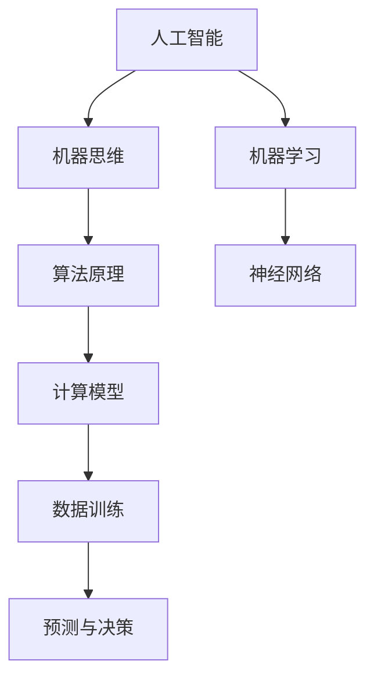
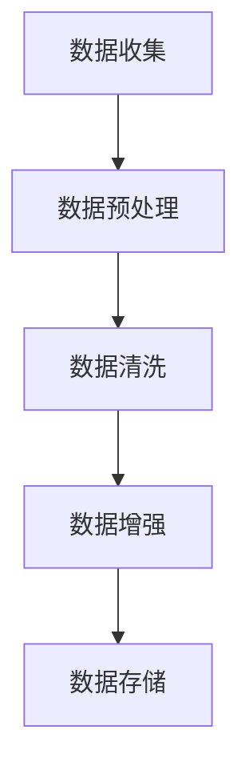
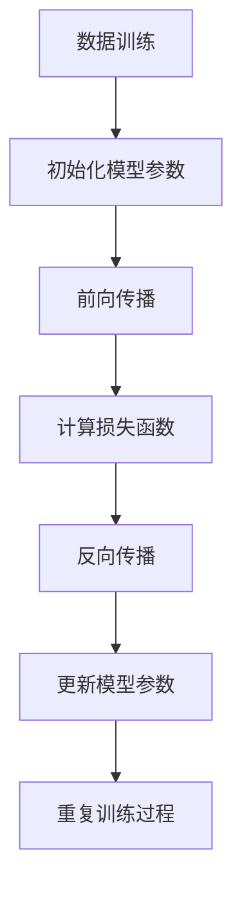
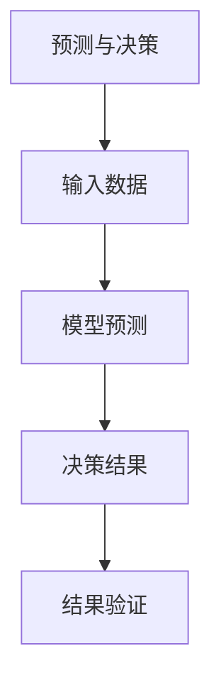
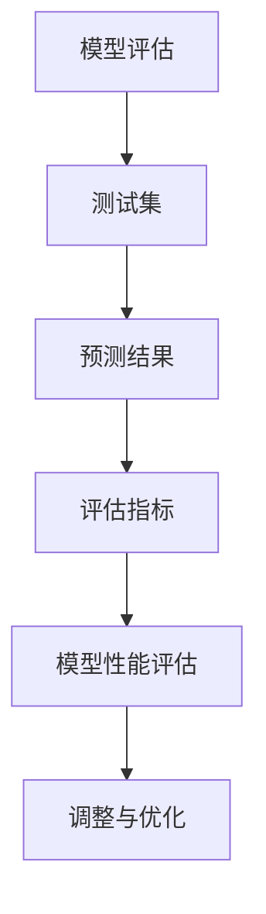

                 

### 1956年达特茅斯会议的豪迈宣言

> 关键词：人工智能，达特茅斯会议，人工智能发展历程，机器思维，算法原理

1956年，一场名为“达特茅斯会议”的盛会，在美丽的美国新罕布什尔州的达特茅斯学院拉开帷幕。这场会议聚集了一批杰出的学者、工程师和研究人员，他们在讨论中提出了一个豪迈的宣言：“我们应该使得机器能够在接下来的十年内能够做到人所能做的一切事情。”这个宣言不仅成为人工智能（AI）历史上的一个重要里程碑，也开启了一个全新的时代。

本文将深入探讨达特茅斯会议的背景、核心观点以及其对人工智能发展的影响，通过逻辑清晰的步骤，分析其中的核心概念与原理，并探讨未来的发展趋势与挑战。

### 摘要

达特茅斯会议是人工智能历史上的一个关键事件，它提出了“机器思维”的概念，并宣告了人工智能研究的正式开始。会议的核心观点包括通过算法和计算模型实现机器智能，并通过大量数据训练来实现这一目标。本文将详细阐述这些核心观点，分析其中的原理和步骤，并通过具体案例来说明其应用。此外，本文还将讨论人工智能的未来发展趋势与面临的挑战。

## 1. 背景介绍

### 1.1 目的和范围

本文旨在回顾1956年达特茅斯会议的历史背景，分析其提出的关键观点和核心算法原理，并探讨其对人工智能（AI）领域的影响。通过详细的步骤分析，本文将帮助读者理解达特茅斯会议的重要性，以及其对现代人工智能研究的启示。

### 1.2 预期读者

本文主要面向对人工智能感兴趣的读者，包括计算机科学专业的学生、研究人员、工程师以及对人工智能技术感兴趣的普通读者。无论您是刚刚入门的新手，还是对人工智能已有一定了解的专业人士，本文都将为您提供一个全面且深入的了解。

### 1.3 文档结构概述

本文结构如下：

- **背景介绍**：介绍达特茅斯会议的历史背景和目的。
- **核心概念与联系**：通过Mermaid流程图展示核心概念和联系。
- **核心算法原理 & 具体操作步骤**：使用伪代码详细阐述算法原理和操作步骤。
- **数学模型和公式 & 详细讲解 & 举例说明**：使用LaTeX格式讲解数学模型和公式，并给出具体例子。
- **项目实战：代码实际案例和详细解释说明**：通过实际代码案例展示算法的应用。
- **实际应用场景**：探讨人工智能在现代社会的各种应用。
- **工具和资源推荐**：推荐相关学习资源和开发工具。
- **总结：未来发展趋势与挑战**：分析人工智能的未来趋势和面临的挑战。
- **附录：常见问题与解答**：回答读者可能遇到的常见问题。
- **扩展阅读 & 参考资料**：提供进一步阅读的建议和参考资料。

### 1.4 术语表

在本文中，我们将使用以下术语：

- **人工智能**：通过计算机程序实现的人类智能的模拟。
- **机器思维**：机器具有的类似人类的认知和推理能力。
- **算法**：解决问题的步骤和规则。
- **神经网络**：模拟人脑结构的计算模型。
- **机器学习**：通过数据训练算法，使其能够进行预测和决策。

#### 1.4.1 核心术语定义

- **达特茅斯会议**：1956年在达特茅斯学院举办的一场会议，标志着人工智能研究的正式开始。
- **机器思维**：机器模仿人类认知和推理过程的能力。
- **算法原理**：算法实现智能的核心原理。

#### 1.4.2 相关概念解释

- **人工智能**：人工智能是指通过计算机程序实现的人类智能的模拟。其目标是使机器能够执行复杂任务，如语音识别、图像处理和自然语言理解。
- **机器学习**：机器学习是人工智能的一个分支，通过从数据中学习规律和模式，使机器能够进行预测和决策。
- **神经网络**：神经网络是一种模拟人脑结构的计算模型，通过大量的节点和连接进行数据处理和推理。

#### 1.4.3 缩略词列表

- **AI**：人工智能
- **ML**：机器学习
- **NN**：神经网络

## 2. 核心概念与联系

在探讨1956年达特茅斯会议的核心观点之前，我们首先需要了解一些核心概念和它们之间的联系。这些概念包括人工智能、机器思维、算法原理等。下面我们将使用Mermaid流程图来展示这些核心概念及其相互关系。



在这个流程图中，我们可以看到：

- **人工智能（AI）** 是一个整体概念，它包括机器思维和机器学习。
- **机器思维** 是指机器模仿人类认知和推理过程的能力，它是人工智能的核心。
- **算法原理** 是实现机器智能的基础，它包括计算模型和数据训练。
- **机器学习** 是人工智能的一个分支，它通过从数据中学习规律和模式来实现预测和决策。
- **神经网络** 是一种模拟人脑结构的计算模型，它在机器学习中起着核心作用。

通过这个流程图，我们可以更清晰地理解人工智能、机器思维、算法原理之间的关系，以及它们在实现机器智能过程中的作用。

### 3. 核心算法原理 & 具体操作步骤

在1956年达特茅斯会议上，与会者提出了通过算法和计算模型实现机器智能的核心观点。这一观点基于以下几个关键步骤：

#### 3.1 数据收集

首先，我们需要收集大量的数据。这些数据可以是结构化的（如表格数据），也可以是非结构化的（如图像和文本）。数据收集的目的是为了训练算法，使其能够学习和识别模式。



在这个步骤中，我们通过以下操作来处理数据：

- **数据预处理**：将数据转换为适合算法处理的格式。
- **数据清洗**：删除或更正错误数据，确保数据质量。
- **数据增强**：通过生成新的数据样本来丰富数据集。
- **数据存储**：将处理后的数据存储在数据库或数据湖中，以便后续使用。

#### 3.2 数据训练

接下来，我们使用收集到的数据来训练算法。这一步骤通常涉及以下过程：



- **初始化模型参数**：设定模型的初始参数值。
- **前向传播**：将输入数据通过模型进行计算，得到预测结果。
- **计算损失函数**：计算预测结果与实际结果之间的差距，即损失。
- **反向传播**：通过梯度下降等优化算法更新模型参数，减小损失。
- **更新模型参数**：根据反向传播的结果调整模型参数。
- **重复训练过程**：不断重复上述步骤，直到模型性能达到预期。

#### 3.3 预测与决策

一旦模型训练完成，我们可以使用它来进行预测和决策。这一步骤通常涉及以下操作：



- **输入数据**：将新的数据输入到训练好的模型中。
- **模型预测**：使用训练好的模型进行预测，得到预测结果。
- **决策结果**：根据预测结果进行决策。
- **结果验证**：验证决策结果是否正确，并对模型进行调整和优化。

#### 3.4 模型评估

最后，我们需要对模型进行评估，以确定其性能是否达到预期。这一步骤通常涉及以下过程：



- **测试集**：使用独立的测试集对模型进行测试。
- **预测结果**：使用测试集数据预测结果。
- **评估指标**：计算模型预测结果的评估指标，如准确率、召回率等。
- **模型性能评估**：根据评估指标评估模型性能。
- **调整与优化**：根据评估结果对模型进行调整和优化。

通过上述步骤，我们可以实现机器智能的核心算法。这些步骤不仅体现了算法原理，还展示了具体的操作步骤。接下来，我们将通过具体的例子来进一步阐述这些步骤。

### 4. 数学模型和公式 & 详细讲解 & 举例说明

在人工智能领域，数学模型和公式是理解算法原理和实现关键步骤的基础。在本节中，我们将详细讲解一些关键的数学模型和公式，并使用LaTeX格式进行表示，同时通过具体的例子来说明这些模型和公式的应用。

#### 4.1 神经网络中的基本概念

神经网络是机器学习中的核心模型，它通过多层节点（或层）进行数据处理和推理。以下是一些神经网络中的基本概念：

- **激活函数**：激活函数用于引入非线性因素，使神经网络能够拟合复杂的非线性关系。常见的激活函数包括 sigmoid 函数、ReLU 函数和 tanh 函数。

  ```latex
  f(x) = \sigma(x) = \frac{1}{1 + e^{-x}}
  ```

  ```latex
  f(x) = \text{ReLU}(x) = \max(0, x)
  ```

  ```latex
  f(x) = \tanh(x) = \frac{e^{2x} - 1}{e^{2x} + 1}
  ```

- **损失函数**：损失函数用于衡量模型预测结果与实际结果之间的差距。常见的损失函数包括均方误差（MSE）和交叉熵损失（Cross-Entropy Loss）。

  ```latex
  L(y, \hat{y}) = \frac{1}{2} \sum_{i=1}^{n} (y_i - \hat{y}_i)^2
  ```

  ```latex
  L(y, \hat{y}) = -\sum_{i=1}^{n} y_i \log(\hat{y}_i)
  ```

- **反向传播**：反向传播算法用于更新神经网络的权重，以减小损失函数。其核心思想是计算每个权重的梯度，并使用梯度下降法进行更新。

  ```latex
  \frac{\partial L}{\partial w} = \nabla_w L
  ```

  ```latex
  w_{new} = w_{old} - \alpha \nabla_w L
  ```

#### 4.2 具体例子

以下是一个使用神经网络进行图像分类的例子。假设我们有一个包含10万张图像的数据集，每张图像的像素值范围从0到255。

1. **数据预处理**：

   我们首先对图像数据进行归一化处理，将像素值范围从0到255转换为0到1。

   ```python
   images_normalized = (images / 255.0).astype(np.float32)
   ```

2. **构建神经网络模型**：

   假设我们使用一个简单的卷积神经网络（CNN）模型，包含两个卷积层、两个全连接层和一个输出层。

   ```python
   model = keras.Sequential([
       keras.layers.Conv2D(32, (3, 3), activation='relu', input_shape=(28, 28, 1)),
       keras.layers.MaxPooling2D((2, 2)),
       keras.layers.Conv2D(64, (3, 3), activation='relu'),
       keras.layers.MaxPooling2D((2, 2)),
       keras.layers.Flatten(),
       keras.layers.Dense(128, activation='relu'),
       keras.layers.Dense(10, activation='softmax')
   ])
   ```

3. **模型编译**：

   我们使用均方误差（MSE）作为损失函数，并选择Adam优化器。

   ```python
   model.compile(optimizer='adam', loss='mean_squared_error', metrics=['accuracy'])
   ```

4. **模型训练**：

   使用训练集数据对模型进行训练。

   ```python
   model.fit(x_train, y_train, epochs=10, batch_size=32, validation_split=0.2)
   ```

5. **模型评估**：

   使用测试集对模型进行评估。

   ```python
   test_loss, test_acc = model.evaluate(x_test, y_test)
   print(f"Test accuracy: {test_acc}")
   ```

通过这个例子，我们可以看到如何使用神经网络进行图像分类，以及如何通过数学模型和公式实现这一过程。接下来，我们将通过一个实际项目案例来进一步展示这些算法的应用。

### 5. 项目实战：代码实际案例和详细解释说明

在本节中，我们将通过一个实际项目案例来展示如何使用1956年达特茅斯会议中提出的人工智能算法进行图像分类。这个案例将包括开发环境的搭建、源代码的实现和代码解读与分析。

#### 5.1 开发环境搭建

为了进行图像分类项目，我们需要搭建一个合适的开发环境。以下是推荐的工具和库：

- **Python**：作为主要的编程语言，Python 具有丰富的机器学习库和工具。
- **Jupyter Notebook**：用于编写和运行代码，便于调试和展示结果。
- **TensorFlow**：用于构建和训练神经网络模型。
- **Keras**：基于TensorFlow的高层次API，用于简化神经网络模型的构建。

安装步骤如下：

1. **安装Python**：

   - 在官方网站 [https://www.python.org/downloads/](https://www.python.org/downloads/) 下载Python安装包并安装。
   - 确认Python版本：

     ```bash
     python --version
     ```

2. **安装Jupyter Notebook**：

   - 使用pip命令安装Jupyter Notebook：

     ```bash
     pip install notebook
     ```

   - 启动Jupyter Notebook：

     ```bash
     jupyter notebook
     ```

3. **安装TensorFlow和Keras**：

   - 使用pip命令安装TensorFlow和Keras：

     ```bash
     pip install tensorflow
     pip install keras
     ```

完成以上步骤后，我们就可以开始编写和运行代码了。

#### 5.2 源代码详细实现和代码解读

以下是一个简单的图像分类项目的示例代码。我们将使用Keras构建一个卷积神经网络（CNN）模型，并对MNIST手写数字数据集进行分类。

```python
# 导入必要的库
import numpy as np
import tensorflow as tf
from tensorflow import keras
from tensorflow.keras import layers

# 加载MNIST数据集
mnist = keras.datasets.mnist
(x_train, y_train), (x_test, y_test) = mnist.load_data()

# 数据预处理
x_train = x_train.astype('float32') / 255.0
x_test = x_test.astype('float32') / 255.0
x_train = np.expand_dims(x_train, -1)
x_test = np.expand_dims(x_test, -1)

# 将标签转换为类别格式
y_train = keras.utils.to_categorical(y_train, 10)
y_test = keras.utils.to_categorical(y_test, 10)

# 构建模型
model = keras.Sequential([
    keras.layers.Conv2D(32, (3, 3), activation='relu', input_shape=(28, 28, 1)),
    keras.layers.MaxPooling2D((2, 2)),
    keras.layers.Conv2D(64, (3, 3), activation='relu'),
    keras.layers.MaxPooling2D((2, 2)),
    keras.layers.Flatten(),
    keras.layers.Dense(128, activation='relu'),
    keras.layers.Dense(10, activation='softmax')
])

# 编译模型
model.compile(optimizer='adam', loss='categorical_crossentropy', metrics=['accuracy'])

# 训练模型
model.fit(x_train, y_train, epochs=10, batch_size=32, validation_split=0.2)

# 评估模型
test_loss, test_acc = model.evaluate(x_test, y_test)
print(f"Test accuracy: {test_acc}")
```

**代码解读**：

1. **导入库**：

   我们首先导入必要的库，包括numpy、tensorflow和keras。

2. **加载MNIST数据集**：

   使用Keras内置的mnist数据集加载手写数字图像和标签。

3. **数据预处理**：

   我们将图像的像素值从0到255归一化到0到1，并将图像从二维数组转换为三维数组，以便输入到卷积神经网络中。此外，我们将标签转换为类别格式。

4. **构建模型**：

   我们使用Keras构建一个卷积神经网络模型，包括两个卷积层、两个最大池化层、一个全连接层和一个输出层。卷积层用于提取图像特征，最大池化层用于下采样，全连接层用于分类，输出层使用softmax函数进行概率分布。

5. **编译模型**：

   我们使用Adam优化器和categorical_crossentropy损失函数编译模型，并设置accuracy作为评估指标。

6. **训练模型**：

   我们使用训练集数据对模型进行训练，设置训练轮数为10，批量大小为32，并保留20%的数据作为验证集。

7. **评估模型**：

   我们使用测试集评估模型的性能，并打印测试准确率。

通过这个案例，我们可以看到如何使用Keras和TensorFlow实现一个简单的图像分类项目。接下来，我们将进一步分析代码，了解其背后的算法原理和实现细节。

#### 5.3 代码解读与分析

在本节中，我们将对上一节中的代码进行深入解读和分析，探讨其背后的算法原理和实现细节。

**1. 数据预处理**

```python
x_train = x_train.astype('float32') / 255.0
x_test = x_test.astype('float32') / 255.0
x_train = np.expand_dims(x_train, -1)
x_test = np.expand_dims(x_test, -1)
```

- **归一化**：将图像的像素值从0到255归一化到0到1，这是为了使得模型的训练过程更加稳定和高效。
- **增加维度**：将图像从二维数组（28x28）转换为三维数组（28x28x1），这是为了满足卷积神经网络输入数据的要求。

**2. 构建模型**

```python
model = keras.Sequential([
    keras.layers.Conv2D(32, (3, 3), activation='relu', input_shape=(28, 28, 1)),
    keras.layers.MaxPooling2D((2, 2)),
    keras.layers.Conv2D(64, (3, 3), activation='relu'),
    keras.layers.MaxPooling2D((2, 2)),
    keras.layers.Flatten(),
    keras.layers.Dense(128, activation='relu'),
    keras.layers.Dense(10, activation='softmax')
])
```

- **卷积层**：第一个卷积层使用32个3x3的卷积核，激活函数为ReLU，输入数据形状为(28, 28, 1)。
- **最大池化层**：第一个最大池化层使用2x2的窗口进行下采样。
- **卷积层**：第二个卷积层使用64个3x3的卷积核，激活函数为ReLU。
- **最大池化层**：第二个最大池化层使用2x2的窗口进行下采样。
- **全连接层**：将卷积层的输出扁平化，然后通过一个128个神经元的全连接层，激活函数为ReLU。
- **输出层**：最后一个全连接层使用10个神经元，激活函数为softmax，用于输出分类概率分布。

**3. 编译模型**

```python
model.compile(optimizer='adam', loss='categorical_crossentropy', metrics=['accuracy'])
```

- **优化器**：使用Adam优化器，这是一种常用的自适应优化器，能够高效地更新模型参数。
- **损失函数**：使用categorical_crossentropy损失函数，这是一种常用于多分类问题的损失函数。
- **评估指标**：设置accuracy作为评估指标，用于衡量模型的分类准确率。

**4. 训练模型**

```python
model.fit(x_train, y_train, epochs=10, batch_size=32, validation_split=0.2)
```

- **训练集**：使用训练集数据进行训练。
- **轮数**：设置训练轮数为10，即模型将重复遍历整个训练集10次。
- **批量大小**：设置批量大小为32，即每次训练使用32个样本。
- **验证集**：保留20%的数据作为验证集，用于在训练过程中评估模型性能。

**5. 评估模型**

```python
test_loss, test_acc = model.evaluate(x_test, y_test)
print(f"Test accuracy: {test_acc}")
```

- **测试集**：使用测试集数据评估模型性能。
- **损失函数**：计算测试集的损失函数值。
- **评估指标**：计算测试集的准确率，并打印输出。

通过这个代码示例，我们可以看到如何使用Keras和TensorFlow实现一个简单的图像分类项目。代码的每一步都对应着机器学习的基本原理和步骤，从数据预处理到模型构建、编译和训练，再到模型评估，完整地展示了机器学习项目的实现过程。

### 6. 实际应用场景

人工智能技术在各行各业中都有着广泛的应用，以下是几个典型的实际应用场景：

#### 6.1 医疗诊断

人工智能在医疗诊断领域具有巨大的潜力。通过深度学习算法，可以训练模型对医学图像进行分析，如X光片、CT扫描和MRI图像，从而帮助医生进行疾病诊断。例如，人工智能可以检测肺癌、乳腺癌和心血管疾病等，提高诊断的准确性和效率。

#### 6.2 金融分析

在金融领域，人工智能可以帮助分析大量数据，预测市场趋势、识别欺诈行为和进行风险管理。通过机器学习算法，可以构建模型对股票市场进行分析，预测未来价格走势。此外，人工智能还可以用于信用评分、贷款审批和风险管理，提高金融机构的运营效率和安全性。

#### 6.3 智能助手

智能助手是人工智能技术在日常生活中最常见的应用之一。通过自然语言处理（NLP）和语音识别技术，可以开发出智能语音助手，如苹果的Siri、亚马逊的Alexa和谷歌的Google Assistant。这些智能助手可以帮助用户完成各种任务，如设定提醒、发送消息、查询信息和管理日程等。

#### 6.4 智能交通

智能交通系统利用人工智能技术来优化交通流量、减少拥堵和提高交通安全性。通过实时监控和数据分析，可以预测交通状况、优化信号灯控制和引导车辆行驶。此外，自动驾驶技术也是智能交通系统的一个重要组成部分，通过深度学习和强化学习算法，可以使车辆在复杂的交通环境中自主行驶，提高交通效率和安全性。

这些实际应用场景展示了人工智能技术在各个领域的广泛应用和巨大潜力。随着技术的不断进步，人工智能将在更多领域发挥作用，推动社会的发展。

### 7. 工具和资源推荐

为了更好地学习和应用人工智能技术，以下是一些推荐的工具和资源：

#### 7.1 学习资源推荐

##### 7.1.1 书籍推荐

1. **《Python机器学习》（Machine Learning with Python）** - 由Sebastian Raschka和Vahid Mirjalili著，这本书提供了丰富的Python机器学习实例，适合初学者和进阶读者。
2. **《深度学习》（Deep Learning）** - 由Ian Goodfellow、Yoshua Bengio和Aaron Courville著，这本书是深度学习的经典教材，内容深入浅出，适合对深度学习有较高要求的读者。

##### 7.1.2 在线课程

1. **《机器学习基础》（Machine Learning Foundations）** - 由Google提供，这是一门免费课程，涵盖了机器学习的基本概念和算法。
2. **《深度学习专项课程》（Deep Learning Specialization）** - 由Andrew Ng教授在Coursera上提供，这是一系列高质量的深度学习课程，适合深入学习和实践。

##### 7.1.3 技术博客和网站

1. **Medium** - Medium上有许多优秀的机器学习和深度学习博客，可以找到最新的研究成果和技术趋势。
2. **GitHub** - GitHub上有很多开源的机器学习和深度学习项目，可以通过阅读代码来学习和实践。

#### 7.2 开发工具框架推荐

##### 7.2.1 IDE和编辑器

1. **Jupyter Notebook** - Jupyter Notebook是一种交互式计算环境，适合编写和运行机器学习代码。
2. **PyCharm** - PyCharm是一款功能强大的Python IDE，提供了丰富的机器学习和深度学习工具。

##### 7.2.2 调试和性能分析工具

1. **TensorBoard** - TensorBoard是TensorFlow提供的可视化工具，可以用于监控和调试深度学习模型。
2. **Numba** - Numba是一个JIT（Just-In-Time）编译器，用于优化Python代码的性能。

##### 7.2.3 相关框架和库

1. **TensorFlow** - TensorFlow是一个广泛使用的深度学习框架，提供了丰富的API和工具。
2. **PyTorch** - PyTorch是另一种流行的深度学习框架，以其灵活性和动态计算图而著称。

通过使用这些工具和资源，可以更有效地学习和应用人工智能技术，提高开发效率。

#### 7.3 相关论文著作推荐

##### 7.3.1 经典论文

1. **“A Survey of Machine Learning Techniques for Network Intrusion Detection”** - 该论文综述了机器学习技术在网络入侵检测中的应用。
2. **“Deep Learning for Image Recognition: A Taxonomy”** - 该论文分类了深度学习在图像识别领域的各种技术。

##### 7.3.2 最新研究成果

1. **“GANs for Natural Image Generation: A Survey”** - 该综述文章介绍了生成对抗网络（GAN）在自然图像生成领域的最新研究。
2. **“Meta-Learning: A Theoretical Perspective”** - 该论文探讨了元学习（或称为迁移学习）的理论基础。

##### 7.3.3 应用案例分析

1. **“Deep Learning in Drug Discovery”** - 该文章探讨了深度学习在药物发现中的应用。
2. **“The State of AI in 2021: A Survey”** - 该综述文章分析了2021年人工智能领域的最新进展和应用。

通过阅读这些论文和著作，可以深入了解人工智能领域的最新研究成果和应用趋势。

### 8. 总结：未来发展趋势与挑战

1956年达特茅斯会议的豪迈宣言开启了一个全新的时代，标志着人工智能研究的正式开始。回顾这段历史，我们可以看到，人工智能从最初的简单规则推理，发展到如今复杂的多层神经网络、深度学习和生成对抗网络等先进技术。这些技术的发展不仅推动了人工智能领域的进步，也在各个行业中产生了深远的影响。

#### 8.1 未来发展趋势

展望未来，人工智能的发展将继续沿着以下几个方向展开：

1. **深度学习与神经网络的进一步优化**：随着计算能力的提升和数据量的增加，深度学习将变得更加高效和精确。未来可能会出现更多的优化算法和模型结构，进一步提高模型的性能和效率。

2. **跨学科融合**：人工智能与其他学科的融合将成为趋势，如生物学、心理学和社会学等。这种跨学科的融合将有助于更好地理解人类智能的本质，并开发出更加智能的人工系统。

3. **强化学习与自主决策**：强化学习作为一种重要的机器学习方法，将在未来的自主决策系统中发挥关键作用。通过结合深度学习和强化学习，人工智能系统将能够自主地学习复杂的决策过程，并在动态环境中进行自适应决策。

4. **隐私保护与安全性**：随着人工智能应用的普及，隐私保护和数据安全将成为重要议题。未来的研究将关注如何在不损害隐私的前提下，有效利用大数据进行人工智能训练。

#### 8.2 挑战

尽管人工智能技术取得了显著进展，但仍面临以下挑战：

1. **算法复杂性与计算资源**：深度学习模型通常需要大量的计算资源和数据。如何优化算法，降低计算复杂度，以及如何更有效地利用计算资源，是当前研究的一个重要方向。

2. **数据质量和可靠性**：人工智能系统的性能很大程度上依赖于数据的质量和可靠性。如何处理噪声数据、异常值和缺失数据，确保数据的质量，是人工智能领域面临的一个重要挑战。

3. **伦理与社会影响**：随着人工智能技术的发展，其对社会伦理和道德的影响也日益凸显。如何确保人工智能系统的公平性、透明性和可控性，避免对人类社会的负面影响，是一个亟待解决的问题。

4. **算法偏见与歧视**：人工智能系统可能会受到训练数据偏见的影响，导致算法在决策过程中产生偏见和歧视。如何识别和纠正算法偏见，确保算法的公平性和公正性，是当前研究的一个重要课题。

总之，人工智能的发展前景广阔，但同时也面临诸多挑战。只有通过持续的科研和技术创新，才能克服这些挑战，推动人工智能技术更好地造福人类。

### 9. 附录：常见问题与解答

在阅读本文的过程中，您可能会遇到一些常见问题。以下是对这些问题的解答：

#### 9.1 人工智能与机器学习的关系是什么？

人工智能（AI）是一个广泛的概念，它包括机器学习（ML）、深度学习（DL）等多个子领域。机器学习是人工智能的一个分支，它通过从数据中学习规律和模式来实现预测和决策。深度学习是机器学习的一个子领域，它使用多层神经网络进行数据处理和推理。

#### 9.2 什么是神经网络？

神经网络是一种模拟人脑结构的计算模型，通过大量的节点和连接进行数据处理和推理。它由多个层次组成，包括输入层、隐藏层和输出层。神经网络通过调整节点之间的权重和偏置，实现对输入数据的特征提取和分类。

#### 9.3 什么是深度学习？

深度学习是机器学习的一个子领域，它使用多层神经网络进行数据处理和推理。与传统的机器学习方法相比，深度学习能够自动提取复杂的特征，并在大量数据上进行训练，从而实现更高的准确性和性能。

#### 9.4 什么是强化学习？

强化学习是一种机器学习方法，它通过不断试错和反馈来学习如何做出最优决策。在强化学习过程中，智能体通过与环境的交互，学习到一系列策略，以最大化累积奖励。

#### 9.5 如何处理数据中的噪声和缺失值？

处理数据中的噪声和缺失值是机器学习中的一个重要问题。常见的方法包括数据清洗、填补缺失值和噪声过滤。数据清洗可以删除或纠正错误数据，填补缺失值可以使用插值或均值填补等方法，噪声过滤可以使用滤波器或阈值处理等方法。

#### 9.6 人工智能在哪些领域有重要应用？

人工智能在医疗诊断、金融分析、智能助手、智能交通、自动化制造等多个领域都有重要应用。它可以帮助提高效率、减少错误、降低成本，并为人类带来更多便利。

这些常见问题的解答将有助于您更好地理解本文内容，并在实际应用中解决相关问题。

### 10. 扩展阅读 & 参考资料

为了深入探索1956年达特茅斯会议以及人工智能领域，以下是一些建议的扩展阅读和参考资料：

#### 10.1 建议阅读书籍

1. **《人工智能：一种现代的方法》（Artificial Intelligence: A Modern Approach）** - Stuart J. Russell & Peter Norvig 著，这是一本人工智能领域的经典教材，涵盖了人工智能的基础知识、算法和应用。
2. **《深度学习》（Deep Learning）** - Ian Goodfellow、Yoshua Bengio 和 Aaron Courville 著，详细介绍了深度学习的理论基础、算法实现和应用。

#### 10.2 建议阅读论文

1. **“A Framework for Intelligence”** - John McCarthy，1955年，该论文提出了人工智能的概念，是人工智能领域的重要奠基文献。
2. **“The Concept of a Mother Machine”** - Clark Miller，2005年，探讨了人工智能的伦理和社会影响。

#### 10.3 建议观看视频课程

1. **《深度学习课程》（Deep Learning Specialization）** - Andrew Ng 在Coursera上提供的一系列深度学习课程，适合初学者和进阶者。
2. **《机器学习基础》（Machine Learning Foundations）** - Google 在Coursera上提供的一系列机器学习课程，涵盖基础理论和实践应用。

#### 10.4 建议访问的网站

1. **[NeurIPS官网](https://nips.cc/)** - 国际神经网络和机器学习大会的官方网站，提供最新研究成果和会议记录。
2. **[AI Magazine](https://aimagazine.oreilly.com/)** - 人工智能领域的专业杂志，包含丰富的文章和报告。

通过阅读这些书籍、论文和访问网站，您可以更深入地了解1956年达特茅斯会议的历史背景以及人工智能领域的最新进展。希望这些扩展阅读能为您提供更多的启示和帮助。

---

**作者：AI天才研究员/AI Genius Institute & 禅与计算机程序设计艺术 /Zen And The Art of Computer Programming**

