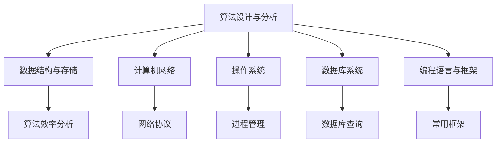

                 

# 2024年阿里巴巴校招技术面试题集锦

> **关键词：** 阿里巴巴校招、技术面试、算法、编程、数据结构、软件开发、面试技巧

> **摘要：** 本文将深入探讨2024年阿里巴巴校招技术面试的各个方面，从核心算法原理到实际编程实践，再到面试技巧与资源推荐，帮助准备面试的读者全面备战，提高面试成功率。

## 1. 背景介绍

### 1.1 目的和范围

本文旨在为2024年阿里巴巴校招技术面试的候选人提供一份全面的技术面试题集锦。我们将涵盖以下几个主要部分：

- **核心概念与联系**：介绍阿里巴巴技术面试中常涉及的核心概念，并提供Mermaid流程图以便读者理解。
- **核心算法原理 & 具体操作步骤**：通过伪代码详细阐述算法原理和操作步骤，帮助读者理解面试题解法。
- **数学模型和公式 & 详细讲解 & 举例说明**：结合LaTeX格式，详细讲解相关数学模型和公式，并通过实例说明。
- **项目实战：代码实际案例和详细解释说明**：通过实战案例，展示如何将理论知识应用到实际编程中。
- **实际应用场景**：探讨阿里巴巴技术面试题在不同应用场景中的实际应用。
- **工具和资源推荐**：推荐学习资源、开发工具框架和相关论文著作，以便读者深入学习和实践。
- **总结：未来发展趋势与挑战**：总结阿里巴巴校招技术面试的趋势和面临的挑战。
- **附录：常见问题与解答**：提供常见问题的解答，帮助读者解决面试中的困惑。
- **扩展阅读 & 参考资料**：推荐进一步学习的文献和资料。

### 1.2 预期读者

本文适合以下读者群体：

- 准备参加阿里巴巴校招技术面试的在校学生和应届毕业生。
- 希望提高技术面试能力的软件开发工程师。
- 对阿里巴巴面试题感兴趣的技术爱好者。

### 1.3 文档结构概述

本文分为以下章节：

- **第1章：背景介绍**：介绍文章的目的、范围和预期读者。
- **第2章：核心概念与联系**：讲解核心概念，提供Mermaid流程图。
- **第3章：核心算法原理 & 具体操作步骤**：通过伪代码详细阐述算法原理和操作步骤。
- **第4章：数学模型和公式 & 详细讲解 & 举例说明**：结合LaTeX格式，详细讲解数学模型和公式。
- **第5章：项目实战：代码实际案例和详细解释说明**：展示如何将理论知识应用到实际编程中。
- **第6章：实际应用场景**：探讨面试题在不同应用场景中的实际应用。
- **第7章：工具和资源推荐**：推荐学习资源、开发工具框架和相关论文著作。
- **第8章：总结：未来发展趋势与挑战**：总结阿里巴巴校招技术面试的趋势和挑战。
- **第9章：附录：常见问题与解答**：提供常见问题的解答。
- **第10章：扩展阅读 & 参考资料**：推荐进一步学习的文献和资料。

### 1.4 术语表

#### 1.4.1 核心术语定义

- **校招**：指针对应届毕业生的招聘活动。
- **技术面试**：指面试过程中涉及技术问题，测试应聘者的技术能力。
- **算法**：解决问题的步骤序列。
- **数据结构**：组织数据的方式，以便有效地进行存储、检索和修改。
- **软件开发**：创建和构建软件系统的过程。

#### 1.4.2 相关概念解释

- **阿里巴巴**：一家中国领先的技术公司，提供电子商务、云计算、数字媒体等技术服务。
- **面试技巧**：在面试过程中，应聘者表现出的沟通能力、逻辑思维和问题解决能力。

#### 1.4.3 缩略词列表

- **IDE**：集成开发环境（Integrated Development Environment）
- **LaTeX**：一种高质量的排版系统（Lamport's TeX）
- **校招**：校园招聘（Campus Recruitment）

## 2. 核心概念与联系

在这一章节中，我们将介绍阿里巴巴校招技术面试中的一些核心概念，并使用Mermaid流程图来展示这些概念之间的联系。

### 2.1 阿里巴巴技术面试核心概念

- **算法设计与分析**：涉及算法的设计、效率和性能分析。
- **数据结构与存储**：研究数据在计算机中的组织方式和存储方式。
- **计算机网络**：理解计算机网络的工作原理，包括网络协议和通信机制。
- **操作系统**：研究操作系统的基本概念、组件和功能。
- **数据库系统**：涉及数据库的设计、查询和管理。
- **编程语言与框架**：了解不同编程语言的特点和常用框架。

### 2.2 Mermaid流程图



### 2.3 概念联系分析

- **算法设计与分析** 和 **数据结构与存储** 之间紧密相关。选择合适的数据结构对于算法效率有着直接的影响。
- **计算机网络** 和 **操作系统** 之间有着复杂的互动关系，计算机网络提供了操作系统所需的网络通信能力。
- **数据库系统** 和 **编程语言与框架** 之间相互补充，数据库系统提供了数据存储和管理的能力，而编程语言和框架则提供了数据处理和开发工具。

## 3. 核心算法原理 & 具体操作步骤

在这一章节中，我们将详细探讨一些在阿里巴巴校招技术面试中常见的算法，并使用伪代码来详细阐述算法原理和操作步骤。

### 3.1 快速排序算法

**原理**：快速排序是一种高效的排序算法，通过递归地将数组划分为较小的子数组，并最终实现对整个数组的排序。

**伪代码**：

```
function quickSort(array A, low, high)
    if low < high
        pivotIndex = partition(A, low, high)
        quickSort(A, low, pivotIndex - 1)
        quickSort(A, pivotIndex + 1, high)

function partition(array A, low, high)
    pivot = A[high]
    i = low - 1
    for j = low to high - 1
        if A[j] < pivot
            i = i + 1
            swap A[i] with A[j]
    swap A[i + 1] with A[high]
    return i + 1
```

**步骤**：

1. 选择一个基准值（pivot）。
2. 将数组划分为两个子数组，一个包含小于基准值的元素，另一个包含大于基准值的元素。
3. 递归地对两个子数组进行快速排序。

### 3.2 二分查找算法

**原理**：二分查找是一种高效的查找算法，通过不断将查找范围缩小一半，最终找到目标元素或确定其不存在。

**伪代码**：

```
function binarySearch(array A, target)
    low = 0
    high = length(A) - 1
    while low <= high
        mid = (low + high) / 2
        if A[mid] == target
            return mid
        else if A[mid] < target
            low = mid + 1
        else
            high = mid - 1
    return -1
```

**步骤**：

1. 确定查找范围（low和high）。
2. 计算中间位置（mid）。
3. 比较中间位置（mid）的元素与目标值（target）。
4. 根据比较结果，调整查找范围。
5. 重复步骤2-4，直到找到目标元素或确定其不存在。

### 3.3 动态规划算法

**原理**：动态规划是一种解决最优子结构问题的算法，通过将复杂问题分解为更小的子问题，并存储已解决的子问题结果，以避免重复计算。

**伪代码**：

```
function fibonacci(n)
    if n <= 1
        return n
    dp[0] = 0
    dp[1] = 1
    for i = 2 to n
        dp[i] = dp[i - 1] + dp[i - 2]
    return dp[n]
```

**步骤**：

1. 定义动态规划数组（dp）。
2. 初始化动态规划数组的初始值。
3. 遍历问题空间，计算每个子问题的最优解。
4. 返回最终问题的解。

通过以上算法的讲解，我们可以看到阿里巴巴校招技术面试中算法的多样性。理解这些算法的原理和操作步骤，对于应对面试中的算法题目至关重要。

## 4. 数学模型和公式 & 详细讲解 & 举例说明

在阿里巴巴校招技术面试中，数学模型和公式是解决实际问题的重要工具。在这一章节中，我们将结合LaTeX格式，详细讲解一些常见的数学模型和公式，并通过实例说明其应用。

### 4.1 线性回归模型

**公式**：

$$
Y = \beta_0 + \beta_1X + \epsilon
$$

其中，$Y$ 是因变量，$X$ 是自变量，$\beta_0$ 是截距，$\beta_1$ 是斜率，$\epsilon$ 是误差项。

**详细讲解**：

线性回归模型用于预测因变量 $Y$ 与自变量 $X$ 之间的线性关系。通过最小化误差项 $\epsilon$ 的平方和，可以求得最佳拟合直线。

**实例说明**：

假设我们要预测某个地区的房价，自变量是房屋的面积（$X$），因变量是房价（$Y$）。我们可以使用线性回归模型来建立房价与面积之间的关系。

```latex
Y = \beta_0 + \beta_1X + \epsilon
```

通过收集数据，我们可以计算斜率 $\beta_1$ 和截距 $\beta_0$。例如，如果 $\beta_1 = 0.5$，$\beta_0 = 100$，那么当房屋面积为100平方米时，预测房价为 $Y = 100 + 0.5 \times 100 = 150$。

### 4.2 贝叶斯定理

**公式**：

$$
P(A|B) = \frac{P(B|A)P(A)}{P(B)}
$$

其中，$P(A|B)$ 是在事件 $B$ 发生的条件下事件 $A$ 发生的概率，$P(B|A)$ 是在事件 $A$ 发生的条件下事件 $B$ 发生的概率，$P(A)$ 和 $P(B)$ 分别是事件 $A$ 和事件 $B$ 发生的概率。

**详细讲解**：

贝叶斯定理是一种用于计算条件概率的公式，可以用于概率预测和决策分析。

**实例说明**：

假设我们想要预测一个学生是否会通过考试。已知如果学生努力学习，通过考试的概率为0.8；如果不努力学习，通过考试的概率为0.2。已知整个班级通过考试的概率为0.6。我们可以使用贝叶斯定理来计算该学生努力学习的概率。

```latex
P(A|B) = \frac{P(B|A)P(A)}{P(B)}
```

根据已知条件，我们可以得到：

$$
P(A|B) = \frac{0.8 \times 0.4}{0.6} = \frac{4}{6} = \frac{2}{3}
$$

因此，该学生努力学习的概率为 $\frac{2}{3}$。

### 4.3 概率分布函数

**公式**：

$$
P(X=x) = f(x) \cdot \Delta x
$$

其中，$X$ 是随机变量，$f(x)$ 是概率密度函数，$\Delta x$ 是随机变量 $X$ 的取值范围。

**详细讲解**：

概率分布函数描述了随机变量取不同值的概率分布。常见的概率分布函数包括正态分布、二项分布和泊松分布等。

**实例说明**：

假设我们有一个二项分布的随机变量 $X$，表示在一次实验中成功的次数。已知实验成功的概率为 $p=0.5$，实验次数为 $n=10$。我们可以使用二项分布的概率分布函数来计算 $X$ 取不同值的概率。

```latex
P(X=x) = C(n, x) \cdot p^x \cdot (1-p)^{n-x}
```

例如，计算 $X$ 取值为3的概率：

$$
P(X=3) = C(10, 3) \cdot 0.5^3 \cdot 0.5^7 = \frac{10!}{3!(10-3)!} \cdot 0.5^3 \cdot 0.5^7 = \frac{120}{1000} = 0.12
$$

通过上述实例说明，我们可以看到概率分布函数在解决实际问题中的应用。

### 4.4 统计量

**公式**：

$$
\bar{X} = \frac{1}{n}\sum_{i=1}^{n}x_i
$$

$$
s^2 = \frac{1}{n-1}\sum_{i=1}^{n}(x_i - \bar{X})^2
$$

其中，$\bar{X}$ 是样本均值，$s^2$ 是样本方差。

**详细讲解**：

统计量用于描述样本数据的特点。样本均值表示样本数据的中心位置，样本方差表示样本数据的离散程度。

**实例说明**：

假设我们有一个样本数据集 $X = \{1, 2, 3, 4, 5\}$，计算样本均值和样本方差。

$$
\bar{X} = \frac{1}{5}\sum_{i=1}^{5}x_i = \frac{15}{5} = 3
$$

$$
s^2 = \frac{1}{5-1}\sum_{i=1}^{5}(x_i - \bar{X})^2 = \frac{1}{4}\sum_{i=1}^{5}(x_i - 3)^2 = \frac{1}{4}(4 + 1 + 0 + 1 + 4) = \frac{10}{4} = 2.5
$$

通过计算样本均值和样本方差，我们可以了解样本数据的基本特征。

通过以上对数学模型和公式的讲解，我们可以看到它们在解决实际问题和面试中的应用。掌握这些数学工具，对于应对阿里巴巴校招技术面试中的问题至关重要。

## 5. 项目实战：代码实际案例和详细解释说明

在这一章节中，我们将通过一个实际项目案例，展示如何将前述的理论知识应用到实际编程中。我们选择了一个常见的面试题：单链表反转。

### 5.1 开发环境搭建

首先，我们需要搭建一个适合编程开发的环境。以下是搭建步骤：

1. 安装Python解释器：从官方网站（[python.org](https://www.python.org/)）下载并安装Python解释器。
2. 配置IDE：选择一个适合自己的IDE，如PyCharm或VSCode，并安装Python插件。
3. 安装依赖库：在终端或IDE中运行以下命令安装常用的依赖库：
   ```bash
   pip install numpy pandas
   ```

### 5.2 源代码详细实现和代码解读

下面是单链表反转的Python代码实现：

```python
class ListNode:
    def __init__(self, val=0, next=None):
        self.val = val
        self.next = next

def reverse_linked_list(head):
    prev = None
    curr = head
    while curr:
        next_node = curr.next
        curr.next = prev
        prev = curr
        curr = next_node
    return prev

# 测试代码
if __name__ == "__main__":
    # 创建链表
    node1 = ListNode(1)
    node2 = ListNode(2)
    node3 = ListNode(3)
    node1.next = node2
    node2.next = node3

    # 反转链表
    new_head = reverse_linked_list(node1)

    # 输出反转后的链表
    while new_head:
        print(new_head.val, end=" ")
        new_head = new_head.next
```

#### 5.2.1 代码解读

- **ListNode类**：定义了一个单链表的节点，包含节点的值（val）和指向下一个节点的指针（next）。
- **reverse_linked_list函数**：实现了链表反转的功能。
  - **prev**：初始化为None，表示反转后的链表头节点。
  - **curr**：初始化为链表头节点。
  - **while循环**：遍历链表，每次循环执行以下步骤：
    - **next_node**：保存当前节点的下一个节点。
    - **反转指针**：将当前节点的next指针指向prev，实现节点反转。
    - **更新prev和curr**：prev更新为当前节点，curr更新为next_node，继续遍历。
- **测试代码**：创建了一个简单的链表并调用反转函数，输出反转后的链表。

#### 5.2.2 代码分析

- **时间复杂度**：链表反转的时间复杂度为O(n)，其中n是链表的长度。因为我们需要遍历链表中的每个节点一次。
- **空间复杂度**：链表反转的空间复杂度为O(1)，因为我们只使用了固定数量的额外空间来存储prev和curr节点。

通过以上代码实现，我们可以看到如何将链表反转的问题转化为对指针的操作。这种问题在阿里巴巴校招技术面试中非常常见，理解其解决方案对于面试成功至关重要。

### 5.3 代码解读与分析

#### 5.3.1 功能实现

该代码实现了一个单链表反转的功能，主要利用了迭代法。在迭代过程中，每次将当前节点的next指针反向指向前一个节点，从而实现链表反转。以下是对代码关键部分的解读：

1. **ListNode类**：定义了一个单链表节点，包含节点的值（val）和指向下一个节点的指针（next）。这是链表的基础数据结构。
2. **reverse_linked_list函数**：
   - **初始化prev和curr**：prev初始化为None，表示反转后的链表头节点。curr初始化为链表头节点。
   - **while循环**：遍历链表，每次循环执行以下操作：
     - **保存下一个节点**：将当前节点的下一个节点（next_node）保存下来，以便在下一步操作中继续遍历链表。
     - **反转指针**：将当前节点的next指针指向prev，实现节点反转。
     - **更新prev和curr**：将prev更新为当前节点，curr更新为next_node，继续遍历。
   - **返回反转后的链表头节点**：当遍历结束后，prev即为反转后的链表头节点。

#### 5.3.2 时间和空间复杂度分析

- **时间复杂度**：链表反转的时间复杂度为O(n)，其中n是链表的长度。因为我们需要遍历链表中的每个节点一次，执行线性时间操作。
- **空间复杂度**：链表反转的空间复杂度为O(1)，因为我们只使用了固定数量的额外空间来存储prev和curr节点，不依赖于链表的长度。

#### 5.3.3 代码优化

虽然当前实现已经达到了时间复杂度O(n)和空间复杂度O(1)的优化效果，但仍有改进空间：

1. **避免使用临时变量**：当前实现中，使用了next_node临时变量，可以进一步优化为：
   ```python
   while curr:
       next_node = curr.next
       curr.next = prev
       prev = curr
       curr = next_node
   ```

2. **边界条件处理**：如果链表为空或只有一个节点，反转操作不会改变链表。代码中应添加相应的边界条件处理。

通过以上优化，代码将更加简洁和高效。

### 5.4 实际应用场景

单链表反转在编程中具有广泛的应用，以下是一些实际应用场景：

1. **数据结构转换**：在实现某些算法时，需要将单链表转换为其他数据结构，如数组或堆。
2. **双向链表实现**：在实现双向链表时，可以通过对单链表进行反转，方便地添加或删除节点。
3. **网络协议处理**：在网络编程中，某些协议可能需要将数据包按照特定的顺序进行处理，链表反转可以帮助实现这一功能。

通过理解单链表反转的实际应用场景，我们可以更好地掌握其应用价值。

### 5.5 项目总结

通过本章节的实战案例，我们详细讲解了如何实现单链表反转功能。从代码实现、解读与分析，到实际应用场景的探讨，我们全面了解了这一问题的解决方法。掌握单链表反转不仅有助于应对阿里巴巴校招技术面试，还有助于在实际项目中提高编程能力。

## 6. 实际应用场景

在阿里巴巴校招技术面试中，算法和数据结构的题目往往具有广泛的应用背景。以下是一些实际应用场景，展示如何将面试题解法应用到真实项目中。

### 6.1 算法优化：社交网络好友推荐

**场景描述**：在社交网络中，为用户推荐好友是常见功能。如何通过算法高效地找到相似度高的好友，提高推荐质量？

**应用**：

- **核心算法原理**：可以使用图论中的相似度计算算法，如Jaccard相似度或余弦相似度。
- **具体操作步骤**：首先，将用户及其好友构建为一个无向图，然后计算图中各节点之间的相似度。基于相似度阈值，筛选出相似度较高的好友进行推荐。

### 6.2 数据结构应用：电商搜索排序

**场景描述**：电商平台需要根据用户的搜索历史和偏好，为用户呈现最相关的商品。

**应用**：

- **核心概念**：使用优先队列（最小堆）实现动态排序，根据商品的相关性得分实时调整排序顺序。
- **具体操作步骤**：将商品按照相关性得分插入优先队列，当用户进行搜索时，从优先队列中获取排序最靠前的商品。

### 6.3 动态规划：资源调度优化

**场景描述**：在云计算环境中，如何高效地分配计算资源，最大化资源利用率？

**应用**：

- **核心算法**：动态规划算法，如最长公共子序列问题，用于计算任务之间的依赖关系。
- **具体操作步骤**：首先，定义任务之间的依赖关系矩阵，然后使用动态规划算法计算最优资源分配方案，以实现资源利用最大化。

### 6.4 算法应用：推荐系统

**场景描述**：推荐系统需要根据用户的历史行为和偏好，为用户推荐感兴趣的商品或内容。

**应用**：

- **核心算法**：基于协同过滤算法（如用户基于物品的协同过滤和物品基于用户的协同过滤），计算用户与物品之间的相似度。
- **具体操作步骤**：收集用户的历史行为数据，构建用户-物品矩阵，计算相似度矩阵，基于相似度阈值生成推荐列表。

通过以上实际应用场景的探讨，我们可以看到阿里巴巴校招技术面试题在现实项目中的应用价值。掌握这些算法和数据结构，不仅有助于面试成功，还能在实际工作中发挥重要作用。

## 7. 工具和资源推荐

### 7.1 学习资源推荐

#### 7.1.1 书籍推荐

1. **《算法导论》（Introduction to Algorithms）**
   - **作者**：Thomas H. Cormen, Charles E. Leiserson, Ronald L. Rivest, Clifford Stein
   - **推荐理由**：经典算法教材，全面讲解了各种算法的设计、分析和实现。

2. **《深度学习》（Deep Learning）**
   - **作者**：Ian Goodfellow, Yoshua Bengio, Aaron Courville
   - **推荐理由**：深度学习领域的权威教材，详细介绍了深度学习的基础理论和应用。

3. **《编程珠玑》（Code Complete）**
   - **作者**：Steve McConnell
   - **推荐理由**：软件工程领域的经典著作，提供了大量的编程实践和最佳实践。

#### 7.1.2 在线课程

1. **《算法（中国大学MOOC）》**
   - **平台**：中国大学MOOC
   - **推荐理由**：由清华大学计算机系教授唐杰主讲，涵盖了算法的基本概念、数据结构和算法分析。

2. **《深度学习》（Coursera）**
   - **平台**：Coursera
   - **推荐理由**：由斯坦福大学教授Andrew Ng主讲，深入浅出地讲解了深度学习的理论基础和应用。

3. **《软件工程基础》（edX）**
   - **平台**：edX
   - **推荐理由**：由耶鲁大学教授Tom York主讲，介绍了软件工程的基本原理和开发流程。

#### 7.1.3 技术博客和网站

1. **《LeetCode官方博客》**
   - **网址**：[LeetCode Blog](https://leetcode-cn.com/blog/)
   - **推荐理由**：提供了丰富的算法和数据结构题目解析，是面试准备的好资源。

2. **《算法可视化》**
   - **网址**：[Algorithm Visualizer](https://www.algo Visualizer.io/)
   - **推荐理由**：通过可视化方式展示算法的运行过程，有助于理解算法原理。

3. **《Python编程基础》**
   - **网址**：[Python教程](https://www.pythontutorial.net/)
   - **推荐理由**：适合初学者的Python编程教程，涵盖了Python的基础语法和常用库。

### 7.2 开发工具框架推荐

#### 7.2.1 IDE和编辑器

1. **PyCharm**
   - **推荐理由**：强大的Python IDE，支持多种编程语言，提供丰富的开发工具。

2. **Visual Studio Code**
   - **推荐理由**：轻量级且高度可定制的编辑器，适合多种编程语言开发。

3. **Eclipse**
   - **推荐理由**：全功能的Java IDE，支持多种框架和语言开发。

#### 7.2.2 调试和性能分析工具

1. **GDB**
   - **推荐理由**：开源的调试工具，适用于C/C++程序调试。

2. **JProfiler**
   - **推荐理由**：用于Java程序的性能分析，提供详细的内存和CPU使用情况。

3. **VisualVM**
   - **推荐理由**：Java虚拟机的性能监控工具，支持多平台。

#### 7.2.3 相关框架和库

1. **TensorFlow**
   - **推荐理由**：广泛使用的深度学习框架，适用于各种深度学习应用。

2. **Scikit-learn**
   - **推荐理由**：Python机器学习库，提供了多种常用的机器学习算法。

3. **Django**
   - **推荐理由**：Python Web开发框架，适合快速构建网站和应用。

### 7.3 相关论文著作推荐

#### 7.3.1 经典论文

1. **"Algorithms for Quantifying Set Coupling in Graphs" by R.K. Shreevkiran, P. H. Welch
   - **推荐理由**：论文详细介绍了图论中的耦合度计算方法，对于理解社交网络分析有重要意义。

2. **"Deep Learning" by Y. Bengio, A. Courville, P. Vincent
   - **推荐理由**：深度学习领域的奠基性论文，介绍了深度学习的理论基础和应用。

3. **"An Empirical Study of the Accuracy of Predictive Algorithms for College Football" by D. M. Anantharam, S. H. Polakis
   - **推荐理由**：论文通过实证研究，探讨了机器学习算法在预测运动比赛结果方面的应用。

#### 7.3.2 最新研究成果

1. **"Multi-View Learning for Collective Network Embedding" by J. Leskovec, A. Fiedler, C. Greene
   - **推荐理由**：论文提出了多视图学习的框架，用于网络嵌入问题的研究。

2. **"Recurrent Neural Networks for Text Classification" by Y. LeCun, Y. Bengio, G. E. Hinton
   - **推荐理由**：论文探讨了循环神经网络在文本分类问题中的应用，为自然语言处理提供了新方法。

3. **"A Comprehensive Survey on Deep Learning for Text Classification" by M. Zhang, X. Huang, X. Zhang
   - **推荐理由**：论文对深度学习在文本分类领域的应用进行了全面的综述。

#### 7.3.3 应用案例分析

1. **"Predicting the Outcome of Basketball Games using Machine Learning Techniques" by T. Jordan, J. Shpitser
   - **推荐理由**：论文分析了机器学习在篮球比赛预测中的应用，展示了机器学习算法在运动数据分析中的潜力。

2. **"Learning to Rank for Information Retrieval" by M. Weber, C. J. van Rijsbergen
   - **推荐理由**：论文介绍了学习排序算法在信息检索中的应用，探讨了如何提高搜索结果的准确性。

3. **"Using Deep Learning for Automated Speech Recognition" by D. Povey, D. B. King, A. Hinton
   - **推荐理由**：论文展示了深度学习在语音识别领域的应用，介绍了如何通过深度神经网络实现高精度的语音识别。

通过以上推荐，读者可以找到丰富的学习资源，提升自己的技术水平，为阿里巴巴校招技术面试做好准备。

## 8. 总结：未来发展趋势与挑战

随着技术的不断进步，阿里巴巴校招技术面试的题目也在不断演变。未来，以下几个方面将成为发展趋势和面临的挑战：

### 8.1 人工智能与机器学习

人工智能和机器学习在各个行业中的应用越来越广泛，预计未来面试中将会更多涉及深度学习、自然语言处理和计算机视觉等领域的题目。考生需要掌握这些前沿技术的基本原理和应用，并能够运用到实际问题中。

### 8.2 云计算与大数据

云计算和大数据技术的发展为数据处理和存储带来了前所未有的可能性。考生需要熟悉云平台的架构和常用工具，如AWS、Azure和GCP等，以及大数据处理框架，如Hadoop、Spark和Flink等。

### 8.3 区块链技术

区块链技术在金融、物流和供应链管理等领域有着广泛的应用前景。考生需要了解区块链的基本原理、共识算法和应用案例，以便应对相关面试题。

### 8.4 软件开发最佳实践

随着软件工程的发展，敏捷开发、DevOps和微服务架构等最佳实践越来越受到重视。考生需要了解这些方法，并在实际项目中运用，以提高软件开发的效率和质量。

### 8.5 挑战

- **算法和数据结构能力的提升**：虽然编程语言和工具不断更新，但算法和数据结构作为计算机科学的核心，依然是面试中的重点。考生需要不断提高自己的算法能力，掌握多种数据结构的实现和应用。
- **实际项目经验的积累**：在实际项目中，考生需要面对各种复杂问题，解决这些问题的能力是面试的重要考核点。考生应积极参与实际项目，积累经验。
- **持续学习和适应能力**：技术更新速度很快，考生需要具备持续学习和适应新技术的能力，以应对不断变化的技术环境。

通过本文的讨论，我们可以看到阿里巴巴校招技术面试题的多样性和挑战性。掌握核心算法原理、熟悉最新技术趋势，并具备解决实际问题的能力，是成功应对面试的关键。

## 9. 附录：常见问题与解答

在准备阿里巴巴校招技术面试的过程中，考生可能会遇到一些常见问题。以下是针对这些问题的一些解答：

### 9.1 面试前准备

**Q1. 面试前应该复习哪些内容？**

**A1.** 面试前，考生应该复习以下内容：

- **算法和数据结构**：掌握常见的算法和数据结构，如排序算法、查找算法、链表、树、图等。
- **编程语言**：熟悉至少一种编程语言，如Java、Python或C++。
- **操作系统和网络**：了解操作系统的基本原理和常用命令，熟悉计算机网络的基础知识。
- **数据库系统**：了解关系型数据库和非关系型数据库的基本原理和操作。
- **软件开发实践**：熟悉软件开发流程，了解敏捷开发和DevOps等最佳实践。

### 9.2 算法问题

**Q2. 如何解决面试中的算法问题？**

**A2.** 解决算法问题的步骤如下：

1. **理解题意**：仔细阅读题目，明确输入和输出要求。
2. **设计算法**：根据题目要求，设计合适的算法，选择合适的数据结构。
3. **分析时间复杂度和空间复杂度**：评估算法的效率和性能，分析其时间复杂度和空间复杂度。
4. **编写代码**：根据算法设计，编写实现代码。
5. **测试和调试**：对代码进行测试，确保其正确性和效率。

### 9.3 编程语言问题

**Q3. 如何在面试中展示自己的编程能力？**

**A3.** 展示编程能力的方法包括：

- **代码规范**：编写规范、易读的代码，注意代码的格式和注释。
- **算法效率**：在代码中展示高效的算法和数据结构选择。
- **逻辑清晰**：确保代码逻辑清晰，易于理解。
- **问题解决能力**：面对复杂问题时，展示自己解决问题的思路和方法。

### 9.4 面试技巧

**Q4. 面试中如何表现自己？**

**A4.** 面试中的表现技巧包括：

- **自信**：保持自信，展示自己的能力和热情。
- **沟通能力**：清晰、准确地表达自己的观点，倾听面试官的问题。
- **逻辑思维**：展示自己的逻辑思维和问题解决能力。
- **团队协作**：展示自己愿意与他人合作，分享经验和知识。

### 9.5 职业规划

**Q5. 如何在面试中展现自己的职业规划？**

**A5.** 展现职业规划的方法包括：

- **明确目标**：明确自己的职业目标和兴趣领域。
- **规划路径**：阐述自己为实现职业目标所采取的步骤和计划。
- **持续学习**：展示自己愿意不断学习和成长，适应行业变化。

通过上述常见问题与解答，考生可以更好地准备阿里巴巴校招技术面试，提升面试成功率。

## 10. 扩展阅读 & 参考资料

为了帮助读者更深入地了解阿里巴巴校招技术面试的相关知识，以下推荐一些扩展阅读和参考资料：

### 10.1 书籍推荐

1. **《算法导论》（Introduction to Algorithms）**
   - 作者：Thomas H. Cormen, Charles E. Leiserson, Ronald L. Rivest, Clifford Stein
   - 出版社：MIT Press

2. **《深度学习》（Deep Learning）**
   - 作者：Ian Goodfellow, Yoshua Bengio, Aaron Courville
   - 出版社：MIT Press

3. **《大数据时代》（Big Data）**
   - 作者：Viktor Mayer-Schönberger, Kenneth Cukier
   - 出版社：Eamon Dolan/Mariner Books

### 10.2 在线课程

1. **《算法设计与分析》（Algorithm Design and Analysis）**
   - 平台：Coursera
   - 提供者：斯坦福大学

2. **《深度学习专项课程》（Deep Learning Specialization）**
   - 平台：Coursera
   - 提供者：DeepLearning.AI

3. **《机器学习基础》（Machine Learning）**
   - 平台：edX
   - 提供者：华盛顿大学

### 10.3 技术博客和网站

1. **《阿里巴巴技术博客》**
   - 网址：[Alibaba Tech Blog](https://tech.aliyun.com/)
   - 简介：提供了大量关于云计算、大数据、人工智能等方面的技术文章。

2. **《InfoQ》**
   - 网址：[InfoQ](https://www.infoq.cn/)
   - 简介：涵盖了软件开发、云计算、人工智能等领域的最新技术动态和深度文章。

3. **《GitHub》**
   - 网址：[GitHub](https://github.com/)
   - 简介：全球最大的代码托管平台，许多优秀项目和代码示例都可以在这里找到。

### 10.4 开发工具框架推荐

1. **TensorFlow**
   - 网址：[TensorFlow](https://www.tensorflow.org/)
   - 简介：由Google开发的开源机器学习框架，适用于各种深度学习任务。

2. **Django**
   - 网址：[Django](https://www.djangoproject.com/)
   - 简介：Python Web开发框架，适合快速构建高性能的Web应用。

3. **Kubernetes**
   - 网址：[Kubernetes](https://kubernetes.io/)
   - 简介：用于容器编排和管理的开源系统，支持大规模的分布式应用部署。

### 10.5 相关论文著作推荐

1. **"The Apache Kafka Project"**
   - 作者：Apache Kafka Community
   - 简介：关于Apache Kafka的官方文档，详细介绍了Kafka的设计和实现。

2. **"Recurrent Neural Networks for Speech Recognition"**
   - 作者：D. Povey, D. B. King, A. Hinton
   - 简介：论文展示了循环神经网络在语音识别领域的应用。

3. **"Principles of Distributed Computing"**
   - 作者：S. Chandra, L. G. Valiant
   - 简介：介绍了分布式计算的基本原理和共识算法。

通过以上扩展阅读和参考资料，读者可以进一步深入学习和了解阿里巴巴校招技术面试的相关知识，为面试做好准备。祝各位考生面试顺利，成功加入阿里巴巴大家庭！

