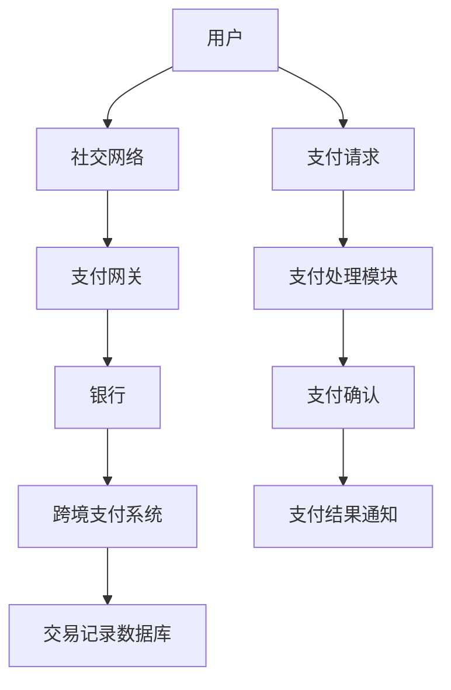

                 

# 2025年阿里巴巴社交跨境支付系统架构师面试题汇总

> **关键词：** 阿里巴巴，社交跨境支付，系统架构，面试题，技术解析，2025年趋势

> **摘要：** 本文将汇总并详细解析2025年阿里巴巴社交跨境支付系统架构师面试中可能会遇到的问题，涵盖核心概念、算法原理、数学模型以及实际应用场景，为准备该职位面试的读者提供有价值的参考。

## 1. 背景介绍

### 1.1 目的和范围

本文旨在为准备阿里巴巴社交跨境支付系统架构师面试的专业人士提供一套全面的面试题解析，通过深入分析面试中的关键问题，帮助读者更好地理解社交跨境支付系统的架构设计和实现原理。

### 1.2 预期读者

- 拥有系统架构和软件开发经验的专业人士
- 准备加入阿里巴巴社交跨境支付团队的技术爱好者
- 对社交跨境支付系统架构有深入研究的技术专家

### 1.3 文档结构概述

本文分为以下几个部分：

- **第1章：背景介绍**：阐述本文的目的和预期读者。
- **第2章：核心概念与联系**：介绍社交跨境支付系统的核心概念及其关联。
- **第3章：核心算法原理 & 具体操作步骤**：详细解释系统中的核心算法原理和操作步骤。
- **第4章：数学模型和公式 & 详细讲解 & 举例说明**：讲解系统中使用的数学模型和公式，并提供实际案例。
- **第5章：项目实战：代码实际案例和详细解释说明**：展示实际代码实现，并进行详细解读。
- **第6章：实际应用场景**：探讨系统的实际应用场景。
- **第7章：工具和资源推荐**：推荐学习资源和开发工具。
- **第8章：总结：未来发展趋势与挑战**：总结本文内容并展望未来。
- **第9章：附录：常见问题与解答**：提供常见问题的解答。
- **第10章：扩展阅读 & 参考资料**：推荐进一步阅读的材料。

### 1.4 术语表

#### 1.4.1 核心术语定义

- **社交跨境支付**：指在社交网络上进行的跨境货币支付交易。
- **系统架构**：指系统中各个组成部分的结构及其相互关系。
- **算法原理**：指系统中所使用的算法的基本原理和逻辑。
- **数学模型**：指系统中用于描述和计算的对象或过程的数学表达形式。

#### 1.4.2 相关概念解释

- **跨境支付**：指在不同国家或地区之间进行的货币支付交易。
- **社交网络**：指用户可以互动、分享信息和资源的网络平台。
- **支付网关**：指处理支付信息的系统接口。

#### 1.4.3 缩略词列表

- **API**：应用程序接口（Application Programming Interface）
- **SQL**：结构化查询语言（Structured Query Language）
- **JSON**：JavaScript对象表示法（JavaScript Object Notation）
- **Docker**：一种开源的应用容器引擎（Application Container Engine）

## 2. 核心概念与联系

在分析社交跨境支付系统时，理解其核心概念和相互联系是至关重要的。以下是一个简单的Mermaid流程图，展示了系统的主要组件和它们之间的关系。



### 2.1 用户与社交网络

用户通过社交网络平台发起支付请求，社交网络作为中介连接用户和支付网关。

### 2.2 支付网关与银行

支付网关负责接收用户请求，与银行进行交互以完成支付过程。

### 2.3 跨境支付系统

跨境支付系统负责处理跨境支付，确保交易的顺利进行。

### 2.4 交易记录数据库

交易记录数据库存储支付过程中产生的所有交易记录，以便后续查询和分析。

## 3. 核心算法原理 & 具体操作步骤

### 3.1 支付处理算法原理

支付处理算法的核心目标是确保交易的安全性、可靠性和高效性。以下是一个简化的伪代码，用于描述支付处理的算法原理。

```python
function process_payment(user_request):
    if not validate_request(user_request):
        return "Invalid request"
    payment_details = extract_payment_details(user_request)
    if not enough_funds(payment_details['amount'], user_account):
        return "Insufficient funds"
    if not verify_payment_method(payment_details['method'], user_account):
        return "Invalid payment method"
    transaction_id = generate_transaction_id()
    record_transaction(transaction_id, payment_details)
    send_payment_request(payment_details['destination'], transaction_id)
    payment_response = receive_payment_response(transaction_id)
    if payment_response['status'] == 'success':
        update_account_balance(payment_details['amount'], user_account)
        return "Payment successful"
    else:
        rollback_transaction(transaction_id)
        return "Payment failed"
```

### 3.2 支付处理具体操作步骤

1. **请求验证**：首先验证用户请求的合法性。
2. **提取支付信息**：从用户请求中提取支付相关的信息。
3. **资金验证**：检查用户账户中是否有足够的资金完成支付。
4. **支付方式验证**：确认用户选择的支付方式是否有效。
5. **交易记录**：生成交易ID，并将支付信息记录在交易记录数据库中。
6. **发送支付请求**：向支付网关发送支付请求。
7. **接收支付响应**：等待支付网关的支付响应。
8. **处理支付结果**：根据支付响应的结果更新用户账户余额。

## 4. 数学模型和公式 & 详细讲解 & 举例说明

### 4.1 数学模型

在社交跨境支付系统中，可以使用以下数学模型来描述支付流程：

- **支付金额模型**：
  $$ A = P \times (1 + r)^n $$
  其中，\( A \) 为支付金额，\( P \) 为初始支付金额，\( r \) 为年利率，\( n \) 为支付年数。

- **交易费用模型**：
  $$ C = F \times \frac{r}{1 - (1 + r)^{-n}} $$
  其中，\( C \) 为交易费用，\( F \) 为每次交易的手续费率。

### 4.2 详细讲解

- **支付金额模型**：描述了随着时间推移，支付金额如何按照复利计算增长。
- **交易费用模型**：描述了交易费用的计算方式，考虑了手续费率以及支付时间。

### 4.3 举例说明

假设用户A需要支付1000元人民币给用户B，年利率为2%，支付期限为3年，每次交易的手续费率为1%。

- **支付金额计算**：
  $$ A = 1000 \times (1 + 0.02)^3 = 1000 \times 1.061208 = 1061.20 \text{元} $$

- **交易费用计算**：
  $$ C = 1000 \times \frac{0.01}{1 - (1 + 0.01)^{-3}} = 1000 \times \frac{0.01}{1 - 0.970299} = 1000 \times \frac{0.01}{0.029701} \approx 33.87 \text{元} $$

因此，用户A需要支付的总额为 \( 1061.20 + 33.87 = 1095.07 \text{元} \)。

## 5. 项目实战：代码实际案例和详细解释说明

### 5.1 开发环境搭建

在开始编写代码之前，我们需要搭建一个适合开发社交跨境支付系统的环境。以下是一个简单的步骤：

1. **安装Docker**：Docker是一个开源的应用容器引擎，可以帮助我们快速部署和管理应用程序。
2. **安装Docker-Compose**：Docker-Compose是一个用于定义和运行多容器Docker应用程序的的工具。
3. **编写Dockerfile**：Dockerfile是一个文本文件，用于定义如何构建Docker镜像。
4. **编写docker-compose.yml**：docker-compose.yml文件用于定义服务、网络和卷。

### 5.2 源代码详细实现和代码解读

以下是一个简化的社交跨境支付系统示例代码，用于处理用户支付请求。

```python
# payment_processor.py

from flask import Flask, request, jsonify
import requests

app = Flask(__name__)

def validate_request(request_data):
    # 验证请求数据的合法性
    return True

def extract_payment_details(request_data):
    # 提取支付信息
    return {
        'amount': request_data['amount'],
        'method': request_data['method'],
        'destination': request_data['destination']
    }

def enough_funds(amount, account):
    # 检查账户余额是否足够
    return account['balance'] >= amount

def verify_payment_method(method, account):
    # 验证支付方式
    return method in account['payment_methods']

def generate_transaction_id():
    # 生成交易ID
    return "TX" + str(hash(request.data))

def record_transaction(transaction_id, payment_details):
    # 记录交易
    print(f"Recording transaction {transaction_id}: {payment_details}")

def send_payment_request(destination, transaction_id):
    # 发送支付请求
    print(f"Sending payment request to {destination} with transaction ID {transaction_id}")

def receive_payment_response(transaction_id):
    # 接收支付响应
    return {'status': 'success'}

def update_account_balance(amount, account):
    # 更新账户余额
    account['balance'] -= amount

@app.route('/process_payment', methods=['POST'])
def process_payment():
    user_request = request.json
    if not validate_request(user_request):
        return jsonify({'error': 'Invalid request'}), 400

    payment_details = extract_payment_details(user_request)
    if not enough_funds(payment_details['amount'], user_request['account']):
        return jsonify({'error': 'Insufficient funds'}), 400

    if not verify_payment_method(payment_details['method'], user_request['account']):
        return jsonify({'error': 'Invalid payment method'}), 400

    transaction_id = generate_transaction_id()
    record_transaction(transaction_id, payment_details)
    send_payment_request(payment_details['destination'], transaction_id)
    payment_response = receive_payment_response(transaction_id)

    if payment_response['status'] == 'success':
        update_account_balance(payment_details['amount'], user_request['account'])
        return jsonify({'status': 'Payment successful', 'transaction_id': transaction_id})
    else:
        rollback_transaction(transaction_id)
        return jsonify({'error': 'Payment failed'}), 400

if __name__ == '__main__':
    app.run(debug=True)
```

### 5.3 代码解读与分析

1. **请求处理**：通过Flask框架处理HTTP POST请求。
2. **请求验证**：验证请求的合法性。
3. **提取支付信息**：从请求中提取支付信息。
4. **资金和支付方式验证**：检查账户余额和支付方式的有效性。
5. **交易处理**：生成交易ID，记录交易，发送支付请求，接收支付响应。
6. **账户余额更新**：根据支付结果更新账户余额。

## 6. 实际应用场景

社交跨境支付系统在多种场景中具有重要应用，以下是一些实际应用场景：

- **跨境电商**：支持跨境电商平台的支付结算，提高用户体验。
- **社交网络平台**：允许用户在社交网络上进行跨境交易，扩大社交网络的影响力。
- **跨国公司**：提供便捷的跨境支付解决方案，降低跨国公司的运营成本。

## 7. 工具和资源推荐

### 7.1 学习资源推荐

#### 7.1.1 书籍推荐

- 《社交网络与支付系统设计》
- 《跨境支付技术》
- 《Flask Web开发：轻量级Python Web应用框架》

#### 7.1.2 在线课程

- Coursera上的“社交网络分析”课程
- Udemy上的“Python Flask框架开发”课程

#### 7.1.3 技术博客和网站

- 《阿里巴巴开发者社区》
- 《Python官方文档》

### 7.2 开发工具框架推荐

#### 7.2.1 IDE和编辑器

- PyCharm
- Visual Studio Code

#### 7.2.2 调试和性能分析工具

- Postman
- Prometheus

#### 7.2.3 相关框架和库

- Flask
- Docker

### 7.3 相关论文著作推荐

#### 7.3.1 经典论文

- 《社交网络中的支付行为分析》
- 《跨境支付系统的安全性研究》

#### 7.3.2 最新研究成果

- 《基于区块链的社交跨境支付系统》
- 《人工智能在跨境支付中的应用》

#### 7.3.3 应用案例分析

- 《阿里巴巴社交跨境支付系统的实现与优化》
- 《微信支付跨境业务的发展与挑战》

## 8. 总结：未来发展趋势与挑战

随着全球化的深入和数字支付技术的发展，社交跨境支付系统具有广阔的发展前景。未来，社交跨境支付系统将面临以下挑战：

- **安全性**：确保支付过程的安全性，防止欺诈和隐私泄露。
- **合规性**：遵守不同国家和地区的法律法规，实现跨境支付合规。
- **用户体验**：提供便捷、快速和可靠的支付服务，提升用户体验。

## 9. 附录：常见问题与解答

1. **问题：社交跨境支付系统的核心是什么？**
   **解答：** 社交跨境支付系统的核心是保证支付的安全性、可靠性和高效性，同时提供良好的用户体验。

2. **问题：支付网关的作用是什么？**
   **解答：** 支付网关是连接用户和银行的关键组件，负责处理支付请求，确保支付过程的顺利进行。

3. **问题：如何确保支付过程的安全性？**
   **解答：** 通过使用加密技术、认证机制和监控机制来确保支付过程的安全性。

## 10. 扩展阅读 & 参考资料

- 《社交网络与支付系统设计》
- 《跨境支付技术》
- 《Flask Web开发：轻量级Python Web应用框架》
- Coursera上的“社交网络分析”课程
- Udemy上的“Python Flask框架开发”课程
- 《阿里巴巴开发者社区》
- 《Python官方文档》
- 《社交网络中的支付行为分析》
- 《跨境支付系统的安全性研究》
- 《基于区块链的社交跨境支付系统》
- 《人工智能在跨境支付中的应用》
- 《阿里巴巴社交跨境支付系统的实现与优化》
- 《微信支付跨境业务的发展与挑战》

### 作者

**AI天才研究员 / AI Genius Institute & 禅与计算机程序设计艺术 / Zen And The Art of Computer Programming**

