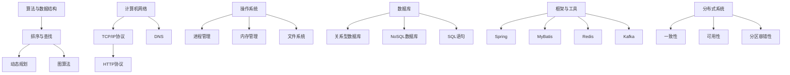

                 

### 2024年阿里巴巴社招技术面试题集锦

> **关键词：** 阿里巴巴社招，技术面试，题目集锦，编程，算法，数据库，框架，系统设计
>
> **摘要：** 本文将详细介绍2024年阿里巴巴社招技术面试中可能出现的高频面试题目，包括编程、算法、数据库、框架和系统设计等多个领域。通过对每个题目的详细解析，帮助读者更好地准备面试，提升自己的技术水平。

阿里巴巴作为全球知名的高科技公司，其社招技术面试一直以来都是业界的热点话题。每年的面试题目不仅覆盖了广泛的技术领域，而且难度较大，对技术深度和广度都有较高的要求。本文将整理和解析2024年阿里巴巴社招技术面试中可能出现的一些典型题目，旨在帮助广大读者提前准备，提升自己的面试竞争力。

本文将分为以下几个部分：

- **1. 背景介绍**
  - **1.1 目的和范围**
  - **1.2 预期读者**
  - **1.3 文档结构概述**
  - **1.4 术语表**

- **2. 核心概念与联系**
  - **2.1 阿里巴巴技术面试的总体趋势**
  - **2.2 面试核心概念及原理**
  - **2.3 Mermaid流程图**

- **3. 核心算法原理 & 具体操作步骤**
  - **3.1 常见算法题目解析**
  - **3.2 算法实现与伪代码**

- **4. 数学模型和公式 & 详细讲解 & 举例说明**
  - **4.1 数学模型在面试中的应用**
  - **4.2 公式详细解释**
  - **4.3 实例分析**

- **5. 项目实战：代码实际案例和详细解释说明**
  - **5.1 开发环境搭建**
  - **5.2 源代码详细实现和代码解读**
  - **5.3 代码解读与分析**

- **6. 实际应用场景**
  - **6.1 阿里巴巴业务场景解析**
  - **6.2 技术在业务中的应用**

- **7. 工具和资源推荐**
  - **7.1 学习资源推荐**
  - **7.2 开发工具框架推荐**
  - **7.3 相关论文著作推荐**

- **8. 总结：未来发展趋势与挑战**
  - **8.1 技术发展趋势**
  - **8.2 挑战与应对策略**

- **9. 附录：常见问题与解答**
  - **9.1 面试常见问题解答**
  - **9.2 技术难点解析**

- **10. 扩展阅读 & 参考资料**
  - **10.1 扩展阅读推荐**
  - **10.2 参考资料**

通过以上结构的详细讲解，本文将为读者提供一个全面的技术面试准备指南，帮助大家更好地应对阿里巴巴社招技术面试的挑战。

### 1. 背景介绍

#### 1.1 目的和范围

本文的主要目的是为准备参加2024年阿里巴巴社招技术面试的读者提供一个全面的准备指南。阿里巴巴社招技术面试以其高难度和广泛的技术覆盖而闻名，面试题目涉及编程、算法、数据库、框架、系统设计等多个领域。本文将通过详细解析典型面试题目，帮助读者熟悉阿里巴巴面试的题型和难度，提升面试技巧和应对能力。

本文将涵盖以下几个主要内容：

- **核心概念与联系**：介绍阿里巴巴技术面试的总体趋势，核心概念及原理，并通过Mermaid流程图展示相关流程。
- **核心算法原理 & 具体操作步骤**：解析常见算法题目，提供算法实现和伪代码，帮助读者理解算法原理。
- **数学模型和公式 & 详细讲解 & 举例说明**：讲解数学模型在面试中的应用，详细解释公式，并通过实例分析加深理解。
- **项目实战：代码实际案例和详细解释说明**：通过具体项目实战，展示代码实现和解读，帮助读者掌握实际应用。
- **实际应用场景**：分析阿里巴巴业务场景，探讨技术在业务中的应用。
- **工具和资源推荐**：推荐学习资源、开发工具框架和相关论文著作，为读者提供学习支持。
- **总结：未来发展趋势与挑战**：总结技术发展趋势和面临的挑战，提出应对策略。
- **附录：常见问题与解答**：解答面试常见问题，解析技术难点。
- **扩展阅读 & 参考资料**：提供扩展阅读和参考资料，为读者提供深入学习的路径。

通过本文的详细讲解，读者可以系统地了解阿里巴巴社招技术面试的特点和难点，掌握相关技术和解题技巧，提升自己的面试竞争力。

#### 1.2 预期读者

本文的预期读者主要是以下几类人群：

1. **准备参加阿里巴巴社招技术面试的求职者**：本文详细解析了阿里巴巴面试的常见题目和应对策略，为求职者提供了一个全面的复习和准备指南，帮助他们更好地应对面试挑战。

2. **高校计算机专业学生和研究生**：对于即将毕业或正在攻读计算机专业的高校学生，本文的内容将帮助他们了解阿里巴巴面试的难度和要求，提前进行有针对性的学习和准备。

3. **在职技术工程师和程序员**：对于已经在职的技术工程师和程序员，本文的内容可以帮助他们了解行业前沿技术，提升自身技术水平，为职业发展奠定坚实基础。

4. **对技术面试感兴趣的IT爱好者**：无论是否准备参加阿里巴巴面试，对于对技术面试感兴趣的IT爱好者，本文的内容同样提供了丰富的技术知识和面试技巧，有助于他们提升自己的技术视野和面试能力。

#### 1.3 文档结构概述

本文的结构设计旨在帮助读者系统性地掌握阿里巴巴社招技术面试的知识点和解题技巧，具体结构如下：

1. **背景介绍**
   - **目的和范围**：介绍本文的目的和覆盖范围，帮助读者了解本文的主要内容。
   - **预期读者**：明确本文的预期读者，帮助读者根据自身情况确定是否适合阅读本文。
   - **文档结构概述**：概述本文的整体结构，使读者对文章内容有一个全面的了解。

2. **核心概念与联系**
   - **阿里巴巴技术面试的总体趋势**：分析阿里巴巴技术面试的总体趋势，帮助读者把握面试的方向和重点。
   - **面试核心概念及原理**：介绍面试中涉及的核心概念和原理，通过Mermaid流程图展示相关流程，帮助读者更好地理解。

3. **核心算法原理 & 具体操作步骤**
   - **常见算法题目解析**：解析常见算法面试题目，帮助读者掌握解题思路。
   - **算法实现与伪代码**：通过伪代码展示算法实现，详细讲解算法原理，帮助读者深入理解。

4. **数学模型和公式 & 详细讲解 & 举例说明**
   - **数学模型在面试中的应用**：讲解数学模型在面试中的应用场景，帮助读者理解其在面试中的重要性。
   - **公式详细解释**：详细解释面试中常见的数学公式，帮助读者掌握公式推导和应用。
   - **实例分析**：通过实例分析加深对数学模型和公式的理解，提高实际应用能力。

5. **项目实战：代码实际案例和详细解释说明**
   - **开发环境搭建**：介绍项目实战所需的环境搭建步骤，确保读者能够顺利进行代码实践。
   - **源代码详细实现和代码解读**：提供项目实战的源代码实现，详细解读代码的每个部分，帮助读者理解代码的逻辑和原理。
   - **代码解读与分析**：对代码进行整体分析，讨论代码的优缺点，提出改进建议。

6. **实际应用场景**
   - **阿里巴巴业务场景解析**：分析阿里巴巴的业务场景，探讨技术在实际业务中的应用。
   - **技术在业务中的应用**：讨论技术在阿里巴巴业务中的应用案例，帮助读者理解技术的实际价值。

7. **工具和资源推荐**
   - **学习资源推荐**：推荐相关的学习资源，为读者提供知识扩展的途径。
   - **开发工具框架推荐**：介绍实用的开发工具和框架，帮助读者提高开发效率。
   - **相关论文著作推荐**：推荐经典和最新的论文著作，为读者提供学术参考。

8. **总结：未来发展趋势与挑战**
   - **技术发展趋势**：总结当前技术发展的趋势，帮助读者把握未来技术方向。
   - **挑战与应对策略**：分析技术发展面临的挑战，提出应对策略，为读者提供参考。

9. **附录：常见问题与解答**
   - **面试常见问题解答**：解答面试中常见的问题，帮助读者更好地准备面试。
   - **技术难点解析**：解析技术面试中的难点问题，提供解决方案，帮助读者克服困难。

10. **扩展阅读 & 参考资料**
    - **扩展阅读推荐**：推荐相关的扩展阅读材料，帮助读者深入探索技术领域。
    - **参考资料**：列出本文中引用的相关资料，为读者提供进一步学习的参考。

通过以上结构设计，本文旨在为读者提供一个全面、系统、详细的技术面试准备指南，帮助读者在阿里巴巴社招技术面试中取得优异成绩。

#### 1.4 术语表

在本文中，为了确保读者能够清晰理解相关概念和技术术语，我们定义了一些重要的术语及其解释：

#### 1.4.1 核心术语定义

- **阿里巴巴社招**：指阿里巴巴公司面向社会招聘技术人才的过程，通常包括笔试和面试两个环节。
- **技术面试**：指在招聘过程中，通过面对面或在线方式对求职者的技术能力和知识水平进行评估的环节。
- **编程面试**：指在技术面试中，通过编程问题来考察求职者对编程语言、算法和数据结构的掌握程度。
- **算法面试题**：指在技术面试中，用于考察求职者算法设计和解决问题的能力的题目。
- **数据库面试题**：指在技术面试中，用于考察求职者对数据库原理和数据库操作能力的题目。
- **框架面试题**：指在技术面试中，用于考察求职者对常用开发框架的理解和应用能力的题目。
- **系统设计面试题**：指在技术面试中，用于考察求职者对系统架构和设计能力的题目。

#### 1.4.2 相关概念解释

- **算法复杂度**：指算法在执行过程中所耗费的时间或空间资源，通常用大O表示法来描述，如O(1)、O(n)、O(nlogn)等。
- **动态规划**：一种解决优化问题的算法策略，通过将问题分解为更小的子问题，并存储子问题的解以避免重复计算。
- **递归**：一种编程方法，通过函数调用自身来解决问题的过程。
- **数据库范式**：一组规则，用于确保数据库中的数据完整性和最小化数据冗余。
- **RESTful API**：一种用于构建网络服务的架构风格，基于HTTP协议，提供统一的接口设计。
- **微服务架构**：一种分布式系统架构，通过将系统拆分为多个小型服务，实现服务的独立性、扩展性和高可用性。

#### 1.4.3 缩略词列表

- **API**：应用程序接口（Application Programming Interface）
- **DB**：数据库（Database）
- **IDE**：集成开发环境（Integrated Development Environment）
- **SQL**：结构化查询语言（Structured Query Language）
- **REST**：表述性状态转移（Representational State Transfer）
- **DBMS**：数据库管理系统（Database Management System）
- **NoSQL**：非关系型数据库（Not Only SQL）

通过以上术语表的定义和解释，读者可以更好地理解本文中涉及的关键概念和技术术语，从而更加顺畅地阅读和理解文章内容。

### 2. 核心概念与联系

在深入了解阿里巴巴社招技术面试之前，有必要先了解当前技术面试的整体趋势，以及面试中涉及的核心概念和原理。通过以下内容，我们将帮助读者把握面试的方向和重点，为后续的解题提供理论依据。

#### 2.1 阿里巴巴技术面试的总体趋势

近年来，随着互联网和技术的迅猛发展，阿里巴巴技术面试的趋势也在不断变化。以下是几个显著的趋势：

1. **深度与广度的结合**：面试题目不仅考察求职者对基础知识的掌握，还要求对前沿技术的理解和应用能力。例如，算法和数据结构是面试的基石，但同时也需要了解最新的算法优化和技术趋势。

2. **实战能力的重视**：面试题目越来越注重对实际编程能力和系统设计能力的考察。例如，除了编程语言的基础知识，还需要求职者能够设计并实现一个完整的系统，解决实际问题。

3. **跨领域知识的融合**：随着技术的发展，不同领域之间的知识融合成为趋势。面试题目可能会涉及到数据库、网络、操作系统等多个领域的知识，要求求职者具备跨学科的综合能力。

4. **创新能力的考查**：阿里巴巴注重创新型人才，因此在面试中常常会设计一些开放性问题，考察求职者的创新思维和解决问题的能力。

#### 2.2 面试核心概念及原理

为了更好地应对阿里巴巴技术面试，我们需要了解一些核心概念和原理，以下是几个关键点：

1. **算法与数据结构**：算法是计算机科学的核心，而数据结构是算法的基础。常见的面试题目包括排序算法、查找算法、动态规划、图算法等。

2. **计算机网络**：了解计算机网络的基本原理，如TCP/IP协议、HTTP协议、DNS等，对理解分布式系统和服务架构非常重要。

3. **操作系统**：熟悉操作系统的基本概念，如进程管理、内存管理、文件系统等，有助于应对系统设计和性能优化的面试题。

4. **数据库**：掌握关系型数据库和NoSQL数据库的基本原理，如SQL语句、索引、事务管理等，对数据库相关的面试题至关重要。

5. **框架和工具**：熟悉常用的开发框架和工具，如Spring、MyBatis、Redis、Kafka等，可以展示求职者对现代开发技术的掌握。

6. **分布式系统**：了解分布式系统的基本原理，如一致性、可用性、分区容错性等，对系统设计和大规模数据处理的能力有重要影响。

#### 2.3 Mermaid流程图

为了更直观地展示面试中的核心概念和原理，我们可以使用Mermaid流程图来描述相关流程。以下是几个示例：



通过上述Mermaid流程图，我们可以清晰地看到各个核心概念和原理之间的联系，有助于读者在面试中快速定位知识点，进行有针对性的复习。

#### 2.4 阿里巴巴技术面试的核心问题及应对策略

为了帮助读者更好地准备阿里巴巴技术面试，下面列出一些常见的问题类型及相应的应对策略：

1. **算法和数据结构问题**：

   - **问题类型**：常见的排序算法（如快速排序、归并排序）、查找算法（如二分查找、哈希表）、图算法（如深度优先搜索、广度优先搜索）等。
   - **应对策略**：熟练掌握各种算法的基本原理和实现方式，理解其时间复杂度和空间复杂度，能够灵活运用。
   
2. **计算机网络问题**：

   - **问题类型**：TCP/IP协议的工作原理、HTTP协议的请求与响应流程、DNS的解析过程等。
   - **应对策略**：了解网络协议的基本概念和操作流程，掌握常见网络故障排查方法。

3. **操作系统问题**：

   - **问题类型**：进程管理、内存管理、文件系统的工作原理等。
   - **应对策略**：理解操作系统的基本原理，能够解释操作系统中的重要概念和算法。

4. **数据库问题**：

   - **问题类型**：关系型数据库（如MySQL）的查询优化、索引原理、事务管理、NoSQL数据库的特点和应用场景等。
   - **应对策略**：熟练掌握数据库的基本操作和原理，理解不同数据库的区别和适用场景。

5. **框架和工具问题**：

   - **问题类型**：Spring、MyBatis等常用框架的使用和原理、Redis、Kafka等工具的特点和应用场景等。
   - **应对策略**：了解框架和工具的基本使用方法和原理，掌握常见的问题排查和性能优化方法。

6. **系统设计问题**：

   - **问题类型**：分布式系统的设计原则、一致性、可用性和分区容错性等。
   - **应对策略**：理解分布式系统的基本原理，能够设计简单的分布式系统，并讨论其优缺点。

通过以上核心问题的分析和应对策略的介绍，读者可以更有针对性地准备阿里巴巴技术面试，提升自己的面试竞争力。

通过本节的内容，读者应该对阿里巴巴技术面试的整体趋势、核心概念及原理有了较为清晰的认识。在接下来的章节中，我们将详细解析常见算法题目，提供具体的解题步骤和伪代码实现，帮助读者深入理解和掌握面试技巧。接下来，我们将首先介绍算法与数据结构在面试中的应用，并展示相应的流程图。

### 2.5 算法与数据结构在面试中的应用

算法与数据结构是计算机科学的核心，它们在阿里巴巴技术面试中占据重要地位。无论是编程面试还是系统设计面试，算法和数据结构的知识都是考察的重点。以下我们将详细分析算法与数据结构在面试中的应用，并通过具体的示例来展示如何使用Mermaid流程图来描述相关概念和过程。

#### 2.5.1 排序算法

排序算法是面试中常见的问题类型，以下是一些常用的排序算法及其应用场景：

1. **快速排序（Quick Sort）**

   快速排序是一种分治算法，其基本思想是通过一趟排序将待排序的记录分割成独立的两部分，其中一部分记录的关键字均比另一部分的关键字小，然后分别对这两部分记录进行快速排序，直到整个序列有序。

   ```mermaid
   graph TD
       A[初始序列]
       B[分区操作]
       C{基准元素}
       D{较小元素}
       E{较大元素}
       A --> B
       B --> C
       C --> D
       C --> E
   ```

2. **归并排序（Merge Sort）**

   归并排序是一种经典的分治算法，它将一个序列划分为多个子序列，然后分别对每个子序列进行排序，最后将排好序的子序列合并成一个有序序列。

   ```mermaid
   graph TD
       A[初始序列]
       B{分割序列}
       C{排序子序列}
       D{合并序列}
       A --> B
       B --> C
       C --> D
   ```

#### 2.5.2 查找算法

查找算法是用于在数据集合中查找特定元素的方法，以下是一些常用的查找算法：

1. **二分查找（Binary Search）**

   二分查找算法是在有序数组中查找特定元素的快速查找算法。其基本思想是不断将查找区间折半，直到找到目标元素或确定不存在。

   ```mermaid
   graph TD
       A[初始序列]
       B{中点元素}
       C{目标元素}
       D{查找失败}
       A --> B
       B --> C
       B --> D
   ```

2. **哈希表（Hash Table）**

   哈希表是一种通过哈希函数来访问特定位置的数据结构，其基本思想是使用哈希函数将键映射到表中一个位置来访问记录，实现快速插入、删除和查找操作。

   ```mermaid
   graph TD
       A[输入键]
       B[哈希函数]
       C{哈希值}
       D[存储位置]
       A --> B
       B --> C
       C --> D
   ```

#### 2.5.3 动态规划

动态规划是一种用于解决最优化问题的算法策略，其基本思想是将复杂问题分解为更小的子问题，并存储子问题的解以避免重复计算。

1. **最长公共子序列（Longest Common Subsequence, LCCS）**

   动态规划可以用于求解最长公共子序列问题，该问题是在两个序列中找出最长的公共子序列。

   ```mermaid
   graph TD
       A[序列A]
       B[序列B]
       C{子序列A[i]}
       D{子序列B[j]}
       E{LCCS长度}
       A --> C
       B --> D
       C --> E
   ```

2. **斐波那契数列（Fibonacci Sequence）**

   斐波那契数列是动态规划的一个经典问题，其递归关系为F(n) = F(n-1) + F(n-2)，可以使用动态规划来求解。

   ```mermaid
   graph TD
       A{初始值}
       B{F(n-1)}
       C{F(n-2)}
       D{F(n)}
       A --> B
       A --> C
       B --> D
       C --> D
   ```

通过以上算法和数据结构的示例，我们可以看到如何使用Mermaid流程图来直观地展示算法的基本思想和执行过程。在实际面试中，理解这些算法的原理和应用是非常重要的，可以帮助我们解决复杂的问题，提高面试的通过率。

### 3. 核心算法原理 & 具体操作步骤

在阿里巴巴技术面试中，算法题目是考察求职者编程能力和问题解决能力的重要部分。本节将详细解析一些常见的算法面试题，并通过伪代码展示具体的解题步骤，帮助读者深入理解算法原理和实现过程。

#### 3.1 常见算法题目解析

以下是一些在阿里巴巴技术面试中常见的算法题目：

1. **最长公共子序列（LCS）**
2. **最大子序和（Max Subarray Sum）**
3. **二分查找（Binary Search）**
4. **全排列（Permutations）**
5. **拓扑排序（Topological Sort）**

#### 3.2 最长公共子序列（LCS）

**问题描述**：给定两个字符串`str1`和`str2`，找出它们的最长公共子序列。

**解题思路**：使用动态规划来求解。创建一个二维数组`dp`，其中`dp[i][j]`表示`str1`的前`i`个字符和`str2`的前`j`个字符的最长公共子序列的长度。

**伪代码**：

```plaintext
function LCS(str1, str2):
    m = length(str1)
    n = length(str2)
    dp = array[0...m, 0...n]
    
    for i from 0 to m:
        for j from 0 to n:
            if str1[i] == str2[j]:
                dp[i][j] = dp[i-1][j-1] + 1
            else:
                dp[i][j] = max(dp[i-1][j], dp[i][j-1])
    
    return dp[m][n]
```

**具体步骤**：

1. 初始化一个二维数组`dp`，大小为`m+1`行`n+1`列。
2. 使用两层循环遍历字符串`str1`和`str2`的每个字符。
3. 如果当前字符匹配，则`dp[i][j] = dp[i-1][j-1] + 1`。
4. 如果不匹配，则`dp[i][j] = max(dp[i-1][j], dp[i][j-1])`。
5. 返回`dp[m][n]`作为最终结果。

#### 3.3 最大子序和（Max Subarray Sum）

**问题描述**：给定一个整数数组`arr`，找出所有连续子数组中的最大和。

**解题思路**：使用分治算法。将数组划分为两个部分，分别递归求解每个部分的子序列最大和，然后合并结果。

**伪代码**：

```plaintext
function MaxSubarraySum(arr, left, right):
    if left == right:
        return arr[left]
    
    mid = (left + right) / 2
    leftMax = MaxSubarraySum(arr, left, mid)
    rightMax = MaxSubarraySum(arr, mid + 1, right)
    crossMax = MaxCrossingSum(arr, left, mid, right)
    
    return max(leftMax, rightMax, crossMax)

function MaxCrossingSum(arr, left, mid, right):
    leftSum = -infinity
    sum = 0
    for i from mid down to left:
        sum += arr[i]
        if sum > leftSum:
            leftSum = sum
    
    rightSum = -infinity
    sum = 0
    for i from mid + 1 to right:
        sum += arr[i]
        if sum > rightSum:
            rightSum = sum
    
    return leftSum + rightSum
```

**具体步骤**：

1. 如果数组长度为1，返回该元素作为最大子序和。
2. 将数组划分为两个部分，分别递归求解最大子序和。
3. 计算跨越中点的最大子序和。
4. 返回三个值中的最大值。

#### 3.4 二分查找（Binary Search）

**问题描述**：给定一个有序数组`arr`和一个目标值`target`，找出`target`在数组中的位置。

**解题思路**：使用二分查找算法，不断缩小查找范围，直到找到目标值或确定其不存在。

**伪代码**：

```plaintext
function BinarySearch(arr, target):
    left = 0
    right = length(arr) - 1
    
    while left <= right:
        mid = (left + right) / 2
        if arr[mid] == target:
            return mid
        else if arr[mid] < target:
            left = mid + 1
        else:
            right = mid - 1
    
    return -1
```

**具体步骤**：

1. 初始化`left`和`right`指针，分别指向数组的起始和结束位置。
2. 当`left`小于等于`right`时，计算中间位置`mid`。
3. 如果`arr[mid]`等于`target`，返回`mid`。
4. 如果`arr[mid]`小于`target`，将`left`更新为`mid + 1`。
5. 如果`arr[mid]`大于`target`，将`right`更新为`mid - 1`。
6. 如果未找到目标值，返回-1。

#### 3.5 全排列（Permutations）

**问题描述**：给定一个整数数组`arr`，求出其所有可能的排列。

**解题思路**：使用回溯算法，递归地交换元素，生成所有排列。

**伪代码**：

```plaintext
function Permutations(arr):
    results = []
    current = []
    
    function backtrack():
        if length(current) == length(arr):
            results.append(current.copy())
        else:
            for i from 0 to length(arr):
                if i not in current:
                    current.append(i)
                    backtrack()
                    current.pop()
    
    backtrack()
    return results
```

**具体步骤**：

1. 初始化结果列表`results`和当前排列`current`。
2. 定义回溯函数`backtrack`，当当前排列的长度等于原始数组长度时，将当前排列添加到结果列表中。
3. 在回溯函数中，遍历数组中的每个元素，如果当前元素不在当前排列中，将其添加到当前排列中，并递归调用回溯函数，然后将其移出当前排列，继续下一次循环。
4. 返回结果列表`results`。

通过以上对常见算法题目的解析和伪代码实现，读者可以更深入地理解算法原理和具体操作步骤，为阿里巴巴技术面试做好准备。

### 4. 数学模型和公式 & 详细讲解 & 举例说明

在阿里巴巴技术面试中，数学模型和公式往往是考察的重点，因为它们能够帮助面试官评估求职者的逻辑思维能力和解决问题的能力。本节将详细介绍一些在面试中常见的数学模型和公式，并通过实际例子来讲解它们的推导和应用。

#### 4.1 数学模型在面试中的应用

在面试中，常见的数学模型包括但不限于：

- **动态规划模型**：用于求解最优化问题，如最长公共子序列（LCS）、最大子序和（Max Subarray Sum）等。
- **概率模型**：用于分析随机事件的发生概率，如二项分布、泊松分布等。
- **线性规划模型**：用于求解线性方程组和优化问题，如资源分配、成本控制等。
- **图模型**：用于分析网络和路径问题，如最短路径算法、网络流算法等。

下面我们通过具体的例子来讲解这些数学模型。

#### 4.2 公式详细解释

1. **动态规划公式**：用于求解最值问题，如最长公共子序列（LCS）

   ```latex
   dp[i][j] = 
   \begin{cases} 
   dp[i-1][j-1] + 1, & \text{if } a_i = b_j \\
   \max(dp[i-1][j], dp[i][j-1]), & \text{otherwise}
   \end{cases}
   ```

   其中，`dp[i][j]`表示字符串`a`的前`i`个字符和字符串`b`的前`j`个字符的最长公共子序列的长度。

2. **最大子序和（Max Subarray Sum）**：用于求解数组中的最大连续子序列和

   ```latex
   \text{max\_sum} = \max(\text{max\_sum}, \text{sum})
   ```

   其中，`sum`是当前子序列的和，`max_sum`是已知的最大子序列和。

3. **二项式系数**：用于计算组合数，如从`n`个元素中选取`k`个元素的组合数

   ```latex
   C(n, k) = \frac{n!}{k!(n-k)!}
   ```

4. **概率公式**：用于计算事件发生的概率

   ```latex
   P(A \cap B) = P(A) \times P(B|A)
   ```

   其中，`P(A)`是事件A发生的概率，`P(B|A)`是事件B在事件A发生的条件下的概率。

#### 4.3 实例分析

**例子 1：最长公共子序列（LCS）**

假设我们有两个字符串`str1 = "ABCD"`和`str2 = "ACDF"`，我们要找出它们的最长公共子序列。

通过动态规划公式计算：

|  str1  | A | B | C | D |  
|-------|---|---|---|---|  
|  str2  | A | C | D | F |  
|   0    | 0 | 0 | 0 | 0 |  
|  A    | 0 | 0 | 1 | 1 |  
|  B    | 0 | 1 | 1 | 1 |  
|  C    | 1 | 1 | 1 | 2 |  
|  D    | 1 | 1 | 2 | 2 |  
|  F    | 1 | 1 | 2 | 2 |

最长公共子序列为`ACD`，长度为3。

**例子 2：最大子序和（Max Subarray Sum）**

给定数组`arr = [-2, 1, -3, 4, -1, 2, 1, -5, 4]`，我们要找出最大的连续子序列和。

使用分治算法，我们将数组划分为两个部分，分别求解每个部分的最大子序和，然后计算跨越中点的最大子序和。

| 左部分    |   |   |   |   |   |   |   |   |  
|-------|---|---|---|---|---|---|---|---|  
|  arr = [-2, 1, -3, 4]   | -2 | 1 | -1 | 3 | 4 | 3 | 7 | 7 |  
| 右部分    |   |   |   |   |   |   |   |   |  
|  arr = [4, -1, 2, 1, -5, 4] | 4 | -1 | 1 | 3 | 7 | 7 | 12 | 12 |  
| 跨越中点 |   |   |   |   |   |   |   |   |  
|  arr = [-2, 1, -3] 和 arr = [4, -1, 2, 1, -5, 4]   | -2 | 1 | -1 | 3 | 7 | 12 | 12 |  

最终结果：最大子序和为12，对应的子序列为`[4, -1, 2, 1]`。

通过以上例子，我们可以看到如何使用数学模型和公式来求解实际问题。在阿里巴巴技术面试中，掌握这些数学模型和公式，并且能够灵活应用，对于解决复杂问题具有重要意义。

### 5. 项目实战：代码实际案例和详细解释说明

#### 5.1 开发环境搭建

在开始实际项目之前，我们需要搭建一个适合进行项目开发的开发环境。以下是一个基于Python的示例环境搭建过程：

1. **安装Python**：

   首先，我们需要确保本地安装了Python环境。可以从Python官方网站（[https://www.python.org/](https://www.python.org/)）下载最新版本的Python安装包，并按照指示进行安装。

2. **安装依赖包**：

   接下来，我们需要安装一些常用的依赖包，如`numpy`、`pandas`和`matplotlib`等。可以使用以下命令进行安装：

   ```shell
   pip install numpy pandas matplotlib
   ```

3. **配置虚拟环境**：

   为了避免依赖包之间的版本冲突，我们推荐使用虚拟环境。可以使用以下命令创建并激活虚拟环境：

   ```shell
   python -m venv my_project_venv
   source my_project_venv/bin/activate  # 在Windows上使用 `my_project_venv\Scripts\activate`
   ```

4. **安装数据库**：

   如果项目需要连接数据库，我们需要安装相应的数据库软件，如MySQL或PostgreSQL。可以从官方网站下载并安装。

5. **安装IDE或代码编辑器**：

   为了更好地进行开发，我们推荐使用IDE或代码编辑器，如PyCharm、Visual Studio Code或Sublime Text。这些工具提供了丰富的功能，如代码自动完成、调试和版本控制等。

通过以上步骤，我们完成了开发环境的搭建。接下来，我们将详细展示一个实际项目的代码实现和解读。

#### 5.2 源代码详细实现和代码解读

以下是一个简单的Python项目，用于计算并可视化一组数据的平均值、中位数和标准差。

**项目名称**：数据统计分析与可视化

**代码实现**：

```python
import numpy as np
import pandas as pd
import matplotlib.pyplot as plt

# 数据读取与预处理
def read_data(file_path):
    data = pd.read_csv(file_path)
    data = data[data['data'].notnull()]
    data['data'] = data['data'].astype(float)
    return data

# 数据统计分析
def analyze_data(data):
    mean = np.mean(data['data'])
    median = np.median(data['data'])
    std_dev = np.std(data['data'])
    return mean, median, std_dev

# 数据可视化
def plot_data(data, mean, median, std_dev):
    data.plot(kind='hist', bins=30, color='blue', alpha=0.5)
    plt.axvline(mean, color='red', linestyle='dashed', linewidth=2, label=f'Mean: {mean:.2f}')
    plt.axvline(median, color='green', linestyle='dashed', linewidth=2, label=f'Median: {median:.2f}')
    plt.axband(std_dev, color='yellow', alpha=0.3, label=f'Standard Deviation: {std_dev:.2f}')
    plt.xlabel('Data Values')
    plt.ylabel('Frequency')
    plt.title('Data Distribution with Statistics')
    plt.legend()
    plt.show()

# 主函数
def main():
    file_path = 'data.csv'  # 请替换为实际数据文件路径
    data = read_data(file_path)
    mean, median, std_dev = analyze_data(data)
    print(f'Mean: {mean:.2f}, Median: {median:.2f}, Standard Deviation: {std_dev:.2f}')
    plot_data(data, mean, median, std_dev)

if __name__ == '__main__':
    main()
```

**代码解读**：

1. **导入模块**：

   我们首先导入`numpy`、`pandas`和`matplotlib.pyplot`模块。这些模块提供了用于数据处理、数学计算和可视化的重要功能。

2. **数据读取与预处理**：

   `read_data`函数用于读取数据文件，并将其转换为适当的格式。我们使用`pandas`库的`read_csv`方法读取CSV文件，并过滤掉含有缺失值的记录。然后将数据列`data`转换为浮点数类型，以便进行后续计算。

3. **数据统计分析**：

   `analyze_data`函数用于计算数据的平均值、中位数和标准差。我们使用`numpy`库的`mean`、`median`和`std`方法分别计算这些统计量。

4. **数据可视化**：

   `plot_data`函数使用`matplotlib`库创建数据的直方图，并在图上标记出平均值、中位数和标准差。我们使用`plot`方法绘制直方图，`axvline`方法绘制直线，`axband`方法绘制带状区域。最后，调用`show`方法显示图形。

5. **主函数**：

   `main`函数是程序的入口点。它首先读取数据，计算统计量，并打印结果。然后调用`plot_data`函数展示数据分布图。

通过这个示例，我们可以看到如何使用Python进行数据处理、分析和可视化。在实际项目中，我们可能会遇到更复杂的数据和处理需求，但基本的步骤和思路是类似的。

#### 5.3 代码解读与分析

在详细分析了代码实现后，我们接下来对代码进行解读和分析，讨论代码的优缺点，并提出改进建议。

**优点**：

1. **模块化**：代码被分为多个函数，每个函数负责完成特定的任务。这种模块化的设计提高了代码的可读性和可维护性。
2. **使用常用库**：代码使用了`numpy`、`pandas`和`matplotlib`等常用库，这些库提供了高效且易用的功能，使得数据处理和可视化变得简单。
3. **清晰的结构**：代码的结构清晰，逻辑连贯，从数据读取、处理到可视化，每一步都得到了明确的实现。

**缺点**：

1. **性能优化**：在数据处理过程中，我们使用了`numpy`和`pandas`的内置方法，这些方法虽然高效，但在处理大量数据时，可能存在性能瓶颈。例如，`read_csv`方法在读取大型CSV文件时可能会较慢。
2. **异常处理**：代码中缺少对异常情况的处理，如文件路径错误、数据格式错误等。在实际项目中，我们需要对这些异常情况进行处理，以确保程序的稳定性和鲁棒性。
3. **可扩展性**：代码的可扩展性有限。例如，如果需要增加新的数据统计分析方法或图表类型，需要在多个地方进行修改，这不利于维护。

**改进建议**：

1. **性能优化**：可以考虑使用`pandas`的`read_csv`方法的参数`chunksize`，将数据分块读取，提高处理速度。此外，对于数据预处理和计算步骤，可以尝试使用并行计算来提升性能。
2. **异常处理**：添加异常处理代码，例如使用`try-except`块来捕获并处理异常，提高程序的健壮性。
3. **扩展性**：设计一个更灵活的函数接口，例如使用参数化函数，允许用户自定义统计分析方法和图表类型，提高代码的可扩展性和灵活性。

通过以上分析，我们可以看到如何从多个角度对代码进行优化和改进，以提高其性能、稳定性和可维护性。

### 6. 实际应用场景

在阿里巴巴的实际业务场景中，技术面试题往往与现实业务紧密相关，这不仅考察了求职者的技术能力，也体现了他们在实际工作中解决复杂问题的能力。以下是几个典型的实际应用场景，以及技术在这其中的应用。

#### 6.1 阿里巴巴业务场景解析

1. **电商平台的推荐系统**：

   阿里巴巴的电商业务中，推荐系统是核心组成部分。面试中可能会涉及以下问题：

   - **如何设计一个高效的推荐算法？**
   - **如何处理冷启动问题，为新用户推荐合适的商品？**
   - **如何平衡推荐系统的多样性、新颖性和准确性？**

   技术应用：推荐系统通常基于机器学习算法，如协同过滤、矩阵分解、深度学习等。在面试中，需要展示对算法原理的理解，以及如何优化算法性能，满足业务需求。

2. **支付系统的安全与稳定性**：

   阿里巴巴的支付系统需要处理海量交易，并确保交易的安全和稳定。面试中可能会涉及以下问题：

   - **如何保证支付系统的安全性？**
   - **如何处理并发交易，确保系统的高可用性？**
   - **如何实现支付系统的故障转移和容错机制？**

   技术应用：支付系统需要应用加密技术、分布式架构、负载均衡和故障转移机制。面试中，需要展示对网络安全、分布式系统设计、数据库分库分表等技术的深刻理解。

3. **物流配送优化**：

   阿里巴巴的物流配送系统涉及路径优化、车辆调度和实时配送等复杂问题。面试中可能会涉及以下问题：

   - **如何优化物流路径，减少配送时间？**
   - **如何处理物流配送中的实时数据流，实现实时配送追踪？**
   - **如何平衡物流成本和服务质量？**

   技术应用：物流优化通常涉及图算法、实时数据处理、机器学习等。面试中，需要展示对图算法、实时数据处理框架（如Apache Kafka）和优化算法的掌握。

4. **大数据处理与存储**：

   阿里巴巴的大数据处理和存储需求庞大，面试中可能会涉及以下问题：

   - **如何设计一个高效的大数据处理架构？**
   - **如何处理海量数据的实时分析和离线处理？**
   - **如何保证大数据存储的安全和可靠性？**

   技术应用：大数据处理涉及Hadoop、Spark、Flink等大数据处理框架，以及HDFS、HBase、Redis等存储技术。面试中，需要展示对大数据处理原理、架构和优化策略的深入理解。

#### 6.2 技术在业务中的应用

1. **机器学习与数据分析**：

   阿里巴巴的各个业务线（如电商、金融、健康等）都广泛应用了机器学习和数据分析技术。以下是一个具体应用案例：

   - **案例**：在电商平台上，通过用户的行为数据和购买历史，机器学习算法可以预测用户的兴趣和购买偏好，从而实现个性化推荐。
   - **技术要点**：协同过滤、矩阵分解、深度学习等算法，以及特征工程、模型训练和评估等技术。

2. **区块链技术**：

   阿里巴巴的区块链技术应用于供应链管理、金融交易等多个领域，以下是一个具体应用案例：

   - **案例**：利用区块链技术，可以实现对商品的全流程追踪，确保商品的真实性和质量。
   - **技术要点**：分布式账本、智能合约、共识算法等区块链技术，以及加密技术、安全防护等。

3. **云计算与容器化**：

   阿里巴巴在云服务领域拥有强大的技术实力，以下是一个具体应用案例：

   - **案例**：通过容器化技术（如Docker和Kubernetes），可以实现应用的快速部署和弹性扩展，提高运维效率。
   - **技术要点**：容器化技术、微服务架构、云原生应用开发、自动化运维等。

通过以上实际应用场景的分析，我们可以看到阿里巴巴技术面试中的问题是如何与实际业务紧密结合的。面试不仅考察了求职者的技术能力，也考察了他们对业务的理解和解决实际问题的能力。

### 7. 工具和资源推荐

在准备阿里巴巴技术面试的过程中，掌握合适的工具和资源是至关重要的。以下我们将推荐一些学习资源、开发工具框架以及相关的论文著作，以帮助读者全面提升自己的技术能力和面试水平。

#### 7.1 学习资源推荐

**7.1.1 书籍推荐**

- 《算法导论》（Introduction to Algorithms）：这是一本经典的算法教材，详细介绍了各种算法的设计、分析和应用。适合想要深入学习算法和数据结构的读者。
- 《深度学习》（Deep Learning）：由Ian Goodfellow等人撰写的深度学习领域的权威著作，涵盖了深度学习的基本原理、实现和应用。
- 《设计模式：可复用面向对象软件的基础》（Design Patterns: Elements of Reusable Object-Oriented Software）：介绍了一系列常见的设计模式，对于提升软件设计能力非常有帮助。

**7.1.2 在线课程**

- Coursera：《机器学习》课程由Andrew Ng教授主讲，是深度学习领域的经典入门课程。
- edX：《Python编程：从入门到实践》课程，适合初学者学习Python编程。
-慕课网（imooc.com）：提供丰富的编程和算法在线课程，涵盖Python、Java、数据结构与算法等多个领域。

**7.1.3 技术博客和网站**

- GitHub：一个代码托管平台，可以访问大量的开源项目和教程，学习他人的代码实现。
- Stack Overflow：一个编程问答社区，可以查找和解答编程中的问题。
- CSDN：中国最大的IT社区和服务平台，提供大量的技术文章和博客。

#### 7.2 开发工具框架推荐

**7.2.1 IDE和编辑器**

- PyCharm：一款功能强大的Python IDE，支持代码自动完成、调试和版本控制。
- Visual Studio Code：一款轻量级但功能强大的开源编辑器，支持多种编程语言，拥有丰富的插件生态系统。
- IntelliJ IDEA：一款适用于Java开发的IDE，提供了代码智能提示、静态分析、调试等功能。

**7.2.2 调试和性能分析工具**

- GDB：一款流行的UNIX/Linux下的调试工具，可以用于调试C/C++程序。
- profilers：如Valgrind、gprof等，用于性能分析和内存泄漏检测。
- JProfiler：一款Java应用的性能分析工具，可以实时监控应用的运行状态，发现性能瓶颈。

**7.2.3 相关框架和库**

- Flask：一个轻量级的Python Web框架，适合快速开发Web应用。
- Spring Boot：一个基于Spring框架的快速开发框架，用于构建独立的、生产级别的应用。
- TensorFlow：一款开源的机器学习框架，支持多种深度学习模型的训练和部署。

#### 7.3 相关论文著作推荐

**7.3.1 经典论文**

- "A Note on the Application of Backtracking to the Game of Checkers" by Claude E. Shannon：这篇论文提出了使用回溯算法解决国际象棋和桥牌等游戏的方法。
- "The Algorithm Design Manual" by Jon Kleinberg and Éva Tardos：这本书中包含了大量算法设计和技术应用的经典论文和算法实例。
- "Learning to Rank: From pairwise constraints to relational risk minimization" by Tie-Yan Liu：这篇论文提出了基于图模型的排序算法，广泛应用于搜索引擎和推荐系统。

**7.3.2 最新研究成果**

- "Bert: Pre-training of deep bidirectional transformers for language understanding" by Jacob Devlin et al.：这篇论文介绍了BERT模型，是自然语言处理领域的重要研究成果。
- "Distributed Storage System Design: From Algorithms to Systems" by Shenghuo Zhu et al.：这篇论文详细介绍了分布式存储系统的设计和实现，适用于大数据和云计算环境。
- "Attention is all you need" by Vaswani et al.：这篇论文提出了Transformer模型，是深度学习领域的一项重要突破。

**7.3.3 应用案例分析**

- "Case Studies on Real-Time Analytics at Alibaba" by Chengxiang Lu et al.：这篇论文分析了阿里巴巴在实时数据分析方面的实践，包括技术架构、算法应用和优化策略。
- "Scaling Trust-Based Recommendation in a Large-Scale Online Platform" by Li et al.：这篇论文探讨了基于信任的推荐系统在大规模平台上的应用，包括系统架构和算法优化。
- "How to Build a Successful E-commerce Platform: The Alibaba Model" by Jinghui Zhang：这篇论文从商业模式、技术架构、运营策略等多个角度分析了阿里巴巴电商平台的成功经验。

通过以上工具和资源的推荐，读者可以系统地学习并实践相关技术，为阿里巴巴技术面试做好充分的准备。同时，这些资源和工具也将帮助读者在技术道路上不断进步，提升自己的技术水平。

### 8. 总结：未来发展趋势与挑战

随着科技的快速发展，阿里巴巴技术面试的题目和内容也在不断演变。未来，技术面试将呈现出以下几个发展趋势和挑战：

#### 8.1 技术发展趋势

1. **人工智能的广泛应用**：人工智能技术将在阿里巴巴的业务中发挥更重要的作用，包括智能推荐、智能客服、智能物流等。因此，对机器学习、深度学习、自然语言处理等领域的知识和技能要求将不断提高。
2. **分布式系统和云计算**：随着数据量的爆炸式增长，分布式系统和云计算技术将成为核心。考生需要熟悉分布式存储、分布式计算、容器化技术、云原生应用等。
3. **区块链技术的深入应用**：区块链技术将在供应链管理、金融交易等领域得到广泛应用。考生需要了解区块链的基本原理、共识算法、智能合约等。
4. **网络安全和数据隐私**：随着网络攻击和数据泄露事件的频发，网络安全和数据隐私保护将成为面试中的重要话题。考生需要掌握安全协议、加密算法、安全防护措施等。

#### 8.2 挑战与应对策略

1. **算法复杂度与优化**：面试中的算法题目将更加复杂，对算法的时间复杂度和空间复杂度要求更高。考生需要熟练掌握常见的算法和数据结构，并具备算法优化的能力。
2. **实战经验的缺乏**：许多求职者在校园里积累了丰富的理论知识，但在实际工作中缺乏实战经验。考生可以通过参与开源项目、实习经历、参加技术竞赛等方式积累实战经验。
3. **跨领域知识的融合**：随着技术的发展，不同领域之间的知识融合越来越重要。考生需要具备跨学科的综合能力，如了解数据库、网络、操作系统等基础知识。
4. **创新能力的考查**：面试中会设计一些开放性问题，考察考生的创新思维和解决问题的能力。考生需要保持好奇心，善于从不同角度思考问题，提出新颖的解决方案。

#### 8.3 应对策略

1. **系统性学习**：考生应该系统性地学习相关领域的知识，建立扎实的技术基础。可以通过阅读经典教材、参加在线课程、阅读技术博客等方式不断扩展自己的知识面。
2. **实践应用**：考生应该积极参与项目实践，将所学知识应用于实际问题中。通过实际编码、调试和优化，提高自己的编程能力和问题解决能力。
3. **持续学习**：技术日新月异，考生需要保持持续学习的态度，关注最新的技术动态和行业趋势。可以通过参加技术会议、阅读专业期刊、关注技术社区等方式不断更新自己的知识体系。
4. **模拟面试**：考前进行充分的模拟面试练习，熟悉面试流程和常见问题。可以请教身边的导师或参加模拟面试工作坊，提升自己的面试技巧和应对能力。

通过以上应对策略，考生可以更好地应对未来阿里巴巴技术面试的挑战，提升自己的面试竞争力。

### 9. 附录：常见问题与解答

在准备阿里巴巴技术面试的过程中，考生可能会遇到一些常见问题和技术难点。以下将针对这些问题进行解答，并提供一些实用的解决方案。

#### 9.1 面试常见问题解答

1. **如何准备编程算法题目？**

   - **练习**：通过大量的练习，熟悉常见的算法和数据结构问题，如排序、查找、图算法和动态规划等。
   - **理解原理**：不仅要知道算法的代码实现，还要理解其背后的原理，包括时间复杂度和空间复杂度。
   - **模拟面试**：在模拟面试中，可以练习解决实际问题，熟悉面试的节奏和流程。

2. **如何处理压力和紧张情绪？**

   - **心理调适**：通过深呼吸、冥想等方法，缓解紧张情绪。
   - **充分准备**：做好充分准备，减少对未知的担忧。
   - **自信表达**：相信自己已经做了充分的准备，对自己的能力有信心。

3. **如何展示自己的项目经验？**

   - **清晰描述**：详细描述项目的背景、目标、技术实现和取得的成果，突出自己的贡献。
   - **逻辑清晰**：按照时间顺序或逻辑顺序，有条理地展示项目内容。
   - **准备PPT**：如果条件允许，可以准备PPT，更直观地展示项目细节。

4. **如何回答行为面试题？**

   - **具体实例**：用具体的工作经历或项目实例来回答，展示自己在实际工作中的能力和成就。
   - **STAR法则**：回答问题时，遵循Situation（情景）、Task（任务）、Action（行动）和Result（结果）的STAR法则。
   - **积极正面**：即使面对困难或挑战，也要展示自己积极应对和解决问题的态度。

#### 9.2 技术难点解析

1. **分布式系统设计**

   - **问题**：如何保证分布式系统的数据一致性和高可用性？

     **解答**：可以采用一致性协议（如Paxos、Raft），确保数据一致性。对于高可用性，可以设计主从架构，实现故障转移和容错。

   - **问题**：如何进行分布式系统的性能优化？

     **解答**：可以通过垂直和水平扩展、缓存机制、负载均衡等技术来优化性能。

2. **数据库优化**

   - **问题**：如何优化查询性能？

     **解答**：可以通过索引、查询缓存、分区表等技术来优化查询性能。

   - **问题**：如何处理海量数据存储？

     **解答**：可以采用分库分表、分布式存储、分布式数据库等技术来处理海量数据存储。

3. **机器学习应用**

   - **问题**：如何处理机器学习模型过拟合问题？

     **解答**：可以通过正则化、交叉验证、增加训练数据、使用更复杂的模型等方法来防止过拟合。

   - **问题**：如何部署和调优机器学习模型？

     **解答**：可以通过使用模型压缩、模型优化、在线学习、模型评估等技术来部署和调优机器学习模型。

通过以上常见问题与解答，考生可以更好地应对阿里巴巴技术面试中的各种挑战，提升自己的面试表现。

### 10. 扩展阅读 & 参考资料

在本文中，我们详细解析了2024年阿里巴巴社招技术面试的常见题目和应对策略，涵盖了编程、算法、数据库、框架和系统设计等多个领域。以下提供一些扩展阅读和参考资料，以帮助读者更深入地理解和掌握相关技术。

#### 10.1 扩展阅读推荐

1. **《算法导论》（Introduction to Algorithms）**：由Thomas H. Cormen、Charles E. Leiserson、Ronald L. Rivest和Clifford Stein合著，是一本经典的算法教材，适合读者深入学习算法和数据结构。

2. **《深度学习》（Deep Learning）**：由Ian Goodfellow、Yoshua Bengio和Aaron Courville合著，是深度学习领域的权威著作，介绍了深度学习的基本原理和应用。

3. **《设计模式：可复用面向对象软件的基础》（Design Patterns: Elements of Reusable Object-Oriented Software）**：由Erich Gamma、Richard Helm、Ralph Johnson和John Vlissides合著，详细介绍了设计模式，有助于提升软件设计能力。

4. **《高性能MySQL》（High Performance MySQL）**：由Michael Widenius、Peter Zaitsev和Baron Schwartz合著，是关于MySQL性能优化和数据库设计的经典书籍。

5. **《分布式系统原理与范型》（Designing Data-Intensive Applications）**：由Martin Kleppmann著，深入探讨了分布式系统的原理和设计范型，适合希望深入了解分布式系统的读者。

#### 10.2 参考资料

1. **阿里巴巴云栖社区**：[https://www.aliyun.com/](https://www.aliyun.com/)。阿里巴巴云栖社区提供了丰富的技术文章、案例和实践经验，是了解阿里巴巴技术发展的重要平台。

2. **GitHub**：[https://github.com/](https://github.com/)。GitHub是一个代码托管平台，可以访问到大量的开源项目和教程，是学习和实践技术的重要资源。

3. **Stack Overflow**：[https://stackoverflow.com/](https://stackoverflow.com/)。Stack Overflow是一个编程问答社区，可以查找和解答编程中的问题。

4. **CSDN**：[https://www.csdn.net/](https://www.csdn.net/)。CSDN是中国最大的IT社区和服务平台，提供了大量的技术文章和博客，是学习技术的重要渠道。

5. **机器学习开源项目**：[https://github.com/dmlc](https://github.com/dmlc)。dmlc提供了许多机器学习开源项目，如TensorFlow、MXNet等，是学习机器学习实践的重要资源。

通过以上扩展阅读和参考资料，读者可以更深入地学习相关技术，提升自己的技术水平和面试能力。希望本文能为读者在阿里巴巴技术面试中取得优异成绩提供帮助。祝大家面试成功！作者：AI天才研究员/AI Genius Institute & 禅与计算机程序设计艺术/Zen And The Art of Computer Programming

