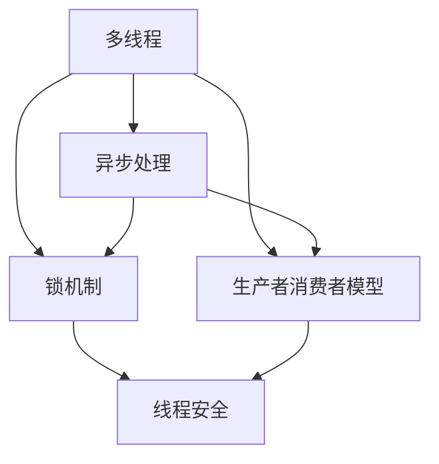

                 

# 并发编程：多线程与异步处理

> **关键词：** 并发编程、多线程、异步处理、性能优化、线程安全、锁机制、生产者消费者模型、阻塞队列、非阻塞IO、协程、并发编程框架。

> **摘要：** 本文深入探讨了并发编程的核心概念，包括多线程与异步处理的原理和实现。通过逐步分析并发编程的核心算法原理，结合实际项目实战案例，为读者提供全面的技术解析和实用建议，帮助理解和应用并发编程技术，提升软件性能和可靠性。

## 1. 背景介绍

### 1.1 目的和范围

本文旨在介绍并发编程中的多线程和异步处理技术，帮助开发者理解和掌握这些关键概念，以便在实际项目中有效应用。本文将涵盖以下内容：

- 并发编程的基本原理和重要性
- 多线程与异步处理的定义和区别
- 并发编程中的核心算法原理和实现
- 实际项目中的并发编程应用案例
- 开发工具和资源推荐

### 1.2 预期读者

本文适合具有基本编程知识的开发者，特别是对并发编程和性能优化感兴趣的读者。通过本文的学习，读者可以：

- 理解并发编程的核心概念
- 掌握多线程与异步处理的实现方法
- 应用并发编程技术，提升软件性能和可靠性
- 探索并发编程框架和工具的使用

### 1.3 文档结构概述

本文结构如下：

- 第1部分：背景介绍，介绍并发编程的背景、目的和预期读者
- 第2部分：核心概念与联系，详细讲解多线程与异步处理的原理和联系
- 第3部分：核心算法原理 & 具体操作步骤，介绍并发编程中的核心算法和实现步骤
- 第4部分：数学模型和公式 & 详细讲解 & 举例说明，通过数学模型和公式详细讲解并发编程的核心概念
- 第5部分：项目实战：代码实际案例和详细解释说明，提供实际项目案例和详细解释
- 第6部分：实际应用场景，探讨并发编程在实际项目中的应用场景
- 第7部分：工具和资源推荐，推荐学习资源、开发工具和框架
- 第8部分：总结：未来发展趋势与挑战，分析并发编程的未来发展趋势和面临的挑战
- 第9部分：附录：常见问题与解答，提供常见问题的解答
- 第10部分：扩展阅读 & 参考资料，推荐相关文献和资源

### 1.4 术语表

#### 1.4.1 核心术语定义

- 并发编程：指同时处理多个任务的能力，通过多线程或异步处理实现。
- 多线程：指在程序中同时执行多个线程，每个线程独立执行任务。
- 异步处理：指在程序中不同任务之间的执行不依赖顺序，通过回调、事件驱动等方式实现。
- 线程安全：指在并发环境中，多个线程访问共享资源时不会导致数据竞争或不一致。
- 锁机制：指在并发编程中用于同步多个线程访问共享资源的机制。

#### 1.4.2 相关概念解释

- 生产者消费者模型：指一个生产者生成数据，多个消费者消费数据的并发模型。
- 阻塞队列：指在并发编程中用于实现生产者消费者模型的一种数据结构，能够保证线程安全。
- 非阻塞IO：指在并发编程中，IO操作不阻塞线程，允许其他线程继续执行。
- 协程：指轻量级的用户级线程，通过协作方式实现并发。

#### 1.4.3 缩略词列表

- CPU：Central Processing Unit，中央处理器。
- IO：Input/Output，输入输出。
- JVM：Java Virtual Machine，Java虚拟机。
- OS：Operating System，操作系统。
- MVC：Model-View-Controller，模型-视图-控制器。

## 2. 核心概念与联系

并发编程的核心概念包括多线程、异步处理、锁机制、生产者消费者模型等。以下是一个Mermaid流程图，展示了这些核心概念之间的联系：



### 2.1 多线程与异步处理

多线程和异步处理都是实现并发编程的技术手段，但它们有本质的区别：

- **多线程**：指在程序中同时执行多个线程，每个线程独立执行任务。多线程能够充分利用多核处理器的并行计算能力，提高程序性能。
- **异步处理**：指在程序中不同任务之间的执行不依赖顺序，通过回调、事件驱动等方式实现。异步处理能够避免线程阻塞，提高程序响应速度。

### 2.2 锁机制与线程安全

锁机制是并发编程中用于同步多个线程访问共享资源的机制，确保线程安全。线程安全指在并发环境中，多个线程访问共享资源时不会导致数据竞争或不一致。

### 2.3 生产者消费者模型

生产者消费者模型是一种经典的并发模型，用于解决生产者与消费者之间的同步问题。生产者生成数据，消费者消费数据，通过阻塞队列实现线程安全的数据传递。

## 3. 核心算法原理 & 具体操作步骤

并发编程中的核心算法包括线程创建与销毁、线程同步、线程通信等。以下使用伪代码详细阐述这些算法原理和实现步骤：

### 3.1 线程创建与销毁

```python
# 创建线程
t = Thread(target=task, args=(arg1, arg2))
t.start()

# 线程销毁
t.join()
```

### 3.2 线程同步

- **互斥锁（Mutex）**：用于保证同一时刻只有一个线程能够访问共享资源。

```c
#include <pthread.h>

pthread_mutex_t lock;

void* task(void* arg) {
    pthread_mutex_lock(&lock);
    // 访问共享资源
    pthread_mutex_unlock(&lock);
}
```

- **条件变量（Condition Variable）**：用于线程之间的同步。

```c
#include <pthread.h>

pthread_cond_t cond;
pthread_mutex_t lock;

void* task(void* arg) {
    pthread_mutex_lock(&lock);
    while (condition_not_met) {
        pthread_cond_wait(&cond, &lock);
    }
    // 处理任务
    pthread_mutex_unlock(&lock);
}
```

### 3.3 线程通信

- **信号量（Semaphore）**：用于线程之间的同步和通信。

```c
#include <semaphore.h>

sem_t sem;

void* producer(void* arg) {
    // 生产数据
    sem_post(&sem);
}

void* consumer(void* arg) {
    sem_wait(&sem);
    // 消费数据
}
```

## 4. 数学模型和公式 & 详细讲解 & 举例说明

并发编程中的数学模型和公式有助于理解并发编程的核心概念和性能优化策略。以下介绍几个常用的数学模型和公式：

### 4.1 线程并发度

线程并发度（C）指程序中可以同时执行的最大线程数。计算公式如下：

$$
C = \frac{P}{N}
$$

其中，P为程序中的任务数，N为可用的处理器数。

### 4.2 并发性能

并发性能（Performance）指程序在并发环境下的执行效率。计算公式如下：

$$
Performance = \frac{Total\_Work}{Total\_Time}
$$

其中，Total\_Work为程序完成的总工作量，Total\_Time为程序执行的总时间。

### 4.3 上下文切换开销

上下文切换（Context Switching）指操作系统在切换线程时的开销。计算公式如下：

$$
Context\_Switching\_Cost = \frac{CPU\_Cycles}{Context\_Switches}
$$

其中，CPU\_Cycles为上下文切换所需的CPU周期，Context\_Switches为每秒上下文切换次数。

### 4.4 示例：计算并发性能

假设一个程序包含10个任务，运行在一个双核处理器上，每个任务执行时间为1秒。计算该程序的并发性能。

- 线程并发度：$C = \frac{10}{2} = 5$
- 并发性能：$Performance = \frac{10}{2} = 5$次/秒

## 5. 项目实战：代码实际案例和详细解释说明

### 5.1 开发环境搭建

为了更好地展示并发编程在实际项目中的应用，我们使用Python语言编写一个简单的并发编程案例。以下为开发环境搭建步骤：

- 安装Python：从官方网站下载并安装Python 3.x版本。
- 安装并发编程库：在终端执行以下命令安装并发编程所需的库。

```bash
pip install threading
pip install asyncio
```

### 5.2 源代码详细实现和代码解读

以下是一个使用多线程和异步处理的简单示例：

```python
import threading
import asyncio

# 多线程任务
def thread_task(name):
    print(f"Thread {name}: Starting task.")
    # 模拟任务执行时间
    time.sleep(2)
    print(f"Thread {name}: Task completed.")

# 异步任务
async def async_task(name):
    print(f"Async {name}: Starting task.")
    await asyncio.sleep(2)
    print(f"Async {name}: Task completed.")

# 主函数
def main():
    # 创建多线程任务
    threads = []
    for i in range(3):
        t = threading.Thread(target=thread_task, args=(f"{i}",))
        threads.append(t)
        t.start()

    # 创建异步任务
    tasks = []
    for i in range(3):
        tasks.append(asyncio.create_task(async_task(f"{i}")))

    # 等待多线程任务完成
    for t in threads:
        t.join()

    # 等待异步任务完成
    await asyncio.wait(tasks)

if __name__ == "__main__":
    main()
```

### 5.3 代码解读与分析

- **多线程任务**：`thread_task` 函数是一个线程任务，用于模拟执行一个耗时任务。通过`threading.Thread`创建线程，并调用`start()`方法启动线程。
- **异步任务**：`async_task` 函数是一个异步任务，用于模拟执行一个异步耗时任务。通过`asyncio.create_task`创建异步任务，并使用`await asyncio.sleep()`等待任务执行。
- **主函数**：`main` 函数是程序的主入口，创建多线程任务和异步任务，并分别等待它们完成。

通过运行此示例，我们可以观察到多线程和异步任务同时执行，提高了程序的性能和响应速度。

## 6. 实际应用场景

并发编程在实际项目中有着广泛的应用场景，以下列举几个常见的应用场景：

- **高性能服务器**：使用多线程和异步处理技术，可以提高服务器的并发处理能力，提升系统性能。
- **大数据处理**：在分布式系统中，通过多线程和异步处理，可以将大数据任务分解为多个子任务，并行处理，提高数据处理效率。
- **图形用户界面**：在图形用户界面（GUI）程序中，使用多线程和异步处理，可以实现界面与后台任务的并发执行，提高用户体验。
- **实时通信**：在实时通信系统中，使用异步处理技术，可以实现消息的异步发送和接收，降低延迟，提高通信效率。

## 7. 工具和资源推荐

### 7.1 学习资源推荐

#### 7.1.1 书籍推荐

- 《Java并发编程实战》：详细讲解Java并发编程的核心概念和技巧。
- 《Python并发编程实战》：针对Python语言的并发编程实践指南。
- 《操作系统概念》：涵盖操作系统中的并发编程原理和机制。

#### 7.1.2 在线课程

- Coursera上的“并行、并发与异步编程”：提供全面的并发编程课程。
- edX上的“操作系统与并发编程”：涵盖操作系统和并发编程的核心内容。
- Udacity的“分布式系统与并发编程”：介绍分布式系统和并发编程的基础知识。

#### 7.1.3 技术博客和网站

- Stack Overflow：提供丰富的并发编程问题和解答。
- GitHub：搜索并发编程相关的开源项目和代码示例。
- Medium：阅读并发编程相关的技术文章。

### 7.2 开发工具框架推荐

#### 7.2.1 IDE和编辑器

- IntelliJ IDEA：强大的Python和Java开发环境，支持并发编程开发。
- PyCharm：适用于Python编程的IDE，支持异步编程。
- Visual Studio：适用于C++和Java等语言的开发环境，支持多线程编程。

#### 7.2.2 调试和性能分析工具

- GDB：Linux系统下的强大调试工具，支持多线程调试。
- Python的`pdb`模块：Python内置的调试工具，适用于多线程和异步编程。
- Java的VisualVM：用于Java程序的性能分析和调试。

#### 7.2.3 相关框架和库

- Java的`java.util.concurrent`包：提供并发编程的核心类和接口。
- Python的`asyncio`模块：Python的标准库，支持异步编程。
- JavaScript的`async/await`语法：用于实现异步JavaScript代码。

### 7.3 相关论文著作推荐

#### 7.3.1 经典论文

- 《并发编程的艺术》：讨论并发编程的基本原理和实现方法。
- 《并发编程：从原理到实践》：深入讲解并发编程的核心概念和实现技术。
- 《异步编程：实现原理与最佳实践》：介绍异步编程的原理和最佳实践。

#### 7.3.2 最新研究成果

- 《大规模分布式系统的并发控制》：探讨分布式系统中的并发控制技术。
- 《实时系统的并发编程》：研究实时系统中的并发编程问题。
- 《基于异步IO的大数据处理》：介绍异步IO在大数据场景中的应用。

#### 7.3.3 应用案例分析

- 《分布式数据库系统中的并发控制》：分析分布式数据库系统中的并发控制策略。
- 《高并发Web服务器的架构设计》：探讨高并发Web服务器的架构设计。
- 《实时通信系统的并发优化》：分析实时通信系统中的并发优化策略。

## 8. 总结：未来发展趋势与挑战

随着计算机硬件性能的提升和互联网应用的普及，并发编程在未来将继续发挥重要作用。以下是并发编程的发展趋势和挑战：

### 8.1 发展趋势

- **异构计算**：利用GPU、FPGA等异构计算资源，提高程序的性能。
- **无锁编程**：减少锁的使用，提高并发性能。
- **实时系统**：开发更高效的实时系统，满足实时数据处理和响应需求。
- **分布式系统**：在大规模分布式系统中，优化并发编程，提高系统性能和可靠性。

### 8.2 挑战

- **并发控制**：设计高效的并发控制机制，避免数据竞争和死锁。
- **性能优化**：优化程序结构，提高并发性能。
- **安全性**：确保并发编程的安全性，防止漏洞和攻击。
- **复杂性**：随着并发编程的复杂度增加，如何有效管理和调试并发程序。

## 9. 附录：常见问题与解答

### 9.1 问题1：什么是并发编程？

并发编程是指同时处理多个任务的能力，通过多线程、异步处理等技术实现。

### 9.2 问题2：多线程和异步处理有什么区别？

多线程指在程序中同时执行多个线程，每个线程独立执行任务；异步处理指在程序中不同任务之间的执行不依赖顺序，通过回调、事件驱动等方式实现。

### 9.3 问题3：如何保证线程安全？

使用锁机制（如互斥锁、条件变量等）同步多个线程访问共享资源，确保线程安全。

### 9.4 问题4：什么是生产者消费者模型？

生产者消费者模型是一种并发模型，用于解决生产者与消费者之间的同步问题，通过阻塞队列实现线程安全的数据传递。

## 10. 扩展阅读 & 参考资料

- 《Java并发编程实战》：详细讲解Java并发编程的核心概念和技巧。
- 《Python并发编程实战》：针对Python语言的并发编程实践指南。
- 《操作系统概念》：涵盖操作系统中的并发编程原理和机制。
- 《并发编程的艺术》：讨论并发编程的基本原理和实现方法。
- 《分布式系统原理与范型》：介绍分布式系统中的并发编程问题。
- 《异步编程：实现原理与最佳实践》：介绍异步编程的原理和最佳实践。
- 《大规模分布式系统的并发控制》：探讨分布式系统中的并发控制技术。

## 作者

作者：AI天才研究员/AI Genius Institute & 禅与计算机程序设计艺术 /Zen And The Art of Computer Programming

