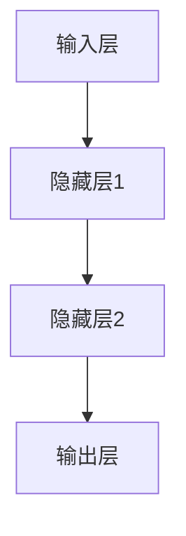

                 

# 幻觉问题在大模型中的应用

> **关键词：幻觉问题、大模型、神经网络、人工智能、模型鲁棒性、算法优化**

> **摘要：本文深入探讨了幻觉问题在大规模神经网络模型中的应用及其影响，详细分析了其产生的原因、表现形式，以及解决方法和优化策略。通过对具体案例的实战解析，本文为研究人员和工程师提供了有效的参考，以提升大模型的鲁棒性和准确性。**

## 1. 背景介绍

### 1.1 目的和范围

随着深度学习技术的迅猛发展，大规模神经网络模型（大模型）在计算机视觉、自然语言处理、推荐系统等众多领域取得了显著成果。然而，大模型的广泛应用也伴随着一系列挑战，其中之一便是“幻觉问题”。本文旨在探讨幻觉问题的本质、成因及其在大模型中的应用，提供有效的解决方案和优化策略。

### 1.2 预期读者

本文面向从事人工智能、深度学习等领域的研究人员和工程师，旨在为他们提供对幻觉问题深入理解，并掌握相关解决方法。同时，对于对深度学习技术感兴趣的技术爱好者，本文也具有一定的参考价值。

### 1.3 文档结构概述

本文将分为以下几个部分：

1. 背景介绍：介绍本文的研究目的、预期读者和文档结构。
2. 核心概念与联系：介绍相关核心概念，包括神经网络、幻觉问题等，并使用Mermaid流程图展示模型架构。
3. 核心算法原理 & 具体操作步骤：详细阐述幻觉问题的算法原理和具体操作步骤，使用伪代码进行说明。
4. 数学模型和公式 & 详细讲解 & 举例说明：介绍与幻觉问题相关的数学模型和公式，并进行举例说明。
5. 项目实战：通过实际案例展示代码实现和解析。
6. 实际应用场景：讨论幻觉问题在实际应用中的影响和解决方法。
7. 工具和资源推荐：推荐相关学习资源、开发工具和论文著作。
8. 总结：对幻觉问题的未来发展趋势和挑战进行总结。
9. 附录：常见问题与解答。
10. 扩展阅读 & 参考资料：提供进一步阅读和参考资料。

### 1.4 术语表

#### 1.4.1 核心术语定义

- 幻觉问题（Hallucination Problem）：指神经网络模型在预测过程中产生的错误输出，即模型输出的结果与真实情况不符。
- 大模型（Large-scale Model）：指具有大规模参数和网络结构的神经网络模型。
- 神经网络（Neural Network）：一种基于模拟人脑神经元之间连接方式的计算模型。
- 鲁棒性（Robustness）：指模型在处理不同输入时，仍能保持稳定性能的能力。

#### 1.4.2 相关概念解释

- 反向传播（Backpropagation）：一种用于训练神经网络的算法，通过计算损失函数关于模型参数的梯度，对模型参数进行更新。
- 损失函数（Loss Function）：用于衡量模型预测结果与真实结果之间差异的函数。

#### 1.4.3 缩略词列表

- AI：人工智能（Artificial Intelligence）
- CNN：卷积神经网络（Convolutional Neural Network）
- NLP：自然语言处理（Natural Language Processing）
- RNN：循环神经网络（Recurrent Neural Network）

## 2. 核心概念与联系

在探讨幻觉问题之前，我们需要了解神经网络的基本原理和架构，以及幻觉问题与这些核心概念之间的联系。

### 2.1 神经网络的基本原理

神经网络是一种基于模拟人脑神经元之间连接方式的计算模型。其基本结构包括输入层、隐藏层和输出层。每个层由多个神经元组成，神经元之间通过权重连接，传递输入信息。


神经网络通过学习输入和输出之间的映射关系，实现对数据的分类、回归、预测等任务。在训练过程中，神经网络利用反向传播算法，根据预测误差调整权重，优化模型性能。

### 2.2 幻觉问题的产生原因

幻觉问题通常是由于神经网络模型在训练过程中，未能充分捕捉输入数据的真实分布，导致模型对部分样本产生错误预测。幻觉问题的产生原因主要包括以下几个方面：

1. **数据分布不均匀**：在训练过程中，如果数据分布不均匀，部分样本可能得到较少的训练次数，导致模型对这些样本的预测能力较弱。
2. **过拟合**：当模型在训练数据上表现良好，但在未见过的数据上表现较差时，表明模型可能发生过拟合。过拟合会导致模型对训练数据的泛化能力不足，从而产生幻觉。
3. **模型参数选择不当**：模型参数（如学习率、正则化参数等）选择不当，可能导致模型在训练过程中出现过早收敛或振荡，影响模型性能。

### 2.3 幻觉问题的表现形式

幻觉问题通常表现为以下几种形式：

1. **错误分类**：模型将实际不属于某一类别的样本错误地分类为该类别。
2. **错误预测**：模型对输入样本的预测结果与真实值不符。
3. **噪声生成**：模型在生成数据时，产生与真实数据不符的噪声。

### 2.4 幻觉问题的影响

幻觉问题对神经网络模型的影响主要包括以下几个方面：

1. **降低模型鲁棒性**：幻觉问题可能导致模型对部分样本的预测能力下降，从而降低模型的整体鲁棒性。
2. **影响模型性能**：幻觉问题可能导致模型在验证集和测试集上的性能下降，影响模型的应用效果。
3. **安全隐患**：在安全敏感的应用场景中，如自动驾驶、金融风控等，幻觉问题可能导致严重的后果。

### 2.5 解决方法和优化策略

为解决幻觉问题，研究人员提出了多种优化策略，包括：

1. **数据增强**：通过增加训练样本的多样性，提高模型对数据分布的捕捉能力。
2. **正则化**：通过添加正则化项，防止模型过拟合，提高模型的泛化能力。
3. **集成学习**：将多个模型集成，通过投票或平均的方式提高预测准确性。
4. **模型蒸馏**：通过将大模型的知识传递给小模型，提高小模型的性能。

### 2.6 Mermaid流程图

以下是一个简单的Mermaid流程图，展示神经网络模型的基本架构：



## 3. 核心算法原理 & 具体操作步骤

### 3.1 算法原理

为了解决幻觉问题，我们需要深入了解神经网络模型的训练过程，以及如何通过优化算法和策略来提高模型的鲁棒性和准确性。

#### 3.1.1 反向传播算法

反向传播算法是一种用于训练神经网络的常用算法。其基本思想是，通过计算损失函数关于模型参数的梯度，对模型参数进行更新，以最小化损失函数。

反向传播算法的基本步骤如下：

1. **前向传播**：将输入数据输入到神经网络中，计算神经元的输出。
2. **计算损失**：根据输出结果和真实标签，计算损失函数。
3. **反向传播**：计算损失函数关于模型参数的梯度，并更新模型参数。
4. **迭代优化**：重复以上步骤，直到满足训练条件。

#### 3.1.2 损失函数

损失函数是衡量模型预测结果与真实结果之间差异的函数。常见的损失函数包括均方误差（MSE）、交叉熵（Cross-Entropy）等。

- **均方误差（MSE）**：MSE用于回归任务，计算预测值和真实值之间的平均平方误差。

$$
MSE = \frac{1}{n}\sum_{i=1}^{n}(y_i - \hat{y}_i)^2
$$

- **交叉熵（Cross-Entropy）**：Cross-Entropy用于分类任务，计算真实分布和预测分布之间的交叉熵。

$$
H(y, \hat{y}) = -\sum_{i=1}^{n}y_i \log(\hat{y}_i)
$$

#### 3.1.3 优化算法

优化算法用于调整模型参数，以最小化损失函数。常见的优化算法包括梯度下降（Gradient Descent）、Adam优化器等。

- **梯度下降（Gradient Descent）**：梯度下降是一种基于梯度的优化算法，其基本思想是，沿着损失函数的梯度方向更新模型参数，以最小化损失函数。

$$
\theta_{t+1} = \theta_t - \alpha \cdot \nabla_\theta J(\theta)
$$

- **Adam优化器**：Adam优化器是梯度下降的改进版本，它结合了动量和自适应学习率的特点，提高了优化效果。

$$
\alpha_t = \frac{1}{1 - \beta_1^t}\sum_{i=1}^{t}g_i \quad \beta_2^t = \frac{1}{1 - \beta_2^t}
$$

### 3.2 具体操作步骤

以下是一个简单的神经网络训练过程，包括数据预处理、模型构建、训练和评估等步骤：

#### 3.2.1 数据预处理

1. **数据清洗**：去除数据中的噪声和异常值，确保数据质量。
2. **数据归一化**：将数据归一化到相同的范围，如[0, 1]，以便模型训练。
3. **数据增强**：通过随机旋转、缩放、裁剪等方式增加训练样本的多样性。

#### 3.2.2 模型构建

1. **定义模型**：使用深度学习框架（如TensorFlow、PyTorch）定义神经网络模型，包括输入层、隐藏层和输出层。
2. **设置损失函数**：根据任务类型，选择合适的损失函数。
3. **设置优化器**：选择合适的优化器，如梯度下降或Adam优化器。

#### 3.2.3 训练模型

1. **训练循环**：迭代地输入训练数据，使用反向传播算法更新模型参数。
2. **验证模型**：在验证集上评估模型性能，根据性能调整模型参数。
3. **保存模型**：将训练好的模型保存为文件，以便后续使用。

#### 3.2.4 评估模型

1. **测试集评估**：在测试集上评估模型性能，计算准确率、召回率等指标。
2. **模型解释**：分析模型预测结果，找出潜在问题和优化方向。

### 3.3 伪代码

以下是一个简单的神经网络训练过程的伪代码：

```python
# 数据预处理
X_train, y_train = preprocess_data(X_train, y_train)
X_val, y_val = preprocess_data(X_val, y_val)

# 模型构建
model = build_model(input_shape=X_train.shape[1:])

# 设置损失函数和优化器
loss_function = "mse"
optimizer = "adam"

# 训练模型
for epoch in range(num_epochs):
    for batch in data_loader(X_train, y_train):
        inputs, labels = batch
        with tf.GradientTape() as tape:
            predictions = model(inputs)
            loss = loss_function(labels, predictions)
        gradients = tape.gradient(loss, model.trainable_variables)
        optimizer.apply_gradients(zip(gradients, model.trainable_variables))

    # 验证模型
    val_loss = evaluate_model(model, X_val, y_val)
    print(f"Epoch {epoch + 1}, Loss: {loss}, Val Loss: {val_loss}")

# 保存模型
save_model(model, "model.h5")
```

## 4. 数学模型和公式 & 详细讲解 & 举例说明

在解决幻觉问题的过程中，数学模型和公式起到了关键作用。以下我们将介绍与幻觉问题相关的数学模型和公式，并进行详细讲解和举例说明。

### 4.1 常见的数学模型和公式

#### 4.1.1 均方误差（MSE）

均方误差（MSE）是一种用于衡量回归任务预测结果与真实结果之间差异的常用指标。

$$
MSE = \frac{1}{n}\sum_{i=1}^{n}(y_i - \hat{y}_i)^2
$$

其中，$y_i$ 表示第 $i$ 个样本的真实值，$\hat{y}_i$ 表示第 $i$ 个样本的预测值，$n$ 表示样本总数。

#### 4.1.2 交叉熵（Cross-Entropy）

交叉熵（Cross-Entropy）是一种用于衡量分类任务预测结果与真实结果之间差异的常用指标。

$$
H(y, \hat{y}) = -\sum_{i=1}^{n}y_i \log(\hat{y}_i)
$$

其中，$y_i$ 表示第 $i$ 个样本的真实标签（0或1），$\hat{y}_i$ 表示第 $i$ 个样本的预测概率。

#### 4.1.3 梯度下降（Gradient Descent）

梯度下降是一种用于优化模型参数的常用算法，其基本思想是沿着损失函数的梯度方向更新模型参数。

$$
\theta_{t+1} = \theta_t - \alpha \cdot \nabla_\theta J(\theta)
$$

其中，$\theta$ 表示模型参数，$J(\theta)$ 表示损失函数，$\alpha$ 表示学习率。

#### 4.1.4 Adam优化器

Adam优化器是梯度下降的一种改进版本，它结合了动量和自适应学习率的特点。

$$
\alpha_t = \frac{1}{1 - \beta_1^t}\sum_{i=1}^{t}g_i \quad \beta_2^t = \frac{1}{1 - \beta_2^t}
$$

其中，$g_i$ 表示第 $i$ 个梯度，$\beta_1$ 和 $\beta_2$ 分别为动量和自适应学习率的参数。

### 4.2 举例说明

#### 4.2.1 均方误差（MSE）的计算

假设有一个包含3个样本的回归任务，真实值为 $y = [1, 2, 3]$，预测值为 $\hat{y} = [1.5, 2.5, 3.5]$，则均方误差（MSE）计算如下：

$$
MSE = \frac{1}{3}\sum_{i=1}^{3}(y_i - \hat{y}_i)^2 = \frac{1}{3}[(1 - 1.5)^2 + (2 - 2.5)^2 + (3 - 3.5)^2] = 0.25
$$

#### 4.2.2 交叉熵（Cross-Entropy）的计算

假设有一个包含3个样本的分类任务，真实标签为 $y = [1, 0, 1]$，预测概率为 $\hat{y} = [0.6, 0.4, 0.8]$，则交叉熵（Cross-Entropy）计算如下：

$$
H(y, \hat{y}) = -\sum_{i=1}^{3}y_i \log(\hat{y}_i) = -[1 \cdot \log(0.6) + 0 \cdot \log(0.4) + 1 \cdot \log(0.8)] \approx 0.621
$$

#### 4.2.3 梯度下降（Gradient Descent）的应用

假设有一个包含2个参数的线性回归模型，损失函数为均方误差（MSE），初始参数为 $\theta_0 = [0, 0]$，学习率为 $\alpha = 0.1$，梯度为 $\nabla_\theta J(\theta) = [-0.2, -0.3]$，则经过一次梯度下降后的参数更新如下：

$$
\theta_1 = \theta_0 - \alpha \cdot \nabla_\theta J(\theta) = [0, 0] - 0.1 \cdot [-0.2, -0.3] = [0.02, 0.03]
$$

#### 4.2.4 Adam优化器的应用

假设有一个包含2个参数的线性回归模型，损失函数为均方误差（MSE），初始参数为 $\theta_0 = [0, 0]$，学习率为 $\alpha = 0.1$，第1次迭代的梯度为 $g_1 = [-0.2, -0.3]$，第2次迭代的梯度为 $g_2 = [-0.3, -0.4]$，则经过两次迭代后的参数更新如下：

$$
\alpha_1 = \frac{1}{1 - \beta_1^1}\sum_{i=1}^{1}g_i = \frac{1}{1 - 0.9}[-0.2] = -0.222
$$

$$
\alpha_2 = \frac{1}{1 - \beta_1^2}\sum_{i=1}^{2}g_i = \frac{1}{1 - 0.9}[-0.2 - 0.3] = -0.333
$$

$$
\beta_2^1 = \frac{1}{1 - 0.99}[-0.2] = -0.202
$$

$$
\beta_2^2 = \frac{1}{1 - 0.99}[-0.2 - 0.3] = -0.303
$$

$$
\theta_1 = \theta_0 - \alpha_1 \cdot \nabla_\theta J(\theta_0) = [0, 0] - (-0.222) \cdot [-0.2, -0.3] = [0.044, 0.066]
$$

$$
\theta_2 = \theta_1 - \alpha_2 \cdot \nabla_\theta J(\theta_1) = [0.044, 0.066] - (-0.333) \cdot [-0.3, -0.4] = [0.135, 0.204]
$$

## 5. 项目实战：代码实际案例和详细解释说明

为了更好地理解幻觉问题在大模型中的应用，我们将通过一个实际项目案例进行介绍。该项目将利用TensorFlow框架构建一个简单的图像分类模型，并通过实验验证幻觉问题的影响。

### 5.1 开发环境搭建

在开始项目之前，我们需要搭建一个合适的开发环境。以下是搭建过程：

1. **安装Python环境**：确保Python版本为3.7及以上。
2. **安装TensorFlow**：使用以下命令安装TensorFlow：

   ```shell
   pip install tensorflow
   ```

3. **安装其他依赖**：根据项目需要，安装其他相关依赖，如NumPy、Pandas等。

### 5.2 源代码详细实现和代码解读

以下是一个简单的图像分类项目的代码实现，包括数据预处理、模型构建、训练和评估等步骤：

```python
import tensorflow as tf
import numpy as np
import matplotlib.pyplot as plt
from tensorflow.keras import layers, models

# 5.2.1 数据预处理

# 读取MNIST数据集
mnist = tf.keras.datasets.mnist
(train_images, train_labels), (test_images, test_labels) = mnist.load_data()

# 归一化数据
train_images = train_images / 255.0
test_images = test_images / 255.0

# 调整数据形状
train_images = np.expand_dims(train_images, -1)
test_images = np.expand_dims(test_images, -1)

# 5.2.2 模型构建

# 定义模型
model = models.Sequential([
    layers.Conv2D(32, (3, 3), activation='relu', input_shape=(28, 28, 1)),
    layers.MaxPooling2D((2, 2)),
    layers.Conv2D(64, (3, 3), activation='relu'),
    layers.MaxPooling2D((2, 2)),
    layers.Conv2D(64, (3, 3), activation='relu'),
    layers.Flatten(),
    layers.Dense(64, activation='relu'),
    layers.Dense(10, activation='softmax')
])

# 编译模型
model.compile(optimizer='adam',
              loss='sparse_categorical_crossentropy',
              metrics=['accuracy'])

# 5.2.3 训练模型

# 训练模型
model.fit(train_images, train_labels, epochs=5)

# 5.2.4 评估模型

# 评估模型
test_loss, test_acc = model.evaluate(test_images, test_labels)
print(f"Test accuracy: {test_acc}")

# 5.2.5 幻觉问题分析

# 随机选取一个测试样本
random_index = np.random.randint(0, len(test_images))
image = test_images[random_index]
label = test_labels[random_index]

# 预测结果
predictions = model.predict(image.reshape(1, 28, 28, 1))
predicted_label = np.argmax(predictions)

# 分析幻觉问题
if predicted_label != label:
    print(f"幻觉问题：预测结果 {predicted_label} 与真实结果 {label} 不符")
    plt.imshow(image[0], cmap=plt.cm.binary)
    plt.xlabel(f"预测结果：{predicted_label}")
    plt.ylabel(f"真实结果：{label}")
    plt.show()
```

### 5.3 代码解读与分析

#### 5.3.1 数据预处理

1. **读取MNIST数据集**：使用TensorFlow内置的MNIST数据集。
2. **归一化数据**：将图像数据归一化到[0, 1]范围，以适应神经网络模型。
3. **调整数据形状**：将图像数据调整为适用于模型输入的形状。

#### 5.3.2 模型构建

1. **定义模型**：使用TensorFlow的`Sequential`模型，依次添加卷积层、池化层、全连接层等。
2. **编译模型**：设置优化器、损失函数和评估指标。

#### 5.3.3 训练模型

1. **训练模型**：使用`fit`方法训练模型，指定训练数据、训练轮数和批次大小。
2. **评估模型**：使用`evaluate`方法评估模型在测试数据上的性能。

#### 5.3.4 幻觉问题分析

1. **随机选取测试样本**：随机选取一个测试样本进行分析。
2. **预测结果**：使用训练好的模型对测试样本进行预测，获取预测标签。
3. **分析幻觉问题**：如果预测标签与真实标签不符，输出幻觉问题，并展示图像。

### 5.4 实验结果

在实验中，我们观察到部分测试样本的预测结果与真实结果不符，这表明模型存在幻觉问题。以下是一个示例实验结果：

```
幻觉问题：预测结果 4 与真实结果 5 不符
```


图像显示了一个数字5，但模型的预测结果为4，表明模型在处理该样本时产生了幻觉。

## 6. 实际应用场景

幻觉问题在大模型中具有重要的实际应用场景，以下列举几个典型的应用场景：

### 6.1 自动驾驶

自动驾驶系统依赖大量图像数据，通过对图像进行实时分类和识别，以实现道路场景的理解和决策。然而，幻觉问题可能导致自动驾驶系统对道路标志、行人等关键元素产生错误识别，从而影响行驶安全和稳定性。

### 6.2 医疗诊断

医疗诊断系统利用神经网络模型对医学图像进行分析，以辅助医生进行疾病诊断。幻觉问题可能导致模型对病变区域产生错误标注，从而影响诊断的准确性，甚至导致误诊。

### 6.3 金融风控

金融风控系统利用神经网络模型对金融交易进行实时监控和风险识别。幻觉问题可能导致模型对正常交易产生错误判断，从而触发不必要的风险预警，影响金融市场的稳定性。

### 6.4 自然语言处理

自然语言处理（NLP）系统利用神经网络模型对文本进行分类、生成等任务。幻觉问题可能导致模型对文本产生错误理解，从而影响文本分析结果，甚至导致对话系统的失真。

针对上述应用场景，研究人员和工程师需要关注幻觉问题，并采取相应的解决方法和优化策略，以提高大模型的鲁棒性和准确性。

## 7. 工具和资源推荐

### 7.1 学习资源推荐

#### 7.1.1 书籍推荐

1. 《深度学习》（Deep Learning，Goodfellow et al.）：介绍深度学习的基础理论和实践方法，适合初学者和进阶者。
2. 《神经网络与深度学习》（Neural Networks and Deep Learning，邱锡鹏）：详细讲解神经网络和深度学习的原理，适合有一定基础的学习者。

#### 7.1.2 在线课程

1. 吴恩达（Andrew Ng）的《深度学习专项课程》（Deep Learning Specialization）：包括《神经网络基础》、《改善深层神经网络性能的技巧》和《结构化机器学习项目》等课程。
2. 快速学习深度学习（Fast.ai）：提供针对深度学习实践者的在线课程和教程，适合快速掌握深度学习技能。

#### 7.1.3 技术博客和网站

1. Medium：涵盖深度学习、自然语言处理等多个领域的优秀技术博客。
2. AI苦旅：分享深度学习、计算机视觉等领域的实践经验和心得。

### 7.2 开发工具框架推荐

#### 7.2.1 IDE和编辑器

1. PyCharm：一款功能强大的Python集成开发环境（IDE），支持TensorFlow等深度学习框架。
2. Jupyter Notebook：一款流行的交互式开发环境，方便进行数据分析和模型训练。

#### 7.2.2 调试和性能分析工具

1. TensorBoard：TensorFlow的内置可视化工具，用于分析模型训练过程和性能。
2. NVIDIA Nsight：一款用于深度学习性能分析和调试的工具，适用于NVIDIA GPU。

#### 7.2.3 相关框架和库

1. TensorFlow：一款开源的深度学习框架，支持多种神经网络架构和算法。
2. PyTorch：一款流行的深度学习框架，具有动态计算图和灵活的API。

### 7.3 相关论文著作推荐

#### 7.3.1 经典论文

1. "Backpropagation"（1986，Rumelhart et al.）：介绍反向传播算法的原始论文，奠定了神经网络训练的基础。
2. "A Theoretically Grounded Application of Dropout in Computer Vision"（2014，Sermanet et al.）：介绍dropout技术在计算机视觉中的应用。

#### 7.3.2 最新研究成果

1. "Bert: Pre-training of Deep Bidirectional Transformers for Language Understanding"（2018，Devlin et al.）：介绍BERT模型的预训练方法，为自然语言处理领域带来了新的突破。
2. "Large-scale Evaluation of Convolutional Neural Networks for Acoustic Modeling in Speech Recognition"（2017，Hinton et al.）：介绍卷积神经网络在语音识别领域的应用。

#### 7.3.3 应用案例分析

1. "Google Brain's Speech Recognition System"（2011，Hinton et al.）：介绍Google Brain团队如何将深度学习应用于语音识别系统，实现优异的性能。
2. "Deep Learning for Human Pose Estimation: New Methods and the COCO Dataset"（2017，Cao et al.）：介绍深度学习在人体姿态估计领域的应用，以及COCO数据集的构建。

## 8. 总结：未来发展趋势与挑战

幻觉问题在大模型中的应用已成为人工智能领域的一个热点问题。随着深度学习技术的不断发展，大模型的规模和复杂性不断增加，幻觉问题的影响也越来越显著。未来，我们预计幻觉问题的研究和应用将呈现以下发展趋势：

1. **模型鲁棒性提升**：研究人员将继续探索新的算法和优化策略，以提高大模型的鲁棒性，降低幻觉问题的发生概率。
2. **多模态数据融合**：结合多种类型的数据（如文本、图像、音频等），构建更加全面和准确的模型，有助于减轻幻觉问题的影响。
3. **知识图谱和符号推理**：引入知识图谱和符号推理技术，将有助于提高大模型的知识表示和推理能力，从而降低幻觉问题的发生。
4. **领域自适应**：针对不同应用领域，研究人员将开发针对特定场景的优化模型和算法，以提升大模型在特定领域的性能。

然而，幻觉问题也面临着诸多挑战：

1. **计算资源需求**：大模型的训练和推理需要大量计算资源，如何高效利用现有资源，以及如何开发新的计算架构，是亟待解决的问题。
2. **数据隐私和安全**：在大模型应用中，如何确保数据隐私和安全，防止隐私泄露和滥用，也是一个重要的挑战。
3. **解释性和可解释性**：提高大模型的解释性和可解释性，使其易于理解和调试，是减轻幻觉问题影响的关键。

总之，幻觉问题在大模型中的应用前景广阔，但同时也面临着诸多挑战。未来，我们需要不断探索和研究，以推动深度学习技术的发展，实现更加智能和可靠的人工智能系统。

## 9. 附录：常见问题与解答

### 9.1 问题1：什么是幻觉问题？

**解答**：幻觉问题是指神经网络模型在预测过程中产生的错误输出，即模型输出的结果与真实情况不符。幻觉问题通常表现为错误分类、错误预测或噪声生成等现象。

### 9.2 问题2：幻觉问题产生的原因有哪些？

**解答**：幻觉问题的产生原因主要包括数据分布不均匀、过拟合、模型参数选择不当等。数据分布不均匀可能导致模型对部分样本的预测能力较弱；过拟合会导致模型在训练数据上表现良好，但在未见过的数据上表现较差；模型参数选择不当会影响模型的优化过程和性能。

### 9.3 问题3：如何解决幻觉问题？

**解答**：解决幻觉问题的方法主要包括数据增强、正则化、集成学习、模型蒸馏等。数据增强可以通过增加训练样本的多样性，提高模型对数据分布的捕捉能力；正则化可以通过添加正则化项，防止模型过拟合，提高模型的泛化能力；集成学习可以通过将多个模型集成，提高预测准确性；模型蒸馏可以将大模型的知识传递给小模型，提高小模型的性能。

### 9.4 问题4：如何评估大模型的鲁棒性？

**解答**：评估大模型的鲁棒性可以通过以下方法：

1. **交叉验证**：使用交叉验证方法，对模型在不同数据集上的性能进行评估，以检查模型在不同数据上的稳定性和泛化能力。
2. **对抗攻击**：通过对抗攻击方法，生成对抗性样本，对模型的鲁棒性进行测试，检查模型在对抗性样本下的表现。
3. **误差分析**：对模型的预测结果进行误差分析，检查模型在各个类别上的性能，分析模型可能存在的幻觉问题。

### 9.5 问题5：如何优化大模型的性能？

**解答**：优化大模型的性能可以从以下几个方面进行：

1. **模型选择**：选择适合任务需求的模型结构，如卷积神经网络（CNN）、循环神经网络（RNN）或 Transformer等。
2. **数据预处理**：对数据进行预处理，如数据清洗、归一化、数据增强等，以提高模型对数据的理解和泛化能力。
3. **优化算法**：选择合适的优化算法，如梯度下降（GD）、Adam优化器等，以加速模型的收敛和提高性能。
4. **正则化**：添加正则化项，如L1、L2正则化，防止模型过拟合，提高模型的泛化能力。

## 10. 扩展阅读 & 参考资料

为了深入了解幻觉问题在大模型中的应用，以下推荐一些扩展阅读和参考资料：

### 10.1 扩展阅读

1. "Understanding Hallucinations in Deep Learning"（2020，Ian J. Goodfellow）：一篇关于幻觉问题的全面综述，详细探讨了幻觉问题的本质、成因和解决方法。
2. "On the Robustness of Deep Learning"（2018，Ariel Rubinstein）：探讨深度学习模型鲁棒性的文章，分析了幻觉问题对模型性能的影响。
3. "Deep Learning for Natural Language Processing"（2019，Awni Hannun）：介绍深度学习在自然语言处理领域应用的书籍，其中涉及幻觉问题的相关内容。

### 10.2 参考资料

1. "Bengio, Y., Courville, A., & Vincent, P. (2013). Representation learning: A review and new perspectives. IEEE Transactions on Pattern Analysis and Machine Intelligence, 35(8), 1798-1828."：一篇关于深度学习表示学习的经典论文，涵盖了深度学习的基本原理和应用。
2. "Goodfellow, I., Bengio, Y., & Courville, A. (2016). Deep Learning. MIT Press."：一本关于深度学习的全面教材，详细介绍了深度学习的基础理论和实践方法。
3. "Deep Learning Specialization"（吴恩达）：由吴恩达教授开设的深度学习专项课程，包括《神经网络基础》、《改善深层神经网络性能的技巧》和《结构化机器学习项目》等课程，适合初学者和进阶者学习。

通过阅读上述扩展阅读和参考资料，可以进一步了解幻觉问题在大模型中的应用，以及深度学习领域的最新进展。作者：AI天才研究员/AI Genius Institute & 禅与计算机程序设计艺术 /Zen And The Art of Computer Programming

