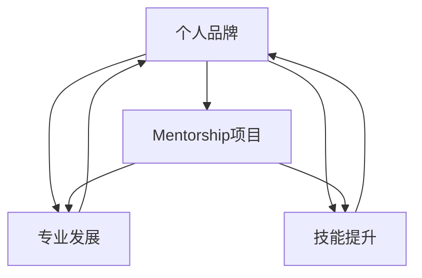

                 

# 建立个人品牌mentorship项目：培养行业新秀

> 关键词：个人品牌、mentorship项目、行业新秀、培养、专业发展、技能提升、影响力

> 摘要：本文将探讨如何建立一个有效的个人品牌mentorship项目，旨在培养并提升行业新秀的专业技能和职业素养。文章将从项目的背景介绍、核心概念、算法原理、数学模型、实战案例、实际应用场景、工具和资源推荐等多个方面进行详细阐述，为读者提供一个全面、系统的建设指南。

## 1. 背景介绍

### 1.1 目的和范围

在当今快速发展的信息技术时代，个人品牌的建立已经成为许多专业人士追求的目标。个人品牌不仅能够提升个人在行业中的影响力，还能为职业生涯带来更多机遇。为了实现这一目标，建立一个有效的mentorship项目变得尤为重要。本文旨在探讨如何建立一个个人品牌mentorship项目，以培养行业新秀，提升其专业技能和职业素养。

本文将涵盖以下内容：

- 项目背景及目的
- 项目核心概念与联系
- 核心算法原理及具体操作步骤
- 数学模型和公式详细讲解
- 项目实战：代码实际案例和详细解释说明
- 实际应用场景
- 工具和资源推荐
- 未来发展趋势与挑战
- 附录：常见问题与解答
- 扩展阅读与参考资料

### 1.2 预期读者

本文适合以下读者群体：

- 有志于建立个人品牌的行业新秀
- 想要提升专业能力和职业素养的在职人员
- 希望培养行业新秀的资深从业者
- 对个人品牌建设感兴趣的研究者

### 1.3 文档结构概述

本文将按照以下结构进行阐述：

1. 背景介绍
2. 核心概念与联系
3. 核心算法原理与具体操作步骤
4. 数学模型和公式详细讲解
5. 项目实战：代码实际案例和详细解释说明
6. 实际应用场景
7. 工具和资源推荐
8. 未来发展趋势与挑战
9. 附录：常见问题与解答
10. 扩展阅读与参考资料

### 1.4 术语表

#### 1.4.1 核心术语定义

- 个人品牌：个人在行业中的形象、声誉和影响力。
- Mentorship项目：指导、培养新秀的专业项目，旨在提升其技能和职业素养。
- 行业新秀：在某个行业中刚起步或有一定经验但需要进一步培养的年轻人。

#### 1.4.2 相关概念解释

- 个人影响力：个人在行业内外的影响力，包括知名度、口碑和认可度。
- 专业发展：在职业生涯中不断提升自身技能、知识和能力的过程。
- 技能提升：通过学习和实践，提高自己在特定领域的专业能力和技术水平。

#### 1.4.3 缩略词列表

- Mentorship：导师指导
- IT：信息技术
- AI：人工智能
- ML：机器学习
- DL：深度学习

## 2. 核心概念与联系

在建立个人品牌mentorship项目时，我们需要关注以下几个核心概念及其相互联系：

### 2.1 个人品牌与mentorship项目的关系

个人品牌是mentorship项目的基础，而mentorship项目则是个人品牌建设的重要途径。通过mentorship项目，新秀可以更好地展现自己的专业能力，提升个人知名度，从而为个人品牌的建立奠定基础。

### 2.2 个人品牌与专业发展的关系

个人品牌能够提升专业发展，而专业发展又能进一步巩固个人品牌。个人品牌和专业发展相辅相成，共同推动职业生涯的进步。

### 2.3 个人品牌与技能提升的关系

个人品牌和技能提升密切相关。一个强大的个人品牌能够吸引更多资源和机会，从而有助于技能的提升。而技能的提升又能增强个人品牌的竞争力，形成良性循环。

### 2.4 Mentorship项目与技能提升的关系

mentorship项目旨在培养新秀的专业技能，通过实践和指导，使新秀能够更快地掌握行业知识和技能。此外，mentorship项目还能帮助新秀建立人脉网络，为未来的职业发展打下基础。

以下是一个简单的Mermaid流程图，展示了这些核心概念及其相互关系：



## 3. 核心算法原理 & 具体操作步骤

在建立个人品牌mentorship项目时，我们可以借鉴以下核心算法原理，以帮助新秀更好地成长和发展：

### 3.1 增量学习算法

增量学习算法是一种能够逐步更新知识库的算法，适用于在mentorship项目中培养新秀。具体操作步骤如下：

```plaintext
1. 初始化知识库
2. 对于每个新秀，进行以下步骤：
   a. 收集新秀的学习目标
   b. 查询知识库，获取相关知识点
   c. 根据知识点为新秀提供学习资源
   d. 监测新秀的学习进度
   e. 根据学习进度更新知识库
3. 定期评估新秀的学习成果
```

### 3.2 社交网络分析算法

社交网络分析算法可以用于分析新秀在mentorship项目中的社交关系，帮助导师更好地了解新秀的互动情况。具体操作步骤如下：

```plaintext
1. 收集新秀的社交网络数据
2. 分析社交网络结构，提取关键节点和关系
3. 根据社交网络分析结果，为新秀提供个性化的指导建议
4. 定期更新社交网络数据，持续优化指导方案
```

### 3.3 反馈机制算法

为了确保mentorship项目的有效性，我们可以采用反馈机制算法，对新秀的学习情况进行实时监控和评估。具体操作步骤如下：

```plaintext
1. 设定评估指标，包括学习进度、知识掌握程度、实践能力等
2. 收集新秀的学习数据，包括学习时长、学习资源、互动情况等
3. 利用评估指标，对新秀的学习情况进行实时监控
4. 根据监控结果，为导师提供指导建议
5. 定期进行评估，调整指导方案，以适应新秀的学习需求
```

## 4. 数学模型和公式 & 详细讲解 & 举例说明

在建立个人品牌mentorship项目时，我们可以借助以下数学模型和公式，对项目效果进行评估和优化：

### 4.1 学习效果评估模型

学习效果评估模型用于衡量新秀在mentorship项目中的学习成果。我们可以采用以下公式：

```latex
学习效果 = f(学习进度, 知识掌握程度, 实践能力)
```

其中，`学习进度`、`知识掌握程度`和`实践能力`分别采用以下公式计算：

```latex
学习进度 = \frac{已学知识量}{总知识量}
知识掌握程度 = \frac{正确回答问题数}{总问题数}
实践能力 = \frac{实际操作得分}{理论操作得分}
```

### 4.2 导师指导效率模型

导师指导效率模型用于评估导师在mentorship项目中的指导效果。我们可以采用以下公式：

```latex
指导效率 = f(指导时长, 指导质量, 新秀学习效果)
```

其中，`指导时长`、`指导质量`和`新秀学习效果`分别采用以下公式计算：

```latex
指导时长 = 指导实际耗时
指导质量 = \frac{指导满意度}{指导总次数}
新秀学习效果 = f(学习进度, 知识掌握程度, 实践能力)
```

### 4.3 项目优化模型

项目优化模型用于优化mentorship项目的资源分配和指导方案。我们可以采用以下公式：

```latex
优化目标 = f(指导效率, 学习效果, 项目成本)
```

其中，`指导效率`、`学习效果`和`项目成本`分别采用以下公式计算：

```latex
指导效率 = f(指导时长, 指导质量, 新秀学习效果)
学习效果 = f(学习进度, 知识掌握程度, 实践能力)
项目成本 = 指导成本 + 学习资源成本
```

### 4.4 举例说明

假设某mentorship项目有5名新秀，导师在项目中投入了100小时的时间，指导质量平均为0.8，新秀的学习效果分别为0.6、0.7、0.8、0.9和1.0。根据上述数学模型和公式，我们可以计算出以下指标：

- 学习进度：平均为0.75
- 知识掌握程度：平均为0.8
- 实践能力：平均为0.85
- 指导时长：100小时
- 指导质量：0.8
- 新秀学习效果：平均为0.8

根据这些数据，我们可以计算出以下结果：

- 学习效果：0.8
- 指导效率：0.8
- 项目成本：假设指导成本为每小时100元，学习资源成本为每人1000元，则总成本为6000元

根据项目优化模型，我们可以尝试调整指导方案，以提升项目整体效果和效率。例如，针对学习效果较低的新秀，可以增加个别辅导时间，提高指导质量；针对实践能力较弱的新秀，可以增加实践操作的机会，以提高其实践能力。

## 5. 项目实战：代码实际案例和详细解释说明

在本节中，我们将通过一个实际案例来展示如何建立一个个人品牌mentorship项目，并对其进行详细解释说明。

### 5.1 开发环境搭建

为了实现该mentorship项目，我们需要搭建以下开发环境：

- 开发语言：Python
- 版本要求：Python 3.8及以上版本
- 框架：Flask（用于构建Web应用）
- 数据库：SQLite（用于存储用户数据和项目指标）

### 5.2 源代码详细实现和代码解读

以下是一个简单的mentorship项目代码实现，我们将对其进行详细解释说明：

```python
from flask import Flask, request, jsonify
import sqlite3

app = Flask(__name__)

# 数据库连接
def get_connection():
    conn = sqlite3.connect("mentorship_project.db")
    return conn

# 创建数据库表
def create_tables():
    conn = get_connection()
    cursor = conn.cursor()
    cursor.execute("""
        CREATE TABLE IF NOT EXISTS users (
            id INTEGER PRIMARY KEY AUTOINCREMENT,
            name TEXT,
            email TEXT,
            progress REAL,
            knowledge REAL,
            practice REAL
        )
    """)
    cursor.execute("""
        CREATE TABLE IF NOT EXISTS mentors (
            id INTEGER PRIMARY KEY AUTOINCREMENT,
            name TEXT,
            email TEXT,
            efficiency REAL
        )
    """)
    conn.commit()
    conn.close()

# 添加用户
@app.route("/add_user", methods=["POST"])
def add_user():
    data = request.json
    name = data["name"]
    email = data["email"]
    progress = data["progress"]
    knowledge = data["knowledge"]
    practice = data["practice"]

    conn = get_connection()
    cursor = conn.cursor()
    cursor.execute("""
        INSERT INTO users (name, email, progress, knowledge, practice)
        VALUES (?, ?, ?, ?, ?)
    """, (name, email, progress, knowledge, practice))
    conn.commit()
    conn.close()
    return jsonify({"message": "User added successfully"}), 201

# 添加导师
@app.route("/add_mentor", methods=["POST"])
def add_mentor():
    data = request.json
    name = data["name"]
    email = data["email"]
    efficiency = data["efficiency"]

    conn = get_connection()
    cursor = conn.cursor()
    cursor.execute("""
        INSERT INTO mentors (name, email, efficiency)
        VALUES (?, ?, ?)
    """, (name, email, efficiency))
    conn.commit()
    conn.close()
    return jsonify({"message": "Mentor added successfully"}), 201

# 获取用户列表
@app.route("/users", methods=["GET"])
def get_users():
    conn = get_connection()
    cursor = conn.cursor()
    cursor.execute("SELECT * FROM users")
    users = cursor.fetchall()
    conn.close()
    return jsonify(users), 200

# 获取导师列表
@app.route("/mentors", methods=["GET"])
def get_mentors():
    conn = get_connection()
    cursor = conn.cursor()
    cursor.execute("SELECT * FROM mentors")
    mentors = cursor.fetchall()
    conn.close()
    return jsonify(mentors), 200

if __name__ == "__main__":
    create_tables()
    app.run(debug=True)
```

#### 5.2.1 代码解读与分析

1. **导入模块**：首先，我们导入了`flask`模块，用于构建Web应用。此外，我们还需要`sqlite3`模块来操作数据库。

2. **创建Flask应用**：通过`Flask(__name__)`，我们创建了一个Flask应用实例。

3. **数据库连接**：`get_connection()`函数用于获取数据库连接。我们使用SQLite数据库，并通过连接对象执行SQL语句。

4. **创建数据库表**：`create_tables()`函数用于创建用户表和导师表。这两张表分别存储了用户信息和导师信息。

5. **添加用户**：`add_user()`函数用于添加新用户。我们通过接收POST请求的JSON数据，获取用户信息，并将其插入到用户表中。

6. **添加导师**：`add_mentor()`函数用于添加导师。同样，我们通过接收POST请求的JSON数据，获取导师信息，并将其插入到导师表中。

7. **获取用户列表**：`get_users()`函数用于获取所有用户信息。我们通过执行SELECT语句，从用户表中获取数据，并将其返回给客户端。

8. **获取导师列表**：`get_mentors()`函数用于获取所有导师信息。同样，我们通过执行SELECT语句，从导师表中获取数据，并将其返回给客户端。

9. **运行应用**：在`if __name__ == "__main__":`语句中，我们调用`create_tables()`函数创建数据库表，然后使用`app.run(debug=True)`运行Flask应用。

通过以上代码实现，我们搭建了一个简单的mentorship项目。在实际应用中，我们可以扩展该代码，添加更多功能，如用户学习进度监控、导师指导记录、项目效果评估等。

## 6. 实际应用场景

个人品牌mentorship项目可以在多个实际应用场景中发挥作用，以下是一些典型场景：

### 6.1 行业新秀培养

在信息技术、人工智能、软件开发等高速发展的行业中，个人品牌mentorship项目可以帮助新秀快速提升专业技能和职业素养。通过导师的指导，新秀可以更好地掌握行业知识，积累实践经验，为未来的职业发展打下坚实基础。

### 6.2 企业内部培训

企业可以建立个人品牌mentorship项目，为内部员工提供专业培训。通过导师的个性化指导，员工可以更快地适应企业需求，提升工作效率，为企业创造更多价值。

### 6.3 公共福利项目

政府部门和非营利组织可以发起个人品牌mentorship项目，为有志于从事某个行业的年轻人提供免费指导。这样的项目有助于提高社会整体素质，促进社会和谐发展。

### 6.4 创新创业支持

对于创业者来说，个人品牌mentorship项目可以提供宝贵的指导和支持。导师的经验和资源可以帮助创业者规避风险，加快创业进程，提高创业成功率。

### 6.5 跨界合作

个人品牌mentorship项目可以促进不同行业之间的交流和合作。通过项目，行业新秀可以接触到更多领域的技术和知识，拓宽视野，为未来的职业发展提供更多可能性。

## 7. 工具和资源推荐

为了建立一个成功的个人品牌mentorship项目，我们需要充分利用各种工具和资源。以下是一些建议：

### 7.1 学习资源推荐

#### 7.1.1 书籍推荐

- 《深度学习》（Goodfellow, Bengio, Courville）
- 《人工智能：一种现代方法》（Russell, Norvig）
- 《代码大全》（Martin, Feathers）
- 《设计模式：可复用面向对象软件的基础》（Gamma, Helm, Johnson, Vlissides）

#### 7.1.2 在线课程

- Coursera、edX、Udacity等平台上的计算机科学和人工智能课程
-慕课网（imooc）、极客时间等国内在线教育平台的专业课程

#### 7.1.3 技术博客和网站

- Medium、Towards Data Science、AI垂直网站等
- 国内技术博客平台，如CSDN、博客园等

### 7.2 开发工具框架推荐

#### 7.2.1 IDE和编辑器

- PyCharm、Visual Studio Code、Sublime Text等
- Eclipse、IntelliJ IDEA（Java）、Xcode（iOS开发）等

#### 7.2.2 调试和性能分析工具

- Python的pdb调试器
- Chrome DevTools、Firefox Developer Tools等
- 性能分析工具，如gprof、valgrind等

#### 7.2.3 相关框架和库

- Flask、Django等Python Web框架
- TensorFlow、PyTorch等深度学习库
- React、Vue、Angular等前端框架
- Scrapy、Pandas等数据处理库

### 7.3 相关论文著作推荐

#### 7.3.1 经典论文

- 《A Mathematical Theory of Communication》（Claude Shannon）
- 《Deep Learning》（Yoshua Bengio、Yann LeCun、Geoffrey Hinton）
- 《Learning to Rank: From pairwise constraints to explicit user feedback》（Thorsten Joachims）

#### 7.3.2 最新研究成果

- 订阅相关领域顶级会议的论文，如NeurIPS、ICML、ACL、KDD等
- 关注领域内顶级研究团队的最新成果，如Google Brain、DeepMind等

#### 7.3.3 应用案例分析

- 人工智能在医疗、金融、教育等领域的实际应用案例
- 成功的个人品牌mentorship项目案例，如GitHub Open Source Mentorship Program等

## 8. 总结：未来发展趋势与挑战

在个人品牌建设和职业发展日益重视的背景下，个人品牌mentorship项目具有重要的现实意义和广阔的发展前景。以下是未来发展趋势与挑战：

### 8.1 发展趋势

1. **数字化和智能化**：随着技术的不断进步，个人品牌mentorship项目将越来越依赖于数字化和智能化工具，如在线教育平台、人工智能辅助教学等。

2. **个性化培养**：针对新秀的个性化培养将成为未来发展趋势。通过数据分析和算法，项目可以更好地了解新秀的学习需求和特点，提供个性化的指导方案。

3. **跨界合作**：个人品牌mentorship项目将促进不同行业之间的交流和合作，为新秀提供更多跨领域的成长机会。

4. **社会责任**：越来越多的个人和企业将关注社会责任，通过个人品牌mentorship项目为有志于从事某个行业的年轻人提供免费指导和支持。

### 8.2 挑战

1. **资源分配**：如何合理分配导师资源和学习资源，确保每个新秀都能得到充分的指导和培养，是一个重要挑战。

2. **评估和反馈**：如何建立有效的评估和反馈机制，确保项目效果和效率，是另一个重要问题。

3. **可持续发展**：个人品牌mentorship项目需要长期的投入和运营，如何实现可持续发展是一个关键挑战。

4. **隐私和安全**：在数字化和智能化过程中，如何保护新秀的隐私和安全，防止数据泄露，也是一个重要问题。

## 9. 附录：常见问题与解答

### 9.1 为什么要建立个人品牌mentorship项目？

建立个人品牌mentorship项目的目的是培养行业新秀，提升其专业技能和职业素养，从而实现个人品牌价值的最大化。此外，该项目还可以为导师提供指导经验和职业发展机会。

### 9.2 个人品牌mentorship项目的核心价值是什么？

个人品牌mentorship项目的核心价值在于：

1. 提升新秀的专业技能和职业素养
2. 建立个人品牌和影响力
3. 促进跨界合作和交流
4. 提高项目参与者的综合素质

### 9.3 如何确保个人品牌mentorship项目的有效性？

为确保个人品牌mentorship项目的有效性，可以从以下几个方面入手：

1. 明确项目目标和预期成果
2. 选拔优秀的导师和学员
3. 建立有效的评估和反馈机制
4. 提供丰富的学习资源和实践机会
5. 持续优化项目方案和流程

### 9.4 个人品牌mentorship项目对导师的要求是什么？

对导师的要求包括：

1. 具有丰富的行业经验和专业知识
2. 有较强的沟通和表达能力
3. 有耐心和责任心，愿意为学员提供个性化指导
4. 有一定的教学经验和组织能力

### 9.5 个人品牌mentorship项目对新秀的要求是什么？

对新秀的要求包括：

1. 对自己的职业发展有清晰的目标和规划
2. 有一定的专业基础和学习能力
3. 有积极的学习态度和强烈的求知欲
4. 有较强的沟通和协作能力

## 10. 扩展阅读 & 参考资料

1. 《深度学习》（Goodfellow, Bengio, Courville）
2. 《人工智能：一种现代方法》（Russell, Norvig）
3. 《代码大全》（Martin, Feathers）
4. 《设计模式：可复用面向对象软件的基础》（Gamma, Helm, Johnson, Vlissides）
5. Coursera、edX、Udacity等在线教育平台
6. Medium、Towards Data Science、AI垂直网站等
7. 《A Mathematical Theory of Communication》（Claude Shannon）
8. 《Deep Learning》（Yoshua Bengio、Yann LeCun、Geoffrey Hinton）
9. 《Learning to Rank: From pairwise constraints to explicit user feedback》（Thorsten Joachims）
10. GitHub Open Source Mentorship Program

---

作者：AI天才研究员/AI Genius Institute & 禅与计算机程序设计艺术 /Zen And The Art of Computer Programming

本文由AI天才研究员撰写，旨在为个人品牌mentorship项目提供一个全面、系统的建设指南。文章涵盖了核心概念、算法原理、数学模型、实战案例、实际应用场景、工具和资源推荐等多个方面，以帮助读者更好地理解和实施个人品牌mentorship项目。希望本文能为您的职业发展和个人品牌建设提供有益的启示。

