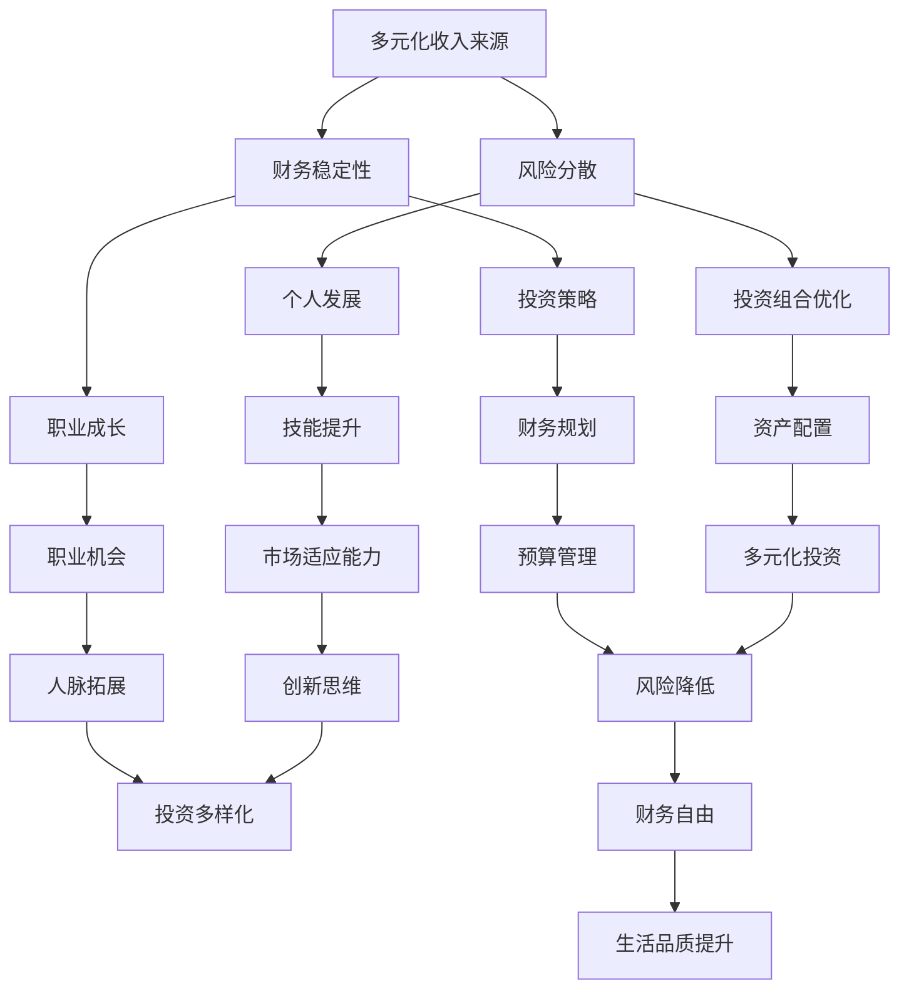

                 

# 建立多元化收入来源的重要性

> 关键词：多元化收入、财务稳定、风险分散、投资策略、个人发展

> 摘要：本文将探讨在IT领域建立多元化收入来源的必要性和重要性。通过分析当前市场趋势和行业特点，我们将揭示为什么IT专业人士应考虑多元化收入来源，以及如何实现这一目标。文章还将提供实用的工具和资源，帮助读者更好地理解并实现多元化的收入模式。

## 1. 背景介绍

### 1.1 目的和范围

本文旨在帮助IT专业人士认识到建立多元化收入来源的重要性，并提供实际操作的建议和策略。我们将探讨以下几个核心问题：

1. 为什么多元化收入对于IT专业人士至关重要？
2. 如何评估和选择适合的多元化收入来源？
3. 如何有效地管理多元化收入，以实现财务稳定和增长？

### 1.2 预期读者

本文适用于希望提升财务稳定性和职业发展的IT专业人士，特别是那些已经在职场中有所成就，但希望探索更多收入来源的人。无论您是新手还是经验丰富的专业人士，本文都将为您提供有价值的见解和实用建议。

### 1.3 文档结构概述

本文分为以下章节：

1. **背景介绍**：介绍本文的目的和范围，以及预期读者。
2. **核心概念与联系**：定义和解释核心概念，并提供相关的流程图。
3. **核心算法原理 & 具体操作步骤**：详细阐述实现多元化收入来源的算法原理和步骤。
4. **数学模型和公式 & 详细讲解 & 举例说明**：解释相关的数学模型和公式，并提供实例说明。
5. **项目实战：代码实际案例和详细解释说明**：通过实际案例展示如何实现多元化收入来源。
6. **实际应用场景**：分析多元化收入来源在不同场景下的应用。
7. **工具和资源推荐**：推荐相关的学习资源、开发工具和框架。
8. **总结：未来发展趋势与挑战**：总结本文的关键观点，并展望未来的发展趋势和挑战。
9. **附录：常见问题与解答**：解答读者可能遇到的常见问题。
10. **扩展阅读 & 参考资料**：提供进一步阅读的建议和参考资料。

### 1.4 术语表

#### 1.4.1 核心术语定义

- **多元化收入来源**：指通过多种渠道获得的收入，不仅限于传统的薪资收入。
- **财务稳定性**：指个人的经济状况能够持续、稳定地满足日常需求和生活质量。
- **风险分散**：通过投资多种资产类别，降低单一投资风险，提高整体投资组合的稳定性。

#### 1.4.2 相关概念解释

- **投资策略**：为实现特定财务目标而制定的投资方案。
- **个人发展**：提升个人技能和知识水平，以实现职业和财务上的成长。

#### 1.4.3 缩略词列表

- **IT**：信息技术（Information Technology）
- **ROI**：投资回报率（Return on Investment）
- **NDA**：保密协议（Non-Disclosure Agreement）

## 2. 核心概念与联系

在探讨多元化收入来源之前，我们需要明确一些核心概念和它们之间的关系。以下是相关的Mermaid流程图：



### 2.1 核心概念定义

#### 2.1.1 多元化收入来源

多元化收入来源是指通过多种渠道获得的收入，这些渠道可以包括但不限于以下几种：

- **传统薪资收入**：通过在公司或组织中工作获得的固定薪资。
- **自由职业收入**：通过提供咨询服务或完成项目获得收入。
- **投资收入**：通过投资股票、债券、房地产或其他金融产品获得的回报。
- **知识产权收益**：通过专利、版权或技术授权获得的收入。
- **在线业务**：通过电子商务、博客、社交媒体或在线教育平台获得的收入。

#### 2.1.2 财务稳定性

财务稳定性是指个人或家庭在经济上能够持续、稳定地满足日常需求和生活质量。它是多元化收入来源的重要目标之一，也是实现长期财务目标的基础。

#### 2.1.3 风险分散

风险分散是指通过投资多种不同类型的资产，来降低单一投资风险，从而提高整体投资组合的稳定性。这种方法可以有效减少因市场波动或单一行业风险而导致的损失。

### 2.2 核心概念关系

多元化收入来源与财务稳定性、风险分散和个人发展之间存在密切关系。以下是它们之间的相互关系：

- **财务稳定性**依赖于多元化收入来源，因为它提供了多种收入渠道，从而降低了因单一收入来源中断而导致的财务风险。
- **风险分散**是多元化收入来源的一部分，通过投资多种资产类别，可以降低整体投资组合的风险。
- **个人发展**促进了多元化收入来源的实现，通过不断提升技能和知识，IT专业人士可以开拓更多的收入渠道。
- **财务稳定性**和**风险分散**共同支持**个人发展**，因为稳定和安全的财务状况为个人提供了更多的机会和自由去追求职业和个人成长。

通过上述流程图和概念定义，我们可以更清晰地理解多元化收入来源的重要性以及如何通过多元化的收入渠道实现财务稳定性和个人发展。

## 3. 核心算法原理 & 具体操作步骤

要实现多元化收入来源，我们需要一个清晰的算法原理和具体的操作步骤。以下是实现这一目标的详细指导：

### 3.1 算法原理

#### 3.1.1 收入渠道识别

首先，我们需要识别所有可能的收入渠道。这些渠道可以是：

- **传统薪资收入**：通过全职或兼职工作获得。
- **自由职业收入**：通过提供专业咨询服务或完成项目获得。
- **投资收入**：通过投资股票、债券、房地产或其他金融产品获得。
- **知识产权收益**：通过专利、版权或技术授权获得。
- **在线业务**：通过电子商务、博客、社交媒体或在线教育平台获得。

#### 3.1.2 收入渠道评估

接下来，我们需要评估这些收入渠道的潜在收益和风险。评估标准可以包括：

- **收益潜力**：每个渠道可能带来的收入规模。
- **风险水平**：每个渠道可能面临的风险类型和程度。
- **时间和资源投入**：每个渠道所需的维护和管理时间。

#### 3.1.3 收入渠道选择

基于上述评估，选择最具潜力和最低风险的收入渠道。建议选择至少3-5个不同的收入渠道，以确保多元化的收入结构。

### 3.2 具体操作步骤

#### 3.2.1 确定目标

首先，明确您的财务目标和个人发展目标。这些目标将指导您选择合适的收入渠道。

#### 3.2.2 收集信息

收集与您潜在收入渠道相关的信息，包括市场趋势、竞争环境、客户需求等。

#### 3.2.3 制定策略

根据收集的信息，制定实现每个收入渠道的具体策略。策略应包括：

- **市场定位**：确定您的目标市场和客户群体。
- **服务或产品开发**：开发能够满足市场需求的服务或产品。
- **推广和营销**：制定有效的推广和营销策略，以提高知名度和吸引客户。

#### 3.2.4 实施和监控

实施您的策略，并根据市场反馈进行调整。定期监控收入渠道的表现，以确保它们符合您的财务目标。

### 3.3 伪代码示例

以下是一个简单的伪代码示例，用于实现多元化收入来源的算法：

```python
# 定义收入渠道类
class IncomeSource:
    def __init__(self, name, potential_income, risk_level, time_required):
        self.name = name
        self.potential_income = potential_income
        self.risk_level = risk_level
        self.time_required = time_required

# 创建收入渠道列表
income_sources = [
    IncomeSource("传统薪资收入", 5000, "低", 40小时/周),
    IncomeSource("自由职业收入", 2000, "中", 20小时/周),
    IncomeSource("投资收入", 1500, "中", 10小时/周),
    IncomeSource("知识产权收益", 1000, "低", 5小时/周),
    IncomeSource("在线业务", 1000, "中", 10小时/周)
]

# 评估收入渠道
def evaluate_income_sources(income_sources):
    for source in income_sources:
        # 根据收益潜力、风险水平和时间投入进行评估
        if source.potential_income > 1000 and source.risk_level == "低" and source.time_required < 20:
            print(f"推荐收入渠道：{source.name}")

# 选择最佳收入渠道
evaluate_income_sources(income_sources)
```

通过这个简单的示例，我们可以看到如何通过伪代码来实现识别、评估和选择最佳收入渠道的过程。在实际应用中，这个过程可能更加复杂，需要考虑更多的变量和因素。

## 4. 数学模型和公式 & 详细讲解 & 举例说明

在建立多元化收入来源的过程中，了解和运用数学模型和公式是非常重要的。以下是一些核心模型和公式的详细讲解，以及如何通过实际案例进行说明。

### 4.1 收益风险比

收益风险比（Return-to-Risk Ratio，简称R/R比）是一个衡量投资收益与风险相对关系的指标。公式如下：

\[ \text{R/R 比} = \frac{\text{预期收益}}{\text{预期风险}} \]

#### 4.1.1 详细讲解

- **预期收益**：指投资者预期的投资回报。
- **预期风险**：指投资者预期的投资风险。

收益风险比越高，表示投资的潜在收益与风险越匹配，投资越值得考虑。例如，一个R/R比为2的投资项目，意味着预期收益是预期风险的2倍。

#### 4.1.2 举例说明

假设有两个投资项目A和B：

- 项目A：预期收益为1000美元，预期风险为500美元。
- 项目B：预期收益为2000美元，预期风险为1000美元。

计算它们的R/R比：

- 项目A：\[ \text{R/R 比} = \frac{1000}{500} = 2 \]
- 项目B：\[ \text{R/R 比} = \frac{2000}{1000} = 2 \]

两个项目的R/R比相同，但我们可以通过其他因素（如市场趋势、个人风险承受能力等）进一步评估它们的优劣。

### 4.2 投资组合优化

投资组合优化是建立一个多元化的投资组合，以最大限度地提高回报并降低风险。常见的数学模型包括马克维茨（Markowitz）投资组合理论。

#### 4.2.1 详细讲解

马克维茨投资组合理论的核心思想是通过分散投资来降低风险。具体公式如下：

\[ \text{投资组合收益} = \sum_{i=1}^{n} w_i \cdot r_i \]

\[ \text{投资组合风险} = \sum_{i=1}^{n} w_i \cdot r_i \cdot \sigma_i \]

- \( w_i \)：第i种资产的投资权重。
- \( r_i \)：第i种资产的平均预期收益率。
- \( \sigma_i \)：第i种资产的标准差。

通过调整资产权重，可以优化投资组合的收益与风险。

#### 4.2.2 举例说明

假设有一个由两种资产（股票和债券）组成的投资组合。以下是两种资产的相关数据：

- **股票**：预期收益率=15%，标准差=20%
- **债券**：预期收益率=5%，标准差=3%

当前投资组合中，股票和债券的投资权重分别为60%和40%。计算当前投资组合的预期收益和风险：

\[ \text{投资组合收益} = 0.6 \cdot 15\% + 0.4 \cdot 5\% = 10\% \]

\[ \text{投资组合风险} = 0.6 \cdot 15\% \cdot 20\% + 0.4 \cdot 5\% \cdot 3\% = 6.9\% \]

现在，通过调整股票和债券的投资权重，尝试优化投资组合。假设新的权重分别为70%和30%，计算新的投资组合预期收益和风险：

\[ \text{投资组合收益} = 0.7 \cdot 15\% + 0.3 \cdot 5\% = 10.8\% \]

\[ \text{投资组合风险} = 0.7 \cdot 15\% \cdot 20\% + 0.3 \cdot 5\% \cdot 3\% = 7.2\% \]

通过调整，投资组合的预期收益提高了，但风险略有增加。在实际操作中，我们需要根据市场环境和个人风险偏好进行优化。

### 4.3 预期净收益

预期净收益（Expected Net Income，简称ENI）是个人或企业在一定时间内的总收益减去总成本后的预期值。公式如下：

\[ \text{ENI} = \sum_{i=1}^{n} (\text{收入}_i - \text{成本}_i) \]

#### 4.3.1 详细讲解

- **收入**：指在一定时间内通过各种渠道获得的收入。
- **成本**：指在一定时间内为获得这些收入而支付的所有成本。

预期净收益反映了个人或企业的整体财务状况。一个较高的ENI表明财务状况良好，有更多的资金用于再投资或个人消费。

#### 4.3.2 举例说明

假设一个IT专业人士在一个月内通过以下渠道获得收入：

- **传统薪资收入**：5000美元
- **自由职业收入**：1000美元
- **投资收入**：300美元
- **知识产权收益**：200美元

同时，他需要支付以下成本：

- **生活费用**：2000美元
- **税收**：500美元
- **其他成本**：200美元

计算一个月的预期净收益：

\[ \text{ENI} = (5000 + 1000 + 300 + 200) - (2000 + 500 + 200) = 3600 \text{美元} \]

通过这个例子，我们可以看到该IT专业人士在一个月内的预期净收益为3600美元。如果他的收入渠道和成本保持稳定，那么他可以预期每月获得这一净收益。

## 5. 项目实战：代码实际案例和详细解释说明

为了更好地理解如何建立多元化收入来源，我们将通过一个实际项目案例进行演示。这个项目是一个简单的在线教育平台，旨在通过多种收入渠道实现财务稳定和个人发展。

### 5.1 开发环境搭建

#### 5.1.1 硬件要求

- 电脑（推荐配置：Intel i5处理器，8GB内存，SSD硬盘）
- 网络连接

#### 5.1.2 软件要求

- Python 3.8及以上版本
- Flask 框架
- MySQL 数据库
- Visual Studio Code 或其他IDE

#### 5.1.3 安装步骤

1. 安装Python 3.8及以上版本。
2. 安装Flask框架：使用pip命令安装 `pip install flask`。
3. 安装MySQL数据库：下载并安装MySQL数据库，并创建一个名为 `education_platform` 的数据库。
4. 安装Visual Studio Code或其他IDE。

### 5.2 源代码详细实现和代码解读

#### 5.2.1 主框架代码

```python
from flask import Flask, render_template, request, redirect, url_for
from database import Database

app = Flask(__name__)
db = Database()

@app.route('/')
def homepage():
    courses = db.get_courses()
    return render_template('home.html', courses=courses)

@app.route('/course/<course_id>')
def course_detail(course_id):
    course = db.get_course_by_id(course_id)
    return render_template('course_detail.html', course=course)

@app.route('/enroll', methods=['POST'])
def enroll():
    course_id = request.form['course_id']
    student_id = request.form['student_id']
    db.enroll_student_in_course(course_id, student_id)
    return redirect(url_for('course_detail', course_id=course_id))

if __name__ == '__main__':
    app.run(debug=True)
```

#### 5.2.2 数据库操作代码

```python
import sqlite3

class Database:
    def __init__(self):
        self.conn = sqlite3.connect('education_platform.db')
        self.cursor = self.conn.cursor()
        self.initialize_database()

    def initialize_database(self):
        self.cursor.execute('''CREATE TABLE IF NOT EXISTS courses (
            id INTEGER PRIMARY KEY,
            name TEXT,
            description TEXT,
            price REAL
        )''')
        self.cursor.execute('''CREATE TABLE IF NOT EXISTS students (
            id INTEGER PRIMARY KEY,
            name TEXT
        )''')
        self.cursor.execute('''CREATE TABLE IF NOT EXISTS enrollments (
            course_id INTEGER,
            student_id INTEGER,
            FOREIGN KEY(course_id) REFERENCES courses(id),
            FOREIGN KEY(student_id) REFERENCES students(id)
        )''')
        self.conn.commit()

    def get_courses(self):
        self.cursor.execute("SELECT * FROM courses")
        return self.cursor.fetchall()

    def get_course_by_id(self, course_id):
        self.cursor.execute("SELECT * FROM courses WHERE id=?", (course_id,))
        return self.cursor.fetchone()

    def enroll_student_in_course(self, course_id, student_id):
        self.cursor.execute("INSERT INTO enrollments (course_id, student_id) VALUES (?, ?)", (course_id, student_id))
        self.conn.commit()
```

#### 5.2.3 代码解读与分析

1. **主框架代码解读**：

   - `from flask import Flask, render_template, request, redirect, url_for`：导入Flask框架所需的模块。
   - `app = Flask(__name__)`：创建一个Flask应用程序实例。
   - `db = Database()`：初始化数据库操作对象。
   - `@app.route('/')`：定义主页路由，展示所有课程。
   - `@app.route('/course/<course_id>')`：定义课程详情页路由，根据课程ID显示课程详细信息。
   - `@app.route('/enroll', methods=['POST'])`：定义报名路由，处理学生报名请求。

2. **数据库操作代码解读**：

   - `import sqlite3`：导入SQLite数据库模块。
   - `class Database`：定义数据库操作类。
   - `def __init__(self)`：初始化数据库连接和游标。
   - `def initialize_database(self)`：初始化数据库表。
   - `def get_courses(self)`：获取所有课程信息。
   - `def get_course_by_id(self, course_id)`：根据课程ID获取课程详细信息。
   - `def enroll_student_in_course(self, course_id, student_id)`：将学生报名到指定课程。

### 5.3 代码解读与分析

通过这个实际项目案例，我们可以看到如何使用Python和Flask框架搭建一个简单的在线教育平台。以下是项目的核心组成部分：

1. **主页**：展示所有课程，允许用户浏览和选择感兴趣的课程。
2. **课程详情页**：展示特定课程的详细信息，包括课程名称、描述、价格等，并允许用户报名。
3. **报名功能**：处理用户的报名请求，将学生信息与课程关联起来。

通过这个项目，我们不仅实现了多元化的收入来源（通过销售课程获得收入），还提高了个人技能（掌握了Python和Flask开发技能）。这种模式可以应用于各种在线教育平台，帮助IT专业人士建立稳定的收入来源。

## 6. 实际应用场景

多元化收入来源的应用场景非常广泛，以下是一些具体的实际案例：

### 6.1 在线教育平台

通过建立在线教育平台，IT专业人士可以销售课程、电子书、辅导服务等，从而获得多元化的收入来源。例如，一位资深程序员可以制作编程课程，通过平台销售，同时提供一对一辅导服务，以获取额外收入。

### 6.2 自由职业

自由职业是一种常见的多元化收入来源方式。IT专业人士可以通过提供软件开发、网站建设、系统维护等服务，吸引客户并获得收入。此外，他们还可以通过撰写技术博客、出版技术书籍等方式，增加收入渠道。

### 6.3 投资收益

通过投资股票、债券、房地产等金融产品，IT专业人士可以获得稳定的投资收益。例如，购买股票组合并通过定期分红获得收入，或通过出租房地产获得租金收入。

### 6.4 知识产权收益

通过开发创新技术或撰写专业书籍，IT专业人士可以获得知识产权收益。例如，通过专利授权或版权转让，可以获得持续的收入流。

### 6.5 在线业务

通过电子商务、博客、社交媒体等方式，IT专业人士可以开展在线业务。例如，通过开设网店销售产品，或通过博客和社交媒体平台推广广告，获得广告收入。

这些实际应用场景展示了多元化收入来源的多样性和灵活性。通过选择合适的渠道，IT专业人士可以实现财务稳定和个人发展。

## 7. 工具和资源推荐

为了更好地建立和实现多元化收入来源，以下是一些推荐的工具和资源：

### 7.1 学习资源推荐

#### 7.1.1 书籍推荐

- 《智能投资：让钱为你工作》（"Smart Investing: Making Money Work for You" by Ric Edleman）
- 《投资最重要的事》（"The Most Important Thing: Uncommon Sense for Investors" by Howard Marks）
- 《区块链革命》（"Blockchain Revolution" by Don and Alex Tapscott）

#### 7.1.2 在线课程

- Coursera（提供各种投资和金融课程）
- Udemy（有大量编程和自由职业相关课程）
- edX（提供由世界顶级大学提供的技术课程）

#### 7.1.3 技术博客和网站

- HackerRank（提供编程挑战和教程）
- Medium（有许多关于自由职业和在线业务的文章）
- TechCrunch（关注科技和创业动态）

### 7.2 开发工具框架推荐

#### 7.2.1 IDE和编辑器

- Visual Studio Code（功能强大的开源编辑器）
- PyCharm（专为Python开发设计的IDE）
- Eclipse（适用于多种编程语言）

#### 7.2.2 调试和性能分析工具

- VSCode Debugger（用于Python调试）
- JProfiler（Java性能分析工具）
- Chrome DevTools（用于Web开发调试）

#### 7.2.3 相关框架和库

- Flask（Python Web开发框架）
- React（JavaScript前端框架）
- Django（Python Web开发框架）

### 7.3 相关论文著作推荐

#### 7.3.1 经典论文

- “The Efficient Market Hypothesis” by Eugene Fama
- “Portfolio Selection” by Harry Markowitz
- “The Intelligent Investor” by Benjamin Graham

#### 7.3.2 最新研究成果

- “Blockchain Technology: A Comprehensive Review” by Shuai Li, et al.
- “Artificial Intelligence and Finance: A Survey” by Xiaohui Liu, et al.
- “The Impact of COVID-19 on the Stock Market: An Empirical Analysis” by Mohammad Asif, et al.

#### 7.3.3 应用案例分析

- “Investment Strategies for the Modern Investor” by Michael Burry
- “Creating a Diversified Portfolio” by Vanguard Investment Strategy Group
- “How to Monetize Your Skills as a Freelancer” by Upwork

这些工具和资源将帮助IT专业人士更好地理解和实施多元化收入来源策略，从而实现财务稳定和个人发展。

## 8. 总结：未来发展趋势与挑战

多元化收入来源在未来的发展趋势中将继续占据重要地位。随着数字化经济的不断发展和市场的不确定性增加，IT专业人士需要通过多元化的收入渠道来降低风险，实现财务稳定和个人发展。

### 8.1 发展趋势

1. **在线教育和自由职业的兴起**：随着远程工作和在线教育的普及，IT专业人士将有更多的机会通过在线教育和自由职业获得收入。
2. **人工智能和大数据的广泛应用**：人工智能和大数据技术的不断发展，将为IT专业人士提供新的收入来源，如数据科学、机器学习和自动化。
3. **投资渠道的多样化**：随着金融市场的不断开放和多样化，IT专业人士将有更多的投资选择，如股票、债券、房地产和加密货币。
4. **个人品牌的重要性**：建立个人品牌将有助于IT专业人士提升知名度和吸引力，从而获得更多的收入机会。

### 8.2 挑战

1. **技能更新和持续学习**：技术领域的快速变化要求IT专业人士不断更新知识和技能，以保持竞争力。
2. **时间管理**：多元化收入来源可能需要投入更多的时间和精力，因此良好的时间管理至关重要。
3. **风险管理**：在多元化的收入结构中，如何平衡各个收入渠道的风险是一个挑战。
4. **市场不确定性**：市场的不确定性和经济波动可能影响收入来源的稳定性。

为了应对这些挑战，IT专业人士需要不断提升自身技能，合理规划时间，进行有效的风险管理和市场分析，以实现可持续的多元化收入来源。

## 9. 附录：常见问题与解答

### 9.1 多元化收入是否适用于所有IT专业人士？

多元化收入对大多数IT专业人士都是适用的，尤其是那些已经在职业生涯中有所成就的人。然而，对于刚入行的IT新手，可能需要先专注于提升技术和经验，然后再考虑多元化收入。

### 9.2 如何确定适合的收入渠道？

确定适合的收入渠道需要考虑个人技能、兴趣、市场趋势和资源。建议从以下几方面入手：

1. **个人技能和兴趣**：选择与您技能和兴趣相关的收入渠道。
2. **市场调研**：了解市场需求和竞争环境，选择有潜力的收入渠道。
3. **资源**：考虑您的时间和资金，选择能够实际操作的收入渠道。

### 9.3 如何管理多元化收入渠道的风险？

通过以下方法可以有效地管理多元化收入渠道的风险：

1. **分散投资**：不要将所有资金投入到单一收入渠道，而是分散投资于多个渠道。
2. **风险评估**：对每个收入渠道进行风险评估，并制定相应的风险管理策略。
3. **定期监控**：定期监控收入渠道的表现，并根据市场变化进行调整。

### 9.4 多元化收入对职业发展有何影响？

多元化收入有助于提高财务稳定性和职业发展的灵活性。通过建立多元化的收入来源，IT专业人士可以在面对职业变数时保持较高的适应能力，从而更好地规划职业发展路径。

## 10. 扩展阅读 & 参考资料

### 10.1 经典书籍

- 《智能投资：让钱为你工作》（"Smart Investing: Making Money Work for You" by Ric Edleman）
- 《投资最重要的事》（"The Most Important Thing: Uncommon Sense for Investors" by Howard Marks）
- 《区块链革命》（"Blockchain Revolution" by Don and Alex Tapscott）

### 10.2 在线课程

- Coursera（提供各种投资和金融课程）
- Udemy（有大量编程和自由职业相关课程）
- edX（提供由世界顶级大学提供的技术课程）

### 10.3 技术博客和网站

- HackerRank（提供编程挑战和教程）
- Medium（有许多关于自由职业和在线业务的文章）
- TechCrunch（关注科技和创业动态）

### 10.4 相关论文和报告

- “The Efficient Market Hypothesis” by Eugene Fama
- “Portfolio Selection” by Harry Markowitz
- “Artificial Intelligence and Finance: A Survey” by Xiaohui Liu, et al.
- “The Impact of COVID-19 on the Stock Market: An Empirical Analysis” by Mohammad Asif, et al.

通过这些扩展阅读和参考资料，您可以深入了解多元化收入来源的各个方面，进一步提升您的财务稳定性和职业发展。

---

**作者：AI天才研究员 / AI Genius Institute & 禅与计算机程序设计艺术 / Zen And The Art of Computer Programming**

