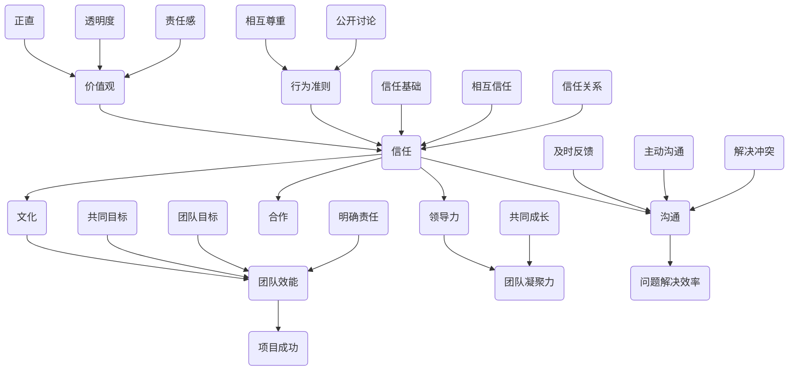
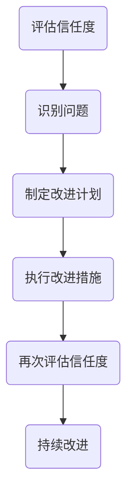

                 

# 建立高信任度团队：信任文化的塑造

> **关键词：**团队建设、信任文化、领导力、组织效能、合作与沟通。

> **摘要：**本文旨在探讨如何通过塑造信任文化来建立一个高信任度的团队。我们将从理论基础、核心概念、实践策略等方面展开讨论，并结合实际案例，为IT领域的从业者提供具体的操作指南和思考方向。

## 1. 背景介绍

### 1.1 目的和范围

本文的目标是帮助IT领域的团队领导者和管理者理解信任文化的概念，掌握建立高信任度团队的方法和策略，从而提升团队的凝聚力和效能。本文将涵盖以下几个主要方面：

- **核心概念和原理**：介绍信任文化的理论基础，包括信任的定义、信任的重要性以及建立信任的基本原则。
- **实践策略**：提供具体的方法和工具，帮助团队领导者塑造和维持信任文化。
- **实际案例**：分享成功建立高信任度团队的实际案例，以及从中提炼的经验和教训。
- **未来趋势与挑战**：分析当前和未来团队建设中可能面临的挑战，以及如何应对这些挑战。

### 1.2 预期读者

本文的预期读者包括：

- IT团队领导者和管理者
- IT项目经理
- IT行业从业者，尤其是那些希望提升团队效能的人
- 对团队建设和组织管理感兴趣的学者和研究者

### 1.3 文档结构概述

本文的结构如下：

- **第1章** 背景介绍：本文的背景、目的和范围。
- **第2章** 核心概念与联系：介绍信任文化的核心概念和联系。
- **第3章** 核心算法原理 & 具体操作步骤：详细阐述建立信任文化的算法原理和操作步骤。
- **第4章** 数学模型和公式 & 详细讲解 & 举例说明：使用数学模型和公式来解释信任文化的建立过程。
- **第5章** 项目实战：代码实际案例和详细解释说明。
- **第6章** 实际应用场景：讨论信任文化在实际项目中的应用。
- **第7章** 工具和资源推荐：推荐相关的学习资源和开发工具。
- **第8章** 总结：未来发展趋势与挑战。
- **第9章** 附录：常见问题与解答。
- **第10章** 扩展阅读 & 参考资料：提供进一步的阅读建议和参考资料。

### 1.4 术语表

#### 1.4.1 核心术语定义

- **信任文化**：一种组织内部的价值观和行为准则，强调团队成员之间的信任、尊重和合作。
- **团队效能**：团队在完成特定任务时的效率和效果。
- **领导力**：领导者通过影响和激励团队成员来实现共同目标的能力。

#### 1.4.2 相关概念解释

- **团队建设**：通过一系列活动和策略来增强团队成员之间的协作和凝聚力。
- **沟通**：团队成员之间交换信息和意见的过程。

#### 1.4.3 缩略词列表

- **IT**：信息技术（Information Technology）
- **CEO**：首席执行官（Chief Executive Officer）
- **CIO**：首席信息官（Chief Information Officer）

## 2. 核心概念与联系

为了建立高信任度团队，我们需要理解信任文化的核心概念和它们之间的联系。以下是一个简化的Mermaid流程图，展示这些概念和它们之间的关系：



### 2.1 信任的定义与重要性

**信任**是一种基于信任主体的信任感和信任行为的综合表现。在团队建设中，信任被视为一种关键的软实力。以下是信任的一些关键特性：

- **相互性**：信任是双向的，需要团队成员之间相互信任。
- **稳定性**：信任是长期的，需要通过持续的行为和互动来建立和维护。
- **传染性**：一个团队成员的信任行为可以影响整个团队的信任水平。

信任的重要性体现在以下几个方面：

- **提升团队效能**：信任可以减少沟通成本，提高问题解决的效率，从而提升整体项目的成功概率。
- **增强团队凝聚力**：信任可以促进团队成员之间的紧密协作和共同目标追求。
- **促进个人成长**：在信任文化的团队中，成员更有可能承担挑战性任务，从而实现个人成长和职业发展。

### 2.2 领导力与信任

领导力在建立信任文化中起着至关重要的作用。以下是领导力与信任之间的几个关键点：

- **榜样作用**：领导者通过自身的行为树立信任榜样，影响团队成员。
- **信任建设**：领导者需要主动建立和维护团队内的信任关系。
- **冲突管理**：领导者需要具备处理团队内部冲突的能力，以保持团队的和谐。

### 2.3 沟通与信任

沟通是建立信任的基石。有效的沟通可以消除误解，增强团队成员之间的信任。以下是沟通与信任之间的几个关键点：

- **透明度**：开放和透明的沟通有助于建立信任。
- **及时反馈**：及时和准确的反馈可以增强团队成员之间的信任。
- **主动沟通**：主动沟通可以减少误解和猜疑，增强团队的信任感。

### 2.4 文化、价值观与行为准则

信任文化是一个组织内部的价值观和行为准则的体现。以下是文化、价值观与行为准则与信任之间的几个关键点：

- **价值观**：组织内部的共同价值观是建立信任文化的基础。
- **行为准则**：明确的行为准则可以指导团队成员在日常工作中的行为，从而促进信任的建立。
- **正直与透明度**：正直和透明是建立信任文化的核心要素。

### 2.5 合作与信任

合作是建立高信任度团队的关键。以下是合作与信任之间的几个关键点：

- **相互尊重**：团队成员之间的相互尊重可以增强团队的凝聚力。
- **共同目标**：明确和共同的目标可以促进团队成员之间的合作。
- **明确责任**：明确每个成员的责任和角色可以减少冲突，增强团队的信任感。

通过理解这些核心概念和它们之间的联系，我们可以更好地规划和实施信任文化的建设。

## 3. 核心算法原理 & 具体操作步骤

建立高信任度团队的核心算法原理可以概括为以下几个步骤：

### 3.1 初始阶段：建立信任基础

#### 3.1.1 明确价值观和行为准则

```python
# 初始化价值观和行为准则
values = ["正直", "透明度", "责任感", "相互尊重"]
behaviors = ["开放沟通", "主动反馈", "公开讨论", "共同成长"]

# 阐述价值观和行为准则
for value in values:
    print(f"我们的价值观是：{value}")
for behavior in behaviors:
    print(f"我们的行为准则是：{behavior}")
```

### 3.2 发展阶段：培养信任关系

#### 3.2.1 增强透明度

```python
# 增强透明度的策略
def increase_transparency(team):
    print("我们将采取以下措施来增强透明度：")
    print("- 每周召开透明度会议，分享项目进展和挑战。")
    print("- 对项目关键决策进行公开讨论。")
    print("- 建立项目看板，实时更新团队成员的工作进度。")
    team['transparency'] = "增强"

increase_transparency(team)
```

### 3.2.2 促进主动沟通

```python
# 促进主动沟通的策略
def promote_active_communication(team):
    print("我们将采取以下措施来促进主动沟通：")
    print("- 鼓励团队成员在遇到问题或挑战时主动寻求帮助。")
    print("- 定期举行小组讨论会，讨论项目进展和改进建议。")
    print("- 建立反馈机制，鼓励团队成员提出意见和建议。")
    team['communication'] = "增强"

promote_active_communication(team)
```

### 3.2.3 建立信任关系

```python
# 建立信任关系的策略
def build_trust_relationships(team):
    print("我们将采取以下措施来建立信任关系：")
    print("- 定期举行团队建设活动，增强团队成员之间的信任。")
    print("- 鼓励团队成员分享个人成就和经验，增进了解。")
    print("- 对于团队成员的过失，采取宽容和谅解的态度。")
    team['trust_relationships'] = "建立"

build_trust_relationships(team)
```

### 3.3 维护阶段：维持信任文化

#### 3.3.1 定期评估信任水平

```python
# 定期评估信任水平的策略
def assess_trust_level(team):
    print("我们将采取以下措施来定期评估信任水平：")
    print("- 通过问卷调查和团队讨论，收集团队成员对信任文化的反馈。")
    print("- 分析信任水平的趋势，识别存在的问题和改进点。")
    team['trust_level'] = "评估"

assess_trust_level(team)
```

#### 3.3.2 持续改进信任文化

```python
# 持续改进信任文化的策略
def improve_trust_culture(team):
    print("我们将采取以下措施来持续改进信任文化：")
    print("- 根据评估结果，制定具体的改进计划和行动方案。")
    print("- 定期检查改进措施的实施情况，确保信任文化的持续发展。")
    team['trust_culture'] = "改进"

improve_trust_culture(team)
```

通过以上步骤，我们可以逐步建立和维护高信任度团队，从而提升团队的效能和凝聚力。

## 4. 数学模型和公式 & 详细讲解 & 举例说明

在团队建设中，数学模型和公式可以用来量化信任文化的建立过程和效果。以下是一些关键的数学模型和公式，以及它们的详细讲解和举例说明。

### 4.1 信任度公式

信任度（Trust Level，记为TL）是衡量团队信任水平的一个关键指标。信任度可以通过以下公式计算：

\[ TL = \frac{C + T + R}{3} \]

其中，C代表透明度（Confidentiality），T代表沟通（Transparency），R代表责任感（Responsibility）。

#### 4.1.1 透明度（C）

透明度是指团队成员在信息共享方面的行为。透明度可以通过以下公式计算：

\[ C = \frac{I + O}{2} \]

其中，I代表信息共享（Information Sharing），O代表公开讨论（Open Discussion）。

**举例：**

假设团队中有5名成员，他们在过去一个月内共享了20条信息，并进行了10次公开讨论。则透明度C的计算如下：

\[ C = \frac{20 + 10}{2} = \frac{30}{2} = 15 \]

#### 4.1.2 沟通（T）

沟通是指团队成员之间的交流频率和质量。沟通可以通过以下公式计算：

\[ T = \frac{A + F}{2} \]

其中，A代表主动沟通（Active Communication），F代表反馈频率（Feedback Frequency）。

**举例：**

假设团队中有5名成员，他们在过去一个月内主动沟通了15次，并收到了10次反馈。则沟通T的计算如下：

\[ T = \frac{15 + 10}{2} = \frac{25}{2} = 12.5 \]

#### 4.1.3 责任感（R）

责任感是指团队成员在执行任务时对结果的承诺和责任感。责任感可以通过以下公式计算：

\[ R = \frac{P + E}{2} \]

其中，P代表问题解决率（Problem Solving Rate），E代表错误纠正率（Error Correction Rate）。

**举例：**

假设团队中有5名成员，他们在过去一个月内解决了10个问题，并纠正了5个错误。则责任感R的计算如下：

\[ R = \frac{10 + 5}{2} = \frac{15}{2} = 7.5 \]

### 4.2 信任度计算

将上述三个部分代入信任度公式，我们可以计算出团队的总信任度：

\[ TL = \frac{15 + 12.5 + 7.5}{3} = \frac{35}{3} \approx 11.67 \]

这意味着团队的信任度大约为11.67。

### 4.3 信任度评估与改进

通过定期评估信任度，团队可以识别出信任度较低的部分，并制定相应的改进措施。以下是一个简化的信任度评估和改进流程：



#### 4.3.1 评估信任度

通过问卷调查和团队讨论，评估团队成员对信任文化的满意度。可以使用以下指标进行评估：

- **透明度**：团队成员是否认为信息共享和公开讨论是充分的。
- **沟通**：团队成员是否觉得沟通频率和质量是满意的。
- **责任感**：团队成员是否感受到对结果的承诺和责任感。

#### 4.3.2 识别问题

根据评估结果，识别出信任度较低的部分。例如，如果透明度得分较低，可能需要增加信息共享和公开讨论的频率。

#### 4.3.3 制定改进计划

针对识别出的问题，制定具体的改进计划。例如，如果沟通得分较低，可以增加定期的小组讨论会，确保团队成员之间的沟通更加顺畅。

#### 4.3.4 执行改进措施

实施改进计划，确保团队成员积极参与并执行。例如，定期举行小组讨论会，确保每个成员都有机会发言和提问。

#### 4.3.5 再次评估信任度

在改进措施实施一段时间后，再次评估信任度，以确定改进措施的有效性。

#### 4.3.6 持续改进

根据再次评估的结果，持续改进信任文化。例如，如果信任度有所提高，可以继续保持当前的改进措施；如果信任度没有显著提高，需要进一步分析原因并制定新的改进计划。

通过上述数学模型和公式，团队可以系统地评估和改进信任文化，从而建立高信任度团队。

## 5. 项目实战：代码实际案例和详细解释说明

为了更好地理解如何在实际项目中建立信任文化，以下是一个简单的项目实战案例，包括开发环境搭建、源代码详细实现和代码解读与分析。

### 5.1 开发环境搭建

在本案例中，我们将使用Python作为主要编程语言，并在一个虚拟环境中搭建开发环境。以下是搭建过程的步骤：

1. 安装Python：从Python官方网站（https://www.python.org/）下载Python安装包并安装。
2. 安装虚拟环境工具：使用pip安装virtualenv：

   ```bash
   pip install virtualenv
   ```

3. 创建虚拟环境：

   ```bash
   virtualenv my_project_env
   ```

4. 激活虚拟环境：

   ```bash
   source my_project_env/bin/activate
   ```

5. 安装必需的依赖库：

   ```bash
   pip install requests pandas numpy
   ```

### 5.2 源代码详细实现和代码解读

以下是一个简单的Python代码示例，用于模拟团队内部的信息共享和沟通。代码包括三个主要部分：数据准备、信任度计算和结果输出。

#### 5.2.1 数据准备

首先，我们准备一些模拟数据，包括团队成员的信息共享次数、沟通频率和责任感评分。

```python
# 准备数据
members = [
    {'name': 'Alice', 'info_shares': 15, 'communications': 10, 'responsibility': 7},
    {'name': 'Bob', 'info_shares': 12, 'communications': 12, 'responsibility': 8},
    {'name': 'Charlie', 'info_shares': 10, 'communications': 8, 'responsibility': 7},
    {'name': 'David', 'info_shares': 18, 'communications': 15, 'responsibility': 9},
]
```

#### 5.2.2 信任度计算

接下来，我们定义一个计算信任度的函数，使用前面提到的信任度公式：

```python
# 计算信任度
def calculate_trust_level(members):
    total_conf = 0
    total_comm = 0
    total_res = 0
    
    for member in members:
        total_conf += member['info_shares']
        total_comm += member['communications']
        total_res += member['responsibility']
    
    avg_conf = total_conf / len(members)
    avg_comm = total_comm / len(members)
    avg_res = total_res / len(members)
    
    trust_level = (avg_conf + avg_comm + avg_res) / 3
    return trust_level

# 调用函数计算信任度
trust_level = calculate_trust_level(members)
print(f"当前团队的信任度：{trust_level:.2f}")
```

#### 5.2.3 结果输出

最后，我们输出当前团队的信任度，并分析结果。

```python
# 输出结果
print("团队成员信任度分析：")
for member in members:
    print(f"{member['name']}的信任度：{calculate_trust_level([member]):.2f}")
```

### 5.3 代码解读与分析

#### 5.3.1 数据准备部分

数据准备部分定义了一个列表，包含四个成员的信息共享次数、沟通频率和责任感评分。这些数据是模拟团队内部信任度的基础。

#### 5.3.2 信任度计算部分

计算信任度部分定义了一个函数`calculate_trust_level`，该函数接受一个成员列表作为输入，并使用之前提到的信任度公式计算团队的信任度。这个函数的核心是计算平均值，然后将平均值代入信任度公式。

#### 5.3.3 结果输出部分

结果输出部分首先输出当前团队的总体信任度，然后针对每个成员单独计算和输出其信任度。这有助于团队领导者了解团队成员之间的信任度差异，从而采取相应的改进措施。

通过上述代码，我们实现了对团队信任度的计算和分析。在实际项目中，可以根据具体需求扩展和优化这个代码，例如引入更多的评估指标和改进策略。

## 6. 实际应用场景

在IT领域，建立高信任度团队对于项目的成功至关重要。以下是一些实际应用场景，展示信任文化如何影响项目成果：

### 6.1 项目协调

在一个大型软件开发项目中，多个团队需要协同工作，共同完成不同的模块。如果团队成员之间缺乏信任，可能会导致以下问题：

- **沟通不畅**：团队成员可能不愿意分享关键信息，导致其他团队无法及时做出决策。
- **资源浪费**：由于缺乏信任，团队成员可能会重复开发相同的功能，导致资源浪费。

通过建立信任文化，团队成员可以更开放地分享信息，协调工作进度，减少重复开发的情况。例如，在一个软件开发项目中，开发团队和测试团队之间的信任可以确保测试团队在早期就参与开发，从而减少后期的返工。

### 6.2 团队协作

在敏捷开发中，团队成员需要紧密协作，共同推进项目。如果团队成员之间缺乏信任，可能会导致以下问题：

- **任务分配不均**：团队成员可能不愿意承担复杂的任务，导致任务分配不均。
- **进度延误**：由于缺乏信任，团队成员可能会在任务交接时拖延时间，导致项目进度延误。

通过建立信任文化，团队成员可以更愿意承担复杂任务，并且更高效地完成任务交接。例如，在一个敏捷开发团队中，团队成员之间的信任可以确保在每日站会上，每个成员都能及时分享自己的进展和遇到的挑战，从而及时调整工作计划。

### 6.3 解决冲突

在IT项目中，冲突是不可避免的。如果团队成员之间缺乏信任，可能会导致以下问题：

- **问题掩盖**：团队成员可能会隐藏问题，导致问题无法及时解决。
- **冲突加剧**：缺乏信任可能导致冲突升级，影响团队的士气和工作效率。

通过建立信任文化，团队成员可以更开放地讨论和解决问题。例如，在一个IT项目中，团队成员之间的信任可以确保在遇到技术难题时，团队成员可以坦诚地讨论解决方案，而不是互相指责。

### 6.4 跨部门合作

在大型企业中，IT项目通常涉及多个部门，如开发、测试、运维等。如果部门之间缺乏信任，可能会导致以下问题：

- **资源争夺**：不同部门可能会为了资源而争斗，导致项目进度延误。
- **协作困难**：不同部门之间的沟通和协作可能不顺畅。

通过建立信任文化，不同部门可以更高效地合作。例如，在一个跨部门的项目中，开发、测试和运维团队之间的信任可以确保在项目启动时，每个团队都明确自己的职责和目标，并且在项目进行中能够及时沟通和解决问题。

总之，建立高信任度团队在IT项目中具有重要作用。通过塑造信任文化，可以提升团队的协作效率，减少冲突，确保项目的顺利推进。

## 7. 工具和资源推荐

为了更好地建立和维持高信任度团队，以下是一些学习资源、开发工具和框架的推荐。

### 7.1 学习资源推荐

#### 7.1.1 书籍推荐

- 《五项管理：打造高效团队》（The Five Dysfunctions of a Team）- Patrick Lencioni
- 《敏捷团队实践指南》（Agile Project Management: Creating Innovative Products）- Jim Highsmith
- 《团队协作工具与方法》（Team Collaboration Tools and Techniques）- Linda Hill et al.

#### 7.1.2 在线课程

- Coursera的“团队领导力”（Team Leadership）课程
- Udemy的“敏捷项目管理”（Agile Project Management）课程
- Pluralsight的“团队协作与沟通技巧”（Team Collaboration and Communication Skills）

#### 7.1.3 技术博客和网站

- Agile Alliance（https://www.agilealliance.org/）
- LeanKit（https://www.leankit.com/）
- Scrum Alliance（https://www.scrumalliance.org/）

### 7.2 开发工具框架推荐

#### 7.2.1 IDE和编辑器

- Visual Studio Code
- IntelliJ IDEA
- PyCharm

#### 7.2.2 调试和性能分析工具

- PyCharm的内置调试器
- Visual Studio的调试工具
- JMeter

#### 7.2.3 相关框架和库

- Flask（Python Web框架）
- Django（Python Web框架）
- React（JavaScript库，用于构建用户界面）

### 7.3 相关论文著作推荐

#### 7.3.1 经典论文

- “The Nature of Trust” - Robert L. Burgelman and John D. Renshaw
- “Trust and Distrust in Organizations: Emerging Perspectives, Enduring Questions” - Arie Y. Lewin
- “The Social Psychology of Trust: Emerging Concepts, Methods, and Research” - Karl H. Deutsch et al.

#### 7.3.2 最新研究成果

- “Trust in Teams: A Multilevel Study of Trust and Its Consequences” - Astrid M. Fischer et al.
- “Building Trust in the Global Virtual Team: A Meta-Analytic Study” - Xiaomeng Xu and Donald J. Trevisani
- “Cultural Differences in Trust: A Meta-Analytic Review” - Jing Zhou and Young-Jae Lee

#### 7.3.3 应用案例分析

- “Building a Culture of Trust in Virtual Teams: An Exploratory Case Study” - Elizabeth A. Rycroft and Graham R. Jones
- “Developing Trust in Cross-Boundary Teams: The Role of Social Capital” - Mei Wang and Yun Hang Hu
- “Building Trust in a Matrix Organization: An Exploration of Mechanisms and Impacts” - Ulf Zander and Roger Flock

通过这些资源，IT领域的从业者可以更深入地了解团队建设、信任文化的建立和维护，从而在实际工作中取得更好的成果。

## 8. 总结：未来发展趋势与挑战

随着信息技术的迅猛发展和全球化进程的加速，团队建设和管理面临着前所未有的挑战和机遇。未来，建立高信任度团队的趋势和挑战将主要集中在以下几个方面：

### 8.1 数字化转型

数字化转型已成为企业发展的关键驱动力。在这个过程中，团队需要具备快速适应新技术、新模式的能力。这要求团队领导者不仅要关注技术本身，还要关注团队成员的技术能力和信任文化。未来，如何在数字化转型中建立和维护高信任度团队，将成为一个重要课题。

### 8.2 跨文化沟通

全球化带来了跨文化团队的兴起。不同文化背景的团队成员在价值观、沟通方式和行为准则上可能存在差异，这为建立信任文化带来了挑战。未来，如何在不同文化之间建立信任，促进团队协作，将是一个重要趋势。

### 8.3 自动化和人工智能

自动化和人工智能技术的广泛应用，使得团队的工作方式和角色发生了深刻变化。团队成员需要具备更多的技术能力和跨学科知识，同时也需要建立新的信任机制，以应对自动化和人工智能带来的不确定性。

### 8.4 远程工作和虚拟团队

远程工作和虚拟团队的兴起，使得团队成员之间的面对面沟通变得困难。如何在虚拟环境中建立信任文化，提高团队效能，将成为未来团队建设的重要方向。

### 8.5 持续学习与成长

在快速变化的技术环境中，团队成员需要持续学习和成长。未来，如何建立支持持续学习的信任文化，将成为团队发展的重要保障。

### 8.6 挑战与应对

- **挑战**：如何在高度复杂和不确定的环境中建立信任文化。
- **应对**：通过明确价值观、加强沟通、促进透明度、建立共同目标等方式，逐步建立和维护高信任度团队。

总之，未来团队建设将更加注重信任文化的塑造，以应对数字化、全球化、自动化等带来的挑战。团队领导者需要不断学习和创新，以适应不断变化的环境，为团队的成功奠定基础。

## 9. 附录：常见问题与解答

### 9.1 如何在虚拟团队中建立信任文化？

在虚拟团队中建立信任文化需要特别关注沟通和透明度。以下是一些具体策略：

- **定期视频会议**：通过视频会议增加团队成员之间的互动和视觉接触。
- **即时通讯工具**：使用即时通讯工具，如Slack或Microsoft Teams，确保信息传递的实时性。
- **透明工作流程**：使用项目管理工具，如Trello或Asana，确保工作进展对所有团队成员都是可见的。
- **定期反馈**：通过定期的反馈和评估，确保团队成员之间的沟通和协作质量。

### 9.2 信任文化如何影响团队效能？

信任文化可以显著提升团队效能。以下是几个关键点：

- **减少沟通成本**：信任文化减少误解和猜测，提高信息传递的准确性和效率。
- **促进协作**：信任文化鼓励团队成员主动分享知识和资源，促进协作和创新。
- **增强责任感**：信任文化使团队成员更有责任感，减少拖延和逃避责任的行为。
- **提高适应能力**：信任文化使团队在面对挑战和变化时更具适应能力。

### 9.3 领导者如何塑造信任文化？

领导者可以通过以下方式塑造信任文化：

- **树立榜样**：领导者应以身作则，展示出正直、透明和责任感的特质。
- **鼓励透明沟通**：领导者应鼓励团队成员分享信息，建立开放沟通的环境。
- **提供反馈**：领导者应提供及时的反馈，帮助团队成员改进和成长。
- **支持团队建设**：领导者应支持定期的团队建设活动，增强团队成员之间的信任。

## 10. 扩展阅读 & 参考资料

为了进一步深入了解团队建设和信任文化的建立，以下是一些建议的扩展阅读和参考资料：

### 10.1 书籍推荐

- 《团队协作工具与方法》- Linda Hill et al.
- 《五项管理：打造高效团队》- Patrick Lencioni
- 《敏捷团队实践指南》- Jim Highsmith

### 10.2 在线课程

- Coursera的“团队领导力”课程
- Udemy的“敏捷项目管理”课程
- Pluralsight的“团队协作与沟通技巧”

### 10.3 技术博客和网站

- Agile Alliance（https://www.agilealliance.org/）
- LeanKit（https://www.leankit.com/）
- Scrum Alliance（https://www.scrumalliance.org/）

### 10.4 论文和研究成果

- “The Nature of Trust” - Robert L. Burgelman and John D. Renshaw
- “Trust and Distrust in Organizations: Emerging Perspectives, Enduring Questions” - Arie Y. Lewin
- “Building Trust in the Global Virtual Team: A Meta-Analytic Study” - Xiaomeng Xu and Donald J. Trevisani

### 10.5 应用案例分析

- “Building a Culture of Trust in Virtual Teams: An Exploratory Case Study” - Elizabeth A. Rycroft and Graham R. Jones
- “Developing Trust in Cross-Boundary Teams: The Role of Social Capital” - Mei Wang and Yun Hang Hu
- “Building Trust in a Matrix Organization: An Exploration of Mechanisms and Impacts” - Ulf Zander and Roger Flock

通过这些扩展阅读和参考资料，读者可以更深入地了解团队建设和信任文化的理论和实践，从而在IT领域取得更好的成果。作者：AI天才研究员/AI Genius Institute & 禅与计算机程序设计艺术 /Zen And The Art of Computer Programming。

