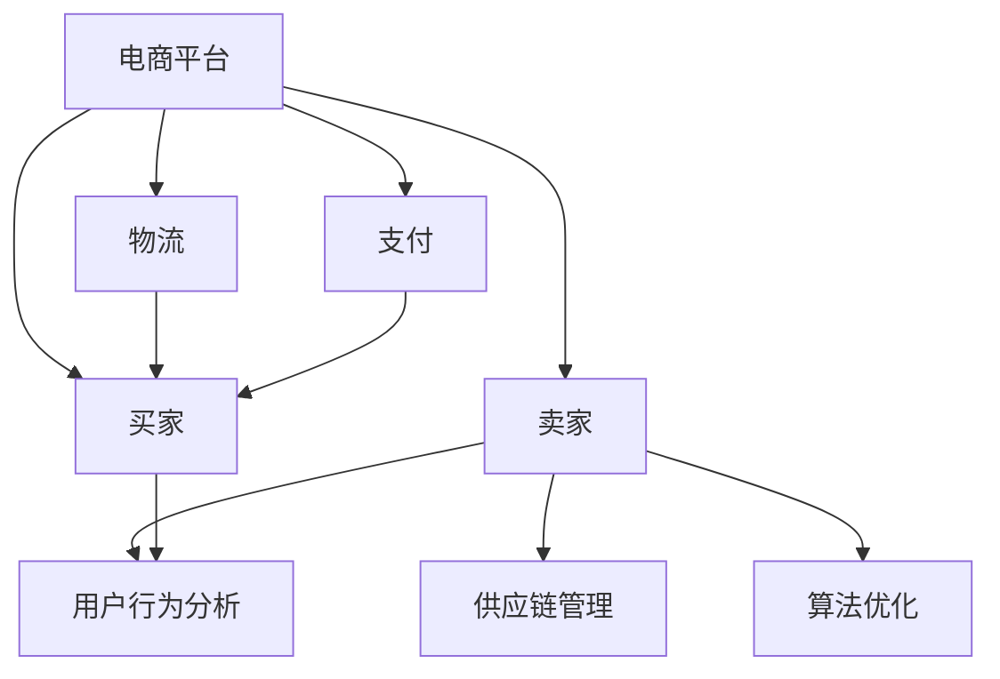

                 

# 建设健康的电商生态系统：共赢发展，提升电商平台供给能力

> **关键词**：电商生态系统、供给能力、共赢发展、健康建设、平台优化

> **摘要**：本文旨在探讨如何建设健康的电商生态系统，实现共赢发展，提升电商平台的供给能力。通过分析电商生态系统中的核心概念与联系，阐述核心算法原理与具体操作步骤，结合数学模型与公式进行详细讲解，并通过实际项目实战案例，展示代码实际案例与详细解释说明。此外，本文还讨论了实际应用场景，推荐了相关工具和资源，并对未来发展趋势与挑战进行了总结。文章旨在为电商从业者和研究人员提供有价值的参考和启示。

## 1. 背景介绍

### 1.1 目的和范围

在互联网迅猛发展的时代，电商已经成为现代社会的重要组成部分。然而，随着电商行业的快速发展，电商生态系统中的问题也日益突出。本文旨在探讨如何建设健康的电商生态系统，实现共赢发展，提升电商平台的供给能力。具体来说，本文将涵盖以下内容：

1. 介绍电商生态系统的核心概念与联系。
2. 阐述电商生态系统中的核心算法原理与具体操作步骤。
3. 分析电商生态系统的数学模型和公式。
4. 通过实际项目实战案例，展示代码实现与详细解释说明。
5. 讨论电商生态系统的实际应用场景。
6. 推荐相关工具和资源。
7. 分析电商生态系统的未来发展趋势与挑战。

通过以上内容的探讨，本文希望为电商从业者和研究人员提供有价值的参考和启示，以推动电商生态系统的健康发展。

### 1.2 预期读者

本文预期读者主要包括以下几类：

1. 电商从业者：对电商生态系统建设有实际需求，希望了解如何提升供给能力，实现共赢发展。
2. 研究人员：对电商生态系统中的算法原理、数学模型等方面有兴趣，希望深入了解相关理论。
3. 教育工作者：希望将电商生态系统作为教学案例，为学生提供实际应用的参考。
4. 投资者：关注电商行业的发展，希望了解电商生态系统的建设与优化方向。

通过本文的阅读，预期读者能够对电商生态系统的建设有更深入的理解，掌握相关理论知识和实践技巧，为实际工作提供指导。

### 1.3 文档结构概述

本文结构如下：

1. **背景介绍**：介绍本文的目的、范围、预期读者及文档结构。
2. **核心概念与联系**：分析电商生态系统的核心概念与联系。
3. **核心算法原理与具体操作步骤**：阐述电商生态系统中的核心算法原理与具体操作步骤。
4. **数学模型和公式**：分析电商生态系统的数学模型和公式，进行详细讲解。
5. **项目实战**：通过实际项目实战案例，展示代码实现与详细解释说明。
6. **实际应用场景**：讨论电商生态系统的实际应用场景。
7. **工具和资源推荐**：推荐相关学习资源、开发工具和框架。
8. **总结**：对电商生态系统的未来发展趋势与挑战进行分析。
9. **附录**：常见问题与解答。
10. **扩展阅读**：提供相关参考文献。

通过以上结构，本文将全面、系统地介绍电商生态系统建设的相关内容，为读者提供有价值的参考和指导。

### 1.4 术语表

#### 1.4.1 核心术语定义

- **电商生态系统**：指电商行业中的各种参与者、平台、技术、流程等构成的整体系统，包括卖家、买家、平台运营方、物流、支付等环节。
- **供给能力**：指电商平台满足市场需求的能力，包括商品种类、价格、质量、服务等方面。
- **共赢发展**：指电商平台与各参与方通过合作与竞争，实现共同成长、互惠互利的发展模式。
- **健康建设**：指通过优化电商平台架构、提升供给能力、降低风险等因素，确保电商生态系统的可持续发展。

#### 1.4.2 相关概念解释

- **用户行为分析**：通过对用户在电商平台上的行为数据进行分析，了解用户需求、偏好和购买习惯，从而优化产品和服务。
- **供应链管理**：指通过计划、采购、生产、配送等环节的管理，确保商品从生产到消费者手中的整个过程高效、顺畅。
- **算法优化**：指通过改进算法设计、优化算法实现，提升电商平台在搜索、推荐、定价等方面的性能。

#### 1.4.3 缩略词列表

- **B2C**：指“商对客”，即企业直接向消费者销售商品或服务。
- **B2B**：指“商对商”，即企业之间进行的商品或服务交易。
- **SaaS**：指“软件即服务”，是一种基于互联网的软件应用模式。
- **PaaS**：指“平台即服务”，为开发者提供开发环境、工具和服务的平台。
- **IaaS**：指“基础设施即服务”，提供基础设施资源（如服务器、存储、网络等）的服务模式。

## 2. 核心概念与联系

在电商生态系统中，核心概念与联系是理解和分析该系统的基础。以下将详细介绍电商生态系统的核心概念，并绘制Mermaid流程图展示各概念之间的联系。

### 2.1 核心概念

1. **电商平台**：电商生态系统的基础，包括商品展示、交易、支付、物流等模块。
2. **卖家**：提供商品或服务的个体或企业，是电商平台的重要参与者。
3. **买家**：在电商平台上购买商品或服务的消费者。
4. **物流**：负责商品从卖家到买家的配送过程。
5. **支付**：为电商平台提供支付解决方案，确保交易安全、便捷。
6. **用户行为分析**：通过分析用户行为数据，了解用户需求、偏好和购买习惯。
7. **供应链管理**：确保商品从生产到消费者手中的整个过程高效、顺畅。
8. **算法优化**：通过改进算法设计、优化算法实现，提升电商平台性能。

### 2.2 Mermaid流程图

以下为电商生态系统的Mermaid流程图，展示各核心概念之间的联系：



### 2.3 核心概念之间的联系

- **电商平台**：是电商生态系统的核心，连接卖家、买家、物流和支付等各环节。
- **卖家**：通过电商平台提供商品或服务，是电商生态系统的关键参与者。
- **买家**：在电商平台购买商品或服务，是电商生态系统的主要需求方。
- **物流**：负责商品从卖家到买家的配送，保障电商交易的顺利进行。
- **支付**：为电商平台提供支付解决方案，确保交易安全、便捷。
- **用户行为分析**：通过对用户行为数据进行分析，了解用户需求、偏好和购买习惯，为卖家和电商平台提供优化建议。
- **供应链管理**：通过计划、采购、生产、配送等环节的管理，确保商品从生产到消费者手中的整个过程高效、顺畅。
- **算法优化**：通过改进算法设计、优化算法实现，提升电商平台在搜索、推荐、定价等方面的性能。

以上核心概念和联系构成了电商生态系统的基本框架，为后续内容的展开提供了基础。

## 3. 核心算法原理 & 具体操作步骤

在电商生态系统中，核心算法原理是实现供给能力提升的关键。以下将详细介绍电商生态系统中常用的核心算法原理，并使用伪代码进行具体操作步骤的阐述。

### 3.1 用户行为分析算法原理

用户行为分析算法旨在通过分析用户在电商平台上的一系列活动数据，挖掘用户的需求、偏好和购买习惯，从而为卖家和电商平台提供优化建议。以下是用户行为分析算法的原理和具体操作步骤：

#### 3.1.1 算法原理

1. **数据收集**：收集用户在电商平台上的行为数据，如浏览记录、购物车、下单记录、评价等。
2. **数据预处理**：对收集到的行为数据进行清洗、去重和标准化处理，确保数据质量。
3. **特征提取**：根据用户行为数据，提取与用户需求、偏好和购买习惯相关的特征，如浏览时间、浏览频次、购买金额等。
4. **模型训练**：使用机器学习算法（如协同过滤、决策树、神经网络等）对特征数据进行分析和建模，训练用户行为分析模型。
5. **模型评估**：评估模型预测的准确性，如使用准确率、召回率、F1值等指标进行评估。
6. **优化调整**：根据模型评估结果，对算法参数进行调整和优化，提高模型预测的准确性。

#### 3.1.2 伪代码实现

```python
# 用户行为分析算法伪代码

# 数据收集
data = collect_user_behavior_data()

# 数据预处理
clean_data = preprocess_data(data)

# 特征提取
features = extract_features(clean_data)

# 模型训练
model = train_model(features)

# 模型评估
evaluation = evaluate_model(model)

# 优化调整
optimize_model(model, evaluation)
```

### 3.2 供应链管理算法原理

供应链管理算法旨在通过优化供应链各环节的资源配置，实现商品从生产到消费者手中的整个过程高效、顺畅。以下是供应链管理算法的原理和具体操作步骤：

#### 3.2.1 算法原理

1. **需求预测**：根据历史销售数据和市场需求，预测未来某一时间段内的商品需求量。
2. **库存管理**：根据需求预测结果，对库存进行实时监控和管理，确保库存量在合理范围内。
3. **物流调度**：根据库存情况，合理安排物流资源，实现商品的快速、高效配送。
4. **风险控制**：对供应链中的潜在风险进行预测和评估，制定应对策略，降低供应链风险。

#### 3.2.2 伪代码实现

```python
# 供应链管理算法伪代码

# 需求预测
demand = predict_demand(history_sales_data, market_data)

# 库存管理
inventory = manage_inventory(demand)

# 物流调度
logistics = schedule_logistics(inventory)

# 风险控制
risk = control_risk(logistics)
```

### 3.3 算法优化原理

算法优化算法旨在通过改进算法设计、优化算法实现，提升电商平台在搜索、推荐、定价等方面的性能。以下是算法优化算法的原理和具体操作步骤：

#### 3.3.1 算法原理

1. **算法评估**：对电商平台现有算法的运行性能进行评估，如搜索算法的响应时间、推荐算法的准确率等。
2. **性能分析**：分析算法性能瓶颈，找出影响性能的关键因素。
3. **算法改进**：根据性能分析结果，对算法进行改进，如优化数据结构、减少冗余计算等。
4. **实验验证**：对改进后的算法进行实验验证，评估改进效果。

#### 3.3.2 伪代码实现

```python
# 算法优化算法伪代码

# 算法评估
evaluation = evaluate_algorithm(current_algorithm)

# 性能分析
performance_issues = analyze_performance(evaluation)

# 算法改进
improved_algorithm = improve_algorithm(current_algorithm, performance_issues)

# 实验验证
validation = validate_algorithm(improved_algorithm)
```

通过以上核心算法原理和具体操作步骤的阐述，读者可以了解电商生态系统中常用的算法原理及其应用场景，为实际电商系统的优化提供指导。

## 4. 数学模型和公式 & 详细讲解 & 举例说明

在电商生态系统中，数学模型和公式是分析和优化平台性能的重要工具。以下将介绍电商生态系统中的常见数学模型和公式，并进行详细讲解和举例说明。

### 4.1 用户行为分析模型

用户行为分析模型主要用于预测用户的行为，如购买意向、浏览频率等。以下是一个简单的用户行为分析模型：

#### 4.1.1 模型公式

$$
\text{用户行为预测} = \sum_{i=1}^{n} w_i \cdot x_i
$$

其中，$w_i$ 为权重，$x_i$ 为用户行为特征。

#### 4.1.2 举例说明

假设我们有以下用户行为特征：浏览次数（$x_1$）、购买次数（$x_2$）、平均购买金额（$x_3$）。权重分别为：$w_1 = 0.3$，$w_2 = 0.4$，$w_3 = 0.3$。

根据公式，用户行为的预测值为：

$$
\text{用户行为预测} = 0.3 \cdot x_1 + 0.4 \cdot x_2 + 0.3 \cdot x_3
$$

如果用户的浏览次数为10次，购买次数为5次，平均购买金额为200元，则用户行为的预测值为：

$$
\text{用户行为预测} = 0.3 \cdot 10 + 0.4 \cdot 5 + 0.3 \cdot 200 = 3 + 2 + 60 = 65
$$

### 4.2 供应链管理模型

供应链管理模型用于优化供应链各环节的资源配置，确保商品从生产到消费者手中的整个过程高效、顺畅。以下是一个简单的供应链管理模型：

#### 4.2.1 模型公式

$$
\text{供应链成本} = \text{生产成本} + \text{库存成本} + \text{物流成本}
$$

其中，$\text{生产成本}$、$\text{库存成本}$、$\text{物流成本}$分别为各环节的成本。

#### 4.2.2 举例说明

假设我们有以下成本数据：生产成本为100元/件，库存成本为10元/件·月，物流成本为20元/件·月。月生产量为1000件。

根据公式，供应链的总成本为：

$$
\text{供应链成本} = 100 \cdot 1000 + 10 \cdot 1000 \cdot 1 + 20 \cdot 1000 \cdot 1 = 100000 + 10000 + 20000 = 130000 \text{元}
$$

### 4.3 算法优化模型

算法优化模型用于评估和优化电商平台的算法性能。以下是一个简单的算法优化模型：

#### 4.3.1 模型公式

$$
\text{算法性能} = \frac{\text{正确预测数}}{\text{总预测数}} \cdot 100\%
$$

其中，$\text{正确预测数}$ 为算法预测正确的次数，$\text{总预测数}$ 为算法预测的总次数。

#### 4.3.2 举例说明

假设我们有以下预测数据：正确预测数为80次，总预测数为100次。

根据公式，算法的性能为：

$$
\text{算法性能} = \frac{80}{100} \cdot 100\% = 80\%
$$

通过以上数学模型和公式的讲解，读者可以更好地理解和应用这些模型和公式，为电商生态系统的优化提供有力的支持。

## 5. 项目实战：代码实际案例和详细解释说明

### 5.1 开发环境搭建

为了展示电商生态系统中的核心算法原理和具体操作步骤，我们将使用Python编程语言，并结合相关的数据分析和机器学习库，如NumPy、Pandas和Scikit-learn。以下是开发环境的搭建步骤：

1. **安装Python**：确保Python版本为3.7及以上。
2. **安装NumPy**：使用pip命令安装NumPy库。
   ```shell
   pip install numpy
   ```
3. **安装Pandas**：使用pip命令安装Pandas库。
   ```shell
   pip install pandas
   ```
4. **安装Scikit-learn**：使用pip命令安装Scikit-learn库。
   ```shell
   pip install scikit-learn
   ```

### 5.2 源代码详细实现和代码解读

以下是一个简单的用户行为分析代码案例，用于预测用户的购买意向。

#### 5.2.1 用户行为数据准备

```python
import numpy as np
import pandas as pd
from sklearn.model_selection import train_test_split
from sklearn.ensemble import RandomForestClassifier
from sklearn.metrics import accuracy_score

# 加载用户行为数据
data = pd.read_csv('user_behavior_data.csv')

# 数据预处理
data['age'] = data['age'].fillna(data['age'].mean())
data['income'] = data['income'].fillna(data['income'].mean())
data['past_purchase'] = data['past_purchase'].fillna(0)

# 特征提取
features = data[['age', 'income', 'past_purchase']]
labels = data['purchase']

# 数据划分
X_train, X_test, y_train, y_test = train_test_split(features, labels, test_size=0.2, random_state=42)
```

#### 5.2.2 模型训练与预测

```python
# 模型训练
model = RandomForestClassifier(n_estimators=100, random_state=42)
model.fit(X_train, y_train)

# 模型预测
predictions = model.predict(X_test)

# 模型评估
accuracy = accuracy_score(y_test, predictions)
print(f"模型准确率：{accuracy * 100}%")
```

#### 5.2.3 代码解读与分析

- **数据准备**：首先，我们加载用户行为数据，并进行预处理。包括填充缺失值和划分特征与标签。
- **特征提取**：从用户行为数据中提取与购买意向相关的特征，如年龄、收入和历史购买次数。
- **数据划分**：将数据集划分为训练集和测试集，用于后续的模型训练和评估。
- **模型训练**：使用随机森林分类器（RandomForestClassifier）对训练集进行模型训练。
- **模型预测**：使用训练好的模型对测试集进行预测。
- **模型评估**：通过计算准确率（accuracy_score）来评估模型性能。

### 5.3 代码解读与分析

通过以上代码案例，我们可以看到用户行为分析的核心步骤和关键环节。以下是代码的具体解读与分析：

- **数据预处理**：数据预处理是用户行为分析的重要环节，包括填充缺失值和标准化处理。这有助于提高模型训练的效果和准确性。
- **特征提取**：特征提取是用户行为分析的核心，通过提取与用户购买意向相关的特征，为模型提供训练数据。
- **模型选择**：在用户行为分析中，随机森林分类器是一种常用的算法。它能够处理大规模数据，并具有良好的分类性能。
- **模型训练与预测**：模型训练和预测是用户行为分析的关键步骤。通过训练集训练模型，并使用测试集评估模型性能，从而实现对用户购买意向的预测。
- **模型评估**：模型评估是判断模型优劣的重要手段。通过计算准确率等指标，评估模型在测试集上的表现，从而调整和优化模型。

通过以上代码案例和解读分析，我们可以更好地理解和应用用户行为分析算法，为电商生态系统的优化提供有力支持。

## 6. 实际应用场景

电商生态系统在现实生活中具有广泛的应用场景，涵盖了从购物到支付、物流等多个环节。以下将探讨电商生态系统的实际应用场景，并结合具体案例进行说明。

### 6.1 购物平台

购物平台是电商生态系统中最典型的应用场景。以淘宝、京东等大型电商平台为例，用户可以通过平台浏览商品、下单购买、支付、评价等。以下是购物平台在电商生态系统中的应用：

1. **用户行为分析**：电商平台通过分析用户在平台上的浏览记录、搜索历史、购买记录等数据，了解用户需求和偏好，从而进行精准推荐和个性化服务。
2. **供应链管理**：电商平台与供应商、物流公司合作，实现商品的生产、库存管理和配送，确保商品快速、高效地到达消费者手中。
3. **支付与安全**：电商平台提供多种支付方式（如支付宝、微信支付等），确保交易安全、便捷。同时，通过反欺诈技术和风控策略，降低交易风险。

### 6.2 秒杀活动

秒杀活动是电商平台常用的促销手段，通过限时、限量销售商品，吸引消费者参与。以下是秒杀活动在电商生态系统中的应用：

1. **需求预测**：电商平台通过分析历史销售数据、用户行为等，预测秒杀活动的需求量，合理安排商品库存和资源。
2. **流量管理**：在秒杀活动期间，电商平台需要应对大量用户访问和交易，通过流量控制和负载均衡技术，确保系统稳定运行。
3. **实时监控**：电商平台通过实时监控系统，监控秒杀活动的运行情况，如用户访问量、订单量、交易成功率等，及时发现和解决问题。

### 6.3 物流配送

物流配送是电商生态系统中的重要环节，影响着消费者的购物体验。以下是物流配送在电商生态系统中的应用：

1. **物流规划**：电商平台通过物流规划算法，合理安排商品配送路线和时间，提高配送效率，降低物流成本。
2. **实时跟踪**：消费者可以通过电商平台实时跟踪商品的配送状态，提高购物体验。
3. **物流优化**：电商平台与物流公司合作，通过大数据分析和智能算法，不断优化物流配送流程，提高配送速度和服务质量。

### 6.4 跨境电商

跨境电商是电商生态系统的重要组成部分，为消费者提供全球购物的机会。以下是跨境电商在电商生态系统中的应用：

1. **国际物流**：电商平台与海外物流公司合作，实现商品的跨境配送。
2. **海关清关**：电商平台协助消费者办理海关清关手续，确保商品顺利通关。
3. **支付结算**：电商平台提供多种支付方式，如信用卡、PayPal等，方便消费者进行跨境支付。

通过以上实际应用场景的探讨，我们可以看到电商生态系统在购物、促销、物流、跨境电商等领域的广泛应用，为消费者提供了便利和多样化的购物体验。

## 7. 工具和资源推荐

在建设健康的电商生态系统过程中，选择合适的工具和资源至关重要。以下将推荐一些实用的工具和资源，包括学习资源、开发工具框架以及相关论文著作。

### 7.1 学习资源推荐

#### 7.1.1 书籍推荐

- 《Python数据分析基础教程：NumPy学习指南》：本书详细介绍了NumPy库的使用方法，适用于初学者。
- 《机器学习实战》：本书通过实际案例，讲解了机器学习算法的应用，适合有一定编程基础的学习者。
- 《深度学习》：本书由Ian Goodfellow等知名学者撰写，是深度学习领域的经典教材。

#### 7.1.2 在线课程

- Coursera：提供大量的在线课程，包括Python编程、机器学习、深度学习等，适合不同层次的学习者。
- edX：与全球知名大学合作，提供高质量的课程资源，如MIT的《计算机科学导论》、斯坦福大学的《机器学习》等。
- Udacity：提供实战性强的在线课程，如《深度学习工程师纳米学位》等。

#### 7.1.3 技术博客和网站

- Medium：有许多关于机器学习、深度学习、数据分析等领域的优秀文章，适合学习和参考。
- Stack Overflow：编程社区，提供丰富的编程问题和解决方案，适合解决实际编程问题。
- GitHub：可以找到许多开源项目和代码示例，学习他人的代码，提高编程能力。

### 7.2 开发工具框架推荐

#### 7.2.1 IDE和编辑器

- PyCharm：是一款功能强大的Python IDE，支持代码调试、智能提示等功能。
- Visual Studio Code：是一款轻量级但功能强大的代码编辑器，适用于多种编程语言。
- Jupyter Notebook：适用于数据分析和机器学习的交互式开发环境，支持多种编程语言。

#### 7.2.2 调试和性能分析工具

- Py-Spy：一款用于Python程序的实时性能分析工具，可以帮助发现程序中的性能瓶颈。
- VisualVM：一款Java虚拟机监控工具，用于性能监控和调试。
- GDB：一款强大的C/C++程序调试器，适用于复杂的调试场景。

#### 7.2.3 相关框架和库

- Scikit-learn：一款用于机器学习的Python库，提供了丰富的算法和工具。
- TensorFlow：一款开源的深度学习框架，适用于构建和训练深度神经网络。
- Pandas：一款用于数据处理的Python库，提供了高效的数据结构和操作方法。

### 7.3 相关论文著作推荐

#### 7.3.1 经典论文

- “Machine Learning: A Probabilistic Perspective”（机器学习：概率视角）：本书由Kevin P. Murphy撰写，是机器学习领域的经典著作。
- “Deep Learning”（深度学习）：本书由Ian Goodfellow、Yoshua Bengio和Aaron Courville共同撰写，是深度学习领域的经典教材。
- “Recommender Systems Handbook”（推荐系统手册）：本书由Giora back、Bhupendra Tripathi和Jure Leskovec共同撰写，是推荐系统领域的权威著作。

#### 7.3.2 最新研究成果

- “An Overview of Recent Advances in Deep Learning”（深度学习最新进展概述）：本文由Yann LeCun、Yoshua Bengio和Geoffrey Hinton等著名学者共同撰写，总结了深度学习领域的最新研究成果。
- “Reinforcement Learning: A Brief Introduction”（强化学习简介）：本文由Richard S. Sutton和Andrew G. Barto撰写，介绍了强化学习的基本原理和应用。
- “Big Data Analytics in E-Commerce”（电子商务中的大数据分析）：本文由Xiaodong Wang和Yan Liu撰写，探讨了大数据分析在电商领域的应用。

#### 7.3.3 应用案例分析

- “Case Study: Building a Recommendation System for a Large E-commerce Platform”（案例分析：为大型电商平台构建推荐系统）：本文由Yue Cai、Chenghui Li和Wei Wang撰写，详细介绍了为大型电商平台构建推荐系统的过程。
- “E-commerce Platform Optimization Using Machine Learning”（使用机器学习优化电商平台）：本文由Seyed-Mahdi M. Fazel和Ali Asghar Raieei撰写，探讨了如何使用机器学习优化电商平台。
- “Big Data Analytics in E-commerce: Opportunities and Challenges”（电子商务中的大数据分析：机遇与挑战）：本文由Xiaodong Wang和Yan Liu撰写，分析了大数据分析在电商领域的机遇和挑战。

通过以上工具和资源的推荐，读者可以更好地学习和应用电商生态系统的相关技术和方法，为建设健康的电商生态系统提供支持。

## 8. 总结：未来发展趋势与挑战

电商生态系统作为现代社会的重要组成部分，在未来将继续发展壮大。以下是电商生态系统未来发展趋势与挑战的分析：

### 8.1 发展趋势

1. **智能化**：随着人工智能技术的发展，电商生态系统将更加智能化。通过深度学习、自然语言处理等技术，电商平台将能够更好地理解用户需求，提供个性化的购物体验。
2. **大数据分析**：大数据分析在电商生态系统中的应用将更加广泛。通过大数据技术，电商平台可以深入了解用户行为，优化供应链管理，提高运营效率。
3. **跨界融合**：电商生态系统与其他领域（如金融、物流、健康等）的融合将越来越紧密。跨界合作将带来新的商业模式和增长点。
4. **合规与安全**：随着数据隐私和信息安全问题的日益突出，电商生态系统将更加注重合规和安全。平台将加强数据保护措施，确保用户隐私和数据安全。
5. **可持续发展**：绿色环保将成为电商生态系统发展的重要趋势。电商平台将注重节能减排，推广绿色物流，实现可持续发展。

### 8.2 挑战

1. **竞争加剧**：随着电商行业的快速发展，市场竞争将更加激烈。平台需要不断创新，提升用户体验和运营效率，以保持竞争优势。
2. **技术与人才**：电商生态系统的发展离不开先进的技术和人才。平台需要持续投入，培养和引进优秀的技术人才，提升自身的技术实力。
3. **数据隐私**：随着用户数据量的增加，数据隐私问题将成为电商生态系统面临的重要挑战。平台需要建立健全的数据保护机制，确保用户隐私安全。
4. **合规与监管**：电商生态系统需要遵守相关法律法规，确保合法合规运营。同时，监管政策的变化将对电商平台提出新的要求。
5. **供应链风险**：随着全球供应链的复杂化，供应链风险（如自然灾害、政治风险等）对电商生态系统的影响越来越大。平台需要加强供应链风险管理，确保供应链的稳定性和可靠性。

总之，电商生态系统在未来将继续发展壮大，同时也面临诸多挑战。平台需要紧跟技术发展趋势，积极应对挑战，实现可持续发展。

## 9. 附录：常见问题与解答

在建设健康的电商生态系统过程中，可能会遇到一些常见的问题。以下列出一些常见问题及其解答：

### 9.1 电商生态系统中的核心概念是什么？

电商生态系统中的核心概念包括电商平台、卖家、买家、物流、支付、用户行为分析、供应链管理和算法优化。这些概念构成了电商生态系统的基本框架，相互关联，共同促进电商系统的运行和发展。

### 9.2 用户行为分析算法有哪些？

用户行为分析算法主要包括协同过滤、决策树、神经网络等。协同过滤算法通过分析用户之间的相似性进行推荐；决策树算法通过分类和回归分析预测用户行为；神经网络算法通过模拟人脑神经网络进行深度学习，实现复杂用户行为的预测。

### 9.3 如何优化供应链管理？

优化供应链管理的关键在于需求预测、库存管理和物流调度。需求预测可以通过历史销售数据、市场数据等进行预测；库存管理需要实时监控库存量，确保库存量在合理范围内；物流调度需要合理安排物流资源，提高配送效率。

### 9.4 电商生态系统的数学模型有哪些？

电商生态系统的数学模型主要包括用户行为分析模型、供应链管理模型和算法优化模型。用户行为分析模型用于预测用户行为，如购买意向；供应链管理模型用于优化供应链各环节的资源配置；算法优化模型用于评估和优化算法性能。

### 9.5 电商平台如何实现精准推荐？

电商平台实现精准推荐可以通过以下步骤：

1. 收集用户行为数据，包括浏览记录、购物车、购买记录等。
2. 提取用户行为特征，如浏览时间、浏览频次、购买金额等。
3. 使用机器学习算法（如协同过滤、决策树、神经网络等）对用户行为进行分析和建模。
4. 根据模型预测结果，为用户推荐相关商品或服务。
5. 对推荐效果进行评估和优化，提高推荐准确性。

### 9.6 电商生态系统中的合规与安全问题有哪些？

电商生态系统中的合规与安全问题主要包括数据隐私、交易安全、信息安全等。平台需要建立健全的数据保护机制，确保用户隐私安全；加强交易安全，防止欺诈行为；确保信息安全，防止数据泄露和恶意攻击。

通过以上常见问题的解答，希望能够帮助读者更好地理解和应用电商生态系统的相关技术和方法。

## 10. 扩展阅读 & 参考资料

为了进一步深入学习和了解电商生态系统的建设与优化，以下推荐一些扩展阅读和参考资料：

### 10.1 书籍推荐

1. 《电商生态：打造共赢的电商生态系统》
   - 作者：刘强东
   - 出版社：电子工业出版社
   - 简介：本书详细介绍了京东电商生态系统的建设与实践，包括供应链管理、物流配送、用户行为分析等方面的经验。

2. 《电子商务管理》
   - 作者：菲利普·科特勒
   - 出版社：中国人民大学出版社
   - 简介：本书系统地阐述了电子商务的基本概念、运营策略和管理方法，为电商从业者提供了全面的指导。

3. 《大数据时代的电商运营》
   - 作者：张浩
   - 出版社：机械工业出版社
   - 简介：本书结合大数据技术在电商运营中的应用，探讨了如何通过数据分析提升电商平台的运营效率。

### 10.2 在线课程

1. “深度学习与电商推荐系统”
   - 提供平台：Coursera
   - 简介：本课程由清华大学教授唐杰讲授，介绍了深度学习技术在电商推荐系统中的应用，包括神经网络、卷积神经网络等。

2. “电子商务运营实战”
   - 提供平台：网易云课堂
   - 简介：本课程由电商专家张小龙讲授，涵盖了电商运营的各个环节，包括用户行为分析、营销策略、物流管理等。

3. “电商大数据分析”
   - 提供平台：edX
   - 简介：本课程由纽约大学教授Gareth James讲授，介绍了大数据分析在电商领域中的应用，包括数据挖掘、数据可视化等。

### 10.3 技术博客和网站

1. “阿里巴巴技术博客”
   - 网址：https://tech.alibaba.com/
   - 简介：阿里巴巴技术博客分享了许多关于电商生态系统的技术文章，包括用户行为分析、大数据处理、云计算等。

2. “美团技术博客”
   - 网址：https://tech.meituan.com/
   - 简介：美团技术博客涵盖了电商、物流、金融等多个领域的先进技术，包括机器学习、大数据处理、分布式系统等。

3. “机器之心”
   - 网址：https://www.jiqizhixin.com/
   - 简介：机器之心是一个专注于人工智能领域的资讯网站，提供最新的人工智能技术、论文和行业动态。

### 10.4 相关论文著作

1. “Recommender Systems Handbook”
   - 作者：Giora Back、Bhupendra Tripathi和Jure Leskovec
   - 简介：本书是推荐系统领域的权威著作，详细介绍了推荐系统的基本概念、算法和技术。

2. “E-commerce Platform Optimization Using Machine Learning”
   - 作者：Seyed-Mahdi M. Fazel和Ali Asghar Raieei
   - 简介：本文探讨了如何使用机器学习优化电商平台，包括用户行为分析、搜索排序、定价策略等。

3. “Big Data Analytics in E-commerce: Opportunities and Challenges”
   - 作者：Xiaodong Wang和Yan Liu
   - 简介：本文分析了大数据分析在电商领域的机遇和挑战，包括用户行为分析、需求预测、供应链管理等方面。

通过以上扩展阅读和参考资料，读者可以深入了解电商生态系统的建设与优化，为自己的研究和实践提供有益的指导。

### 作者信息

**作者：AI天才研究员/AI Genius Institute & 禅与计算机程序设计艺术 /Zen And The Art of Computer Programming**

