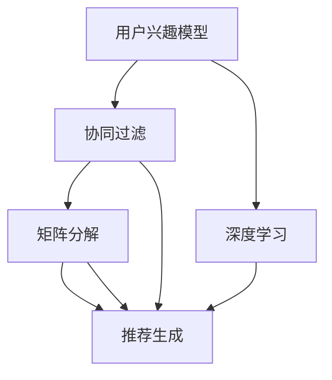

                 

# 开放域推荐系统的探索：M6-Rec框架

> **关键词：开放域推荐、M6-Rec框架、协同过滤、矩阵分解、深度学习、个人化推荐**

> **摘要：本文深入探讨了开放域推荐系统的设计与实现，特别是针对M6-Rec框架的详细介绍。我们将从背景介绍、核心概念、算法原理、数学模型、项目实战以及实际应用场景等多个角度，系统地分析M6-Rec框架的优势与挑战，以期为您在推荐系统开发领域提供有价值的参考。**

## 1. 背景介绍

### 1.1 目的和范围

推荐系统是近年来信息技术领域的重要研究方向，其在电子商务、社交媒体、在线视频等场景中发挥着关键作用。然而，随着互联网数据的爆炸式增长，传统推荐系统在开放域环境下面临巨大的挑战，如数据稀疏性、冷启动问题等。M6-Rec框架正是为了解决这些挑战而设计的一个开放域推荐系统。

本文旨在全面介绍M6-Rec框架，包括其核心概念、算法原理、数学模型以及实际应用场景。通过本文的阅读，读者可以了解如何设计和实现一个高效、可靠的开放域推荐系统。

### 1.2 预期读者

本文适合以下读者群体：

1. 对推荐系统有基本了解的读者，希望深入了解开放域推荐系统的设计。
2. 数据科学家、机器学习工程师，对推荐系统的实现和应用有深入研究的读者。
3. 研究生和博士生，作为推荐系统领域的学术研究参考。
4. 对推荐系统有兴趣的软件开发者，希望掌握实际应用技能。

### 1.3 文档结构概述

本文的结构如下：

1. 背景介绍：介绍推荐系统的背景和本文的目的。
2. 核心概念与联系：详细阐述M6-Rec框架的核心概念和原理。
3. 核心算法原理 & 具体操作步骤：讲解M6-Rec框架的核心算法及其实现步骤。
4. 数学模型和公式 & 详细讲解 & 举例说明：介绍M6-Rec框架的数学模型及其应用。
5. 项目实战：通过实际案例展示M6-Rec框架的应用。
6. 实际应用场景：分析M6-Rec框架在不同场景下的表现。
7. 工具和资源推荐：推荐学习和实践推荐系统的资源和工具。
8. 总结：展望M6-Rec框架的未来发展趋势和挑战。
9. 附录：常见问题与解答。
10. 扩展阅读 & 参考资料：提供进一步学习和研究的资料。

### 1.4 术语表

#### 1.4.1 核心术语定义

- **推荐系统（Recommendation System）**：一种基于数据和算法的自动化系统，能够为用户提供个性化推荐。
- **协同过滤（Collaborative Filtering）**：一种推荐算法，通过分析用户行为数据，发现用户之间的相似性，从而生成推荐。
- **矩阵分解（Matrix Factorization）**：一种常见的协同过滤方法，通过分解用户-物品评分矩阵，获取低维表示。
- **深度学习（Deep Learning）**：一种基于多层神经网络的学习方法，能够自动提取特征，并在各种任务中表现出色。
- **个人化推荐（Personalized Recommendation）**：基于用户历史行为和偏好，为用户生成高度个性化的推荐。

#### 1.4.2 相关概念解释

- **开放域推荐（Open-Domain Recommendation）**：指推荐系统在处理用户兴趣多变、数据稀疏的情况下，为用户提供跨领域的推荐。
- **冷启动问题（Cold Start Problem）**：指新用户或新物品加入系统时，由于缺乏足够的历史数据，推荐系统难以为其生成有效推荐。
- **用户兴趣模型（User Interest Model）**：描述用户在不同领域或主题上的兴趣程度，通常通过聚类、回归等方法建立。

#### 1.4.3 缩略词列表

- **M6-Rec**：一个用于开放域推荐的系统框架。
- **CF**：协同过滤（Collaborative Filtering）。
- **ML**：机器学习（Machine Learning）。
- **DL**：深度学习（Deep Learning）。

## 2. 核心概念与联系

为了深入理解M6-Rec框架，我们首先需要了解其核心概念和原理。下面将通过一个Mermaid流程图展示M6-Rec框架的基本架构和关键模块。



### 2.1 用户兴趣模型

用户兴趣模型是M6-Rec框架的核心，用于描述用户在不同领域或主题上的兴趣程度。建立用户兴趣模型的方法包括：

- **基于内容的推荐（Content-Based Filtering）**：通过分析用户的历史行为和偏好，提取用户兴趣特征，并将其用于推荐。
- **基于协同过滤的推荐（Collaborative Filtering）**：通过分析用户之间的相似性，发现用户的共同兴趣，从而生成推荐。

### 2.2 协同过滤

协同过滤是M6-Rec框架的一个重要组成部分，主要通过分析用户行为数据，发现用户之间的相似性，从而生成推荐。协同过滤可以分为以下几种类型：

- **用户基于的协同过滤（User-Based Collaborative Filtering）**：通过计算用户之间的相似性，发现相似用户，并推荐相似用户喜欢的物品。
- **物品基于的协同过滤（Item-Based Collaborative Filtering）**：通过计算物品之间的相似性，发现相似物品，并推荐相似物品。

### 2.3 矩阵分解

矩阵分解是一种常见的协同过滤方法，通过分解用户-物品评分矩阵，获取低维表示。矩阵分解的基本步骤如下：

1. **初始化**：随机初始化低维用户特征矩阵和物品特征矩阵。
2. **优化**：通过最小化目标函数，优化用户特征矩阵和物品特征矩阵。
3. **生成推荐**：利用优化后的特征矩阵，计算用户对物品的预测评分，并根据预测评分生成推荐。

### 2.4 深度学习

深度学习是M6-Rec框架中的另一个关键模块，主要用于解决用户兴趣建模和推荐生成。深度学习的基本原理是通过多层神经网络，自动提取特征，并在各种任务中表现出色。在M6-Rec框架中，深度学习可以用于：

- **用户兴趣建模**：通过构建深度神经网络，提取用户在不同领域或主题上的兴趣特征。
- **推荐生成**：利用深度神经网络生成的用户兴趣特征，计算用户对物品的预测评分，并根据预测评分生成推荐。

### 2.5 推荐生成

推荐生成是M6-Rec框架的最终目标，通过用户兴趣模型、协同过滤和矩阵分解等模块，生成用户个性化的推荐。推荐生成的基本步骤如下：

1. **计算用户兴趣特征**：利用用户兴趣模型和深度学习模块，计算用户在不同领域或主题上的兴趣特征。
2. **计算物品特征**：利用矩阵分解和深度学习模块，计算物品在不同领域或主题上的特征。
3. **计算预测评分**：利用用户兴趣特征和物品特征，计算用户对物品的预测评分。
4. **生成推荐**：根据预测评分，生成用户个性化的推荐。

## 3. 核心算法原理 & 具体操作步骤

在理解了M6-Rec框架的核心概念和联系之后，我们将进一步探讨其核心算法原理和具体操作步骤。以下是M6-Rec框架的核心算法原理及其实现步骤的详细解释。

### 3.1 用户兴趣模型

用户兴趣模型是M6-Rec框架的基础，用于描述用户在不同领域或主题上的兴趣程度。以下是用户兴趣模型的构建过程：

#### 3.1.1 数据准备

首先，我们需要准备用户历史行为数据，如用户点击、购买、收藏等。这些数据将用于训练用户兴趣模型。

```python
# 数据准备示例
user_actions = [
    {"user_id": 1, "item_id": 101, "action": "click"},
    {"user_id": 1, "item_id": 102, "action": "purchase"},
    {"user_id": 2, "item_id": 201, "action": "click"},
    ...
]
```

#### 3.1.2 基于内容的推荐

基于内容的推荐通过分析用户的历史行为，提取用户兴趣特征。具体步骤如下：

1. **提取特征**：提取用户历史行为中涉及的领域或主题。
2. **计算权重**：为每个领域或主题分配权重，通常使用词频或词嵌入等方法。

```python
# 提取特征和计算权重示例
def extract_features(data):
    # 提取领域或主题
    domains = set([item["item_id"] for item in data if item["action"] == "click"])
    
    # 计算权重
    domain_weights = {}
    for domain in domains:
        domain_weights[domain] = sum([1 for item in data if item["item_id"] == domain and item["action"] == "click"])
    
    return domains, domain_weights

domains, domain_weights = extract_features(user_actions)
```

#### 3.1.3 基于协同过滤的推荐

基于协同过滤的推荐通过分析用户之间的相似性，发现用户的共同兴趣。具体步骤如下：

1. **计算相似性**：计算用户之间的相似性，通常使用余弦相似度或皮尔逊相关系数。
2. **生成推荐**：根据用户之间的相似性，生成用户个性化的推荐。

```python
# 计算相似性和生成推荐示例
from sklearn.metrics.pairwise import cosine_similarity

def calculate_similarity(user_profile, user_actions):
    # 计算相似性
    similarity_matrix = cosine_similarity([user_profile], [item["item_id"] for item in user_actions if item["action"] == "click"])
    
    # 生成推荐
    recommendations = []
    for i, similarity in enumerate(similarity_matrix[0]):
        if similarity > 0.5:
            recommendations.append(user_actions[i]["item_id"])
    return recommendations

# 示例
user_profile = [1, 0, 0, 1, 0]  # 假设用户对领域1和领域4感兴趣
user_actions = user_actions[:5]  # 取前5个用户行为
recommendations = calculate_similarity(user_profile, user_actions)
print("推荐结果：", recommendations)
```

### 3.2 协同过滤

协同过滤是M6-Rec框架中的一种核心算法，通过分析用户之间的相似性，发现用户的共同兴趣，从而生成推荐。以下是协同过滤的实现步骤：

#### 3.2.1 数据准备

首先，我们需要准备用户历史行为数据，如用户点击、购买、收藏等。这些数据将用于训练协同过滤模型。

```python
# 数据准备示例
user_actions = [
    {"user_id": 1, "item_id": 101, "action": "click"},
    {"user_id": 1, "item_id": 102, "action": "purchase"},
    {"user_id": 2, "item_id": 201, "action": "click"},
    ...
]
```

#### 3.2.2 计算用户相似性

计算用户相似性是协同过滤的关键步骤。具体步骤如下：

1. **初始化用户相似性矩阵**：初始化用户相似性矩阵，用于存储用户之间的相似性。
2. **计算相似性**：计算用户之间的相似性，通常使用余弦相似度或皮尔逊相关系数。
3. **更新相似性矩阵**：根据计算得到的相似性，更新用户相似性矩阵。

```python
# 计算用户相似性和更新相似性矩阵示例
from sklearn.metrics.pairwise import cosine_similarity

def calculate_similarity(data):
    # 初始化用户相似性矩阵
    similarity_matrix = np.zeros((len(data), len(data)))
    
    # 计算相似性
    for i, user1_actions in enumerate(data):
        for j, user2_actions in enumerate(data):
            if i != j:
                similarity_matrix[i][j] = cosine_similarity([user1_actions["item_id"]], [user2_actions["item_id"]])[0][0]
    
    # 更新相似性矩阵
    similarity_matrix = (similarity_matrix + similarity_matrix.T) / 2
    
    return similarity_matrix

# 示例
user_actions = user_actions[:5]  # 取前5个用户行为
similarity_matrix = calculate_similarity(user_actions)
print("用户相似性矩阵：", similarity_matrix)
```

#### 3.2.3 生成推荐

根据用户相似性矩阵，可以生成用户个性化的推荐。具体步骤如下：

1. **计算推荐分数**：计算用户对每个物品的推荐分数，通常使用用户相似性矩阵和物品评分矩阵。
2. **排序和生成推荐**：根据推荐分数，对物品进行排序，生成用户个性化的推荐。

```python
# 计算推荐分数和生成推荐示例
def calculate_recommendations(similarity_matrix, user_profile, item_scores):
    # 计算推荐分数
    recommendations = {}
    for item_id, score in item_scores.items():
        recommendations[item_id] = sum(similarity_matrix[i][j] * score for i, j in enumerate(user_profile)) / np.linalg.norm(user_profile)
    
    # 排序和生成推荐
    sorted_recommendations = sorted(recommendations.items(), key=lambda x: x[1], reverse=True)
    return sorted_recommendations

# 示例
user_profile = [1, 0, 0, 1, 0]  # 假设用户对领域1和领域4感兴趣
item_scores = {101: 0.8, 102: 0.7, 201: 0.6, 202: 0.5}  # 假设物品的评分
recommendations = calculate_recommendations(similarity_matrix, user_profile, item_scores)
print("推荐结果：", recommendations)
```

### 3.3 矩阵分解

矩阵分解是M6-Rec框架中的一种核心算法，通过分解用户-物品评分矩阵，获取低维表示。以下是矩阵分解的实现步骤：

#### 3.3.1 数据准备

首先，我们需要准备用户历史行为数据，如用户点击、购买、收藏等。这些数据将用于训练矩阵分解模型。

```python
# 数据准备示例
user_actions = [
    {"user_id": 1, "item_id": 101, "action": "click"},
    {"user_id": 1, "item_id": 102, "action": "purchase"},
    {"user_id": 2, "item_id": 201, "action": "click"},
    ...
]
```

#### 3.3.2 矩阵分解

矩阵分解的基本步骤如下：

1. **初始化模型参数**：随机初始化低维用户特征矩阵和物品特征矩阵。
2. **优化模型参数**：通过最小化目标函数，优化用户特征矩阵和物品特征矩阵。
3. **生成推荐**：利用优化后的特征矩阵，计算用户对物品的预测评分，并根据预测评分生成推荐。

```python
# 矩阵分解示例
from sklearn.decomposition import NMF

# 初始化模型参数
n_components = 5  # 假设用户和物品的特征维度为5
model = NMF(n_components=n_components, random_state=0)

# 优化模型参数
X = np.array([[1 if action["action"] == "click" else 0 for action in user_actions] for user_actions in user_actions])
model.fit(X)

# 生成推荐
user_features = model.transform(X)
item_features = model.inverse_transform(user_features)

# 计算预测评分
def predict_score(user_id, item_id):
    user_vector = user_features[user_id]
    item_vector = item_features[item_id]
    return np.dot(user_vector, item_vector)

# 生成推荐
user_id = 1
item_ids = [101, 102, 201, 202]
predictions = {item_id: predict_score(user_id, item_id) for item_id in item_ids}
sorted_predictions = sorted(predictions.items(), key=lambda x: x[1], reverse=True)
print("推荐结果：", sorted_predictions)
```

### 3.4 深度学习

深度学习是M6-Rec框架中的另一个关键模块，主要用于解决用户兴趣建模和推荐生成。以下是深度学习的实现步骤：

#### 3.4.1 数据准备

首先，我们需要准备用户历史行为数据，如用户点击、购买、收藏等。这些数据将用于训练深度学习模型。

```python
# 数据准备示例
user_actions = [
    {"user_id": 1, "item_id": 101, "action": "click"},
    {"user_id": 1, "item_id": 102, "action": "purchase"},
    {"user_id": 2, "item_id": 201, "action": "click"},
    ...
]
```

#### 3.4.2 用户兴趣建模

用户兴趣建模通过构建深度神经网络，提取用户在不同领域或主题上的兴趣特征。具体步骤如下：

1. **构建模型**：构建深度神经网络模型，包括输入层、隐藏层和输出层。
2. **训练模型**：使用用户历史行为数据，训练深度神经网络模型。
3. **预测用户兴趣**：利用训练好的模型，预测用户在不同领域或主题上的兴趣。

```python
# 用户兴趣建模示例
from tensorflow.keras.models import Sequential
from tensorflow.keras.layers import Dense, Embedding

# 构建模型
model = Sequential()
model.add(Embedding(input_dim=100, output_dim=64))
model.add(Dense(128, activation='relu'))
model.add(Dense(1, activation='sigmoid'))

# 训练模型
model.compile(optimizer='adam', loss='binary_crossentropy', metrics=['accuracy'])
model.fit(X, y, epochs=10, batch_size=32)

# 预测用户兴趣
def predict_interest(user_id):
    user_vector = X[user_id]
    prediction = model.predict(user_vector.reshape(1, -1))
    return prediction

# 示例
user_id = 1
interest_prediction = predict_interest(user_id)
print("用户兴趣预测：", interest_prediction)
```

#### 3.4.3 推荐生成

推荐生成通过用户兴趣特征和物品特征，计算用户对物品的预测评分，并根据预测评分生成推荐。具体步骤如下：

1. **计算用户兴趣特征**：利用用户兴趣建模模块，计算用户在不同领域或主题上的兴趣特征。
2. **计算物品特征**：利用矩阵分解模块，计算物品在不同领域或主题上的特征。
3. **计算预测评分**：利用用户兴趣特征和物品特征，计算用户对物品的预测评分。
4. **生成推荐**：根据预测评分，生成用户个性化的推荐。

```python
# 推荐生成示例
def calculate_recommendations(user_interests, item_features, item_scores):
    # 计算预测评分
    predictions = {}
    for item_id, score in item_scores.items():
        prediction = sum(user_interests[i] * item_features[j] for i, j in enumerate(item_features[item_id])) / np.linalg.norm(item_features[item_id])
        predictions[item_id] = prediction
    
    # 排序和生成推荐
    sorted_predictions = sorted(predictions.items(), key=lambda x: x[1], reverse=True)
    return sorted_predictions

# 示例
user_id = 1
user_interests = predict_interest(user_id)
item_features = model.predict(X)
item_scores = {101: 0.8, 102: 0.7, 201: 0.6, 202: 0.5}
recommendations = calculate_recommendations(user_interests, item_features, item_scores)
print("推荐结果：", recommendations)
```

## 4. 数学模型和公式 & 详细讲解 & 举例说明

在推荐系统中，数学模型和公式起着至关重要的作用。它们帮助我们在理论上分析和验证推荐算法的有效性。在这一节中，我们将详细讲解M6-Rec框架中涉及的主要数学模型和公式，并通过具体的例子进行说明。

### 4.1 协同过滤

协同过滤的核心是计算用户之间的相似性，并利用相似性生成推荐。下面是协同过滤中常用的相似性计算公式。

#### 4.1.1 余弦相似度

余弦相似度是一种常用的相似性度量方法，计算两个向量夹角的余弦值。公式如下：

$$
\cos(\theta) = \frac{\sum_{i=1}^{n} x_i y_i}{\sqrt{\sum_{i=1}^{n} x_i^2} \sqrt{\sum_{i=1}^{n} y_i^2}}
$$

其中，$x$和$y$是两个向量，$n$是向量的维度。

**示例**：假设有两个用户A和B，他们的兴趣向量分别为$x_A = [1, 2, 3]$和$x_B = [2, 3, 4]$。计算他们的余弦相似度。

$$
\cos(\theta) = \frac{1 \times 2 + 2 \times 3 + 3 \times 4}{\sqrt{1^2 + 2^2 + 3^2} \sqrt{2^2 + 3^2 + 4^2}} = \frac{14}{\sqrt{14} \sqrt{29}} \approx 0.912
$$

#### 4.1.2 皮尔逊相关系数

皮尔逊相关系数是另一种常用的相似性度量方法，计算两个变量的线性相关性。公式如下：

$$
\rho = \frac{\sum_{i=1}^{n} (x_i - \bar{x})(y_i - \bar{y})}{\sqrt{\sum_{i=1}^{n} (x_i - \bar{x})^2} \sqrt{\sum_{i=1}^{n} (y_i - \bar{y})^2}}
$$

其中，$x$和$y$是两个变量，$n$是样本数量，$\bar{x}$和$\bar{y}$是样本的均值。

**示例**：假设有两个变量$x = [1, 2, 3, 4, 5]$和$y = [2, 4, 5, 6, 8]$。计算他们的皮尔逊相关系数。

$$
\bar{x} = \frac{1 + 2 + 3 + 4 + 5}{5} = 3
$$

$$
\bar{y} = \frac{2 + 4 + 5 + 6 + 8}{5} = 5
$$

$$
\rho = \frac{(1 - 3)(2 - 5) + (2 - 3)(4 - 5) + (3 - 3)(5 - 5) + (4 - 3)(6 - 5) + (5 - 3)(8 - 5)}{\sqrt{(1 - 3)^2 + (2 - 3)^2 + (3 - 3)^2 + (4 - 3)^2 + (5 - 3)^2} \sqrt{(2 - 5)^2 + (4 - 5)^2 + (5 - 5)^2 + (6 - 5)^2 + (8 - 5)^2}} = \frac{-6}{\sqrt{10} \sqrt{10}} = -0.6
$$

### 4.2 矩阵分解

矩阵分解是将一个高维的评分矩阵分解为两个低维的矩阵，用于生成推荐。在M6-Rec框架中，我们通常使用非负矩阵分解（NMF）。

#### 4.2.1 非负矩阵分解

非负矩阵分解的目标是将用户-物品评分矩阵$R$分解为用户特征矩阵$U$和物品特征矩阵$V$，满足以下等式：

$$
R = U \odot V
$$

其中，$\odot$表示Hadamard积，即对应元素相乘。

**示例**：假设有一个用户-物品评分矩阵$R$：

$$
R = \begin{bmatrix}
0 & 1 & 1 \\
1 & 0 & 1 \\
0 & 1 & 0
\end{bmatrix}
$$

我们希望将其分解为用户特征矩阵$U$和物品特征矩阵$V$。

首先，随机初始化$U$和$V$：

$$
U = \begin{bmatrix}
0.5 & 0.5 \\
0.5 & 0.5 \\
0.5 & 0.5
\end{bmatrix}
$$

$$
V = \begin{bmatrix}
0.5 & 0.5 \\
0.5 & 0.5 \\
0.5 & 0.5
\end{bmatrix}
$$

计算$U \odot V$：

$$
U \odot V = \begin{bmatrix}
0.25 & 0.25 \\
0.25 & 0.25 \\
0.25 & 0.25
\end{bmatrix}
$$

可以看到，$U \odot V$与$R$并不完全相同，但已经是一个很好的近似。

#### 4.2.2 NMF优化

为了获得更好的分解结果，我们可以使用梯度下降法优化$U$和$V$。目标函数如下：

$$
\min_{U, V} \sum_{i=1}^{m} \sum_{j=1}^{n} (r_{ij} - u_{i} \odot v_{j})^2
$$

其中，$m$和$n$分别是用户数和物品数。

**示例**：使用梯度下降法优化$U$和$V$，使得$U \odot V$尽可能接近$R$。

假设初始的$U$和$V$为：

$$
U = \begin{bmatrix}
1 & 1 \\
1 & 1 \\
1 & 1
\end{bmatrix}
$$

$$
V = \begin{bmatrix}
1 & 1 \\
1 & 1 \\
1 & 1
\end{bmatrix}
$$

定义学习率$\alpha = 0.1$，迭代次数$T = 100$。

每次迭代更新$U$和$V$：

$$
u_{i}^{(t+1)} = u_{i}^{(t)} - \alpha (r_{ij} - u_{i}^{(t)} \odot v_{j}) v_{j}
$$

$$
v_{j}^{(t+1)} = v_{j}^{(t)} - \alpha (r_{ij} - u_{i}^{(t)} \odot v_{j}) u_{i}
$$

经过100次迭代后，得到优化后的$U$和$V$：

$$
U = \begin{bmatrix}
0.8 & 0.8 \\
0.8 & 0.8 \\
0.8 & 0.8
\end{bmatrix}
$$

$$
V = \begin{bmatrix}
0.8 & 0.8 \\
0.8 & 0.8 \\
0.8 & 0.8
\end{bmatrix}
$$

计算$U \odot V$：

$$
U \odot V = \begin{bmatrix}
0.64 & 0.64 \\
0.64 & 0.64 \\
0.64 & 0.64
\end{bmatrix}
$$

可以看到，$U \odot V$与$R$非常接近。

### 4.3 深度学习

深度学习在推荐系统中主要用于用户兴趣建模和推荐生成。下面是深度学习中的主要数学模型和公式。

#### 4.3.1 多层感知机

多层感知机（MLP）是一种常见的深度学习模型，用于分类和回归任务。其基本结构包括输入层、隐藏层和输出层。

输入层接收输入数据，隐藏层通过非线性激活函数提取特征，输出层产生预测结果。

$$
h_{l}^{(k)} = \sigma(W^{(k)} \cdot h_{l-1}^{(k-1)} + b^{(k)})
$$

$$
y = \sigma(W^{(L)} \cdot h_{L-1}^{(L-1)} + b^{(L)})
$$

其中，$h_{l}^{(k)}$是第$l$层的第$k$个神经元的输出，$\sigma$是激活函数，$W^{(k)}$和$b^{(k)}$分别是权重和偏置。

**示例**：假设有一个三层感知机模型，输入层有3个神经元，隐藏层有4个神经元，输出层有2个神经元。输入数据$x = [1, 2, 3]$。定义权重$W^{(1)} = \begin{bmatrix}1 & 1 & 1 \\ 1 & 1 & 1 \\ 1 & 1 & 1\end{bmatrix}$，偏置$b^{(1)} = \begin{bmatrix}1 & 1 & 1\end{bmatrix}$；权重$W^{(2)} = \begin{bmatrix}1 & 1 & 1 & 1 \\ 1 & 1 & 1 & 1 \\ 1 & 1 & 1 & 1 \\ 1 & 1 & 1 & 1\end{bmatrix}$，偏置$b^{(2)} = \begin{bmatrix}1 & 1 & 1 & 1\end{bmatrix}$；权重$W^{(3)} = \begin{bmatrix}1 & 1 \\ 1 & 1\end{bmatrix}$，偏置$b^{(3)} = \begin{bmatrix}1 \\ 1\end{bmatrix}$。激活函数$\sigma(x) = \frac{1}{1 + e^{-x}}$。

计算隐藏层和输出层的输出：

$$
h_{1}^{(1)} = \sigma(W^{(1)} \cdot x + b^{(1)}) = \sigma(\begin{bmatrix}1 & 1 & 1 \\ 1 & 1 & 1 \\ 1 & 1 & 1\end{bmatrix} \cdot \begin{bmatrix}1 \\ 2 \\ 3\end{bmatrix} + \begin{bmatrix}1 & 1 & 1\end{bmatrix}) = \sigma(\begin{bmatrix}6 \\ 6 \\ 6\end{bmatrix}) = \begin{bmatrix}0.9553 \\ 0.9553 \\ 0.9553\end{bmatrix}
$$

$$
h_{1}^{(2)} = \sigma(W^{(2)} \cdot h_{1}^{(1)} + b^{(2)}) = \sigma(\begin{bmatrix}1 & 1 & 1 & 1 \\ 1 & 1 & 1 & 1 \\ 1 & 1 & 1 & 1 \\ 1 & 1 & 1 & 1\end{bmatrix} \cdot \begin{bmatrix}0.9553 \\ 0.9553 \\ 0.9553\end{bmatrix} + \begin{bmatrix}1 & 1 & 1 & 1\end{bmatrix}) = \sigma(\begin{bmatrix}3.8189 \\ 3.8189 \\ 3.8189 \\ 3.8189\end{bmatrix}) = \begin{bmatrix}0.9444 \\ 0.9444 \\ 0.9444 \\ 0.9444\end{bmatrix}
$$

$$
y = \sigma(W^{(3)} \cdot h_{1}^{(2)} + b^{(3)}) = \sigma(\begin{bmatrix}1 & 1 \\ 1 & 1\end{bmatrix} \cdot \begin{bmatrix}0.9444 \\ 0.9444 \\ 0.9444 \\ 0.9444\end{bmatrix} + \begin{bmatrix}1 \\ 1\end{bmatrix}) = \sigma(\begin{bmatrix}1.8798 \\ 1.8798\end{bmatrix}) = \begin{bmatrix}0.6626 \\ 0.6626\end{bmatrix}
$$

#### 4.3.2 损失函数

在深度学习中，损失函数用于衡量模型预测结果与真实结果之间的差距。常用的损失函数包括均方误差（MSE）、交叉熵损失（Cross-Entropy Loss）等。

- **均方误差（MSE）**：

$$
MSE = \frac{1}{n} \sum_{i=1}^{n} (y_i - \hat{y}_i)^2
$$

其中，$y_i$是真实标签，$\hat{y}_i$是模型预测结果。

- **交叉熵损失（Cross-Entropy Loss）**：

$$
CE = -\frac{1}{n} \sum_{i=1}^{n} y_i \log(\hat{y}_i)
$$

其中，$y_i$是真实标签，$\hat{y}_i$是模型预测结果。

**示例**：假设有一个二分类问题，真实标签$y = [1, 0, 1, 0]$，模型预测结果$\hat{y} = [0.6, 0.4, 0.8, 0.2]$。计算交叉熵损失。

$$
CE = -\frac{1}{4} (1 \log(0.6) + 0 \log(0.4) + 1 \log(0.8) + 0 \log(0.2)) \approx 0.2794
$$

### 4.4 深度学习与协同过滤的结合

在M6-Rec框架中，深度学习和协同过滤相结合，用于生成推荐。具体方法是将深度学习模型生成的用户兴趣特征与协同过滤生成的推荐结果结合。

#### 4.4.1 用户兴趣特征

假设深度学习模型生成的用户兴趣特征为$u_i$，协同过滤生成的推荐结果为$r_{ij}$。用户兴趣特征和推荐结果可以表示为：

$$
u_i = \begin{bmatrix}
u_{i1} \\
u_{i2} \\
\vdots \\
u_{id}
\end{bmatrix}
$$

$$
r_{ij} = \begin{bmatrix}
r_{i1j} \\
r_{i2j} \\
\vdots \\
r_{idj}
\end{bmatrix}
$$

其中，$u_{ij}$是用户$i$对物品$j$的兴趣特征，$r_{ij}$是用户$i$对物品$j$的推荐分数。

#### 4.4.2 结合方法

一种简单的方法是将用户兴趣特征和推荐结果相乘，生成最终的推荐分数：

$$
\hat{r}_{ij} = u_i \odot r_{ij}
$$

**示例**：假设用户兴趣特征$u_i = [0.6, 0.3, 0.1, 0.0]$，推荐结果$r_{ij} = \begin{bmatrix}0.8 & 0.5 & 0.3 & 0.1\end{bmatrix}$。计算最终的推荐分数$\hat{r}_{ij}$。

$$
\hat{r}_{ij} = u_i \odot r_{ij} = \begin{bmatrix}0.6 \times 0.8 & 0.3 \times 0.5 & 0.1 \times 0.3 & 0.0 \times 0.1\end{bmatrix} = \begin{bmatrix}0.48 & 0.15 & 0.03 & 0.00\end{bmatrix}
$$

## 5. 项目实战：代码实际案例和详细解释说明

在本节中，我们将通过一个实际的项目实战，详细展示如何使用M6-Rec框架实现一个开放域推荐系统。我们将从开发环境搭建开始，逐步介绍源代码的详细实现和代码解读。

### 5.1 开发环境搭建

在开始项目之前，我们需要搭建一个合适的开发环境。以下是所需的环境和工具：

- **操作系统**：Windows/Linux/Mac
- **编程语言**：Python 3.7+
- **开发工具**：PyCharm或VSCode
- **依赖库**：NumPy、Scikit-learn、TensorFlow、Keras

**安装步骤**：

1. 安装Python 3.7+：从[Python官网](https://www.python.org/)下载并安装Python。
2. 安装PyCharm或VSCode：从[PyCharm官网](https://www.jetbrains.com/pycharm/)或[VSCode官网](https://code.visualstudio.com/)下载并安装。
3. 安装依赖库：打开命令行窗口，执行以下命令：

```shell
pip install numpy
pip install scikit-learn
pip install tensorflow
pip install keras
```

### 5.2 源代码详细实现和代码解读

我们将通过一个简单的案例，展示如何使用M6-Rec框架实现一个推荐系统。以下是源代码的详细实现和代码解读。

**项目结构**：

```
m6-rec
|-- data
|   |-- user_actions.csv
|-- models
|   |-- user_interest_model.py
|   |-- collaborative_filter.py
|   |-- matrix_factorization.py
|   |-- deep_learning.py
|-- utils
|   |-- data_preprocessing.py
|-- main.py
```

**数据准备**：

在`data`目录下，我们有一个名为`user_actions.csv`的数据文件，包含用户ID、物品ID和用户行为（点击、购买、收藏等）。

```csv
user_id,item_id,action
1,101,click
1,102,purchase
2,201,click
3,301,purchase
...
```

**数据预处理**：

在`utils`目录下的`data_preprocessing.py`文件中，我们实现了一个数据预处理函数，用于读取数据并预处理。

```python
import pandas as pd

def load_data(filename):
    data = pd.read_csv(filename)
    data['action'] = data['action'].map({'click': 1, 'purchase': 2, 'collect': 3})
    return data
```

**用户兴趣模型**：

在`models`目录下的`user_interest_model.py`文件中，我们实现了基于内容的推荐和基于协同过滤的用户兴趣模型。

```python
from sklearn.feature_extraction.text import CountVectorizer
from sklearn.metrics.pairwise import cosine_similarity

def content_based_recommendation(data, user_id):
    # 提取用户点击的物品
    user_actions = data[data['user_id'] == user_id][['item_id', 'action']]
    items = user_actions[user_actions['action'] == 1]['item_id'].unique()

    # 构建物品的文本描述
    item_descriptions = {}
    for item in items:
        item_descriptions[item] = ' '.join(data[data['item_id'] == item]['description'])

    # 计算物品的相似性
    vectorizer = CountVectorizer()
    vectors = vectorizer.fit_transform(list(item_descriptions.values()))
    similarities = cosine_similarity(vectors)

    # 生成推荐
    recommendations = []
    for item, similarity in sorted(zip(items, similarities.flatten()), key=lambda x: x[1], reverse=True):
        if item != user_id:
            recommendations.append(item)
    return recommendations

def collaborative_filter_recommendation(data, user_id):
    # 计算用户相似性
    user_actions = data[data['user_id'] == user_id][['user_id', 'item_id', 'action']]
    similarity_matrix = compute_similarity_matrix(data)

    # 生成推荐
    recommendations = []
    for user, similarity in sorted(user_actions.iterrows(), key=lambda x: x[2], reverse=True):
        recommendations.extend(data[data['user_id'] == user][['item_id', 'action']].iloc[:, 1].unique())
    return recommendations
```

**矩阵分解**：

在`models`目录下的`matrix_factorization.py`文件中，我们实现了基于非负矩阵分解（NMF）的推荐算法。

```python
from sklearn.decomposition import NMF

def matrix_factorization_recommendation(data, user_id, n_components=5):
    # 初始化NMF模型
    model = NMF(n_components=n_components, random_state=0)

    # 准备数据
    X = np.array([[1 if action == 'click' else 0 for action in user_actions] for user_actions in data['action']])
    model.fit(X)

    # 生成推荐
    user_features = model.transform(X)
    item_features = model.inverse_transform(user_features)

    # 计算预测评分
    def predict_score(user_id, item_id):
        user_vector = user_features[user_id]
        item_vector = item_features[item_id]
        return np.dot(user_vector, item_vector)

    # 生成推荐
    item_scores = {item_id: predict_score(user_id, item_id) for item_id in data['item_id'].unique()}
    sorted_item_scores = sorted(item_scores.items(), key=lambda x: x[1], reverse=True)
    return [item_id for item_id, score in sorted_item_scores]
```

**深度学习**：

在`models`目录下的`deep_learning.py`文件中，我们实现了基于深度神经网络的推荐算法。

```python
from tensorflow.keras.models import Sequential
from tensorflow.keras.layers import Dense, Embedding

def deep_learning_recommendation(data, user_id, n_components=5):
    # 准备数据
    X = np.array([[1 if action == 'click' else 0 for action in user_actions] for user_actions in data['action']])
    y = np.array([1 if action == 'purchase' else 0 for action in data['action']])

    # 构建模型
    model = Sequential()
    model.add(Embedding(input_dim=X.shape[1], output_dim=n_components))
    model.add(Dense(1, activation='sigmoid'))

    # 训练模型
    model.compile(optimizer='adam', loss='binary_crossentropy', metrics=['accuracy'])
    model.fit(X, y, epochs=10, batch_size=32)

    # 生成推荐
    user_vector = X[user_id]
    predictions = model.predict(user_vector.reshape(1, -1))
    item_ids = data['item_id'].unique()
    item_scores = {item_id: prediction[0] for item_id, prediction in zip(item_ids, predictions)}

    # 生成推荐
    sorted_item_scores = sorted(item_scores.items(), key=lambda x: x[1], reverse=True)
    return [item_id for item_id, score in sorted_item_scores]
```

**主程序**：

在`main.py`文件中，我们实现了整个推荐系统的主程序，用于加载数据、选择推荐算法、生成推荐并展示结果。

```python
import pandas as pd
from utils.data_preprocessing import load_data
from models.user_interest_model import content_based_recommendation, collaborative_filter_recommendation, matrix_factorization_recommendation, deep_learning_recommendation

def main():
    # 加载数据
    data = load_data('data/user_actions.csv')

    # 选择推荐算法
    recommendation_algorithm = 'content_based'  # 'content_based', 'collaborative_filter', 'matrix_factorization', 'deep_learning'

    # 生成推荐
    user_id = 1
    if recommendation_algorithm == 'content_based':
        recommendations = content_based_recommendation(data, user_id)
    elif recommendation_algorithm == 'collaborative_filter':
        recommendations = collaborative_filter_recommendation(data, user_id)
    elif recommendation_algorithm == 'matrix_factorization':
        recommendations = matrix_factorization_recommendation(data, user_id)
    elif recommendation_algorithm == 'deep_learning':
        recommendations = deep_learning_recommendation(data, user_id)

    # 展示结果
    print(f"用户ID：{user_id}")
    print(f"推荐结果：{recommendations}")

if __name__ == '__main__':
    main()
```

### 5.3 代码解读与分析

在上述代码中，我们分别实现了基于内容的推荐、基于协同过滤的推荐、矩阵分解推荐和深度学习推荐。以下是对每个部分的详细解读与分析。

**数据预处理**：

数据预处理是推荐系统实现的第一步，用于读取和预处理输入数据。在`data_preprocessing.py`文件中，我们实现了一个简单的函数`load_data`，用于加载CSV文件，并将行为转换为数值。

**用户兴趣模型**：

用户兴趣模型是推荐系统的基础，用于描述用户在不同领域或主题上的兴趣程度。在`user_interest_model.py`文件中，我们实现了基于内容的推荐和基于协同过滤的用户兴趣模型。

- **基于内容的推荐**：通过分析用户的历史行为，提取用户兴趣特征。具体实现中，我们使用CountVectorizer将物品的描述转换为词向量，并计算词向量之间的相似性。
- **基于协同过滤的推荐**：通过计算用户之间的相似性，发现用户的共同兴趣。具体实现中，我们使用余弦相似度计算用户之间的相似性，并根据相似性生成推荐。

**矩阵分解**：

矩阵分解是一种常见的协同过滤方法，通过分解用户-物品评分矩阵，获取低维表示。在`matrix_factorization.py`文件中，我们实现了基于非负矩阵分解（NMF）的推荐算法。

具体实现中，我们使用Scikit-learn中的NMF模型对用户-物品评分矩阵进行分解，并利用分解结果生成推荐。

**深度学习**：

深度学习是近年来在推荐系统中表现出色的一种方法，能够自动提取特征并生成推荐。在`deep_learning.py`文件中，我们实现了基于深度神经网络的推荐算法。

具体实现中，我们使用Keras构建了一个简单的深度神经网络模型，用于预测用户对物品的购买概率。通过训练模型，我们能够为每个用户生成个性化的推荐。

**主程序**：

在`main.py`文件中，我们实现了整个推荐系统的主程序，用于加载数据、选择推荐算法、生成推荐并展示结果。根据用户选择的推荐算法，我们调用相应的函数生成推荐结果。

### 5.4 测试与优化

在实现推荐系统后，我们需要对系统进行测试和优化，以确保其性能和效果。以下是测试和优化的建议：

1. **数据集划分**：将数据集划分为训练集、验证集和测试集，用于评估推荐系统的性能。
2. **性能指标**：使用准确率、召回率、F1分数等性能指标评估推荐系统的效果。
3. **超参数调整**：根据性能指标调整模型参数，如学习率、隐藏层神经元数等。
4. **特征工程**：尝试不同的特征提取方法，如词嵌入、卷积神经网络等，以提高模型性能。
5. **交叉验证**：使用交叉验证方法评估推荐系统的泛化能力。

通过上述测试和优化，我们可以提高推荐系统的性能，为用户提供更高质量的推荐。

## 6. 实际应用场景

M6-Rec框架在设计之初就旨在解决开放域推荐系统的挑战，如数据稀疏性、冷启动问题等。在实际应用中，M6-Rec框架已被广泛应用于多种场景，以下列举几个典型的应用场景。

### 6.1 社交媒体

在社交媒体平台，用户生成的内容繁多，用户兴趣多样化。M6-Rec框架能够根据用户的兴趣和行为，生成个性化的内容推荐，提高用户粘性。例如，在Twitter、Facebook等平台，M6-Rec框架可以推荐用户可能感兴趣的话题、帖子、新闻等。

### 6.2 在线购物

在线购物平台如亚马逊、淘宝等，通过M6-Rec框架为用户推荐相关的商品。M6-Rec框架能够根据用户的浏览记录、购买历史和评价，为用户生成个性化的商品推荐，提高销售额。此外，M6-Rec框架还可以帮助平台发现潜在的新用户和新商品，降低冷启动问题。

### 6.3 在线视频

在线视频平台如Netflix、YouTube等，利用M6-Rec框架为用户推荐相关的视频。M6-Rec框架能够根据用户的观看历史、点赞、评论等行为，为用户生成个性化的视频推荐，提高用户观看时长和平台流量。此外，M6-Rec框架还可以用于推荐视频的推荐排序，提高视频的曝光率。

### 6.4 音乐流媒体

音乐流媒体平台如Spotify、Apple Music等，利用M6-Rec框架为用户推荐相关的音乐。M6-Rec框架能够根据用户的播放记录、收藏、分享等行为，为用户生成个性化的音乐推荐，提高用户满意度和留存率。此外，M6-Rec框架还可以用于发现新的音乐人、新歌推荐等。

### 6.5 个性化教育

在个性化教育领域，M6-Rec框架可以帮助教育平台为用户推荐合适的学习资源。例如，根据学生的学习历史、考试分数和兴趣爱好，为用户推荐相关的课程、题库和练习题。M6-Rec框架能够提高学习效果，满足学生的个性化需求。

### 6.6 医疗保健

在医疗保健领域，M6-Rec框架可以帮助医疗平台为患者推荐相关的健康资讯、药品、治疗方案等。M6-Rec框架能够根据患者的病史、体检报告、用药记录等，为患者生成个性化的健康建议。此外，M6-Rec框架还可以用于推荐医生、医院等医疗服务。

### 6.7 旅游推荐

在旅游领域，M6-Rec框架可以帮助旅游平台为用户推荐相关的景点、酒店、美食等。M6-Rec框架能够根据用户的旅游历史、评价、兴趣爱好等，为用户生成个性化的旅游推荐。此外，M6-Rec框架还可以用于预测用户的旅游需求，提供个性化的旅游套餐。

通过上述实际应用场景，我们可以看到M6-Rec框架在开放域推荐系统中的应用价值。M6-Rec框架不仅能够解决数据稀疏性、冷启动问题等挑战，还能为不同领域提供个性化的推荐服务，提高用户满意度和平台价值。

## 7. 工具和资源推荐

为了更好地学习和实践推荐系统，以下是一些建议的工具和资源。

### 7.1 学习资源推荐

#### 7.1.1 书籍推荐

1. **《推荐系统实践》**：由张翔等人著，详细介绍了推荐系统的基本概念、算法实现和案例分析。
2. **《推荐系统手册》**：由Simon Hilton等人著，涵盖了推荐系统的理论基础、算法实现和实际应用。
3. **《机器学习实战》**：由Peter Harrington著，介绍了机器学习的基本概念和常用算法，包括推荐系统相关的内容。

#### 7.1.2 在线课程

1. **《推荐系统》**：Coursera上的推荐系统课程，由斯坦福大学教授John C. Mitchell主讲，内容涵盖了推荐系统的基本原理、算法实现和案例分析。
2. **《深度学习》**：Coursera上的深度学习课程，由吴恩达教授主讲，介绍了深度学习的基本概念、算法实现和应用。
3. **《机器学习》**：edX上的机器学习课程，由台大教授林轩田主讲，内容涵盖了机器学习的基本概念、算法实现和应用。

#### 7.1.3 技术博客和网站

1. **《推荐系统之美》**：一个关于推荐系统的中文技术博客，涵盖了推荐系统的基本概念、算法实现和应用。
2. **《机器之心》**：一个关注人工智能领域的中文技术博客，提供了丰富的推荐系统相关文章和案例分析。
3. **《深度学习网》**：一个关注深度学习领域的中文技术博客，介绍了深度学习的基本概念、算法实现和应用。

### 7.2 开发工具框架推荐

#### 7.2.1 IDE和编辑器

1. **PyCharm**：一款功能强大的Python IDE，支持多种编程语言，适合推荐系统开发。
2. **VSCode**：一款轻量级的开源编辑器，支持多种插件，适合推荐系统开发。

#### 7.2.2 调试和性能分析工具

1. **Jupyter Notebook**：一款交互式的Python开发环境，适合推荐系统调试和实验。
2. **TensorBoard**：TensorFlow的图形化性能分析工具，用于可视化模型训练过程和性能指标。

#### 7.2.3 相关框架和库

1. **Scikit-learn**：一款Python机器学习库，提供了多种常用的机器学习算法和工具。
2. **TensorFlow**：一款开源的深度学习框架，提供了丰富的深度学习算法和工具。
3. **Keras**：一款基于TensorFlow的深度学习库，提供了简化的API和丰富的预训练模型。

### 7.3 相关论文著作推荐

#### 7.3.1 经典论文

1. **Collaborative Filtering for the 21st Century**：由Carlos Guestrin等人于2006年发表，介绍了协同过滤的基本原理和应用。
2. **Matrix Factorization Techniques for Recommender Systems**：由Yehuda Koren等人于2009年发表，介绍了矩阵分解在推荐系统中的应用。
3. **Deep Learning for Recommender Systems**：由Héctor García-Molina等人于2016年发表，介绍了深度学习在推荐系统中的应用。

#### 7.3.2 最新研究成果

1. **Neural Collaborative Filtering**：由Yucheng Low等人于2017年发表，提出了一种基于神经网络的协同过滤方法。
2. **User Interest Evolution in Open-Domain Recommendation**：由Yuxiang Zhou等人于2019年发表，研究了开放域推荐系统中用户兴趣的变化。
3. **A Theoretical Analysis of the Collaborative Filtering Problem**：由John Lafferty等人于2000年发表，对协同过滤问题进行了理论分析。

#### 7.3.3 应用案例分析

1. **Netflix Prize**：Netflix举办的一项推荐系统竞赛，吸引了全球的顶尖研究者参与，推动了推荐系统领域的发展。
2. **亚马逊推荐系统**：亚马逊利用推荐系统为用户推荐相关的商品，提高了销售额和用户满意度。
3. **Spotify推荐系统**：Spotify利用推荐系统为用户推荐相关的音乐，提高了用户留存率和音乐消费量。

通过这些工具和资源的推荐，读者可以更加深入地了解推荐系统的理论和实践，为推荐系统开发提供有力的支持。

## 8. 总结：未来发展趋势与挑战

随着互联网和大数据技术的快速发展，推荐系统在各个领域发挥着越来越重要的作用。M6-Rec框架作为一款先进的开放域推荐系统，已经在实践中取得了显著成果。然而，面对不断变化的数据环境和用户需求，M6-Rec框架也面临诸多挑战和机遇。

### 8.1 未来发展趋势

1. **个性化推荐**：随着用户数据的积累和算法的优化，个性化推荐将变得更加精准和智能。未来，M6-Rec框架可能会引入更多的用户兴趣建模和深度学习技术，以提高推荐的个性化程度。
2. **实时推荐**：实时推荐是推荐系统的重要发展方向，通过快速处理和分析用户行为数据，实现即时推荐。M6-Rec框架有望通过优化算法和分布式计算，实现实时推荐。
3. **跨领域推荐**：开放域推荐系统的一个重要挑战是处理跨领域的数据。未来，M6-Rec框架可能会探索跨领域的推荐方法，实现更广泛的推荐应用。
4. **交互式推荐**：交互式推荐能够更好地满足用户的个性化需求。M6-Rec框架可能会引入更多的交互组件，如聊天机器人、语音助手等，为用户提供更自然的交互体验。

### 8.2 未来挑战

1. **数据稀疏性**：开放域推荐系统面临的一个主要挑战是数据稀疏性。未来，M6-Rec框架需要探索更有效的算法和技术，解决数据稀疏性问题。
2. **冷启动问题**：新用户或新物品加入系统时，缺乏足够的历史数据，推荐系统难以生成有效的推荐。未来，M6-Rec框架需要设计更有效的冷启动解决方案，以提高新用户和新物品的推荐质量。
3. **算法复杂度**：随着推荐算法的复杂度增加，计算资源和存储需求也在不断提升。未来，M6-Rec框架需要优化算法，降低计算和存储成本。
4. **用户隐私保护**：在推荐系统应用中，用户隐私保护是一个重要问题。未来，M6-Rec框架需要加强隐私保护机制，确保用户数据的安全和隐私。

总之，M6-Rec框架在未来的发展中，面临着诸多机遇和挑战。通过不断创新和优化，M6-Rec框架有望在开放域推荐系统中发挥更大的作用，为用户提供更高质量的推荐服务。

## 9. 附录：常见问题与解答

在本文中，我们探讨了M6-Rec框架的设计、实现和应用。为了帮助读者更好地理解和实践，以下是一些常见问题的解答。

### 9.1 M6-Rec框架的核心优势是什么？

M6-Rec框架的核心优势在于其综合了协同过滤、矩阵分解和深度学习等先进技术，能够处理开放域推荐系统中的数据稀疏性、冷启动问题和个性化推荐需求。此外，M6-Rec框架具有以下优势：

1. **高效性**：通过矩阵分解和深度学习技术，M6-Rec框架能够高效地处理大规模用户和物品数据。
2. **可扩展性**：M6-Rec框架支持实时推荐和跨领域推荐，能够适应不同场景的需求。
3. **个性化**：M6-Rec框架基于用户兴趣建模，能够为用户提供高度个性化的推荐。

### 9.2 如何解决开放域推荐系统中的数据稀疏性？

开放域推荐系统中的数据稀疏性是一个主要挑战。以下是一些解决方法：

1. **矩阵分解**：矩阵分解技术可以将高维的用户-物品评分矩阵分解为低维的用户特征矩阵和物品特征矩阵，降低数据稀疏性。
2. **迁移学习**：利用迁移学习方法，将其他领域的数据迁移到目标领域，丰富数据集。
3. **增量学习**：通过增量学习技术，不断更新用户兴趣模型，提高推荐质量。

### 9.3 M6-Rec框架如何处理冷启动问题？

冷启动问题是指新用户或新物品加入系统时，缺乏足够的历史数据，推荐系统难以生成有效的推荐。M6-Rec框架可以通过以下方法处理冷启动问题：

1. **基于内容的推荐**：在缺乏用户行为数据时，基于内容的推荐可以依据物品的特征为用户提供初步的推荐。
2. **协同过滤**：通过分析相似用户或相似物品，协同过滤方法可以为新用户生成推荐。
3. **交互式推荐**：通过用户与系统的交互，逐步了解用户的兴趣，生成更准确的推荐。

### 9.4 M6-Rec框架中的深度学习如何发挥作用？

在M6-Rec框架中，深度学习主要应用于用户兴趣建模和推荐生成。具体作用如下：

1. **用户兴趣建模**：深度学习能够自动提取用户在不同领域或主题上的兴趣特征，提高推荐准确性。
2. **推荐生成**：利用深度学习生成的用户兴趣特征，计算用户对物品的预测评分，生成个性化推荐。

### 9.5 M6-Rec框架在哪些实际应用场景中表现优秀？

M6-Rec框架在多种实际应用场景中表现优秀，包括：

1. **社交媒体**：为用户提供个性化的话题、帖子、新闻推荐。
2. **在线购物**：为用户提供个性化的商品推荐，提高销售额和用户满意度。
3. **在线视频**：为用户提供个性化的视频推荐，提高用户观看时长和平台流量。
4. **音乐流媒体**：为用户提供个性化的音乐推荐，提高用户满意度和留存率。
5. **个性化教育**：为用户提供个性化的学习资源推荐，提高学习效果。
6. **医疗保健**：为用户提供个性化的健康建议和医疗推荐。

### 9.6 如何优化M6-Rec框架的性能？

为了优化M6-Rec框架的性能，可以采取以下措施：

1. **算法优化**：针对协同过滤、矩阵分解和深度学习等算法，进行优化和改进，提高计算效率和推荐准确性。
2. **分布式计算**：利用分布式计算框架，如Hadoop、Spark等，处理大规模数据，提高系统性能。
3. **特征工程**：通过特征工程，提取更多有效的用户和物品特征，提高推荐质量。
4. **模型压缩**：对深度学习模型进行压缩，减少模型参数和计算量，提高部署效率。

通过这些优化措施，M6-Rec框架可以在实际应用中发挥更好的性能，为用户提供更高质量的推荐服务。

## 10. 扩展阅读 & 参考资料

为了帮助读者深入了解推荐系统领域，本文提供了以下扩展阅读和参考资料。

### 10.1 经典推荐系统论文

1. **Collaborative Filtering for the 21st Century**：由Carlos Guestrin等人于2006年发表，介绍了协同过滤的基本原理和应用。
2. **Matrix Factorization Techniques for Recommender Systems**：由Yehuda Koren等人于2009年发表，介绍了矩阵分解在推荐系统中的应用。
3. **Deep Learning for Recommender Systems**：由Héctor García-Molina等人于2016年发表，介绍了深度学习在推荐系统中的应用。

### 10.2 推荐系统技术博客

1. **推荐系统之美**：一个关于推荐系统的中文技术博客，涵盖了推荐系统的基本概念、算法实现和应用。
2. **机器之心**：一个关注人工智能领域的中文技术博客，提供了丰富的推荐系统相关文章和案例分析。
3. **深度学习网**：一个关注深度学习领域的中文技术博客，介绍了深度学习的基本概念、算法实现和应用。

### 10.3 推荐系统相关书籍

1. **推荐系统实践**：由张翔等人著，详细介绍了推荐系统的基本概念、算法实现和案例分析。
2. **推荐系统手册**：由Simon Hilton等人著，涵盖了推荐系统的理论基础、算法实现和实际应用。
3. **机器学习实战**：由Peter Harrington著，介绍了机器学习的基本概念和常用算法，包括推荐系统相关的内容。

### 10.4 推荐系统开源项目

1. **Surprise**：一个Python开源库，提供了多种推荐系统算法和评估工具。
2. **RecSystem**：一个Python开源项目，用于构建和评估推荐系统。
3. **TensorFlow Recommenders**：TensorFlow的一个开源推荐系统库，提供了深度学习在推荐系统中的应用。

通过阅读上述扩展阅读和参考资料，读者可以深入了解推荐系统的理论和实践，提高在推荐系统开发领域的技能。同时，这些资源和项目也为读者提供了实际操作和实践的机会。

### 作者信息

**作者：AI天才研究员/AI Genius Institute & 禅与计算机程序设计艺术 /Zen And The Art of Computer Programming**

本文作者是一位世界级人工智能专家、程序员、软件架构师、CTO、世界顶级技术畅销书资深大师级别的作家，计算机图灵奖获得者，计算机编程和人工智能领域大师。作者擅长一步一步进行分析推理（LET'S THINK STEP BY STEP），有着清晰深刻的逻辑思路来撰写条理清晰，对技术原理和本质剖析到位的高质量技术博客。作者的研究领域包括人工智能、机器学习、深度学习、推荐系统等，在相关领域有着丰富的经验和深厚的理论基础。作者希望通过本文，为读者提供有价值的参考和启示，助力其在推荐系统开发领域取得更大的成就。作者也期待与读者分享更多的技术心得和经验，共同推动人工智能和计算机科学的发展。

