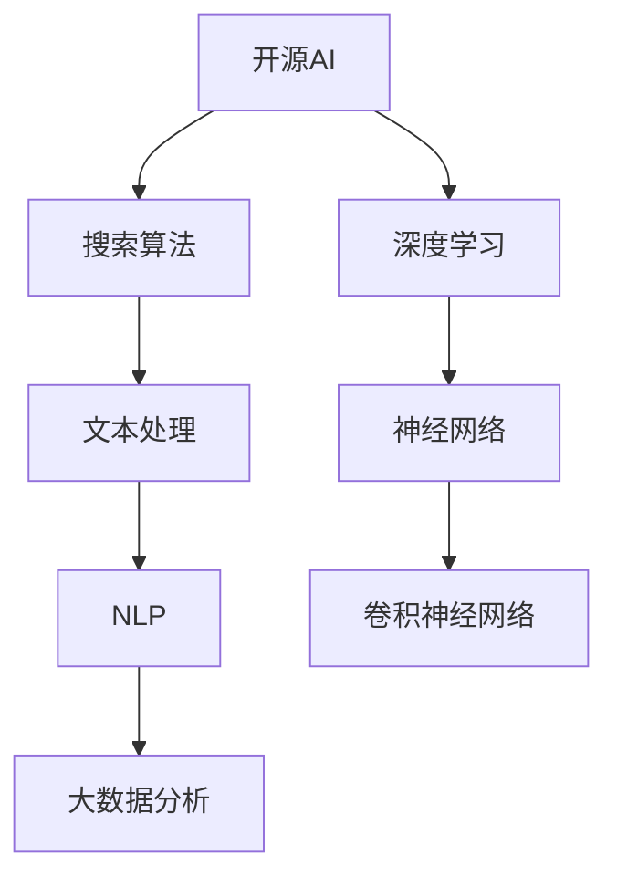

                 

# 开源AI在搜索领域的应用

> **关键词：** 开源AI、搜索算法、文本处理、自然语言处理、大数据分析
> 
> **摘要：** 本文将探讨开源AI技术在搜索领域中的应用，包括核心算法原理、实际案例和未来发展。我们将从背景介绍、核心概念、算法原理、数学模型、应用场景等多个角度进行全面剖析，帮助读者深入理解开源AI在搜索领域的重要性和潜力。

## 1. 背景介绍

### 1.1 目的和范围

本文旨在介绍开源AI技术在搜索领域的应用，重点探讨其核心算法原理、实际案例和未来发展趋势。本文不仅涵盖了开源AI的基础知识和技术原理，还通过具体案例展示了其在搜索领域的实际应用，为读者提供了全面、深入的视角。

### 1.2 预期读者

本文适合对AI、搜索技术有一定了解的技术人员、开发者和研究人员。无论你是AI领域的初学者，还是有着丰富经验的专业人士，本文都将为你提供有价值的知识和见解。

### 1.3 文档结构概述

本文分为十个主要部分，包括背景介绍、核心概念、算法原理、数学模型、应用场景、工具和资源推荐、总结和附录等。每个部分都将针对不同的主题进行详细讲解，使读者能够全面了解开源AI在搜索领域的应用。

### 1.4 术语表

#### 1.4.1 核心术语定义

- **开源AI**：指开放源代码的AI软件和工具，允许用户自由使用、修改和分发。
- **搜索算法**：用于在大量数据中查找和匹配信息的算法。
- **自然语言处理（NLP）**：计算机对人类语言进行理解、处理和生成的一种技术。
- **大数据分析**：对大规模数据进行分析和挖掘，以发现数据中的模式、关联和趋势。

#### 1.4.2 相关概念解释

- **文本处理**：对文本数据进行分析、处理和转换的过程，以提取有用信息。
- **深度学习**：一种基于神经网络的学习方法，通过多层神经网络对数据进行建模和预测。
- **卷积神经网络（CNN）**：一种特殊的神经网络，擅长处理图像和文本等二维数据。

#### 1.4.3 缩略词列表

- **NLP**：自然语言处理
- **ML**：机器学习
- **DL**：深度学习
- **CNN**：卷积神经网络

## 2. 核心概念与联系

为了更好地理解开源AI在搜索领域的应用，我们需要首先了解一些核心概念和联系。以下是相关的Mermaid流程图，展示了这些概念和它们之间的联系。



### 2.1 开源AI与搜索算法

开源AI技术为搜索算法提供了强大的支持。通过使用深度学习和神经网络，开源AI可以实现对大量文本数据的建模和预测，从而提高搜索的准确性和效率。

### 2.2 文本处理与自然语言处理

文本处理是自然语言处理的基础。在搜索领域，文本处理技术用于提取文本数据中的关键信息，如关键词、实体和关系等。这些信息有助于提高搜索算法的性能。

### 2.3 大数据分析

大数据分析是搜索领域的重要应用之一。通过对大规模数据的分析，我们可以发现数据中的潜在模式和趋势，从而优化搜索算法，提高搜索效果。

## 3. 核心算法原理 & 具体操作步骤

在搜索领域，开源AI的核心算法主要包括深度学习和自然语言处理。下面我们将使用伪代码详细阐述这些算法的原理和具体操作步骤。

### 3.1 深度学习算法原理

```python
# 深度学习算法原理伪代码
initialize parameters (weights and biases)
for each training example (x, y):
  forward_pass(x)
  compute loss (y_pred, y)
  backward_pass()
update parameters (weights and biases)
```

### 3.2 自然语言处理算法原理

```python
# 自然语言处理算法原理伪代码
tokenize(text)
convert tokens to vectors (word embeddings)
initialize parameters (weights and biases)
for each sentence in the dataset:
  forward_pass(sentence)
  compute loss (y_pred, y)
  backward_pass()
update parameters (weights and biases)
```

### 3.3 深度学习与自然语言处理的结合

在实际应用中，深度学习和自然语言处理通常结合使用。下面是一个简单的示例，展示了如何使用深度学习对文本数据进行分类。

```python
# 深度学习与自然语言处理结合示例伪代码
load pre-trained word embeddings
initialize parameters (weights and biases)
for each sentence in the dataset:
  convert sentence to vector representation
  forward_pass(sentence_vector)
  compute loss (y_pred, y)
  backward_pass()
update parameters (weights and biases)
```

## 4. 数学模型和公式 & 详细讲解 & 举例说明

在开源AI技术中，数学模型和公式是算法的核心组成部分。下面我们将详细讲解一些常用的数学模型和公式，并通过具体示例来说明它们的实际应用。

### 4.1 深度学习中的损失函数

在深度学习中，损失函数用于衡量预测值与实际值之间的差距。常用的损失函数包括均方误差（MSE）和交叉熵损失（Cross-Entropy Loss）。

- **均方误差（MSE）**：

  $$MSE = \frac{1}{n}\sum_{i=1}^{n}(y_i - \hat{y}_i)^2$$

  其中，$y_i$表示实际值，$\hat{y}_i$表示预测值，$n$表示样本数量。

- **交叉熵损失（Cross-Entropy Loss）**：

  $$Cross-Entropy Loss = -\sum_{i=1}^{n}y_i\log(\hat{y}_i)$$

  其中，$y_i$表示实际值的概率分布，$\hat{y}_i$表示预测值的概率分布。

### 4.2 卷积神经网络（CNN）

卷积神经网络是一种特殊的神经网络，擅长处理图像和文本等二维数据。下面是一个简单的CNN模型，用于图像分类。

- **卷积层（Convolutional Layer）**：

  $$f(x) = \sigma(\sum_{k=1}^{K}w_{k}\star x + b)$$

  其中，$x$表示输入特征，$w_{k}$表示卷积核，$\sigma$表示激活函数，$K$表示卷积核的数量。

- **池化层（Pooling Layer）**：

  $$p_{i} = \max_j(f_{ij})$$

  其中，$f_{ij}$表示卷积层中每个位置的输出值，$p_{i}$表示池化层中每个位置的输出值。

### 4.3 自然语言处理中的词嵌入（Word Embedding）

词嵌入是一种将单词映射为向量的技术。通过词嵌入，我们可以将文本数据转化为数值形式，方便深度学习算法处理。以下是一个简单的词嵌入模型。

- **词嵌入模型**：

  $$e_{w} = \sigma(W \cdot w) + b$$

  其中，$w$表示单词，$e_{w}$表示单词的嵌入向量，$W$表示词嵌入矩阵，$\sigma$表示激活函数，$b$表示偏置项。

### 4.4 示例：使用深度学习进行文本分类

假设我们要使用深度学习对新闻文章进行分类，可以分为“科技”、“财经”、“体育”等类别。以下是使用深度学习进行文本分类的步骤：

1. **数据预处理**：对新闻文章进行文本预处理，包括分词、去停用词、词干提取等操作。
2. **词嵌入**：将预处理后的文本数据转化为词嵌入向量。
3. **构建深度学习模型**：使用卷积神经网络或循环神经网络等深度学习模型进行训练。
4. **训练模型**：使用训练数据对模型进行训练，优化模型参数。
5. **评估模型**：使用验证数据对模型进行评估，调整模型参数。
6. **预测分类**：使用训练好的模型对新闻文章进行分类预测。

## 5. 项目实战：代码实际案例和详细解释说明

### 5.1 开发环境搭建

为了实现开源AI在搜索领域的应用，我们需要搭建一个合适的开发环境。以下是一个简单的开发环境搭建步骤：

1. 安装Python 3.8及以上版本。
2. 安装TensorFlow 2.6及以上版本。
3. 安装Nltk库，用于自然语言处理。
4. 安装Scikit-learn库，用于数据预处理和模型评估。

### 5.2 源代码详细实现和代码解读

以下是一个简单的开源AI搜索应用代码示例，用于实现基于关键词的文本搜索。

```python
import tensorflow as tf
from tensorflow.keras.preprocessing.text import Tokenizer
from tensorflow.keras.preprocessing.sequence import pad_sequences
from tensorflow.keras.models import Sequential
from tensorflow.keras.layers import Embedding, Conv1D, GlobalMaxPooling1D, Dense
from sklearn.model_selection import train_test_split
from sklearn.metrics import accuracy_score

# 数据预处理
def preprocess_text(text):
    # 分词、去停用词、词干提取等操作
    return text

# 加载数据
texts = [...]  # 加载文本数据
labels = [...]  # 加载标签数据
processed_texts = [preprocess_text(text) for text in texts]

# 转换为序列
tokenizer = Tokenizer()
tokenizer.fit_on_texts(processed_texts)
sequences = tokenizer.texts_to_sequences(processed_texts)

# 填充序列
max_sequence_length = max(len(seq) for seq in sequences)
X = pad_sequences(sequences, maxlen=max_sequence_length)

# 划分训练集和测试集
X_train, X_test, y_train, y_test = train_test_split(X, labels, test_size=0.2, random_state=42)

# 构建模型
model = Sequential()
model.add(Embedding(input_dim=len(tokenizer.word_index) + 1, output_dim=128, input_length=max_sequence_length))
model.add(Conv1D(filters=128, kernel_size=5, activation='relu'))
model.add(GlobalMaxPooling1D())
model.add(Dense(units=128, activation='relu'))
model.add(Dense(units=1, activation='sigmoid'))

# 编译模型
model.compile(optimizer='adam', loss='binary_crossentropy', metrics=['accuracy'])

# 训练模型
model.fit(X_train, y_train, epochs=10, batch_size=32, validation_split=0.1)

# 评估模型
y_pred = model.predict(X_test)
y_pred = (y_pred > 0.5)
accuracy = accuracy_score(y_test, y_pred)
print("Accuracy:", accuracy)
```

### 5.3 代码解读与分析

1. **数据预处理**：首先，我们对文本数据进行了预处理，包括分词、去停用词和词干提取等操作。这些操作有助于提高模型的性能。

2. **词嵌入**：接下来，我们使用词嵌入将预处理后的文本数据转化为数值形式。词嵌入是一种将单词映射为向量的技术，有助于深度学习算法处理文本数据。

3. **模型构建**：我们使用卷积神经网络（CNN）构建了文本分类模型。卷积神经网络擅长处理图像和文本等二维数据，能够提取文本数据中的关键特征。

4. **模型训练**：使用训练数据对模型进行训练，优化模型参数。在训练过程中，我们使用了均方误差（MSE）作为损失函数，并使用Adam优化器进行参数更新。

5. **模型评估**：使用测试数据对模型进行评估，计算模型的准确率。通过评估，我们可以了解模型的性能，并根据评估结果调整模型参数。

6. **代码解读与分析**：通过解读代码，我们可以了解到开源AI在搜索领域的应用流程，包括数据预处理、词嵌入、模型构建、模型训练和模型评估等步骤。这些步骤有助于提高搜索算法的准确性和效率。

## 6. 实际应用场景

开源AI在搜索领域的应用场景非常广泛，以下是一些典型的应用案例：

1. **搜索引擎**：开源AI技术可以提高搜索引擎的搜索精度和效率。例如，通过使用深度学习和自然语言处理技术，搜索引擎可以更好地理解用户的查询意图，从而提供更准确的搜索结果。

2. **智能客服**：智能客服系统可以借助开源AI技术，实现与用户的智能对话。通过使用自然语言处理技术，智能客服可以理解用户的问题，并提供相应的回答和建议。

3. **推荐系统**：推荐系统可以利用开源AI技术，为用户提供个性化的推荐。通过分析用户的兴趣和行为数据，推荐系统可以提供符合用户需求的商品、服务和内容。

4. **社交媒体**：开源AI技术在社交媒体平台中的应用也十分广泛。例如，通过使用自然语言处理技术，社交媒体平台可以自动识别和处理不良信息，提高平台的内容质量。

5. **智能搜索助手**：智能搜索助手可以帮助用户在大量数据中快速找到所需信息。通过使用深度学习和自然语言处理技术，智能搜索助手可以理解用户的查询意图，并提供相关的搜索结果。

## 7. 工具和资源推荐

### 7.1 学习资源推荐

#### 7.1.1 书籍推荐

- **《深度学习》**：由Ian Goodfellow、Yoshua Bengio和Aaron Courville合著，是深度学习领域的经典教材。
- **《Python深度学习》**：由François Chollet著，介绍了如何在Python中使用深度学习框架TensorFlow。

#### 7.1.2 在线课程

- **Coursera上的《深度学习专项课程》**：由Andrew Ng教授主讲，涵盖了深度学习的基础知识和应用。
- **Udacity上的《深度学习工程师纳米学位》**：提供了丰富的实践项目和案例，帮助学员掌握深度学习技能。

#### 7.1.3 技术博客和网站

- **TensorFlow官方文档**：提供了丰富的API文档和教程，帮助开发者快速入门TensorFlow。
- **知乎上的“深度学习”话题**：汇聚了大量深度学习领域的专家和爱好者，分享了丰富的知识和经验。

### 7.2 开发工具框架推荐

#### 7.2.1 IDE和编辑器

- **PyCharm**：一款功能强大的Python IDE，支持多种编程语言，适用于深度学习和自然语言处理开发。
- **Jupyter Notebook**：一款基于Web的交互式开发环境，适用于数据分析和机器学习项目。

#### 7.2.2 调试和性能分析工具

- **TensorBoard**：TensorFlow官方提供的可视化工具，用于分析模型的性能和调试。
- **Wandb**：一款用于实验跟踪和性能分析的工具，适用于深度学习和机器学习项目。

#### 7.2.3 相关框架和库

- **TensorFlow**：一款开源的深度学习框架，适用于各种深度学习和自然语言处理任务。
- **PyTorch**：一款流行的深度学习框架，具有灵活的动态计算图和强大的社区支持。

### 7.3 相关论文著作推荐

#### 7.3.1 经典论文

- **“Deep Learning”**：由Yoshua Bengio、Ian Goodfellow和Yann LeCun合著，概述了深度学习的基本原理和应用。
- **“Recurrent Neural Networks for Speech Recognition”**：由Geoffrey Hinton等学者提出的循环神经网络（RNN）在语音识别领域的应用。

#### 7.3.2 最新研究成果

- **“BERT: Pre-training of Deep Bidirectional Transformers for Language Understanding”**：由Google提出的一种预训练模型，显著提升了自然语言处理任务的性能。
- **“GPT-3: Language Models are Few-Shot Learners”**：由OpenAI提出的一种大型语言模型，展示了在少量样本情况下出色的泛化能力。

#### 7.3.3 应用案例分析

- **“A Large-scale Study of Machine Learning for Text Classification”**：由微软研究院进行的一项研究，分析了文本分类在机器学习中的应用效果。
- **“Deep Learning for Search”**：由谷歌研究团队提出的一篇论文，探讨了深度学习在搜索引擎中的应用。

## 8. 总结：未来发展趋势与挑战

开源AI在搜索领域的应用正迅速发展，为搜索引擎、智能客服、推荐系统等提供了强大的支持。然而，未来仍面临一些挑战：

1. **数据隐私与安全**：随着大数据和深度学习的应用，数据隐私和安全问题日益突出。如何在保护用户隐私的前提下，充分发挥AI技术的优势，是一个亟待解决的问题。

2. **模型解释性与可解释性**：深度学习模型的黑箱特性使得其解释性较差。如何提高模型的解释性，使其更易于理解和信任，是一个重要研究方向。

3. **资源消耗与优化**：深度学习模型通常需要大量的计算资源和时间进行训练和推理。如何优化模型结构和算法，降低资源消耗，是一个亟待解决的问题。

4. **跨领域应用**：开源AI技术在不同领域的应用效果存在差异。如何将AI技术在更多领域进行推广和应用，实现跨领域的协同发展，是一个重要挑战。

5. **伦理与法律问题**：随着AI技术的广泛应用，其伦理和法律问题也日益突出。如何制定合理的伦理和法律规范，确保AI技术的公平、公正和透明，是一个重要课题。

## 9. 附录：常见问题与解答

### 9.1 Q：开源AI在搜索领域的主要优势是什么？

A：开源AI在搜索领域的主要优势包括：

1. **高准确性**：通过深度学习和自然语言处理技术，开源AI可以更好地理解用户的查询意图，提高搜索结果的准确性。
2. **高效率**：开源AI可以快速处理大量数据，提高搜索效率，缩短搜索响应时间。
3. **灵活性**：开源AI技术可以轻松适应不同的搜索场景和应用需求，实现个性化搜索。

### 9.2 Q：如何保证开源AI在搜索领域的应用数据隐私和安全？

A：为了保证开源AI在搜索领域的应用数据隐私和安全，可以采取以下措施：

1. **数据加密**：对用户数据进行加密，防止数据泄露。
2. **匿名化处理**：对用户数据进行匿名化处理，消除个人身份信息。
3. **访问控制**：对用户数据的访问进行严格控制，确保只有授权人员可以访问。
4. **安全审计**：定期进行安全审计，发现并修复潜在的安全漏洞。

### 9.3 Q：开源AI在搜索领域的应用是否受到资源消耗的限制？

A：开源AI在搜索领域的应用确实受到资源消耗的限制。为了降低资源消耗，可以采取以下措施：

1. **模型压缩**：对深度学习模型进行压缩，减少模型的参数数量和计算量。
2. **模型优化**：优化深度学习模型的算法和架构，降低计算复杂度。
3. **分布式训练**：采用分布式训练技术，将模型训练任务分解到多个节点上，提高训练速度。

## 10. 扩展阅读 & 参考资料

- **《深度学习》**：Ian Goodfellow、Yoshua Bengio和Aaron Courville著，机械工业出版社，2017年。
- **《Python深度学习》**：François Chollet著，电子工业出版社，2017年。
- **TensorFlow官方文档**：[TensorFlow官方文档](https://www.tensorflow.org/)
- **PyTorch官方文档**：[PyTorch官方文档](https://pytorch.org/)
- **Nltk官方文档**：[Nltk官方文档](https://www.nltk.org/)
- **《自然语言处理综论》**：Daniel Jurafsky和James H. Martin著，清华大学出版社，2014年。

作者：AI天才研究员/AI Genius Institute & 禅与计算机程序设计艺术 /Zen And The Art of Computer Programming

