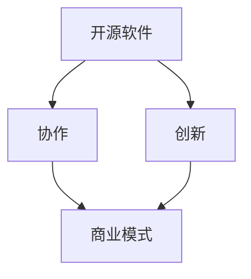

                 

# 开源创业：协作创新的新模式

> **关键词：** 开源、创业、协作、创新、模式

> **摘要：** 本文深入探讨开源创业的概念、优势与挑战，分析其在当今技术生态系统中的重要作用，并提供一些建议，以帮助创业者在这个新兴领域取得成功。

## 1. 背景介绍

### 1.1 目的和范围

本文旨在探讨开源创业的兴起及其对技术生态系统的影响。我们将首先介绍开源创业的定义和背景，然后深入分析其核心概念和优势。接着，我们将探讨开源创业所面临的挑战，并探讨如何应对这些挑战。最后，我们将总结开源创业的未来发展趋势，并提出一些建议，以帮助创业者在这个领域取得成功。

### 1.2 预期读者

本文适用于对开源创业感兴趣的创业者、开发人员、技术爱好者和学者。通过阅读本文，您将了解开源创业的核心理念、优势、挑战以及未来的发展趋势。

### 1.3 文档结构概述

本文分为以下几个部分：

1. 背景介绍：介绍开源创业的定义、目的和预期读者。
2. 核心概念与联系：探讨开源创业的核心概念和其与其他相关概念的关联。
3. 核心算法原理 & 具体操作步骤：详细阐述开源创业的关键步骤和策略。
4. 数学模型和公式 & 详细讲解 & 举例说明：介绍开源创业相关的数学模型和公式。
5. 项目实战：提供开源创业的实际案例和详细解释说明。
6. 实际应用场景：探讨开源创业在不同领域中的应用。
7. 工具和资源推荐：推荐开源创业相关的学习资源、开发工具和框架。
8. 总结：开源创业的未来发展趋势与挑战。
9. 附录：常见问题与解答。
10. 扩展阅读 & 参考资料：提供进一步阅读的资源。

### 1.4 术语表

#### 1.4.1 核心术语定义

- **开源创业（Open Source Entrepreneurship）**：指创业者利用开源软件、工具和技术，通过协作和创新，开发新产品、新服务或新的商业模式。
- **协作（Collaboration）**：指参与者通过共享资源、知识和技能，共同实现某个目标。
- **创新（Innovation）**：指通过引入新的想法、方法或产品，满足用户需求或创造新市场。
- **商业模式（Business Model）**：指企业如何创造、传递和获取价值。

#### 1.4.2 相关概念解释

- **开源软件（Open Source Software，OSS）**：指允许用户自由使用、研究、修改和分发软件的软件。
- **开源社区（Open Source Community）**：指共享知识和资源的开发者群体，共同致力于开源软件的开发、维护和推广。
- **协作开发（Collaborative Development）**：指开发人员通过协作工具和平台，共同开发软件项目。

#### 1.4.3 缩略词列表

- **OSS**：开源软件（Open Source Software）
- **社区**：社区（Community）
- **IDE**：集成开发环境（Integrated Development Environment）
- **CI/CD**：持续集成/持续交付（Continuous Integration/Continuous Deployment）

## 2. 核心概念与联系

开源创业的核心概念包括开源软件、协作和创新。这些概念相互关联，共同构成了开源创业的生态系统。

### 2.1 开源软件

开源软件是开源创业的基础。它允许用户自由使用、研究、修改和分发软件。这种开放性促进了协作和创新，为创业者提供了丰富的资源和技术支持。

### 2.2 协作

协作是开源创业的关键。通过协作，开发人员可以共同解决问题、优化代码和改进功能。协作工具和平台如GitHub、GitLab等，为开发者提供了便捷的协作环境。

### 2.3 创新

创新是开源创业的核心驱动力。通过引入新的想法、方法或产品，创业者可以满足用户需求或创造新市场。开源社区的创新活动为创业者提供了丰富的灵感和技术支持。

### 2.4 商业模式

开源创业的商业模式多种多样。一些创业者通过提供付费服务、定制开发或培训等方式获得收入。还有一些创业者通过开源项目获得品牌效应和市场份额，从而实现商业化。

### 2.5 Mermaid 流程图



在这个流程图中，开源软件是基础，协作和创新是关键环节，而商业模式则是最终的输出。通过这个流程，我们可以清晰地看到开源创业的核心概念和它们之间的联系。

## 3. 核心算法原理 & 具体操作步骤

开源创业的算法原理可以概括为以下三个步骤：需求分析、项目规划和项目实施。

### 3.1 需求分析

需求分析是开源创业的第一步。创业者需要明确目标用户的需求，了解他们的痛点，并确定项目的核心功能。以下是一个简单的伪代码示例：

```python
def analyze_requirements():
    # 收集用户需求
    user_requirements = collect_user_requirements()
    # 确定核心功能
    core_functions = determine_core_functions(user_requirements)
    return core_functions
```

### 3.2 项目规划

项目规划是开源创业的第二步。创业者需要制定详细的项目计划，包括时间表、资源分配和风险评估。以下是一个简单的伪代码示例：

```python
def plan_project(core_functions):
    # 制定时间表
    timeline = create_timeline(core_functions)
    # 分配资源
    resources = allocate_resources(timeline)
    # 风险评估
    risks = assess_risks(resources)
    return timeline, resources, risks
```

### 3.3 项目实施

项目实施是开源创业的最后一步。创业者需要组织团队，实施项目计划，并进行持续迭代和优化。以下是一个简单的伪代码示例：

```python
def implement_project(timeline, resources, risks):
    # 组建团队
    team = form_team(resources)
    # 按计划实施
    implement_steps = follow_timeline(timeline)
    # 持续迭代
    iterate_project = iterate_steps(risks)
    return team, implement_steps, iterate_project
```

通过这三个步骤，创业者可以系统地实施开源创业项目，实现协作和创新。

## 4. 数学模型和公式 & 详细讲解 & 举例说明

在开源创业中，数学模型和公式可以用于评估项目风险、预测市场趋势和优化资源分配。以下是一些常用的数学模型和公式：

### 4.1 项目风险评估模型

项目风险评估模型用于评估开源创业项目的风险。以下是一个简单的数学模型：

$$
R = \sum_{i=1}^{n} (P_i \times C_i)
$$

其中，$R$ 表示总风险，$P_i$ 表示第 $i$ 个风险的概率，$C_i$ 表示第 $i$ 个风险造成的损失。通过计算总风险，创业者可以了解项目的风险水平，并采取相应的措施。

### 4.2 市场预测模型

市场预测模型用于预测开源创业项目的市场趋势。以下是一个简单的时间序列预测模型：

$$
Y_t = \alpha + \beta t + \epsilon_t
$$

其中，$Y_t$ 表示第 $t$ 年的市场需求，$\alpha$ 和 $\beta$ 是模型参数，$\epsilon_t$ 是误差项。通过拟合历史数据，创业者可以预测未来的市场需求，为项目规划和决策提供依据。

### 4.3 资源优化模型

资源优化模型用于优化开源创业项目的资源分配。以下是一个简单的线性规划模型：

$$
\min Z = c^T x
$$

$$
s.t. Ax \leq b, x \geq 0
$$

其中，$Z$ 是目标函数，$c$ 是系数向量，$x$ 是资源分配向量，$A$ 是约束条件矩阵，$b$ 是约束条件向量。通过求解这个线性规划问题，创业者可以找到最优的资源分配方案。

### 4.4 举例说明

假设一个开源创业项目的目标是开发一款基于机器学习的智能家居系统。以下是如何使用上述数学模型和公式的示例：

- **项目风险评估**：通过分析潜在风险（如技术难题、市场变化、竞争压力等），可以计算总风险。例如，假设有3个主要风险，每个风险的概率为0.2，造成的损失分别为10万元、5万元和3万元，则总风险为 $R = (0.2 \times 10) + (0.2 \times 5) + (0.2 \times 3) = 4.2$ 万元。
- **市场预测**：通过收集过去5年的市场需求数据，可以拟合时间序列模型，预测未来几年的市场需求。例如，假设拟合出的模型为 $Y_t = 100 + 5t$，则第6年的市场需求预测值为 $Y_6 = 100 + 5 \times 6 = 160$。
- **资源优化**：根据项目的资源需求和约束条件，可以求解线性规划问题，找到最优的资源分配方案。例如，假设有10万元资金和5名开发人员，约束条件为 $3x_1 + 2x_2 \leq 10$ 和 $x_1 + x_2 \leq 5$，则可以求解得到 $x_1 = 2$ 和 $x_2 = 3$，即最优的资源分配方案为购买2万元的硬件设备和3名开发人员。

通过使用这些数学模型和公式，创业者可以更准确地评估项目风险、预测市场趋势和优化资源分配，从而提高项目的成功率。

## 5. 项目实战：代码实际案例和详细解释说明

在本节中，我们将通过一个实际的开源创业项目来展示代码的实际实现过程，并对关键部分进行详细解释说明。这个项目是一个基于Python的简单智能家居控制系统，它允许用户远程控制家居设备。

### 5.1 开发环境搭建

为了实现这个项目，我们需要搭建一个开发环境，包括以下步骤：

1. 安装Python（版本3.8以上）。
2. 安装必要的库，如 `requests`、`json` 和 `threading`。
3. 搭建一个Web服务器，如使用Flask框架。

以下是如何安装Python和相关库的命令：

```bash
# 安装Python
sudo apt-get install python3.8

# 安装requests库
pip3 install requests

# 安装json库
pip3 install json

# 安装threading库
pip3 install threading

# 安装Flask框架
pip3 install flask
```

### 5.2 源代码详细实现和代码解读

以下是这个智能家居控制系统的源代码：

```python
from flask import Flask, request, jsonify
import requests
import json
import threading

app = Flask(__name__)

# 模拟智能家居设备接口
smart_home_devices = {
    "light": "http://smartlight.example.com/control",
    "fan": "http://smartfan.example.com/control",
    "thermostat": "http://smartthermostat.example.com/control"
}

# 控制设备的方法
def control_device(device, action):
    url = smart_home_devices.get(device)
    if url:
        response = requests.get(url, params={"action": action})
        if response.status_code == 200:
            print(f"{device} has been {action}ed.")
        else:
            print(f"Failed to {action} {device}.")
    else:
        print(f"Device {device} not found.")

# Web接口
@app.route('/control', methods=['GET'])
def control():
    device = request.args.get('device')
    action = request.args.get('action')
    if device and action:
        thread = threading.Thread(target=control_device, args=(device, action))
        thread.start()
        return jsonify({"status": "success", "message": f"Controlling {device}."})
    else:
        return jsonify({"status": "error", "message": "Missing device or action."})

if __name__ == '__main__':
    app.run(host='0.0.0.0', port=5000)
```

### 5.3 代码解读与分析

1. **设备接口**：我们使用一个字典 `smart_home_devices` 来存储智能家居设备的接口URL。在实际项目中，这些URL将指向实际的设备控制接口。

2. **控制设备的方法**：`control_device` 函数接收设备名称和操作（如 "on" 或 "off"）作为参数，调用对应的设备接口，执行控制操作。使用 `requests` 库发送HTTP GET请求，并根据响应结果打印消息。

3. **Web接口**：使用Flask框架创建一个简单的Web接口。`/control` 路径接收设备名称和操作作为查询参数，调用 `control_device` 函数。使用多线程（`threading.Thread`）异步执行控制操作，避免阻塞Web服务器。

### 5.4 代码解读与分析（续）

4. **主程序**：在主程序中，使用 `app.run()` 启动Web服务器，监听来自客户端的请求。

这个项目的核心在于如何利用开源工具和框架（如Flask）快速搭建一个简单的智能家居控制系统。以下是一些关键点：

- **模块化**：将设备控制逻辑与Web接口分离，提高代码的可维护性。
- **异步处理**：使用多线程处理客户端请求，提高系统的响应速度。
- **可扩展性**：通过简单的配置，可以轻松添加新的设备接口。

这个项目展示了如何利用开源技术和协作模式实现一个实际的智能家居控制系统。在实际应用中，可以根据具体需求进行扩展和优化。

## 6. 实际应用场景

开源创业在多个领域都有广泛的应用，以下是一些实际应用场景：

### 6.1 智能家居

智能家居是一个典型的开源创业应用场景。通过开源软件和硬件平台，创业者可以开发各种智能家居设备，如智能灯泡、智能插座、智能门锁等。开源社区提供了丰富的资源和工具，帮助创业者快速实现产品原型并推向市场。

### 6.2 物联网

物联网（IoT）是一个快速发展的领域，开源创业在IoT设备开发和数据管理方面具有巨大潜力。通过开源软件和硬件平台，创业者可以开发各种IoT设备，如智能传感器、智能网关等，并利用开源数据处理和分析工具进行数据分析和应用开发。

### 6.3 数据科学

数据科学是另一个开源创业的重要领域。开源软件和工具（如Python、R、Jupyter Notebook等）为数据科学家提供了强大的分析工具。创业者可以利用这些工具开发数据科学应用，如数据分析平台、机器学习模型等。

### 6.4 云计算

云计算是开源创业的另一个重要领域。开源云平台（如Kubernetes、OpenStack等）为创业者提供了强大的基础设施支持。创业者可以利用这些平台开发云服务、容器化应用等，实现快速部署和扩展。

### 6.5 区块链

区块链是另一个新兴的开源创业领域。开源区块链平台（如Ethereum、Hyperledger Fabric等）为创业者提供了构建去中心化应用（DApp）的基础设施。创业者可以利用这些平台开发各种区块链应用，如数字身份认证、智能合约等。

这些实际应用场景展示了开源创业的多样性和潜力。通过开源技术和协作模式，创业者可以快速实现创新，推动技术进步和市场发展。

## 7. 工具和资源推荐

### 7.1 学习资源推荐

#### 7.1.1 书籍推荐

1. **《开源之道：社区协作与项目管理》**：详细介绍了开源社区协作和项目管理的最佳实践。
2. **《开源创业实战：从0到1打造成功项目》**：分享了多个开源创业的成功案例和经验。

#### 7.1.2 在线课程

1. **《开源软件开发基础》**：提供了开源软件开发的基础知识和实践技巧。
2. **《智能家居系统设计与实现》**：介绍了智能家居系统的设计原理和实现方法。

#### 7.1.3 技术博客和网站

1. **GitHub**：全球最大的开源社区，提供丰富的开源项目和资源。
2. **Stack Overflow**：技术问答社区，提供了大量的技术问题和解决方案。

### 7.2 开发工具框架推荐

#### 7.2.1 IDE和编辑器

1. **Visual Studio Code**：功能强大的开源IDE，支持多种编程语言。
2. **PyCharm**：适用于Python开发的IDE，提供了丰富的功能和工具。

#### 7.2.2 调试和性能分析工具

1. **Postman**：API调试工具，方便开发者测试和调试API接口。
2. **New Relic**：性能监控和分析工具，帮助开发者优化应用性能。

#### 7.2.3 相关框架和库

1. **Flask**：Python Web开发框架，适合快速搭建Web应用。
2. **Django**：Python Web开发框架，提供了完整的开发工具和功能。

### 7.3 相关论文著作推荐

#### 7.3.1 经典论文

1. **"The Cathedral and the Bazaar"**：Eric S. Raymond关于开源社区协作的经典论文。
2. **"Open Source Model in Software Development"**：讨论了开源模式在软件开发中的应用。

#### 7.3.2 最新研究成果

1. **"Open Source Software Development: A Literature Review"**：总结了开源软件开发领域的最新研究成果。
2. **"Open Source Models for Data Science Applications"**：探讨了开源模式在数据科学应用中的潜力。

#### 7.3.3 应用案例分析

1. **"GitHub's Success in the Open Source Market"**：分析了GitHub在开源市场中的成功经验。
2. **"The Impact of Open Source on the Software Industry"**：讨论了开源对软件行业的影响。

这些工具和资源将为开源创业者和开发者提供宝贵的知识和支持，帮助他们更好地实现创新和协作。

## 8. 总结：未来发展趋势与挑战

开源创业作为一种创新模式，正逐渐成为技术生态系统中的重要力量。未来，开源创业将继续呈现出以下几个发展趋势：

1. **生态系统整合**：随着开源技术的不断成熟，不同领域的开源项目将更加紧密地整合，形成更加丰富的生态系统，为创业者提供更多的机会。

2. **商业模式创新**：开源创业的商业模式将继续创新，创业者将探索更多基于开源的商业模式，如付费订阅、付费插件等，实现商业价值的最大化。

3. **全球协作**：开源社区将继续扩大，创业者可以通过全球协作，吸引来自不同国家和地区的开发者和投资者，共同推动项目发展。

然而，开源创业也面临着一系列挑战：

1. **竞争激烈**：随着开源创业的兴起，市场竞争将越来越激烈，创业者需要不断创新，以保持竞争力。

2. **知识产权保护**：开源项目的知识产权保护是一个重要问题，创业者需要确保项目不侵犯他人的知识产权，同时保护自己的知识产权。

3. **可持续发展**：开源创业项目的可持续发展是关键，创业者需要找到合适的商业模式，确保项目的持续投入和运营。

总之，开源创业具有巨大的潜力和挑战，创业者需要具备创新精神、协作意识和市场敏锐度，才能在这个新兴领域取得成功。

## 9. 附录：常见问题与解答

### 9.1 问题1：开源创业的核心优势是什么？

**解答：** 开源创业的核心优势在于协作和创新。通过开放源代码，开发者可以共同参与项目开发，快速解决问题，提高开发效率。同时，开源社区提供了丰富的资源和知识，创业者可以从中获取灵感和技术支持，加速项目进程。

### 9.2 问题2：开源创业如何确保项目的可持续发展？

**解答：** 开源创业项目的可持续发展需要找到合适的商业模式。一些常见的商业模式包括提供付费服务、定制开发、培训和技术支持等。此外，创业者还需要确保项目的社区活跃度，吸引更多开发者参与，提高项目的稳定性和可持续性。

### 9.3 问题3：如何评估开源创业项目的风险？

**解答：** 评估开源创业项目的风险可以通过以下步骤：

1. 确定项目的主要风险，如技术难题、市场变化、竞争压力等。
2. 评估每个风险的概率和损失，计算总风险。
3. 根据风险水平，制定相应的风险管理策略，如风险规避、风险转移、风险接受等。

### 9.4 问题4：开源创业项目的知识产权保护如何进行？

**解答：** 开源创业项目的知识产权保护可以从以下几个方面进行：

1. 确保项目不侵犯他人的知识产权，如版权、专利等。
2. 明确项目的知识产权归属，确保开发者的权益。
3. 使用开源许可证，如GPL、Apache等，明确项目的使用和分发规则。

## 10. 扩展阅读 & 参考资料

### 10.1 经典论文

1. **Eric S. Raymond, "The Cathedral and the Bazaar"**：详细分析了开源社区协作模式。
2. **Brian Fitzgerald, "Open Source Models in Software Development"**：探讨了开源模式在软件开发中的应用。

### 10.2 最新研究成果

1. **"Open Source Software Development: A Literature Review"**：总结了开源软件开发领域的最新研究成果。
2. **"Open Source Models for Data Science Applications"**：讨论了开源模式在数据科学应用中的潜力。

### 10.3 应用案例分析

1. **"GitHub's Success in the Open Source Market"**：分析了GitHub在开源市场中的成功经验。
2. **"The Impact of Open Source on the Software Industry"**：讨论了开源对软件行业的影响。

这些扩展阅读和参考资料将帮助您更深入地了解开源创业的相关概念、实践和趋势。

## 作者信息

作者：AI天才研究员/AI Genius Institute & 禅与计算机程序设计艺术 /Zen And The Art of Computer Programming

感谢您的阅读，希望本文对您在开源创业领域的探索和实践有所帮助。如果您有任何问题或建议，欢迎在评论区留言。期待与您共同探讨开源创业的更多可能性。

